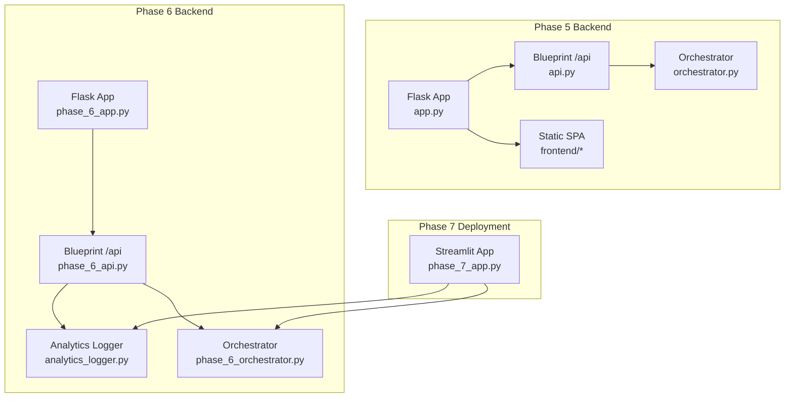
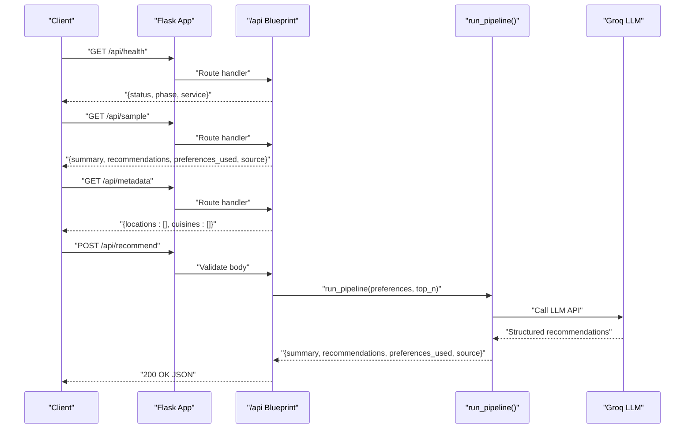
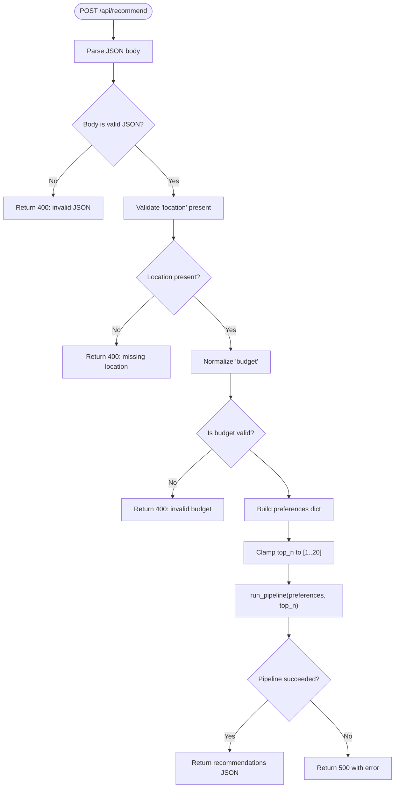
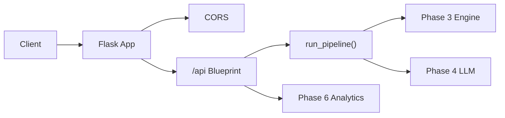

# API Reference

<cite>
**Referenced Files in This Document**
- [api.py](file://Zomato/architecture/phase_5_response_delivery/backend/api.py)
- [app.py](file://Zomato/architecture/phase_5_response_delivery/backend/app.py)
- [orchestrator.py](file://Zomato/architecture/phase_5_response_delivery/backend/orchestrator.py)
- [sample_recommendations.json](file://Zomato/architecture/phase_5_response_delivery/sample_recommendations.json)
- [metadata.json](file://Zomato/architecture/phase_5_response_delivery/metadata.json)
- [frontend/index.html](file://Zomato/architecture/phase_5_response_delivery/frontend/index.html)
- [frontend/js/app.js](file://Zomato/architecture/phase_5_response_delivery/frontend/js/app.js)
- [phase_6_api.py](file://Zomato/architecture/phase_6_monitoring/backend/api.py)
- [phase_6_app.py](file://Zomato/architecture/phase_6_monitoring/backend/app.py)
- [phase_6_orchestrator.py](file://Zomato/architecture/phase_6_monitoring/backend/orchestrator.py)
- [analytics_logger.py](file://Zomato/architecture/phase_6_monitoring/backend/analytics_logger.py)
- [phase_7_app.py](file://Zomato/architecture/phase_7_deployment/app.py)
- [phase_5_requirements.txt](file://Zomato/architecture/phase_5_response_delivery/requirements.txt)
</cite>

## Table of Contents
1. [Introduction](#introduction)
2. [Project Structure](#project-structure)
3. [Core Components](#core-components)
4. [Architecture Overview](#architecture-overview)
5. [Detailed Component Analysis](#detailed-component-analysis)
6. [Dependency Analysis](#dependency-analysis)
7. [Performance Considerations](#performance-considerations)
8. [Troubleshooting Guide](#troubleshooting-guide)
9. [Conclusion](#conclusion)
10. [Appendices](#appendices)

## Introduction
This document describes the Zomato AI Recommendation System REST API. It covers public endpoints for health checks, sample recommendations, system metadata, and the main recommendation engine. It also documents request/response schemas, error handling, authentication, CORS, rate limiting considerations, API versioning, client integration patterns, and monitoring hooks.

## Project Structure
The API is implemented as a Flask application with a dedicated backend blueprint mounted under /api. The system supports:
- Phase 5: Basic Flask API with CORS and a SPA frontend
- Phase 6: Enhanced API with analytics logging and feedback
- Phase 7: Deployment via Streamlit with analytics integration

**Diagram sources**
- [app.py:14-41](file://Zomato/architecture/phase_5_response_delivery/backend/app.py#L14-L41)
- [api.py:13-84](file://Zomato/architecture/phase_5_response_delivery/backend/api.py#L13-L84)
- [orchestrator.py:112-292](file://Zomato/architecture/phase_5_response_delivery/backend/orchestrator.py#L112-L292)
- [phase_6_app.py:14-41](file://Zomato/architecture/phase_6_monitoring/backend/app.py#L14-L41)
- [phase_6_api.py:15-119](file://Zomato/architecture/phase_6_monitoring/backend/api.py#L15-L119)
- [analytics_logger.py:13-87](file://Zomato/architecture/phase_6_monitoring/backend/analytics_logger.py#L13-L87)
- [phase_7_app.py:1-123](file://Zomato/architecture/phase_7_deployment/app.py#L1-L123)

**Section sources**
- [app.py:14-41](file://Zomato/architecture/phase_5_response_delivery/backend/app.py#L14-L41)
- [api.py:13-84](file://Zomato/architecture/phase_5_response_delivery/backend/api.py#L13-L84)
- [phase_6_app.py:14-41](file://Zomato/architecture/phase_6_monitoring/backend/app.py#L14-L41)
- [phase_6_api.py:15-119](file://Zomato/architecture/phase_6_monitoring/backend/api.py#L15-L119)
- [phase_7_app.py:1-123](file://Zomato/architecture/phase_7_deployment/app.py#L1-L123)

## Core Components
- Flask application factory registers the /api blueprint and serves a SPA for non-API routes.
- CORS is enabled globally for cross-origin requests.
- The orchestrator coordinates data loading, candidate filtering/ranking, and LLM-based re-ranking.
- Analytics logging is available in Phase 6 to record queries and feedback.

Key runtime dependencies include Flask, CORS, Pydantic, python-dotenv, and Groq SDK.

**Section sources**
- [app.py:14-41](file://Zomato/architecture/phase_5_response_delivery/backend/app.py#L14-L41)
- [phase_6_app.py:14-41](file://Zomato/architecture/phase_6_monitoring/backend/app.py#L14-L41)
- [orchestrator.py:112-292](file://Zomato/architecture/phase_5_response_delivery/backend/orchestrator.py#L112-L292)
- [phase_6_orchestrator.py:77-228](file://Zomato/architecture/phase_6_monitoring/backend/orchestrator.py#L77-L228)
- [phase_5_requirements.txt:1-6](file://Zomato/architecture/phase_5_response_delivery/requirements.txt#L1-L6)

## Architecture Overview
The API exposes four primary endpoints under /api:
- GET /api/health
- GET /api/sample
- GET /api/metadata
- POST /api/recommend

Optional Phase 6 endpoints:
- POST /api/analytics/feedback

**Diagram sources**
- [api.py:18-84](file://Zomato/architecture/phase_5_response_delivery/backend/api.py#L18-L84)
- [phase_6_api.py:20-96](file://Zomato/architecture/phase_6_monitoring/backend/api.py#L20-L96)
- [orchestrator.py:112-292](file://Zomato/architecture/phase_5_response_delivery/backend/orchestrator.py#L112-L292)
- [phase_6_orchestrator.py:77-228](file://Zomato/architecture/phase_6_monitoring/backend/orchestrator.py#L77-L228)

## Detailed Component Analysis

### Endpoint: GET /api/health
- Method: GET
- URL: /api/health
- Purpose: Health check for service readiness
- Authentication: Not required
- Success response:
  - Status: 200 OK
  - Body: JSON object containing service status, current phase, and service name
- Error response:
  - Status: 500 Internal Server Error (if thrown by framework)
- Typical client usage:
  - curl: curl -s http://host/api/health
  - JavaScript: fetch("/api/health")

Common scenarios:
- Verify service availability after deployment
- Monitor uptime in CI/CD pipelines

**Section sources**
- [api.py:18-21](file://Zomato/architecture/phase_5_response_delivery/backend/api.py#L18-L21)
- [phase_6_api.py:20-23](file://Zomato/architecture/phase_6_monitoring/backend/api.py#L20-L23)

### Endpoint: GET /api/sample
- Method: GET
- URL: /api/sample
- Purpose: Return pre-generated sample recommendations for demos
- Authentication: Not required
- Success response:
  - Status: 200 OK
  - Body: JSON object with summary, recommendations array, preferences_used, and source
- Error response:
  - Status: 500 Internal Server Error (on unexpected failures)
- Typical client usage:
  - curl: curl -s http://host/api/sample
  - JavaScript: fetch("/api/sample")

Response schema highlights:
- summary: string
- recommendations: array of objects with rank, restaurant_name, explanation, rating, cost_for_two, cuisine
- preferences_used: object with location, budget, cuisines, min_rating, optional_preferences
- source: string (e.g., "sample")

**Section sources**
- [api.py:24-29](file://Zomato/architecture/phase_5_response_delivery/backend/api.py#L24-L29)
- [sample_recommendations.json:1-53](file://Zomato/architecture/phase_5_response_delivery/sample_recommendations.json#L1-L53)

### Endpoint: GET /api/metadata
- Method: GET
- URL: /api/metadata
- Purpose: Provide unique locations and cuisines for UI dropdowns
- Authentication: Not required
- Success response:
  - Status: 200 OK
  - Body: JSON object with locations and cuisines arrays
- Error response:
  - Status: 500 Internal Server Error (exception caught and returned)
- Typical client usage:
  - curl: curl -s http://host/api/metadata
  - JavaScript: fetch("/api/metadata")

Notes:
- Data can come from precomputed metadata.json or be generated dynamically from datasets
- The frontend loads this once to populate selects

**Section sources**
- [api.py:32-38](file://Zomato/architecture/phase_5_response_delivery/backend/api.py#L32-L38)
- [metadata.json:1-196](file://Zomato/architecture/phase_5_response_delivery/metadata.json#L1-L196)
- [orchestrator.py:85-109](file://Zomato/architecture/phase_5_response_delivery/backend/orchestrator.py#L85-L109)

### Endpoint: POST /api/recommend
- Method: POST
- URL: /api/recommend
- Purpose: Compute personalized restaurant recommendations
- Authentication: Not required
- Request body (JSON):
  - location: string (required)
  - budget: string (enum: low, medium, high; default: medium)
  - cuisines: array of strings (optional)
  - min_rating: number (optional; default: 0.0)
  - optional_preferences: array of strings (optional)
  - top_n: integer (optional; clamped between 1 and 20; default: 5)
- Success response:
  - Status: 200 OK
  - Body: JSON object with summary, recommendations array, preferences_used, and source
- Error responses:
  - 400 Bad Request: invalid JSON or missing/invalid fields
  - 500 Internal Server Error: unhandled exceptions during processing
- Typical client usage:
  - curl: curl -s -X POST http://host/api/recommend -H "Content-Type: application/json" -d '{...}'
  - JavaScript: fetch("/api/recommend", { method: "POST", headers: {"Content-Type": "application/json"}, body: JSON.stringify(prefs) })

Processing logic:
- Validates presence and types of fields
- Normalizes budget to accepted values
- Clamps top_n to a safe range
- Invokes run_pipeline to compute recommendations
- Returns either live results or fallback sample data

**Diagram sources**
- [api.py:41-84](file://Zomato/architecture/phase_5_response_delivery/backend/api.py#L41-L84)

**Section sources**
- [api.py:41-84](file://Zomato/architecture/phase_5_response_delivery/backend/api.py#L41-L84)
- [orchestrator.py:112-292](file://Zomato/architecture/phase_5_response_delivery/backend/orchestrator.py#L112-L292)

### Optional Endpoint: POST /api/analytics/feedback (Phase 6)
- Method: POST
- URL: /api/analytics/feedback
- Purpose: Submit user feedback on recommendations for analytics
- Authentication: Not required
- Request body (JSON):
  - query_id: string (required)
  - restaurant_name: string (required)
  - feedback_type: string (enum: like, dislike; required)
- Success response:
  - Status: 200 OK
  - Body: JSON object with status and message
- Error responses:
  - 400 Bad Request: missing required fields or invalid feedback_type
  - 500 Internal Server Error: database or logging errors
- Typical client usage:
  - curl: curl -s -X POST http://host/api/analytics/feedback -H "Content-Type: application/json" -d '{...}'
  - JavaScript: fetch("/api/analytics/feedback", { method: "POST", headers: {"Content-Type": "application/json"}, body: JSON.stringify(feedback) })

Behavior:
- Validates inputs
- Logs feedback to analytics database
- Returns success status

**Section sources**
- [phase_6_api.py:97-119](file://Zomato/architecture/phase_6_monitoring/backend/api.py#L97-L119)
- [analytics_logger.py:72-87](file://Zomato/architecture/phase_6_monitoring/backend/analytics_logger.py#L72-L87)

## Dependency Analysis
- Flask app registers the /api blueprint and serves SPA assets for non-API routes.
- CORS is enabled globally to support browser clients.
- The orchestrator dynamically imports phase-specific modules and coordinates data loading and LLM calls.
- Phase 6 adds analytics logging and feedback endpoints.

**Diagram sources**
- [app.py:14-41](file://Zomato/architecture/phase_5_response_delivery/backend/app.py#L14-L41)
- [api.py:13-84](file://Zomato/architecture/phase_5_response_delivery/backend/api.py#L13-L84)
- [phase_6_api.py:15-119](file://Zomato/architecture/phase_6_monitoring/backend/api.py#L15-L119)
- [orchestrator.py:112-292](file://Zomato/architecture/phase_5_response_delivery/backend/orchestrator.py#L112-L292)
- [phase_6_orchestrator.py:77-228](file://Zomato/architecture/phase_6_monitoring/backend/orchestrator.py#L77-L228)

**Section sources**
- [app.py:14-41](file://Zomato/architecture/phase_5_response_delivery/backend/app.py#L14-L41)
- [phase_6_app.py:14-41](file://Zomato/architecture/phase_6_monitoring/backend/app.py#L14-L41)
- [api.py:13-84](file://Zomato/architecture/phase_5_response_delivery/backend/api.py#L13-L84)
- [phase_6_api.py:15-119](file://Zomato/architecture/phase_6_monitoring/backend/api.py#L15-L119)

## Performance Considerations
- top_n is clamped to a maximum of 20 to limit LLM token usage and latency.
- The system falls back to sample recommendations when datasets or LLM keys are unavailable, ensuring responsiveness.
- Phase 6 measures and returns a query_id to correlate logs and feedback.
- Recommendations are computed per-request with dynamic imports; caching is minimal to maintain freshness.

[No sources needed since this section provides general guidance]

## Troubleshooting Guide
Common issues and resolutions:
- Missing or invalid JSON body:
  - Symptom: 400 Bad Request with error message
  - Resolution: Ensure Content-Type is application/json and body is valid JSON
- Missing required field location:
  - Symptom: 400 Bad Request indicating missing location
  - Resolution: Provide a non-empty location string
- Invalid budget value:
  - Symptom: 400 Bad Request indicating allowed budget values
  - Resolution: Use one of low, medium, high
- LLM or dataset unavailability:
  - Symptom: Fallback to sample recommendations
  - Resolution: Verify environment variables and dataset presence
- CORS errors in browsers:
  - Symptom: Preflight or blocked requests
  - Resolution: CORS is enabled; ensure requests originate from allowed origins

Monitoring and debugging:
- Use GET /api/health to verify service readiness
- Inspect server logs for stack traces
- In Phase 6, use analytics logging to track queries and feedback

**Section sources**
- [api.py:56-84](file://Zomato/architecture/phase_5_response_delivery/backend/api.py#L56-L84)
- [phase_6_api.py:58-96](file://Zomato/architecture/phase_6_monitoring/backend/api.py#L58-L96)
- [analytics_logger.py:46-87](file://Zomato/architecture/phase_6_monitoring/backend/analytics_logger.py#L46-L87)

## Conclusion
The Zomato AI Recommendation System provides a straightforward REST API for health checks, sample data, metadata, and recommendation generation. Clients can integrate using simple HTTP requests and leverage analytics hooks in Phase 6 for richer monitoring and feedback.

[No sources needed since this section summarizes without analyzing specific files]

## Appendices

### Authentication
- No authentication is required for the documented endpoints.
- For production deployments, consider adding API keys, OAuth, or mTLS at the gateway level.

### CORS Configuration
- CORS is enabled globally in the Flask app.
- Configure allowed origins, methods, and headers according to your deployment needs.

**Section sources**
- [app.py:20-20](file://Zomato/architecture/phase_5_response_delivery/backend/app.py#L20-L20)
- [phase_6_app.py:20-20](file://Zomato/architecture/phase_6_monitoring/backend/app.py#L20-L20)

### Rate Limiting
- Not implemented at the API layer.
- Deploy a reverse proxy or gateway with rate limiting policies as needed.

### API Versioning
- No version prefix is used in URLs.
- To introduce versioning, mount blueprints under /api/v1, /api/v2, etc.

### Client Integration Guidelines
- Use the frontend SPA as a reference for request/response handling and UI state management.
- For custom clients:
  - Call GET /api/metadata once to populate UI dropdowns
  - On submit, POST /api/recommend with normalized preferences
  - Optionally POST /api/analytics/feedback with query_id to record user feedback

**Section sources**
- [frontend/js/app.js:181-278](file://Zomato/architecture/phase_5_response_delivery/frontend/js/app.js#L181-L278)
- [frontend/index.html:248-278](file://Zomato/architecture/phase_5_response_delivery/frontend/index.html#L248-L278)
- [phase_6_api.py:97-119](file://Zomato/architecture/phase_6_monitoring/backend/api.py#L97-L119)

### Protocol-Specific Examples

- Health check
  - curl -s http://host/api/health

- Get sample recommendations
  - curl -s http://host/api/sample

- Get metadata
  - curl -s http://host/api/metadata

- Get recommendations
  - curl -s -X POST http://host/api/recommend -H "Content-Type: application/json" -d '{"location":"Bangalore","budget":"medium","cuisines":["Italian"],"min_rating":4.0,"optional_preferences":[],"top_n":5}'

- Submit feedback (Phase 6)
  - curl -s -X POST http://host/api/analytics/feedback -H "Content-Type: application/json" -d '{"query_id":"<uuid>","restaurant_name":"Pasta Point","feedback_type":"like"}'

### Migration and Backwards Compatibility Notes
- Current endpoints are stable; no breaking changes observed in the referenced files.
- If introducing versioning, keep backward compatibility by supporting both old and new URL patterns during transition.

[No sources needed since this section provides general guidance]

### Monitoring and Analytics (Phase 6)
- Queries are logged with query_id, preferences, number of recommendations, and latency.
- Feedback events are stored with restaurant name and feedback type.
- Use the analytics database for reporting and dashboards.

**Section sources**
- [phase_6_api.py:82-95](file://Zomato/architecture/phase_6_monitoring/backend/api.py#L82-L95)
- [analytics_logger.py:13-87](file://Zomato/architecture/phase_6_monitoring/backend/analytics_logger.py#L13-L87)