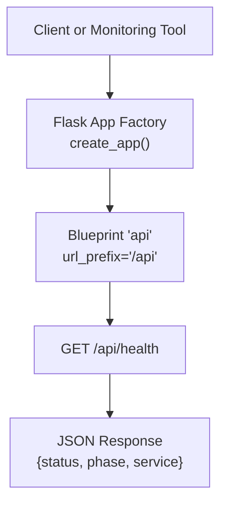
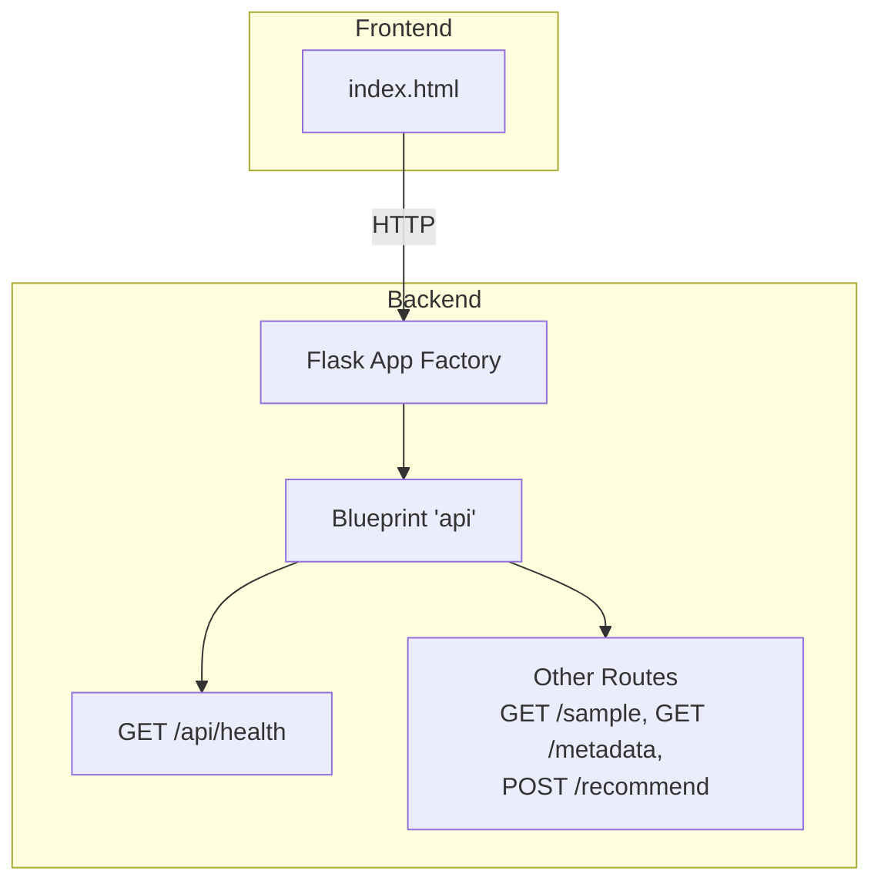
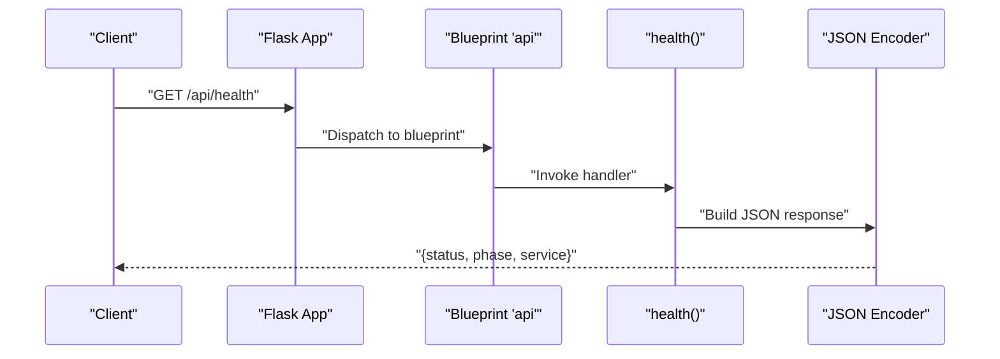
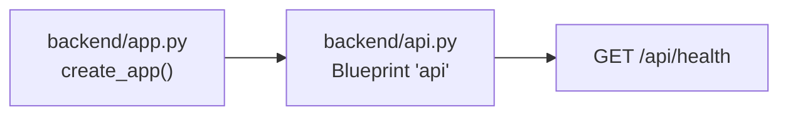

# Health Check Endpoint

<cite>
**Referenced Files in This Document**
- [api.py](file://Zomato/architecture/phase_5_response_delivery/backend/api.py)
- [app.py](file://Zomato/architecture/phase_5_response_delivery/backend/app.py)
- [phase-wise-architecture.md](file://Zomato/architecture/phase-wise-architecture.md)
</cite>

## Table of Contents
1. [Introduction](#introduction)
2. [Project Structure](#project-structure)
3. [Core Components](#core-components)
4. [Architecture Overview](#architecture-overview)
5. [Detailed Component Analysis](#detailed-component-analysis)
6. [Dependency Analysis](#dependency-analysis)
7. [Performance Considerations](#performance-considerations)
8. [Troubleshooting Guide](#troubleshooting-guide)
9. [Conclusion](#conclusion)

## Introduction
This document provides API documentation for the GET /api/health endpoint used for system health checks. It explains the endpoint’s purpose, response format, and operational behavior, and it includes practical guidance for load balancers, container orchestration platforms, and uptime monitoring systems. It also covers troubleshooting steps and integration tips for cloud environments.

## Project Structure
The health check endpoint is part of the Phase 5 Response Delivery backend. The Flask application registers a blueprint that exposes the endpoint under /api/health. The surrounding architecture integrates a lightweight API layer with a frontend SPA and a pipeline orchestrator.

**Diagram sources**
- [app.py:14-40](file://Zomato/architecture/phase_5_response_delivery/backend/app.py#L14-L40)
- [api.py:13-21](file://Zomato/architecture/phase_5_response_delivery/backend/api.py#L13-L21)

**Section sources**
- [app.py:14-40](file://Zomato/architecture/phase_5_response_delivery/backend/app.py#L14-L40)
- [api.py:13-21](file://Zomato/architecture/phase_5_response_delivery/backend/api.py#L13-L21)
- [phase-wise-architecture.md:67-76](file://Zomato/architecture/phase-wise-architecture.md#L67-L76)

## Core Components
- Endpoint: GET /api/health
- Purpose: Lightweight health probe returning service status and metadata.
- Response shape: JSON object with three keys:
  - status: String indicating overall system health.
  - phase: Numeric identifier for the current phase of the system.
  - service: Human-readable service name.

Example response structure:
{
  "status": "ok",
  "phase": 5,
  "service": "Zomato Recommendation API"
}

Common use cases:
- Load balancer health probes to determine backend readiness.
- Kubernetes readiness/liveness probes.
- Uptime monitoring services to track availability.
- CI/CD deployment verification.

curl examples:
- curl -s http://localhost:5004/api/health
- curl -s https://your-deployed-host/api/health

Notes:
- The endpoint is intentionally minimal and synchronous.
- It does not perform deep checks (e.g., database connectivity or external service calls).
- It reflects the current phase and service identity for observability.

**Section sources**
- [api.py:18-21](file://Zomato/architecture/phase_5_response_delivery/backend/api.py#L18-L21)
- [phase-wise-architecture.md:67-76](file://Zomato/architecture/phase-wise-architecture.md#L67-L76)

## Architecture Overview
The health endpoint participates in a layered architecture:
- Frontend SPA serves user interface.
- Flask backend exposes REST endpoints via a blueprint.
- Orchestrator coordinates pipeline stages (candidate retrieval and LLM ranking).
- Health endpoint sits alongside other endpoints in the same blueprint.

**Diagram sources**
- [app.py:14-40](file://Zomato/architecture/phase_5_response_delivery/backend/app.py#L14-L40)
- [api.py:13-83](file://Zomato/architecture/phase_5_response_delivery/backend/api.py#L13-L83)

**Section sources**
- [app.py:14-40](file://Zomato/architecture/phase_5_response_delivery/backend/app.py#L14-L40)
- [api.py:13-83](file://Zomato/architecture/phase_5_response_delivery/backend/api.py#L13-L83)

## Detailed Component Analysis

### GET /api/health
Behavior:
- Returns a JSON object with status, phase, and service fields.
- Used for quick system health verification without invoking heavy computation.

Response format:
- status: String indicating health state.
- phase: Integer representing the current phase of the system.
- service: String identifying the service.

Operational notes:
- The endpoint is synchronous and fast.
- It does not depend on external services or datasets.
- It is suitable for frequent polling by load balancers and monitoring systems.

Sequence of operation:

**Diagram sources**
- [api.py:18-21](file://Zomato/architecture/phase_5_response_delivery/backend/api.py#L18-L21)
- [app.py:22-25](file://Zomato/architecture/phase_5_response_delivery/backend/app.py#L22-L25)

**Section sources**
- [api.py:18-21](file://Zomato/architecture/phase_5_response_delivery/backend/api.py#L18-L21)

### Related Endpoints
While focused on health, the same blueprint hosts complementary endpoints:
- GET /api/sample: Returns prebuilt sample recommendations.
- GET /api/metadata: Returns computed metadata for UI dropdowns.
- POST /api/recommend: Runs the recommendation pipeline.

These endpoints illustrate the broader API surface and help contextualize the health endpoint’s role in system observability.

**Section sources**
- [api.py:24-38](file://Zomato/architecture/phase_5_response_delivery/backend/api.py#L24-L38)
- [api.py:41-83](file://Zomato/architecture/phase_5_response_delivery/backend/api.py#L41-L83)

## Dependency Analysis
The health endpoint depends on:
- Flask Blueprint registration within the application factory.
- No external dependencies beyond the framework.

**Diagram sources**
- [app.py:22-25](file://Zomato/architecture/phase_5_response_delivery/backend/app.py#L22-L25)
- [api.py:13-21](file://Zomato/architecture/phase_5_response_delivery/backend/api.py#L13-L21)

**Section sources**
- [app.py:22-25](file://Zomato/architecture/phase_5_response_delivery/backend/app.py#L22-L25)
- [api.py:13-21](file://Zomato/architecture/phase_5_response_delivery/backend/api.py#L13-L21)

## Performance Considerations
- The health endpoint is designed for speed and low resource usage.
- It avoids expensive operations, ensuring frequent checks do not impact latency-sensitive routes.
- For high-frequency probing, consider appropriate intervals to balance responsiveness and overhead.

## Troubleshooting Guide
Symptoms and resolutions:
- 500 Internal Server Error
  - Cause: Unexpected runtime error in the handler.
  - Action: Inspect server logs around the time of the request; verify Flask application startup and blueprint registration.
- 404 Not Found
  - Cause: Request path mismatch or blueprint not registered.
  - Action: Confirm the base URL prefix and route registration in the application factory.
- Empty or malformed response
  - Cause: JSON serialization issue or unhandled exception.
  - Action: Validate the handler logic and ensure the response is a valid JSON object.
- Misreported phase or service
  - Cause: Outdated deployment or misconfiguration.
  - Action: Verify the deployed code and environment; confirm the blueprint is loaded from the intended module.

Integration tips:
- Load balancers: Use HTTP GET with a short timeout and expect HTTP 200 with a JSON body containing status, phase, and service.
- Kubernetes: Configure readinessProbe and livenessProbe to target the health endpoint; choose appropriate thresholds and timeouts.
- Uptime monitoring: Poll the endpoint periodically and alert on non-200 responses or missing fields.

**Section sources**
- [api.py:18-21](file://Zomato/architecture/phase_5_response_delivery/backend/api.py#L18-L21)
- [app.py:22-25](file://Zomato/architecture/phase_5_response_delivery/backend/app.py#L22-L25)

## Conclusion
The GET /api/health endpoint provides a simple, fast mechanism for verifying system health. Its minimal design makes it ideal for automated checks in production environments. Combined with proper monitoring and deployment configurations, it helps maintain visibility and reliability across load balancers, container orchestrators, and uptime services.