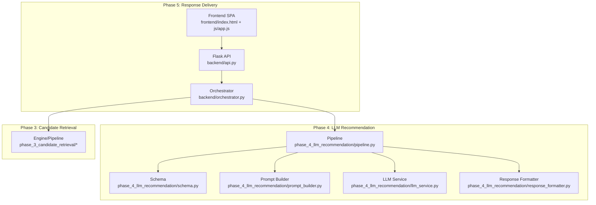
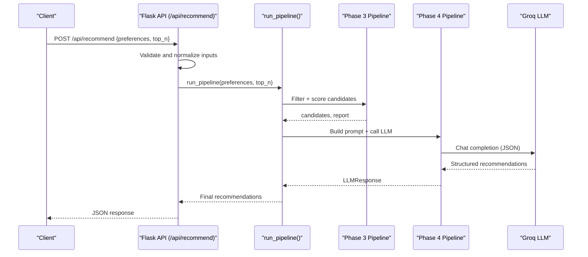
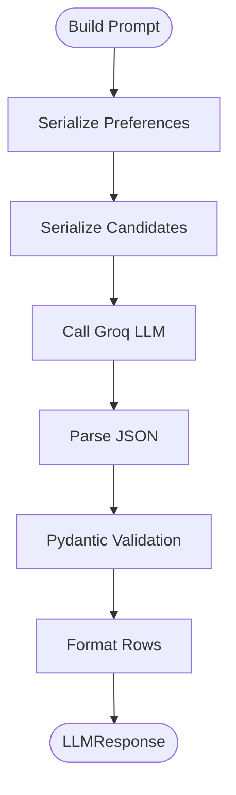
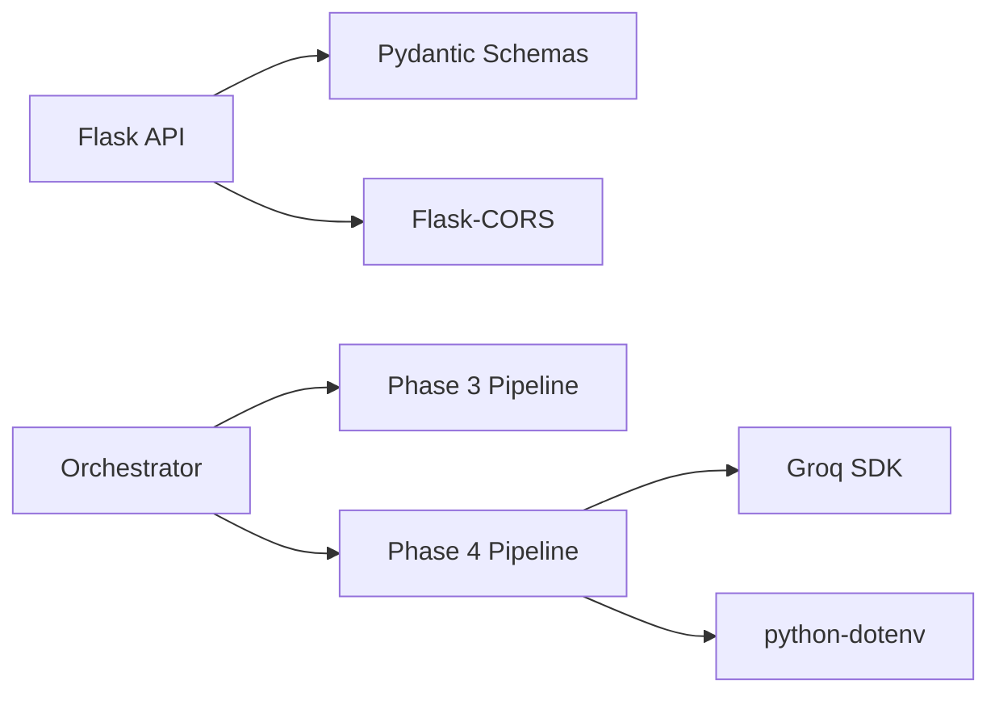

# Main Recommendation Endpoint

<cite>
**Referenced Files in This Document**
- [api.py](file://Zomato/architecture/phase_5_response_delivery/backend/api.py)
- [orchestrator.py](file://Zomato/architecture/phase_5_response_delivery/backend/orchestrator.py)
- [schema.py](file://Zomato/architecture/phase_4_llm_recommendation/schema.py)
- [pipeline.py](file://Zomato/architecture/phase_4_llm_recommendation/pipeline.py)
- [llm_service.py](file://Zomato/architecture/phase_4_llm_recommendation/llm_service.py)
- [prompt_builder.py](file://Zomato/architecture/phase_4_llm_recommendation/prompt_builder.py)
- [response_formatter.py](file://Zomato/architecture/phase_4_llm_recommendation/response_formatter.py)
- [sample_recommendations.json](file://Zomato/architecture/phase_5_response_delivery/sample_recommendations.json)
- [metadata.json](file://Zomato/architecture/phase_5_response_delivery/metadata.json)
- [app.js](file://Zomato/architecture/phase_5_response_delivery/frontend/js/app.js)
- [index.html](file://Zomato/architecture/phase_5_response_delivery/frontend/index.html)
- [requirements.txt](file://Zomato/architecture/phase_5_response_delivery/requirements.txt)
</cite>

## Table of Contents
1. [Introduction](#introduction)
2. [Project Structure](#project-structure)
3. [Core Components](#core-components)
4. [Architecture Overview](#architecture-overview)
5. [Detailed Component Analysis](#detailed-component-analysis)
6. [Dependency Analysis](#dependency-analysis)
7. [Performance Considerations](#performance-considerations)
8. [Troubleshooting Guide](#troubleshooting-guide)
9. [Conclusion](#conclusion)
10. [Appendices](#appendices)

## Introduction
This document provides comprehensive API documentation for the /api/recommend POST endpoint. It covers the request body schema, parameter validation rules, default values, acceptable value ranges, response format, and error handling. It also includes practical examples, client implementation guidelines, rate limiting considerations, and performance optimization tips for production usage.

## Project Structure
The recommendation system is organized into phases:
- Phase 3: Candidate retrieval and filtering
- Phase 4: LLM-based ranking and explanation generation
- Phase 5: Response delivery via Flask API and frontend

The /api/recommend endpoint orchestrates these phases and returns ranked restaurant recommendations with LLM-generated explanations.

**Diagram sources**
- [api.py:1-84](file://Zomato/architecture/phase_5_response_delivery/backend/api.py#L1-L84)
- [orchestrator.py:1-292](file://Zomato/architecture/phase_5_response_delivery/backend/orchestrator.py#L1-L292)
- [schema.py:1-38](file://Zomato/architecture/phase_4_llm_recommendation/schema.py#L1-L38)
- [pipeline.py:1-47](file://Zomato/architecture/phase_4_llm_recommendation/pipeline.py#L1-L47)
- [prompt_builder.py:1-45](file://Zomato/architecture/phase_4_llm_recommendation/prompt_builder.py#L1-L45)
- [llm_service.py:1-43](file://Zomato/architecture/phase_4_llm_recommendation/llm_service.py#L1-L43)
- [response_formatter.py:1-22](file://Zomato/architecture/phase_4_llm_recommendation/response_formatter.py#L1-L22)

**Section sources**
- [api.py:1-84](file://Zomato/architecture/phase_5_response_delivery/backend/api.py#L1-L84)
- [orchestrator.py:1-292](file://Zomato/architecture/phase_5_response_delivery/backend/orchestrator.py#L1-L292)

## Core Components
- API endpoint: POST /api/recommend
- Request body parameters:
  - location: string, required
  - budget: string, one of low, medium, high; default medium
  - cuisines: array of strings; default empty
  - min_rating: number (0–5); default 0
  - optional_preferences: array of strings; default empty
  - top_n: integer (1–20); default 5
- Response format:
  - summary: string
  - recommendations: array of objects with fields:
    - rank: integer
    - restaurant_name: string
    - explanation: string
    - rating: number or null
    - cost_for_two: number or null
    - cuisine: string
  - preferences_used: object mirroring input preferences
  - source: string, one of live, sample, phase3_only

Validation rules and defaults are enforced in the API layer and validated again during LLM processing.

**Section sources**
- [api.py:41-84](file://Zomato/architecture/phase_5_response_delivery/backend/api.py#L41-L84)
- [schema.py:18-37](file://Zomato/architecture/phase_4_llm_recommendation/schema.py#L18-L37)
- [sample_recommendations.json:1-53](file://Zomato/architecture/phase_5_response_delivery/sample_recommendations.json#L1-L53)

## Architecture Overview
The /api/recommend endpoint performs the following steps:
1. Parse and validate the request body.
2. Normalize and constrain parameters (e.g., budget enum, top_n clamping).
3. Run the full pipeline:
   - Load restaurants (fallback to sample if dataset not available).
   - Apply Phase 3 filtering and scoring.
   - Invoke Phase 4 LLM to rank candidates and generate explanations.
4. Return structured recommendations with explanations.

**Diagram sources**
- [api.py:41-84](file://Zomato/architecture/phase_5_response_delivery/backend/api.py#L41-L84)
- [orchestrator.py:112-292](file://Zomato/architecture/phase_5_response_delivery/backend/orchestrator.py#L112-L292)
- [pipeline.py:29-47](file://Zomato/architecture/phase_4_llm_recommendation/pipeline.py#L29-L47)
- [llm_service.py:19-43](file://Zomato/architecture/phase_4_llm_recommendation/llm_service.py#L19-L43)

## Detailed Component Analysis

### Endpoint Definition
- Method: POST
- Path: /api/recommend
- Content-Type: application/json
- Authentication: Not required by the API layer

Request body schema:
- location: string, required
- budget: string, one of low, medium, high; default medium
- cuisines: array of strings; default []
- min_rating: number (0–5); default 0
- optional_preferences: array of strings; default []
- top_n: integer (1–20); default 5

Response format:
- summary: string
- recommendations: array of objects with keys: rank, restaurant_name, explanation, rating, cost_for_two, cuisine
- preferences_used: object mirroring input preferences
- source: string, one of live, sample, phase3_only

Validation and normalization:
- location is trimmed and required.
- budget normalized to lowercase and validated against allowed values.
- top_n clamped to 1–20.
- Ratings constrained to 0–5 in schema validation.

**Section sources**
- [api.py:41-84](file://Zomato/architecture/phase_5_response_delivery/backend/api.py#L41-L84)
- [schema.py:18-37](file://Zomato/architecture/phase_4_llm_recommendation/schema.py#L18-L37)

### Parameter Validation Rules and Defaults
- location
  - Required: true
  - Type: string
  - Validation: non-empty after trimming
- budget
  - Required: false
  - Type: string
  - Allowed values: low, medium, high
  - Default: medium
- cuisines
  - Required: false
  - Type: array of strings
  - Default: []
- min_rating
  - Required: false
  - Type: number
  - Range: 0–5
  - Default: 0
- optional_preferences
  - Required: false
  - Type: array of strings
  - Default: []
- top_n
  - Required: false
  - Type: integer
  - Range: 1–20
  - Default: 5

Behavior:
- If top_n is below 1, it becomes 1; if above 20, it becomes 20.
- If the dataset is unavailable or the LLM call fails, the response falls back to Phase 3 candidates with generated explanations.

**Section sources**
- [api.py:60-78](file://Zomato/architecture/phase_5_response_delivery/backend/api.py#L60-L78)
- [orchestrator.py:166-190](file://Zomato/architecture/phase_5_response_delivery/backend/orchestrator.py#L166-L190)
- [orchestrator.py:266-291](file://Zomato/architecture/phase_5_response_delivery/backend/orchestrator.py#L266-L291)

### Response Format Details
- summary: human-readable summary of the recommendations
- recommendations: array of ranked items with:
  - rank: integer
  - restaurant_name: string
  - explanation: string (LLM-generated rationale)
  - rating: number or null
  - cost_for_two: number or null
  - cuisine: string
- preferences_used: object reflecting the preferences sent by the client
- source:
  - live: recommendations from the full pipeline
  - sample: fallback sample data
  - phase3_only: Phase 3 candidates with generated explanations when LLM fails

Example response structure:
- See [sample_recommendations.json:1-53](file://Zomato/architecture/phase_5_response_delivery/sample_recommendations.json#L1-L53)

**Section sources**
- [orchestrator.py:259-264](file://Zomato/architecture/phase_5_response_delivery/backend/orchestrator.py#L259-L264)
- [orchestrator.py:286-291](file://Zomato/architecture/phase_5_response_delivery/backend/orchestrator.py#L286-L291)
- [sample_recommendations.json:1-53](file://Zomato/architecture/phase_5_response_delivery/sample_recommendations.json#L1-L53)

### LLM Prompting and Ranking
- The Phase 4 pipeline builds a prompt containing user preferences and candidate restaurants, then calls the Groq LLM with a JSON-returning instruction.
- The LLM returns a structured response validated by Pydantic models.
- The response formatter converts the LLM response into a display-friendly row format.

**Diagram sources**
- [prompt_builder.py:10-45](file://Zomato/architecture/phase_4_llm_recommendation/prompt_builder.py#L10-L45)
- [pipeline.py:29-47](file://Zomato/architecture/phase_4_llm_recommendation/pipeline.py#L29-L47)
- [llm_service.py:19-43](file://Zomato/architecture/phase_4_llm_recommendation/llm_service.py#L19-L43)
- [response_formatter.py:8-22](file://Zomato/architecture/phase_4_llm_recommendation/response_formatter.py#L8-L22)

**Section sources**
- [pipeline.py:29-47](file://Zomato/architecture/phase_4_llm_recommendation/pipeline.py#L29-L47)
- [prompt_builder.py:10-45](file://Zomato/architecture/phase_4_llm_recommendation/prompt_builder.py#L10-L45)
- [llm_service.py:19-43](file://Zomato/architecture/phase_4_llm_recommendation/llm_service.py#L19-L43)
- [response_formatter.py:8-22](file://Zomato/architecture/phase_4_llm_recommendation/response_formatter.py#L8-L22)

### Example Requests and Expected Outcomes
Note: The following examples describe expected outcomes without reproducing code. See the referenced files for exact structures.

- Basic Italian and Chinese in Bangalore with medium budget and 4.0 minimum rating:
  - Request includes location, budget, cuisines, min_rating, optional_preferences, top_n.
  - Response contains ranked restaurants with explanations tailored to the preferences.
  - Reference: [sample_recommendations.json:1-53](file://Zomato/architecture/phase_5_response_delivery/sample_recommendations.json#L1-L53)

- Budget extremes:
  - low budget: expect lower-cost-for-two recommendations.
  - high budget: expect higher-cost-for-two recommendations.
  - Behavior is governed by budget normalization and candidate filtering.

- Optional preferences:
  - Providing optional_preferences (e.g., quick-service) influences explanations and candidate matching.
  - Reference: [api.py:69-75](file://Zomato/architecture/phase_5_response_delivery/backend/api.py#L69-L75)

- top_n limits:
  - top_n values outside 1–20 are clamped to the nearest boundary.
  - Reference: [api.py:76-77](file://Zomato/architecture/phase_5_response_delivery/backend/api.py#L76-L77)

**Section sources**
- [sample_recommendations.json:1-53](file://Zomato/architecture/phase_5_response_delivery/sample_recommendations.json#L1-L53)
- [api.py:69-77](file://Zomato/architecture/phase_5_response_delivery/backend/api.py#L69-L77)

### Error Handling
- Invalid JSON body:
  - Returns 400 with error message indicating JSON body is required.
  - Reference: [api.py:56-58](file://Zomato/architecture/phase_5_response_delivery/backend/api.py#L56-L58)
- Missing or invalid location:
  - Returns 400 with error message indicating location is required.
  - Reference: [api.py:61-63](file://Zomato/architecture/phase_5_response_delivery/backend/api.py#L61-L63)
- Invalid budget:
  - Returns 400 with error message listing allowed values.
  - Reference: [api.py:65-67](file://Zomato/architecture/phase_5_response_delivery/backend/api.py#L65-L67)
- Pipeline failures:
  - On exceptions, returns 500 with a stack-traced error object.
  - Reference: [api.py:82-83](file://Zomato/architecture/phase_5_response_delivery/backend/api.py#L82-L83)
- LLM unavailability or errors:
  - Falls back to Phase 3 candidates with generated explanations and sets source to phase3_only.
  - Reference: [orchestrator.py:266-291](file://Zomato/architecture/phase_5_response_delivery/backend/orchestrator.py#L266-L291)
- Dataset unavailability:
  - Falls back to sample recommendations and sets source to sample.
  - Reference: [orchestrator.py:166-169](file://Zomato/architecture/phase_5_response_delivery/backend/orchestrator.py#L166-L169)

**Section sources**
- [api.py:56-83](file://Zomato/architecture/phase_5_response_delivery/backend/api.py#L56-L83)
- [orchestrator.py:166-190](file://Zomato/architecture/phase_5_response_delivery/backend/orchestrator.py#L166-L190)
- [orchestrator.py:266-291](file://Zomato/architecture/phase_5_response_delivery/backend/orchestrator.py#L266-L291)

### Client Implementation Guidelines
- Construct a JSON body with the required and optional fields described above.
- Set Content-Type to application/json.
- Handle responses with status checks:
  - 200 OK: parse recommendations and summary.
  - 400 Bad Request: handle validation errors.
  - 500 Internal Server Error: handle server-side failures.
- Use the source field to inform UI messaging (Live AI vs Sample vs Ranked).
- Reference frontend behavior for guidance:
  - See [app.js:182-205](file://Zomato/architecture/phase_5_response_delivery/frontend/js/app.js#L182-L205) for API call flow and error handling.
  - See [index.html:181-205](file://Zomato/architecture/phase_5_response_delivery/frontend/index.html#L181-L205) for form and button interactions.

**Section sources**
- [app.js:182-205](file://Zomato/architecture/phase_5_response_delivery/frontend/js/app.js#L182-L205)
- [index.html:181-205](file://Zomato/architecture/phase_5_response_delivery/frontend/index.html#L181-L205)

## Dependency Analysis
External dependencies and integrations:
- Flask: web framework hosting the API
- Pydantic: schema validation for LLM inputs and outputs
- python-dotenv: environment configuration
- Groq SDK: LLM inference
- CORS: cross-origin support for the frontend

**Diagram sources**
- [requirements.txt:1-6](file://Zomato/architecture/phase_5_response_delivery/requirements.txt#L1-L6)
- [orchestrator.py:209-213](file://Zomato/architecture/phase_5_response_delivery/backend/orchestrator.py#L209-L213)
- [llm_service.py:16-22](file://Zomato/architecture/phase_4_llm_recommendation/llm_service.py#L16-L22)

**Section sources**
- [requirements.txt:1-6](file://Zomato/architecture/phase_5_response_delivery/requirements.txt#L1-L6)
- [orchestrator.py:209-213](file://Zomato/architecture/phase_5_response_delivery/backend/orchestrator.py#L209-L213)
- [llm_service.py:16-22](file://Zomato/architecture/phase_4_llm_recommendation/llm_service.py#L16-L22)

## Performance Considerations
- top_n clamping: Limit top_n to reduce LLM prompt size and latency.
- Candidate filtering: Phase 3 reduces candidate count before LLM ranking; keep preferences tight to minimize computation.
- Environment configuration: Ensure GROQ_API_KEY is set to avoid fallbacks and reduce unnecessary error handling paths.
- Caching: The orchestrator clears module caches and reloads modules per request to ensure deterministic behavior; avoid frequent cold starts by reusing the service process.
- Network: LLM calls are synchronous; consider adding client-side retries with exponential backoff and local caching for repeated queries.

[No sources needed since this section provides general guidance]

## Troubleshooting Guide
Common issues and resolutions:
- Missing GROQ_API_KEY:
  - Symptom: LLM call raises an error and response falls back to Phase 3.
  - Resolution: Set GROQ_API_KEY in the environment.
  - Reference: [llm_service.py:20-22](file://Zomato/architecture/phase_4_llm_recommendation/llm_service.py#L20-L22), [orchestrator.py:212-213](file://Zomato/architecture/phase_5_response_delivery/backend/orchestrator.py#L212-L213)
- No Phase 1 dataset found:
  - Symptom: Fallback to sample recommendations.
  - Resolution: Provide a valid dataset or rely on sample data for demos.
  - Reference: [orchestrator.py:175-177](file://Zomato/architecture/phase_5_response_delivery/backend/orchestrator.py#L175-L177)
- Invalid request body:
  - Symptom: 400 error with validation message.
  - Resolution: Ensure location is present and budget is one of low, medium, high.
  - Reference: [api.py:56-67](file://Zomato/architecture/phase_5_response_delivery/backend/api.py#L56-L67)
- Unexpected 500 errors:
  - Symptom: Server-side exception.
  - Resolution: Inspect logs and stack traces returned in the error object.
  - Reference: [api.py:82-83](file://Zomato/architecture/phase_5_response_delivery/backend/api.py#L82-L83)

**Section sources**
- [llm_service.py:20-22](file://Zomato/architecture/phase_4_llm_recommendation/llm_service.py#L20-L22)
- [orchestrator.py:175-177](file://Zomato/architecture/phase_5_response_delivery/backend/orchestrator.py#L175-L177)
- [api.py:56-67](file://Zomato/architecture/phase_5_response_delivery/backend/api.py#L56-L67)
- [api.py:82-83](file://Zomato/architecture/phase_5_response_delivery/backend/api.py#L82-L83)

## Conclusion
The /api/recommend endpoint provides a robust, validated interface for personalized restaurant recommendations. It enforces strict parameter validation, normalizes inputs, and integrates Phase 3 filtering with Phase 4 LLM ranking to produce ranked results with explanations. Clients should handle both 2xx and error responses appropriately and leverage the source field to inform user experience.

[No sources needed since this section summarizes without analyzing specific files]

## Appendices

### API Definition Summary
- Endpoint: POST /api/recommend
- Headers: Content-Type: application/json
- Request body fields:
  - location: string, required
  - budget: string, one of low, medium, high; default medium
  - cuisines: array of strings; default []
  - min_rating: number (0–5); default 0
  - optional_preferences: array of strings; default []
  - top_n: integer (1–20); default 5
- Response fields:
  - summary: string
  - recommendations: array of objects with rank, restaurant_name, explanation, rating, cost_for_two, cuisine
  - preferences_used: object
  - source: string (live, sample, phase3_only)

**Section sources**
- [api.py:41-84](file://Zomato/architecture/phase_5_response_delivery/backend/api.py#L41-L84)
- [schema.py:18-37](file://Zomato/architecture/phase_4_llm_recommendation/schema.py#L18-L37)
- [sample_recommendations.json:1-53](file://Zomato/architecture/phase_5_response_delivery/sample_recommendations.json#L1-L53)

### Rate Limiting and Production Guidance
- Client-side:
  - Implement retry with exponential backoff for transient failures.
  - Cache recent results locally to reduce repeated requests.
  - Batch similar requests when feasible.
- Server-side:
  - Consider adding rate limiting middleware in production deployments.
  - Monitor LLM latency and throughput; scale horizontally as needed.
  - Ensure environment variables (e.g., GROQ_API_KEY) are managed securely.

[No sources needed since this section provides general guidance]