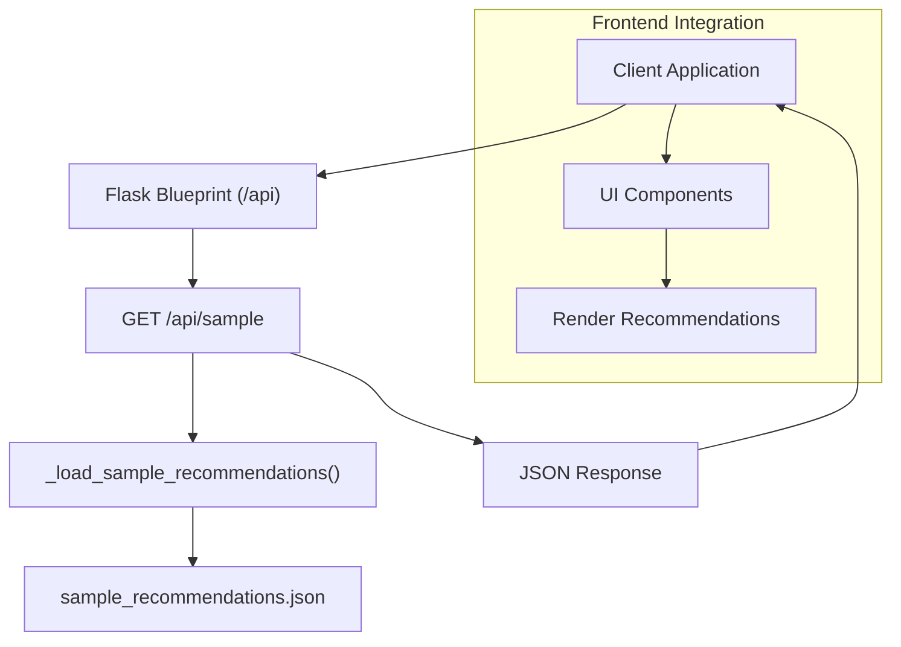

# Sample Recommendations Endpoint

<cite>
**Referenced Files in This Document**
- [api.py](file://Zomato/architecture/phase_5_response_delivery/backend/api.py)
- [app.py](file://Zomato/architecture/phase_5_response_delivery/backend/app.py)
- [orchestrator.py](file://Zomato/architecture/phase_5_response_delivery/backend/orchestrator.py)
- [sample_recommendations.json](file://Zomato/architecture/phase_5_response_delivery/sample_recommendations.json)
- [index.html](file://Zomato/architecture/phase_5_response_delivery/frontend/index.html)
- [app.js](file://Zomato/architecture/phase_5_response_delivery/frontend/js/app.js)
- [metadata.json](file://Zomato/architecture/phase_5_response_delivery/metadata.json)
- [api.py (Phase 6)](file://Zomato/architecture/phase_6_monitoring/backend/api.py)
- [orchestrator.py (Phase 6)](file://Zomato/architecture/phase_6_monitoring/backend/orchestrator.py)
- [sample_recommendations.json (Phase 6)](file://Zomato/architecture/phase_6_monitoring/sample_recommendations.json)
- [analytics_logger.py](file://Zomato/architecture/phase_6_monitoring/backend/analytics_logger.py)
</cite>

## Table of Contents
1. [Introduction](#introduction)
2. [Endpoint Definition](#endpoint-definition)
3. [Response Format](#response-format)
4. [Sample Data Source](#sample-data-source)
5. [Integration Guide](#integration-guide)
6. [Architecture Overview](#architecture-overview)
7. [Performance and Caching](#performance-and-caching)
8. [Troubleshooting](#troubleshooting)
9. [Conclusion](#conclusion)

## Introduction
This document provides comprehensive API documentation for the `/api/sample` endpoint, which returns pre-built sample recommendations designed for frontend demonstration and UI testing. It explains the endpoint behavior, response structure, data provenance, and practical guidance for integrating the sample data into frontend applications and testing workflows.

## Endpoint Definition
- **Method**: GET
- **Path**: `/api/sample`
- **Purpose**: Returns pre-built sample recommendations for frontend demos and UI testing
- **Behavior**: Loads sample data from a JSON file and adds a source field indicating the data origin

**Section sources**
- [api.py:24-29](file://Zomato/architecture/phase_5_response_delivery/backend/api.py#L24-L29)
- [api.py (Phase 6):26-31](file://Zomato/architecture/phase_6_monitoring/backend/api.py#L26-L31)

## Response Format
The `/api/sample` endpoint returns a JSON object containing:
- summary: A human-readable summary of the recommendations
- recommendations: An array of recommendation objects, each with:
  - rank: Integer ranking position
  - restaurant_name: Name of the restaurant
  - explanation: Natural language explanation for the recommendation
  - rating: Numeric rating value
  - cost_for_two: Cost estimate for two people
  - cuisine: Comma-separated cuisine types
- preferences_used: The preferences used to generate the recommendations (when applicable)
- source: Indicates the data source ("sample")

Example response structure:
- summary: string
- recommendations: array of recommendation objects
- preferences_used: object (optional)
- source: string

Typical recommendation object fields:
- rank: integer
- restaurant_name: string
- explanation: string
- rating: number
- cost_for_two: number
- cuisine: string

**Section sources**
- [sample_recommendations.json:1-53](file://Zomato/architecture/phase_5_response_delivery/sample_recommendations.json#L1-L53)
- [sample_recommendations.json (Phase 6):1-53](file://Zomato/architecture/phase_6_monitoring/sample_recommendations.json#L1-L53)

## Sample Data Source
The sample data originates from:
- A dedicated JSON file containing pre-generated recommendations
- The orchestrator loads this file and augments it with metadata
- The endpoint exposes this data directly to clients

Key characteristics:
- Pre-computed recommendations for demonstration
- Includes explanations and ratings for UI rendering
- Suitable for rapid frontend prototyping and automated testing

**Section sources**
- [orchestrator.py:19-20](file://Zomato/architecture/phase_5_response_delivery/backend/orchestrator.py#L19-L20)
- [orchestrator.py (Phase 6):19-20](file://Zomato/architecture/phase_6_monitoring/backend/orchestrator.py#L19-L20)
- [api.py:27-29](file://Zomato/architecture/phase_5_response_delivery/backend/api.py#L27-L29)

## Integration Guide
Frontend integration is straightforward:
- Call `/api/sample` to fetch sample data
- Render recommendations using the existing frontend components
- Use the source field to indicate sample data in the UI

Frontend implementation highlights:
- Dedicated button triggers the sample endpoint
- Results are rendered using the same card layout as live recommendations
- The source badge displays "Sample" for sample data

Integration steps:
1. Add a "Try with sample data" button in your UI
2. On click, call the `/api/sample` endpoint
3. Parse the JSON response and render the recommendations
4. Display the source indicator to inform users

**Section sources**
- [index.html:133-135](file://Zomato/architecture/phase_5_response_delivery/frontend/index.html#L133-L135)
- [app.js:207-222](file://Zomato/architecture/phase_5_response_delivery/frontend/js/app.js#L207-L222)
- [app.js:162-179](file://Zomato/architecture/phase_5_response_delivery/frontend/js/app.js#L162-L179)

## Architecture Overview
The `/api/sample` endpoint follows the standard Flask blueprint pattern and integrates with the broader recommendation system:

**Diagram sources**
- [api.py:24-29](file://Zomato/architecture/phase_5_response_delivery/backend/api.py#L24-L29)
- [orchestrator.py:19-20](file://Zomato/architecture/phase_5_response_delivery/backend/orchestrator.py#L19-L20)
- [sample_recommendations.json:1-53](file://Zomato/architecture/phase_5_response_delivery/sample_recommendations.json#L1-L53)

## Performance and Caching
Performance characteristics:
- Minimal processing overhead: the endpoint reads from a local JSON file
- Fast response times suitable for UI testing and demos
- No external dependencies or network calls

Caching considerations:
- The endpoint does not implement server-side caching headers
- Clients should implement appropriate caching strategies for repeated requests
- For automated testing, consider storing responses locally to avoid repeated network calls

Recommendations:
- Cache responses in memory for the duration of a single user session
- Implement client-side caching with appropriate TTL values
- For automated tests, persist responses to disk and reuse during test runs

**Section sources**
- [api.py:24-29](file://Zomato/architecture/phase_5_response_delivery/backend/api.py#L24-L29)
- [app.js:207-222](file://Zomato/architecture/phase_5_response_delivery/frontend/js/app.js#L207-L222)

## Troubleshooting
Common issues and resolutions:
- Empty or missing recommendations:
  - Verify the sample JSON file exists and is readable
  - Check that the orchestrator can locate the sample file path
- CORS errors:
  - Ensure the Flask application has CORS enabled
  - Verify the frontend is making requests from an allowed origin
- UI rendering problems:
  - Confirm the response matches the expected schema
  - Check that the frontend expects the same field names

Debugging steps:
1. Test the endpoint directly using curl or a browser
2. Verify the JSON structure matches the documented format
3. Check browser developer tools for network errors
4. Validate that the frontend handles missing or malformed data gracefully

**Section sources**
- [app.py:20](file://Zomato/architecture/phase_5_response_delivery/backend/app.py#L20)
- [app.js:207-222](file://Zomato/architecture/phase_5_response_delivery/frontend/js/app.js#L207-L222)

## Conclusion
The `/api/sample` endpoint provides a reliable, fast way to demonstrate the recommendation UI and support frontend development and testing workflows. Its simple design and predictable response format make it ideal for rapid prototyping and automated testing scenarios. By following the integration guidelines and implementing appropriate client-side caching, teams can efficiently build and validate restaurant recommendation interfaces.