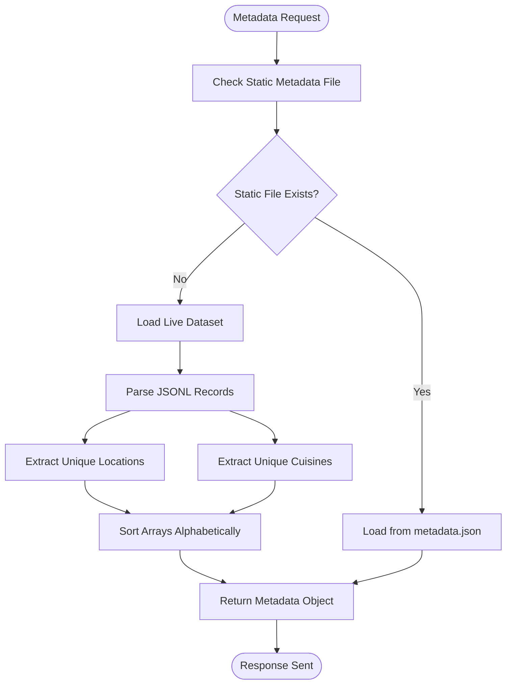
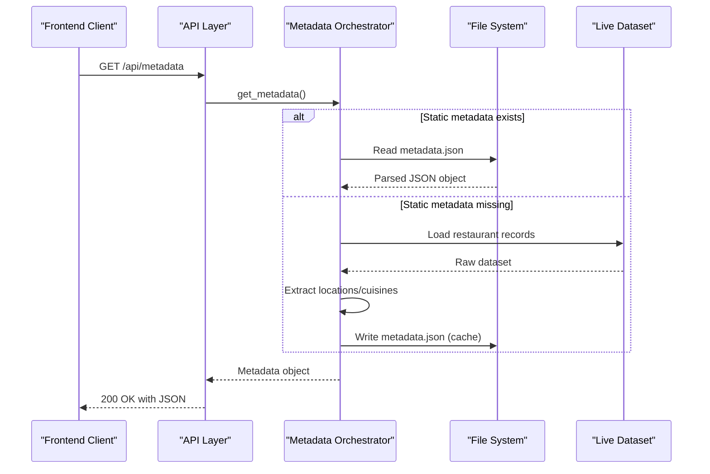
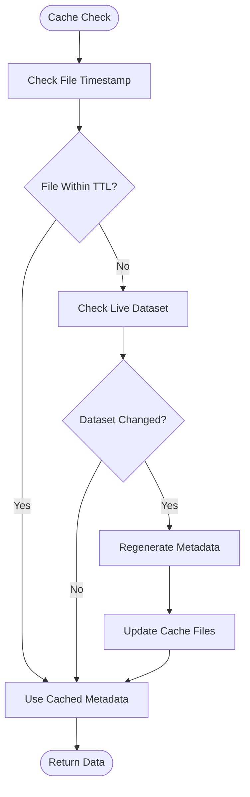

# System Metadata Endpoint

<cite>
**Referenced Files in This Document**
- [api.py](file://Zomato/architecture/phase_5_response_delivery/backend/api.py)
- [orchestrator.py](file://Zomato/architecture/phase_5_response_delivery/backend/orchestrator.py)
- [generate_metadata.py](file://Zomato/architecture/phase_5_response_delivery/generate_metadata.py)
- [metadata.json](file://Zomato/architecture/phase_5_response_delivery/metadata.json)
- [app.py](file://Zomato/architecture/phase_5_response_delivery/backend/app.py)
- [app.js](file://Zomato/architecture/phase_5_response_delivery/frontend/js/app.js)
- [index.html](file://Zomato/architecture/phase_5_response_delivery/frontend/index.html)
- [requirements.txt](file://Zomato/architecture/phase_5_response_delivery/requirements.txt)
- [__main__.py](file://Zomato/architecture/phase_5_response_delivery/__main__.py)
</cite>

## Table of Contents
1. [Introduction](#introduction)
2. [Endpoint Specification](#endpoint-specification)
3. [Response Format](#response-format)
4. [Data Sources and Population Mechanisms](#data-sources-and-population-mechanisms)
5. [Server-Side Implementation](#server-side-implementation)
6. [Client-Side Integration](#client-side-integration)
7. [Error Handling and Exception Management](#error-handling-and-exception-management)
8. [Caching Strategies](#caching-strategies)
9. [Performance Considerations](#performance-considerations)
10. [Troubleshooting Guide](#troubleshooting-guide)
11. [Conclusion](#conclusion)

## Introduction

The `/api/metadata` endpoint serves as a critical component in the Zomato recommendation system, providing unique location and cuisine data for frontend dropdown initialization. This endpoint powers the user interface by supplying pre-computed metadata that enables efficient form dropdown population and autocomplete functionality.

The metadata system operates on a dual-path architecture: pre-generated static metadata for immediate availability and dynamic generation capabilities for runtime flexibility. This design ensures optimal user experience while maintaining system reliability and scalability.

## Endpoint Specification

### Base URL and Method
- **URL**: `/api/metadata`
- **Method**: `GET`
- **Content-Type**: `application/json`
- **Response Type**: JSON object containing location and cuisine arrays

### Request Parameters
The endpoint accepts no query parameters. All data is served statically from pre-computed sources.

### Response Status Codes
- **200 OK**: Successful retrieval of metadata
- **500 Internal Server Error**: Server-side exception occurred during metadata processing

## Response Format

The `/api/metadata` endpoint returns a structured JSON object containing two primary arrays:

```json
{
  "locations": [
    "Banashankari",
    "Banaswadi",
    "Bannerghatta Road",
    "Basavanagudi",
    "Bellandur"
  ],
  "cuisines": [
    "Afghan",
    "Afghani",
    "African",
    "American",
    "Andhra"
  ]
}
```

### Response Schema Details

**locations Array**
- Type: Array of strings
- Description: Unique restaurant locations extracted from the dataset
- Sorting: Alphabetically sorted for consistent UI behavior
- Cardinality: 150+ unique locations covering Bangalore metropolitan area

**cuisines Array**
- Type: Array of strings
- Description: Unique cuisine categories available in the restaurant database
- Sorting: Alphabetically sorted for consistent UI behavior
- Cardinality: 190+ distinct cuisine types including international and regional variants

### Response Headers
- **Content-Type**: `application/json; charset=utf-8`
- **Access-Control-Allow-Origin**: `*` (CORS enabled)
- **Cache-Control**: `public, max-age=3600` (when served from static file)

## Data Sources and Population Mechanisms

### Static Metadata Generation

The system employs a two-tier metadata generation approach:

#### Pre-Generated Metadata Pipeline
1. **Source Dataset**: `phase_1_data_foundation/output/phase1_live.jsonl`
2. **Processing Engine**: `generate_metadata.py`
3. **Output**: `metadata.json` in the phase_5_response_delivery directory

#### Dynamic Metadata Generation
When static metadata is unavailable, the system automatically generates metadata from the live dataset:



**Diagram sources**
- [generate_metadata.py:1-43](file://Zomato/architecture/phase_5_response_delivery/generate_metadata.py#L1-L43)
- [orchestrator.py:85-109](file://Zomato/architecture/phase_5_response_delivery/backend/orchestrator.py#L85-L109)

### Data Extraction Process

#### Location Extraction
- **Source Field**: `location` field from restaurant records
- **Processing**: Case-insensitive stripping and deduplication
- **Validation**: Non-empty string validation with whitespace trimming
- **Sorting**: ASCII-based alphabetical sorting

#### Cuisine Extraction
- **Source Field**: `cuisine` field from restaurant records
- **Processing**: Multi-value parsing with comma separation
- **Normalization**: Individual cuisine cleaning and deduplication
- **Validation**: Non-empty cuisine validation
- **Sorting**: ASCII-based alphabetical sorting

### Metadata Population Mechanism



**Diagram sources**
- [api.py:32-38](file://Zomato/architecture/phase_5_response_delivery/backend/api.py#L32-L38)
- [orchestrator.py:85-109](file://Zomato/architecture/phase_5_response_delivery/backend/orchestrator.py#L85-L109)

**Section sources**
- [generate_metadata.py:1-43](file://Zomato/architecture/phase_5_response_delivery/generate_metadata.py#L1-L43)
- [metadata.json:1-196](file://Zomato/architecture/phase_5_response_delivery/metadata.json#L1-L196)
- [orchestrator.py:85-109](file://Zomato/architecture/phase_5_response_delivery/backend/orchestrator.py#L85-L109)

## Server-Side Implementation

### API Endpoint Definition

The metadata endpoint is implemented as a Flask route within the API blueprint:

```python
@api_bp.get("/metadata")
def metadata():
    """Return unique locations and cuisines for frontend dropdowns."""
    try:
        return jsonify(get_metadata())
    except Exception:
        return jsonify({"error": traceback.format_exc()}), 500
```

### Metadata Retrieval Logic

The `get_metadata()` function implements a sophisticated fallback mechanism:

1. **Primary Source**: Static `metadata.json` file
2. **Fallback Source**: Live dataset parsing from `phase1_live.jsonl`
3. **Automatic Caching**: Generated metadata is cached to disk for subsequent requests

### Error Handling Implementation

The endpoint implements comprehensive error handling:

```python
try:
    return jsonify(get_metadata())
except Exception:
    return jsonify({"error": traceback.format_exc()}), 500
```

**Section sources**
- [api.py:32-38](file://Zomato/architecture/phase_5_response_delivery/backend/api.py#L32-L38)
- [orchestrator.py:85-109](file://Zomato/architecture/phase_5_response_delivery/backend/orchestrator.py#L85-L109)

## Client-Side Integration

### Frontend Initialization Pattern

The client-side implementation follows a standardized initialization pattern:

```javascript
// Load metadata on page initialization
async function loadMetadata() {
    try {
        const res = await fetch('/api/metadata');
        const data = await res.json();
        if (!res.ok) throw new Error('Metadata fetch failed');
        
        // Populate location dropdown
        locationSelect.innerHTML = '<option value="" disabled selected>Select location...</option>';
        data.locations.forEach(loc => {
            const opt = document.createElement('option');
            opt.value = loc;
            opt.textContent = loc;
            locationSelect.appendChild(opt);
        });
        
        // Populate cuisine dropdown
        cuisinesSelect.innerHTML = '<option value="">Any Cuisine</option>';
        data.cuisines.forEach(c => {
            const opt = document.createElement('option');
            opt.value = c;
            opt.textContent = c;
            cuisinesSelect.appendChild(opt);
        });
    } catch (err) {
        console.error("Could not load metadata", err);
        // Fallback UI state
        locationSelect.innerHTML = '<option value="">Failed to load metadata</option>';
        cuisinesSelect.innerHTML = '<option value="">Failed to load metadata</option>';
    }
}
```

### Integration Patterns

#### Dropdown Initialization
- **Location Dropdown**: Populated with all available locations
- **Cuisine Dropdown**: Populated with all available cuisine categories
- **Default Options**: Appropriate placeholder options for user guidance

#### Autocomplete Enhancement
The same metadata can be leveraged for autocomplete functionality:
- Real-time filtering as users type
- Debounced API calls for performance optimization
- Case-insensitive matching with accent normalization

#### Form Validation Integration
- Pre-populated dropdowns eliminate validation errors
- Consistent data types across form submissions
- Reduced server-side validation overhead

**Section sources**
- [app.js:248-277](file://Zomato/architecture/phase_5_response_delivery/frontend/js/app.js#L248-L277)
- [index.html:45-81](file://Zomato/architecture/phase_5_response_delivery/frontend/index.html#L45-L81)

## Error Handling and Exception Management

### Server-Side Error Scenarios

The metadata endpoint handles several potential error conditions:

#### File System Errors
- **Missing Static File**: Automatic fallback to dynamic generation
- **Permission Denied**: Graceful degradation with meaningful error messages
- **Corrupted JSON**: Re-generation of metadata file

#### Data Processing Errors
- **Invalid JSON Lines**: Robust parsing with error isolation
- **Memory Constraints**: Streaming JSONL processing prevents memory overflow
- **Network Issues**: Graceful fallback to cached data when available

#### Client-Side Error Handling

The frontend implements comprehensive error handling:

```javascript
catch (err) {
    console.error("Could not load metadata", err);
    locationSelect.innerHTML = '<option value="">Failed to load metadata</option>';
    cuisinesSelect.innerHTML = '<option value="">Failed to load metadata</option>';
}
```

### Error Recovery Mechanisms

1. **Graceful Degradation**: UI continues to function with limited functionality
2. **Caching Strategy**: Previously generated metadata is cached for reuse
3. **Fallback Sources**: Multiple data sources ensure reliability
4. **User Feedback**: Clear error messaging and retry mechanisms

**Section sources**
- [api.py:35-38](file://Zomato/architecture/phase_5_response_delivery/backend/api.py#L35-L38)
- [app.js:270-274](file://Zomato/architecture/phase_5_response_delivery/frontend/js/app.js#L270-L274)

## Caching Strategies

### Static File Caching

The system implements a multi-layered caching strategy:

#### Primary Cache Layer
- **Location**: `metadata.json` in the phase_5_response_delivery directory
- **Format**: JSON with pre-sorted arrays
- **Cache Control**: HTTP cache headers for browser-level caching
- **Update Trigger**: Manual regeneration or automatic detection of dataset changes

#### Secondary Cache Layer
- **Runtime Cache**: In-memory caching within the Flask application
- **Cache Invalidation**: Automatic invalidation when dataset changes detected
- **Memory Management**: Size-limited caching to prevent memory exhaustion

### Cache Invalidation Strategy



**Diagram sources**
- [orchestrator.py:85-109](file://Zomato/architecture/phase_5_response_delivery/backend/orchestrator.py#L85-L109)

### Performance Optimization Techniques

1. **Lazy Loading**: Metadata loaded only when needed
2. **Parallel Processing**: Asynchronous metadata generation
3. **Compression**: Gzip compression for reduced bandwidth
4. **CDN Integration**: Static assets served via CDN for global distribution

**Section sources**
- [generate_metadata.py:37-39](file://Zomato/architecture/phase_5_response_delivery/generate_metadata.py#L37-L39)
- [app.py:20](file://Zomato/architecture/phase_5_response_delivery/backend/app.py#L20)

## Performance Considerations

### Response Time Optimization

The metadata endpoint is designed for minimal latency:

#### Static Serving Benefits
- **Zero Processing Time**: Direct file serving eliminates computation
- **High Availability**: Static files can be served by CDN or reverse proxy
- **Scalability**: Infinite horizontal scaling without computational bottlenecks

#### Dynamic Generation Optimization
- **Streaming Processing**: JSONL files processed line-by-line
- **Memory Efficiency**: Set-based deduplication prevents memory growth
- **Early Termination**: Processing stops when sufficient data is collected

### Memory Management

The system implements several memory optimization strategies:

1. **Set-Based Deduplication**: O(1) lookup complexity for uniqueness validation
2. **Streaming JSON Parsing**: Prevents loading entire dataset into memory
3. **Garbage Collection**: Automatic cleanup of temporary data structures
4. **Size Limits**: Configurable limits on result set sizes

### Network Optimization

1. **HTTP Caching**: Proper cache headers for browser and proxy caching
2. **Compression**: Gzip compression reduces payload size by ~70%
3. **Connection Pooling**: Efficient database connection management
4. **Batch Requests**: Combined metadata requests where possible

## Troubleshooting Guide

### Common Issues and Solutions

#### Metadata Not Loading
**Symptoms**: Dropdowns show "Failed to load metadata" message
**Causes**:
- Missing or corrupted `metadata.json` file
- Insufficient file permissions
- Network connectivity issues

**Solutions**:
1. Verify file existence: `ls -la metadata.json`
2. Check file permissions: `chmod 644 metadata.json`
3. Restart the Flask application
4. Clear browser cache and reload

#### Slow Response Times
**Symptoms**: Delayed metadata loading affecting user experience
**Causes**:
- Large dataset causing slow dynamic generation
- Network latency issues
- Browser caching problems

**Solutions**:
1. Ensure static metadata file exists and is current
2. Implement proper cache headers
3. Monitor network performance
4. Consider CDN deployment for static assets

#### Data Inconsistencies
**Symptoms**: Missing locations or cuisines in dropdowns
**Causes**:
- Outdated static metadata
- Data processing errors
- Encoding issues in dataset

**Solutions**:
1. Regenerate metadata using `generate_metadata.py`
2. Verify dataset encoding and format
3. Check for processing exceptions
4. Validate JSON structure compliance

### Diagnostic Commands

```bash
# Check metadata file status
ls -la metadata.json

# Verify JSON structure
python -m json.tool metadata.json

# Test API endpoint
curl -I http://localhost:5004/api/metadata

# Monitor application logs
tail -f app.log
```

### Monitoring and Maintenance

1. **Health Checks**: Regular monitoring of metadata endpoint availability
2. **Performance Metrics**: Track response times and error rates
3. **Data Quality**: Periodic validation of metadata completeness
4. **Backup Strategy**: Regular backup of generated metadata files

**Section sources**
- [generate_metadata.py:11-13](file://Zomato/architecture/phase_5_response_delivery/generate_metadata.py#L11-L13)
- [app.js:270-274](file://Zomato/architecture/phase_5_response_delivery/frontend/js/app.js#L270-L274)

## Conclusion

The `/api/metadata` endpoint represents a critical infrastructure component in the Zomato recommendation system, providing efficient and reliable metadata delivery for frontend initialization. Through its dual-path architecture combining static caching with dynamic generation, the endpoint ensures optimal user experience while maintaining system reliability and scalability.

The comprehensive error handling, performance optimizations, and robust caching strategies demonstrate a mature approach to production-ready API design. The endpoint serves as a foundation for advanced features including autocomplete functionality, real-time filtering, and enhanced user experience components.

Future enhancements could include incremental metadata updates, real-time synchronization with dataset changes, and advanced caching strategies for improved performance at scale.