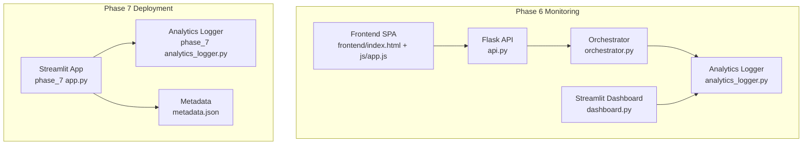
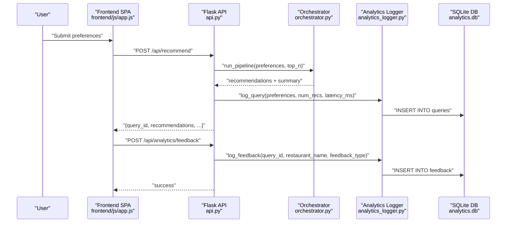
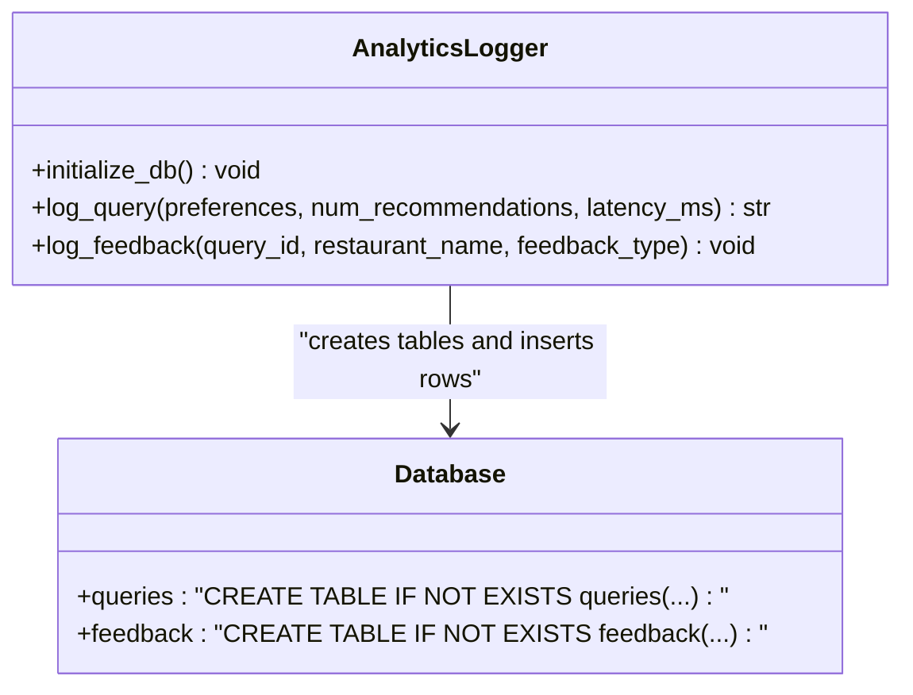
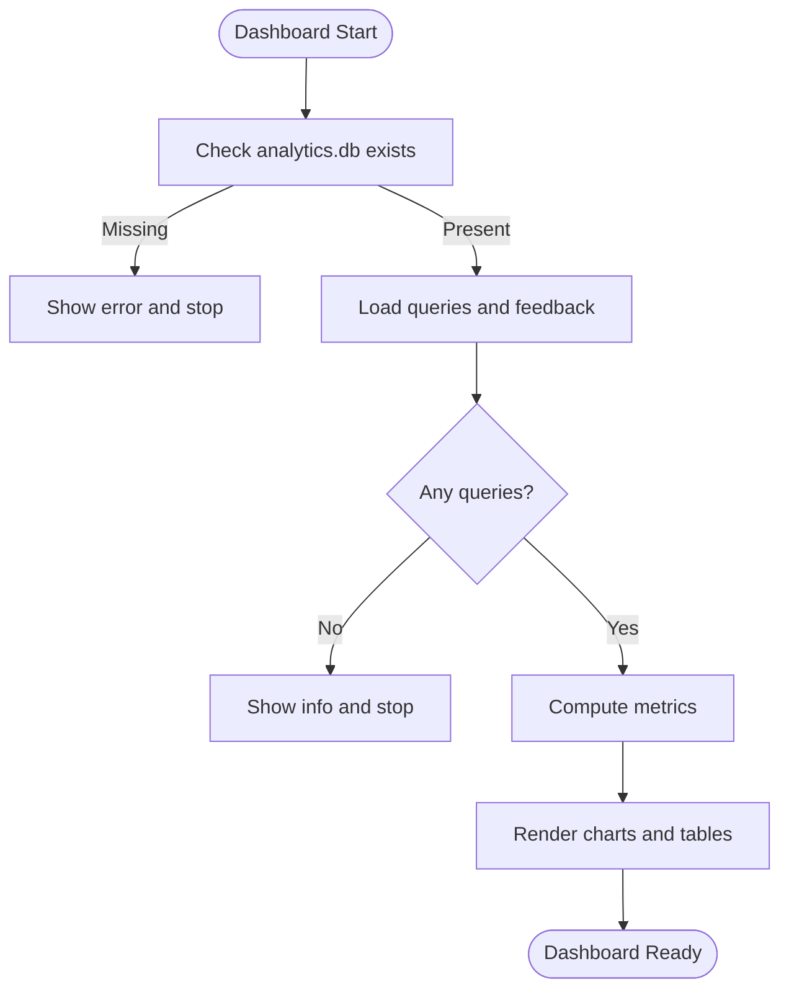
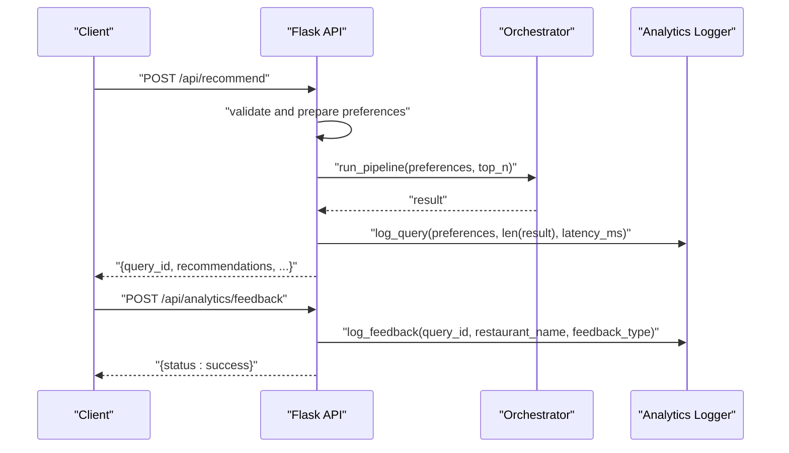
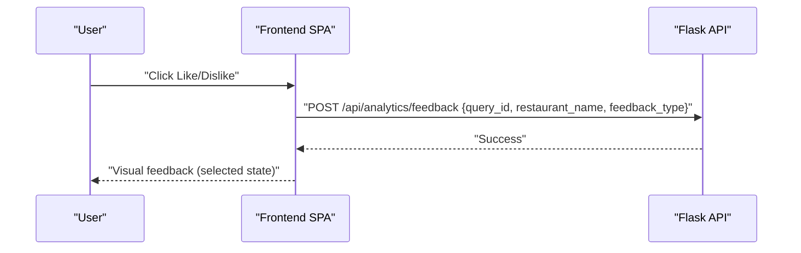
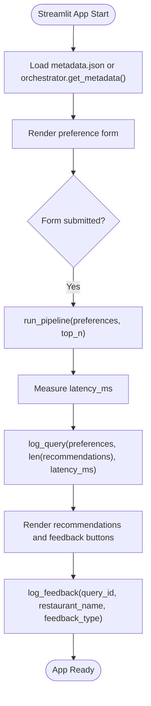
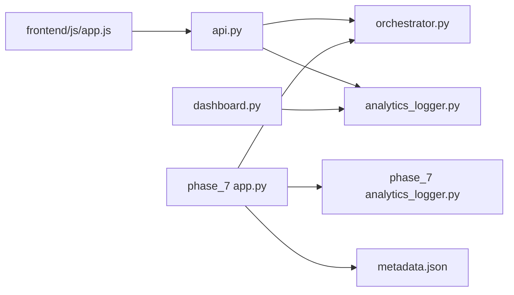
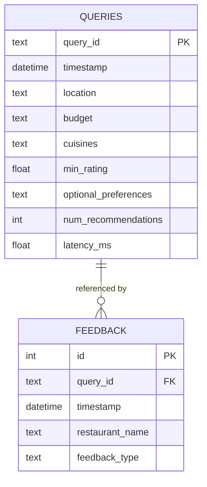

# Analytics and Monitoring

<cite>
**Referenced Files in This Document**
- [analytics_logger.py](file://Zomato/architecture/phase_6_monitoring/backend/analytics_logger.py)
- [dashboard.py](file://Zomato/architecture/phase_6_monitoring/dashboard/dashboard.py)
- [api.py](file://Zomato/architecture/phase_6_monitoring/backend/api.py)
- [app.py](file://Zomato/architecture/phase_6_monitoring/backend/app.py)
- [orchestrator.py](file://Zomato/architecture/phase_6_monitoring/backend/orchestrator.py)
- [__main__.py](file://Zomato/architecture/phase_6_monitoring/__main__.py)
- [metadata.json](file://Zomato/architecture/phase_6_monitoring/metadata.json)
- [frontend/index.html](file://Zomato/architecture/phase_6_monitoring/frontend/index.html)
- [frontend/js/app.js](file://Zomato/architecture/phase_6_monitoring/frontend/js/app.js)
- [frontend/css/styles.css](file://Zomato/architecture/phase_6_monitoring/frontend/css/styles.css)
- [phase_7 analytics_logger.py](file://Zomato/architecture/phase_7_deployment/analytics_logger.py)
- [phase_7 app.py](file://Zomato/architecture/phase_7_deployment/app.py)
- [phase_7 config.toml](file://Zomato/architecture/phase_7_deployment/.streamlit/config.toml)
</cite>

## Table of Contents
1. [Introduction](#introduction)
2. [Project Structure](#project-structure)
3. [Core Components](#core-components)
4. [Architecture Overview](#architecture-overview)
5. [Detailed Component Analysis](#detailed-component-analysis)
6. [Dependency Analysis](#dependency-analysis)
7. [Performance Considerations](#performance-considerations)
8. [Troubleshooting Guide](#troubleshooting-guide)
9. [Conclusion](#conclusion)
10. [Appendices](#appendices)

## Introduction
This document provides comprehensive analytics and monitoring documentation for the Zomato AI Recommendation System. It focuses on:
- Query logging, performance metrics collection, and feedback data processing via the analytics logger
- Dashboard visualization components for system insights and performance tracking
- Database operations for storing analytics data, data retention policies, and query optimization for analytics reports
- Configuration options for logging intervals, metric collection frequency, and dashboard refresh rates
- Best practices for monitoring, alerting, and identifying performance bottlenecks
- Troubleshooting guides for analytics data issues and dashboard performance optimization

## Project Structure
The monitoring and analytics subsystem spans two deployment modes:
- Flask-based backend with Streamlit dashboard for Phase 6
- Streamlit-based deployment for Phase 7

Key components:
- Backend API and orchestrator for recommendation pipeline
- Analytics logger for persisting queries and feedback
- Streamlit dashboard for analytics visualization
- Frontend SPA for user interaction and feedback submission
- Metadata for locations and cuisines

**Diagram sources**
- [api.py:1-119](file://Zomato/architecture/phase_6_monitoring/backend/api.py#L1-L119)
- [orchestrator.py:1-228](file://Zomato/architecture/phase_6_monitoring/backend/orchestrator.py#L1-L228)
- [analytics_logger.py:1-87](file://Zomato/architecture/phase_6_monitoring/backend/analytics_logger.py#L1-L87)
- [dashboard.py:1-102](file://Zomato/architecture/phase_6_monitoring/dashboard/dashboard.py#L1-L102)
- [frontend/index.html:1-198](file://Zomato/architecture/phase_6_monitoring/frontend/index.html#L1-L198)
- [frontend/js/app.js:1-324](file://Zomato/architecture/phase_6_monitoring/frontend/js/app.js#L1-L324)
- [phase_7 app.py:1-123](file://Zomato/architecture/phase_7_deployment/app.py#L1-L123)
- [phase_7 analytics_logger.py:1-87](file://Zomato/architecture/phase_7_deployment/analytics_logger.py#L1-L87)
- [metadata.json:1-196](file://Zomato/architecture/phase_6_monitoring/metadata.json#L1-L196)

**Section sources**
- [api.py:1-119](file://Zomato/architecture/phase_6_monitoring/backend/api.py#L1-L119)
- [dashboard.py:1-102](file://Zomato/architecture/phase_6_monitoring/dashboard/dashboard.py#L1-L102)
- [frontend/index.html:1-198](file://Zomato/architecture/phase_6_monitoring/frontend/index.html#L1-L198)
- [frontend/js/app.js:1-324](file://Zomato/architecture/phase_6_monitoring/frontend/js/app.js#L1-L324)
- [phase_7 app.py:1-123](file://Zomato/architecture/phase_7_deployment/app.py#L1-L123)
- [phase_7 analytics_logger.py:1-87](file://Zomato/architecture/phase_7_deployment/analytics_logger.py#L1-L87)
- [metadata.json:1-196](file://Zomato/architecture/phase_6_monitoring/metadata.json#L1-L196)

## Core Components
- Analytics Logger (Phase 6): Implements SQLite-backed persistence for queries and feedback, with initialization and insertion routines.
- Dashboard (Phase 6): Streamlit-based analytics dashboard that loads data from the analytics database and renders metrics and charts.
- API (Phase 6): Flask blueprint that runs the recommendation pipeline, measures latency, logs queries, and accepts feedback submissions.
- Orchestrator (Phase 6): Executes candidate retrieval and LLM ranking, returning structured results and computing latency.
- Frontend SPA (Phase 6): Collects user preferences, submits requests, displays recommendations, and posts feedback.
- Analytics Logger (Phase 7): Streamlit-based deployment variant with identical logging semantics.
- Streamlit App (Phase 7): Single-page UI that triggers the pipeline, logs analytics, and renders recommendations with feedback controls.

**Section sources**
- [analytics_logger.py:1-87](file://Zomato/architecture/phase_6_monitoring/backend/analytics_logger.py#L1-L87)
- [dashboard.py:1-102](file://Zomato/architecture/phase_6_monitoring/dashboard/dashboard.py#L1-L102)
- [api.py:1-119](file://Zomato/architecture/phase_6_monitoring/backend/api.py#L1-L119)
- [orchestrator.py:1-228](file://Zomato/architecture/phase_6_monitoring/backend/orchestrator.py#L1-L228)
- [frontend/js/app.js:166-195](file://Zomato/architecture/phase_6_monitoring/frontend/js/app.js#L166-L195)
- [phase_7 analytics_logger.py:1-87](file://Zomato/architecture/phase_7_deployment/analytics_logger.py#L1-L87)
- [phase_7 app.py:77-122](file://Zomato/architecture/phase_7_deployment/app.py#L77-L122)

## Architecture Overview
The analytics and monitoring architecture integrates the recommendation pipeline with logging and visualization:
- The API endpoint measures latency around the orchestrator invocation and logs the query.
- The frontend sends feedback to the API, which persists it via the analytics logger.
- The dashboard reads analytics tables and computes metrics and charts.
- The Phase 7 Streamlit app mirrors the logging and visualization behavior in a single-page UI.

**Diagram sources**
- [api.py:43-95](file://Zomato/architecture/phase_6_monitoring/backend/api.py#L43-L95)
- [orchestrator.py:77-227](file://Zomato/architecture/phase_6_monitoring/backend/orchestrator.py#L77-L227)
- [analytics_logger.py:46-83](file://Zomato/architecture/phase_6_monitoring/backend/analytics_logger.py#L46-L83)
- [frontend/js/app.js:227-251](file://Zomato/architecture/phase_6_monitoring/frontend/js/app.js#L227-L251)

## Detailed Component Analysis

### Analytics Logger Implementation
The analytics logger encapsulates:
- Database initialization with two tables: queries and feedback
- Query logging with UUID generation, preference serialization, and latency recording
- Feedback logging with foreign key linkage to queries

**Diagram sources**
- [analytics_logger.py:13-83](file://Zomato/architecture/phase_6_monitoring/backend/analytics_logger.py#L13-L83)

Key behaviors:
- Initialization ensures tables exist on import.
- Query logging serializes arrays and numeric fields, captures latency, and returns a unique query identifier.
- Feedback logging records user sentiment per recommendation.

Concrete examples from the codebase:
- Query logging call site: [api.py:86-91](file://Zomato/architecture/phase_6_monitoring/backend/api.py#L86-L91)
- Feedback submission endpoint: [api.py:97-118](file://Zomato/architecture/phase_6_monitoring/backend/api.py#L97-L118)
- Logger usage in Phase 7: [phase_7 app.py:98](file://Zomato/architecture/phase_7_deployment/app.py#L98)

**Section sources**
- [analytics_logger.py:13-83](file://Zomato/architecture/phase_6_monitoring/backend/analytics_logger.py#L13-L83)
- [api.py:86-91](file://Zomato/architecture/phase_6_monitoring/backend/api.py#L86-L91)
- [api.py:97-118](file://Zomato/architecture/phase_6_monitoring/backend/api.py#L97-L118)
- [phase_7 app.py:98](file://Zomato/architecture/phase_7_deployment/app.py#L98)

### Dashboard Visualization Components
The dashboard:
- Validates database presence and connectivity
- Loads queries and feedback into pandas DataFrames
- Computes high-level metrics (total queries, average latency, total feedback, like ratio)
- Renders time-series and categorical visualizations
- Aggregates problematic recommendations (dislikes) joined with original queries
- Displays recent queries

**Diagram sources**
- [dashboard.py:23-101](file://Zomato/architecture/phase_6_monitoring/dashboard/dashboard.py#L23-L101)

Concrete examples from the codebase:
- Metric computations: [dashboard.py:39-51](file://Zomato/architecture/phase_6_monitoring/dashboard/dashboard.py#L39-L51)
- Trend visualization: [dashboard.py:61-67](file://Zomato/architecture/phase_6_monitoring/dashboard/dashboard.py#L61-L67)
- Feedback ratio chart: [dashboard.py:69-73](file://Zomato/architecture/phase_6_monitoring/dashboard/dashboard.py#L69-L73)
- Problematic recommendations join: [dashboard.py:83-91](file://Zomato/architecture/phase_6_monitoring/dashboard/dashboard.py#L83-L91)
- Recent queries display: [dashboard.py:100-101](file://Zomato/architecture/phase_6_monitoring/dashboard/dashboard.py#L100-L101)

**Section sources**
- [dashboard.py:23-101](file://Zomato/architecture/phase_6_monitoring/dashboard/dashboard.py#L23-L101)

### API Workflow and Latency Measurement
The API:
- Validates request bodies and required fields
- Invokes the orchestrator and measures end-to-end latency
- Logs the query with computed latency and number of recommendations
- Injects the query ID into the response for feedback correlation
- Accepts explicit feedback submissions and validates inputs

**Diagram sources**
- [api.py:43-95](file://Zomato/architecture/phase_6_monitoring/backend/api.py#L43-L95)
- [api.py:97-118](file://Zomato/architecture/phase_6_monitoring/backend/api.py#L97-L118)
- [orchestrator.py:77-227](file://Zomato/architecture/phase_6_monitoring/backend/orchestrator.py#L77-L227)
- [analytics_logger.py:46-83](file://Zomato/architecture/phase_6_monitoring/backend/analytics_logger.py#L46-L83)

**Section sources**
- [api.py:43-95](file://Zomato/architecture/phase_6_monitoring/backend/api.py#L43-L95)
- [api.py:97-118](file://Zomato/architecture/phase_6_monitoring/backend/api.py#L97-L118)
- [orchestrator.py:77-227](file://Zomato/architecture/phase_6_monitoring/backend/orchestrator.py#L77-L227)

### Frontend Interaction and Feedback Submission
The frontend:
- Gathers user preferences and submits to the API
- Displays recommendations with feedback buttons
- Posts feedback to the analytics feedback endpoint with the query ID

**Diagram sources**
- [frontend/js/app.js:166-195](file://Zomato/architecture/phase_6_monitoring/frontend/js/app.js#L166-L195)
- [api.py:97-118](file://Zomato/architecture/phase_6_monitoring/backend/api.py#L97-L118)

**Section sources**
- [frontend/js/app.js:166-195](file://Zomato/architecture/phase_6_monitoring/frontend/js/app.js#L166-L195)
- [api.py:97-118](file://Zomato/architecture/phase_6_monitoring/backend/api.py#L97-L118)

### Phase 7 Streamlit Analytics Logger and UI
The Phase 7 deployment:
- Reuses the analytics logger for query and feedback persistence
- Provides a single-page Streamlit UI that triggers the pipeline, logs analytics, and renders recommendations with feedback controls
- Uses local metadata or orchestrator-provided metadata fallback

**Diagram sources**
- [phase_7 app.py:39-122](file://Zomato/architecture/phase_7_deployment/app.py#L39-L122)
- [phase_7 analytics_logger.py:46-83](file://Zomato/architecture/phase_7_deployment/analytics_logger.py#L46-L83)

**Section sources**
- [phase_7 app.py:39-122](file://Zomato/architecture/phase_7_deployment/app.py#L39-L122)
- [phase_7 analytics_logger.py:46-83](file://Zomato/architecture/phase_7_deployment/analytics_logger.py#L46-L83)

## Dependency Analysis
- API depends on the orchestrator and analytics logger
- Dashboard depends on the analytics database
- Frontend depends on the API endpoints
- Phase 7 app depends on orchestrator and analytics logger, and metadata

**Diagram sources**
- [api.py:12-13](file://Zomato/architecture/phase_6_monitoring/backend/api.py#L12-L13)
- [orchestrator.py:1-228](file://Zomato/architecture/phase_6_monitoring/backend/orchestrator.py#L1-L228)
- [analytics_logger.py:1-87](file://Zomato/architecture/phase_6_monitoring/backend/analytics_logger.py#L1-L87)
- [dashboard.py:1-102](file://Zomato/architecture/phase_6_monitoring/dashboard/dashboard.py#L1-L102)
- [frontend/js/app.js:1-324](file://Zomato/architecture/phase_6_monitoring/frontend/js/app.js#L1-L324)
- [phase_7 app.py:1-123](file://Zomato/architecture/phase_7_deployment/app.py#L1-L123)
- [phase_7 analytics_logger.py:1-87](file://Zomato/architecture/phase_7_deployment/analytics_logger.py#L1-L87)
- [metadata.json:1-196](file://Zomato/architecture/phase_6_monitoring/metadata.json#L1-L196)

**Section sources**
- [api.py:12-13](file://Zomato/architecture/phase_6_monitoring/backend/api.py#L12-L13)
- [dashboard.py:9-15](file://Zomato/architecture/phase_6_monitoring/dashboard/dashboard.py#L9-L15)
- [frontend/js/app.js:1-324](file://Zomato/architecture/phase_6_monitoring/frontend/js/app.js#L1-L324)
- [phase_7 app.py:1-123](file://Zomato/architecture/phase_7_deployment/app.py#L1-L123)
- [phase_7 analytics_logger.py:1-87](file://Zomato/architecture/phase_7_deployment/analytics_logger.py#L1-L87)
- [metadata.json:1-196](file://Zomato/architecture/phase_6_monitoring/metadata.json#L1-L196)

## Performance Considerations
- Logging overhead: Each recommendation triggers a synchronous insert into SQLite. For high throughput, consider batching or asynchronous writes.
- Dashboard queries: The dashboard loads entire tables into memory. For large datasets, add pagination, server-side filtering, or materialized summaries.
- Latency measurement: The API measures wall-clock time around the orchestrator. Ensure timing does not include network overhead by measuring inside the API route.
- SQLite scaling: SQLite is suitable for development and small-scale production. For heavy workloads, migrate to a relational database with indexing and partitioning strategies.
- Frontend responsiveness: Debounce feedback submissions and disable buttons during posting to prevent duplicate entries.

[No sources needed since this section provides general guidance]

## Troubleshooting Guide
Common issues and resolutions:
- Database not found
  - Symptom: Dashboard shows an error indicating the analytics database is missing.
  - Resolution: Ensure the backend has initialized the database and the path is correct.
  - Evidence: [dashboard.py:12-15](file://Zomato/architecture/phase_6_monitoring/dashboard/dashboard.py#L12-L15)
- No queries logged yet
  - Symptom: Dashboard indicates no data to display.
  - Resolution: Trigger a recommendation via the API or frontend and confirm the query is logged.
  - Evidence: [dashboard.py:32-34](file://Zomato/architecture/phase_6_monitoring/dashboard/dashboard.py#L32-L34)
- Feedback submission errors
  - Symptom: API returns an error when submitting feedback.
  - Resolution: Verify required fields (query_id, restaurant_name, feedback_type) and that feedback_type is one of the allowed values.
  - Evidence: [api.py:104-112](file://Zomato/architecture/phase_6_monitoring/backend/api.py#L104-L112)
- Dashboard slow or unresponsive
  - Symptom: Slow rendering of charts or tables.
  - Resolution: Reduce dataset size, add server-side aggregation, or limit the time window for trend charts.
  - Evidence: [dashboard.py:23-30](file://Zomato/architecture/phase_6_monitoring/dashboard/dashboard.py#L23-L30)
- Metadata loading failures
  - Symptom: Locations or cuisines fail to populate in the frontend.
  - Resolution: Confirm metadata.json exists or rely on the orchestrator’s dynamic generation fallback.
  - Evidence: [frontend/js/app.js:294-321](file://Zomato/architecture/phase_6_monitoring/frontend/js/app.js#L294-L321), [metadata.json:1-196](file://Zomato/architecture/phase_6_monitoring/metadata.json#L1-L196)

**Section sources**
- [dashboard.py:12-15](file://Zomato/architecture/phase_6_monitoring/dashboard/dashboard.py#L12-L15)
- [dashboard.py:32-34](file://Zomato/architecture/phase_6_monitoring/dashboard/dashboard.py#L32-L34)
- [api.py:104-112](file://Zomato/architecture/phase_6_monitoring/backend/api.py#L104-L112)
- [dashboard.py:23-30](file://Zomato/architecture/phase_6_monitoring/dashboard/dashboard.py#L23-L30)
- [frontend/js/app.js:294-321](file://Zomato/architecture/phase_6_monitoring/frontend/js/app.js#L294-L321)
- [metadata.json:1-196](file://Zomato/architecture/phase_6_monitoring/metadata.json#L1-L196)

## Conclusion
The Zomato AI Recommendation System’s monitoring stack provides a lightweight, effective foundation for collecting user queries, performance metrics, and feedback. The Phase 6 backend and dashboard offer a clear separation of concerns, while the Phase 7 Streamlit deployment simplifies operational deployment. To evolve toward production-grade observability, consider migrating to a scalable database, implementing data retention policies, adding alerting thresholds, and optimizing dashboard queries for large volumes.

[No sources needed since this section summarizes without analyzing specific files]

## Appendices

### Database Schema and Operations
Tables:
- queries: stores query identifiers, timestamps, preferences, recommendation count, and latency
- feedback: stores feedback events linked to queries

Operations:
- Initialization creates tables if absent
- Query logging inserts serialized preferences and latency
- Feedback logging inserts sentiment data linked to a query

**Diagram sources**
- [analytics_logger.py:18-41](file://Zomato/architecture/phase_6_monitoring/backend/analytics_logger.py#L18-L41)

**Section sources**
- [analytics_logger.py:18-41](file://Zomato/architecture/phase_6_monitoring/backend/analytics_logger.py#L18-L41)

### Configuration Options and Tunables
- Logging intervals: Not configurable in code; logging occurs per request.
- Metric collection frequency: Dashboard reloads data on page load; no automatic refresh is implemented.
- Dashboard refresh rates: Not configured; manual refresh required.
- Environment and ports:
  - Flask server host/port and debug mode are configurable via CLI arguments.
  - Streamlit theme and page configuration are defined in the deployment app and TOML file.

Evidence:
- CLI arguments for host/port/debug: [__main__.py:17-39](file://Zomato/architecture/phase_6_monitoring/__main__.py#L17-L39)
- Streamlit page configuration and theme: [phase_7 app.py:20](file://Zomato/architecture/phase_7_deployment/app.py#L20), [phase_7 config.toml:1-7](file://Zomato/architecture/phase_7_deployment/.streamlit/config.toml#L1-L7)

**Section sources**
- [__main__.py:17-39](file://Zomato/architecture/phase_6_monitoring/__main__.py#L17-L39)
- [phase_7 app.py:20](file://Zomato/architecture/phase_7_deployment/app.py#L20)
- [phase_7 config.toml:1-7](file://Zomato/architecture/phase_7_deployment/.streamlit/config.toml#L1-L7)

### Data Retention and Query Optimization
- Data retention: No retention policy is implemented in code; consider adding periodic cleanup jobs or partitioning by time.
- Query optimization:
  - Add indexes on frequently filtered columns (e.g., timestamp, location, feedback_type).
  - Paginate dashboard queries and compute aggregates server-side.
  - Materialize daily/weekly summaries for trend charts to reduce load.

[No sources needed since this section provides general guidance]

### Monitoring Best Practices and Alerting
- Define alerting thresholds for:
  - P95/P99 latency breaches
  - Low like ratios or rising dislike counts
  - Database write failures or slow query times
- Instrument the API with structured logs and metrics for latency, error rates, and throughput.
- Use the dashboard to track trends and triage issues; escalate anomalies to on-call.

[No sources needed since this section provides general guidance]