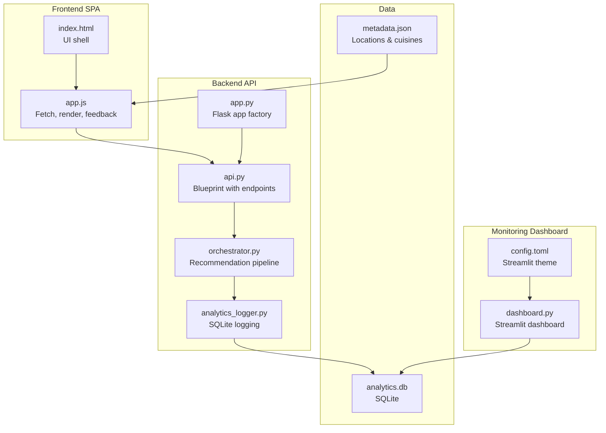
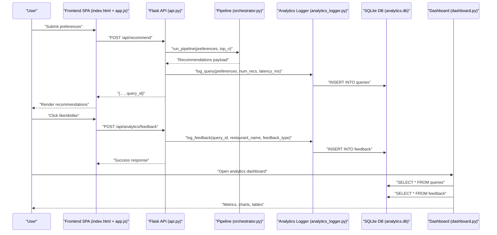
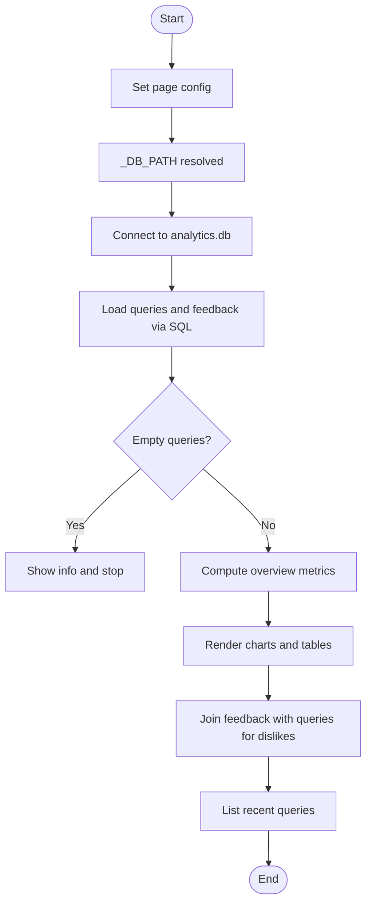
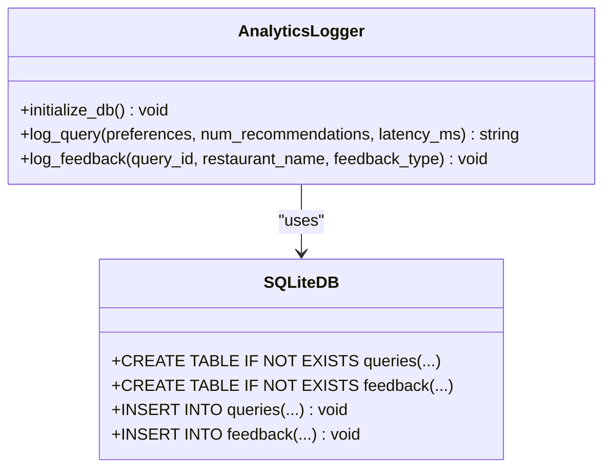
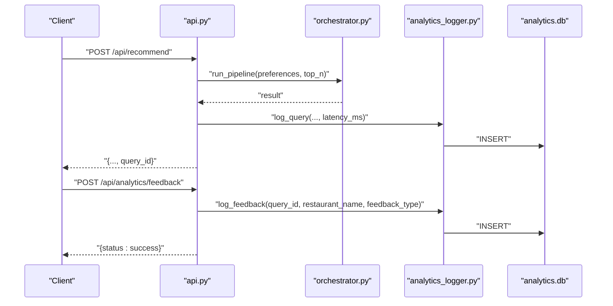
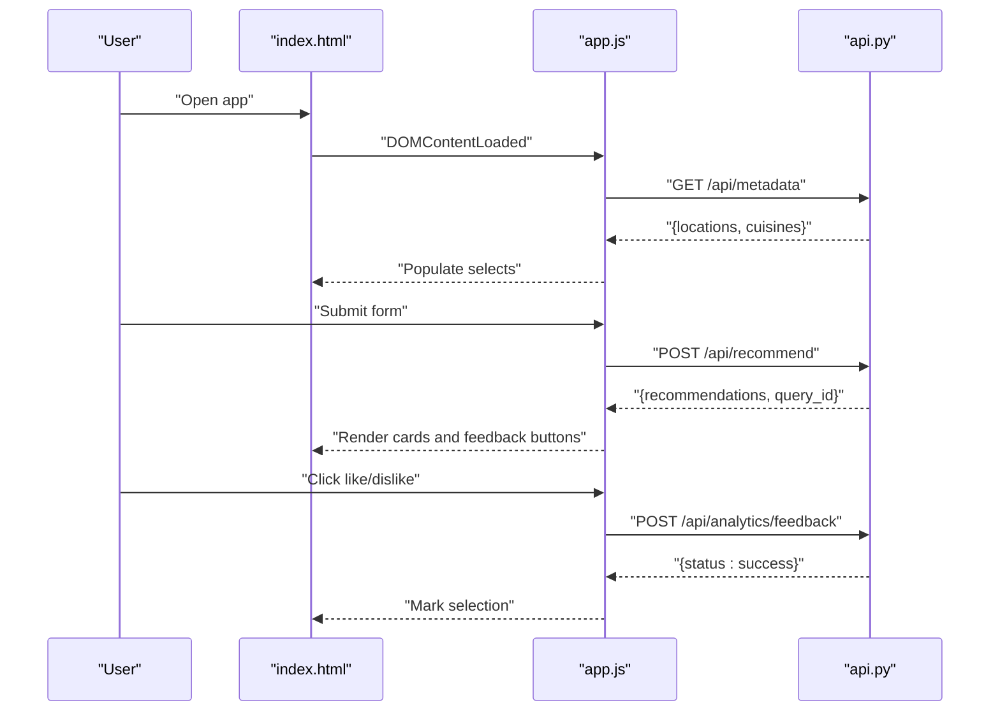
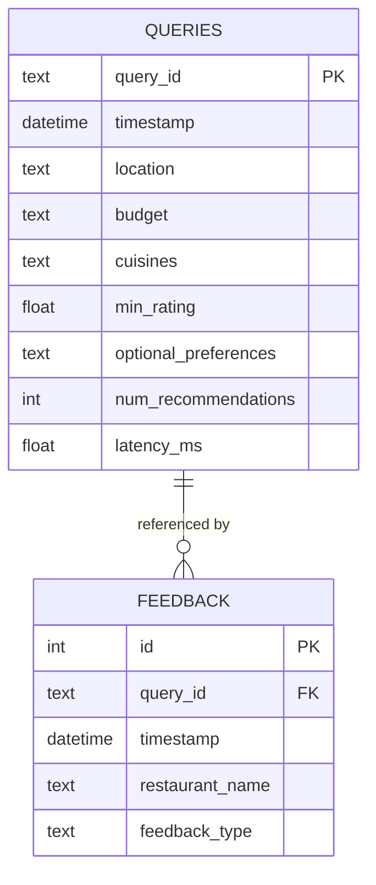
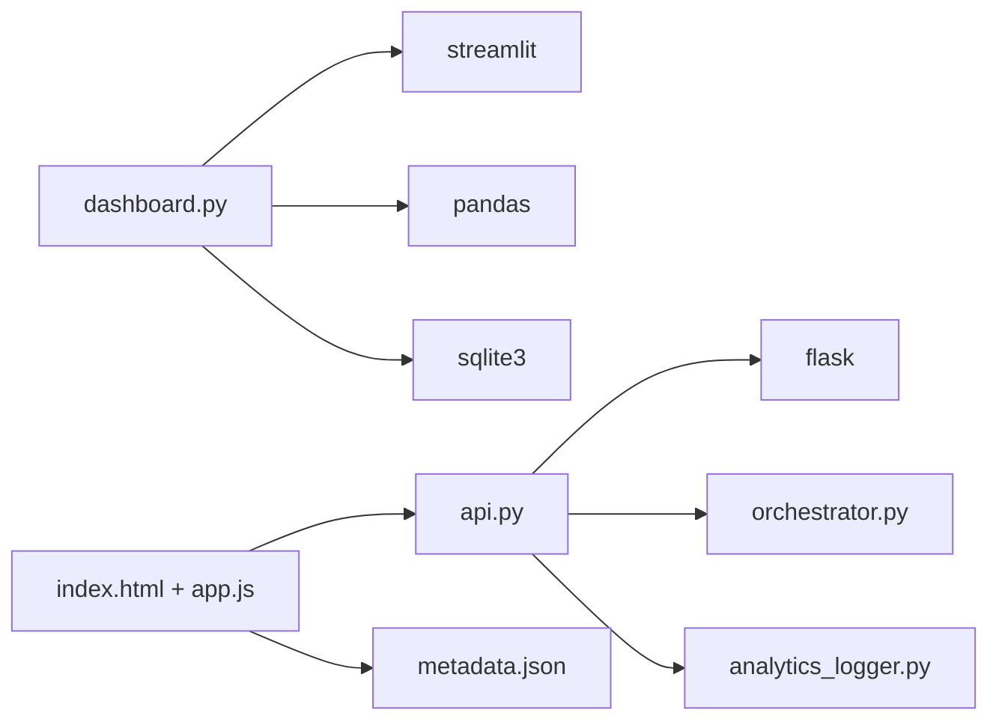

# Dashboard and Visualization

<cite>
**Referenced Files in This Document**
- [dashboard.py](file://Zomato/architecture/phase_6_monitoring/dashboard/dashboard.py)
- [analytics_logger.py](file://Zomato/architecture/phase_6_monitoring/backend/analytics_logger.py)
- [api.py](file://Zomato/architecture/phase_6_monitoring/backend/api.py)
- [app.py](file://Zomato/architecture/phase_6_monitoring/backend/app.py)
- [orchestrator.py](file://Zomato/architecture/phase_6_monitoring/backend/orchestrator.py)
- [index.html](file://Zomato/architecture/phase_6_monitoring/frontend/index.html)
- [app.js](file://Zomato/architecture/phase_6_monitoring/frontend/js/app.js)
- [config.toml](file://Zomato/architecture/phase_7_deployment/.streamlit/config.toml)
- [requirements.txt](file://Zomato/architecture/phase_7_deployment/requirements.txt)
- [metadata.json](file://Zomato/architecture/phase_6_monitoring/metadata.json)
</cite>

## Table of Contents
1. [Introduction](#introduction)
2. [Project Structure](#project-structure)
3. [Core Components](#core-components)
4. [Architecture Overview](#architecture-overview)
5. [Detailed Component Analysis](#detailed-component-analysis)
6. [Dependency Analysis](#dependency-analysis)
7. [Performance Considerations](#performance-considerations)
8. [Troubleshooting Guide](#troubleshooting-guide)
9. [Conclusion](#conclusion)
10. [Appendices](#appendices)

## Introduction
This document describes the analytics dashboard system for monitoring the Zomato AI recommendation pipeline. It focuses on the dashboard implementation that visualizes system performance metrics, query trends, and user feedback patterns. The documentation covers data retrieval from the analytics database, chart generation techniques, and the dashboard layout and interactive elements. It also explains configuration options, customization possibilities, and guidance for extending the dashboard with new visualizations.

## Project Structure
The analytics dashboard resides in the monitoring phase of the system and integrates with the recommendation pipeline. The key components are:
- Dashboard front-end: Streamlit-based Python script that renders metrics and charts.
- Backend API: Flask endpoints that serve recommendation results and accept feedback logs.
- Analytics logger: SQLite-backed persistence for queries and feedback.
- Frontend SPA: HTML/CSS/JS that drives user interactions and displays recommendations.
- Orchestrator: Pipeline that generates recommendations and injects a query identifier for analytics linkage.
- Deployment configuration: Streamlit theme and dependencies.

**Diagram sources**
- [dashboard.py:1-102](file://Zomato/architecture/phase_6_monitoring/dashboard/dashboard.py#L1-L102)
- [config.toml:1-7](file://Zomato/architecture/phase_7_deployment/.streamlit/config.toml#L1-L7)
- [app.py:14-41](file://Zomato/architecture/phase_6_monitoring/backend/app.py#L14-L41)
- [api.py:15-119](file://Zomato/architecture/phase_6_monitoring/backend/api.py#L15-L119)
- [analytics_logger.py:13-87](file://Zomato/architecture/phase_6_monitoring/backend/analytics_logger.py#L13-L87)
- [orchestrator.py:112-303](file://Zomato/architecture/phase_6_monitoring/backend/orchestrator.py#L112-L303)
- [index.html:1-198](file://Zomato/architecture/phase_6_monitoring/frontend/index.html#L1-L198)
- [app.js:167-195](file://Zomato/architecture/phase_6_monitoring/frontend/js/app.js#L167-L195)
- [metadata.json:1-196](file://Zomato/architecture/phase_6_monitoring/metadata.json#L1-L196)

**Section sources**
- [dashboard.py:1-102](file://Zomato/architecture/phase_6_monitoring/dashboard/dashboard.py#L1-L102)
- [app.py:14-41](file://Zomato/architecture/phase_6_monitoring/backend/app.py#L14-L41)

## Core Components
- Dashboard renderer: Loads analytics data, computes overview metrics, and renders charts and tables.
- Analytics logger: Initializes SQLite tables and persists queries and feedback.
- API endpoints: Serve recommendations, metadata, and accept feedback submissions.
- Frontend SPA: Collects preferences, renders results, and submits feedback to analytics.
- Orchestrator: Generates recommendations and attaches a query identifier for analytics linkage.
- Theme and dependencies: Streamlit theme configuration and required packages.

Key responsibilities:
- Data retrieval: Connects to SQLite, executes SQL queries, and loads datasets for visualization.
- Visualization: Uses built-in Streamlit chart widgets for line and bar charts.
- Interactivity: Provides recent queries table and problematic recommendations display.
- Feedback loop: Enables users to submit feedback via the frontend, which is persisted for analysis.

**Section sources**
- [dashboard.py:23-101](file://Zomato/architecture/phase_6_monitoring/dashboard/dashboard.py#L23-L101)
- [analytics_logger.py:13-87](file://Zomato/architecture/phase_6_monitoring/backend/analytics_logger.py#L13-L87)
- [api.py:43-119](file://Zomato/architecture/phase_6_monitoring/backend/api.py#L43-L119)
- [app.js:167-195](file://Zomato/architecture/phase_6_monitoring/frontend/js/app.js#L167-L195)
- [orchestrator.py:112-303](file://Zomato/architecture/phase_6_monitoring/backend/orchestrator.py#L112-L303)

## Architecture Overview
The dashboard reads analytics data from a local SQLite database and presents it in an interactive Streamlit interface. The recommendation pipeline logs queries and feedback, which the dashboard consumes to compute metrics and trends. The frontend collects user preferences and displays recommendations, while enabling feedback submission that is persisted for later analysis.

**Diagram sources**
- [api.py:43-119](file://Zomato/architecture/phase_6_monitoring/backend/api.py#L43-L119)
- [analytics_logger.py:46-87](file://Zomato/architecture/phase_6_monitoring/backend/analytics_logger.py#L46-L87)
- [dashboard.py:23-101](file://Zomato/architecture/phase_6_monitoring/dashboard/dashboard.py#L23-L101)
- [app.js:167-195](file://Zomato/architecture/phase_6_monitoring/frontend/js/app.js#L167-L195)

## Detailed Component Analysis

### Dashboard Implementation (dashboard.py)
The dashboard performs:
- Page configuration and database connectivity checks.
- Data loading from SQLite for queries and feedback.
- Overview metrics computation (total queries, average latency, feedback counts, like ratio).
- Trend visualizations (hourly query volume and feedback distribution).
- Problematic recommendations display by joining feedback with queries.
- Recent queries listing.

**Diagram sources**
- [dashboard.py:7-101](file://Zomato/architecture/phase_6_monitoring/dashboard/dashboard.py#L7-L101)

**Section sources**
- [dashboard.py:7-101](file://Zomato/architecture/phase_6_monitoring/dashboard/dashboard.py#L7-L101)

### Analytics Logger (analytics_logger.py)
Responsibilities:
- Initialize SQLite tables for queries and feedback.
- Persist incoming query metadata and feedback entries.
- Serialize preference arrays and numeric fields for storage.

**Diagram sources**
- [analytics_logger.py:13-87](file://Zomato/architecture/phase_6_monitoring/backend/analytics_logger.py#L13-L87)

**Section sources**
- [analytics_logger.py:13-87](file://Zomato/architecture/phase_6_monitoring/backend/analytics_logger.py#L13-L87)

### API Layer (api.py)
Endpoints:
- GET /api/health: Health check.
- GET /api/sample: Returns sample recommendations for demos.
- GET /api/metadata: Serves locations and cuisines for UI dropdowns.
- POST /api/recommend: Runs the pipeline, logs the query, and returns recommendations with a query identifier.
- POST /api/analytics/feedback: Accepts feedback and logs it.

**Diagram sources**
- [api.py:43-119](file://Zomato/architecture/phase_6_monitoring/backend/api.py#L43-L119)
- [analytics_logger.py:46-87](file://Zomato/architecture/phase_6_monitoring/backend/analytics_logger.py#L46-L87)

**Section sources**
- [api.py:15-119](file://Zomato/architecture/phase_6_monitoring/backend/api.py#L15-L119)

### Frontend SPA (index.html + app.js)
The frontend:
- Renders a preference form with sliders and dropdowns.
- Fetches metadata (locations and cuisines) on load.
- Submits preferences to the backend and displays recommendations.
- Enables feedback submission per recommendation, sending data to the analytics endpoint.
- Manages UI states (empty, loading, results, error).

**Diagram sources**
- [index.html:1-198](file://Zomato/architecture/phase_6_monitoring/frontend/index.html#L1-L198)
- [app.js:294-324](file://Zomato/architecture/phase_6_monitoring/frontend/js/app.js#L294-L324)
- [app.js:167-195](file://Zomato/architecture/phase_6_monitoring/frontend/js/app.js#L167-L195)
- [api.py:43-119](file://Zomato/architecture/phase_6_monitoring/backend/api.py#L43-L119)

**Section sources**
- [index.html:1-198](file://Zomato/architecture/phase_6_monitoring/frontend/index.html#L1-L198)
- [app.js:167-195](file://Zomato/architecture/phase_6_monitoring/frontend/js/app.js#L167-L195)

### Orchestrator Integration (orchestrator.py)
The orchestrator runs the full pipeline and returns a payload that includes a query identifier. This identifier links recommendations to analytics events for correlation in the dashboard.

Highlights:
- Loads restaurants from either a live dataset or a fallback sample.
- Executes Phase 3 candidate retrieval and ranking.
- Calls Phase 4 LLM ranking or falls back to Phase 3 results.
- Returns structured recommendations with metadata and a query identifier.

**Section sources**
- [orchestrator.py:112-303](file://Zomato/architecture/phase_6_monitoring/backend/orchestrator.py#L112-L303)

### Data Model and Schema
The analytics database schema consists of two tables:
- queries: Stores query identifiers, timestamps, preferences, and latency.
- feedback: Stores feedback entries linked to queries.

**Diagram sources**
- [analytics_logger.py:18-41](file://Zomato/architecture/phase_6_monitoring/backend/analytics_logger.py#L18-L41)

**Section sources**
- [analytics_logger.py:18-41](file://Zomato/architecture/phase_6_monitoring/backend/analytics_logger.py#L18-L41)

## Dependency Analysis
- Dashboard depends on:
  - Streamlit for UI and charting.
  - Pandas for data manipulation and chart-ready structures.
  - SQLite database for analytics persistence.
- API depends on:
  - Flask for routing and CORS support.
  - Orchestrator for recommendation generation.
  - Analytics logger for persisting events.
- Frontend depends on:
  - API endpoints for recommendations and metadata.
  - DOM APIs for rendering and interactivity.

**Diagram sources**
- [dashboard.py:1-6](file://Zomato/architecture/phase_6_monitoring/dashboard/dashboard.py#L1-L6)
- [api.py:10-13](file://Zomato/architecture/phase_6_monitoring/backend/api.py#L10-L13)
- [requirements.txt:1-6](file://Zomato/architecture/phase_7_deployment/requirements.txt#L1-L6)

**Section sources**
- [dashboard.py:1-6](file://Zomato/architecture/phase_6_monitoring/dashboard/dashboard.py#L1-L6)
- [api.py:10-13](file://Zomato/architecture/phase_6_monitoring/backend/api.py#L10-L13)
- [requirements.txt:1-6](file://Zomato/architecture/phase_7_deployment/requirements.txt#L1-L6)

## Performance Considerations
- Data retrieval: The dashboard loads entire tables into memory. For large datasets, consider pagination or server-side filtering.
- Chart rendering: Streamlit charts are convenient but can be heavy with large datasets. Downsample or aggregate data before plotting.
- Database I/O: SQLite is embedded and suitable for development. For production dashboards, consider indexing on timestamp and feedback_type for faster aggregations.
- Frontend responsiveness: Debounce frequent requests and avoid unnecessary re-renders in the SPA.

## Troubleshooting Guide
Common issues and resolutions:
- Database not found: The dashboard checks for the presence of the analytics database and stops with an informative message if missing. Ensure the backend has been executed and analytics events have been logged.
- Empty analytics: If no queries are logged, the dashboard shows a friendly message and halts further processing.
- API errors: The frontend surfaces server errors during recommendation or feedback submission. Verify backend health and endpoint availability.
- Feedback not appearing: Confirm that feedback submissions reach the analytics endpoint and that the database contains feedback rows.

**Section sources**
- [dashboard.py:11-15](file://Zomato/architecture/phase_6_monitoring/dashboard/dashboard.py#L11-L15)
- [dashboard.py:23-30](file://Zomato/architecture/phase_6_monitoring/dashboard/dashboard.py#L23-L30)
- [app.js:233-250](file://Zomato/architecture/phase_6_monitoring/frontend/js/app.js#L233-L250)
- [app.js:167-195](file://Zomato/architecture/phase_6_monitoring/frontend/js/app.js#L167-L195)

## Conclusion
The analytics dashboard provides a concise overview of system performance and user sentiment. It leverages SQLite for persistence, Streamlit for visualization, and a straightforward API to integrate recommendation generation with feedback collection. The modular design allows for incremental enhancements, such as adding new metrics, expanding visualizations, and integrating external data sources.

## Appendices

### Rendering Performance Charts
To render performance charts:
- Convert timestamps to datetime and group by hour for time-series plots.
- Use line charts for continuous metrics like query volume over time.
- Aggregate latency and ratings for summary statistics.

**Section sources**
- [dashboard.py:63-67](file://Zomato/architecture/phase_6_monitoring/dashboard/dashboard.py#L63-L67)

### Displaying Query Statistics
To display query statistics:
- Compute totals, averages, and ratios from loaded datasets.
- Present KPIs using Streamlit metrics for immediate visibility.

**Section sources**
- [dashboard.py:39-51](file://Zomato/architecture/phase_6_monitoring/dashboard/dashboard.py#L39-L51)

### Presenting Feedback Analysis
To present feedback analysis:
- Count feedback types and visualize distributions with bar charts.
- Join feedback with queries to highlight problematic recommendations and user requests.

**Section sources**
- [dashboard.py:70-73](file://Zomato/architecture/phase_6_monitoring/dashboard/dashboard.py#L70-L73)
- [dashboard.py:83-91](file://Zomato/architecture/phase_6_monitoring/dashboard/dashboard.py#L83-L91)

### Dashboard Layout and Interactive Elements
Layout highlights:
- Wide page configuration for better chart width.
- Metric cards for high-level KPIs.
- Two-column trend section for query volume and feedback distribution.
- Problematic recommendations section with actionable insights.
- Recent queries table for auditability.

**Section sources**
- [dashboard.py:7](file://Zomato/architecture/phase_6_monitoring/dashboard/dashboard.py#L7)
- [dashboard.py:47-51](file://Zomato/architecture/phase_6_monitoring/dashboard/dashboard.py#L47-L51)
- [dashboard.py:58-75](file://Zomato/architecture/phase_6_monitoring/dashboard/dashboard.py#L58-L75)
- [dashboard.py:80-95](file://Zomato/architecture/phase_6_monitoring/dashboard/dashboard.py#L80-L95)
- [dashboard.py:100-101](file://Zomato/architecture/phase_6_monitoring/dashboard/dashboard.py#L100-L101)

### Visualization Libraries and Techniques
- Visualization library: Streamlit’s built-in chart widgets (line_chart, bar_chart).
- Data manipulation: Pandas for grouping, counting, and merging datasets.
- Real-time updates: The dashboard reloads data on each run; for true real-time updates, consider periodic refresh or a streaming backend.

**Section sources**
- [dashboard.py:63-73](file://Zomato/architecture/phase_6_monitoring/dashboard/dashboard.py#L63-L73)
- [dashboard.py:1-4](file://Zomato/architecture/phase_6_monitoring/dashboard/dashboard.py#L1-L4)

### Dashboard Customization Options
Customization areas:
- Theme: Adjust Streamlit theme via configuration for colors and fonts.
- Metrics: Add new computed metrics (e.g., error rate, conversion).
- Charts: Introduce additional visualizations (e.g., histograms, scatter plots).
- Filters: Allow date range or preference-based filtering in the dashboard.
- Refresh behavior: Implement automatic refresh intervals or manual triggers.

**Section sources**
- [config.toml:1-7](file://Zomato/architecture/phase_7_deployment/.streamlit/config.toml#L1-L7)
- [dashboard.py:23-30](file://Zomato/architecture/phase_6_monitoring/dashboard/dashboard.py#L23-L30)

### Configuration Parameters
- Database path: Resolved relative to the dashboard module.
- Page configuration: Wide layout and page title.
- Theme: Primary color, background, secondary background, text color, and font family.
- Dependencies: Streamlit, pandas, and related packages.

**Section sources**
- [dashboard.py:9](file://Zomato/architecture/phase_6_monitoring/dashboard/dashboard.py#L9)
- [dashboard.py:7](file://Zomato/architecture/phase_6_monitoring/dashboard/dashboard.py#L7)
- [config.toml:1-7](file://Zomato/architecture/phase_7_deployment/.streamlit/config.toml#L1-L7)
- [requirements.txt:1-6](file://Zomato/architecture/phase_7_deployment/requirements.txt#L1-L6)

### Extending Dashboard Functionality
Recommended extensions:
- Add new metrics: Incorporate additional computations from the analytics tables.
- New visualizations: Integrate advanced charts or external libraries compatible with Streamlit.
- Filtering and slicing: Enable date range and preference filters for deeper insights.
- Export capabilities: Allow exporting charts or tables for reports.
- Alerting: Surface anomalies in latency or feedback trends.

Guidance:
- Keep data loading efficient and avoid heavy computations on every refresh.
- Maintain backward compatibility with existing analytics schema.
- Use consistent column naming and data types for joins and aggregations.

**Section sources**
- [dashboard.py:23-101](file://Zomato/architecture/phase_6_monitoring/dashboard/dashboard.py#L23-L101)
- [analytics_logger.py:18-41](file://Zomato/architecture/phase_6_monitoring/backend/analytics_logger.py#L18-L41)