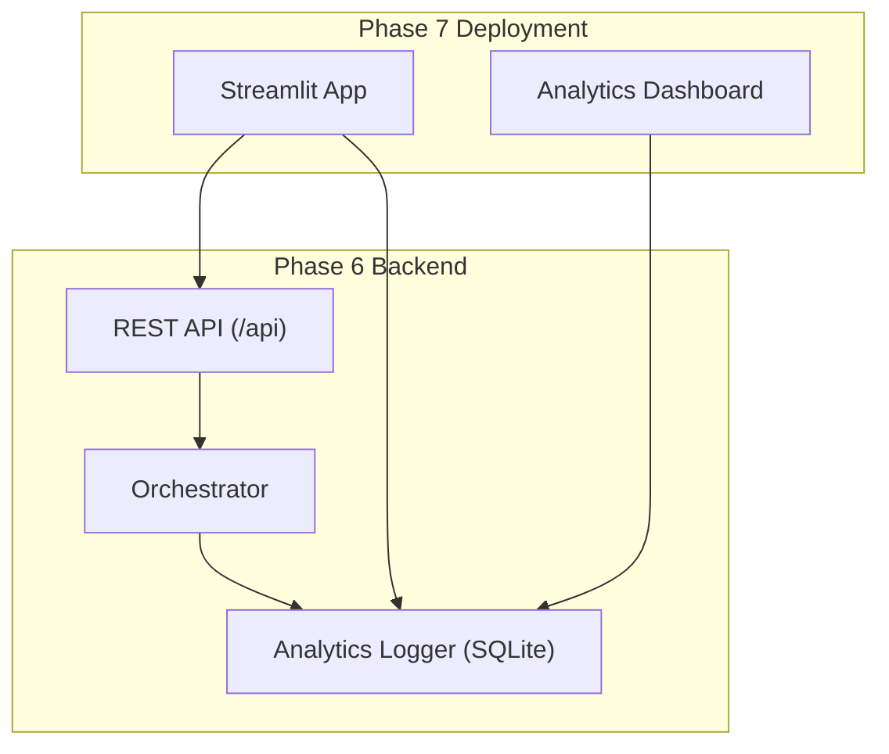
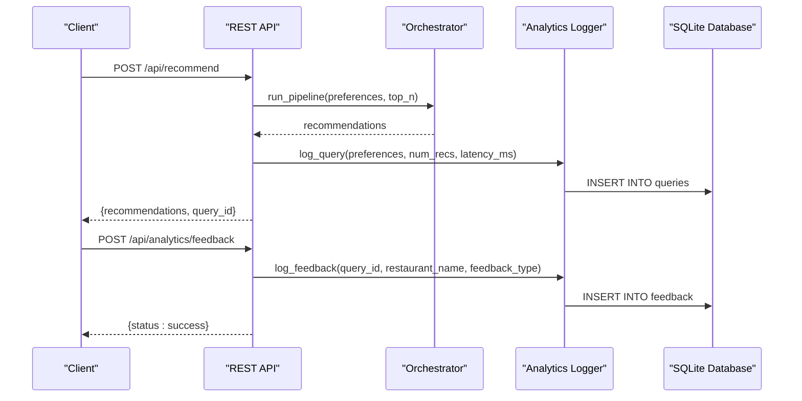
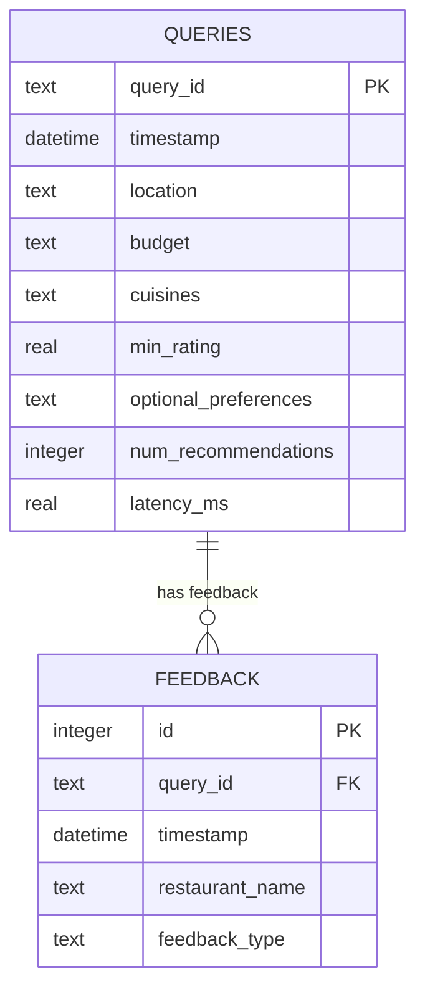
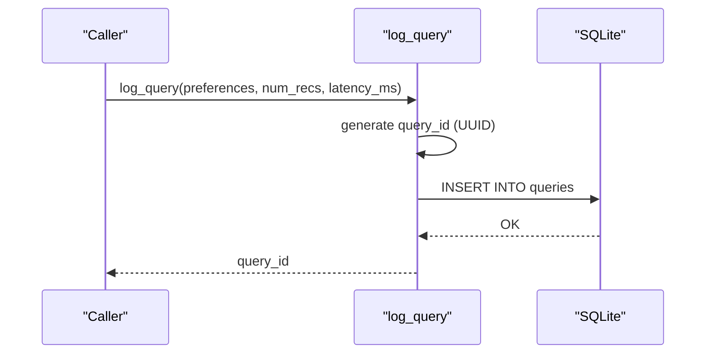
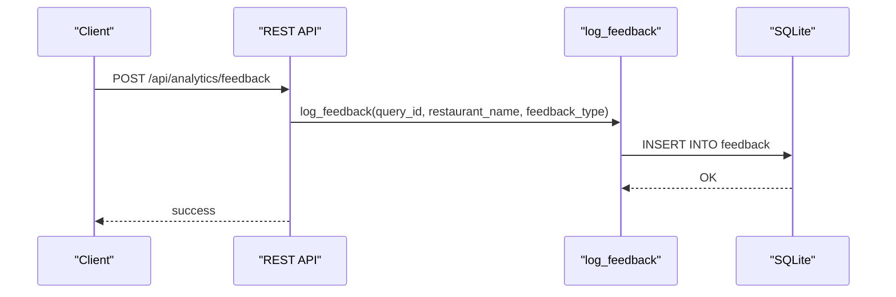
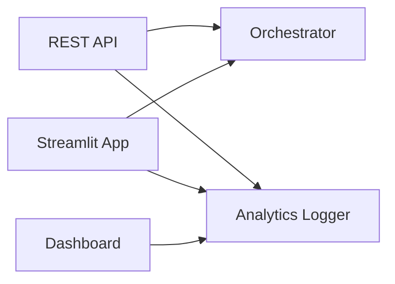

# Data Logging and Storage

<cite>
**Referenced Files in This Document**
- [analytics_logger.py](file://Zomato/architecture/phase_6_monitoring/backend/analytics_logger.py)
- [analytics_logger.py](file://Zomato/architecture/phase_7_deployment/analytics_logger.py)
- [api.py](file://Zomato/architecture/phase_6_monitoring/backend/api.py)
- [app.py](file://Zomato/architecture/phase_7_deployment/app.py)
- [dashboard.py](file://Zomato/architecture/phase_6_monitoring/dashboard/dashboard.py)
- [schema.py](file://Zomato/architecture/phase_2_preference_capture/schema.py)
- [schema.py](file://Zomato/architecture/phase_3_candidate_retrieval/schema.py)
- [schema.py](file://Zomato/architecture/phase_4_llm_recommendation/schema.py)
- [metadata.json](file://Zomato/architecture/phase_7_deployment/metadata.json)
</cite>

## Table of Contents
1. [Introduction](#introduction)
2. [Project Structure](#project-structure)
3. [Core Components](#core-components)
4. [Architecture Overview](#architecture-overview)
5. [Detailed Component Analysis](#detailed-component-analysis)
6. [Dependency Analysis](#dependency-analysis)
7. [Performance Considerations](#performance-considerations)
8. [Troubleshooting Guide](#troubleshooting-guide)
9. [Conclusion](#conclusion)
10. [Appendices](#appendices)

## Introduction
This document explains the analytics data logging system used to capture user queries and feedback for the Zomato recommendation pipeline. It covers the SQLite database schema, the functions that write to the database, and how the system integrates with the recommendation UI and dashboard. It also provides practical guidance for initialization, insertion, UUID generation, JSON serialization, connection management, data retention, optimization, error handling, and troubleshooting.

## Project Structure
The analytics logging system spans two deployment modes:
- Phase 6 backend: exposes REST endpoints to run the pipeline and log telemetry.
- Phase 7 deployment: a Streamlit app that captures user preferences, runs the pipeline, logs queries, and records feedback.

**Diagram sources**
- [api.py:43-95](file://Zomato/architecture/phase_6_monitoring/backend/api.py#L43-L95)
- [app.py:82-127](file://Zomato/architecture/phase_7_deployment/app.py#L82-L127)
- [dashboard.py:23-30](file://Zomato/architecture/phase_6_monitoring/dashboard/dashboard.py#L23-L30)

**Section sources**
- [api.py:1-119](file://Zomato/architecture/phase_6_monitoring/backend/api.py#L1-L119)
- [app.py:1-128](file://Zomato/architecture/phase_7_deployment/app.py#L1-L128)
- [dashboard.py:1-102](file://Zomato/architecture/phase_6_monitoring/dashboard/dashboard.py#L1-L102)

## Core Components
- SQLite database with two tables:
  - queries: stores query metadata and performance metrics.
  - feedback: stores user feedback linked to a specific query.
- Analytics logger module:
  - Initializes tables on import.
  - Provides functions to log queries and feedback.
- Integration points:
  - REST API logs queries during recommendation requests.
  - Streamlit app logs queries and feedback during user interactions.
  - Dashboard reads from the database for analytics.

**Section sources**
- [analytics_logger.py:13-86](file://Zomato/architecture/phase_6_monitoring/backend/analytics_logger.py#L13-L86)
- [analytics_logger.py:13-86](file://Zomato/architecture/phase_7_deployment/analytics_logger.py#L13-L86)
- [api.py:86-95](file://Zomato/architecture/phase_6_monitoring/backend/api.py#L86-L95)
- [app.py:103-121](file://Zomato/architecture/phase_7_deployment/app.py#L103-L121)
- [dashboard.py:23-30](file://Zomato/architecture/phase_6_monitoring/dashboard/dashboard.py#L23-L30)

## Architecture Overview
The logging architecture centers on a shared analytics logger module that both the backend API and the Streamlit app use. The dashboard reads from the same database to present analytics.

**Diagram sources**
- [api.py:43-118](file://Zomato/architecture/phase_6_monitoring/backend/api.py#L43-L118)
- [analytics_logger.py:46-83](file://Zomato/architecture/phase_6_monitoring/backend/analytics_logger.py#L46-L83)

## Detailed Component Analysis

### Database Schema
The SQLite database defines two tables:

- queries
  - query_id: Text, primary key, unique identifier for each query.
  - timestamp: Datetime, default current timestamp.
  - location: Text.
  - budget: Text.
  - cuisines: Text (JSON-encoded array).
  - min_rating: Real (float).
  - optional_preferences: Text (JSON-encoded array).
  - num_recommendations: Integer.
  - latency_ms: Real (float).

- feedback
  - id: Integer, autoincrement primary key.
  - query_id: Text, foreign key referencing queries.query_id.
  - timestamp: Datetime, default current timestamp.
  - restaurant_name: Text.
  - feedback_type: Text (values: like, dislike).

Relationships:
- feedback.query_id references queries.query_id.

**Diagram sources**
- [analytics_logger.py:18-41](file://Zomato/architecture/phase_6_monitoring/backend/analytics_logger.py#L18-L41)
- [analytics_logger.py:18-41](file://Zomato/architecture/phase_7_deployment/analytics_logger.py#L18-L41)

**Section sources**
- [analytics_logger.py:18-41](file://Zomato/architecture/phase_6_monitoring/backend/analytics_logger.py#L18-L41)
- [analytics_logger.py:18-41](file://Zomato/architecture/phase_7_deployment/analytics_logger.py#L18-L41)

### log_query Function
Purpose:
- Generate a unique query_id.
- Serialize complex preference arrays to JSON.
- Insert a row into the queries table with user preferences, recommendation count, and latency.

Key behaviors:
- UUID generation for query_id.
- JSON serialization for cuisines and optional_preferences.
- Connection lifecycle: open, execute, commit, close.

Integration points:
- REST API: invoked after pipeline completion.
- Streamlit app: invoked after pipeline completion.

**Diagram sources**
- [analytics_logger.py:46-70](file://Zomato/architecture/phase_6_monitoring/backend/analytics_logger.py#L46-L70)
- [analytics_logger.py:46-70](file://Zomato/architecture/phase_7_deployment/analytics_logger.py#L46-L70)

**Section sources**
- [analytics_logger.py:46-70](file://Zomato/architecture/phase_6_monitoring/backend/analytics_logger.py#L46-L70)
- [analytics_logger.py:46-70](file://Zomato/architecture/phase_7_deployment/analytics_logger.py#L46-L70)
- [api.py:86-91](file://Zomato/architecture/phase_6_monitoring/backend/api.py#L86-L91)
- [app.py:103](file://Zomato/architecture/phase_7_deployment/app.py#L103)

### log_feedback Function
Purpose:
- Record user feedback (like/dislike) for a specific restaurant recommendation.
- Link feedback to a query via query_id.

Key behaviors:
- Connection lifecycle: open, execute, commit, close.
- Enforces feedback_type constraint in the API layer.

Integration points:
- REST API: accepts explicit feedback submissions.
- Streamlit app: invoked from user clicks on like/dislike buttons.

**Diagram sources**
- [api.py:97-118](file://Zomato/architecture/phase_6_monitoring/backend/api.py#L97-L118)
- [analytics_logger.py:72-83](file://Zomato/architecture/phase_6_monitoring/backend/analytics_logger.py#L72-L83)

**Section sources**
- [analytics_logger.py:72-83](file://Zomato/architecture/phase_6_monitoring/backend/analytics_logger.py#L72-L83)
- [api.py:97-118](file://Zomato/architecture/phase_6_monitoring/backend/api.py#L97-L118)
- [app.py:115-120](file://Zomato/architecture/phase_7_deployment/app.py#L115-L120)

### Database Initialization
Behavior:
- On import, the module ensures both tables exist.
- Uses a single connection per operation and closes it immediately after committing.

Best practices:
- Initialize once at import time to avoid redundant DDL.
- Keep initialization lightweight and idempotent.

**Section sources**
- [analytics_logger.py:13-44](file://Zomato/architecture/phase_6_monitoring/backend/analytics_logger.py#L13-L44)
- [analytics_logger.py:13-44](file://Zomato/architecture/phase_7_deployment/analytics_logger.py#L13-L44)

### Data Serialization and Deserialization
- Complex preference arrays (cuisines and optional_preferences) are stored as JSON strings in the queries table.
- The dashboard reads these fields back into memory for analysis.

Guidelines:
- Always serialize arrays/lists before insertion.
- Deserialize when needed for display or analysis.

**Section sources**
- [analytics_logger.py:61-63](file://Zomato/architecture/phase_6_monitoring/backend/analytics_logger.py#L61-L63)
- [analytics_logger.py:61-63](file://Zomato/architecture/phase_7_deployment/analytics_logger.py#L61-L63)
- [dashboard.py:25-26](file://Zomato/architecture/phase_6_monitoring/dashboard/dashboard.py#L25-L26)

### UUID Generation
- Each query receives a unique query_id generated at runtime.
- The ID is used to correlate feedback with the originating query.

**Section sources**
- [analytics_logger.py:48](file://Zomato/architecture/phase_6_monitoring/backend/analytics_logger.py#L48)
- [analytics_logger.py:48](file://Zomato/architecture/phase_7_deployment/analytics_logger.py#L48)

### Database Connection Management
- Each function opens a connection, performs the operation, commits, and closes the connection.
- The dashboard follows the same pattern.

Recommendations:
- Keep connections short-lived to reduce contention.
- Consider connection pooling for high-throughput scenarios.

**Section sources**
- [analytics_logger.py:49-69](file://Zomato/architecture/phase_6_monitoring/backend/analytics_logger.py#L49-L69)
- [analytics_logger.py:74-83](file://Zomato/architecture/phase_6_monitoring/backend/analytics_logger.py#L74-L83)
- [dashboard.py:23-30](file://Zomato/architecture/phase_6_monitoring/dashboard/dashboard.py#L23-L30)

### Preference Schema Alignment
The preference objects used across the pipeline align with the fields captured in the queries table:
- location: Text
- budget: Text
- cuisines: List of strings (serialized to JSON)
- min_rating: Float
- optional_preferences: List of strings (serialized to JSON)

This alignment ensures consistent storage and analysis.

**Section sources**
- [schema.py:8-16](file://Zomato/architecture/phase_2_preference_capture/schema.py#L8-L16)
- [schema.py:10-15](file://Zomato/architecture/phase_3_candidate_retrieval/schema.py#L10-L15)
- [schema.py:18-23](file://Zomato/architecture/phase_4_llm_recommendation/schema.py#L18-L23)
- [analytics_logger.py:59-66](file://Zomato/architecture/phase_6_monitoring/backend/analytics_logger.py#L59-L66)

### Example Workflows

- Initialize the database
  - Import the analytics logger module to trigger table creation.
  - Alternatively, call the initialization function programmatically.

- Insert a query log
  - Call the logging function with a preferences dictionary, number of recommendations, and latency in milliseconds.
  - The function returns a query_id for subsequent feedback logging.

- Store feedback data
  - Call the feedback logging function with the query_id, restaurant name, and feedback type (like or dislike).

- Retrieve and analyze data
  - The dashboard loads both tables and computes metrics such as total queries, average latency, and like ratio.

**Section sources**
- [analytics_logger.py:13-44](file://Zomato/architecture/phase_6_monitoring/backend/analytics_logger.py#L13-L44)
- [analytics_logger.py:46-70](file://Zomato/architecture/phase_6_monitoring/backend/analytics_logger.py#L46-L70)
- [analytics_logger.py:72-83](file://Zomato/architecture/phase_6_monitoring/backend/analytics_logger.py#L72-L83)
- [dashboard.py:23-30](file://Zomato/architecture/phase_6_monitoring/dashboard/dashboard.py#L23-L30)

## Dependency Analysis
- The REST API depends on the orchestrator and the analytics logger.
- The Streamlit app depends on the orchestrator and the analytics logger.
- The dashboard depends on the analytics logger’s database.
- Both logger implementations are identical and can be used interchangeably.

**Diagram sources**
- [api.py:12-13](file://Zomato/architecture/phase_6_monitoring/backend/api.py#L12-L13)
- [app.py:21-22](file://Zomato/architecture/phase_7_deployment/app.py#L21-L22)
- [dashboard.py:9](file://Zomato/architecture/phase_6_monitoring/dashboard/dashboard.py#L9)

**Section sources**
- [api.py:12-13](file://Zomato/architecture/phase_6_monitoring/backend/api.py#L12-L13)
- [app.py:21-22](file://Zomato/architecture/phase_7_deployment/app.py#L21-L22)
- [dashboard.py:9](file://Zomato/architecture/phase_6_monitoring/dashboard/dashboard.py#L9)

## Performance Considerations
- Connection lifecycle: keep connections short-lived to minimize contention.
- Indexes: consider adding indexes on frequently queried columns (e.g., timestamp, query_id) if query volume grows.
- JSON fields: storing arrays as JSON is convenient; for heavy analytics, consider normalization or materialized views.
- Batch writes: if throughput increases, batch inserts and use transactions to reduce overhead.
- Vacuum and analyze: periodically optimize SQLite databases to reclaim space and update statistics.

[No sources needed since this section provides general guidance]

## Troubleshooting Guide
Common issues and resolutions:
- Database not found
  - Ensure the database path resolves correctly and the logger module is imported to initialize tables.
  - Verify the path resolution logic and that the parent directory exists.

- Missing tables
  - Confirm that the initialization function was executed or that the module was imported.

- JSON serialization errors
  - Validate that preference arrays are serializable before insertion.

- Foreign key constraint failures
  - Ensure feedback is logged with a valid query_id that exists in the queries table.

- Dashboard connectivity
  - Confirm the dashboard can locate the database file and that the connection is opened/closed correctly.

**Section sources**
- [analytics_logger.py:13-44](file://Zomato/architecture/phase_6_monitoring/backend/analytics_logger.py#L13-L44)
- [analytics_logger.py:49-69](file://Zomato/architecture/phase_6_monitoring/backend/analytics_logger.py#L49-L69)
- [analytics_logger.py:74-83](file://Zomato/architecture/phase_6_monitoring/backend/analytics_logger.py#L74-L83)
- [dashboard.py:12-15](file://Zomato/architecture/phase_6_monitoring/dashboard/dashboard.py#L12-L15)

## Conclusion
The analytics logging system provides a straightforward, robust mechanism to capture user queries and feedback. Its design emphasizes simplicity, portability, and immediate insights via the dashboard. By following the outlined practices for initialization, serialization, connection management, and maintenance, teams can reliably track query performance and user sentiment to improve the recommendation pipeline.

## Appendices

### Appendix A: Data Retention Policies
- Define retention windows (e.g., keep queries and feedback for 90 days).
- Implement periodic cleanup jobs to remove older entries.
- Archive or export historical data for long-term analysis.

[No sources needed since this section provides general guidance]

### Appendix B: Table Optimization Strategies
- Add indexes on timestamp and query_id for faster analytics queries.
- Normalize JSON fields if frequent filtering on individual items becomes necessary.
- Use PRAGMA statements to tune SQLite behavior for analytical workloads.

[No sources needed since this section provides general guidance]

### Appendix C: Error Handling for Database Operations
- Wrap database operations in try/except blocks.
- Log exceptions with context (function name, parameters).
- Return user-friendly messages while preserving stack traces for debugging.

[No sources needed since this section provides general guidance]