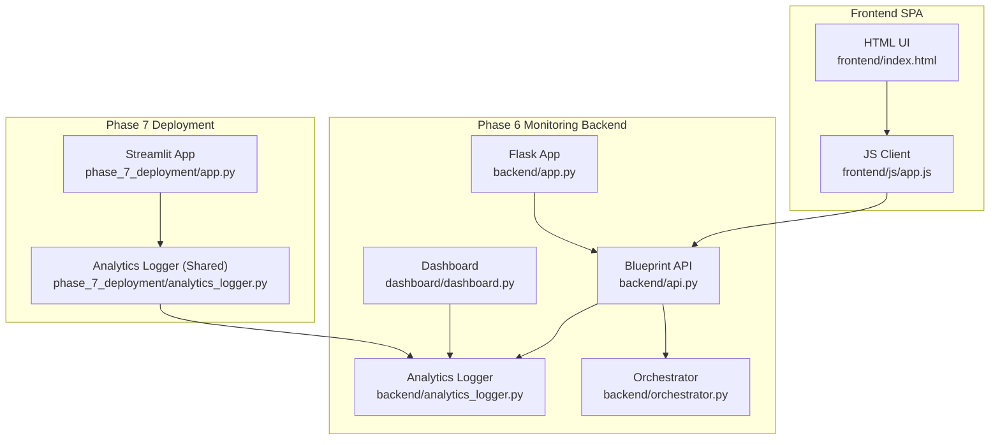
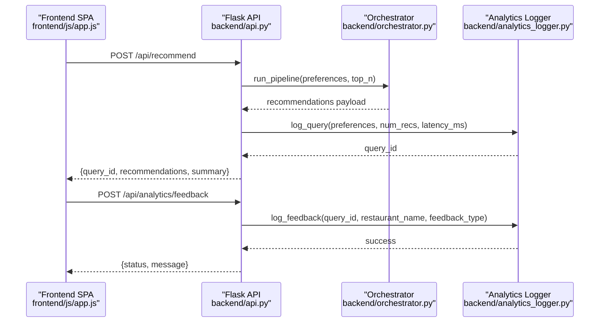
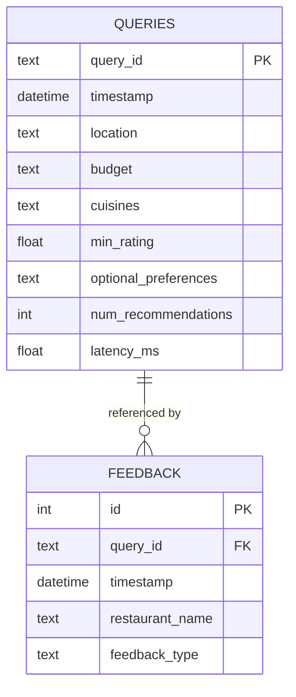
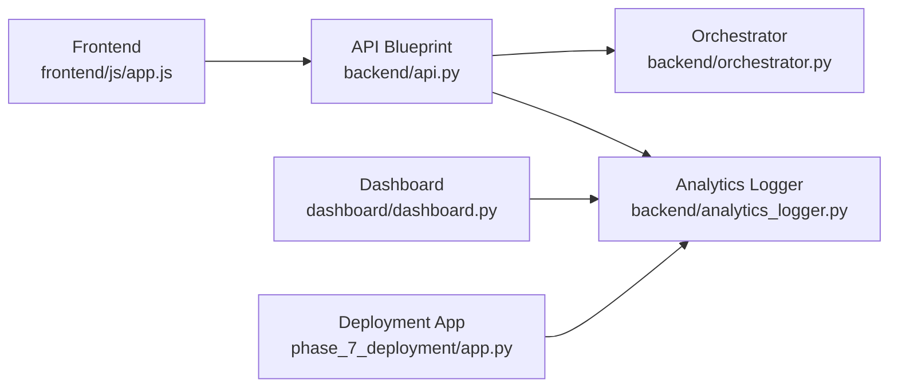

# Monitoring API Endpoints

<cite>
**Referenced Files in This Document**
- [api.py](file://architecture/phase_6_monitoring/backend/api.py)
- [app.py](file://architecture/phase_6_monitoring/backend/app.py)
- [analytics_logger.py](file://architecture/phase_6_monitoring/backend/analytics_logger.py)
- [orchestrator.py](file://architecture/phase_6_monitoring/backend/orchestrator.py)
- [dashboard.py](file://architecture/phase_6_monitoring/dashboard/dashboard.py)
- [__main__.py](file://architecture/phase_6_monitoring/__main__.py)
- [app.js](file://architecture/phase_6_monitoring/frontend/js/app.js)
- [index.html](file://architecture/phase_6_monitoring/frontend/index.html)
- [app.py](file://architecture/phase_7_deployment/app.py)
- [analytics_logger.py](file://architecture/phase_7_deployment/analytics_logger.py)
</cite>

## Table of Contents
1. [Introduction](#introduction)
2. [Project Structure](#project-structure)
3. [Core Components](#core-components)
4. [Architecture Overview](#architecture-overview)
5. [Detailed Component Analysis](#detailed-component-analysis)
6. [Dependency Analysis](#dependency-analysis)
7. [Performance Considerations](#performance-considerations)
8. [Troubleshooting Guide](#troubleshooting-guide)
9. [Conclusion](#conclusion)
10. [Appendices](#appendices)

## Introduction
This document describes the monitoring endpoints that expose system analytics and performance data for the recommendation system. It covers:
- HTTP endpoints for retrieving system health, sample recommendations, metadata, and submitting feedback
- Request/response schemas, authentication methods, and error handling
- Database-backed analytics for query statistics and feedback metrics
- Flask application configuration, CORS, and API usage patterns
- Security considerations and best practices for exposing analytics data

## Project Structure
The monitoring-capable backend is organized under phase_6_monitoring with a Flask blueprint, analytics logging, a dashboard, and a frontend SPA. The same analytics schema is reused in phase_7_deployment for a Streamlit-based UI.

**Diagram sources**
- [app.py:14-41](file://architecture/phase_6_monitoring/backend/app.py#L14-L41)
- [api.py:15-119](file://architecture/phase_6_monitoring/backend/api.py#L15-L119)
- [analytics_logger.py:1-87](file://architecture/phase_6_monitoring/backend/analytics_logger.py#L1-L87)
- [orchestrator.py:1-303](file://architecture/phase_6_monitoring/backend/orchestrator.py#L1-L303)
- [dashboard.py:1-102](file://architecture/phase_6_monitoring/dashboard/dashboard.py#L1-L102)
- [app.js:1-324](file://architecture/phase_6_monitoring/frontend/js/app.js#L1-L324)
- [index.html:1-198](file://architecture/phase_6_monitoring/frontend/index.html#L1-L198)
- [app.py:1-128](file://architecture/phase_7_deployment/app.py#L1-L128)
- [analytics_logger.py:1-87](file://architecture/phase_7_deployment/analytics_logger.py#L1-L87)

**Section sources**
- [app.py:14-41](file://architecture/phase_6_monitoring/backend/app.py#L14-L41)
- [api.py:15-119](file://architecture/phase_6_monitoring/backend/api.py#L15-L119)
- [analytics_logger.py:1-87](file://architecture/phase_6_monitoring/backend/analytics_logger.py#L1-L87)
- [dashboard.py:1-102](file://architecture/phase_6_monitoring/dashboard/dashboard.py#L1-L102)
- [app.py:1-128](file://architecture/phase_7_deployment/app.py#L1-L128)

## Core Components
- Flask application factory registers the API blueprint and serves the SPA for non-API routes.
- API blueprint exposes:
  - Health check endpoint
  - Sample recommendations endpoint
  - Metadata endpoint
  - Recommendation pipeline endpoint
  - Feedback submission endpoint
- Analytics logger persists queries and feedback to an SQLite database.
- Dashboard reads analytics data and computes overview metrics and trends.
- Frontend SPA consumes the API and submits feedback.

**Section sources**
- [app.py:14-41](file://architecture/phase_6_monitoring/backend/app.py#L14-L41)
- [api.py:15-119](file://architecture/phase_6_monitoring/backend/api.py#L15-L119)
- [analytics_logger.py:1-87](file://architecture/phase_6_monitoring/backend/analytics_logger.py#L1-L87)
- [dashboard.py:1-102](file://architecture/phase_6_monitoring/dashboard/dashboard.py#L1-L102)
- [app.js:166-195](file://architecture/phase_6_monitoring/frontend/js/app.js#L166-L195)

## Architecture Overview
The monitoring endpoints integrate the Flask API, analytics storage, and visualization. The frontend communicates with the API to retrieve recommendations and submit feedback.

**Diagram sources**
- [api.py:43-96](file://architecture/phase_6_monitoring/backend/api.py#L43-L96)
- [api.py:97-119](file://architecture/phase_6_monitoring/backend/api.py#L97-L119)
- [orchestrator.py:112-303](file://architecture/phase_6_monitoring/backend/orchestrator.py#L112-L303)
- [analytics_logger.py:46-83](file://architecture/phase_6_monitoring/backend/analytics_logger.py#L46-L83)
- [app.js:227-251](file://architecture/phase_6_monitoring/frontend/js/app.js#L227-L251)
- [app.js:166-195](file://architecture/phase_6_monitoring/frontend/js/app.js#L166-L195)

## Detailed Component Analysis

### Flask Application Configuration
- Application factory sets up static serving for the SPA and enables CORS globally.
- Blueprints are registered to modularize API endpoints.
- CLI entrypoint supports host, port, and debug flags.

Key behaviors:
- CORS enabled via Flask-CORS for cross-origin requests.
- SPA routes served for any non-API path.
- Health endpoint exposed at /api/health.

**Section sources**
- [app.py:14-41](file://architecture/phase_6_monitoring/backend/app.py#L14-L41)
- [__main__.py:17-40](file://architecture/phase_6_monitoring/__main__.py#L17-L40)

### API Endpoints

#### GET /api/health
- Purpose: System health check.
- Response: JSON object indicating service status and phase.
- Authentication: Not required.
- Example request: curl http://localhost:5004/api/health
- Example response: {"status":"ok","phase":6,"service":"Zomato Recommendation API Phase 6"}

**Section sources**
- [api.py:20-23](file://architecture/phase_6_monitoring/backend/api.py#L20-L23)

#### GET /api/sample
- Purpose: Return pre-built sample recommendations for frontend demos.
- Response: JSON payload containing recommendations and metadata.
- Authentication: Not required.
- Example request: curl http://localhost:5004/api/sample
- Notes: Adds a source field to indicate sample data.

**Section sources**
- [api.py:26-31](file://architecture/phase_6_monitoring/backend/api.py#L26-L31)

#### GET /api/metadata
- Purpose: Provide unique locations and cuisines for frontend dropdowns.
- Response: JSON object with arrays of locations and cuisines.
- Authentication: Not required.
- Error handling: Returns error JSON and 500 on exceptions.

**Section sources**
- [api.py:34-41](file://architecture/phase_6_monitoring/backend/api.py#L34-L41)
- [orchestrator.py:85-109](file://architecture/phase_6_monitoring/backend/orchestrator.py#L85-L109)

#### POST /api/recommend
- Purpose: Run the full recommendation pipeline and return ranked results.
- Request body schema:
  - location: string, required
  - budget: string, enum ["low","medium","high"], default "medium"
  - cuisines: array of strings, optional
  - min_rating: number, optional
  - optional_preferences: array of strings, optional
  - top_n: integer in range [1..20], default 5
- Response schema:
  - summary: string
  - recommendations: array of objects with keys: rank, restaurant_name, explanation, rating, cost_for_two, cuisine
  - preferences_used: object mirroring input preferences
  - source: string ["live","phase3_only","sample"]
  - query_id: string (UUID) injected by the API for feedback correlation
- Authentication: Not required.
- Error handling: Returns error JSON and 400/500 on validation or runtime errors.
- Latency measurement: Endpoint measures execution time and logs it with analytics.

Example request:
- POST http://localhost:5004/api/recommend
- Body: {"location":"Bangalore","budget":"medium","cuisines":["Italian"],"min_rating":4.0,"optional_preferences":[],"top_n":5}

Example response:
- 200 OK with recommendations and query_id

**Section sources**
- [api.py:43-96](file://architecture/phase_6_monitoring/backend/api.py#L43-L96)
- [orchestrator.py:112-303](file://architecture/phase_6_monitoring/backend/orchestrator.py#L112-L303)

#### POST /api/analytics/feedback
- Purpose: Accept explicit user feedback on recommendations.
- Request body schema:
  - query_id: string, required
  - restaurant_name: string, required
  - feedback_type: enum ["like","dislike"], required
- Response: JSON object with status and message on success; error JSON on failure.
- Authentication: Not required.
- Error handling: Returns error JSON and 400/500 on validation or persistence errors.

Example request:
- POST http://localhost:5004/api/analytics/feedback
- Body: {"query_id":"<uuid>","restaurant_name":"Example","feedback_type":"like"}

**Section sources**
- [api.py:97-119](file://architecture/phase_6_monitoring/backend/api.py#L97-L119)

### Analytics Data Model
The analytics logger stores:
- queries table: query_id, timestamp, location, budget, cuisines (JSON), min_rating, optional_preferences (JSON), num_recommendations, latency_ms
- feedback table: id, query_id, timestamp, restaurant_name, feedback_type

**Diagram sources**
- [analytics_logger.py:18-41](file://architecture/phase_6_monitoring/backend/analytics_logger.py#L18-L41)
- [analytics_logger.py:18-41](file://architecture/phase_7_deployment/analytics_logger.py#L18-L41)

**Section sources**
- [analytics_logger.py:1-87](file://architecture/phase_6_monitoring/backend/analytics_logger.py#L1-L87)
- [analytics_logger.py:1-87](file://architecture/phase_7_deployment/analytics_logger.py#L1-L87)

### Dashboard and Metrics
The dashboard loads analytics data and computes:
- Total queries and average latency
- Total feedback and like ratio
- Trends over time and feedback distribution
- Problematic recommendations (dislikes) joined with original query preferences
- Recent queries

**Section sources**
- [dashboard.py:1-102](file://architecture/phase_6_monitoring/dashboard/dashboard.py#L1-L102)

### Frontend Integration
The SPA:
- Loads metadata from /api/metadata
- Submits preferences to /api/recommend
- Sends feedback to /api/analytics/feedback
- Uses query_id returned by /api/recommend to correlate feedback

**Section sources**
- [app.js:227-251](file://architecture/phase_6_monitoring/frontend/js/app.js#L227-L251)
- [app.js:166-195](file://architecture/phase_6_monitoring/frontend/js/app.js#L166-L195)
- [index.html:1-198](file://architecture/phase_6_monitoring/frontend/index.html#L1-L198)

## Dependency Analysis
- The API blueprint depends on the orchestrator for recommendation logic and the analytics logger for telemetry.
- The dashboard and deployment apps depend on the shared analytics logger to read persisted data.
- The frontend depends on the API for data and feedback submission.

**Diagram sources**
- [api.py:12-13](file://architecture/phase_6_monitoring/backend/api.py#L12-L13)
- [orchestrator.py:1-303](file://architecture/phase_6_monitoring/backend/orchestrator.py#L1-L303)
- [analytics_logger.py:1-87](file://architecture/phase_6_monitoring/backend/analytics_logger.py#L1-L87)
- [dashboard.py:1-102](file://architecture/phase_6_monitoring/dashboard/dashboard.py#L1-L102)
- [app.py:1-128](file://architecture/phase_7_deployment/app.py#L1-L128)
- [app.js:1-324](file://architecture/phase_6_monitoring/frontend/js/app.js#L1-L324)

**Section sources**
- [api.py:12-13](file://architecture/phase_6_monitoring/backend/api.py#L12-L13)
- [app.py:21-22](file://architecture/phase_7_deployment/app.py#L21-L22)

## Performance Considerations
- Latency measurement: The recommendation endpoint measures execution time and logs it with analytics.
- Data volume: SQLite is suitable for development and small-scale monitoring; consider migration to a relational database or time-series store for production-scale analytics.
- Query filtering: The dashboard aggregates data client-side; for large datasets, consider server-side aggregation endpoints.
- Caching: Metadata is loaded once per session; avoid repeated unnecessary calls.

[No sources needed since this section provides general guidance]

## Troubleshooting Guide
Common issues and resolutions:
- Missing or invalid JSON in POST bodies: The API validates JSON presence and required fields, returning 400 with an error message.
- Database connectivity: Ensure the analytics database exists and is writable; the logger initializes tables on import.
- CORS errors: CORS is enabled globally; verify that cross-origin requests originate from allowed origins.
- Health endpoint failures: Confirm the Flask app is running and the blueprint is registered.

**Section sources**
- [api.py:58-60](file://architecture/phase_6_monitoring/backend/api.py#L58-L60)
- [api.py:100-102](file://architecture/phase_6_monitoring/backend/api.py#L100-L102)
- [analytics_logger.py:13-44](file://architecture/phase_6_monitoring/backend/analytics_logger.py#L13-L44)
- [app.py:20-25](file://architecture/phase_6_monitoring/backend/app.py#L20-L25)

## Conclusion
The monitoring endpoints provide a lightweight, SQLite-backed analytics solution for capturing query statistics and user feedback. They integrate cleanly with a SPA frontend and a Streamlit-based deployment, enabling continuous improvement of the recommendation pipeline. For production, consider scaling analytics storage, adding rate limiting, and implementing robust authentication and authorization.

[No sources needed since this section summarizes without analyzing specific files]

## Appendices

### API Versioning Strategy
- Current implementation does not include explicit API versioning. To evolve endpoints safely, adopt a version prefix in URLs (e.g., /api/v1) and maintain backward compatibility during transitions.

[No sources needed since this section provides general guidance]

### Rate Limiting
- No built-in rate limiting is present. For production, implement rate limiting per endpoint or per IP to prevent abuse and protect resources.

[No sources needed since this section provides general guidance]

### Security Considerations
- Authentication: Endpoints are unauthenticated; restrict access via network controls or reverse proxy.
- Data exposure: Analytics data includes user preferences; apply least privilege and data retention policies.
- CORS: Global CORS enablement allows cross-origin requests; lock down origins in production.
- Input validation: The API validates request bodies; sanitize and limit input sizes to mitigate injection risks.

**Section sources**
- [app.py:20-25](file://architecture/phase_6_monitoring/backend/app.py#L20-L25)
- [api.py:58-79](file://architecture/phase_6_monitoring/backend/api.py#L58-L79)
- [api.py:100-112](file://architecture/phase_6_monitoring/backend/api.py#L100-L112)

### Response Formatting Standards
- Standardized error responses: JSON with an error field and HTTP 4xx/5xx status codes.
- Success responses: JSON payloads structured around endpoint semantics (recommendations, metadata, feedback confirmation).

**Section sources**
- [api.py:58-60](file://architecture/phase_6_monitoring/backend/api.py#L58-L60)
- [api.py:94-96](file://architecture/phase_6_monitoring/backend/api.py#L94-L96)
- [api.py:100-102](file://architecture/phase_6_monitoring/backend/api.py#L100-L102)
- [api.py:117-119](file://architecture/phase_6_monitoring/backend/api.py#L117-L119)

### Example Workflows

#### Retrieve system health
- Method: GET
- Endpoint: /api/health
- Expected response: {"status":"ok","phase":6,"service":"..."}
- Example curl: curl http://localhost:5004/api/health

**Section sources**
- [api.py:20-23](file://architecture/phase_6_monitoring/backend/api.py#L20-L23)
- [__main__.py:35-38](file://architecture/phase_6_monitoring/__main__.py#L35-L38)

#### Get recommendations and submit feedback
- Step 1: POST /api/recommend with preferences; capture query_id from response
- Step 2: POST /api/analytics/feedback with query_id, restaurant_name, and feedback_type
- Frontend integration: The SPA performs these steps automatically after user actions.

**Section sources**
- [api.py:43-96](file://architecture/phase_6_monitoring/backend/api.py#L43-L96)
- [api.py:97-119](file://architecture/phase_6_monitoring/backend/api.py#L97-L119)
- [app.js:227-251](file://architecture/phase_6_monitoring/frontend/js/app.js#L227-L251)
- [app.js:166-195](file://architecture/phase_6_monitoring/frontend/js/app.js#L166-L195)

#### Access analytics dashboard
- Launch the dashboard to visualize:
  - Total queries and average latency
  - Feedback counts and ratios
  - Trends over time
  - Problematic recommendations linked to original preferences
- The dashboard reads from the analytics database.

**Section sources**
- [dashboard.py:23-102](file://architecture/phase_6_monitoring/dashboard/dashboard.py#L23-L102)