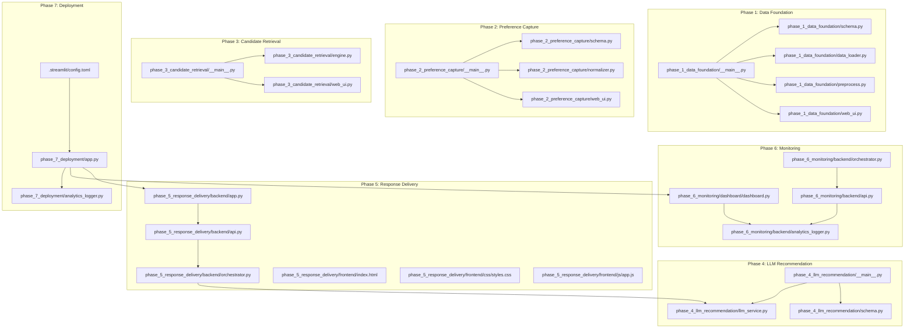
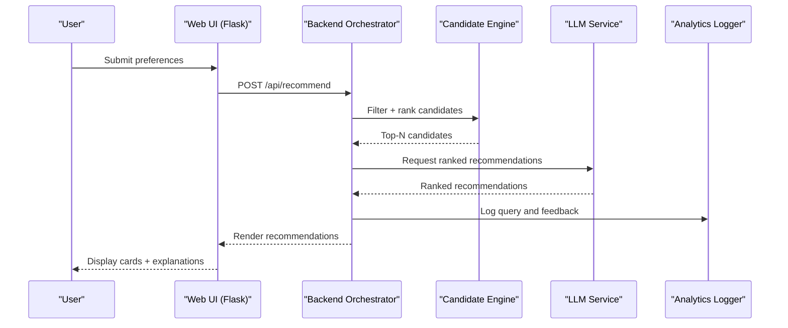
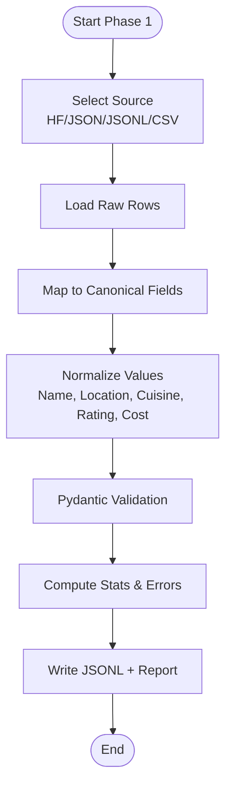
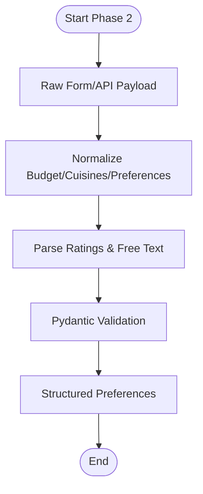
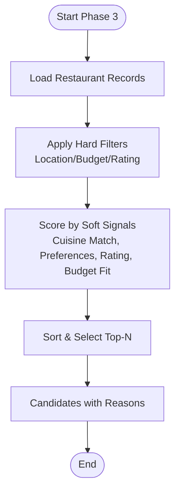
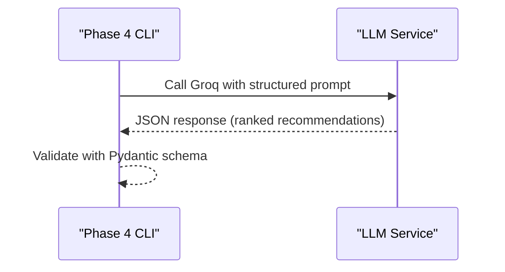
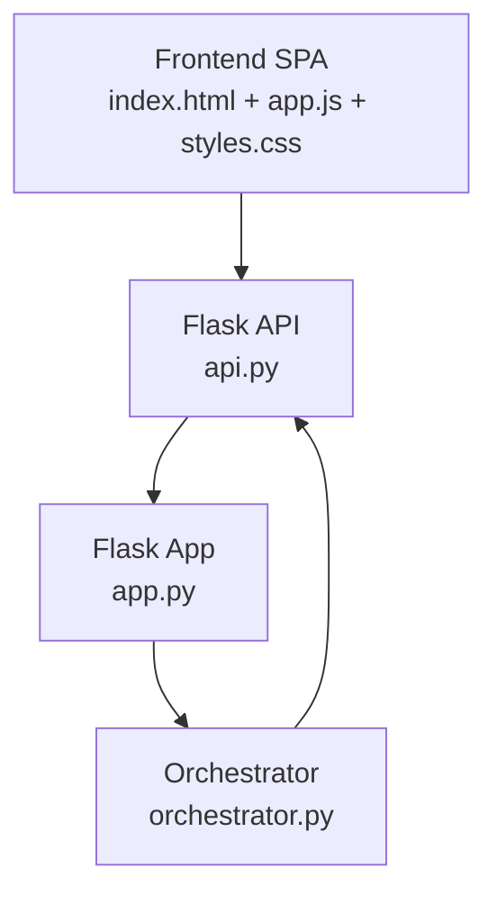
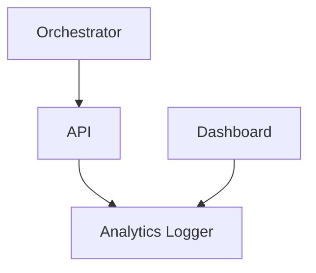
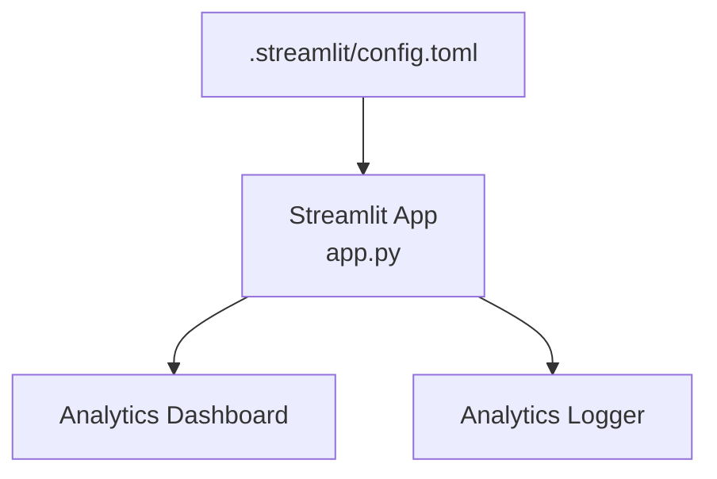
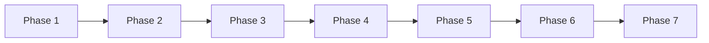

# Contributing and Development

<cite>
**Referenced Files in This Document**
- [phase-wise-architecture.md](file://architecture/phase-wise-architecture.md)
- [problemstatement.md](file://problemstatement.md)
- [.gitignore](file://.gitignore)
- [phase_1_data_foundation/__main__.py](file://architecture/phase_1_data_foundation/__main__.py)
- [phase_1_data_foundation/schema.py](file://architecture/phase_1_data_foundation/schema.py)
- [phase_1_data_foundation/data_loader.py](file://architecture/phase_1_data_foundation/data_loader.py)
- [phase_1_data_foundation/preprocess.py](file://architecture/phase_1_data_foundation/preprocess.py)
- [phase_1_data_foundation/web_ui.py](file://architecture/phase_1_data_foundation/web_ui.py)
- [phase_2_preference_capture/__main__.py](file://architecture/phase_2_preference_capture/__main__.py)
- [phase_2_preference_capture/schema.py](file://architecture/phase_2_preference_capture/schema.py)
- [phase_2_preference_capture/normalizer.py](file://architecture/phase_2_preference_capture/normalizer.py)
- [phase_2_preference_capture/web_ui.py](file://architecture/phase_2_preference_capture/web_ui.py)
- [phase_3_candidate_retrieval/__main__.py](file://architecture/phase_3_candidate_retrieval/__main__.py)
- [phase_3_candidate_retrieval/engine.py](file://architecture/phase_3_candidate_retrieval/engine.py)
- [phase_3_candidate_retrieval/web_ui.py](file://architecture/phase_3_candidate_retrieval/web_ui.py)
- [phase_4_llm_recommendation/__main__.py](file://architecture/phase_4_llm_recommendation/__main__.py)
- [phase_4_llm_recommendation/schema.py](file://architecture/phase_4_llm_recommendation/schema.py)
- [phase_4_llm_recommendation/llm_service.py](file://architecture/phase_4_llm_recommendation/llm_service.py)
- [phase_5_response_delivery/backend/app.py](file://architecture/phase_5_response_delivery/backend/app.py)
- [phase_5_response_delivery/backend/api.py](file://architecture/phase_5_response_delivery/backend/api.py)
- [phase_5_response_delivery/backend/orchestrator.py](file://architecture/phase_5_response_delivery/backend/orchestrator.py)
- [phase_5_response_delivery/frontend/index.html](file://architecture/phase_5_response_delivery/frontend/index.html)
- [phase_5_response_delivery/frontend/js/app.js](file://architecture/phase_5_response_delivery/frontend/js/app.js)
- [phase_5_response_delivery/frontend/css/styles.css](file://architecture/phase_5_response_delivery/frontend/css/styles.css)
- [phase_6_monitoring/backend/analytics_logger.py](file://architecture/phase_6_monitoring/backend/analytics_logger.py)
- [phase_6_monitoring/backend/api.py](file://architecture/phase_6_monitoring/backend/api.py)
- [phase_6_monitoring/backend/orchestrator.py](file://architecture/phase_6_monitoring/backend/orchestrator.py)
- [phase_6_monitoring/dashboard/dashboard.py](file://architecture/phase_6_monitoring/dashboard/dashboard.py)
- [phase_7_deployment/app.py](file://architecture/phase_7_deployment/app.py)
- [phase_7_deployment/.streamlit/config.toml](file://architecture/phase_7_deployment/.streamlit/config.toml)
- [phase_7_deployment/analytics_logger.py](file://architecture/phase_7_deployment/analytics_logger.py)
</cite>

## Table of Contents
1. [Introduction](#introduction)
2. [Project Structure](#project-structure)
3. [Core Components](#core-components)
4. [Architecture Overview](#architecture-overview)
5. [Detailed Component Analysis](#detailed-component-analysis)
6. [Dependency Analysis](#dependency-analysis)
7. [Performance Considerations](#performance-considerations)
8. [Troubleshooting Guide](#troubleshooting-guide)
9. [Version Control and Contribution Workflow](#version-control-and-contribution-workflow)
10. [Adding New Recommendation Algorithms](#adding-new-recommendation-algorithms)
11. [Integrating Additional LLM Services](#integrating-additional-llm-services)
12. [Extending the Web Interface](#extending-the-web-interface)
13. [Development Setup and Debugging](#development-setup-and-debugging)
14. [Conclusion](#conclusion)

## Introduction
This document provides comprehensive contributing and development guidance for the Zomato AI Recommendation System. It explains the multi-phase Python architecture, coding conventions, testing procedures across all seven phases, and practical workflows for adding new algorithms, integrating LLM providers, and extending the web interface. The system follows a plugin-style phase architecture, schema-based validation, and an API-first design to enable modular development and easy extension.

## Project Structure
The repository is organized by phases, each encapsulating a self-contained stage of the recommendation pipeline. Each phase typically includes:
- CLI entrypoint (__main__.py)
- Schema definitions (schema.py)
- Core processing logic (pipeline-like modules)
- Optional web UI (web_ui.py) with HTML templates
- Sample data and requirements files
- Output artifacts and reports

Key characteristics:
- Modular per-phase design enables independent development and testing.
- Shared schema models enforce consistent data contracts across phases.
- Web UIs provide interactive demos for each phase.
- Phase 5 and 6 introduce backend APIs and monitoring dashboards.
- Phase 7 unifies the UI and analytics into a Streamlit deployment.

**Diagram sources**
- [phase-wise-architecture.md](file://architecture/phase-wise-architecture.md)
- [phase_1_data_foundation/__main__.py](file://architecture/phase_1_data_foundation/__main__.py)
- [phase_1_data_foundation/schema.py](file://architecture/phase_1_data_foundation/schema.py)
- [phase_1_data_foundation/data_loader.py](file://architecture/phase_1_data_foundation/data_loader.py)
- [phase_1_data_foundation/preprocess.py](file://architecture/phase_1_data_foundation/preprocess.py)
- [phase_1_data_foundation/web_ui.py](file://architecture/phase_1_data_foundation/web_ui.py)
- [phase_2_preference_capture/__main__.py](file://architecture/phase_2_preference_capture/__main__.py)
- [phase_2_preference_capture/schema.py](file://architecture/phase_2_preference_capture/schema.py)
- [phase_2_preference_capture/normalizer.py](file://architecture/phase_2_preference_capture/normalizer.py)
- [phase_2_preference_capture/web_ui.py](file://architecture/phase_2_preference_capture/web_ui.py)
- [phase_3_candidate_retrieval/__main__.py](file://architecture/phase_3_candidate_retrieval/__main__.py)
- [phase_3_candidate_retrieval/engine.py](file://architecture/phase_3_candidate_retrieval/engine.py)
- [phase_3_candidate_retrieval/web_ui.py](file://architecture/phase_3_candidate_retrieval/web_ui.py)
- [phase_4_llm_recommendation/__main__.py](file://architecture/phase_4_llm_recommendation/__main__.py)
- [phase_4_llm_recommendation/schema.py](file://architecture/phase_4_llm_recommendation/schema.py)
- [phase_4_llm_recommendation/llm_service.py](file://architecture/phase_4_llm_recommendation/llm_service.py)
- [phase_5_response_delivery/backend/app.py](file://architecture/phase_5_response_delivery/backend/app.py)
- [phase_5_response_delivery/backend/api.py](file://architecture/phase_5_response_delivery/backend/api.py)
- [phase_5_response_delivery/backend/orchestrator.py](file://architecture/phase_5_response_delivery/backend/orchestrator.py)
- [phase_5_response_delivery/frontend/index.html](file://architecture/phase_5_response_delivery/frontend/index.html)
- [phase_5_response_delivery/frontend/js/app.js](file://architecture/phase_5_response_delivery/frontend/js/app.js)
- [phase_5_response_delivery/frontend/css/styles.css](file://architecture/phase_5_response_delivery/frontend/css/styles.css)
- [phase_6_monitoring/backend/analytics_logger.py](file://architecture/phase_6_monitoring/backend/analytics_logger.py)
- [phase_6_monitoring/backend/api.py](file://architecture/phase_6_monitoring/backend/api.py)
- [phase_6_monitoring/backend/orchestrator.py](file://architecture/phase_6_monitoring/backend/orchestrator.py)
- [phase_6_monitoring/dashboard/dashboard.py](file://architecture/phase_6_monitoring/dashboard/dashboard.py)
- [phase_7_deployment/app.py](file://architecture/phase_7_deployment/app.py)
- [phase_7_deployment/.streamlit/config.toml](file://architecture/phase_7_deployment/.streamlit/config.toml)
- [phase_7_deployment/analytics_logger.py](file://architecture/phase_7_deployment/analytics_logger.py)

**Section sources**
- [phase-wise-architecture.md](file://architecture/phase-wise-architecture.md)
- [problemstatement.md](file://problemstatement.md)

## Core Components
- Schema-driven validation: Pydantic models define canonical data contracts across phases, ensuring type safety and consistent transformations.
- Plugin-style phases: Each phase exposes a CLI entrypoint and optional web UI, enabling independent development and testing.
- API-first backend: Phase 5 introduces a Flask backend orchestrating candidate retrieval and LLM recommendation, exposing REST endpoints.
- Monitoring and analytics: Phase 6 logs telemetry and provides a dashboard for metrics and feedback.
- Unified deployment: Phase 7 integrates the recommendation UI and analytics dashboard into a Streamlit app with a branded theme.

**Section sources**
- [phase_1_data_foundation/schema.py](file://architecture/phase_1_data_foundation/schema.py)
- [phase_2_preference_capture/schema.py](file://architecture/phase_2_preference_capture/schema.py)
- [phase_3_candidate_retrieval/engine.py](file://architecture/phase_3_candidate_retrieval/engine.py)
- [phase_4_llm_recommendation/schema.py](file://architecture/phase_4_llm_recommendation/schema.py)
- [phase_5_response_delivery/backend/orchestrator.py](file://architecture/phase_5_response_delivery/backend/orchestrator.py)
- [phase_6_monitoring/backend/analytics_logger.py](file://architecture/phase_6_monitoring/backend/analytics_logger.py)
- [phase_7_deployment/app.py](file://architecture/phase_7_deployment/app.py)

## Architecture Overview
The system follows a phased pipeline:
- Data ingestion and cleaning (Phase 1)
- Preference capture and normalization (Phase 2)
- Candidate retrieval and scoring (Phase 3)
- LLM reasoning and recommendation (Phase 4)
- API orchestration and UX presentation (Phase 5)
- Monitoring and analytics (Phase 6)
- Unified deployment (Phase 7)

**Diagram sources**
- [phase_5_response_delivery/backend/orchestrator.py](file://architecture/phase_5_response_delivery/backend/orchestrator.py)
- [phase_5_response_delivery/backend/api.py](file://architecture/phase_5_response_delivery/backend/api.py)
- [phase_3_candidate_retrieval/engine.py](file://architecture/phase_3_candidate_retrieval/engine.py)
- [phase_4_llm_recommendation/llm_service.py](file://architecture/phase_4_llm_recommendation/llm_service.py)
- [phase_6_monitoring/backend/analytics_logger.py](file://architecture/phase_6_monitoring/backend/analytics_logger.py)

## Detailed Component Analysis

### Phase 1: Data Foundation
- Purpose: Load, normalize, and validate restaurant data into a canonical schema.
- Key modules:
  - CLI entrypoint parses arguments and supports web UI toggle.
  - Data loader supports Hugging Face, JSON, JSONL, and CSV sources.
  - Preprocessing maps heterogeneous columns to canonical fields, normalizes whitespace and values, and drops incomplete rows.
  - Schema enforces required fields and constraints.
  - Web UI provides a form to trigger downloads and runs the pipeline, with optional output saving.

**Diagram sources**
- [phase_1_data_foundation/__main__.py](file://architecture/phase_1_data_foundation/__main__.py)
- [phase_1_data_foundation/data_loader.py](file://architecture/phase_1_data_foundation/data_loader.py)
- [phase_1_data_foundation/preprocess.py](file://architecture/phase_1_data_foundation/preprocess.py)
- [phase_1_data_foundation/schema.py](file://architecture/phase_1_data_foundation/schema.py)

**Section sources**
- [phase_1_data_foundation/__main__.py](file://architecture/phase_1_data_foundation/__main__.py)
- [phase_1_data_foundation/schema.py](file://architecture/phase_1_data_foundation/schema.py)
- [phase_1_data_foundation/data_loader.py](file://architecture/phase_1_data_foundation/data_loader.py)
- [phase_1_data_foundation/preprocess.py](file://architecture/phase_1_data_foundation/preprocess.py)
- [phase_1_data_foundation/web_ui.py](file://architecture/phase_1_data_foundation/web_ui.py)

### Phase 2: Preference Capture
- Purpose: Normalize and validate user preferences into a structured object.
- Key modules:
  - CLI accepts form-like arguments and prints validated preferences and report.
  - Normalizer handles budget aliases, optional preference inference via keywords, and rating parsing.
  - Schema defines required fields, enums, and validators for robust input handling.
  - Web UI routes user input to the pipeline and displays results or errors.

**Diagram sources**
- [phase_2_preference_capture/__main__.py](file://architecture/phase_2_preference_capture/__main__.py)
- [phase_2_preference_capture/normalizer.py](file://architecture/phase_2_preference_capture/normalizer.py)
- [phase_2_preference_capture/schema.py](file://architecture/phase_2_preference_capture/schema.py)

**Section sources**
- [phase_2_preference_capture/__main__.py](file://architecture/phase_2_preference_capture/__main__.py)
- [phase_2_preference_capture/schema.py](file://architecture/phase_2_preference_capture/schema.py)
- [phase_2_preference_capture/normalizer.py](file://architecture/phase_2_preference_capture/normalizer.py)
- [phase_2_preference_capture/web_ui.py](file://architecture/phase_2_preference_capture/web_ui.py)

### Phase 3: Candidate Retrieval and Filtering
- Purpose: Filter restaurants by hard constraints and score candidates by soft signals.
- Key modules:
  - CLI loads a cleaned dataset and runs retrieval with configurable top-N.
  - Engine applies hard filters (location, budget, rating) and computes scores based on cuisine overlap, optional preferences, rating, and budget proximity.
  - Web UI submits dataset path and preferences to produce ranked candidates.

**Diagram sources**
- [phase_3_candidate_retrieval/__main__.py](file://architecture/phase_3_candidate_retrieval/__main__.py)
- [phase_3_candidate_retrieval/engine.py](file://architecture/phase_3_candidate_retrieval/engine.py)

**Section sources**
- [phase_3_candidate_retrieval/__main__.py](file://architecture/phase_3_candidate_retrieval/__main__.py)
- [phase_3_candidate_retrieval/engine.py](file://architecture/phase_3_candidate_retrieval/engine.py)
- [phase_3_candidate_retrieval/web_ui.py](file://architecture/phase_3_candidate_retrieval/web_ui.py)

### Phase 4: LLM Reasoning and Recommendation
- Purpose: Generate ranked recommendations with explanations using an LLM.
- Key modules:
  - CLI loads candidates and preferences, invokes the LLM, and prints results and report.
  - Schema defines inputs and outputs for recommendation formatting.
  - LLM service wraps Groq API, validates JSON responses, and raises on malformed output.

**Diagram sources**
- [phase_4_llm_recommendation/__main__.py](file://architecture/phase_4_llm_recommendation/__main__.py)
- [phase_4_llm_recommendation/schema.py](file://architecture/phase_4_llm_recommendation/schema.py)
- [phase_4_llm_recommendation/llm_service.py](file://architecture/phase_4_llm_recommendation/llm_service.py)

**Section sources**
- [phase_4_llm_recommendation/__main__.py](file://architecture/phase_4_llm_recommendation/__main__.py)
- [phase_4_llm_recommendation/schema.py](file://architecture/phase_4_llm_recommendation/schema.py)
- [phase_4_llm_recommendation/llm_service.py](file://architecture/phase_4_llm_recommendation/llm_service.py)

### Phase 5: Response Delivery and UX
- Purpose: Serve recommendations via a REST API and present them in a modern SPA.
- Backend:
  - Flask app with endpoints for recommendations, health checks, and samples.
  - Orchestrator coordinates candidate retrieval and LLM steps.
- Frontend:
  - Single-page app with preference form, recommendation cards, and feedback UI.
  - Stylesheet and JavaScript handle rendering and interactions.

**Diagram sources**
- [phase_5_response_delivery/backend/app.py](file://architecture/phase_5_response_delivery/backend/app.py)
- [phase_5_response_delivery/backend/api.py](file://architecture/phase_5_response_delivery/backend/api.py)
- [phase_5_response_delivery/backend/orchestrator.py](file://architecture/phase_5_response_delivery/backend/orchestrator.py)
- [phase_5_response_delivery/frontend/index.html](file://architecture/phase_5_response_delivery/frontend/index.html)
- [phase_5_response_delivery/frontend/js/app.js](file://architecture/phase_5_response_delivery/frontend/js/app.js)
- [phase_5_response_delivery/frontend/css/styles.css](file://architecture/phase_5_response_delivery/frontend/css/styles.css)

**Section sources**
- [phase_5_response_delivery/backend/app.py](file://architecture/phase_5_response_delivery/backend/app.py)
- [phase_5_response_delivery/backend/api.py](file://architecture/phase_5_response_delivery/backend/api.py)
- [phase_5_response_delivery/backend/orchestrator.py](file://architecture/phase_5_response_delivery/backend/orchestrator.py)
- [phase_5_response_delivery/frontend/index.html](file://architecture/phase_5_response_delivery/frontend/index.html)
- [phase_5_response_delivery/frontend/js/app.js](file://architecture/phase_5_response_delivery/frontend/js/app.js)
- [phase_5_response_delivery/frontend/css/styles.css](file://architecture/phase_5_response_delivery/frontend/css/styles.css)

### Phase 6: Monitoring and Continuous Improvement
- Purpose: Track interactions, measure quality, and improve the pipeline.
- Components:
  - Analytics logger persists telemetry.
  - Backend API and orchestrator integrate logging.
  - Dashboard visualizes metrics and recent queries/feedback.

**Diagram sources**
- [phase_6_monitoring/backend/orchestrator.py](file://architecture/phase_6_monitoring/backend/orchestrator.py)
- [phase_6_monitoring/backend/api.py](file://architecture/phase_6_monitoring/backend/api.py)
- [phase_6_monitoring/backend/analytics_logger.py](file://architecture/phase_6_monitoring/backend/analytics_logger.py)
- [phase_6_monitoring/dashboard/dashboard.py](file://architecture/phase_6_monitoring/dashboard/dashboard.py)

**Section sources**
- [phase_6_monitoring/backend/analytics_logger.py](file://architecture/phase_6_monitoring/backend/analytics_logger.py)
- [phase_6_monitoring/backend/api.py](file://architecture/phase_6_monitoring/backend/api.py)
- [phase_6_monitoring/backend/orchestrator.py](file://architecture/phase_6_monitoring/backend/orchestrator.py)
- [phase_6_monitoring/dashboard/dashboard.py](file://architecture/phase_6_monitoring/dashboard/dashboard.py)

### Phase 7: Deployment
- Purpose: Deploy the unified application and analytics dashboard using Streamlit.
- Components:
  - Multi-page Streamlit app with navigation.
  - Streamlit configuration for theming.
  - Shared analytics logger.

**Diagram sources**
- [phase_7_deployment/app.py](file://architecture/phase_7_deployment/app.py)
- [phase_7_deployment/.streamlit/config.toml](file://architecture/phase_7_deployment/.streamlit/config.toml)
- [phase_7_deployment/analytics_logger.py](file://architecture/phase_7_deployment/analytics_logger.py)
- [phase_6_monitoring/dashboard/dashboard.py](file://architecture/phase_6_monitoring/dashboard/dashboard.py)

**Section sources**
- [phase_7_deployment/app.py](file://architecture/phase_7_deployment/app.py)
- [phase_7_deployment/.streamlit/config.toml](file://architecture/phase_7_deployment/.streamlit/config.toml)
- [phase_7_deployment/analytics_logger.py](file://architecture/phase_7_deployment/analytics_logger.py)

## Dependency Analysis
- Internal dependencies:
  - Phases depend on shared schemas and utilities where applicable.
  - Phase 5 orchestrator depends on Phase 3 engine and Phase 4 LLM service.
  - Phase 6 and 7 reuse the analytics logger.
- External dependencies:
  - Hugging Face datasets for Phase 1.
  - Groq SDK for Phase 4.
  - Flask for web UIs and backend APIs.
  - Streamlit for Phase 7 deployment.

**Diagram sources**
- [phase-wise-architecture.md](file://architecture/phase-wise-architecture.md)

**Section sources**
- [phase-wise-architecture.md](file://architecture/phase-wise-architecture.md)

## Performance Considerations
- Streaming data loading: Prefer streaming iterators for large datasets to reduce memory usage.
- Early filtering: Apply hard filters aggressively to reduce candidate sets before scoring.
- Scoring efficiency: Keep scoring logic vectorizable or cacheable where possible.
- LLM calls: Batch prompts when feasible, limit context length, and use appropriate temperature.
- Frontend responsiveness: Debounce form submissions and render skeletons while fetching recommendations.
- Monitoring overhead: Minimize logging frequency and batch writes for telemetry.

## Troubleshooting Guide
Common issues and resolutions:
- Missing environment variables:
  - Ensure the LLM API key is configured for Phase 4.
- Invalid input formats:
  - Validate CLI arguments and web form payloads; refer to schema definitions for accepted types.
- Web UI errors:
  - Enable server-side error reporting and inspect rendered stack traces.
- Data loading failures:
  - Verify dataset paths and formats; use streaming mode for large files.
- Backend API errors:
  - Check endpoint responses and orchestrator logs for misconfiguration.

**Section sources**
- [phase_4_llm_recommendation/llm_service.py](file://architecture/phase_4_llm_recommendation/llm_service.py)
- [phase_1_data_foundation/web_ui.py](file://architecture/phase_1_data_foundation/web_ui.py)
- [phase_2_preference_capture/web_ui.py](file://architecture/phase_2_preference_capture/web_ui.py)
- [phase_3_candidate_retrieval/web_ui.py](file://architecture/phase_3_candidate_retrieval/web_ui.py)

## Version Control and Contribution Workflow
Branching and collaboration:
- Use feature branches for new phases or major enhancements.
- Keep commits focused and descriptive; reference related issue numbers.
- Open pull requests early for visibility; include screenshots or recordings for UI changes.
- Run linters and tests locally before pushing; ensure requirements updates are documented.

Local development hygiene:
- Respect .gitignore rules for environment files and database artifacts.
- Pin dependencies in requirements files for reproducible environments.

**Section sources**
- [.gitignore](file://.gitignore)

## Adding New Recommendation Algorithms
Approach:
- Extend Phase 3 scoring logic by adding new scoring functions and combining them with existing weights.
- Introduce new optional preference categories and update normalization and validation schemas.
- Add new CLI flags and web UI controls to expose algorithm parameters.
- Ensure outputs remain compatible with Phase 4 and 5 expectations.

Integration points:
- Candidate scoring module for new heuristics.
- Preference normalization for new intent signals.
- Web UI templates for user controls.
- Reports and logs for algorithm diagnostics.

## Integrating Additional LLM Services
Approach:
- Implement a new service module similar to the LLM wrapper, adhering to the same input/output schema.
- Add environment configuration and error handling for the new provider.
- Update the orchestrator to route requests to the selected provider.
- Provide CLI flags to select the model/provider and maintain backward compatibility.

Testing:
- Mock or stub the new service during unit tests.
- Add provider-specific test fixtures and environment setup.

## Extending the Web Interface
Approach:
- Modify frontend HTML and CSS for layout and styling changes.
- Extend JavaScript handlers to manage new forms, fetches, and rendering.
- Ensure responsive design and accessibility.
- Keep UI state management minimal and predictable.

Backend integration:
- Add new endpoints in the API module if additional data is needed.
- Update the orchestrator to support new workflows.

## Development Setup and Debugging
Environment setup:
- Install dependencies per phase requirements.
- For Phase 4, configure the LLM API key.
- For Phase 7, ensure Streamlit is installed and run the app from the deployment directory.

Debugging techniques:
- Use web UI error pages to surface exceptions during development.
- Print and log intermediate results in CLI mode for quick inspection.
- Profile Python code using built-in profilers or external tools.
- Monitor backend logs for API request/response cycles.

Performance profiling:
- Measure end-to-end latency across phases.
- Benchmark candidate retrieval and LLM call durations separately.
- Track memory usage during data loading and preprocessing.