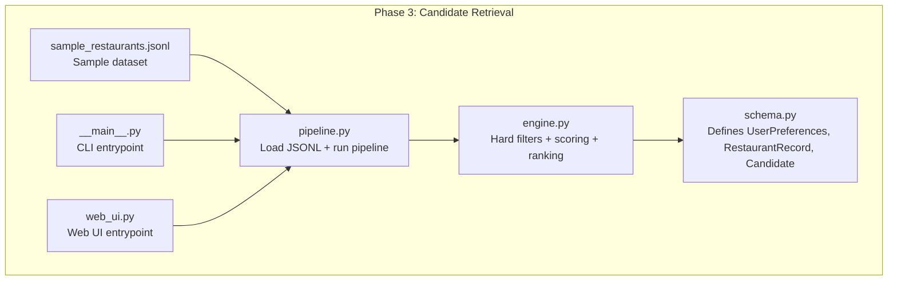
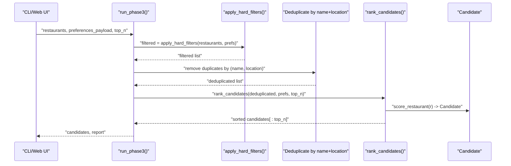
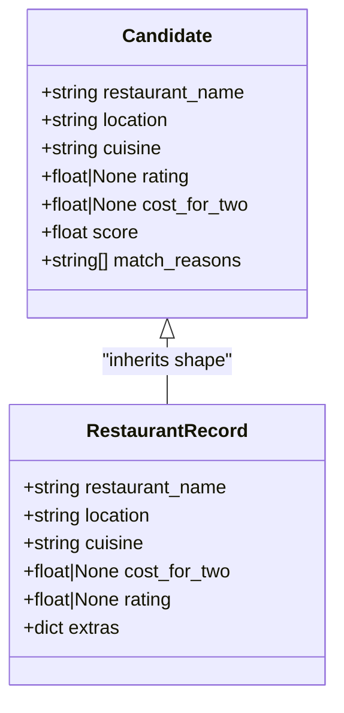
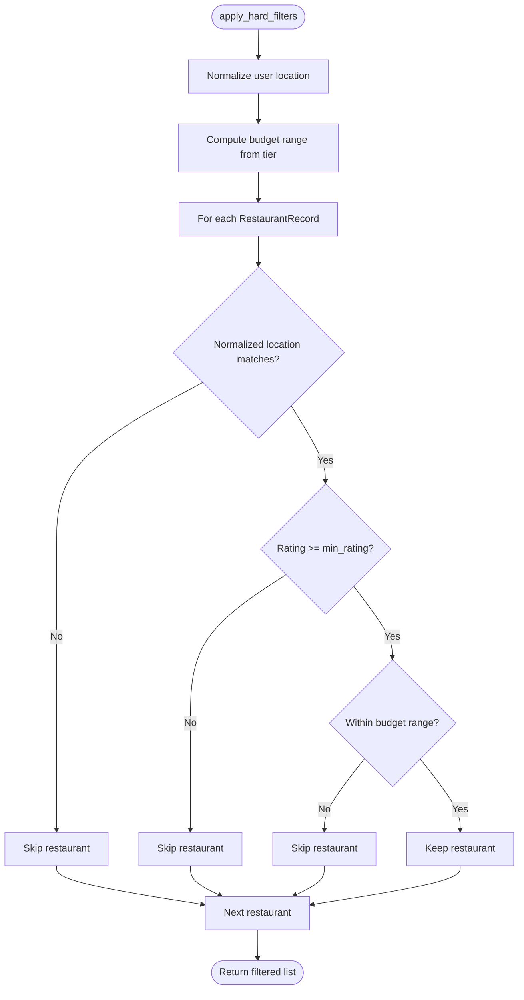
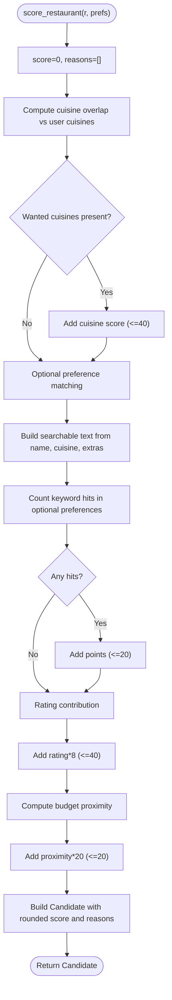
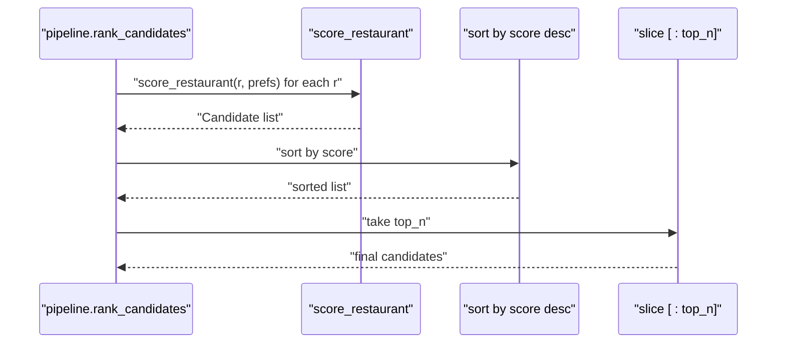
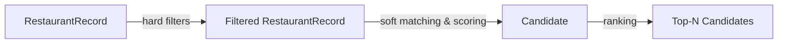
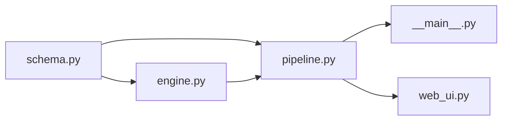

# CandidateInput Schema

<cite>
**Referenced Files in This Document**
- [schema.py](file://Zomato/architecture/phase_3_candidate_retrieval/schema.py)
- [engine.py](file://Zomato/architecture/phase_3_candidate_retrieval/engine.py)
- [pipeline.py](file://Zomato/architecture/phase_3_candidate_retrieval/pipeline.py)
- [__main__.py](file://Zomato/architecture/phase_3_candidate_retrieval/__main__.py)
- [web_ui.py](file://Zomato/architecture/phase_3_candidate_retrieval/web_ui.py)
- [sample_restaurants.jsonl](file://Zomato/architecture/phase_3_candidate_retrieval/sample_restaurants.jsonl)
- [phase-wise-architecture.md](file://Zomato/architecture/phase-wise-architecture.md)
</cite>

## Table of Contents
1. [Introduction](#introduction)
2. [Project Structure](#project-structure)
3. [Core Components](#core-components)
4. [Architecture Overview](#architecture-overview)
5. [Detailed Component Analysis](#detailed-component-analysis)
6. [Dependency Analysis](#dependency-analysis)
7. [Performance Considerations](#performance-considerations)
8. [Troubleshooting Guide](#troubleshooting-guide)
9. [Conclusion](#conclusion)

## Introduction
This document describes the CandidateInput schema used in Phase 3 Candidate Retrieval. It explains how filtered restaurant candidates are represented, how they relate to the original RestaurantRecord schema, and how data is transformed during filtering and scoring. It also documents the filtering logic, scoring mechanisms, and performance considerations for large candidate sets.

## Project Structure
Phase 3 organizes candidate retrieval around three core modules:
- Schema definitions for typed data models
- A filtering and scoring engine
- A pipeline that loads data, applies filters, deduplicates, ranks, and reports

**Diagram sources**
- [schema.py:1-35](file://Zomato/architecture/phase_3_candidate_retrieval/schema.py#L1-L35)
- [engine.py:1-118](file://Zomato/architecture/phase_3_candidate_retrieval/engine.py#L1-L118)
- [pipeline.py:1-51](file://Zomato/architecture/phase_3_candidate_retrieval/pipeline.py#L1-L51)
- [__main__.py:1-51](file://Zomato/architecture/phase_3_candidate_retrieval/__main__.py#L1-L51)
- [web_ui.py:1-58](file://Zomato/architecture/phase_3_candidate_retrieval/web_ui.py#L1-L58)
- [sample_restaurants.jsonl:1-5](file://Zomato/architecture/phase_3_candidate_retrieval/sample_restaurants.jsonl#L1-L5)

**Section sources**
- [phase-wise-architecture.md:30-41](file://Zomato/architecture/phase-wise-architecture.md#L30-L41)

## Core Components
- UserPreferences: validated user intent with location, budget tier, cuisines, minimum rating, and optional preferences.
- RestaurantRecord: normalized base record for restaurants with name, location, cuisine, cost for two, rating, and extras.
- Candidate: filtered and scored representation of a restaurant suitable for downstream LLM reasoning.

Key characteristics of Candidate:
- Fields mirror RestaurantRecord for identity and attributes
- score: numeric score derived from hard filters and soft matching
- match_reasons: human-readable reasons explaining score contributions

**Section sources**
- [schema.py:10-35](file://Zomato/architecture/phase_3_candidate_retrieval/schema.py#L10-L35)

## Architecture Overview
The Phase 3 pipeline transforms a cleaned dataset and user preferences into a ranked set of candidates:

**Diagram sources**
- [pipeline.py:24-51](file://Zomato/architecture/phase_3_candidate_retrieval/pipeline.py#L24-L51)
- [engine.py:23-118](file://Zomato/architecture/phase_3_candidate_retrieval/engine.py#L23-L118)
- [schema.py:27-35](file://Zomato/architecture/phase_3_candidate_retrieval/schema.py#L27-L35)

## Detailed Component Analysis

### Candidate Schema Definition
Candidate is a Pydantic model that captures:
- Identity fields: restaurant_name, location, cuisine
- Attributes: rating, cost_for_two
- Scoring: score (float)
- Explanations: match_reasons (list of strings)

It inherits the shape of RestaurantRecord while adding score and match_reasons for downstream reasoning.

**Diagram sources**
- [schema.py:18-35](file://Zomato/architecture/phase_3_candidate_retrieval/schema.py#L18-L35)

**Section sources**
- [schema.py:27-35](file://Zomato/architecture/phase_3_candidate_retrieval/schema.py#L27-L35)

### Hard Filters: Location, Budget Range, and Minimum Rating
The hard filtering stage removes restaurants that fail any of:
- Location containment: normalized user location appears in restaurant location or vice versa
- Minimum rating threshold: restaurant rating meets or exceeds user’s minimum rating
- Budget range: restaurant cost_for_two falls within the user’s budget tier

**Diagram sources**
- [engine.py:23-46](file://Zomato/architecture/phase_3_candidate_retrieval/engine.py#L23-L46)

**Section sources**
- [engine.py:23-46](file://Zomato/architecture/phase_3_candidate_retrieval/engine.py#L23-L46)

### Soft Matching and Scoring Mechanisms
After hard filtering, each candidate receives a composite score composed of:
- Cuisine similarity: overlap between user-requested cuisines and restaurant cuisines, scaled up to 40 points
- Optional preferences: presence of keywords in restaurant name, cuisine, or extras, up to 20 points
- Rating boost: rating scaled up to 40 points
- Budget proximity: proximity to preferred budget center, up to 20 points

Scoring produces a Candidate with score rounded to two decimals and match_reasons listing contributing factors.

**Diagram sources**
- [engine.py:53-107](file://Zomato/architecture/phase_3_candidate_retrieval/engine.py#L53-L107)

**Section sources**
- [engine.py:53-107](file://Zomato/architecture/phase_3_candidate_retrieval/engine.py#L53-L107)

### Candidate Ranking and Selection
Ranked candidates are sorted by score descending and sliced to top_n.

**Diagram sources**
- [engine.py:110-118](file://Zomato/architecture/phase_3_candidate_retrieval/engine.py#L110-L118)
- [pipeline.py:41](file://Zomato/architecture/phase_3_candidate_retrieval/pipeline.py#L41)

**Section sources**
- [engine.py:110-118](file://Zomato/architecture/phase_3_candidate_retrieval/engine.py#L110-L118)
- [pipeline.py:41](file://Zomato/architecture/phase_3_candidate_retrieval/pipeline.py#L41)

### Data Transformation Patterns from RestaurantRecord to Candidate
- Identity preservation: restaurant_name, location, cuisine, rating, cost_for_two are carried forward
- Aggregation: score and match_reasons are computed from multiple inputs
- Normalization: text normalization occurs during filtering and scoring to ensure robust matching

**Diagram sources**
- [schema.py:18-35](file://Zomato/architecture/phase_3_candidate_retrieval/schema.py#L18-L35)
- [engine.py:23-118](file://Zomato/architecture/phase_3_candidate_retrieval/engine.py#L23-L118)

**Section sources**
- [schema.py:18-35](file://Zomato/architecture/phase_3_candidate_retrieval/schema.py#L18-L35)
- [engine.py:23-118](file://Zomato/architecture/phase_3_candidate_retrieval/engine.py#L23-L118)

### Relationship Between Candidate Data and Original Restaurant Records
- Candidate preserves restaurant identity fields and attributes
- Candidate adds score and match_reasons derived from user preferences
- No new fields are introduced; Candidate is a transformed view of RestaurantRecord

**Section sources**
- [schema.py:18-35](file://Zomato/architecture/phase_3_candidate_retrieval/schema.py#L18-L35)

### Example: Candidate Filtering and Scoring
- Sample dataset entries demonstrate the shape of RestaurantRecord inputs
- After applying hard filters and scoring, a Candidate emerges with a score and reasons

**Section sources**
- [sample_restaurants.jsonl:1-5](file://Zomato/architecture/phase_3_candidate_retrieval/sample_restaurants.jsonl#L1-L5)
- [engine.py:53-107](file://Zomato/architecture/phase_3_candidate_retrieval/engine.py#L53-L107)

## Dependency Analysis
- schema.py defines the data models used across the pipeline
- engine.py depends on schema.py for Candidate, RestaurantRecord, and UserPreferences
- pipeline.py depends on engine.py for filtering and ranking, and on schema.py for models
- CLI and Web UI depend on pipeline.py to orchestrate the process

**Diagram sources**
- [schema.py:1-35](file://Zomato/architecture/phase_3_candidate_retrieval/schema.py#L1-L35)
- [engine.py:1-118](file://Zomato/architecture/phase_3_candidate_retrieval/engine.py#L1-L118)
- [pipeline.py:1-51](file://Zomato/architecture/phase_3_candidate_retrieval/pipeline.py#L1-L51)
- [__main__.py:1-51](file://Zomato/architecture/phase_3_candidate_retrieval/__main__.py#L1-L51)
- [web_ui.py:1-58](file://Zomato/architecture/phase_3_candidate_retrieval/web_ui.py#L1-L58)

**Section sources**
- [schema.py:1-35](file://Zomato/architecture/phase_3_candidate_retrieval/schema.py#L1-L35)
- [engine.py:1-118](file://Zomato/architecture/phase_3_candidate_retrieval/engine.py#L1-L118)
- [pipeline.py:1-51](file://Zomato/architecture/phase_3_candidate_retrieval/pipeline.py#L1-L51)
- [__main__.py:1-51](file://Zomato/architecture/phase_3_candidate_retrieval/__main__.py#L1-L51)
- [web_ui.py:1-58](file://Zomato/architecture/phase_3_candidate_retrieval/web_ui.py#L1-L58)

## Performance Considerations
- Text normalization and tokenization: normalization and keyword matching occur per candidate; for large datasets, consider:
  - Pre-normalize and cache normalized forms of restaurant_name, cuisine, and extras
  - Use efficient substring search or inverted indices for optional preferences
- Scoring complexity: O(N) scoring per candidate; sorting dominates at O(N log N)
- Deduplication: O(N) pass by name+location; consider hashing restaurant_key for faster lookups
- Budget proximity: constant-time computation per candidate; can be vectorized if needed
- I/O: JSONL loading is linear in number of lines; ensure streaming reads are used (already implemented)
- Memory: Candidate objects are lightweight; keep only top_n in memory if needed
- Indexing strategies:
  - Location: consider a spatial index or prefix tree for fuzzy location matching
  - Cuisines: build a set-index mapping cuisines to candidate IDs for fast overlap computation
  - Extras: maintain a keyword-to-ID inverted index for optional preferences
  - Rating and cost_for_two: consider bucketing or range trees for fast range queries

[No sources needed since this section provides general guidance]

## Troubleshooting Guide
- Validation errors on preferences: ensure location, budget, cuisines, min_rating, and optional_preferences conform to schema constraints
- Empty results after hard filters: verify location normalization and budget tiers; confirm dataset contains matching restaurants
- Unexpected scores: inspect match_reasons to understand which components contributed; adjust weights or thresholds as needed
- Deduplication removing too many candidates: review the deduplication logic keyed by (name, location)
- CLI/web UI issues: confirm dataset path and form inputs; check error messages returned by the web UI

**Section sources**
- [schema.py:10-16](file://Zomato/architecture/phase_3_candidate_retrieval/schema.py#L10-L16)
- [pipeline.py:24-51](file://Zomato/architecture/phase_3_candidate_retrieval/pipeline.py#L24-L51)
- [web_ui.py:19-49](file://Zomato/architecture/phase_3_candidate_retrieval/web_ui.py#L19-L49)

## Conclusion
The Candidate schema in Phase 3 Candidate Retrieval provides a compact, scored representation of restaurants tailored for downstream LLM reasoning. It inherits identity and attribute fields from RestaurantRecord while augmenting with a composite score and match reasons. The filtering and scoring pipeline applies hard filters and soft matching to produce a ranked shortlist, with straightforward transformation patterns from raw restaurant records to candidate representations. For large-scale deployments, focus on normalization caching, efficient text search, and indexing strategies to optimize performance.