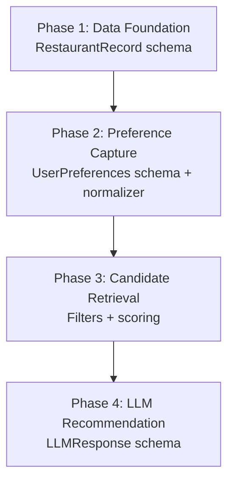
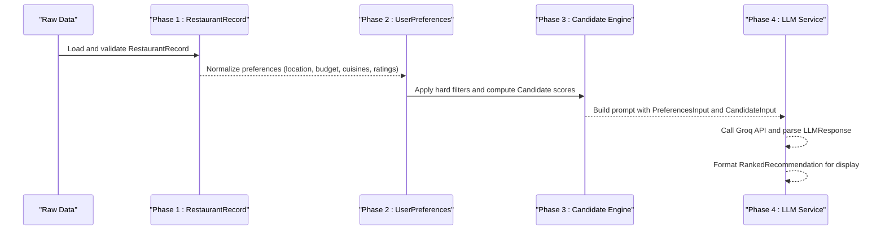
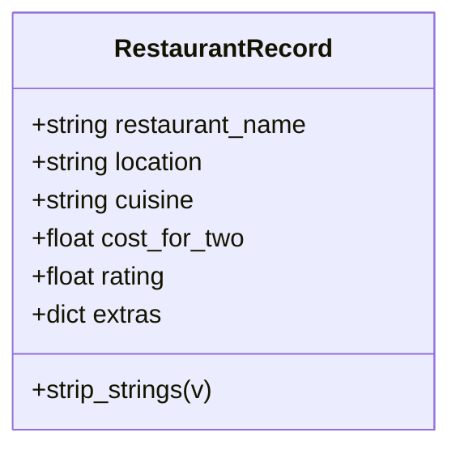
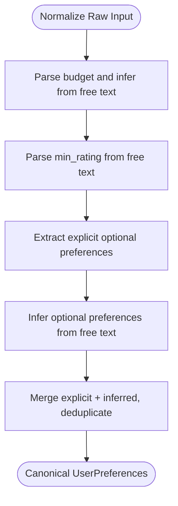
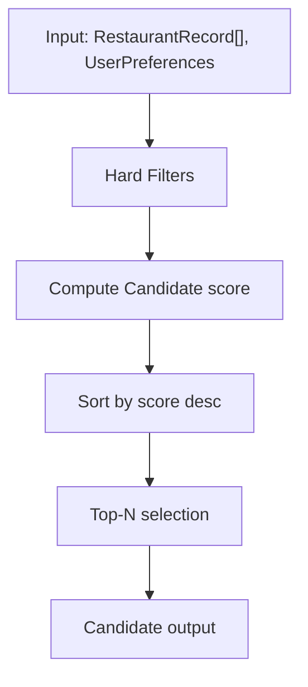
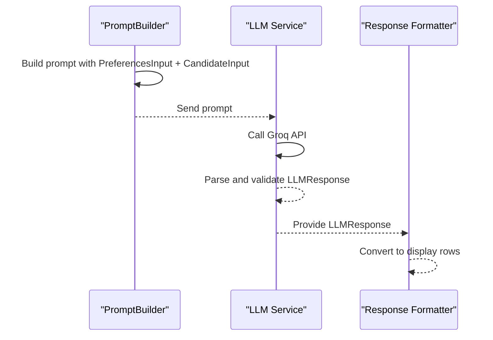
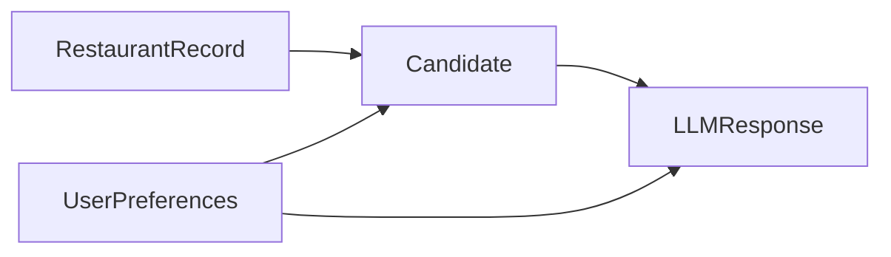

# Data Models and Schemas

<cite>
**Referenced Files in This Document**
- [schema.py](file://Zomato/architecture/phase_1_data_foundation/schema.py)
- [schema.py](file://Zomato/architecture/phase_2_preference_capture/schema.py)
- [normalizer.py](file://Zomato/architecture/phase_2_preference_capture/normalizer.py)
- [schema.py](file://Zomato/architecture/phase_3_candidate_retrieval/schema.py)
- [engine.py](file://Zomato/architecture/phase_3_candidate_retrieval/engine.py)
- [schema.py](file://Zomato/architecture/phase_4_llm_recommendation/schema.py)
- [prompt_builder.py](file://Zomato/architecture/phase_4_llm_recommendation/prompt_builder.py)
- [llm_service.py](file://Zomato/architecture/phase_4_llm_recommendation/llm_service.py)
- [response_formatter.py](file://Zomato/architecture/phase_4_llm_recommendation/response_formatter.py)
- [sample_input.json](file://Zomato/architecture/phase_1_data_foundation/sample_input.json)
- [sample_restaurants.jsonl](file://Zomato/architecture/phase_3_candidate_retrieval/sample_restaurants.jsonl)
- [sample_candidates.json](file://Zomato/architecture/phase_4_llm_recommendation/sample_candidates.json)
- [sample_preferences.json](file://Zomato/architecture/phase_4_llm_recommendation/sample_preferences.json)
</cite>

## Table of Contents
1. [Introduction](#introduction)
2. [Project Structure](#project-structure)
3. [Core Components](#core-components)
4. [Architecture Overview](#architecture-overview)
5. [Detailed Component Analysis](#detailed-component-analysis)
6. [Dependency Analysis](#dependency-analysis)
7. [Performance Considerations](#performance-considerations)
8. [Troubleshooting Guide](#troubleshooting-guide)
9. [Conclusion](#conclusion)
10. [Appendices](#appendices)

## Introduction
This document provides comprehensive data model documentation for the Zomato AI Recommendation System across four phases. It defines entity schemas, field semantics, validation rules, normalization logic, scoring and ranking transformations, and the end-to-end flow from raw restaurant records to final ranked recommendations. It also outlines constraints, indexes, and integrity considerations, along with performance, caching, lifecycle, and migration guidance.

## Project Structure
The system is organized into phases, each with dedicated schemas and processing logic:
- Phase 1: Data Foundation defines the normalized RestaurantRecord schema and validation.
- Phase 2: Preference Capture normalizes user preferences into a canonical form.
- Phase 3: Candidate Retrieval filters and scores candidates based on preferences.
- Phase 4: LLM Recommendation consumes candidate and preference inputs to produce final ranked recommendations.

**Diagram sources**
- [schema.py:10-54](file://Zomato/architecture/phase_1_data_foundation/schema.py#L10-L54)
- [schema.py:8-72](file://Zomato/architecture/phase_2_preference_capture/schema.py#L8-L72)
- [normalizer.py:76-91](file://Zomato/architecture/phase_2_preference_capture/normalizer.py#L76-L91)
- [schema.py:10-35](file://Zomato/architecture/phase_3_candidate_retrieval/schema.py#L10-L35)
- [engine.py:23-118](file://Zomato/architecture/phase_3_candidate_retrieval/engine.py#L23-L118)
- [schema.py:8-38](file://Zomato/architecture/phase_4_llm_recommendation/schema.py#L8-L38)

**Section sources**
- [schema.py:10-54](file://Zomato/architecture/phase_1_data_foundation/schema.py#L10-L54)
- [schema.py:8-72](file://Zomato/architecture/phase_2_preference_capture/schema.py#L8-L72)
- [normalizer.py:76-91](file://Zomato/architecture/phase_2_preference_capture/normalizer.py#L76-L91)
- [schema.py:10-35](file://Zomato/architecture/phase_3_candidate_retrieval/schema.py#L10-L35)
- [engine.py:23-118](file://Zomato/architecture/phase_3_candidate_retrieval/engine.py#L23-L118)
- [schema.py:8-38](file://Zomato/architecture/phase_4_llm_recommendation/schema.py#L8-L38)

## Core Components
This section documents the schemas and their roles across phases.

- Phase 1: RestaurantRecord
  - Purpose: Normalized, validated restaurant row for downstream phases.
  - Fields:
    - restaurant_name: string, required, stripped and validated.
    - location: string, required, stripped and validated.
    - cuisine: string, required, stripped and validated.
    - cost_for_two: float or null, non-negative if present.
    - rating: float or null, constrained to [0.0, 5.0] if present.
    - extras: dict, preserved raw/normalized attributes.
  - Validation rules:
    - String fields are stripped and empty strings are accepted only if non-empty after stripping.
    - rating and cost_for_two are bounded when present.
    - Extra fields are disallowed by configuration.
  - Transformation logic:
    - Pre-processing strips whitespace and normalizes strings.
    - Extras preserves unstructured metadata for later enrichment.

- Phase 2: UserPreferences
  - Purpose: Canonical representation of user preferences.
  - Fields:
    - location: string, normalized to title-case.
    - budget: string, one of low, medium, high; normalized from synonyms.
    - cuisines: list of strings, deduplicated and title-normalized.
    - min_rating: float in [0.0, 5.0].
    - optional_preferences: list of strings, deduplicated and lower-normalized.
    - free_text: string, stripped.
  - Validation rules:
    - Budget is validated against a controlled vocabulary; defaults to medium if ambiguous.
    - Cuisines and optional preferences are normalized and de-duplicated.
    - Ratings are parsed from free-text with bounds.
  - Transformation logic:
    - Normalizer maps synonyms to canonical budget categories.
    - Infers optional preferences via keyword matching in free text.

- Phase 3: Candidate schema
  - Purpose: Filtered and scored candidate restaurants.
  - Fields:
    - restaurant_name, location, cuisine: strings.
    - rating, cost_for_two: floats or null.
    - score: float, aggregated score.
    - match_reasons: list of strings describing match drivers.
  - Validation rules:
    - Numeric fields constrained to non-negative ranges.
  - Transformation logic:
    - Hard filters by location/rating/budget range.
    - Scoring by cuisine overlap, optional preference matches, rating, and budget proximity.

- Phase 4: LLM recommendation schema
  - CandidateInput: subset of candidate fields for LLM consumption.
  - PreferencesInput: canonical preferences for LLM consumption.
  - RankedRecommendation: final recommendation with rank, explanation, and restaurant details.
  - LLMResponse: container with summary and recommendations.

**Section sources**
- [schema.py:10-54](file://Zomato/architecture/phase_1_data_foundation/schema.py#L10-L54)
- [schema.py:8-72](file://Zomato/architecture/phase_2_preference_capture/schema.py#L8-L72)
- [normalizer.py:29-91](file://Zomato/architecture/phase_2_preference_capture/normalizer.py#L29-L91)
- [schema.py:10-35](file://Zomato/architecture/phase_3_candidate_retrieval/schema.py#L10-L35)
- [engine.py:23-118](file://Zomato/architecture/phase_3_candidate_retrieval/engine.py#L23-L118)
- [schema.py:8-38](file://Zomato/architecture/phase_4_llm_recommendation/schema.py#L8-L38)

## Architecture Overview
End-to-end flow from raw data to final recommendations.

**Diagram sources**
- [schema.py:41-54](file://Zomato/architecture/phase_1_data_foundation/schema.py#L41-L54)
- [normalizer.py:76-91](file://Zomato/architecture/phase_2_preference_capture/normalizer.py#L76-L91)
- [schema.py:10-35](file://Zomato/architecture/phase_3_candidate_retrieval/schema.py#L10-L35)
- [engine.py:23-118](file://Zomato/architecture/phase_3_candidate_retrieval/engine.py#L23-L118)
- [prompt_builder.py:10-45](file://Zomato/architecture/phase_4_llm_recommendation/prompt_builder.py#L10-L45)
- [llm_service.py:19-43](file://Zomato/architecture/phase_4_llm_recommendation/llm_service.py#L19-L43)
- [schema.py:26-38](file://Zomato/architecture/phase_4_llm_recommendation/schema.py#L26-L38)

## Detailed Component Analysis

### Phase 1: RestaurantRecord Schema
- Entity definition and constraints:
  - Strings are stripped and validated for minimum length.
  - cost_for_two and rating are optional but bounded when present.
  - Extras dictionary preserves arbitrary metadata.
- Validation and normalization:
  - Pre-validation strips whitespace and converts to string.
  - Extra fields are disallowed by configuration.
- Sample data:
  - See [sample_input.json:1-14](file://Zomato/architecture/phase_1_data_foundation/sample_input.json#L1-L14).

**Diagram sources**
- [schema.py:10-54](file://Zomato/architecture/phase_1_data_foundation/schema.py#L10-L54)

**Section sources**
- [schema.py:10-54](file://Zomato/architecture/phase_1_data_foundation/schema.py#L10-L54)
- [sample_input.json:1-14](file://Zomato/architecture/phase_1_data_foundation/sample_input.json#L1-L14)

### Phase 2: UserPreferences Schema and Normalization
- Canonical schema:
  - location: title-cased.
  - budget: normalized to low/medium/high.
  - cuisines: deduplicated and title-normalized.
  - min_rating: parsed from free text with bounds.
  - optional_preferences: deduplicated and lower-normalized.
  - free_text: stripped.
- Normalization logic:
  - Budget synonyms mapped to canonical values.
  - Optional preferences inferred from keywords in free text.
  - Ratings extracted from textual input with clamping.
- Sample data:
  - See [sample_preferences.json:1-8](file://Zomato/architecture/phase_4_llm_recommendation/sample_preferences.json#L1-L8).

**Diagram sources**
- [normalizer.py:29-91](file://Zomato/architecture/phase_2_preference_capture/normalizer.py#L29-L91)
- [schema.py:8-72](file://Zomato/architecture/phase_2_preference_capture/schema.py#L8-L72)

**Section sources**
- [schema.py:8-72](file://Zomato/architecture/phase_2_preference_capture/schema.py#L8-L72)
- [normalizer.py:29-91](file://Zomato/architecture/phase_2_preference_capture/normalizer.py#L29-L91)
- [sample_preferences.json:1-8](file://Zomato/architecture/phase_4_llm_recommendation/sample_preferences.json#L1-L8)

### Phase 3: Candidate Retrieval and Scoring
- Filtering:
  - Location: case-insensitive substring match between normalized location and restaurant location.
  - Rating: restaurants with rating below threshold are excluded.
  - Budget: cost_for_two must fall within computed range per budget tier.
- Scoring:
  - Cuisine overlap score: normalized intersection over union up to 40 points.
  - Optional preference matches: up to 20 points based on number of matches.
  - Rating boost: up to 40 points proportional to rating.
  - Budget proximity: proximity to ideal center within budget band contributes up to 20 points.
- Ranking:
  - Sort by score descending and take top N.

**Diagram sources**
- [engine.py:23-118](file://Zomato/architecture/phase_3_candidate_retrieval/engine.py#L23-L118)
- [schema.py:10-35](file://Zomato/architecture/phase_3_candidate_retrieval/schema.py#L10-L35)

**Section sources**
- [schema.py:10-35](file://Zomato/architecture/phase_3_candidate_retrieval/schema.py#L10-L35)
- [engine.py:23-118](file://Zomato/architecture/phase_3_candidate_retrieval/engine.py#L23-L118)
- [sample_restaurants.jsonl:1-5](file://Zomato/architecture/phase_3_candidate_retrieval/sample_restaurants.jsonl#L1-L5)
- [sample_candidates.json:1-21](file://Zomato/architecture/phase_4_llm_recommendation/sample_candidates.json#L1-L21)

### Phase 4: LLM Recommendation and Final Output
- Inputs:
  - PreferencesInput: canonical preferences.
  - CandidateInput: selected candidates with match reasons.
- Prompt construction:
  - JSON-serialized preferences and candidates embedded into a fixed instruction.
- LLM call:
  - Groq chat completion with JSON validation and error handling.
- Output:
  - LLMResponse with summary and RankedRecommendation list.
  - RankedRecommendation includes rank, explanation, and restaurant details.

**Diagram sources**
- [prompt_builder.py:10-45](file://Zomato/architecture/phase_4_llm_recommendation/prompt_builder.py#L10-L45)
- [llm_service.py:19-43](file://Zomato/architecture/phase_4_llm_recommendation/llm_service.py#L19-L43)
- [response_formatter.py:8-22](file://Zomato/architecture/phase_4_llm_recommendation/response_formatter.py#L8-L22)
- [schema.py:18-38](file://Zomato/architecture/phase_4_llm_recommendation/schema.py#L18-L38)

**Section sources**
- [schema.py:8-38](file://Zomato/architecture/phase_4_llm_recommendation/schema.py#L8-L38)
- [prompt_builder.py:10-45](file://Zomato/architecture/phase_4_llm_recommendation/prompt_builder.py#L10-L45)
- [llm_service.py:19-43](file://Zomato/architecture/phase_4_llm_recommendation/llm_service.py#L19-L43)
- [response_formatter.py:8-22](file://Zomato/architecture/phase_4_llm_recommendation/response_formatter.py#L8-L22)

## Dependency Analysis
- Phase 1 depends on Pydantic for validation and produces RestaurantRecord instances consumed by subsequent phases.
- Phase 2 normalizes raw user input into UserPreferences, which are consumed by Phase 3 filtering and by Phase 4 prompt building.
- Phase 3 consumes RestaurantRecord and UserPreferences to produce Candidate, which are consumed by Phase 4.
- Phase 4 consumes CandidateInput and PreferencesInput to produce LLMResponse and RankedRecommendation.

**Diagram sources**
- [schema.py:10-54](file://Zomato/architecture/phase_1_data_foundation/schema.py#L10-L54)
- [schema.py:8-72](file://Zomato/architecture/phase_2_preference_capture/schema.py#L8-L72)
- [schema.py:10-35](file://Zomato/architecture/phase_3_candidate_retrieval/schema.py#L10-L35)
- [schema.py:8-38](file://Zomato/architecture/phase_4_llm_recommendation/schema.py#L8-L38)

**Section sources**
- [schema.py:10-54](file://Zomato/architecture/phase_1_data_foundation/schema.py#L10-L54)
- [schema.py:8-72](file://Zomato/architecture/phase_2_preference_capture/schema.py#L8-L72)
- [schema.py:10-35](file://Zomato/architecture/phase_3_candidate_retrieval/schema.py#L10-L35)
- [schema.py:8-38](file://Zomato/architecture/phase_4_llm_recommendation/schema.py#L8-L38)

## Performance Considerations
- Candidate scoring complexity:
  - Per-restaurant scoring involves:
    - Tokenization and normalization for location and cuisines.
    - Set operations for cuisine overlap.
    - Keyword matching for optional preferences.
    - Budget proximity calculation.
  - Sorting by score is O(N log N); top-N selection reduces effective work.
- Indexes and constraints:
  - Primary keys: None implied in current schemas; consider surrogate integer keys for large-scale storage.
  - Composite indexes:
    - (location, rating, cost_for_two) to accelerate hard filtering.
    - (cuisine_tokens, location) to speed up cuisine-location filtering.
  - Constraints:
    - Non-negative numeric fields.
    - Rating in [0.0, 5.0].
- Caching strategies:
  - Cache normalized preferences and derived budget ranges.
  - Cache frequent queries for popular locations and cuisines.
  - Cache LLM prompts and responses keyed by preferences hash for reuse.
- Data access patterns:
  - Batch processing of RestaurantRecord lists.
  - Iterative scoring per candidate with early exits for hard filters.
- Performance tips:
  - Pre-tokenize and cache normalized tokens for location and cuisine.
  - Use vectorized operations for budget proximity scoring.
  - Limit top-N to reduce downstream LLM workload.

[No sources needed since this section provides general guidance]

## Troubleshooting Guide
- Validation failures:
  - RestaurantRecord validation collects per-row errors; inspect error messages for malformed rows.
  - UserPreferences normalization raises errors for invalid budget values; ensure canonical budget terms or clear free text.
- LLM API issues:
  - Missing API key or invalid JSON response triggers explicit exceptions; verify environment configuration and prompt formatting.
- Data mismatches:
  - Location normalization differences can cause false negatives; ensure consistent casing and spelling.
  - Cuisine parsing relies on comma-separated lists; ensure consistent delimiters.

**Section sources**
- [schema.py:41-54](file://Zomato/architecture/phase_1_data_foundation/schema.py#L41-L54)
- [schema.py:23-29](file://Zomato/architecture/phase_2_preference_capture/schema.py#L23-L29)
- [llm_service.py:20-42](file://Zomato/architecture/phase_4_llm_recommendation/llm_service.py#L20-L42)

## Conclusion
The Zomato AI Recommendation System employs a layered schema design with strict validation and normalization at each phase. Phase 1 establishes a robust RestaurantRecord, Phase 2 normalizes user preferences, Phase 3 applies efficient filtering and scoring, and Phase 4 leverages LLMs to produce human-readable recommendations. The documented constraints, indexes, and caching strategies enable scalable operation while maintaining data integrity and performance.

[No sources needed since this section summarizes without analyzing specific files]

## Appendices

### Data Integrity and Constraints
- RestaurantRecord:
  - String fields: stripped, min-length 1.
  - cost_for_two: ge 0.0 if present.
  - rating: ge 0.0 and le 5.0 if present.
  - Extras: preserved; extra fields disallowed by configuration.
- UserPreferences:
  - budget: one of low/medium/high.
  - cuisines: deduplicated and title-normalized.
  - optional_preferences: deduplicated and lower-normalized.
  - min_rating: ge 0.0 and le 5.0.
- Candidate:
  - score: float; match_reasons: list of strings.
- LLMResponse:
  - recommendations: list of RankedRecommendation with rank and explanation.

**Section sources**
- [schema.py:13-29](file://Zomato/architecture/phase_1_data_foundation/schema.py#L13-L29)
- [schema.py:11-16](file://Zomato/architecture/phase_2_preference_capture/schema.py#L11-L16)
- [schema.py:18-35](file://Zomato/architecture/phase_3_candidate_retrieval/schema.py#L18-L35)
- [schema.py:26-38](file://Zomato/architecture/phase_4_llm_recommendation/schema.py#L26-L38)

### Sample Data Examples
- RestaurantRecord examples:
  - See [sample_input.json:1-14](file://Zomato/architecture/phase_1_data_foundation/sample_input.json#L1-L14).
- Candidate examples:
  - See [sample_candidates.json:1-21](file://Zomato/architecture/phase_4_llm_recommendation/sample_candidates.json#L1-L21).
- Candidate input for LLM:
  - See [sample_restaurants.jsonl:1-5](file://Zomato/architecture/phase_3_candidate_retrieval/sample_restaurants.jsonl#L1-L5).

**Section sources**
- [sample_input.json:1-14](file://Zomato/architecture/phase_1_data_foundation/sample_input.json#L1-L14)
- [sample_candidates.json:1-21](file://Zomato/architecture/phase_4_llm_recommendation/sample_candidates.json#L1-L21)
- [sample_restaurants.jsonl:1-5](file://Zomato/architecture/phase_3_candidate_retrieval/sample_restaurants.jsonl#L1-L5)

### Data Lifecycle, Retention, and Archival
- Lifecycle stages:
  - Ingestion: RestaurantRecord validation and normalization.
  - Processing: Preference normalization, candidate filtering/sorting.
  - Serving: LLM recommendation and response formatting.
- Retention:
  - Short-term logs for debugging; long-term retention governed by policy.
- Archival:
  - Historical recommendations and prompts can be archived separately from live data.

[No sources needed since this section provides general guidance]

### Migration and Version Management
- Schema evolution:
  - Add optional fields with defaults to maintain backward compatibility.
  - Introduce new enums or controlled vocabularies with fallbacks.
  - Keep validation strict; relax constraints gradually with deprecation notices.
- Migration steps:
  - Backfill new fields using historical data where possible.
  - Version APIs and schemas; maintain multiple compatible versions during rollout.
  - Use feature flags to test new schemas incrementally.

[No sources needed since this section provides general guidance]