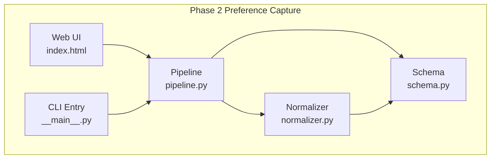
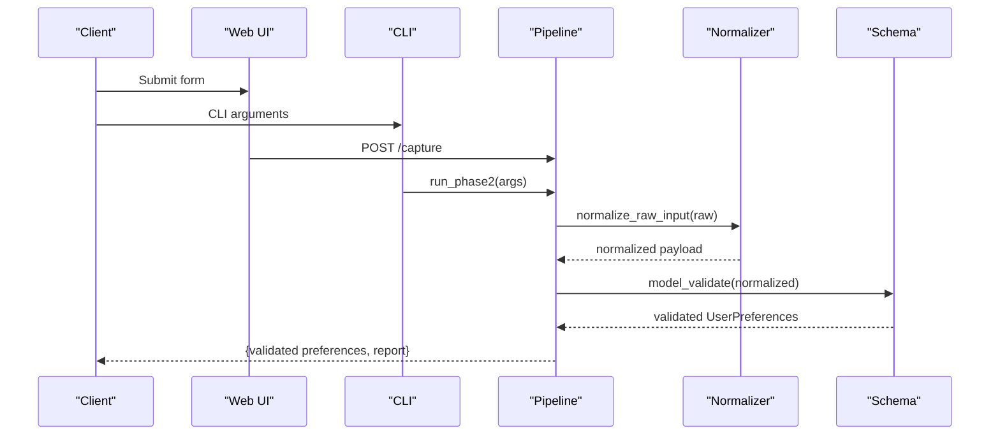
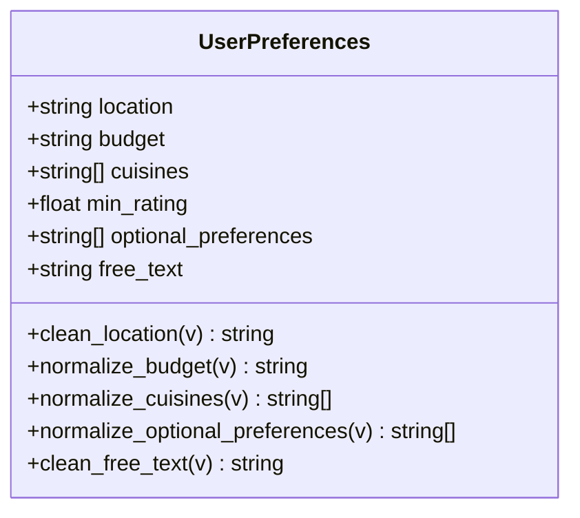
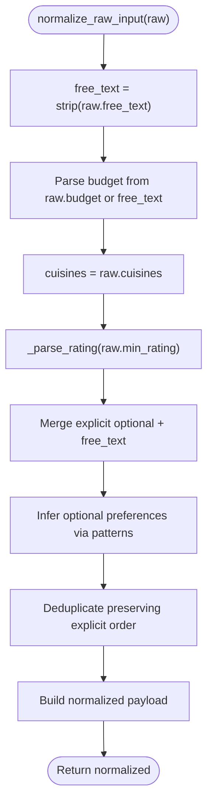
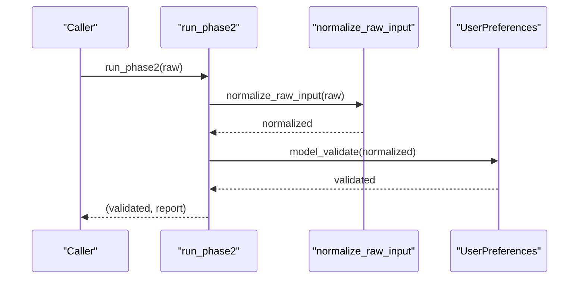
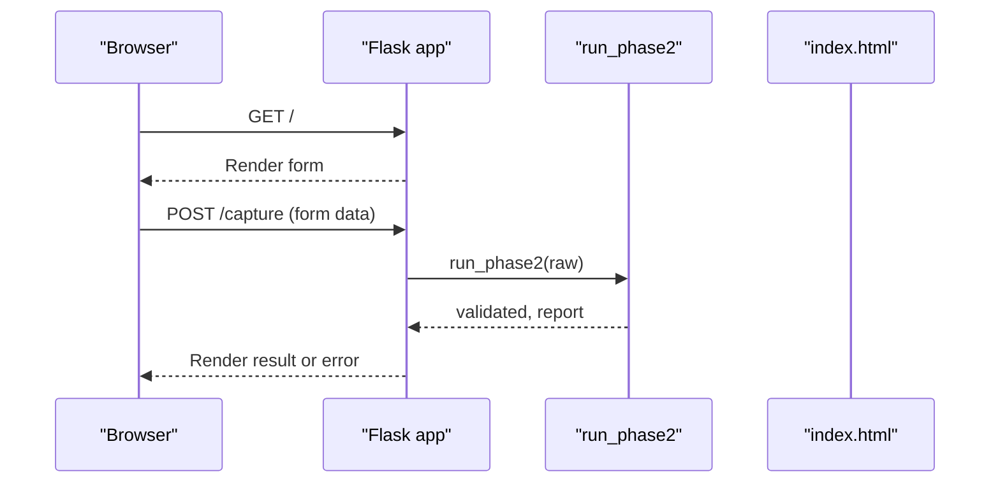
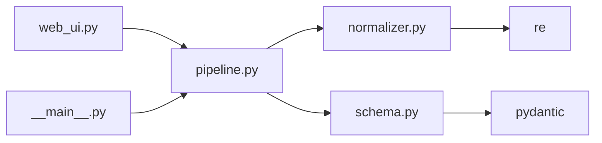

# PreferencesInput Schema

<cite>
**Referenced Files in This Document**
- [schema.py](file://Zomato/architecture/phase_2_preference_capture/schema.py)
- [normalizer.py](file://Zomato/architecture/phase_2_preference_capture/normalizer.py)
- [pipeline.py](file://Zomato/architecture/phase_2_preference_capture/pipeline.py)
- [web_ui.py](file://Zomato/architecture/phase_2_preference_capture/web_ui.py)
- [__main__.py](file://Zomato/architecture/phase_2_preference_capture/__main__.py)
- [index.html](file://Zomato/architecture/phase_2_preference_capture/templates/index.html)
- [requirements.txt](file://Zomato/architecture/phase_2_preference_capture/requirements.txt)
</cite>

## Table of Contents
1. [Introduction](#introduction)
2. [Project Structure](#project-structure)
3. [Core Components](#core-components)
4. [Architecture Overview](#architecture-overview)
5. [Detailed Component Analysis](#detailed-component-analysis)
6. [Dependency Analysis](#dependency-analysis)
7. [Performance Considerations](#performance-considerations)
8. [Troubleshooting Guide](#troubleshooting-guide)
9. [Conclusion](#conclusion)
10. [Appendices](#appendices)

## Introduction
This document describes the PreferencesInput schema used in Phase 2 Preference Capture. It documents all user preference fields, their validation rules, acceptable value ranges, input normalization processes, and how preferences are normalized and aggregated for downstream processing. It also explains optional versus required fields and their impact on candidate retrieval, and provides guidance on preference weighting and scoring mechanisms that may be applied in later phases.

## Project Structure
The Phase 2 Preference Capture module consists of:
- A Pydantic schema that defines the validated preference object
- A normalization layer that cleans and standardizes raw inputs
- A pipeline that orchestrates collection, normalization, and validation
- A minimal web UI and CLI entry points for testing and demonstration

**Diagram sources**
- [index.html:1-64](file://Zomato/architecture/phase_2_preference_capture/templates/index.html#L1-L64)
- [__main__.py:1-46](file://Zomato/architecture/phase_2_preference_capture/__main__.py#L1-L46)
- [pipeline.py:1-21](file://Zomato/architecture/phase_2_preference_capture/pipeline.py#L1-L21)
- [normalizer.py:1-91](file://Zomato/architecture/phase_2_preference_capture/normalizer.py#L1-L91)
- [schema.py:1-72](file://Zomato/architecture/phase_2_preference_capture/schema.py#L1-L72)

**Section sources**
- [requirements.txt:1-3](file://Zomato/architecture/phase_2_preference_capture/requirements.txt#L1-L3)
- [index.html:1-64](file://Zomato/architecture/phase_2_preference_capture/templates/index.html#L1-L64)
- [__main__.py:1-46](file://Zomato/architecture/phase_2_preference_capture/__main__.py#L1-L46)
- [pipeline.py:1-21](file://Zomato/architecture/phase_2_preference_capture/pipeline.py#L1-L21)
- [normalizer.py:1-91](file://Zomato/architecture/phase_2_preference_capture/normalizer.py#L1-L91)
- [schema.py:1-72](file://Zomato/architecture/phase_2_preference_capture/schema.py#L1-L72)

## Core Components
- UserPreferences schema: Defines the canonical preference object with strict validation and normalization rules.
- Normalizer: Converts noisy raw inputs into canonical fields, including budget mapping, rating extraction, and optional preference inference.
- Pipeline: Orchestrates normalization followed by validation and produces a report.
- Web UI and CLI: Provide entry points to feed raw inputs into the pipeline.

Key preference fields:
- Location: Required string; cleaned and normalized to title-case.
- Budget: Required string constrained to low, medium, high; supports synonyms and inference from free text.
- Cuisines: Optional list of strings; deduplicated and normalized to title-case.
- Minimum rating: Optional numeric threshold in [0.0, 5.0]; defaults to 0.0.
- Optional preferences: Optional list of strings; deduplicated and normalized to lowercase; inferred from free text.
- Free text: Optional string; used to infer optional preferences and budget when explicit values are missing.

Validation rules and ranges:
- Location: Non-empty string after cleaning.
- Budget: Must be one of low, medium, high; otherwise raises validation error.
- Cuisines: List of strings; duplicates removed; items normalized to title-case.
- Minimum rating: Numeric in [0.0, 5.0]; invalid or empty values default to 0.0.
- Optional preferences: List of strings; duplicates removed; items normalized to lowercase; inferred from free text.
- Free text: Optional string; stripped and passed through.

Normalization behavior:
- Location: Stripped, title-cased.
- Budget: Lowercased, mapped to canonical values; falls back to medium if ambiguous.
- Cuisines: Split by comma, stripped, deduplicated by lowercased key, title-cased for display.
- Optional preferences: Explicit items split by comma, deduplicated, then inferred from free text using regex patterns; combined preserving explicit order.
- Free text: Stripped.

Downstream aggregation:
- The validated UserPreferences object is returned by the pipeline for downstream processing in later phases.

**Section sources**
- [schema.py:8-72](file://Zomato/architecture/phase_2_preference_capture/schema.py#L8-L72)
- [normalizer.py:1-91](file://Zomato/architecture/phase_2_preference_capture/normalizer.py#L1-L91)
- [pipeline.py:11-21](file://Zomato/architecture/phase_2_preference_capture/pipeline.py#L11-L21)

## Architecture Overview
End-to-end flow from raw input to validated preferences:

**Diagram sources**
- [web_ui.py:19-43](file://Zomato/architecture/phase_2_preference_capture/web_ui.py#L19-L43)
- [__main__.py:28-41](file://Zomato/architecture/phase_2_preference_capture/__main__.py#L28-L41)
- [pipeline.py:11-21](file://Zomato/architecture/phase_2_preference_capture/pipeline.py#L11-L21)
- [normalizer.py:76-91](file://Zomato/architecture/phase_2_preference_capture/normalizer.py#L76-L91)
- [schema.py:8-17](file://Zomato/architecture/phase_2_preference_capture/schema.py#L8-L17)

## Detailed Component Analysis

### UserPreferences Schema
The schema defines the canonical preference object with:
- Required fields: location, budget
- Optional fields: cuisines, min_rating, optional_preferences, free_text
- Validators for normalization and validation

Field-level behavior:
- location: Cleaned to stripped, title-cased string; required.
- budget: Normalized to lowercase canonical values; must be low, medium, or high.
- cuisines: Normalized to title-cased, deduplicated list of strings.
- min_rating: Normalized to float in [0.0, 5.0], default 0.0.
- optional_preferences: Normalized to lowercase, deduplicated list; inferred from free text.
- free_text: Stripped string.

Validation rules:
- location: min_length=1 enforced.
- budget: Must be one of low, medium, high; otherwise raises error.
- min_rating: ge=0.0, le=5.0 enforced.
- cuisines: No length limit; duplicates removed.
- optional_preferences: No length limit; duplicates removed.
- free_text: No constraints.

**Diagram sources**
- [schema.py:8-72](file://Zomato/architecture/phase_2_preference_capture/schema.py#L8-L72)

**Section sources**
- [schema.py:8-72](file://Zomato/architecture/phase_2_preference_capture/schema.py#L8-L72)

### Normalizer
The normalizer converts raw inputs into canonical fields:
- Budget mapping: Maps synonyms to canonical values; infers from free text if needed; defaults to medium.
- Rating parsing: Extracts numeric value from string; clamps to [0.0, 5.0].
- Optional preferences: Merges explicit items with free text; infers additional preferences via regex patterns; deduplicates while preserving explicit order.
- Cuisines: Passed through as-is to schema validator for normalization.

**Diagram sources**
- [normalizer.py:76-91](file://Zomato/architecture/phase_2_preference_capture/normalizer.py#L76-L91)
- [normalizer.py:29-41](file://Zomato/architecture/phase_2_preference_capture/normalizer.py#L29-L41)
- [normalizer.py:44-56](file://Zomato/architecture/phase_2_preference_capture/normalizer.py#L44-L56)
- [normalizer.py:59-73](file://Zomato/architecture/phase_2_preference_capture/normalizer.py#L59-L73)

**Section sources**
- [normalizer.py:1-91](file://Zomato/architecture/phase_2_preference_capture/normalizer.py#L1-L91)

### Pipeline
The pipeline coordinates normalization and validation:
- Calls normalize_raw_input to produce a normalized payload.
- Validates the normalized payload against UserPreferences.
- Produces a report containing input keys, normalized payload, and validity flag.

**Diagram sources**
- [pipeline.py:11-21](file://Zomato/architecture/phase_2_preference_capture/pipeline.py#L11-L21)
- [normalizer.py:76-91](file://Zomato/architecture/phase_2_preference_capture/normalizer.py#L76-L91)
- [schema.py:8-17](file://Zomato/architecture/phase_2_preference_capture/schema.py#L8-L17)

**Section sources**
- [pipeline.py:1-21](file://Zomato/architecture/phase_2_preference_capture/pipeline.py#L1-L21)

### Web UI and CLI
- Web UI: Provides a form with fields for location, budget, cuisines, minimum rating, optional preferences, and free text. Submits to /capture endpoint, which runs the pipeline and renders results or errors.
- CLI: Supports --web flag to start the web server or accepts command-line arguments to run the pipeline directly.

**Diagram sources**
- [web_ui.py:14-43](file://Zomato/architecture/phase_2_preference_capture/web_ui.py#L14-L43)
- [index.html:22-46](file://Zomato/architecture/phase_2_preference_capture/templates/index.html#L22-L46)
- [pipeline.py:11-21](file://Zomato/architecture/phase_2_preference_capture/pipeline.py#L11-L21)

**Section sources**
- [web_ui.py:1-52](file://Zomato/architecture/phase_2_preference_capture/web_ui.py#L1-L52)
- [__main__.py:1-46](file://Zomato/architecture/phase_2_preference_capture/__main__.py#L1-L46)
- [index.html:1-64](file://Zomato/architecture/phase_2_preference_capture/templates/index.html#L1-L64)

## Dependency Analysis
- The pipeline depends on the normalizer and schema.
- The web UI and CLI depend on the pipeline.
- The schema depends on Pydantic validators.
- The normalizer depends on regex patterns and mapping dictionaries.

**Diagram sources**
- [web_ui.py](file://Zomato/architecture/phase_2_preference_capture/web_ui.py#L9)
- [__main__.py](file://Zomato/architecture/phase_2_preference_capture/__main__.py#L8)
- [pipeline.py:7-8](file://Zomato/architecture/phase_2_preference_capture/pipeline.py#L7-L8)
- [schema.py](file://Zomato/architecture/phase_2_preference_capture/schema.py#L5)
- [normalizer.py](file://Zomato/architecture/phase_2_preference_capture/normalizer.py#L5)

**Section sources**
- [requirements.txt:1-3](file://Zomato/architecture/phase_2_preference_capture/requirements.txt#L1-L3)
- [web_ui.py](file://Zomato/architecture/phase_2_preference_capture/web_ui.py#L9)
- [__main__.py](file://Zomato/architecture/phase_2_preference_capture/__main__.py#L8)
- [pipeline.py:7-8](file://Zomato/architecture/phase_2_preference_capture/pipeline.py#L7-L8)
- [schema.py](file://Zomato/architecture/phase_2_preference_capture/schema.py#L5)
- [normalizer.py](file://Zomato/architecture/phase_2_preference_capture/normalizer.py#L5)

## Performance Considerations
- Normalization uses simple string operations and regex scanning; complexity is linear in input size.
- Deduplication uses sets for O(n) uniqueness checks.
- Budget mapping and optional preference inference are bounded by fixed dictionaries and patterns.
- Validation occurs once per input; schema validation overhead is minimal due to Pydantic’s efficient field checks.

## Troubleshooting Guide
Common validation error scenarios:
- Invalid budget: Passing a value outside low, medium, high triggers a validation error during model validation.
- Empty location: Providing an empty or whitespace-only location fails validation due to min_length constraint.
- Out-of-range rating: Values below 0 or above 5 are clamped to [0.0, 5.0] by the normalizer; however, schema enforces the range strictly, so ensure inputs are within bounds.
- Duplicate cuisines/optional preferences: Duplicates are automatically removed; if unexpected, verify input casing and separators.

Typical user preference submissions:
- Minimal required: location and budget.
- With optional preferences: Include optional_preferences or free_text to infer additional preferences.
- With cuisines: Comma-separated values are accepted; duplicates are removed.
- With rating: Numeric threshold in [0.0, 5.0].

Impact on candidate retrieval:
- Required fields (location, budget) are essential for narrowing candidates.
- Optional fields (cuisines, min_rating, optional_preferences) refine results; absence reduces specificity but still yields candidates.

Guidance on preference weighting and scoring:
- Weighting can be introduced in later phases by assigning scores to preferences (e.g., cuisines, optional preferences) and combining with distance/rating heuristics.
- Scoring mechanisms can include:
  - Exact matches for cuisines and optional preferences
  - Threshold-based filtering for min_rating
  - Distance or cost proximity adjustments
- These mechanisms are not implemented in Phase 2; they are intended for subsequent phases.

**Section sources**
- [schema.py:11-16](file://Zomato/architecture/phase_2_preference_capture/schema.py#L11-L16)
- [schema.py:23-29](file://Zomato/architecture/phase_2_preference_capture/schema.py#L23-L29)
- [schema.py:31-48](file://Zomato/architecture/phase_2_preference_capture/schema.py#L31-L48)
- [schema.py:50-66](file://Zomato/architecture/phase_2_preference_capture/schema.py#L50-L66)
- [schema.py:68-71](file://Zomato/architecture/phase_2_preference_capture/schema.py#L68-L71)
- [normalizer.py:29-41](file://Zomato/architecture/phase_2_preference_capture/normalizer.py#L29-L41)
- [normalizer.py:44-56](file://Zomato/architecture/phase_2_preference_capture/normalizer.py#L44-L56)
- [normalizer.py:59-73](file://Zomato/architecture/phase_2_preference_capture/normalizer.py#L59-L73)

## Conclusion
The PreferencesInput schema in Phase 2 captures user intent into a validated, normalized structure. It enforces required fields (location, budget) while offering flexible optional preferences (cuisines, min_rating, optional preferences, free text). The normalization layer robustly handles synonyms, free-text inference, and deduplication. The pipeline integrates normalization and validation, returning a canonical object ready for downstream processing. Optional vs required fields directly influence candidate retrieval specificity, and future phases can introduce weighting and scoring mechanisms to refine recommendations.

## Appendices

### Field Reference
- location: Required; cleaned to title-case; non-empty.
- budget: Required; canonical values: low, medium, high; supports synonyms and inference.
- cuisines: Optional; list of strings; deduplicated and title-cased.
- min_rating: Optional; numeric in [0.0, 5.0]; defaults to 0.0.
- optional_preferences: Optional; list of strings; deduplicated and lower-cased; inferred from free text.
- free_text: Optional; used for inference and normalization.

**Section sources**
- [schema.py:11-16](file://Zomato/architecture/phase_2_preference_capture/schema.py#L11-L16)
- [schema.py:23-29](file://Zomato/architecture/phase_2_preference_capture/schema.py#L23-L29)
- [schema.py:31-48](file://Zomato/architecture/phase_2_preference_capture/schema.py#L31-L48)
- [schema.py:50-66](file://Zomato/architecture/phase_2_preference_capture/schema.py#L50-L66)
- [schema.py:68-71](file://Zomato/architecture/phase_2_preference_capture/schema.py#L68-L71)
- [normalizer.py:29-41](file://Zomato/architecture/phase_2_preference_capture/normalizer.py#L29-L41)
- [normalizer.py:44-56](file://Zomato/architecture/phase_2_preference_capture/normalizer.py#L44-L56)
- [normalizer.py:59-73](file://Zomato/architecture/phase_2_preference_capture/normalizer.py#L59-L73)