# RankedRecommendation Schema

<cite>
**Referenced Files in This Document**
- [schema.py](file://Zomato/architecture/phase_4_llm_recommendation/schema.py)
- [prompt_builder.py](file://Zomato/architecture/phase_4_llm_recommendation/prompt_builder.py)
- [llm_service.py](file://Zomato/architecture/phase_4_llm_recommendation/llm_service.py)
- [response_formatter.py](file://Zomato/architecture/phase_4_llm_recommendation/response_formatter.py)
- [pipeline.py](file://Zomato/architecture/phase_4_llm_recommendation/pipeline.py)
- [web_ui.py](file://Zomato/architecture/phase_4_llm_recommendation/web_ui.py)
- [index.html](file://Zomato/architecture/phase_4_llm_recommendation/templates/index.html)
- [engine.py](file://Zomato/architecture/phase_3_candidate_retrieval/engine.py)
- [orchestrator.py](file://Zomato/architecture/phase_5_response_delivery/backend/orchestrator.py)
- [sample_candidates.json](file://Zomato/architecture/phase_4_llm_recommendation/sample_candidates.json)
- [sample_preferences.json](file://Zomato/architecture/phase_4_llm_recommendation/sample_preferences.json)
</cite>

## Table of Contents
1. [Introduction](#introduction)
2. [Project Structure](#project-structure)
3. [Core Components](#core-components)
4. [Architecture Overview](#architecture-overview)
5. [Detailed Component Analysis](#detailed-component-analysis)
6. [Dependency Analysis](#dependency-analysis)
7. [Performance Considerations](#performance-considerations)
8. [Troubleshooting Guide](#troubleshooting-guide)
9. [Conclusion](#conclusion)
10. [Appendices](#appendices)

## Introduction
This document describes the RankedRecommendation schema used in Phase 4 LLM Recommendation. It explains the final recommendation structure, including restaurant details, ranking scores, LLM-generated explanations, confidence metrics, and recommendation rationale. It also documents how recommendations are formatted for API delivery and user display, the relationship between ranked recommendations and candidate data, and the integration with LLM response formatting. Finally, it covers recommendation quality metrics and filtering criteria applied to final outputs.

## Project Structure
The Phase 4 LLM Recommendation system is organized around a small set of focused modules:
- Schema definitions for typed inputs and outputs
- Prompt building for instructing the LLM
- LLM service wrapper for Groq API calls
- Response formatting for display and downstream consumption
- Pipeline orchestration and web UI integration
- Integration with Phase 3 candidate retrieval and Phase 5 response delivery

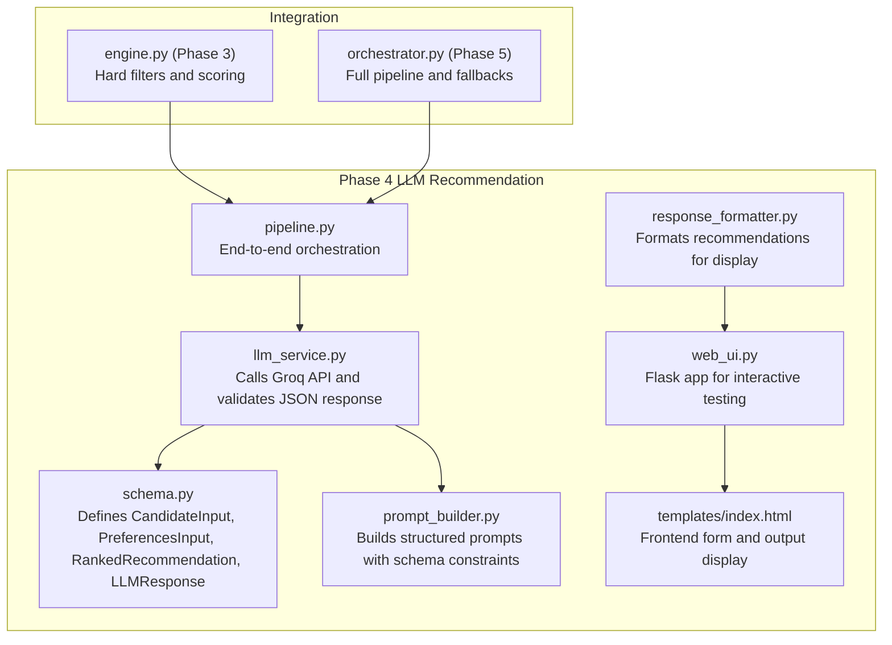

**Diagram sources**
- [schema.py:1-38](file://Zomato/architecture/phase_4_llm_recommendation/schema.py#L1-L38)
- [prompt_builder.py:1-45](file://Zomato/architecture/phase_4_llm_recommendation/prompt_builder.py#L1-L45)
- [llm_service.py:1-43](file://Zomato/architecture/phase_4_llm_recommendation/llm_service.py#L1-L43)
- [response_formatter.py:1-22](file://Zomato/architecture/phase_4_llm_recommendation/response_formatter.py#L1-L22)
- [pipeline.py:1-47](file://Zomato/architecture/phase_4_llm_recommendation/pipeline.py#L1-L47)
- [web_ui.py:1-108](file://Zomato/architecture/phase_4_llm_recommendation/web_ui.py#L1-L108)
- [index.html:1-54](file://Zomato/architecture/phase_4_llm_recommendation/templates/index.html#L1-L54)
- [engine.py:1-118](file://Zomato/architecture/phase_3_candidate_retrieval/engine.py#L1-L118)
- [orchestrator.py:1-292](file://Zomato/architecture/phase_5_response_delivery/backend/orchestrator.py#L1-L292)

**Section sources**
- [schema.py:1-38](file://Zomato/architecture/phase_4_llm_recommendation/schema.py#L1-L38)
- [pipeline.py:1-47](file://Zomato/architecture/phase_4_llm_recommendation/pipeline.py#L1-L47)
- [web_ui.py:1-108](file://Zomato/architecture/phase_4_llm_recommendation/web_ui.py#L1-L108)

## Core Components
This section defines the core data structures used in Phase 4 LLM Recommendation.

- CandidateInput: Represents a candidate restaurant record passed to the LLM for ranking. Fields include restaurant name, location, cuisine, rating, cost for two, score, and match reasons.
- PreferencesInput: Captures user preferences including location, budget category, cuisines, minimum rating, and optional preferences.
- RankedRecommendation: The final recommendation item produced by the LLM. Fields include rank, restaurant_name, explanation, rating, cost_for_two, and cuisine.
- LLMResponse: Top-level container for the LLM output, including a summary and a list of RankedRecommendation items.

These schemas are validated using Pydantic, ensuring strong typing and runtime checks.

**Section sources**
- [schema.py:8-37](file://Zomato/architecture/phase_4_llm_recommendation/schema.py#L8-L37)

## Architecture Overview
The Phase 4 pipeline transforms Phase 3 shortlisted candidates and user preferences into LLM-ranked recommendations. The LLM is instructed to return a strict JSON schema that matches LLMResponse. The response is validated and then formatted for display and API delivery.

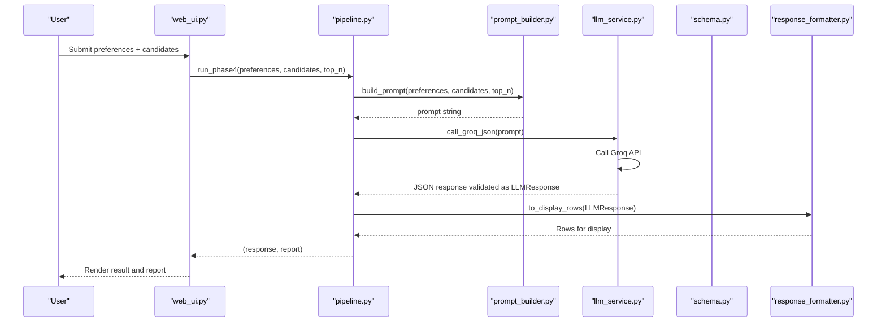

**Diagram sources**
- [web_ui.py:73-99](file://Zomato/architecture/phase_4_llm_recommendation/web_ui.py#L73-L99)
- [pipeline.py:29-46](file://Zomato/architecture/phase_4_llm_recommendation/pipeline.py#L29-L46)
- [prompt_builder.py:10-44](file://Zomato/architecture/phase_4_llm_recommendation/prompt_builder.py#L10-L44)
- [llm_service.py:19-42](file://Zomato/architecture/phase_4_llm_recommendation/llm_service.py#L19-L42)
- [response_formatter.py:8-21](file://Zomato/architecture/phase_4_llm_recommendation/response_formatter.py#L8-L21)
- [schema.py:26-37](file://Zomato/architecture/phase_4_llm_recommendation/schema.py#L26-L37)

## Detailed Component Analysis

### RankedRecommendation Schema
RankedRecommendation is the core output item representing a single recommendation. It includes:
- rank: Integer position in the ranked list
- restaurant_name: Name of the recommended restaurant
- explanation: LLM-generated rationale for the recommendation
- rating: Optional rating value (validated to be within 0–5)
- cost_for_two: Optional cost for two guests
- cuisine: Cuisines associated with the restaurant

The schema ensures that numeric fields are constrained appropriately and that explanations are included as free-form text.

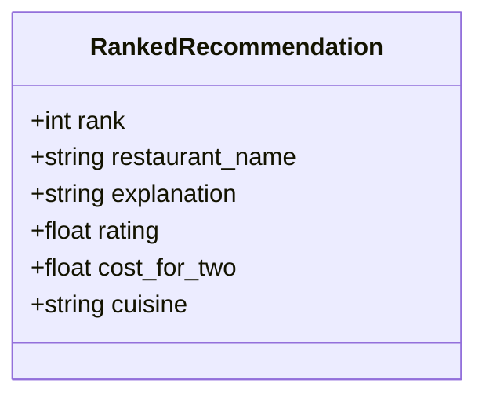

**Diagram sources**
- [schema.py:26-33](file://Zomato/architecture/phase_4_llm_recommendation/schema.py#L26-L33)

**Section sources**
- [schema.py:26-33](file://Zomato/architecture/phase_4_llm_recommendation/schema.py#L26-L33)

### LLMResponse and Candidate Relationship
LLMResponse wraps a summary and a list of RankedRecommendation entries. The LLM is instructed to return only the exact schema defined in the prompt, ensuring strict alignment with RankedRecommendation. CandidateInput objects are passed to the LLM as part of the prompt, and the LLM’s explanations reference these candidates.

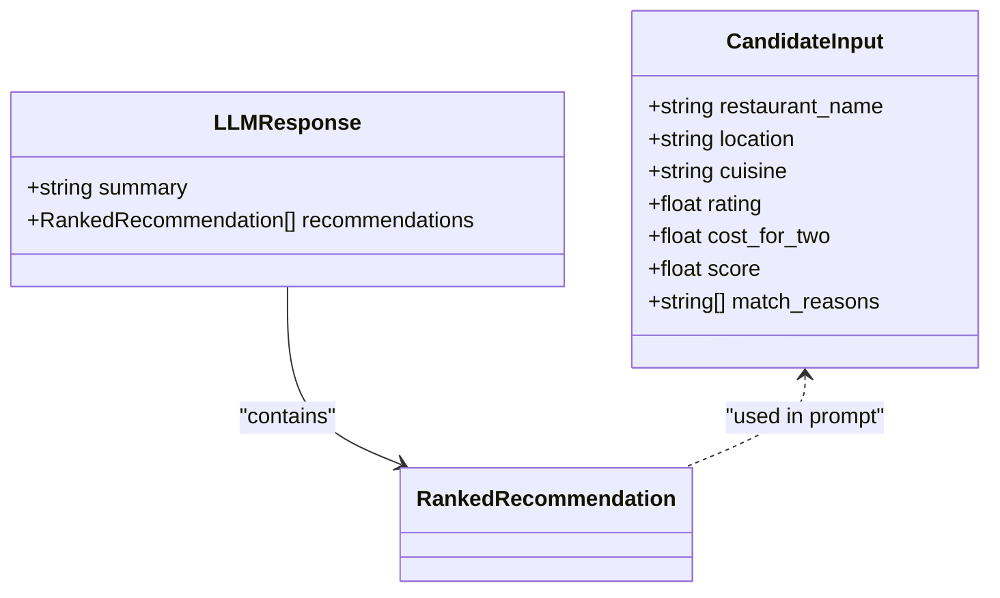

**Diagram sources**
- [schema.py:26-37](file://Zomato/architecture/phase_4_llm_recommendation/schema.py#L26-L37)
- [prompt_builder.py:10-44](file://Zomato/architecture/phase_4_llm_recommendation/prompt_builder.py#L10-L44)

**Section sources**
- [schema.py:26-37](file://Zomato/architecture/phase_4_llm_recommendation/schema.py#L26-L37)
- [prompt_builder.py:10-44](file://Zomato/architecture/phase_4_llm_recommendation/prompt_builder.py#L10-L44)

### Prompt Building and Explanation Structure
The prompt builder constructs a structured instruction for the LLM, including:
- Task instructions to rank top-N restaurants and provide concise reasoning
- Constraints to avoid inventing new restaurants or fields
- A strict JSON schema requirement with the exact field names expected by RankedRecommendation
- Example JSON showing the expected structure

This ensures that explanations are generated in a consistent format and that the LLM’s output can be validated against the schema.

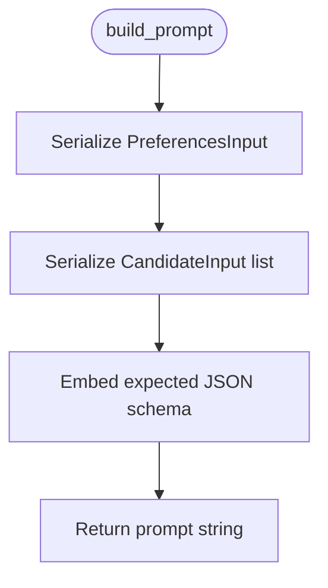

**Diagram sources**
- [prompt_builder.py:10-44](file://Zomato/architecture/phase_4_llm_recommendation/prompt_builder.py#L10-L44)

**Section sources**
- [prompt_builder.py:10-44](file://Zomato/architecture/phase_4_llm_recommendation/prompt_builder.py#L10-L44)

### LLM Service Integration and JSON Validation
The LLM service calls the Groq API with a system message instructing JSON-only responses. It extracts and validates the returned JSON, handling potential wrapping text by isolating the first and last braces. The resulting dictionary is validated against LLMResponse, ensuring robustness.

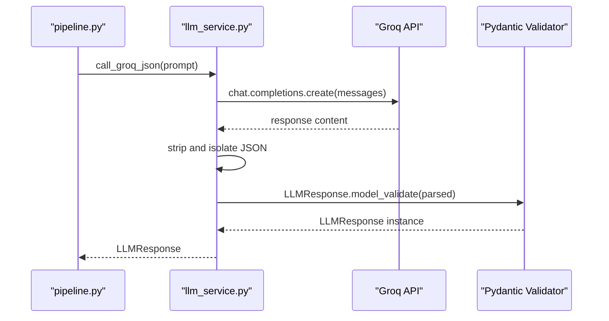

**Diagram sources**
- [llm_service.py:19-42](file://Zomato/architecture/phase_4_llm_recommendation/llm_service.py#L19-L42)
- [schema.py:35-37](file://Zomato/architecture/phase_4_llm_recommendation/schema.py#L35-L37)

**Section sources**
- [llm_service.py:19-42](file://Zomato/architecture/phase_4_llm_recommendation/llm_service.py#L19-L42)

### Response Formatting for Display and API Delivery
The response formatter converts LLMResponse into a list of dictionaries suitable for rendering in the UI and for API delivery. It preserves rank, restaurant_name, cuisine, rating, cost_for_two, and explanation fields.

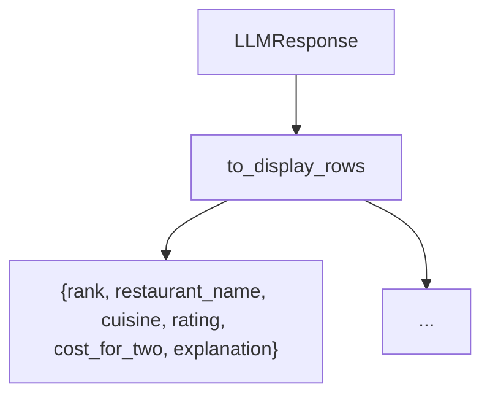

**Diagram sources**
- [response_formatter.py:8-21](file://Zomato/architecture/phase_4_llm_recommendation/response_formatter.py#L8-L21)

**Section sources**
- [response_formatter.py:8-21](file://Zomato/architecture/phase_4_llm_recommendation/response_formatter.py#L8-L21)

### Web UI Integration and Frontend Presentation
The web UI exposes a form to submit preferences and candidates, runs the pipeline, and renders the LLM output and a run report. The template displays the raw JSON output and a concise run report summarizing counts and model used.

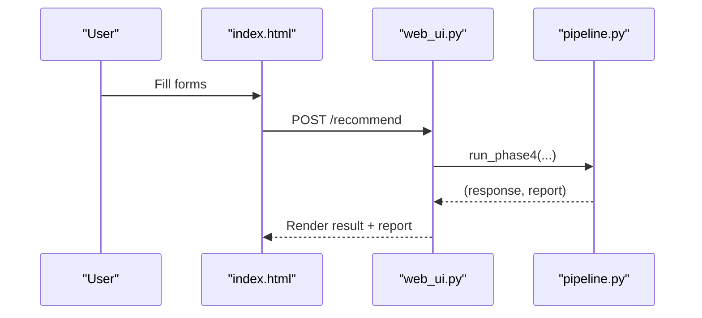

**Diagram sources**
- [web_ui.py:73-99](file://Zomato/architecture/phase_4_llm_recommendation/web_ui.py#L73-L99)
- [index.html:22-51](file://Zomato/architecture/phase_4_llm_recommendation/templates/index.html#L22-L51)

**Section sources**
- [web_ui.py:73-99](file://Zomato/architecture/phase_4_llm_recommendation/web_ui.py#L73-L99)
- [index.html:22-51](file://Zomato/architecture/phase_4_llm_recommendation/templates/index.html#L22-L51)

### Relationship Between Ranked Recommendations and Candidate Data
RankedRecommendation does not include a score field. Instead, it relies on CandidateInput for the original scoring and match reasons. The LLM uses the candidate list and user preferences to produce explanations that justify the rankings. The final output focuses on human-readable explanations rather than raw scores.

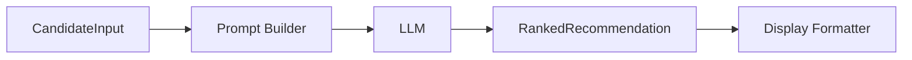

**Diagram sources**
- [schema.py:8-16](file://Zomato/architecture/phase_4_llm_recommendation/schema.py#L8-L16)
- [prompt_builder.py:10-25](file://Zomato/architecture/phase_4_llm_recommendation/prompt_builder.py#L10-L25)
- [schema.py:26-33](file://Zomato/architecture/phase_4_llm_recommendation/schema.py#L26-L33)

**Section sources**
- [schema.py:8-16](file://Zomato/architecture/phase_4_llm_recommendation/schema.py#L8-L16)
- [prompt_builder.py:10-25](file://Zomato/architecture/phase_4_llm_recommendation/prompt_builder.py#L10-L25)

### Recommendation Quality Metrics and Filtering Criteria
Quality metrics and filtering are primarily handled in Phase 3:
- Hard filtering by location and minimum rating
- Scoring based on cuisine overlap, optional preferences, rating, and budget proximity
- Ranking by descending score

These pre-filtered and scored candidates are then passed to the LLM for final ranking and explanation generation. The LLM’s output is validated against the schema to ensure consistency.

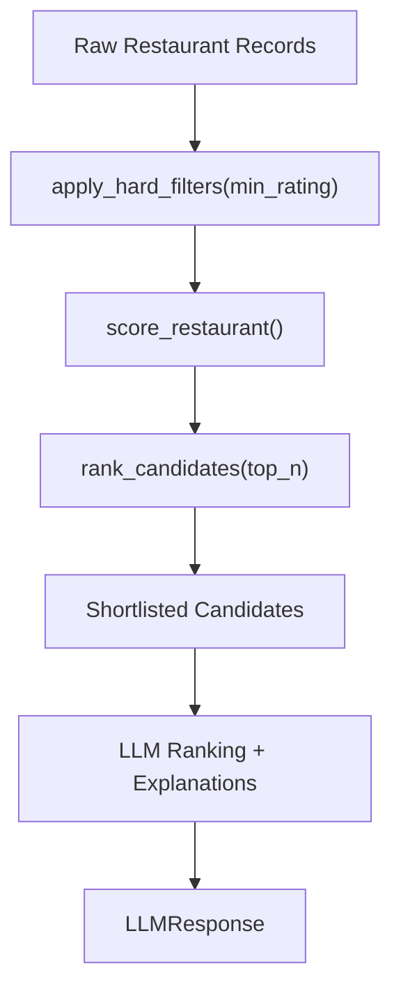

**Diagram sources**
- [engine.py:23-46](file://Zomato/architecture/phase_3_candidate_retrieval/engine.py#L23-L46)
- [engine.py:53-107](file://Zomato/architecture/phase_3_candidate_retrieval/engine.py#L53-L107)
- [engine.py:110-117](file://Zomato/architecture/phase_3_candidate_retrieval/engine.py#L110-L117)

**Section sources**
- [engine.py:23-46](file://Zomato/architecture/phase_3_candidate_retrieval/engine.py#L23-L46)
- [engine.py:53-107](file://Zomato/architecture/phase_3_candidate_retrieval/engine.py#L53-L107)
- [engine.py:110-117](file://Zomato/architecture/phase_3_candidate_retrieval/engine.py#L110-L117)

### Integration with Phase 5 Response Delivery
Phase 5 orchestrator integrates Phase 3 and Phase 4 outputs. It attempts to run the full pipeline and falls back to Phase 3 ranked candidates with synthesized explanations if the LLM call fails. This ensures robustness and consistent output formatting.

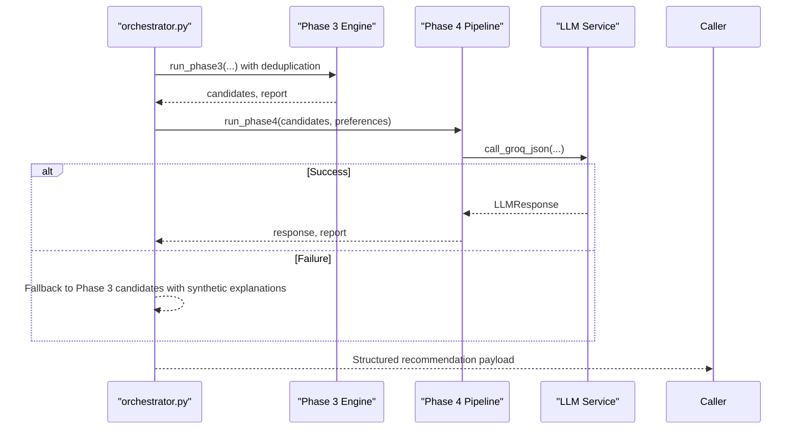

**Diagram sources**
- [orchestrator.py:112-291](file://Zomato/architecture/phase_5_response_delivery/backend/orchestrator.py#L112-L291)

**Section sources**
- [orchestrator.py:112-291](file://Zomato/architecture/phase_5_response_delivery/backend/orchestrator.py#L112-L291)

## Dependency Analysis
The following diagram shows the primary dependencies among Phase 4 components and their integration points.

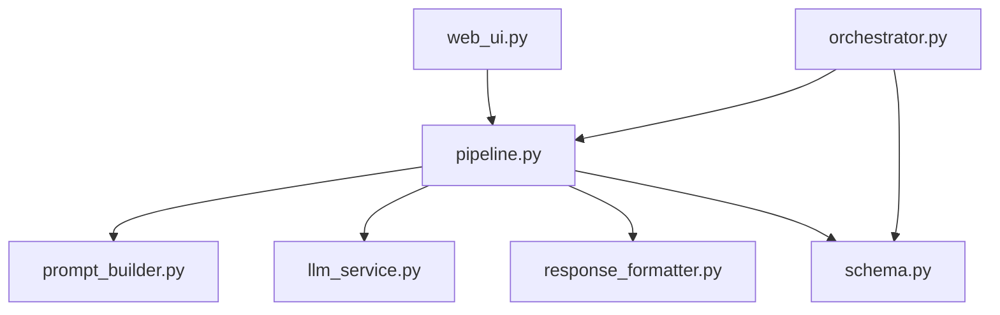

**Diagram sources**
- [schema.py:1-38](file://Zomato/architecture/phase_4_llm_recommendation/schema.py#L1-L38)
- [prompt_builder.py:1-45](file://Zomato/architecture/phase_4_llm_recommendation/prompt_builder.py#L1-L45)
- [llm_service.py:1-43](file://Zomato/architecture/phase_4_llm_recommendation/llm_service.py#L1-L43)
- [response_formatter.py:1-22](file://Zomato/architecture/phase_4_llm_recommendation/response_formatter.py#L1-L22)
- [pipeline.py:1-47](file://Zomato/architecture/phase_4_llm_recommendation/pipeline.py#L1-L47)
- [web_ui.py:1-108](file://Zomato/architecture/phase_4_llm_recommendation/web_ui.py#L1-L108)
- [orchestrator.py:1-292](file://Zomato/architecture/phase_5_response_delivery/backend/orchestrator.py#L1-L292)

**Section sources**
- [pipeline.py:9-12](file://Zomato/architecture/phase_4_llm_recommendation/pipeline.py#L9-L12)
- [web_ui.py:10-11](file://Zomato/architecture/phase_4_llm_recommendation/web_ui.py#L10-L11)
- [orchestrator.py:220-234](file://Zomato/architecture/phase_5_response_delivery/backend/orchestrator.py#L220-L234)

## Performance Considerations
- LLM API latency: The Groq API call is the dominant cost. Consider batching or caching where feasible.
- Prompt size: Large candidate lists increase prompt length and cost. Limit top_n to balance quality and speed.
- Validation overhead: Pydantic validation adds minimal overhead but ensures correctness.
- Frontend rendering: The UI renders raw JSON; consider pagination or truncation for large outputs.

## Troubleshooting Guide
Common issues and resolutions:
- Missing GROQ_API_KEY: The LLM service raises an error if the environment variable is not set. Ensure the key is configured.
- Non-JSON LLM output: The service attempts to isolate JSON by finding the first and last braces. If the model returns non-JSON content, validation will fail. Verify the prompt and model behavior.
- Schema mismatches: Ensure the LLM strictly follows the schema defined in the prompt. Any deviation will cause validation errors.
- Web UI parsing errors: The UI validates incoming JSON payloads. Ensure preferences and candidates conform to the expected schemas.

**Section sources**
- [llm_service.py:20-42](file://Zomato/architecture/phase_4_llm_recommendation/llm_service.py#L20-L42)
- [web_ui.py:16-27](file://Zomato/architecture/phase_4_llm_recommendation/web_ui.py#L16-L27)

## Conclusion
The RankedRecommendation schema provides a concise, validated structure for LLM-generated recommendations. It emphasizes human-readable explanations while preserving essential restaurant details. The system integrates tightly with Phase 3 filtering and scoring, ensuring high-quality inputs to the LLM. Robust validation and fallback mechanisms in Phase 5 guarantee reliable outputs even when the LLM is unavailable.

## Appendices

### Example Recommendation Outputs
Below are example outputs derived from the sample data and schema. These illustrate how recommendations are structured for display and API delivery.

- Sample preferences:
  - Location: Bangalore
  - Budget: medium
  - Cuisines: Italian, Chinese
  - Minimum rating: 4.0
  - Optional preferences: quick-service

- Sample candidates:
  - Pasta Point: Italian, Continental; rating 4.4; cost_for_two 1200; match reasons include cuisine match and budget fit
  - Dragon Wok: Chinese, Thai; rating 4.2; cost_for_two 800; match reasons include cuisine match and budget fit

- Typical recommendation structure:
  - rank: integer
  - restaurant_name: string
  - explanation: string (LLM-generated rationale)
  - rating: float or null
  - cost_for_two: float or null
  - cuisine: string

These examples demonstrate how explanations are tailored to the candidate data and user preferences, and how the final output is formatted for both display and API consumption.

**Section sources**
- [sample_preferences.json:1-8](file://Zomato/architecture/phase_4_llm_recommendation/sample_preferences.json#L1-L8)
- [sample_candidates.json:1-21](file://Zomato/architecture/phase_4_llm_recommendation/sample_candidates.json#L1-L21)
- [schema.py:26-33](file://Zomato/architecture/phase_4_llm_recommendation/schema.py#L26-L33)
- [response_formatter.py:8-21](file://Zomato/architecture/phase_4_llm_recommendation/response_formatter.py#L8-L21)