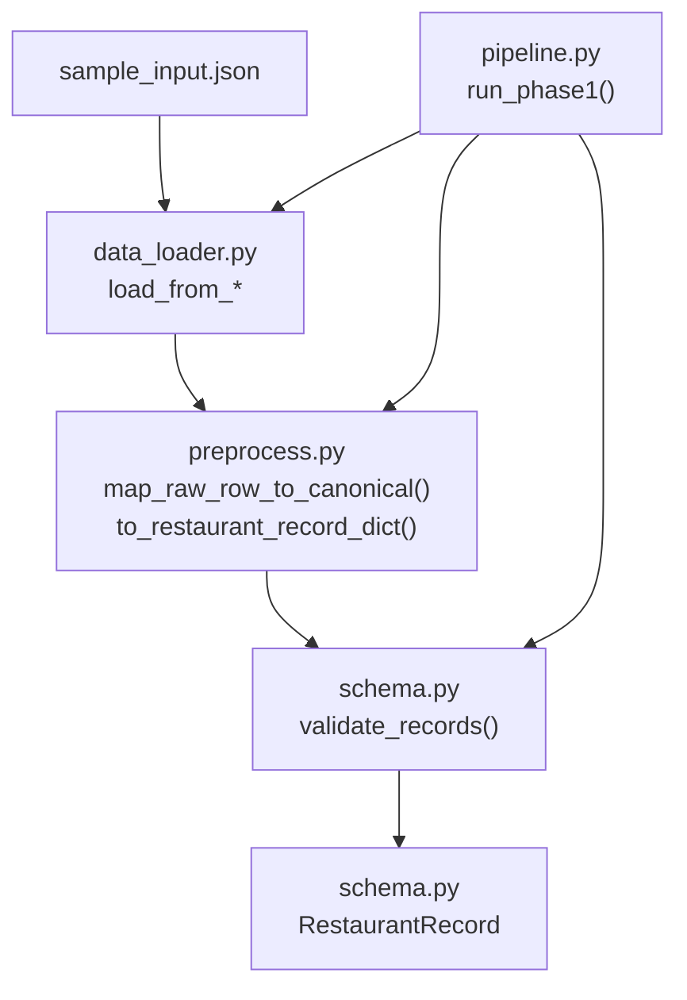
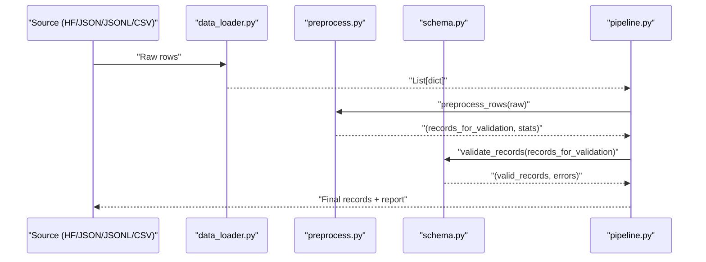
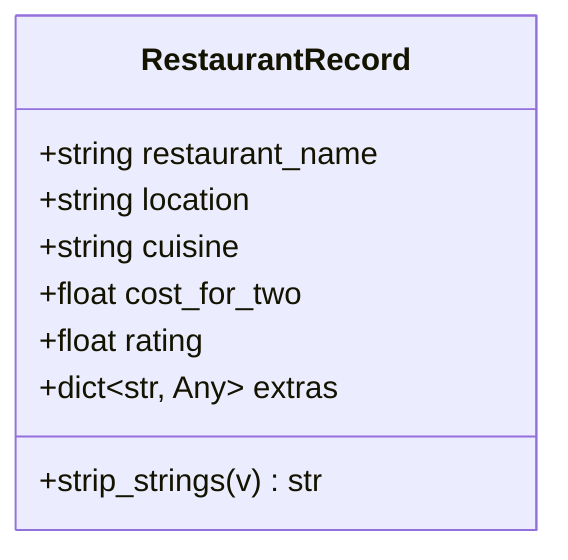
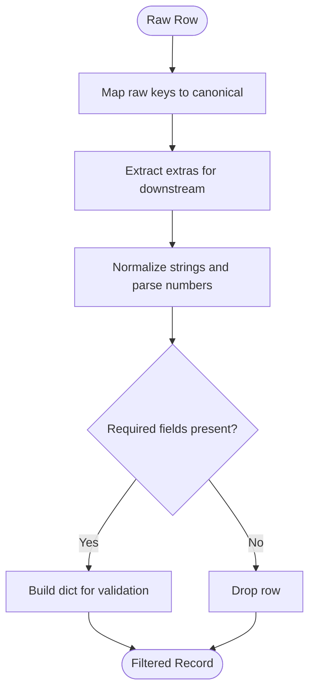
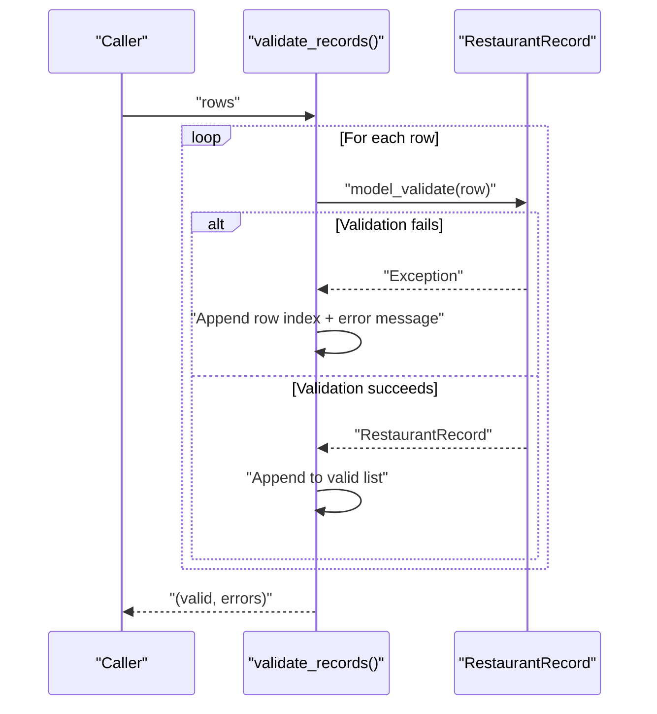
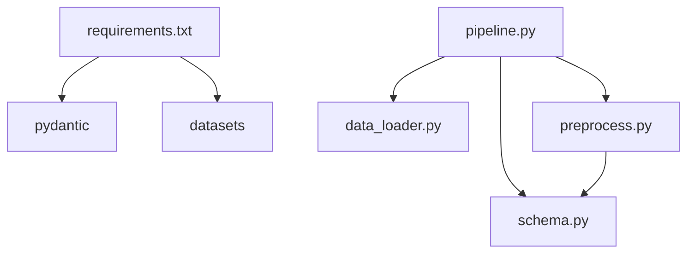

# RestaurantRecord Schema

<cite>
**Referenced Files in This Document**
- [schema.py](file://Zomato/architecture/phase_1_data_foundation/schema.py)
- [preprocess.py](file://Zomato/architecture/phase_1_data_foundation/preprocess.py)
- [data_loader.py](file://Zomato/architecture/phase_1_data_foundation/data_loader.py)
- [pipeline.py](file://Zomato/architecture/phase_1_data_foundation/pipeline.py)
- [sample_input.json](file://Zomato/architecture/phase_1_data_foundation/sample_input.json)
- [requirements.txt](file://Zomato/architecture/phase_1_data_foundation/requirements.txt)
</cite>

## Table of Contents
1. [Introduction](#introduction)
2. [Project Structure](#project-structure)
3. [Core Components](#core-components)
4. [Architecture Overview](#architecture-overview)
5. [Detailed Component Analysis](#detailed-component-analysis)
6. [Dependency Analysis](#dependency-analysis)
7. [Performance Considerations](#performance-considerations)
8. [Troubleshooting Guide](#troubleshooting-guide)
9. [Conclusion](#conclusion)
10. [Appendices](#appendices)

## Introduction
This document describes the RestaurantRecord schema used in Phase 1 Data Foundation. It defines the canonical structure for restaurant records, including field specifications, validation rules, and data transformation logic. It also explains how the strip_strings validator normalizes string inputs, how the extras dictionary preserves raw and normalized attributes for downstream phases, and how the validate_records function validates batches of records. Practical examples demonstrate normalization and validation during data ingestion.

## Project Structure
The Phase 1 Data Foundation module organizes ingestion, preprocessing, validation, and reporting into focused components:
- schema.py: Defines the RestaurantRecord model and validation utilities
- preprocess.py: Normalizes raw fields, maps heterogeneous column names, and builds canonical records
- data_loader.py: Loads raw data from Hugging Face, JSON, JSONL, or CSV sources
- pipeline.py: Orchestrates the end-to-end flow from loading to validation and reporting
- sample_input.json: Example raw input demonstrating heterogeneous column names
- requirements.txt: Declares runtime dependencies

**Diagram sources**
- [data_loader.py:14-78](file://Zomato/architecture/phase_1_data_foundation/data_loader.py#L14-L78)
- [preprocess.py:118-184](file://Zomato/architecture/phase_1_data_foundation/preprocess.py#L118-L184)
- [schema.py:41-54](file://Zomato/architecture/phase_1_data_foundation/schema.py#L41-L54)
- [pipeline.py:21-67](file://Zomato/architecture/phase_1_data_foundation/pipeline.py#L21-L67)
- [sample_input.json:1-14](file://Zomato/architecture/phase_1_data_foundation/sample_input.json#L1-L14)

**Section sources**
- [schema.py:1-54](file://Zomato/architecture/phase_1_data_foundation/schema.py#L1-L54)
- [preprocess.py:1-185](file://Zomato/architecture/phase_1_data_foundation/preprocess.py#L1-L185)
- [data_loader.py:1-78](file://Zomato/architecture/phase_1_data_foundation/data_loader.py#L1-L78)
- [pipeline.py:1-81](file://Zomato/architecture/phase_1_data_foundation/pipeline.py#L1-L81)
- [sample_input.json:1-14](file://Zomato/architecture/phase_1_data_foundation/sample_input.json#L1-L14)
- [requirements.txt:1-4](file://Zomato/architecture/phase_1_data_foundation/requirements.txt#L1-L4)

## Core Components
- RestaurantRecord: Canonical schema for normalized restaurant records
- Preprocessing pipeline: Maps raw columns to canonical fields, normalizes values, and drops incomplete rows
- Validation utility: Validates a batch of dictionaries against the schema and collects errors
- Data loaders: Load raw data from multiple sources
- Pipeline orchestration: Executes the full ingestion flow and produces a report

Key responsibilities:
- Enforce required fields and numeric ranges
- Normalize strings and preserve extras for downstream phases
- Transform heterogeneous raw inputs into a uniform schema

**Section sources**
- [schema.py:10-39](file://Zomato/architecture/phase_1_data_foundation/schema.py#L10-L39)
- [preprocess.py:118-184](file://Zomato/architecture/phase_1_data_foundation/preprocess.py#L118-L184)
- [schema.py:41-54](file://Zomato/architecture/phase_1_data_foundation/schema.py#L41-L54)
- [data_loader.py:14-78](file://Zomato/architecture/phase_1_data_foundation/data_loader.py#L14-L78)
- [pipeline.py:21-67](file://Zomato/architecture/phase_1_data_foundation/pipeline.py#L21-L67)

## Architecture Overview
The ingestion pipeline transforms raw, heterogeneous restaurant data into a standardized, validated form. The flow is:
- Load raw data from a chosen source
- Map and normalize fields, parse ratings/costs, and build extras
- Drop rows missing required fields after normalization
- Validate remaining records against the schema
- Produce a report summarizing preprocessing and validation outcomes

**Diagram sources**
- [data_loader.py:14-78](file://Zomato/architecture/phase_1_data_foundation/data_loader.py#L14-L78)
- [preprocess.py:169-184](file://Zomato/architecture/phase_1_data_foundation/preprocess.py#L169-L184)
- [schema.py:41-54](file://Zomato/architecture/phase_1_data_foundation/schema.py#L41-L54)
- [pipeline.py:21-67](file://Zomato/architecture/phase_1_data_foundation/pipeline.py#L21-L67)

## Detailed Component Analysis

### RestaurantRecord Model
RestaurantRecord defines the canonical schema for Phase 1 Data Foundation. It enforces:
- Required fields: restaurant_name, location, cuisine
- Optional numeric fields: cost_for_two (float), rating (float, 0.0–5.0)
- Optional extras: dict preserving additional attributes for downstream phases
- String normalization: strip_strings validator trims and normalizes strings before validation
- Strict schema: extra fields are forbidden

Field definitions and constraints:
- restaurant_name: string, required, min_length=1
- location: string, required, min_length=1
- cuisine: string, required, min_length=1
- cost_for_two: float | None
- rating: float | None, constrained to [0.0, 5.0]
- extras: dict[str, Any], default empty

Validation rules:
- Required fields must be present and non-empty after normalization
- rating must be within [0.0, 5.0]
- No extra fields are allowed beyond the schema

String normalization:
- The strip_strings validator converts values to strings and strips leading/trailing whitespace
- None values become empty strings

Extras preservation:
- The extras dictionary captures raw and normalized attributes not part of the canonical schema
- These attributes are preserved for downstream phases (e.g., preference capture, candidate retrieval)

**Diagram sources**
- [schema.py:10-39](file://Zomato/architecture/phase_1_data_foundation/schema.py#L10-L39)

**Section sources**
- [schema.py:10-39](file://Zomato/architecture/phase_1_data_foundation/schema.py#L10-L39)

### Preprocessing and Normalization
Preprocessing transforms raw, heterogeneous inputs into canonical fields and prepares them for validation:
- Column alias mapping: Names, locations, cuisines, ratings, and costs are mapped from various raw keys
- Extras extraction: Any raw keys not part of canonical fields are moved into extras
- String normalization: Whitespace is normalized; names and locations are normalized; cuisines are title-cased and comma-separated
- Numeric parsing: Ratings support formats like "X.Y/5" and rare 10-scale values; costs remove commas and extract digits
- Incomplete-row filtering: Rows missing required fields after normalization are dropped

Key functions:
- map_raw_row_to_canonical: Maps raw keys to canonical keys and extracts extras
- to_restaurant_record_dict: Builds a dict suitable for RestaurantRecord.model_validate
- preprocess_rows: Full pass over raw rows, returning filtered records and statistics

**Diagram sources**
- [preprocess.py:118-184](file://Zomato/architecture/phase_1_data_foundation/preprocess.py#L118-L184)

**Section sources**
- [preprocess.py:8-50](file://Zomato/architecture/phase_1_data_foundation/preprocess.py#L8-L50)
- [preprocess.py:118-184](file://Zomato/architecture/phase_1_data_foundation/preprocess.py#L118-L184)

### Validation and Error Handling
The validate_records function validates a list of dictionaries against RestaurantRecord:
- Iterates over rows and attempts model_validate for each
- Collects exceptions as human-readable messages with row indices
- Returns a tuple of valid records and error messages

Error handling patterns:
- Exceptions are caught and aggregated; processing continues for remaining rows
- The pipeline includes a validation report with counts and sample errors

**Diagram sources**
- [schema.py:41-54](file://Zomato/architecture/phase_1_data_foundation/schema.py#L41-L54)

**Section sources**
- [schema.py:41-54](file://Zomato/architecture/phase_1_data_foundation/schema.py#L41-L54)
- [pipeline.py:58-67](file://Zomato/architecture/phase_1_data_foundation/pipeline.py#L58-L67)

### Data Ingestion Examples
Practical examples show how normalization and validation work during ingestion:

- Example 1: Valid record
  - Raw input uses "Restaurant Name", "City", "Cuisines", "Aggregate rating", "Average Cost for two"
  - After preprocessing: required fields are populated; extras may include additional raw attributes
  - After validation: passes schema checks

- Example 2: Incomplete record
  - Raw input includes only "name" and "City"
  - After preprocessing: required field "cuisine" is missing after normalization
  - Result: row is dropped during preprocessing; not included in validation

These examples illustrate:
- How heterogeneous column names are mapped to canonical fields
- How normalization handles whitespace and mixed casing
- How missing required fields lead to row exclusion
- How extras preserve original attributes for downstream use

**Section sources**
- [sample_input.json:1-14](file://Zomato/architecture/phase_1_data_foundation/sample_input.json#L1-L14)
- [preprocess.py:118-184](file://Zomato/architecture/phase_1_data_foundation/preprocess.py#L118-L184)

## Dependency Analysis
Runtime dependencies include pydantic for schema validation and datasets for loading Hugging Face datasets. The pipeline depends on preprocess and schema modules, while data_loader provides multiple input sources.

**Diagram sources**
- [requirements.txt:1-4](file://Zomato/architecture/phase_1_data_foundation/requirements.txt#L1-L4)
- [pipeline.py:9-18](file://Zomato/architecture/phase_1_data_foundation/pipeline.py#L9-L18)

**Section sources**
- [requirements.txt:1-4](file://Zomato/architecture/phase_1_data_foundation/requirements.txt#L1-L4)
- [pipeline.py:9-18](file://Zomato/architecture/phase_1_data_foundation/pipeline.py#L9-L18)

## Performance Considerations
- Preprocessing filters incomplete rows early, reducing downstream validation overhead
- Streaming loads (when available) can reduce memory usage for large datasets
- Regex-based parsing for ratings and costs is efficient but should be tuned if performance becomes critical
- Aggregating validation errors avoids partial failures and simplifies debugging

## Troubleshooting Guide
Common issues and resolutions:
- Missing required fields after normalization
  - Cause: Raw data lacks canonical fields or values are empty/whitespace-only
  - Resolution: Ensure raw data includes "Restaurant Name", "City", and "Cuisines" with non-empty values
- Rating out of range
  - Cause: Rating exceeds 5.0 or is negative
  - Resolution: Provide ratings within [0.0, 5.0]; note that rare 10-scale values are automatically scaled down
- Extra fields rejected
  - Cause: Additional fields not part of the schema
  - Resolution: Move unexpected fields into extras; only canonical fields are allowed at top level
- Validation errors collection
  - Use the validation report to inspect error counts and sample messages for quick diagnosis

**Section sources**
- [schema.py:38](file://Zomato/architecture/phase_1_data_foundation/schema.py#L38)
- [schema.py:41-54](file://Zomato/architecture/phase_1_data_foundation/schema.py#L41-L54)
- [pipeline.py:61-67](file://Zomato/architecture/phase_1_data_foundation/pipeline.py#L61-L67)

## Conclusion
The RestaurantRecord schema provides a strict, normalized representation of restaurant data for Phase 1. It enforces required fields, constrains numeric ranges, and preserves additional attributes in extras for downstream phases. The preprocessing pipeline maps heterogeneous inputs to canonical forms, while the validation utility ensures data quality. Together, these components create a robust foundation for subsequent phases of the system.

## Appendices

### Field Reference
- restaurant_name: string, required, min_length=1
- location: string, required, min_length=1
- cuisine: string, required, min_length=1
- cost_for_two: float | None
- rating: float | None, constrained to [0.0, 5.0]
- extras: dict[str, Any], default empty

### Validation Rules Summary
- Required fields must be present and non-empty after normalization
- rating must be within [0.0, 5.0]
- No extra fields are allowed beyond the schema
- String normalization trims whitespace and converts values to strings

### Extras Preservation Strategy
- During preprocessing, raw keys not part of canonical fields are moved into extras
- Extras are preserved in the final record for downstream phases
- This strategy enables flexible extension of the schema without breaking changes

**Section sources**
- [schema.py:13-29](file://Zomato/architecture/phase_1_data_foundation/schema.py#L13-L29)
- [preprocess.py:126-142](file://Zomato/architecture/phase_1_data_foundation/preprocess.py#L126-L142)
- [preprocess.py:159-166](file://Zomato/architecture/phase_1_data_foundation/preprocess.py#L159-L166)