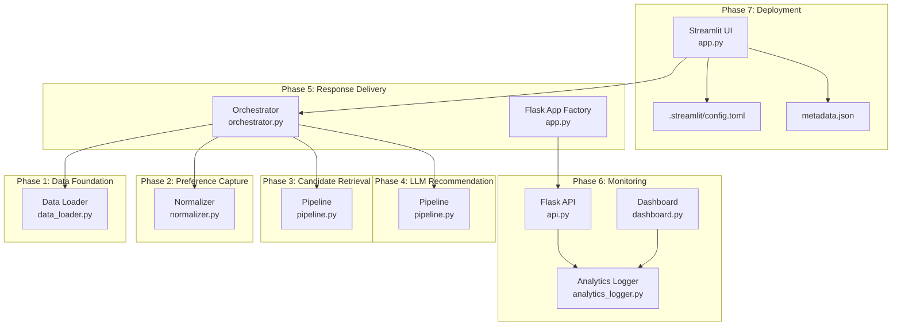
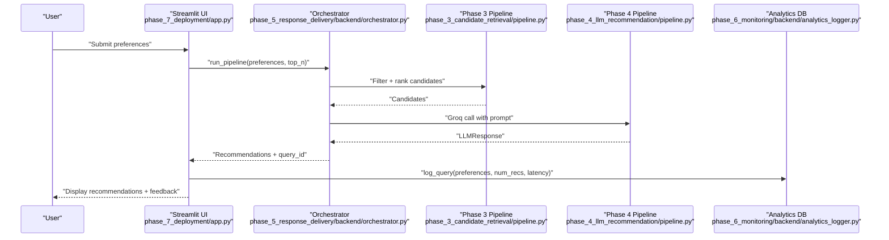
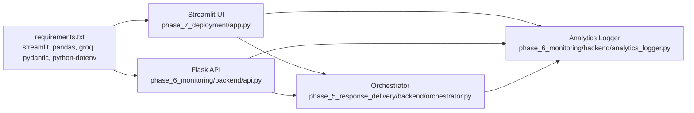

# Deployment and Operations

<cite>
**Referenced Files in This Document**
- [app.py](file://Zomato/architecture/phase_7_deployment/app.py)
- [requirements.txt](file://Zomato/architecture/phase_7_deployment/requirements.txt)
- [.streamlit/config.toml](file://Zomato/architecture/phase_7_deployment/.streamlit/config.toml)
- [metadata.json](file://Zomato/architecture/phase_7_deployment/metadata.json)
- [app.py](file://Zomato/architecture/phase_5_response_delivery/backend/app.py)
- [orchestrator.py](file://Zomato/architecture/phase_5_response_delivery/backend/orchestrator.py)
- [api.py](file://Zomato/architecture/phase_6_monitoring/backend/api.py)
- [analytics_logger.py](file://Zomato/architecture/phase_6_monitoring/backend/analytics_logger.py)
- [dashboard.py](file://Zomato/architecture/phase_6_monitoring/dashboard/dashboard.py)
- [pipeline.py](file://Zomato/architecture/phase_4_llm_recommendation/pipeline.py)
- [pipeline.py](file://Zomato/architecture/phase_3_candidate_retrieval/pipeline.py)
- [normalizer.py](file://Zomato/architecture/phase_2_preference_capture/normalizer.py)
- [data_loader.py](file://Zomato/architecture/phase_1_data_foundation/data_loader.py)
</cite>

## Table of Contents
1. [Introduction](#introduction)
2. [Project Structure](#project-structure)
3. [Core Components](#core-components)
4. [Architecture Overview](#architecture-overview)
5. [Detailed Component Analysis](#detailed-component-analysis)
6. [Dependency Analysis](#dependency-analysis)
7. [Performance Considerations](#performance-considerations)
8. [Troubleshooting Guide](#troubleshooting-guide)
9. [Conclusion](#conclusion)
10. [Appendices](#appendices)

## Introduction
This document provides comprehensive deployment and operations guidance for the Zomato AI Recommendation System. It covers production deployment strategies for Streamlit applications, environment configuration management, operational maintenance, and monitoring. It includes step-by-step deployment guides for Streamlit Cloud, Heroku, and Docker containers, along with environment variable configuration, dependency management, security considerations, monitoring and logging, backups and disaster recovery, scaling and load balancing, performance optimization, troubleshooting, rollback procedures, and operational checklists.

## Project Structure
The system is organized into seven integrated phases:
- Phase 1: Data Foundation (dataset ingestion and preparation)
- Phase 2: Preference Capture (input normalization)
- Phase 3: Candidate Retrieval (filtering and ranking)
- Phase 4: LLM Recommendation (Groq-powered ranking)
- Phase 5: Response Delivery (Flask API and SPA frontend)
- Phase 6: Monitoring (analytics logger, REST API, and Streamlit dashboard)
- Phase 7: Deployment (Streamlit UI and runtime configuration)

**Diagram sources**
- [app.py:1-123](file://Zomato/architecture/phase_7_deployment/app.py#L1-L123)
- [.streamlit/config.toml:1-7](file://Zomato/architecture/phase_7_deployment/.streamlit/config.toml#L1-L7)
- [metadata.json:1-196](file://Zomato/architecture/phase_7_deployment/metadata.json#L1-L196)
- [app.py:1-41](file://Zomato/architecture/phase_5_response_delivery/backend/app.py#L1-L41)
- [orchestrator.py:1-292](file://Zomato/architecture/phase_5_response_delivery/backend/orchestrator.py#L1-L292)
- [api.py:1-119](file://Zomato/architecture/phase_6_monitoring/backend/api.py#L1-L119)
- [analytics_logger.py:1-87](file://Zomato/architecture/phase_6_monitoring/backend/analytics_logger.py#L1-L87)
- [dashboard.py:1-102](file://Zomato/architecture/phase_6_monitoring/dashboard/dashboard.py#L1-L102)
- [pipeline.py:1-47](file://Zomato/architecture/phase_4_llm_recommendation/pipeline.py#L1-L47)
- [pipeline.py:1-51](file://Zomato/architecture/phase_3_candidate_retrieval/pipeline.py#L1-L51)
- [normalizer.py:1-91](file://Zomato/architecture/phase_2_preference_capture/normalizer.py#L1-L91)
- [data_loader.py:1-78](file://Zomato/architecture/phase_1_data_foundation/data_loader.py#L1-L78)

**Section sources**
- [app.py:1-123](file://Zomato/architecture/phase_7_deployment/app.py#L1-L123)
- [requirements.txt:1-6](file://Zomato/architecture/phase_7_deployment/requirements.txt#L1-L6)
- [.streamlit/config.toml:1-7](file://Zomato/architecture/phase_7_deployment/.streamlit/config.toml#L1-L7)
- [metadata.json:1-196](file://Zomato/architecture/phase_7_deployment/metadata.json#L1-L196)
- [app.py:1-41](file://Zomato/architecture/phase_5_response_delivery/backend/app.py#L1-L41)
- [orchestrator.py:1-292](file://Zomato/architecture/phase_5_response_delivery/backend/orchestrator.py#L1-L292)
- [api.py:1-119](file://Zomato/architecture/phase_6_monitoring/backend/api.py#L1-L119)
- [analytics_logger.py:1-87](file://Zomato/architecture/phase_6_monitoring/backend/analytics_logger.py#L1-L87)
- [dashboard.py:1-102](file://Zomato/architecture/phase_6_monitoring/dashboard/dashboard.py#L1-L102)
- [pipeline.py:1-47](file://Zomato/architecture/phase_4_llm_recommendation/pipeline.py#L1-L47)
- [pipeline.py:1-51](file://Zomato/architecture/phase_3_candidate_retrieval/pipeline.py#L1-L51)
- [normalizer.py:1-91](file://Zomato/architecture/phase_2_preference_capture/normalizer.py#L1-L91)
- [data_loader.py:1-78](file://Zomato/architecture/phase_1_data_foundation/data_loader.py#L1-L78)

## Core Components
- Streamlit UI (Phase 7): Single-page application with preference capture, orchestration, and feedback logging.
- Flask API (Phase 5): REST endpoints for health checks, metadata, recommendations, and feedback.
- Orchestrator (Phase 5): Coordinates candidate retrieval and LLM ranking, with fallback behavior.
- Analytics Logger (Phase 6): SQLite-backed persistence for queries and feedback.
- Dashboard (Phase 6): Streamlit analytics dashboard for metrics and trends.
- LLM Pipeline (Phase 4): Prompt building, Groq API call, and response formatting.
- Candidate Retrieval Pipeline (Phase 3): Filtering, deduplication, and ranking.
- Normalizer (Phase 2): Canonicalization of user preferences.
- Data Loader (Phase 1): Dataset ingestion from Hugging Face or local files.

Key runtime dependencies and configuration:
- Streamlit application with custom theme configuration.
- Environment variables for external services (e.g., Groq API key).
- Local metadata and SQLite database for analytics.

**Section sources**
- [app.py:1-123](file://Zomato/architecture/phase_7_deployment/app.py#L1-L123)
- [.streamlit/config.toml:1-7](file://Zomato/architecture/phase_7_deployment/.streamlit/config.toml#L1-L7)
- [metadata.json:1-196](file://Zomato/architecture/phase_7_deployment/metadata.json#L1-L196)
- [app.py:1-41](file://Zomato/architecture/phase_5_response_delivery/backend/app.py#L1-L41)
- [orchestrator.py:1-292](file://Zomato/architecture/phase_5_response_delivery/backend/orchestrator.py#L1-L292)
- [api.py:1-119](file://Zomato/architecture/phase_6_monitoring/backend/api.py#L1-L119)
- [analytics_logger.py:1-87](file://Zomato/architecture/phase_6_monitoring/backend/analytics_logger.py#L1-L87)
- [dashboard.py:1-102](file://Zomato/architecture/phase_6_monitoring/dashboard/dashboard.py#L1-L102)
- [pipeline.py:1-47](file://Zomato/architecture/phase_4_llm_recommendation/pipeline.py#L1-L47)
- [pipeline.py:1-51](file://Zomato/architecture/phase_3_candidate_retrieval/pipeline.py#L1-L51)
- [normalizer.py:1-91](file://Zomato/architecture/phase_2_preference_capture/normalizer.py#L1-L91)
- [data_loader.py:1-78](file://Zomato/architecture/phase_1_data_foundation/data_loader.py#L1-L78)

## Architecture Overview
The system integrates a Streamlit UI for user interaction with a Flask API backend. The backend orchestrates data retrieval, candidate filtering/ranking, and LLM-based recommendation, returning structured results to the UI. Analytics are captured and persisted for operational insights and continuous improvement.

**Diagram sources**
- [app.py:77-123](file://Zomato/architecture/phase_7_deployment/app.py#L77-L123)
- [orchestrator.py:112-292](file://Zomato/architecture/phase_5_response_delivery/backend/orchestrator.py#L112-L292)
- [pipeline.py:24-51](file://Zomato/architecture/phase_3_candidate_retrieval/pipeline.py#L24-L51)
- [pipeline.py:29-47](file://Zomato/architecture/phase_4_llm_recommendation/pipeline.py#L29-L47)
- [analytics_logger.py:46-70](file://Zomato/architecture/phase_6_monitoring/backend/analytics_logger.py#L46-L70)

## Detailed Component Analysis

### Streamlit UI (Phase 7)
- Purpose: Single-page user interface for capturing preferences, invoking the orchestrator, and displaying recommendations with feedback.
- Key behaviors:
  - Loads metadata from a JSON file or orchestrator fallback.
  - Normalizes budget and cuisines selection.
  - Invokes orchestrator.run_pipeline and logs query with analytics.
  - Provides feedback buttons to record likes/dislikes.

Operational notes:
- Uses a custom theme via .streamlit/config.toml.
- Reads metadata.json for locations and cuisines.
- On errors, displays a user-friendly message and logs the exception.

**Section sources**
- [app.py:1-123](file://Zomato/architecture/phase_7_deployment/app.py#L1-L123)
- [.streamlit/config.toml:1-7](file://Zomato/architecture/phase_7_deployment/.streamlit/config.toml#L1-L7)
- [metadata.json:1-196](file://Zomato/architecture/phase_7_deployment/metadata.json#L1-L196)

### Flask API (Phase 5)
- Purpose: Exposes REST endpoints for health checks, metadata, recommendations, and feedback.
- Endpoints:
  - GET /api/health: Health status.
  - GET /api/sample: Prebuilt sample recommendations.
  - GET /api/metadata: Locations and cuisines.
  - POST /api/recommend: Runs the pipeline and returns recommendations with injected query_id.
  - POST /api/analytics/feedback: Records user feedback.

Operational notes:
- Validates request bodies and returns structured errors.
- Integrates with the orchestrator and analytics logger.

**Section sources**
- [app.py:1-41](file://Zomato/architecture/phase_5_response_delivery/backend/app.py#L1-L41)
- [api.py:1-119](file://Zomato/architecture/phase_6_monitoring/backend/api.py#L1-L119)

### Orchestrator (Phase 5)
- Purpose: End-to-end pipeline coordinator.
- Responsibilities:
  - Resolve dataset path and load restaurants.
  - Invoke Phase 3 pipeline for filtering/ranking.
  - Load environment variables (e.g., Groq API key) and invoke Phase 4 pipeline.
  - Fallback to sample recommendations when data or API keys are unavailable.
  - Return structured results with source attribution.

Operational notes:
- Dynamically imports sibling phase modules to ensure fresh state per invocation.
- Logs latency and query metadata for analytics.

**Section sources**
- [orchestrator.py:1-292](file://Zomato/architecture/phase_5_response_delivery/backend/orchestrator.py#L1-L292)

### Analytics Logger (Phase 6)
- Purpose: Persist user queries and feedback in an SQLite database.
- Schema:
  - queries: query_id, timestamp, location, budget, cuisines, min_rating, optional_preferences, num_recommendations, latency_ms.
  - feedback: id, query_id, timestamp, restaurant_name, feedback_type.
- Initialization: Creates tables on import.

Operational notes:
- Centralized for both Streamlit UI and API feedback.
- Dashboard reads analytics for reporting.

**Section sources**
- [analytics_logger.py:1-87](file://Zomato/architecture/phase_6_monitoring/backend/analytics_logger.py#L1-L87)

### Dashboard (Phase 6)
- Purpose: Operational dashboard for analytics.
- Features:
  - Metrics: total queries, average latency, total feedback, like ratio.
  - Trends: hourly queries and feedback distribution.
  - Problematic recommendations: dislikes joined with original queries.
  - Recent queries table.

Operational notes:
- Requires analytics.db to exist; otherwise, instructs to run backend and submit a query.

**Section sources**
- [dashboard.py:1-102](file://Zomato/architecture/phase_6_monitoring/dashboard/dashboard.py#L1-L102)

### LLM Pipeline (Phase 4)
- Purpose: Build prompts, call Groq, and format responses.
- Inputs: PreferencesInput and CandidateInput pydantic models.
- Outputs: LLMResponse and a preview report.

Operational notes:
- Requires GROQ_API_KEY via environment configuration.
- Uses python-dotenv for local development.

**Section sources**
- [pipeline.py:1-47](file://Zomato/architecture/phase_4_llm_recommendation/pipeline.py#L1-L47)

### Candidate Retrieval Pipeline (Phase 3)
- Purpose: Filter and rank candidates based on user preferences.
- Features:
  - Hard filters and deduplication by restaurant name and location.
  - Ranking and reporting counts.

Operational notes:
- Validates inputs using Pydantic models.

**Section sources**
- [pipeline.py:1-51](file://Zomato/architecture/phase_3_candidate_retrieval/pipeline.py#L1-L51)

### Preference Normalizer (Phase 2)
- Purpose: Normalize raw inputs into canonical fields.
- Features:
  - Budget normalization (maps synonyms to low/medium/high).
  - Rating parsing and clamping.
  - Optional preferences inference from free text.

**Section sources**
- [normalizer.py:1-91](file://Zomato/architecture/phase_2_preference_capture/normalizer.py#L1-L91)

### Data Loader (Phase 1)
- Purpose: Load datasets from Hugging Face or local files (JSON/JSONL/CSV).
- Features:
  - Streaming and non-streaming modes.
  - Validation of input formats.

**Section sources**
- [data_loader.py:1-78](file://Zomato/architecture/phase_1_data_foundation/data_loader.py#L1-L78)

## Dependency Analysis
Runtime dependencies are declared in the Phase 7 requirements file. The Streamlit UI imports the orchestrator and analytics logger from the monitoring backend package. The Flask API imports the orchestrator and analytics logger. The orchestrator dynamically imports sibling phase modules.

**Diagram sources**
- [requirements.txt:1-6](file://Zomato/architecture/phase_7_deployment/requirements.txt#L1-L6)
- [app.py:1-18](file://Zomato/architecture/phase_7_deployment/app.py#L1-L18)
- [api.py:1-14](file://Zomato/architecture/phase_6_monitoring/backend/api.py#L1-L14)
- [orchestrator.py:1-20](file://Zomato/architecture/phase_5_response_delivery/backend/orchestrator.py#L1-L20)
- [analytics_logger.py:1-11](file://Zomato/architecture/phase_6_monitoring/backend/analytics_logger.py#L1-L11)

**Section sources**
- [requirements.txt:1-6](file://Zomato/architecture/phase_7_deployment/requirements.txt#L1-L6)
- [app.py:1-18](file://Zomato/architecture/phase_7_deployment/app.py#L1-L18)
- [api.py:1-14](file://Zomato/architecture/phase_6_monitoring/backend/api.py#L1-L14)
- [orchestrator.py:1-20](file://Zomato/architecture/phase_5_response_delivery/backend/orchestrator.py#L1-L20)
- [analytics_logger.py:1-11](file://Zomato/architecture/phase_6_monitoring/backend/analytics_logger.py#L1-L11)

## Performance Considerations
- Cold starts: Streamlit apps may experience cold starts; consider keeping the app warm via scheduled health checks or platform-specific keep-alive mechanisms.
- LLM latency: Groq API latency contributes significantly to end-to-end latency; monitor and alert on increased latencies.
- Data loading: Prefer preprocessed datasets in JSONL format for faster ingestion; ensure dataset availability to avoid fallbacks.
- Caching: Orchestrator clears module caches per invocation to ensure freshness; balance this against repeated import overhead.
- Frontend rendering: Large recommendation lists can increase client-side rendering time; consider pagination or virtualization.
- Database I/O: Analytics writes are lightweight; ensure filesystem durability and appropriate disk performance for SQLite.

[No sources needed since this section provides general guidance]

## Troubleshooting Guide
Common issues and resolutions:
- Missing GROQ_API_KEY:
  - Symptom: Runtime error indicating missing API key during Phase 4.
  - Resolution: Set GROQ_API_KEY in environment variables.
- No Phase 1 dataset found:
  - Symptom: Fallback to sample recommendations.
  - Resolution: Place a JSONL dataset in the expected output directory or supply metadata.json with locations/cuisines.
- Analytics database not found:
  - Symptom: Dashboard reports database not found.
  - Resolution: Run the backend to initialize the database and submit a query.
- Streamlit UI errors:
  - Symptom: Error messages displayed in the UI.
  - Resolution: Review logs and ensure orchestrator and analytics modules are importable.
- CORS issues (if serving SPA separately):
  - Symptom: Browser console errors related to cross-origin requests.
  - Resolution: Enable CORS in the Flask app factory.

**Section sources**
- [orchestrator.py:209-214](file://Zomato/architecture/phase_5_response_delivery/backend/orchestrator.py#L209-L214)
- [analytics_logger.py:13-44](file://Zomato/architecture/phase_6_monitoring/backend/analytics_logger.py#L13-L44)
- [dashboard.py:11-15](file://Zomato/architecture/phase_6_monitoring/dashboard/dashboard.py#L11-L15)
- [app.py:120-123](file://Zomato/architecture/phase_7_deployment/app.py#L120-L123)

## Conclusion
This guide outlines a production-ready deployment and operations strategy for the Zomato AI Recommendation System. It emphasizes environment configuration, dependency management, monitoring, and resilience through fallbacks. By following the deployment steps, operational checklists, and troubleshooting procedures, teams can maintain a reliable, scalable, and observable system.

[No sources needed since this section summarizes without analyzing specific files]

## Appendices

### A. Production Deployment Strategies

- Streamlit Cloud
  - Prepare repository with requirements.txt and .streamlit/config.toml.
  - Add environment variables (e.g., GROQ_API_KEY) in the platform’s settings.
  - Commit metadata.json and ensure the app entrypoint points to the Streamlit UI.
  - Configure auto-deploy from the main branch and enable SSL.

- Heroku
  - Create a Procfile to run the Streamlit app.
  - Set environment variables in Heroku config vars.
  - Pin Python version and install dependencies via requirements.txt.
  - Use release phase to initialize analytics database if needed.

- Docker Containers
  - Base image: python:3.x-slim.
  - Install dependencies from requirements.txt.
  - Copy application code and assets (metadata.json, .streamlit).
  - Expose port 8501 for Streamlit.
  - Set environment variables at container runtime.
  - Mount persistent volume for analytics.db if needed.

[No sources needed since this section provides general guidance]

### B. Environment Variable Configuration
- GROQ_API_KEY: Required for Phase 4 LLM ranking.
- Optional: PORT, HOST, and other Streamlit/Flask settings via environment variables.

**Section sources**
- [orchestrator.py:209-214](file://Zomato/architecture/phase_5_response_delivery/backend/orchestrator.py#L209-L214)

### C. Dependency Management
- requirements.txt defines core dependencies for the Streamlit UI.
- Ensure compatibility across Python versions and avoid conflicting versions.

**Section sources**
- [requirements.txt:1-6](file://Zomato/architecture/phase_7_deployment/requirements.txt#L1-L6)

### D. Security Considerations
- Restrict access to analytics database and logs.
- Use HTTPS/TLS termination at the platform level.
- Store secrets (e.g., GROQ_API_KEY) in platform-managed secret stores.
- Sanitize logs to avoid leaking sensitive data.

[No sources needed since this section provides general guidance]

### E. Monitoring Setup and Log Management
- Health endpoints: Use GET /api/health for uptime checks.
- Metrics: Track query count, average latency, and feedback ratios via the dashboard.
- Logging: Streamlit UI prints exceptions; integrate structured logging for production.

**Section sources**
- [api.py:20-24](file://Zomato/architecture/phase_6_monitoring/backend/api.py#L20-L24)
- [dashboard.py:39-51](file://Zomato/architecture/phase_6_monitoring/dashboard/dashboard.py#L39-L51)

### F. Backup Procedures and Disaster Recovery
- Back up analytics.db regularly to durable storage.
- Version metadata.json and dataset files; maintain checksums.
- Document restore procedures for database and configuration files.

[No sources needed since this section provides general guidance]

### G. Scaling and Load Balancing
- Horizontal scaling: Deploy multiple instances behind a load balancer.
- Stateless design: Ensure the Streamlit app remains stateless; persist state externally (analytics DB).
- CDN: Serve static assets (CSS/JS) via CDN if hosting SPA separately.

[No sources needed since this section provides general guidance]

### H. Performance Optimization Checklist
- Preprocess datasets and cache metadata.
- Minimize LLM calls by tuning top_n and prompt length.
- Monitor and alert on latency thresholds.
- Optimize database queries and indexing if schema grows.

[No sources needed since this section provides general guidance]

### I. Rollback Procedures
- Tag releases with Git tags.
- Maintain previous container images and environment configurations.
- Revert to last known good commit and redeploy.

[No sources needed since this section provides general guidance]

### J. Operational Checklists
- Daily: Verify /api/health, confirm analytics.db growth, review recent queries.
- Weekly: Audit feedback ratios, investigate dislikes, tune prompts/phases.
- Monthly: Rotate secrets, update dependencies, review SLIs/SLOs.

[No sources needed since this section provides general guidance]