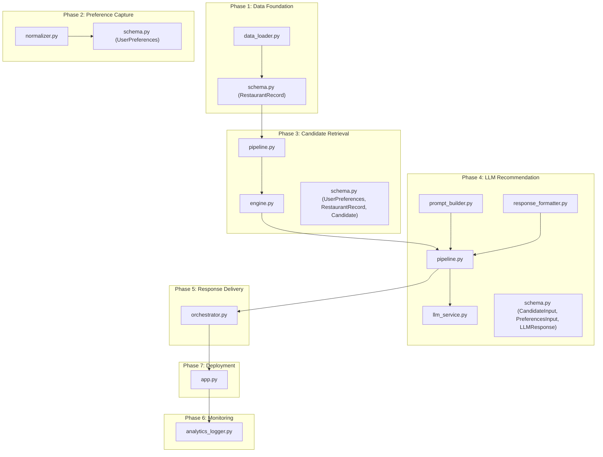
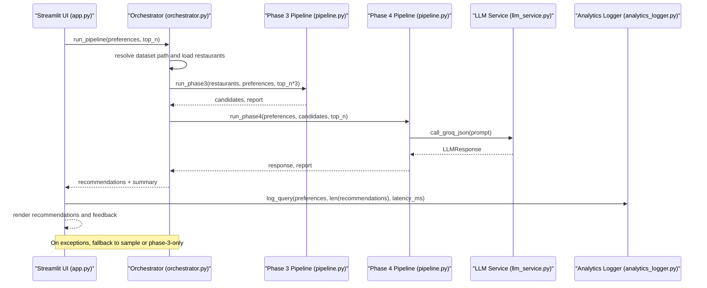
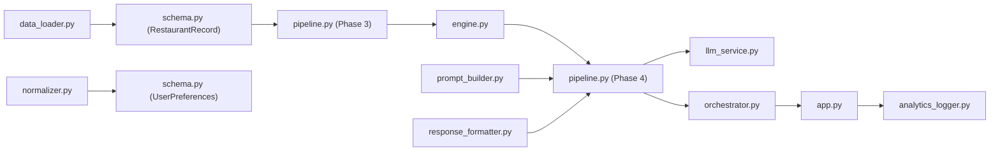

# Edge Cases and Error Handling

<cite>
**Referenced Files in This Document**
- [data_loader.py](file://Zomato/architecture/phase_1_data_foundation/data_loader.py)
- [schema.py](file://Zomato/architecture/phase_1_data_foundation/schema.py)
- [normalizer.py](file://Zomato/architecture/phase_2_preference_capture/normalizer.py)
- [schema.py](file://Zomato/architecture/phase_2_preference_capture/schema.py)
- [engine.py](file://Zomato/architecture/phase_3_candidate_retrieval/engine.py)
- [pipeline.py](file://Zomato/architecture/phase_3_candidate_retrieval/pipeline.py)
- [schema.py](file://Zomato/architecture/phase_3_candidate_retrieval/schema.py)
- [llm_service.py](file://Zomato/architecture/phase_4_llm_recommendation/llm_service.py)
- [pipeline.py](file://Zomato/architecture/phase_4_llm_recommendation/pipeline.py)
- [prompt_builder.py](file://Zomato/architecture/phase_4_llm_recommendation/prompt_builder.py)
- [response_formatter.py](file://Zomato/architecture/phase_4_llm_recommendation/response_formatter.py)
- [schema.py](file://Zomato/architecture/phase_4_llm_recommendation/schema.py)
- [orchestrator.py](file://Zomato/architecture/phase_5_response_delivery/backend/orchestrator.py)
- [app.py](file://Zomato/architecture/phase_7_deployment/app.py)
- [analytics_logger.py](file://Zomato/architecture/phase_6_monitoring/backend/analytics_logger.py)
- [detailed-edge-cases.md](file://Zomato/edge-cases/detailed-edge-cases.md)
</cite>

## Table of Contents
1. [Introduction](#introduction)
2. [Project Structure](#project-structure)
3. [Core Components](#core-components)
4. [Architecture Overview](#architecture-overview)
5. [Detailed Component Analysis](#detailed-component-analysis)
6. [Dependency Analysis](#dependency-analysis)
7. [Performance Considerations](#performance-considerations)
8. [Troubleshooting Guide](#troubleshooting-guide)
9. [Conclusion](#conclusion)
10. [Appendices](#appendices)

## Introduction
This document provides comprehensive edge cases and error handling guidance for the Zomato AI Recommendation System. It covers robustness strategies across all pipeline phases, input validation edge cases, recovery mechanisms for LLM failures, database connectivity issues, timeouts, and graceful degradation patterns. It also documents performance edge cases, debugging techniques, logging, and monitoring approaches for proactive issue detection.

## Project Structure
The system is organized into seven phases:
- Phase 1: Data Foundation (loading and validating raw datasets)
- Phase 2: Preference Capture (normalizing user inputs)
- Phase 3: Candidate Retrieval (filtering and scoring)
- Phase 4: LLM Recommendation (ranking and explanation)
- Phase 5: Response Delivery (orchestration and fallback)
- Phase 6: Monitoring (analytics logging)
- Phase 7: Deployment (Streamlit UI)

**Diagram sources**
- [data_loader.py:1-78](file://Zomato/architecture/phase_1_data_foundation/data_loader.py#L1-L78)
- [schema.py:1-54](file://Zomato/architecture/phase_1_data_foundation/schema.py#L1-L54)
- [normalizer.py:1-91](file://Zomato/architecture/phase_2_preference_capture/normalizer.py#L1-L91)
- [schema.py:1-72](file://Zomato/architecture/phase_2_preference_capture/schema.py#L1-L72)
- [engine.py:1-118](file://Zomato/architecture/phase_3_candidate_retrieval/engine.py#L1-L118)
- [pipeline.py:1-51](file://Zomato/architecture/phase_3_candidate_retrieval/pipeline.py#L1-L51)
- [schema.py:1-35](file://Zomato/architecture/phase_3_candidate_retrieval/schema.py#L1-L35)
- [llm_service.py:1-43](file://Zomato/architecture/phase_4_llm_recommendation/llm_service.py#L1-L43)
- [pipeline.py:1-47](file://Zomato/architecture/phase_4_llm_recommendation/pipeline.py#L1-L47)
- [prompt_builder.py:1-45](file://Zomato/architecture/phase_4_llm_recommendation/prompt_builder.py#L1-L45)
- [response_formatter.py:1-22](file://Zomato/architecture/phase_4_llm_recommendation/response_formatter.py#L1-L22)
- [schema.py:1-38](file://Zomato/architecture/phase_4_llm_recommendation/schema.py#L1-L38)
- [orchestrator.py:1-292](file://Zomato/architecture/phase_5_response_delivery/backend/orchestrator.py#L1-L292)
- [analytics_logger.py:1-87](file://Zomato/architecture/phase_6_monitoring/backend/analytics_logger.py#L1-L87)
- [app.py:1-123](file://Zomato/architecture/phase_7_deployment/app.py#L1-L123)

**Section sources**
- [data_loader.py:1-78](file://Zomato/architecture/phase_1_data_foundation/data_loader.py#L1-L78)
- [schema.py:1-54](file://Zomato/architecture/phase_1_data_foundation/schema.py#L1-L54)
- [normalizer.py:1-91](file://Zomato/architecture/phase_2_preference_capture/normalizer.py#L1-L91)
- [schema.py:1-72](file://Zomato/architecture/phase_2_preference_capture/schema.py#L1-L72)
- [engine.py:1-118](file://Zomato/architecture/phase_3_candidate_retrieval/engine.py#L1-L118)
- [pipeline.py:1-51](file://Zomato/architecture/phase_3_candidate_retrieval/pipeline.py#L1-L51)
- [schema.py:1-35](file://Zomato/architecture/phase_3_candidate_retrieval/schema.py#L1-L35)
- [llm_service.py:1-43](file://Zomato/architecture/phase_4_llm_recommendation/llm_service.py#L1-L43)
- [pipeline.py:1-47](file://Zomato/architecture/phase_4_llm_recommendation/pipeline.py#L1-L47)
- [prompt_builder.py:1-45](file://Zomato/architecture/phase_4_llm_recommendation/prompt_builder.py#L1-L45)
- [response_formatter.py:1-22](file://Zomato/architecture/phase_4_llm_recommendation/response_formatter.py#L1-L22)
- [schema.py:1-38](file://Zomato/architecture/phase_4_llm_recommendation/schema.py#L1-L38)
- [orchestrator.py:1-292](file://Zomato/architecture/phase_5_response_delivery/backend/orchestrator.py#L1-L292)
- [analytics_logger.py:1-87](file://Zomato/architecture/phase_6_monitoring/backend/analytics_logger.py#L1-L87)
- [app.py:1-123](file://Zomato/architecture/phase_7_deployment/app.py#L1-L123)

## Core Components
- Data ingestion and validation: robust loaders and validation with error collection for invalid rows.
- Preference normalization: converts noisy inputs into canonical fields with budget inference and optional preference extraction.
- Candidate retrieval: hard filtering, deduplication, scoring, and ranking with explicit budgets and ratings.
- LLM recommendation: structured prompting, JSON-only enforcement, and response validation.
- Orchestration: modular imports, dataset availability checks, and layered fallbacks (sample data, phase-3-only).
- Monitoring: SQLite-backed analytics logging for queries and feedback.
- Deployment: Streamlit UI with graceful error messaging and feedback logging.

**Section sources**
- [data_loader.py:1-78](file://Zomato/architecture/phase_1_data_foundation/data_loader.py#L1-L78)
- [schema.py:1-54](file://Zomato/architecture/phase_1_data_foundation/schema.py#L1-L54)
- [normalizer.py:1-91](file://Zomato/architecture/phase_2_preference_capture/normalizer.py#L1-L91)
- [schema.py:1-72](file://Zomato/architecture/phase_2_preference_capture/schema.py#L1-L72)
- [engine.py:1-118](file://Zomato/architecture/phase_3_candidate_retrieval/engine.py#L1-L118)
- [pipeline.py:1-51](file://Zomato/architecture/phase_3_candidate_retrieval/pipeline.py#L1-L51)
- [schema.py:1-35](file://Zomato/architecture/phase_3_candidate_retrieval/schema.py#L1-L35)
- [llm_service.py:1-43](file://Zomato/architecture/phase_4_llm_recommendation/llm_service.py#L1-L43)
- [pipeline.py:1-47](file://Zomato/architecture/phase_4_llm_recommendation/pipeline.py#L1-L47)
- [prompt_builder.py:1-45](file://Zomato/architecture/phase_4_llm_recommendation/prompt_builder.py#L1-L45)
- [response_formatter.py:1-22](file://Zomato/architecture/phase_4_llm_recommendation/response_formatter.py#L1-L22)
- [schema.py:1-38](file://Zomato/architecture/phase_4_llm_recommendation/schema.py#L1-L38)
- [orchestrator.py:1-292](file://Zomato/architecture/phase_5_response_delivery/backend/orchestrator.py#L1-L292)
- [analytics_logger.py:1-87](file://Zomato/architecture/phase_6_monitoring/backend/analytics_logger.py#L1-L87)
- [app.py:1-123](file://Zomato/architecture/phase_7_deployment/app.py#L1-L123)

## Architecture Overview
End-to-end orchestration with layered fallbacks and deterministic behavior.

**Diagram sources**
- [app.py:77-122](file://Zomato/architecture/phase_7_deployment/app.py#L77-L122)
- [orchestrator.py:112-292](file://Zomato/architecture/phase_5_response_delivery/backend/orchestrator.py#L112-L292)
- [pipeline.py:24-51](file://Zomato/architecture/phase_3_candidate_retrieval/pipeline.py#L24-L51)
- [pipeline.py:29-47](file://Zomato/architecture/phase_4_llm_recommendation/pipeline.py#L29-L47)
- [llm_service.py:19-43](file://Zomato/architecture/phase_4_llm_recommendation/llm_service.py#L19-L43)
- [analytics_logger.py:46-70](file://Zomato/architecture/phase_6_monitoring/backend/analytics_logger.py#L46-L70)

## Detailed Component Analysis

### Phase 1: Data Foundation
- Robust loaders support JSON, JSONL, CSV, and streaming Hugging Face datasets.
- Validation collects per-row errors to avoid aborting entire loads.
- Streaming mode avoids memory spikes for large datasets.

Key edge cases:
- Malformed JSON/JSONL lines are skipped; empty lines are ignored.
- CSV reader uses DictReader to handle missing columns gracefully.
- Hugging Face streaming requires separate iteration; direct load raises an error to guide correct usage.

Recovery strategies:
- If dataset path is missing, orchestration falls back to sample data.
- Validation errors are aggregated and surfaced for auditing.

**Section sources**
- [data_loader.py:14-78](file://Zomato/architecture/phase_1_data_foundation/data_loader.py#L14-L78)
- [schema.py:41-54](file://Zomato/architecture/phase_1_data_foundation/schema.py#L41-L54)
- [orchestrator.py:23-82](file://Zomato/architecture/phase_5_response_delivery/backend/orchestrator.py#L23-L82)

### Phase 2: Preference Capture
- Normalizer converts noisy inputs into canonical fields:
  - Budget normalization supports synonyms and infers from free text.
  - Optional preferences extracted via regex patterns.
  - Free text merged with explicit preferences; de-duplication preserves explicit-first ordering.
- Pydantic schema enforces:
  - Location/title-casing, budget enum validation, cuisines and optional preferences normalized lists.
  - Ratings clamped to [0, 5].

Edge cases:
- Empty or partial inputs: defaults applied; validation ensures non-empty location.
- Ambiguous budget terms: mapped to low/medium/high with fallback to medium.
- Misspellings and slang: normalized via patterns and title-casing.

Recovery strategies:
- Normalize then validate; invalid budgets raise validation errors early.
- Optional preferences inferred from free text to reduce user friction.

**Section sources**
- [normalizer.py:29-91](file://Zomato/architecture/phase_2_preference_capture/normalizer.py#L29-L91)
- [schema.py:8-72](file://Zomato/architecture/phase_2_preference_capture/schema.py#L8-L72)

### Phase 3: Candidate Retrieval
- Hard filters:
  - Flexible location matching (substring containment).
  - Budget range filtering based on cost-for-two.
  - Minimum rating threshold.
- Deduplication:
  - Removes duplicates by normalized restaurant name + location.
- Scoring:
  - Cuisine overlap, optional preference hits, rating boost, budget proximity.
- Ranking:
  - Sort by score descending; return top-N.

Edge cases:
- Zero candidates after hard filters: orchestration applies fallbacks (dataset/sample).
- Too many candidates: pre-filter to top-N*3 before passing to LLM to avoid token limits.
- Near-matching areas: location substring matching accommodates alias differences.

Recovery strategies:
- Deterministic scoring and sorting; consistent tie-breaking via sort stability.
- Deduplication prevents repeated recommendations.

**Section sources**
- [engine.py:23-118](file://Zomato/architecture/phase_3_candidate_retrieval/engine.py#L23-L118)
- [pipeline.py:24-51](file://Zomato/architecture/phase_3_candidate_retrieval/pipeline.py#L24-L51)
- [schema.py:10-35](file://Zomato/architecture/phase_3_candidate_retrieval/schema.py#L10-L35)

### Phase 4: LLM Recommendation
- Structured prompt building with explicit schema and constraints.
- LLM service enforces JSON-only output; isolates JSON by bracket scanning.
- Response validated via Pydantic schema; formatted for display.

Edge cases:
- LLM returns non-JSON or malformed JSON: caught and raised as validation errors.
- Prompt token overflow: addressed by limiting candidates sent to LLM.
- Hallucinations: constrained by prompt to cite only provided fields.

Recovery strategies:
- If LLM fails, orchestrator returns phase-3-ranked candidates as deterministic fallback with explanations.

**Section sources**
- [prompt_builder.py:10-45](file://Zomato/architecture/phase_4_llm_recommendation/prompt_builder.py#L10-L45)
- [llm_service.py:19-43](file://Zomato/architecture/phase_4_llm_recommendation/llm_service.py#L19-L43)
- [pipeline.py:29-47](file://Zomato/architecture/phase_4_llm_recommendation/pipeline.py#L29-L47)
- [schema.py:8-38](file://Zomato/architecture/phase_4_llm_recommendation/schema.py#L8-L38)
- [response_formatter.py:8-22](file://Zomato/architecture/phase_4_llm_recommendation/response_formatter.py#L8-L22)
- [orchestrator.py:266-292](file://Zomato/architecture/phase_5_response_delivery/backend/orchestrator.py#L266-L292)

### Phase 5: Response Delivery (Orchestration)
- Dynamic imports with cache busting to ensure fresh modules.
- Dataset resolution prioritizes latest JSONL; falls back to sample data.
- Phase 3 and Phase 4 failures trigger fallbacks:
  - If Phase 3 import fails or dataset missing: serve sample recommendations.
  - If LLM key missing or LLM call fails: return phase-3-only ranked results with deterministic explanations.

Graceful degradation:
- Always return a non-empty payload with source attribution (live, sample, phase3_only).

**Section sources**
- [orchestrator.py:112-292](file://Zomato/architecture/phase_5_response_delivery/backend/orchestrator.py#L112-L292)

### Phase 6: Monitoring
- Analytics logger writes query metadata and feedback to SQLite.
- Initialization creates required tables on import.
- Logging includes preferences, number of recommendations, and latency.

Monitoring approaches:
- Track query counts, latency distributions, and feedback types to detect regressions and hotspots.

**Section sources**
- [analytics_logger.py:13-87](file://Zomato/architecture/phase_6_monitoring/backend/analytics_logger.py#L13-L87)

### Phase 7: Deployment (Streamlit)
- Loads metadata from file or orchestrator fallback.
- Converts slider budget to categorical budget.
- Renders recommendations with feedback buttons and logs queries and feedback.
- Displays user-friendly error messages on exceptions.

**Section sources**
- [app.py:39-123](file://Zomato/architecture/phase_7_deployment/app.py#L39-L123)

## Dependency Analysis

**Diagram sources**
- [data_loader.py:1-78](file://Zomato/architecture/phase_1_data_foundation/data_loader.py#L1-L78)
- [schema.py:1-54](file://Zomato/architecture/phase_1_data_foundation/schema.py#L1-L54)
- [normalizer.py:1-91](file://Zomato/architecture/phase_2_preference_capture/normalizer.py#L1-L91)
- [schema.py:1-72](file://Zomato/architecture/phase_2_preference_capture/schema.py#L1-L72)
- [engine.py:1-118](file://Zomato/architecture/phase_3_candidate_retrieval/engine.py#L1-L118)
- [pipeline.py:1-51](file://Zomato/architecture/phase_3_candidate_retrieval/pipeline.py#L1-L51)
- [llm_service.py:1-43](file://Zomato/architecture/phase_4_llm_recommendation/llm_service.py#L1-L43)
- [pipeline.py:1-47](file://Zomato/architecture/phase_4_llm_recommendation/pipeline.py#L1-L47)
- [prompt_builder.py:1-45](file://Zomato/architecture/phase_4_llm_recommendation/prompt_builder.py#L1-L45)
- [response_formatter.py:1-22](file://Zomato/architecture/phase_4_llm_recommendation/response_formatter.py#L1-L22)
- [orchestrator.py:1-292](file://Zomato/architecture/phase_5_response_delivery/backend/orchestrator.py#L1-L292)
- [app.py:1-123](file://Zomato/architecture/phase_7_deployment/app.py#L1-L123)
- [analytics_logger.py:1-87](file://Zomato/architecture/phase_6_monitoring/backend/analytics_logger.py#L1-L87)

**Section sources**
- [orchestrator.py:132-234](file://Zomato/architecture/phase_5_response_delivery/backend/orchestrator.py#L132-L234)

## Performance Considerations
- Large query volumes:
  - Pre-filter candidates to top-N*3 before LLM to limit tokens and latency.
  - Deduplicate early to reduce downstream processing.
- Memory constraints:
  - Use streaming loaders for large datasets; process JSONL incrementally.
  - Avoid loading entire datasets into memory when not necessary.
- Concurrent access:
  - Orchestrator clears module caches and reloads modules per request to avoid cross-call interference.
  - UI renders recommendations asynchronously with spinner feedback.

[No sources needed since this section provides general guidance]

## Troubleshooting Guide
Common error patterns and resolutions:
- Missing dataset:
  - Symptom: Empty candidates or fallback to sample.
  - Resolution: Ensure dataset exists in expected output path or provide sample data.
- LLM API key missing:
  - Symptom: Runtime error indicating missing key.
  - Resolution: Set environment variable; orchestrator falls back to phase-3-only results.
- LLM returns non-JSON:
  - Symptom: ValueError indicating non-JSON response.
  - Resolution: Review prompt constraints and ensure JSON-only output; consider retry with stricter constraints.
- Phase 3 import failure:
  - Symptom: Exception during dynamic import.
  - Resolution: Verify module availability and path; orchestrator falls back to sample.
- Empty results after filtering:
  - Symptom: No recommendations returned.
  - Resolution: Relax thresholds (rating/budget/location) or suggest alternatives in UI.
- UI rendering errors:
  - Symptom: Exceptions shown to user.
  - Resolution: Streamlit catches and displays friendly error messages; check backend logs.

Debugging techniques:
- Enable verbose prints in orchestrator for dataset loading and phase transitions.
- Log query metadata and latency for performance diagnostics.
- Inspect analytics database for trends and anomalies.

Logging and monitoring:
- Use analytics logger to capture query parameters, recommendation counts, and latency.
- Track feedback to understand user satisfaction and refine ranking.

**Section sources**
- [orchestrator.py:154-157](file://Zomato/architecture/phase_5_response_delivery/backend/orchestrator.py#L154-L157)
- [orchestrator.py:172-190](file://Zomato/architecture/phase_5_response_delivery/backend/orchestrator.py#L172-L190)
- [orchestrator.py:212-213](file://Zomato/architecture/phase_5_response_delivery/backend/orchestrator.py#L212-L213)
- [llm_service.py:21-22](file://Zomato/architecture/phase_4_llm_recommendation/llm_service.py#L21-L22)
- [llm_service.py:40-41](file://Zomato/architecture/phase_4_llm_recommendation/llm_service.py#L40-L41)
- [app.py:120-122](file://Zomato/architecture/phase_7_deployment/app.py#L120-L122)
- [analytics_logger.py:46-70](file://Zomato/architecture/phase_6_monitoring/backend/analytics_logger.py#L46-L70)

## Conclusion
The system implements layered fallbacks, strict validation, and deterministic behavior to ensure robust operation across all phases. By normalizing inputs, validating outputs, and providing clear recovery paths, it maintains reliability under real-world edge cases. Monitoring and logging enable proactive detection and remediation of issues.

[No sources needed since this section summarizes without analyzing specific files]

## Appendices

### Input Validation Edge Cases
- Malformed user preferences:
  - Empty or partial inputs: defaults applied; validation ensures required fields.
  - Ambiguous budget terms: normalized to low/medium/high.
  - Invalid data types: normalized and clamped to acceptable ranges.
- Missing data scenarios:
  - Missing ratings/cost-for-two: treated as unknown; scoring adjusts accordingly.
  - Missing optional preferences: inferred from free text.
- Invalid dataset entries:
  - Rows failing validation are collected as errors; processing continues.

**Section sources**
- [schema.py:11-72](file://Zomato/architecture/phase_2_preference_capture/schema.py#L11-L72)
- [normalizer.py:29-91](file://Zomato/architecture/phase_2_preference_capture/normalizer.py#L29-L91)
- [schema.py:41-54](file://Zomato/architecture/phase_1_data_foundation/schema.py#L41-L54)
- [engine.py:53-107](file://Zomato/architecture/phase_3_candidate_retrieval/engine.py#L53-L107)

### Error Recovery Strategies
- LLM service failures:
  - Immediate fallback to phase-3-only ranked results with deterministic explanations.
- Database connectivity issues:
  - Analytics logger initializes tables on import; failures logged and retried.
- API timeout scenarios:
  - Orchestrator returns fallback results; UI shows user-friendly error message.

**Section sources**
- [llm_service.py:19-43](file://Zomato/architecture/phase_4_llm_recommendation/llm_service.py#L19-L43)
- [orchestrator.py:266-292](file://Zomato/architecture/phase_5_response_delivery/backend/orchestrator.py#L266-L292)
- [analytics_logger.py:13-44](file://Zomato/architecture/phase_6_monitoring/backend/analytics_logger.py#L13-L44)
- [app.py:120-122](file://Zomato/architecture/phase_7_deployment/app.py#L120-L122)

### Graceful Degradation Patterns
- If dataset not available: serve sample recommendations.
- If Phase 3 fails: serve sample recommendations.
- If LLM fails: serve phase-3-only results with explanations.

**Section sources**
- [orchestrator.py:166-169](file://Zomato/architecture/phase_5_response_delivery/backend/orchestrator.py#L166-L169)
- [orchestrator.py:183-190](file://Zomato/architecture/phase_5_response_delivery/backend/orchestrator.py#L183-L190)
- [orchestrator.py:266-292](file://Zomato/architecture/phase_5_response_delivery/backend/orchestrator.py#L266-L292)

### User Notification Strategies
- Streamlit UI displays success messages, spinners, and friendly error messages.
- Feedback buttons allow users to log likes/dislikes for recommendations.

**Section sources**
- [app.py:91-122](file://Zomato/architecture/phase_7_deployment/app.py#L91-L122)

### Performance Edge Cases
- Large query volumes: pre-filter candidates before LLM.
- Memory constraints: use streaming loaders and incremental processing.
- Concurrent access: module cache busting and per-request imports.

**Section sources**
- [pipeline.py:24-51](file://Zomato/architecture/phase_3_candidate_retrieval/pipeline.py#L24-L51)
- [data_loader.py:38-49](file://Zomato/architecture/phase_1_data_foundation/data_loader.py#L38-L49)
- [orchestrator.py:126-134](file://Zomato/architecture/phase_5_response_delivery/backend/orchestrator.py#L126-L134)

### Debugging Techniques and Monitoring
- Print debug statements in orchestrator for dataset loading and phase transitions.
- Log query metadata and feedback to SQLite for trend analysis.
- Monitor latency and recommendation counts to detect performance regressions.

**Section sources**
- [orchestrator.py:163-164](file://Zomato/architecture/phase_5_response_delivery/backend/orchestrator.py#L163-L164)
- [orchestrator.py:242-244](file://Zomato/architecture/phase_5_response_delivery/backend/orchestrator.py#L242-L244)
- [analytics_logger.py:46-87](file://Zomato/architecture/phase_6_monitoring/backend/analytics_logger.py#L46-L87)