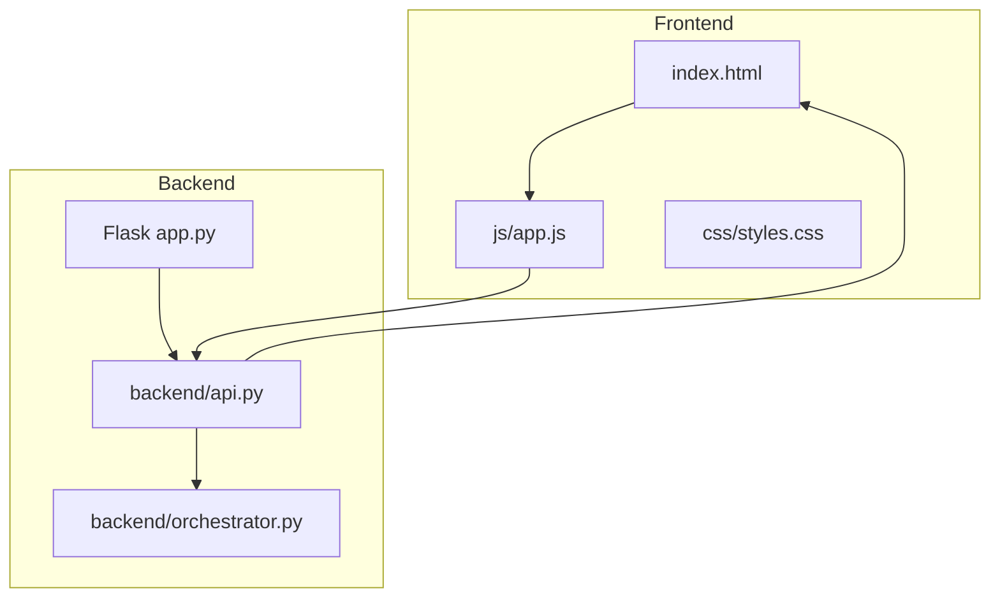
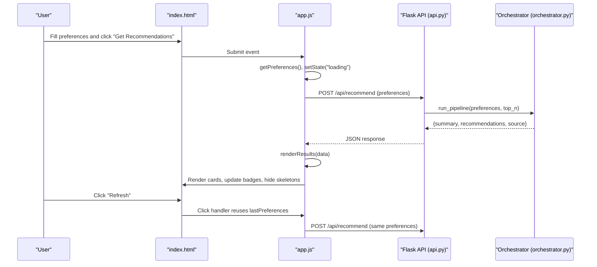
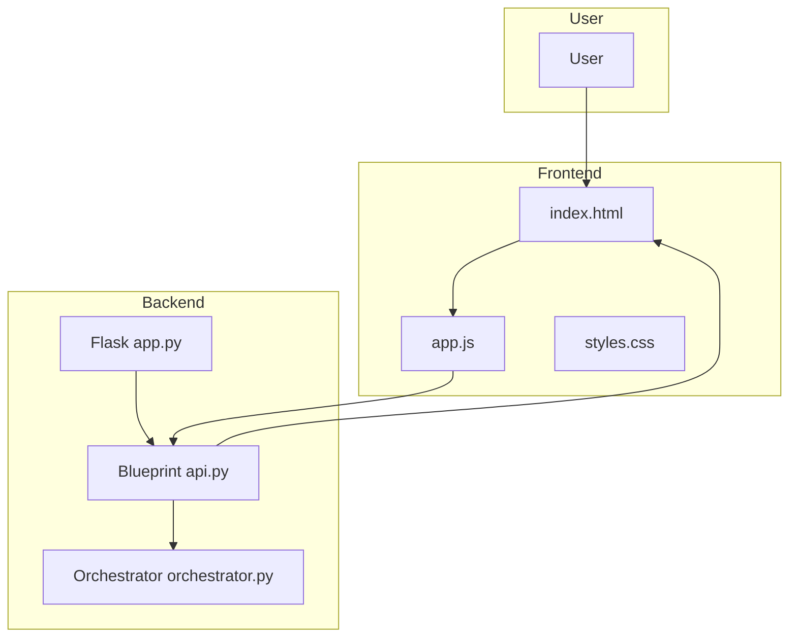
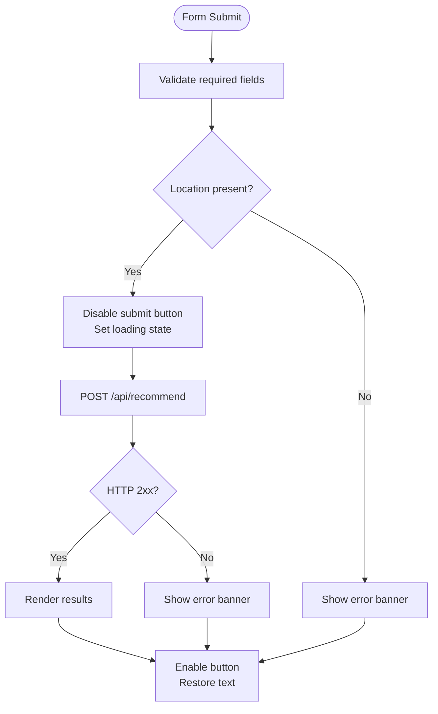
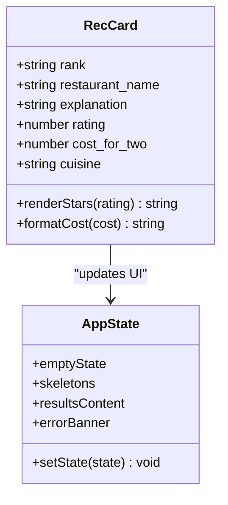
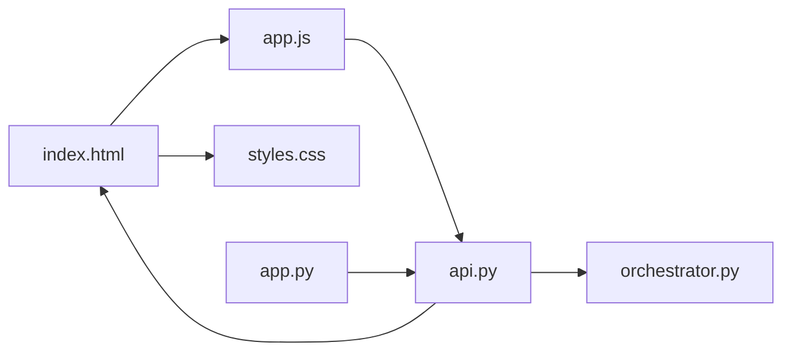

# Frontend Architecture

<cite>
**Referenced Files in This Document**
- [index.html](file://Zomato/architecture/phase_5_response_delivery/frontend/index.html)
- [app.js](file://Zomato/architecture/phase_5_response_delivery/frontend/js/app.js)
- [styles.css](file://Zomato/architecture/phase_5_response_delivery/frontend/css/styles.css)
- [api.py](file://Zomato/architecture/phase_5_response_delivery/backend/api.py)
- [app.py](file://Zomato/architecture/phase_5_response_delivery/backend/app.py)
- [orchestrator.py](file://Zomato/architecture/phase_5_response_delivery/backend/orchestrator.py)
- [metadata.json](file://Zomato/architecture/phase_5_response_delivery/metadata.json)
- [sample_recommendations.json](file://Zomato/architecture/phase_5_response_delivery/sample_recommendations.json)
- [phase-wise-architecture.md](file://Zomato/architecture/phase-wise-architecture.md)
</cite>

## Table of Contents
1. [Introduction](#introduction)
2. [Project Structure](#project-structure)
3. [Core Components](#core-components)
4. [Architecture Overview](#architecture-overview)
5. [Detailed Component Analysis](#detailed-component-analysis)
6. [Dependency Analysis](#dependency-analysis)
7. [Performance Considerations](#performance-considerations)
8. [Troubleshooting Guide](#troubleshooting-guide)
9. [Conclusion](#conclusion)
10. [Appendices](#appendices)

## Introduction
This document describes the frontend architecture of the Zomato AI Recommendation System’s Phase 5 Response Delivery. It covers the visual design, interactive behavior, user journey, and integration with backend APIs. The frontend is a modern, responsive Single Page Application (SPA) built with vanilla HTML, CSS, and JavaScript, styled with a dark-mode, glassmorphism design system and themed around Zomato’s brand identity. It supports real-time recommendation retrieval, sample data demos, and graceful error handling.

## Project Structure
The frontend lives under the Response Delivery phase and consists of:
- index.html: The main page with the preference panel, hero section, and results panel.
- js/app.js: The client-side logic for form handling, API calls, state management, and UI rendering.
- css/styles.css: The design system and responsive layout.

The backend exposes REST endpoints consumed by the frontend:
- GET /api/health: Health check.
- GET /api/metadata: Loads locations and cuisines for dropdowns.
- POST /api/recommend: Runs the full pipeline and returns recommendations.
- GET /api/sample: Returns sample recommendations for demo purposes.

**Diagram sources**
- [index.html:1-198](file://Zomato/architecture/phase_5_response_delivery/frontend/index.html#L1-L198)
- [app.js:1-278](file://Zomato/architecture/phase_5_response_delivery/frontend/js/app.js#L1-L278)
- [styles.css:1-602](file://Zomato/architecture/phase_5_response_delivery/frontend/css/styles.css#L1-L602)
- [app.py:1-41](file://Zomato/architecture/phase_5_response_delivery/backend/app.py#L1-L41)
- [api.py:1-84](file://Zomato/architecture/phase_5_response_delivery/backend/api.py#L1-L84)
- [orchestrator.py:1-292](file://Zomato/architecture/phase_5_response_delivery/backend/orchestrator.py#L1-L292)

**Section sources**
- [index.html:1-198](file://Zomato/architecture/phase_5_response_delivery/frontend/index.html#L1-L198)
- [app.js:1-278](file://Zomato/architecture/phase_5_response_delivery/frontend/js/app.js#L1-L278)
- [styles.css:1-602](file://Zomato/architecture/phase_5_response_delivery/frontend/css/styles.css#L1-L602)
- [app.py:1-41](file://Zomato/architecture/phase_5_response_delivery/backend/app.py#L1-L41)
- [api.py:1-84](file://Zomato/architecture/phase_5_response_delivery/backend/api.py#L1-L84)
- [orchestrator.py:1-292](file://Zomato/architecture/phase_5_response_delivery/backend/orchestrator.py#L1-L292)

## Core Components
- Preference Panel: Contains the form with location, budget slider, cuisine selection, minimum rating slider, optional preferences, and top-N results selector. Includes “Get Recommendations” and “Try with sample data” actions.
- Results Panel: Hosts empty state, skeleton loaders, error banner, and the rendered cards grid. Displays a summary, source badge, and a refresh action.
- Recommendation Cards: Each card shows rank, name, cuisine, stats (rating and cost for two), and an explanation label with the AI-provided rationale.
- State Machine: Manages visibility of empty, loading, results, and error states.

Key behaviors:
- Real-time slider updates with live numeric indicators and gradient fills.
- Async form submission to /api/recommend with loading states and error handling.
- Dynamic metadata loading for locations and cuisines on initialization.
- Graceful fallback to sample data when backend is unavailable.

**Section sources**
- [index.html:41-138](file://Zomato/architecture/phase_5_response_delivery/frontend/index.html#L41-L138)
- [index.html:140-187](file://Zomato/architecture/phase_5_response_delivery/frontend/index.html#L140-L187)
- [app.js:34-53](file://Zomato/architecture/phase_5_response_delivery/frontend/js/app.js#L34-L53)
- [app.js:61-74](file://Zomato/architecture/phase_5_response_delivery/frontend/js/app.js#L61-L74)
- [app.js:76-90](file://Zomato/architecture/phase_5_response_delivery/frontend/js/app.js#L76-L90)
- [app.js:112-150](file://Zomato/architecture/phase_5_response_delivery/frontend/js/app.js#L112-L150)
- [app.js:161-179](file://Zomato/architecture/phase_5_response_delivery/frontend/js/app.js#L161-L179)
- [app.js:181-205](file://Zomato/architecture/phase_5_response_delivery/frontend/js/app.js#L181-L205)
- [app.js:207-222](file://Zomato/architecture/phase_5_response_delivery/frontend/js/app.js#L207-L222)
- [app.js:224-236](file://Zomato/architecture/phase_5_response_delivery/frontend/js/app.js#L224-L236)
- [app.js:238-239](file://Zomato/architecture/phase_5_response_delivery/frontend/js/app.js#L238-L239)
- [app.js:241-246](file://Zomato/architecture/phase_5_response_delivery/frontend/js/app.js#L241-L246)
- [app.js:248-277](file://Zomato/architecture/phase_5_response_delivery/frontend/js/app.js#L248-L277)

## Architecture Overview
The frontend follows a unidirectional data flow:
- User interacts with the form and triggers asynchronous requests.
- The client sends preferences to the backend API.
- The backend orchestrates Phase 3 filtering and Phase 4 LLM ranking, returning structured recommendations.
- The frontend renders the results, handles errors, and supports refresh.

**Diagram sources**
- [index.html:41-138](file://Zomato/architecture/phase_5_response_delivery/frontend/index.html#L41-L138)
- [app.js:224-236](file://Zomato/architecture/phase_5_response_delivery/frontend/js/app.js#L224-L236)
- [app.js:181-205](file://Zomato/architecture/phase_5_response_delivery/frontend/js/app.js#L181-L205)
- [api.py:41-84](file://Zomato/architecture/phase_5_response_delivery/backend/api.py#L41-L84)
- [orchestrator.py:112-292](file://Zomato/architecture/phase_5_response_delivery/backend/orchestrator.py#L112-L292)

## Detailed Component Analysis

### Index HTML Structure
The page is composed of:
- Header with logo and tagline and a subtle glow effect.
- Hero section with gradient typography and centered messaging.
- Main layout grid: preference panel (sticky sidebar) and results panel.
- Preference form with labeled inputs, sliders, and dropdowns.
- Results area with empty state, skeleton loaders, error banner, and cards grid.
- Footer indicating the phase and technology stack.

Responsibilities:
- Provides semantic markup for accessibility.
- Declares CSS and JS assets.
- Hosts DOM nodes referenced by app.js.

**Section sources**
- [index.html:15-25](file://Zomato/architecture/phase_5_response_delivery/frontend/index.html#L15-L25)
- [index.html:27-36](file://Zomato/architecture/phase_5_response_delivery/frontend/index.html#L27-L36)
- [index.html:38-188](file://Zomato/architecture/phase_5_response_delivery/frontend/index.html#L38-L188)
- [index.html:190-193](file://Zomato/architecture/phase_5_response_delivery/frontend/index.html#L190-L193)

### JavaScript Logic (app.js)
Key modules:
- DOM references: form, inputs, buttons, and result containers.
- State machine: toggles visibility among empty/loading/results/error states.
- Slider interactions: live updates for budget and rating with gradient backgrounds.
- Form handling: collects preferences, validates required fields, and submits to backend.
- API integration: fetchRecommendations and fetchSample, with error banners and loading states.
- Rendering: renderStars, formatCost, renderCard, renderResults.
- Metadata loader: loadMetadata populates location and cuisine dropdowns.

Behavior highlights:
- getPreferences normalizes budget tiers and trims optional preferences.
- renderCard applies rank-specific styling and uses animation delays for staggered entry.
- renderResults sets title, summary, source badge, and appends cards to the grid.
- fetchRecommendations disables the button during network calls and restores text.
- fetchSample bypasses form validation and uses a dedicated endpoint.

Accessibility and security:
- Uses aria-label on cards for screen readers.
- Escapes HTML in dynamic content to prevent XSS.

**Section sources**
- [app.js:8-30](file://Zomato/architecture/phase_5_response_delivery/frontend/js/app.js#L8-L30)
- [app.js:76-90](file://Zomato/architecture/phase_5_response_delivery/frontend/js/app.js#L76-L90)
- [app.js:34-53](file://Zomato/architecture/phase_5_response_delivery/frontend/js/app.js#L34-L53)
- [app.js:61-74](file://Zomato/architecture/phase_5_response_delivery/frontend/js/app.js#L61-L74)
- [app.js:112-150](file://Zomato/architecture/phase_5_response_delivery/frontend/js/app.js#L112-L150)
- [app.js:161-179](file://Zomato/architecture/phase_5_response_delivery/frontend/js/app.js#L161-L179)
- [app.js:181-205](file://Zomato/architecture/phase_5_response_delivery/frontend/js/app.js#L181-L205)
- [app.js:207-222](file://Zomato/architecture/phase_5_response_delivery/frontend/js/app.js#L207-L222)
- [app.js:224-236](file://Zomato/architecture/phase_5_response_delivery/frontend/js/app.js#L224-L236)
- [app.js:238-239](file://Zomato/architecture/phase_5_response_delivery/frontend/js/app.js#L238-L239)
- [app.js:241-246](file://Zomato/architecture/phase_5_response_delivery/frontend/js/app.js#L241-L246)
- [app.js:248-277](file://Zomato/architecture/phase_5_response_delivery/frontend/js/app.js#L248-L277)

### Styles and Theming (styles.css)
Design system:
- Color palette: Zomato red accents, dark backgrounds, glass-like surfaces, and muted grays.
- Typography: Inter font, clamp-based hero sizing for scalability.
- Spacing and radii: consistent spacing tokens and rounded corners.
- Shadows and glows: subtle depth with card hover effects and header glow.

Components:
- Site header with backdrop blur and radial glow.
- Hero with gradient text and radial background.
- Preference panel with sticky positioning and custom scrollbar.
- Form fields with focus states and custom select arrows.
- Sliders with gradient fills and thumb hover effects.
- Buttons with gradient backgrounds, hover animations, and icon transitions.
- Results panel with shimmer skeletons and error banner.
- Cards grid with responsive auto-fill and individual card animations.
- Rank badges with special styling for #1.
- Star rating component with filled/half/empty states.
- Footer with phase attribution.

Responsive breakpoints:
- Desktop: fixed sidebar + main content grid.
- Tablet: single-column layout; panel becomes non-sticky.
- Mobile: reduced paddings, hides tagline, and adjusts typography.

**Section sources**
- [styles.css:6-40](file://Zomato/architecture/phase_5_response_delivery/frontend/css/styles.css#L6-L40)
- [styles.css:58-101](file://Zomato/architecture/phase_5_response_delivery/frontend/css/styles.css#L58-L101)
- [styles.css:103-134](file://Zomato/architecture/phase_5_response_delivery/frontend/css/styles.css#L103-L134)
- [styles.css:136-146](file://Zomato/architecture/phase_5_response_delivery/frontend/css/styles.css#L136-L146)
- [styles.css:148-163](file://Zomato/architecture/phase_5_response_delivery/frontend/css/styles.css#L148-L163)
- [styles.css:176-216](file://Zomato/architecture/phase_5_response_delivery/frontend/css/styles.css#L176-L216)
- [styles.css:218-231](file://Zomato/architecture/phase_5_response_delivery/frontend/css/styles.css#L218-L231)
- [styles.css:234-270](file://Zomato/architecture/phase_5_response_delivery/frontend/css/styles.css#L234-L270)
- [styles.css:272-326](file://Zomato/architecture/phase_5_response_delivery/frontend/css/styles.css#L272-L326)
- [styles.css:328-445](file://Zomato/architecture/phase_5_response_delivery/frontend/css/styles.css#L328-L445)
- [styles.css:447-584](file://Zomato/architecture/phase_5_response_delivery/frontend/css/styles.css#L447-L584)
- [styles.css:586-601](file://Zomato/architecture/phase_5_response_delivery/frontend/css/styles.css#L586-L601)

### Backend Integration
Endpoints:
- GET /api/health: Returns service status.
- GET /api/metadata: Returns locations and cuisines for dropdowns.
- POST /api/recommend: Validates preferences, runs the pipeline, and returns recommendations.
- GET /api/sample: Returns prebuilt sample recommendations.

Pipeline orchestration:
- Orchestrator loads restaurants (full dataset or fallback), runs Phase 3 filtering, then Phase 4 LLM ranking, and returns structured results. It gracefully falls back to sample data when Groq key or dataset is missing.

**Section sources**
- [api.py:18-84](file://Zomato/architecture/phase_5_response_delivery/backend/api.py#L18-L84)
- [app.py:14-41](file://Zomato/architecture/phase_5_response_delivery/backend/app.py#L14-L41)
- [orchestrator.py:85-110](file://Zomato/architecture/phase_5_response_delivery/backend/orchestrator.py#L85-L110)
- [orchestrator.py:112-292](file://Zomato/architecture/phase_5_response_delivery/backend/orchestrator.py#L112-L292)

### Data Models and Examples
- Metadata: locations and cuisines arrays used to populate dropdowns.
- Sample recommendations: structured payload with summary, recommendations array, and preferences_used.

Usage examples (paths only):
- Form handling and submission: [app.js:224-236](file://Zomato/architecture/phase_5_response_delivery/frontend/js/app.js#L224-L236)
- Recommendation display: [app.js:161-179](file://Zomato/architecture/phase_5_response_delivery/frontend/js/app.js#L161-L179)
- User feedback collection: [app.js:112-150](file://Zomato/architecture/phase_5_response_delivery/frontend/js/app.js#L112-L150)
- API consumption: [app.js:181-205](file://Zomato/architecture/phase_5_response_delivery/frontend/js/app.js#L181-L205), [app.js:207-222](file://Zomato/architecture/phase_5_response_delivery/frontend/js/app.js#L207-L222)
- Metadata loading: [app.js:248-277](file://Zomato/architecture/phase_5_response_delivery/frontend/js/app.js#L248-L277)
- Backend endpoints: [api.py:18-84](file://Zomato/architecture/phase_5_response_delivery/backend/api.py#L18-L84)

**Section sources**
- [metadata.json:1-196](file://Zomato/architecture/phase_5_response_delivery/metadata.json#L1-L196)
- [sample_recommendations.json:1-53](file://Zomato/architecture/phase_5_response_delivery/sample_recommendations.json#L1-L53)
- [app.js:224-236](file://Zomato/architecture/phase_5_response_delivery/frontend/js/app.js#L224-L236)
- [app.js:161-179](file://Zomato/architecture/phase_5_response_delivery/frontend/js/app.js#L161-L179)
- [app.js:181-205](file://Zomato/architecture/phase_5_response_delivery/frontend/js/app.js#L181-L205)
- [app.js:207-222](file://Zomato/architecture/phase_5_response_delivery/frontend/js/app.js#L207-L222)
- [app.js:248-277](file://Zomato/architecture/phase_5_response_delivery/frontend/js/app.js#L248-L277)
- [api.py:18-84](file://Zomato/architecture/phase_5_response_delivery/backend/api.py#L18-L84)

## Architecture Overview

**Diagram sources**
- [index.html:1-198](file://Zomato/architecture/phase_5_response_delivery/frontend/index.html#L1-L198)
- [app.js:1-278](file://Zomato/architecture/phase_5_response_delivery/frontend/js/app.js#L1-L278)
- [styles.css:1-602](file://Zomato/architecture/phase_5_response_delivery/frontend/css/styles.css#L1-L602)
- [app.py:1-41](file://Zomato/architecture/phase_5_response_delivery/backend/app.py#L1-L41)
- [api.py:1-84](file://Zomato/architecture/phase_5_response_delivery/backend/api.py#L1-L84)
- [orchestrator.py:1-292](file://Zomato/architecture/phase_5_response_delivery/backend/orchestrator.py#L1-L292)

## Detailed Component Analysis

### Form Handling and Validation
- Gathers values from inputs and normalizes budget tiers and optional preferences.
- Validates presence of location before submission.
- Updates UI state to loading and disables the submit button while fetching.

**Diagram sources**
- [app.js:224-236](file://Zomato/architecture/phase_5_response_delivery/frontend/js/app.js#L224-L236)
- [app.js:181-205](file://Zomato/architecture/phase_5_response_delivery/frontend/js/app.js#L181-L205)
- [app.js:85-90](file://Zomato/architecture/phase_5_response_delivery/frontend/js/app.js#L85-L90)

**Section sources**
- [app.js:61-74](file://Zomato/architecture/phase_5_response_delivery/frontend/js/app.js#L61-L74)
- [app.js:224-236](file://Zomato/architecture/phase_5_response_delivery/frontend/js/app.js#L224-L236)
- [app.js:181-205](file://Zomato/architecture/phase_5_response_delivery/frontend/js/app.js#L181-L205)

### Recommendation Display and Animations
- Cards animate in with staggered delays for a pleasing entrance.
- Hover effects enhance depth with glow and elevation.
- Rank badges highlight top recommendations.
- Star rendering supports filled, half, and empty states.

**Diagram sources**
- [app.js:112-150](file://Zomato/architecture/phase_5_response_delivery/frontend/js/app.js#L112-L150)
- [app.js:92-104](file://Zomato/architecture/phase_5_response_delivery/frontend/js/app.js#L92-L104)
- [app.js:106-110](file://Zomato/architecture/phase_5_response_delivery/frontend/js/app.js#L106-L110)
- [app.js:76-90](file://Zomato/architecture/phase_5_response_delivery/frontend/js/app.js#L76-L90)

**Section sources**
- [app.js:112-150](file://Zomato/architecture/phase_5_response_delivery/frontend/js/app.js#L112-L150)
- [app.js:92-104](file://Zomato/architecture/phase_5_response_delivery/frontend/js/app.js#L92-L104)
- [app.js:106-110](file://Zomato/architecture/phase_5_response_delivery/frontend/js/app.js#L106-L110)
- [styles.css:447-584](file://Zomato/architecture/phase_5_response_delivery/frontend/css/styles.css#L447-L584)

### Metadata Loading and Dropdown Population
- On init, the app fetches metadata and populates location and cuisine dropdowns.
- Handles failures by setting placeholder options.

**Section sources**
- [app.js:248-277](file://Zomato/architecture/phase_5_response_delivery/frontend/js/app.js#L248-L277)
- [metadata.json:1-196](file://Zomato/architecture/phase_5_response_delivery/metadata.json#L1-L196)

### Backend API Contracts
- POST /api/recommend expects a JSON body with location, budget, cuisines, min_rating, optional_preferences, and top_n.
- Returns structured recommendations with summary and source indicator.
- GET /api/sample returns a ready-made payload for demos.
- GET /api/metadata returns locations and cuisines arrays.

**Section sources**
- [api.py:41-84](file://Zomato/architecture/phase_5_response_delivery/backend/api.py#L41-L84)
- [sample_recommendations.json:1-53](file://Zomato/architecture/phase_5_response_delivery/sample_recommendations.json#L1-L53)
- [metadata.json:1-196](file://Zomato/architecture/phase_5_response_delivery/metadata.json#L1-L196)

## Dependency Analysis

**Diagram sources**
- [index.html:1-198](file://Zomato/architecture/phase_5_response_delivery/frontend/index.html#L1-L198)
- [app.js:1-278](file://Zomato/architecture/phase_5_response_delivery/frontend/js/app.js#L1-L278)
- [styles.css:1-602](file://Zomato/architecture/phase_5_response_delivery/frontend/css/styles.css#L1-L602)
- [app.py:1-41](file://Zomato/architecture/phase_5_response_delivery/backend/app.py#L1-L41)
- [api.py:1-84](file://Zomato/architecture/phase_5_response_delivery/backend/api.py#L1-L84)
- [orchestrator.py:1-292](file://Zomato/architecture/phase_5_response_delivery/backend/orchestrator.py#L1-L292)

**Section sources**
- [app.py:14-41](file://Zomato/architecture/phase_5_response_delivery/backend/app.py#L14-L41)
- [api.py:18-84](file://Zomato/architecture/phase_5_response_delivery/backend/api.py#L18-L84)
- [orchestrator.py:112-292](file://Zomato/architecture/phase_5_response_delivery/backend/orchestrator.py#L112-L292)

## Performance Considerations
- Asynchronous rendering: Skeleton loaders improve perceived performance during network requests.
- Minimal DOM manipulation: Cards appended once per batch to reduce reflows.
- CSS animations: Lightweight transforms and opacity changes for smooth transitions.
- Debounce-free sliders: Immediate updates keep interactions responsive.
- Lazy population of metadata: Dropdowns populated only on init.
- Image-free design: No external images; icons are inline or emoji-based.

[No sources needed since this section provides general guidance]

## Troubleshooting Guide
Common issues and remedies:
- Empty dropdowns: Verify metadata endpoint availability and CORS configuration.
- API errors: Check /api/health and inspect error banner content.
- LLM failures: Orchestrator falls back to Phase 3 rankings; confirm Groq key and dataset presence.
- Styling anomalies: Ensure styles.css is loaded and media queries apply at target breakpoints.

**Section sources**
- [app.js:85-90](file://Zomato/architecture/phase_5_response_delivery/frontend/js/app.js#L85-L90)
- [app.js:248-277](file://Zomato/architecture/phase_5_response_delivery/frontend/js/app.js#L248-L277)
- [api.py:18-21](file://Zomato/architecture/phase_5_response_delivery/backend/api.py#L18-L21)
- [orchestrator.py:266-291](file://Zomato/architecture/phase_5_response_delivery/backend/orchestrator.py#L266-L291)

## Conclusion
The Phase 5 frontend delivers a polished, accessible, and responsive recommendation experience. Its clean separation of concerns—HTML for structure, CSS for design and responsiveness, and JavaScript for interactivity—enables maintainability and extensibility. The integration with backend APIs is straightforward and robust, with graceful fallbacks and clear error handling.

[No sources needed since this section summarizes without analyzing specific files]

## Appendices

### Responsive Design Guidelines
- Desktop: Fixed 340px-wide preference panel with sticky positioning.
- Tablet: Single-column layout; preference panel becomes non-sticky.
- Mobile: Reduced paddings, hidden tagline, and clamp-based typography scaling.

**Section sources**
- [styles.css:586-601](file://Zomato/architecture/phase_5_response_delivery/frontend/css/styles.css#L586-L601)

### Accessibility Compliance Checklist
- Semantic HTML and ARIA labels for interactive elements.
- Keyboard navigable forms and buttons.
- Sufficient color contrast and readable typography.
- Focus-visible indicators for interactive controls.
- Screen reader-friendly labels and roles.

**Section sources**
- [index.html:116-118](file://Zomato/architecture/phase_5_response_delivery/frontend/index.html#L116-L118)
- [styles.css:213-216](file://Zomato/architecture/phase_5_response_delivery/frontend/css/styles.css#L213-L216)

### Style Customization and Theming
- Centralized CSS variables for palette, typography, spacing, shadows, and easing.
- Theme tokens enable easy switching between light/dark modes or brand variants.
- Component classes encapsulate visual behavior for consistent updates.

**Section sources**
- [styles.css:6-40](file://Zomato/architecture/phase_5_response_delivery/frontend/css/styles.css#L6-L40)
- [styles.css:447-584](file://Zomato/architecture/phase_5_response_delivery/frontend/css/styles.css#L447-L584)

### Cross-Browser Compatibility
- Modern CSS features with vendor-prefixed slider thumbs for Firefox.
- Flexbox and Grid for layout; fallbacks considered in older browsers.
- Vanilla JavaScript without transpilation; ensure target browser support for fetch and modern APIs.

**Section sources**
- [styles.css:246-263](file://Zomato/architecture/phase_5_response_delivery/frontend/css/styles.css#L246-L263)
- [app.js:181-205](file://Zomato/architecture/phase_5_response_delivery/frontend/js/app.js#L181-L205)

### Component Composition Patterns
- Modular rendering functions (renderStars, formatCost, renderCard) promote reuse.
- State machine centralizes UI visibility logic.
- Event-driven architecture separates concerns between UI and data.

**Section sources**
- [app.js:92-110](file://Zomato/architecture/phase_5_response_delivery/frontend/js/app.js#L92-L110)
- [app.js:112-150](file://Zomato/architecture/phase_5_response_delivery/frontend/js/app.js#L112-L150)
- [app.js:76-90](file://Zomato/architecture/phase_5_response_delivery/frontend/js/app.js#L76-L90)

### Integration with Backend APIs
- Health checks, metadata loading, recommendation retrieval, and sample data endpoints.
- Robust error handling and user feedback via error banners.

**Section sources**
- [api.py:18-84](file://Zomato/architecture/phase_5_response_delivery/backend/api.py#L18-L84)
- [app.js:181-222](file://Zomato/architecture/phase_5_response_delivery/frontend/js/app.js#L181-L222)
- [phase-wise-architecture.md:67-76](file://Zomato/architecture/phase-wise-architecture.md#L67-L76)