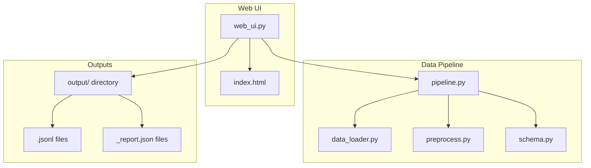
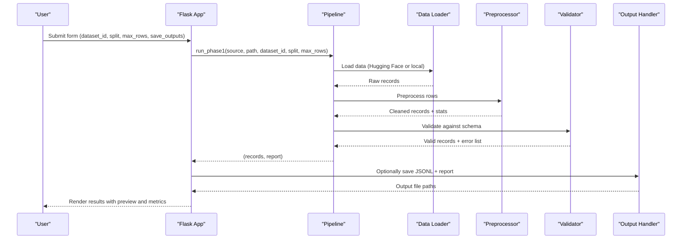
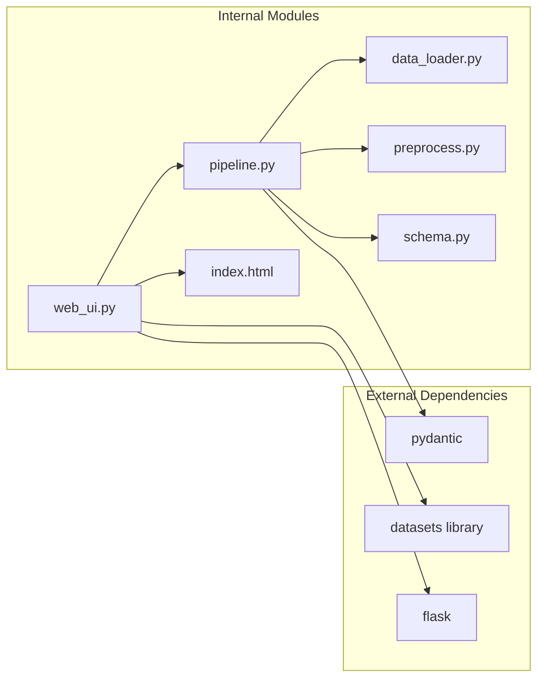

# Phase 1 Data Foundation Web UI

<cite>
**Referenced Files in This Document**
- [web_ui.py](file://Zomato/architecture/phase_1_data_foundation/web_ui.py)
- [pipeline.py](file://Zomato/architecture/phase_1_data_foundation/pipeline.py)
- [data_loader.py](file://Zomato/architecture/phase_1_data_foundation/data_loader.py)
- [preprocess.py](file://Zomato/architecture/phase_1_data_foundation/preprocess.py)
- [schema.py](file://Zomato/architecture/phase_1_data_foundation/schema.py)
- [index.html](file://Zomato/architecture/phase_1_data_foundation/templates/index.html)
- [requirements.txt](file://Zomato/architecture/phase_1_data_foundation/requirements.txt)
- [sample_input.json](file://Zomato/architecture/phase_1_data_foundation/sample_input.json)
</cite>

## Table of Contents
1. [Introduction](#introduction)
2. [Project Structure](#project-structure)
3. [Core Components](#core-components)
4. [Architecture Overview](#architecture-overview)
5. [Detailed Component Analysis](#detailed-component-analysis)
6. [Dependency Analysis](#dependency-analysis)
7. [Performance Considerations](#performance-considerations)
8. [Troubleshooting Guide](#troubleshooting-guide)
9. [Conclusion](#conclusion)

## Introduction
This document provides comprehensive documentation for the Phase 1 Data Foundation web UI component. The system enables users to ingest restaurant datasets from Hugging Face or local files, preprocess and validate the data according to a standardized schema, and visualize quality reports with progress indicators and error reporting. The web interface is built with Flask templates and routes, offering a transparent workflow for data foundation operations.

## Project Structure
The Phase 1 Data Foundation module consists of a Flask web application with a single HTML template and several Python modules handling data loading, preprocessing, validation, and reporting.

**Diagram sources**
- [web_ui.py:17-117](file://Zomato/architecture/phase_1_data_foundation/web_ui.py#L17-L117)
- [pipeline.py:21-81](file://Zomato/architecture/phase_1_data_foundation/pipeline.py#L21-L81)
- [data_loader.py:14-78](file://Zomato/architecture/phase_1_data_foundation/data_loader.py#L14-L78)
- [preprocess.py:118-185](file://Zomato/architecture/phase_1_data_foundation/preprocess.py#L118-L185)
- [schema.py:10-54](file://Zomato/architecture/phase_1_data_foundation/schema.py#L10-L54)

**Section sources**
- [web_ui.py:17-117](file://Zomato/architecture/phase_1_data_foundation/web_ui.py#L17-L117)
- [pipeline.py:21-81](file://Zomato/architecture/phase_1_data_foundation/pipeline.py#L21-L81)
- [data_loader.py:14-78](file://Zomato/architecture/phase_1_data_foundation/data_loader.py#L14-L78)
- [preprocess.py:118-185](file://Zomato/architecture/phase_1_data_foundation/preprocess.py#L118-L185)
- [schema.py:10-54](file://Zomato/architecture/phase_1_data_foundation/schema.py#L10-L54)

## Core Components
The system comprises four primary components:

- **Flask Web Application**: Handles user interactions, form submissions, and rendering results
- **Data Loader**: Supports multiple input sources (Hugging Face, JSON, JSONL, CSV)
- **Preprocessing Engine**: Normalizes and cleans raw data into canonical forms
- **Schema Validation**: Enforces data integrity using Pydantic models

Key features include:
- Dataset ingestion from Hugging Face datasets or local files
- Real-time validation status display with error samples
- Quality reporting with statistics and downloadable artifacts
- Progress indicators through immediate feedback and previews

**Section sources**
- [web_ui.py:21-95](file://Zomato/architecture/phase_1_data_foundation/web_ui.py#L21-L95)
- [data_loader.py:14-78](file://Zomato/architecture/phase_1_data_foundation/data_loader.py#L14-L78)
- [preprocess.py:169-185](file://Zomato/architecture/phase_1_data_foundation/preprocess.py#L169-L185)
- [schema.py:41-54](file://Zomato/architecture/phase_1_data_foundation/schema.py#L41-L54)

## Architecture Overview
The system follows a clear separation of concerns with the web UI coordinating data processing through a pipeline that handles loading, preprocessing, and validation.

**Diagram sources**
- [web_ui.py:33-95](file://Zomato/architecture/phase_1_data_foundation/web_ui.py#L33-L95)
- [pipeline.py:21-67](file://Zomato/architecture/phase_1_data_foundation/pipeline.py#L21-L67)
- [data_loader.py:14-78](file://Zomato/architecture/phase_1_data_foundation/data_loader.py#L14-L78)
- [preprocess.py:169-185](file://Zomato/architecture/phase_1_data_foundation/preprocess.py#L169-L185)
- [schema.py:41-54](file://Zomato/architecture/phase_1_data_foundation/schema.py#L41-L54)

## Detailed Component Analysis

### Web UI Implementation
The Flask application provides a streamlined interface for dataset ingestion and result visualization.

#### Routes and Form Handling
- **GET /**: Renders the main form with default dataset configuration
- **POST /run-phase1**: Processes user input, executes pipeline, and displays results
- **GET /download/<name>**: Serves saved output files from the output directory
- **GET /favicon.ico**: Redirects to home page

#### Form Fields and Validation
The form accepts:
- Dataset ID (default provided)
- Split selection (default "train")
- Maximum rows (optional numeric constraint)
- Save outputs checkbox (optional)

Input validation includes:
- Numeric conversion and bounds checking for max_rows
- Error handling with detailed traceback in development mode
- Safe file serving with path sanitization

#### Results Display
The template renders:
- Success/error notifications with formatted messages
- Quality metrics summary (input count, kept/dropped counts, validation errors)
- Preview table of processed records (first 20 rows)
- Download links for generated artifacts

**Section sources**
- [web_ui.py:21-117](file://Zomato/architecture/phase_1_data_foundation/web_ui.py#L21-L117)
- [index.html:28-99](file://Zomato/architecture/phase_1_data_foundation/templates/index.html#L28-L99)

### Data Loading Interface
The system supports multiple data sources with unified interfaces.

#### Supported Sources
- **Hugging Face**: Default source with configurable dataset_id and split
- **JSON**: Single JSON object or array of objects
- **JSONL**: Line-delimited JSON files
- **CSV**: Standard CSV with header row

#### Loading Strategies
- Memory-based loading for moderate datasets
- Streaming support available for large datasets
- Automatic row limiting via max_rows parameter

#### Error Handling
- Type validation for JSON root types
- Graceful handling of empty lines in JSONL
- Clear error messages for malformed input

**Section sources**
- [data_loader.py:14-78](file://Zomato/architecture/phase_1_data_foundation/data_loader.py#L14-L78)
- [pipeline.py:35-56](file://Zomato/architecture/phase_1_data_foundation/pipeline.py#L35-L56)

### Preprocessing Pipeline
The preprocessing engine transforms heterogeneous raw data into a canonical format.

#### Column Mapping
The system recognizes multiple aliases for each field category:
- Restaurant names: "restaurant_name", "Restaurant Name", "name", etc.
- Locations: "location", "Location", "city", "City", etc.
- Cuisines: "cuisines", "Cuisines", "cuisine", etc.
- Ratings: "aggregate_rating", "Aggregate rating", "rating", etc.
- Costs: "average_cost_for_two", "Average Cost for two", "cost_for_two", etc.

#### Normalization Rules
- Whitespace normalization and trimming
- Location capitalization (title case)
- Cuisine normalization (comma-separated, title case)
- Rating parsing with scale conversion (handles 10-scale variants)
- Cost extraction with thousands separator removal

#### Quality Metrics
Statistics tracked during preprocessing:
- Input row count
- Rows kept after normalization
- Rows dropped due to incomplete data

**Section sources**
- [preprocess.py:8-50](file://Zomato/architecture/phase_1_data_foundation/preprocess.py#L8-L50)
- [preprocess.py:118-185](file://Zomato/architecture/phase_1_data_foundation/preprocess.py#L118-L185)

### Schema Validation
The validation system ensures data integrity using Pydantic models.

#### RestaurantRecord Model
Fields and constraints:
- restaurant_name: required, minimum length 1
- location: required, minimum length 1
- cuisine: required, minimum length 1
- cost_for_two: optional float
- rating: optional float, constrained to 0.0-5.0
- extras: dictionary for preserved attributes

#### Validation Process
- Iterative validation of normalized records
- Collection of all validation errors with row indices
- Sample error display (first 10 errors)
- Strict schema enforcement with extra fields forbidden

**Section sources**
- [schema.py:10-39](file://Zomato/architecture/phase_1_data_foundation/schema.py#L10-L39)
- [schema.py:41-54](file://Zomato/architecture/phase_1_data_foundation/schema.py#L41-L54)

### Quality Reporting Visualization
The system generates comprehensive quality reports with actionable insights.

#### Report Structure
- Preprocessing statistics: input, kept, dropped_incomplete
- Validation summary: total errors, sample error list
- Output metrics: validated record count

#### Frontend Presentation
- Success notification with key metrics
- Downloadable artifacts (JSONL and report)
- Interactive preview table with essential fields
- Error display with formatted traceback

**Section sources**
- [pipeline.py:61-67](file://Zomato/architecture/phase_1_data_foundation/pipeline.py#L61-L67)
- [index.html:53-95](file://Zomato/architecture/phase_1_data_foundation/templates/index.html#L53-L95)

## Dependency Analysis
The system maintains loose coupling between components while ensuring clear data flow.

**Diagram sources**
- [requirements.txt:1-4](file://Zomato/architecture/phase_1_data_foundation/requirements.txt#L1-L4)
- [web_ui.py:9-12](file://Zomato/architecture/phase_1_data_foundation/web_ui.py#L9-L12)
- [pipeline.py:9-18](file://Zomato/architecture/phase_1_data_foundation/pipeline.py#L9-L18)

**Section sources**
- [requirements.txt:1-4](file://Zomato/architecture/phase_1_data_foundation/requirements.txt#L1-L4)
- [web_ui.py:9-12](file://Zomato/architecture/phase_1_data_foundation/web_ui.py#L9-L12)
- [pipeline.py:9-18](file://Zomato/architecture/phase_1_data_foundation/pipeline.py#L9-L18)

## Performance Considerations
The system is designed for efficient data processing with scalability in mind.

### Memory Management
- Streaming support available for large datasets via iterate_huggingface_rows
- Optional row limiting reduces memory footprint
- Progressive validation prevents memory accumulation

### Processing Efficiency
- Early filtering of incomplete rows during preprocessing
- Minimal data copying through dictionary transformations
- Optimized regex patterns for parsing numeric values

### Scalability Features
- Modular design allows independent scaling of components
- Stateless processing enables horizontal scaling
- Configurable batch sizes for different deployment scenarios

## Troubleshooting Guide

### Common Issues and Solutions
- **Invalid max_rows value**: Ensure positive integers; system rejects non-positive values
- **Missing path for local sources**: JSON/JSONL/CSV require explicit file paths
- **Malformed JSON/JSONL**: Verify file format and encoding; system handles empty lines gracefully
- **Hugging Face dataset errors**: Check dataset_id format and network connectivity

### Error Handling Mechanisms
- Comprehensive exception catching with detailed traceback display
- Graceful degradation for individual row validation failures
- User-friendly error messages with context information

### Debugging Tips
- Enable debug mode for development deployments
- Review preprocessing logs for data transformation insights
- Validate schema compliance using sample input files

**Section sources**
- [web_ui.py:44-73](file://Zomato/architecture/phase_1_data_foundation/web_ui.py#L44-L73)
- [data_loader.py:52-78](file://Zomato/architecture/phase_1_data_foundation/data_loader.py#L52-L78)
- [preprocess.py:169-185](file://Zomato/architecture/phase_1_data_foundation/preprocess.py#L169-L185)

## Conclusion
The Phase 1 Data Foundation web UI provides a robust, transparent framework for restaurant dataset ingestion and validation. Its modular architecture, comprehensive error handling, and clear visualization of quality metrics enable efficient data preparation for subsequent phases. The system balances usability with technical rigor, making it suitable for both development and production environments.