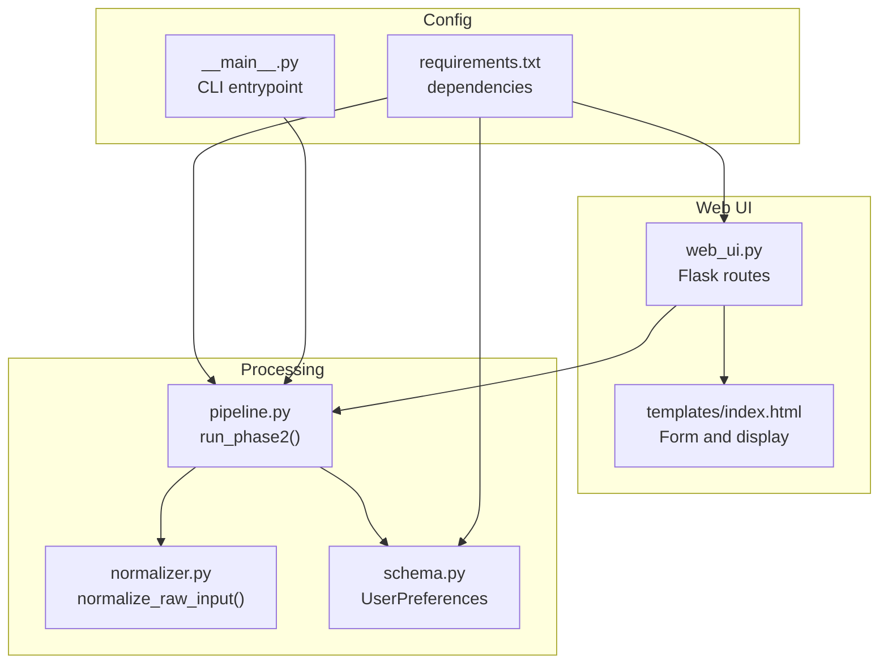
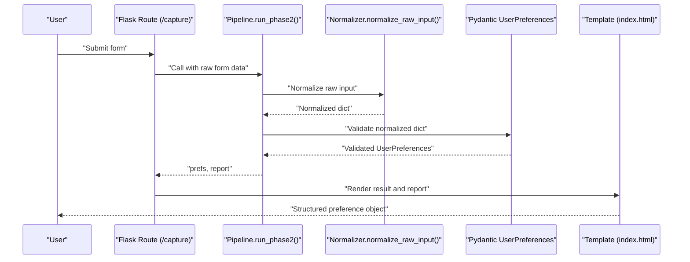
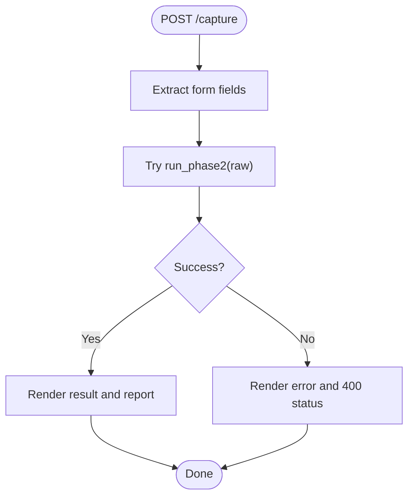
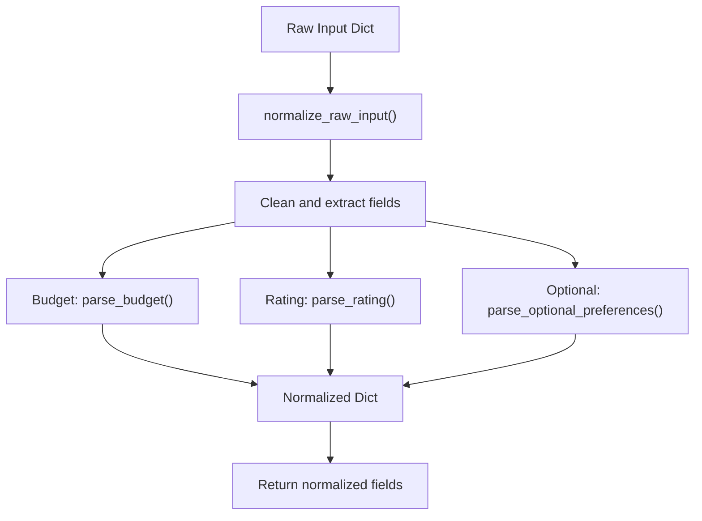
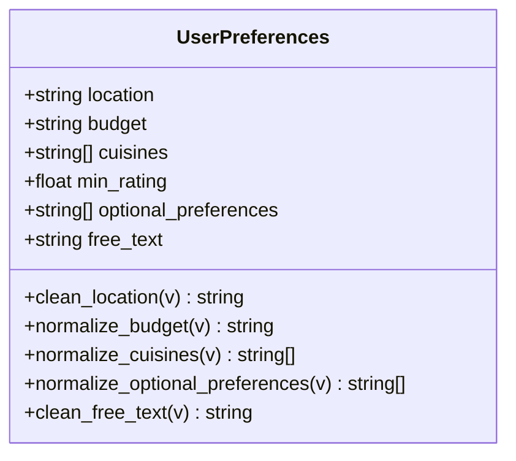
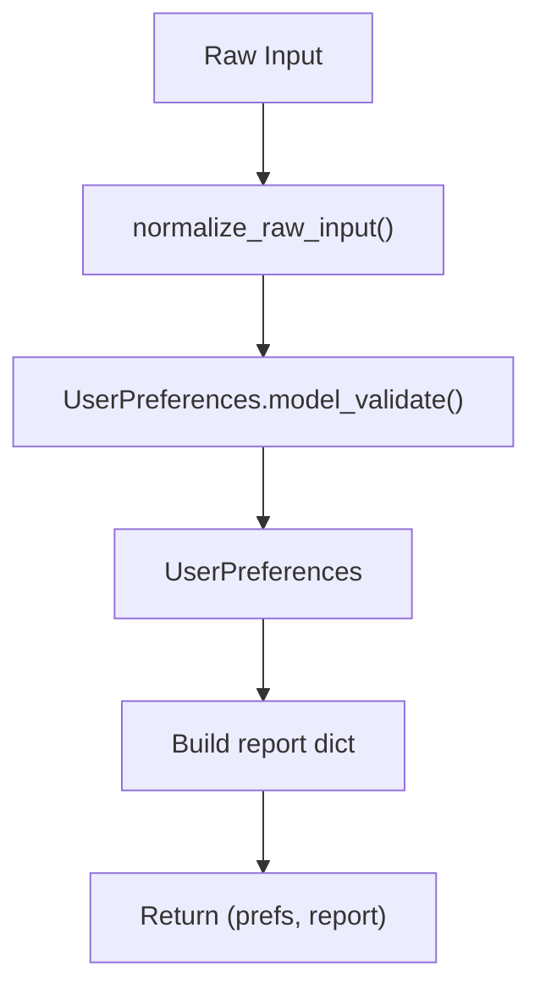
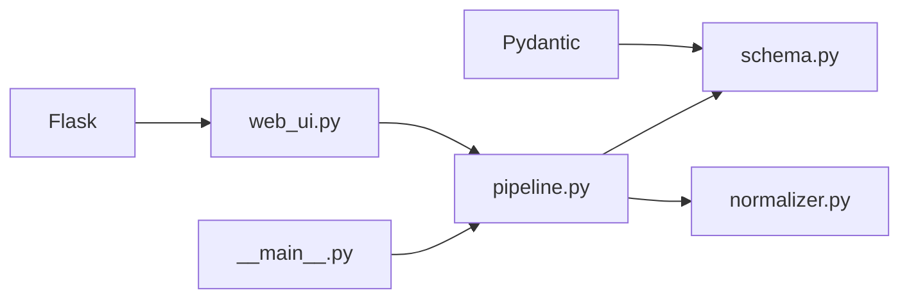

# Phase 2 Preference Capture Web UI

<cite>
**Referenced Files in This Document**
- [web_ui.py](file://Zomato/architecture/phase_2_preference_capture/web_ui.py)
- [normalizer.py](file://Zomato/architecture/phase_2_preference_capture/normalizer.py)
- [schema.py](file://Zomato/architecture/phase_2_preference_capture/schema.py)
- [pipeline.py](file://Zomato/architecture/phase_2_preference_capture/pipeline.py)
- [index.html](file://Zomato/architecture/phase_2_preference_capture/templates/index.html)
- [requirements.txt](file://Zomato/architecture/phase_2_preference_capture/requirements.txt)
- [__main__.py](file://Zomato/architecture/phase_2_preference_capture/__main__.py)
</cite>

## Table of Contents
1. [Introduction](#introduction)
2. [Project Structure](#project-structure)
3. [Core Components](#core-components)
4. [Architecture Overview](#architecture-overview)
5. [Detailed Component Analysis](#detailed-component-analysis)
6. [Dependency Analysis](#dependency-analysis)
7. [Performance Considerations](#performance-considerations)
8. [Troubleshooting Guide](#troubleshooting-guide)
9. [Conclusion](#conclusion)

## Introduction
This document describes the Phase 2 Preference Capture web UI component responsible for collecting user preferences and converting them into a validated, normalized structured object. The interface captures user dietary restrictions, price ranges, cuisine preferences, and additional requirements, while providing real-time feedback through normalization reports and structured preference previews. The implementation integrates Flask for the web server, Pydantic for validation, and a dedicated normalization pipeline to handle input variations and produce consistent preference data.

## Project Structure
The Phase 2 Preference Capture module follows a clear separation of concerns:
- Web UI: Flask routes and HTML template rendering
- Normalization: Input parsing and canonical field mapping
- Validation: Pydantic model validation with field-level validators
- Pipeline: Orchestration of normalization and validation steps
- CLI: Command-line interface for testing and automation

**Diagram sources**
- [web_ui.py:1-52](file://Zomato/architecture/phase_2_preference_capture/web_ui.py#L1-L52)
- [pipeline.py:1-21](file://Zomato/architecture/phase_2_preference_capture/pipeline.py#L1-L21)
- [normalizer.py:1-91](file://Zomato/architecture/phase_2_preference_capture/normalizer.py#L1-L91)
- [schema.py:1-72](file://Zomato/architecture/phase_2_preference_capture/schema.py#L1-L72)
- [index.html:1-64](file://Zomato/architecture/phase_2_preference_capture/templates/index.html#L1-L64)
- [requirements.txt:1-3](file://Zomato/architecture/phase_2_preference_capture/requirements.txt#L1-L3)
- [__main__.py:1-46](file://Zomato/architecture/phase_2_preference_capture/__main__.py#L1-L46)

**Section sources**
- [web_ui.py:1-52](file://Zomato/architecture/phase_2_preference_capture/web_ui.py#L1-L52)
- [pipeline.py:1-21](file://Zomato/architecture/phase_2_preference_capture/pipeline.py#L1-L21)
- [normalizer.py:1-91](file://Zomato/architecture/phase_2_preference_capture/normalizer.py#L1-L91)
- [schema.py:1-72](file://Zomato/architecture/phase_2_preference_capture/schema.py#L1-L72)
- [index.html:1-64](file://Zomato/architecture/phase_2_preference_capture/templates/index.html#L1-L64)
- [requirements.txt:1-3](file://Zomato/architecture/phase_2_preference_capture/requirements.txt#L1-L3)
- [__main__.py:1-46](file://Zomato/architecture/phase_2_preference_capture/__main__.py#L1-L46)

## Core Components
- Web UI controller: Handles GET/POST requests, renders the form, and displays results and errors.
- Normalization engine: Converts free-form inputs into canonical fields, including budget mapping, rating extraction, and optional preference inference.
- Validation schema: Defines the structure and constraints for validated preferences using Pydantic validators.
- Pipeline orchestration: Executes normalization followed by validation and produces a normalization report.
- Template: Provides the HTML form and displays structured preference objects and normalization reports.

Key responsibilities:
- Input validation: Ensures required fields and numeric ranges are respected.
- Preference normalization: Transforms user-entered text into standardized categories and lists.
- Real-time feedback: Shows normalized preferences and a detailed report after submission.
- Error handling: Catches exceptions and renders stack traces for debugging.

**Section sources**
- [web_ui.py:14-43](file://Zomato/architecture/phase_2_preference_capture/web_ui.py#L14-L43)
- [normalizer.py:76-91](file://Zomato/architecture/phase_2_preference_capture/normalizer.py#L76-L91)
- [schema.py:8-72](file://Zomato/architecture/phase_2_preference_capture/schema.py#L8-L72)
- [pipeline.py:11-21](file://Zomato/architecture/phase_2_preference_capture/pipeline.py#L11-L21)
- [index.html:22-61](file://Zomato/architecture/phase_2_preference_capture/templates/index.html#L22-L61)

## Architecture Overview
The system implements a request-response flow:
1. User submits the form via POST to the `/capture` endpoint.
2. The web UI extracts form fields and invokes the pipeline.
3. The pipeline normalizes inputs and validates them against the schema.
4. Results are rendered back to the user with structured preference previews and normalization reports.

**Diagram sources**
- [web_ui.py:19-43](file://Zomato/architecture/phase_2_preference_capture/web_ui.py#L19-L43)
- [pipeline.py:11-21](file://Zomato/architecture/phase_2_preference_capture/pipeline.py#L11-L21)
- [normalizer.py:76-91](file://Zomato/architecture/phase_2_preference_capture/normalizer.py#L76-L91)
- [schema.py:8-17](file://Zomato/architecture/phase_2_preference_capture/schema.py#L8-L17)
- [index.html:53-61](file://Zomato/architecture/phase_2_preference_capture/templates/index.html#L53-L61)

## Detailed Component Analysis

### Web UI Controller
The Flask application exposes two endpoints:
- GET `/`: Renders the form without results.
- POST `/capture`: Extracts form fields, runs the pipeline, and renders results or error details.

Behavior highlights:
- Form fields captured: location, budget, cuisines, min_rating, optional_preferences, free_text.
- Error handling: Catches exceptions and returns a 400 status with a formatted stack trace.
- Rendering: Displays structured preference object and normalization report when present.

**Diagram sources**
- [web_ui.py:19-43](file://Zomato/architecture/phase_2_preference_capture/web_ui.py#L19-L43)

**Section sources**
- [web_ui.py:14-43](file://Zomato/architecture/phase_2_preference_capture/web_ui.py#L14-L43)
- [index.html:18-21](file://Zomato/architecture/phase_2_preference_capture/templates/index.html#L18-L21)

### Normalization Engine
The normalization process converts raw inputs into canonical fields:
- Budget normalization: Maps common synonyms to canonical values (low, medium, high), with fallback defaults.
- Rating extraction: Parses numeric values from text and clamps them to the 0–5 range.
- Optional preferences: Merges explicit comma-separated entries with free-text to infer additional preferences using regex patterns.
- Free-text cleaning: Strips whitespace and preserves user-provided notes.

**Diagram sources**
- [normalizer.py:76-91](file://Zomato/architecture/phase_2_preference_capture/normalizer.py#L76-L91)
- [normalizer.py:29-41](file://Zomato/architecture/phase_2_preference_capture/normalizer.py#L29-L41)
- [normalizer.py:44-56](file://Zomato/architecture/phase_2_preference_capture/normalizer.py#L44-L56)
- [normalizer.py:59-73](file://Zomato/architecture/phase_2_preference_capture/normalizer.py#L59-L73)

**Section sources**
- [normalizer.py:76-91](file://Zomato/architecture/phase_2_preference_capture/normalizer.py#L76-L91)
- [normalizer.py:29-41](file://Zomato/architecture/phase_2_preference_capture/normalizer.py#L29-L41)
- [normalizer.py:44-56](file://Zomato/architecture/phase_2_preference_capture/normalizer.py#L44-L56)
- [normalizer.py:59-73](file://Zomato/architecture/phase_2_preference_capture/normalizer.py#L59-L73)

### Validation Schema
The Pydantic model enforces:
- Location: Non-empty, cleaned to title case.
- Budget: Must be one of low, medium, high.
- Cuisines: Comma-separated list normalized to title-case with deduplication.
- Minimum rating: Float constrained to 0.0–5.0.
- Optional preferences: Lowercased list with deduplication.
- Free text: Cleaned string.

Validators ensure robustness and consistent downstream processing.

**Diagram sources**
- [schema.py:8-72](file://Zomato/architecture/phase_2_preference_capture/schema.py#L8-L72)

**Section sources**
- [schema.py:8-72](file://Zomato/architecture/phase_2_preference_capture/schema.py#L8-L72)

### Pipeline Orchestration
The pipeline coordinates normalization and validation:
- Accepts raw input dictionary.
- Normalizes inputs to canonical fields.
- Validates against the schema to produce a structured preference object.
- Generates a report containing input keys, normalized values, and validity status.

**Diagram sources**
- [pipeline.py:11-21](file://Zomato/architecture/phase_2_preference_capture/pipeline.py#L11-L21)
- [normalizer.py:76-91](file://Zomato/architecture/phase_2_preference_capture/normalizer.py#L76-L91)
- [schema.py:8-17](file://Zomato/architecture/phase_2_preference_capture/schema.py#L8-L17)

**Section sources**
- [pipeline.py:11-21](file://Zomato/architecture/phase_2_preference_capture/pipeline.py#L11-L21)

### Web UI Template
The HTML template provides:
- A labeled form with inputs for location, budget, cuisines, minimum rating, optional preferences, and free text.
- Real-time feedback areas for structured preference objects and normalization reports.
- Error display area with styled error container.

User experience enhancements:
- Clear labels and placeholders guide input.
- Numeric input for ratings with min/max/step constraints.
- Preselected budget option for convenience.
- Responsive layout with minimal styling.

**Section sources**
- [index.html:22-61](file://Zomato/architecture/phase_2_preference_capture/templates/index.html#L22-L61)

## Dependency Analysis
External dependencies:
- Flask: Web framework for routing and templating.
- Pydantic: Data validation and serialization.

Internal dependencies:
- web_ui.py depends on pipeline.py for processing.
- pipeline.py depends on normalizer.py and schema.py.
- CLI entrypoint can start the web UI or run the pipeline directly.

**Diagram sources**
- [requirements.txt:1-3](file://Zomato/architecture/phase_2_preference_capture/requirements.txt#L1-L3)
- [web_ui.py:9](file://Zomato/architecture/phase_2_preference_capture/web_ui.py#L9)
- [pipeline.py:7-8](file://Zomato/architecture/phase_2_preference_capture/pipeline.py#L7-L8)
- [schema.py:5](file://Zomato/architecture/phase_2_preference_capture/schema.py#L5)
- [__main__.py:22-26](file://Zomato/architecture/phase_2_preference_capture/__main__.py#L22-L26)

**Section sources**
- [requirements.txt:1-3](file://Zomato/architecture/phase_2_preference_capture/requirements.txt#L1-L3)
- [web_ui.py:9](file://Zomato/architecture/phase_2_preference_capture/web_ui.py#L9)
- [pipeline.py:7-8](file://Zomato/architecture/phase_2_preference_capture/pipeline.py#L7-L8)
- [schema.py:5](file://Zomato/architecture/phase_2_preference_capture/schema.py#L5)
- [__main__.py:22-26](file://Zomato/architecture/phase_2_preference_capture/__main__.py#L22-L26)

## Performance Considerations
- Input processing is lightweight and linear in the length of free-text and comma-separated lists.
- Regex patterns for optional preferences are simple and bounded by input size.
- Pydantic validation adds minimal overhead for small preference objects.
- Recommendations:
  - Keep free-text inputs concise to reduce regex scanning.
  - Avoid excessively long comma-separated lists to minimize normalization loops.
  - Consider caching repeated normalization results if the UI becomes interactive and inputs are reused.

[No sources needed since this section provides general guidance]

## Troubleshooting Guide
Common issues and resolutions:
- Budget validation errors: Ensure budget is one of low, medium, high. Synonyms are mapped automatically; otherwise, defaults to medium.
- Rating parsing failures: Provide numeric values within 0–5; non-numeric inputs default to 0.
- Empty location: Required field; ensure non-empty input.
- Optional preferences duplicates: Explicit and inferred preferences are de-duplicated; order preserves explicit items first.
- Web UI errors: Check the error display area for stack traces; verify Flask and Pydantic versions meet requirements.

Operational tips:
- Use the CLI to quickly test inputs without the web server.
- Inspect the normalization report to understand how raw inputs were transformed.
- Validate that the web server is reachable at the configured host/port.

**Section sources**
- [web_ui.py:37-43](file://Zomato/architecture/phase_2_preference_capture/web_ui.py#L37-L43)
- [schema.py:11-16](file://Zomato/architecture/phase_2_preference_capture/schema.py#L11-L16)
- [normalizer.py:29-41](file://Zomato/architecture/phase_2_preference_capture/normalizer.py#L29-L41)
- [normalizer.py:44-56](file://Zomato/architecture/phase_2_preference_capture/normalizer.py#L44-L56)
- [requirements.txt:1-3](file://Zomato/architecture/phase_2_preference_capture/requirements.txt#L1-L3)

## Conclusion
The Phase 2 Preference Capture web UI provides a robust, user-friendly interface for collecting and validating user preferences. Through normalization and validation, it transforms noisy, free-form inputs into a canonical, structured preference object suitable for downstream recommendation systems. The real-time feedback via structured previews and normalization reports enhances transparency and user confidence. The modular design ensures maintainability and extensibility for future enhancements.