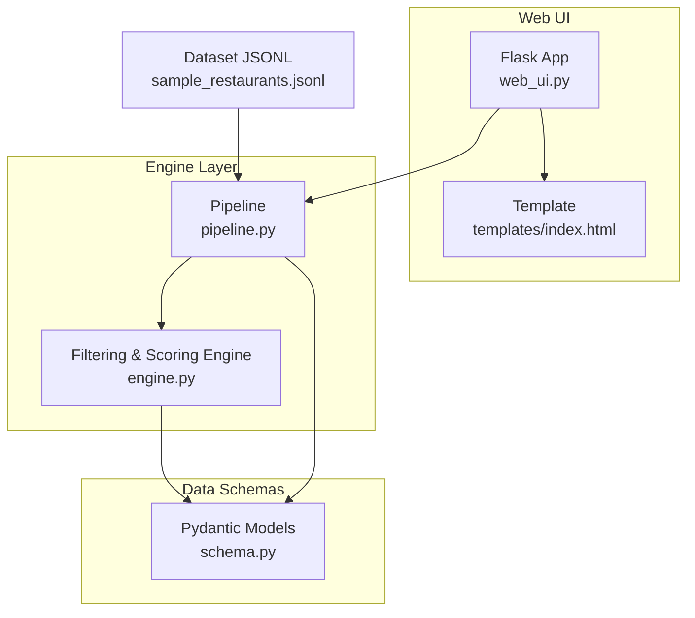
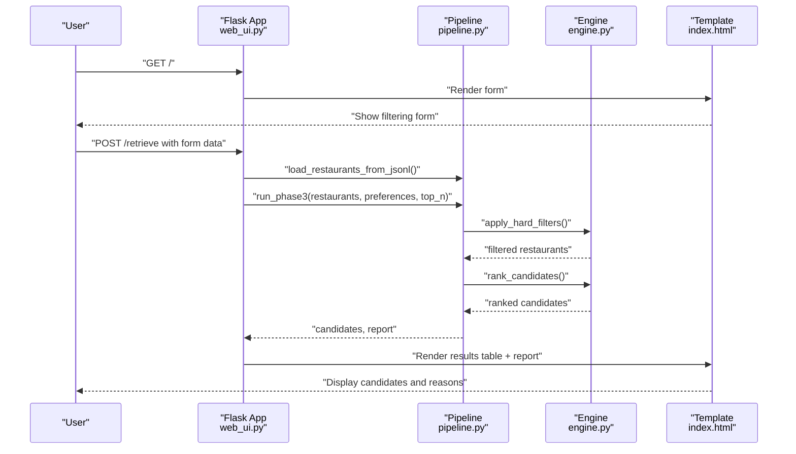
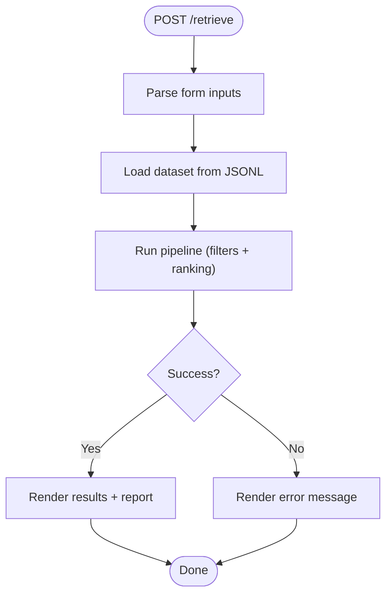
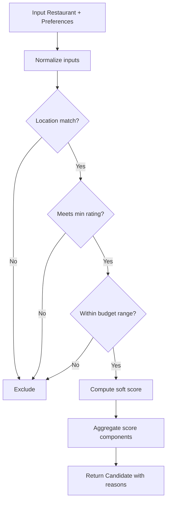
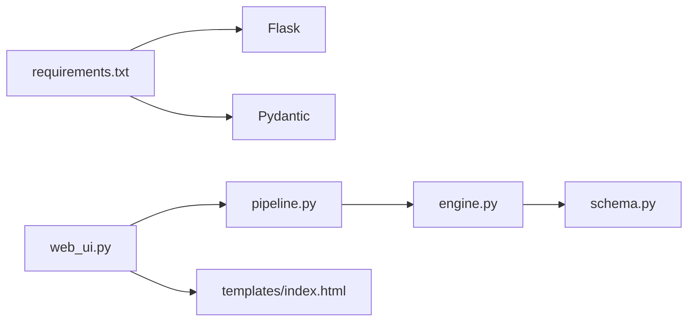

# Phase 3 Candidate Retrieval Web UI

<cite>
**Referenced Files in This Document**
- [web_ui.py](file://Zomato/architecture/phase_3_candidate_retrieval/web_ui.py)
- [engine.py](file://Zomato/architecture/phase_3_candidate_retrieval/engine.py)
- [pipeline.py](file://Zomato/architecture/phase_3_candidate_retrieval/pipeline.py)
- [schema.py](file://Zomato/architecture/phase_3_candidate_retrieval/schema.py)
- [index.html](file://Zomato/architecture/phase_3_candidate_retrieval/templates/index.html)
- [sample_restaurants.jsonl](file://Zomato/architecture/phase_3_candidate_retrieval/sample_restaurants.jsonl)
- [requirements.txt](file://Zomato/architecture/phase_3_candidate_retrieval/requirements.txt)
</cite>

## Table of Contents
1. [Introduction](#introduction)
2. [Project Structure](#project-structure)
3. [Core Components](#core-components)
4. [Architecture Overview](#architecture-overview)
5. [Detailed Component Analysis](#detailed-component-analysis)
6. [Dependency Analysis](#dependency-analysis)
7. [Performance Considerations](#performance-considerations)
8. [Troubleshooting Guide](#troubleshooting-guide)
9. [Conclusion](#conclusion)

## Introduction
This document describes the Phase 3 Candidate Retrieval web UI component responsible for filtering restaurants based on user preferences, applying soft matching scoring, and presenting ranked candidate results. The system integrates a Flask web interface with a backend filtering and scoring engine, delivering a clean, user-friendly form for specifying filtering criteria and displaying shortlisted candidates with transparency around scoring reasons.

## Project Structure
The Phase 3 Candidate Retrieval module consists of:
- A Flask web server that renders the filtering interface and displays results
- A filtering and scoring engine that applies hard filters and computes soft scores
- A pipeline that loads restaurant datasets, applies filters, deduplicates results, and ranks candidates
- Pydantic models defining the data schemas for user preferences, restaurant records, and scored candidates
- A Jinja2 HTML template rendering the filtering form and results table

**Diagram sources**
- [web_ui.py:1-58](file://Zomato/architecture/phase_3_candidate_retrieval/web_ui.py#L1-L58)
- [engine.py:1-118](file://Zomato/architecture/phase_3_candidate_retrieval/engine.py#L1-L118)
- [pipeline.py:1-51](file://Zomato/architecture/phase_3_candidate_retrieval/pipeline.py#L1-L51)
- [schema.py:1-35](file://Zomato/architecture/phase_3_candidate_retrieval/schema.py#L1-L35)
- [index.html:1-94](file://Zomato/architecture/phase_3_candidate_retrieval/templates/index.html#L1-L94)
- [sample_restaurants.jsonl:1-5](file://Zomato/architecture/phase_3_candidate_retrieval/sample_restaurants.jsonl#L1-L5)

**Section sources**
- [web_ui.py:1-58](file://Zomato/architecture/phase_3_candidate_retrieval/web_ui.py#L1-L58)
- [engine.py:1-118](file://Zomato/architecture/phase_3_candidate_retrieval/engine.py#L1-L118)
- [pipeline.py:1-51](file://Zomato/architecture/phase_3_candidate_retrieval/pipeline.py#L1-L51)
- [schema.py:1-35](file://Zomato/architecture/phase_3_candidate_retrieval/schema.py#L1-L35)
- [index.html:1-94](file://Zomato/architecture/phase_3_candidate_retrieval/templates/index.html#L1-L94)
- [sample_restaurants.jsonl:1-5](file://Zomato/architecture/phase_3_candidate_retrieval/sample_restaurants.jsonl#L1-L5)

## Core Components
- Web UI controller: Handles GET/POST routes, collects form inputs, invokes the pipeline, and renders results
- Filtering engine: Applies hard filters (location/rating/budget) and computes soft scores (cuisine overlap, optional preferences, rating, budget proximity)
- Pipeline: Loads dataset, validates preferences, applies hard filters, deduplicates candidates, ranks, and generates a report
- Data schemas: Strongly typed models for user preferences, restaurant records, and scored candidates
- Template: Renders the filtering form and results table with match reasons

Key responsibilities:
- User input collection and validation
- Dataset loading from JSONL
- Hard filtering and soft scoring
- Candidate ranking and reporting
- Transparent presentation of scoring reasons

**Section sources**
- [web_ui.py:14-49](file://Zomato/architecture/phase_3_candidate_retrieval/web_ui.py#L14-L49)
- [engine.py:23-117](file://Zomato/architecture/phase_3_candidate_retrieval/engine.py#L23-L117)
- [pipeline.py:13-50](file://Zomato/architecture/phase_3_candidate_retrieval/pipeline.py#L13-L50)
- [schema.py:10-35](file://Zomato/architecture/phase_3_candidate_retrieval/schema.py#L10-L35)
- [index.html:24-91](file://Zomato/architecture/phase_3_candidate_retrieval/templates/index.html#L24-L91)

## Architecture Overview
The system follows a layered architecture:
- Presentation layer: Flask routes and Jinja2 template
- Business logic layer: Filtering engine and pipeline
- Data layer: JSONL dataset and Pydantic models

**Diagram sources**
- [web_ui.py:14-49](file://Zomato/architecture/phase_3_candidate_retrieval/web_ui.py#L14-L49)
- [pipeline.py:24-50](file://Zomato/architecture/phase_3_candidate_retrieval/pipeline.py#L24-L50)
- [engine.py:23-117](file://Zomato/architecture/phase_3_candidate_retrieval/engine.py#L23-L117)
- [index.html:24-91](file://Zomato/architecture/phase_3_candidate_retrieval/templates/index.html#L24-L91)

## Detailed Component Analysis

### Web UI Controller
The Flask application exposes:
- GET "/" route: Renders the filtering form with empty result/report/error
- POST "/retrieve" route: Collects form inputs, loads dataset, runs pipeline, and renders results

Processing logic:
- Parses form fields: dataset path, location, budget, cuisines, min rating, optional preferences, top_n
- Validates numeric inputs and splits comma-separated fields
- Invokes pipeline to compute candidates and report
- Renders template with either results, report, or error

**Diagram sources**
- [web_ui.py:19-49](file://Zomato/architecture/phase_3_candidate_retrieval/web_ui.py#L19-L49)

**Section sources**
- [web_ui.py:14-49](file://Zomato/architecture/phase_3_candidate_retrieval/web_ui.py#L14-L49)
- [index.html:24-51](file://Zomato/architecture/phase_3_candidate_retrieval/templates/index.html#L24-L51)

### Filtering Engine
Hard filtering:
- Location: Case-insensitive substring match between user location and restaurant location
- Minimum rating: Filters restaurants below threshold
- Budget: Filters by cost-for-two against low/medium/high ranges

Soft scoring (Candidate):
- Cuisine similarity: Jaccard-like score based on normalized cuisine overlap
- Optional preferences: Keyword matches across restaurant name, cuisine, and extras
- Rating boost: Linear scaling of rating into score
- Budget proximity: Proximity to preferred budget center/wide range

Ranking:
- Scores candidates and returns top-N sorted descending

**Diagram sources**
- [engine.py:23-117](file://Zomato/architecture/phase_3_candidate_retrieval/engine.py#L23-L117)

**Section sources**
- [engine.py:23-117](file://Zomato/architecture/phase_3_candidate_retrieval/engine.py#L23-L117)

### Pipeline
Responsibilities:
- Load restaurants from JSONL file
- Validate user preferences
- Apply hard filters
- Deduplicate by restaurant name and location
- Rank candidates and produce a report with counts

Report fields:
- Input restaurants
- After hard filters
- After deduplication
- Output candidates
- Top N requested

**Section sources**
- [pipeline.py:13-50](file://Zomato/architecture/phase_3_candidate_retrieval/pipeline.py#L13-L50)

### Data Schemas
Strongly typed models ensure data integrity:
- UserPreferences: location, budget, cuisines, min_rating, optional_preferences
- RestaurantRecord: restaurant_name, location, cuisine, cost_for_two, rating, extras
- Candidate: restaurant attributes, score, match_reasons

Validation guarantees:
- Non-empty strings for required fields
- Budget constrained to low/medium/high
- Ratings within 0–5
- Cost-for-two non-negative

**Section sources**
- [schema.py:10-35](file://Zomato/architecture/phase_3_candidate_retrieval/schema.py#L10-L35)

### Template Rendering
The HTML template provides:
- Filtering form with labeled inputs for dataset path, location, budget, cuisines, min rating, optional preferences, and top_n
- Results table with columns: Name, Location, Cuisine, Rating, Cost for two, Score, Reasons
- Pipeline report display
- Error rendering with styled error container

User experience:
- Clear labeling and placeholders
- Numeric constraints for rating and top_n
- Responsive table layout for results

**Section sources**
- [index.html:24-91](file://Zomato/architecture/phase_3_candidate_retrieval/templates/index.html#L24-L91)

## Dependency Analysis
External dependencies:
- Flask: Web framework for routing and templating
- Pydantic: Data validation and serialization

Internal dependencies:
- web_ui.py depends on pipeline.py for data loading and candidate computation
- pipeline.py depends on engine.py for filtering and ranking
- engine.py depends on schema.py for typed models
- index.html depends on web_ui.py for rendering

**Diagram sources**
- [requirements.txt:1-3](file://Zomato/architecture/phase_3_candidate_retrieval/requirements.txt#L1-L3)
- [web_ui.py:9](file://Zomato/architecture/phase_3_candidate_retrieval/web_ui.py#L9)
- [pipeline.py:9](file://Zomato/architecture/phase_3_candidate_retrieval/pipeline.py#L9)
- [engine.py:7](file://Zomato/architecture/phase_3_candidate_retrieval/engine.py#L7)
- [schema.py:7](file://Zomato/architecture/phase_3_candidate_retrieval/schema.py#L7)

**Section sources**
- [requirements.txt:1-3](file://Zomato/architecture/phase_3_candidate_retrieval/requirements.txt#L1-L3)
- [web_ui.py:9](file://Zomato/architecture/phase_3_candidate_retrieval/web_ui.py#L9)
- [pipeline.py:9](file://Zomato/architecture/phase_3_candidate_retrieval/pipeline.py#L9)
- [engine.py:7](file://Zomato/architecture/phase_3_candidate_retrieval/engine.py#L7)
- [schema.py:7](file://Zomato/architecture/phase_3_candidate_retrieval/schema.py#L7)

## Performance Considerations
- Filtering complexity: O(N) pass over restaurants for hard filters and scoring
- Ranking complexity: O(M log M) where M is the number of filtered candidates
- Deduplication: O(M) set-based de-duplication by name+location
- Memory: Entire dataset loaded into memory; consider streaming for very large datasets
- Network: JSONL file path provided by user; ensure local access and valid path
- UI responsiveness: Results rendered server-side; consider client-side pagination for large result sets

## Troubleshooting Guide
Common issues and resolutions:
- Invalid dataset path: Ensure the path points to a valid JSONL file produced by Phase 1
- Validation errors: Verify form inputs meet constraints (rating 0–5, top_n ≥ 1)
- No candidates returned: Adjust filters (location, min_rating, budget) or increase top_n
- Duplicate entries: Deduplication occurs automatically by name and location
- Budget ranges: Low/medium/high thresholds are predefined; adjust expectations accordingly
- Error display: Errors are captured and shown in a styled error container

Operational tips:
- Use the sample dataset for quick testing
- Start broad with filters and refine incrementally
- Review the pipeline report to understand filtering impact

**Section sources**
- [web_ui.py:43-49](file://Zomato/architecture/phase_3_candidate_retrieval/web_ui.py#L43-L49)
- [pipeline.py:32-39](file://Zomato/architecture/phase_3_candidate_retrieval/pipeline.py#L32-L39)
- [index.html:53-56](file://Zomato/architecture/phase_3_candidate_retrieval/templates/index.html#L53-L56)

## Conclusion
The Phase 3 Candidate Retrieval web UI provides a transparent, user-driven filtering and ranking system. Users specify hard filtering criteria and receive ranked candidates with explicit scoring reasons. The backend engine applies robust hard filters and soft scoring, while the pipeline ensures data integrity and produces actionable reports. Together, these components deliver a practical foundation for restaurant discovery with clear visibility into the decision-making process.