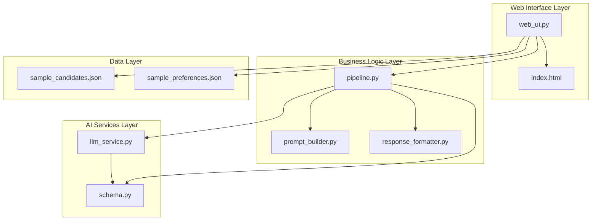
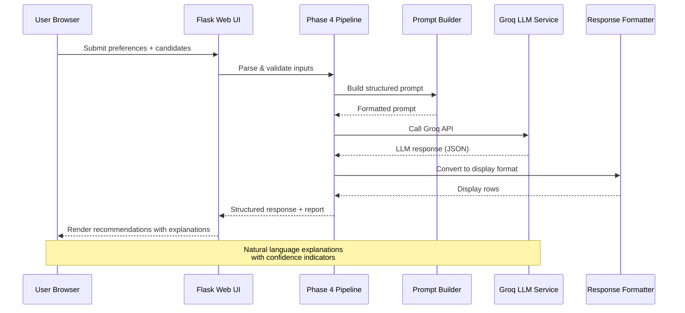
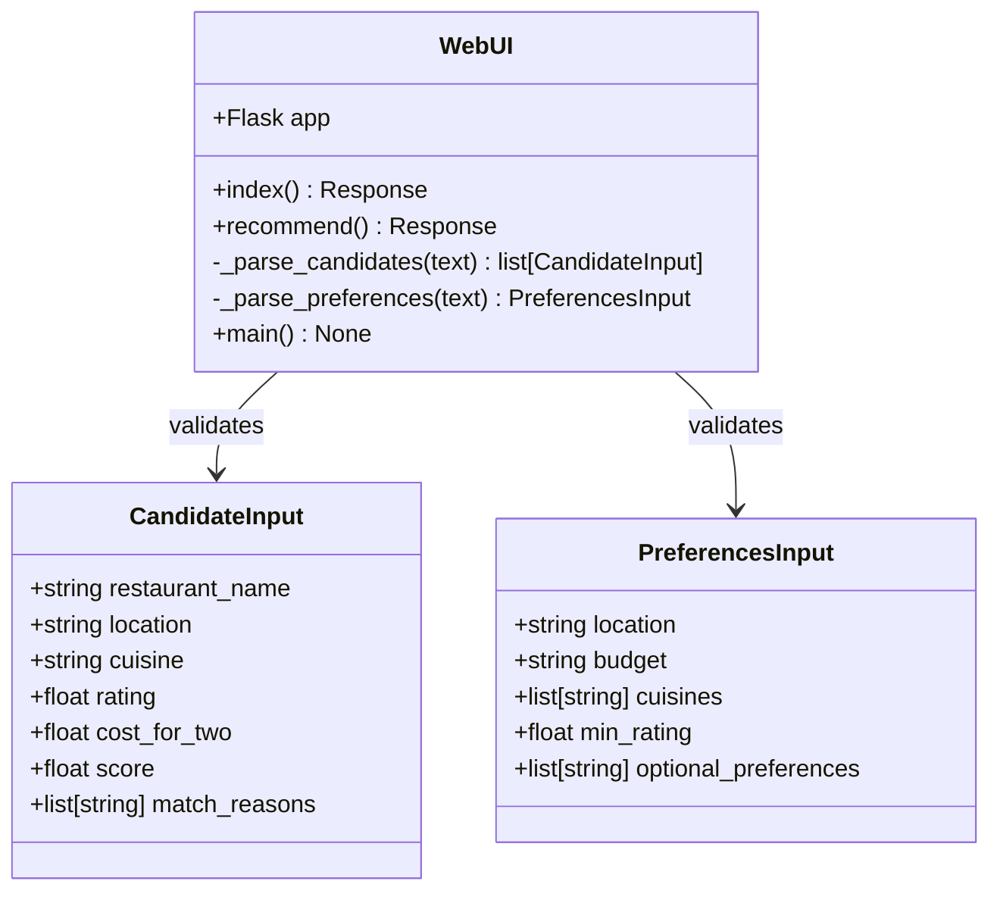
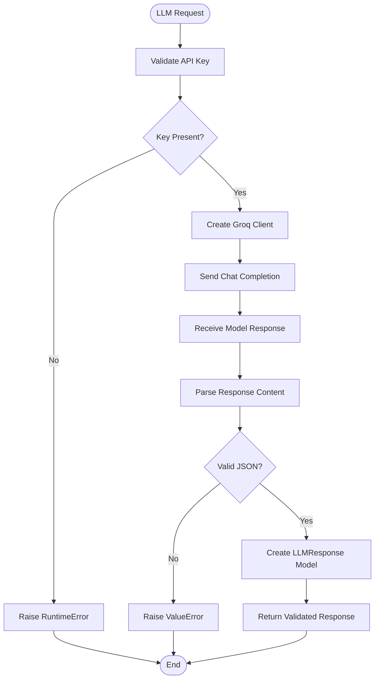
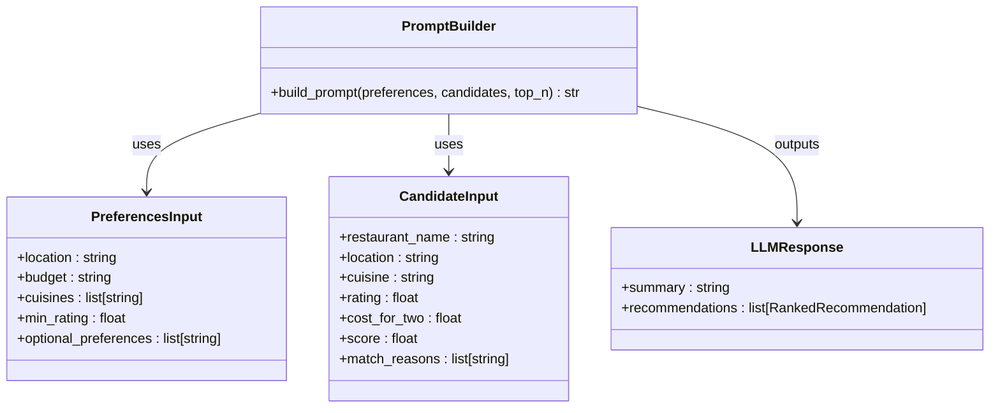
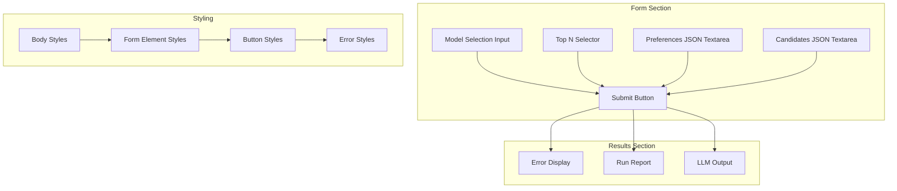
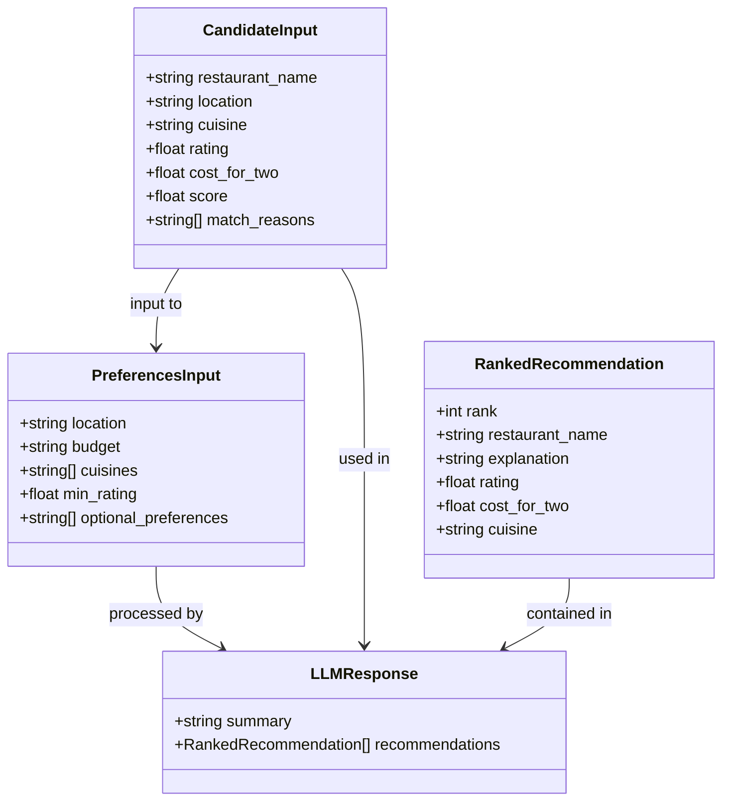
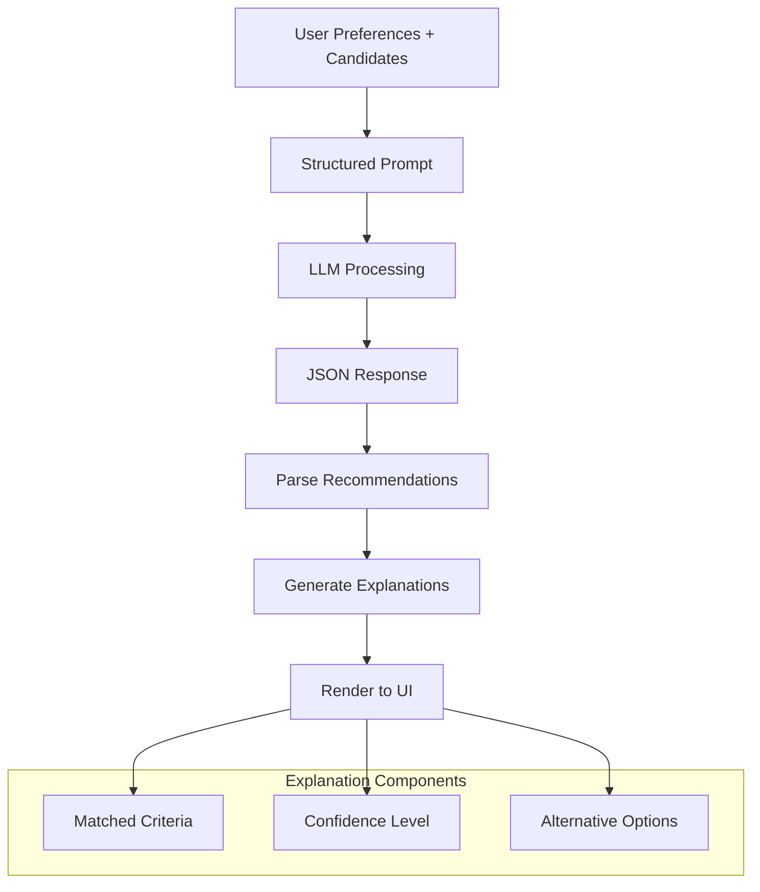
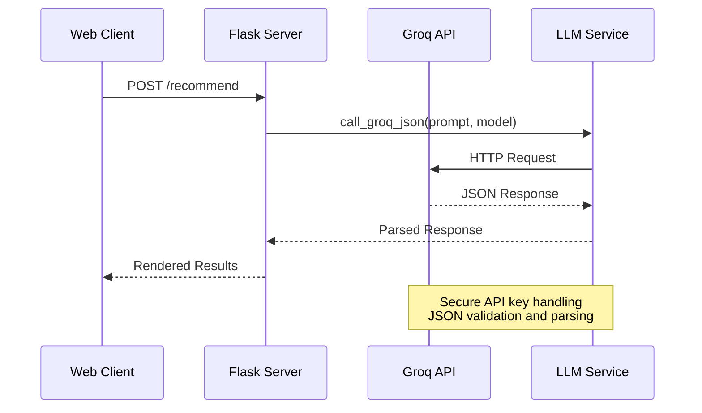

# Phase 4 LLM Recommendation Web UI

<cite>
**Referenced Files in This Document**
- [web_ui.py](file://Zomato/architecture/phase_4_llm_recommendation/web_ui.py)
- [llm_service.py](file://Zomato/architecture/phase_4_llm_recommendation/llm_service.py)
- [prompt_builder.py](file://Zomato/architecture/phase_4_llm_recommendation/prompt_builder.py)
- [response_formatter.py](file://Zomato/architecture/phase_4_llm_recommendation/response_formatter.py)
- [pipeline.py](file://Zomato/architecture/phase_4_llm_recommendation/pipeline.py)
- [schema.py](file://Zomato/architecture/phase_4_llm_recommendation/schema.py)
- [index.html](file://Zomato/architecture/phase_4_llm_recommendation/templates/index.html)
- [sample_candidates.json](file://Zomato/architecture/phase_4_llm_recommendation/sample_candidates.json)
- [sample_preferences.json](file://Zomato/architecture/phase_4_llm_recommendation/sample_preferences.json)
- [requirements.txt](file://Zomato/architecture/phase_4_llm_recommendation/requirements.txt)
</cite>

## Table of Contents
1. [Introduction](#introduction)
2. [Project Structure](#project-structure)
3. [Core Components](#core-components)
4. [Architecture Overview](#architecture-overview)
5. [Detailed Component Analysis](#detailed-component-analysis)
6. [UI Implementation Details](#ui-implementation-details)
7. [Recommendation Display System](#recommendation-display-system)
8. [Integration with Backend Services](#integration-with-backend-services)
9. [Performance Considerations](#performance-considerations)
10. [Troubleshooting Guide](#troubleshooting-guide)
11. [Conclusion](#conclusion)

## Introduction

The Phase 4 LLM Recommendation web UI component represents the fourth stage in the Zomato AI recommendation pipeline, implementing an AI-powered recommendation interface that displays ranked restaurant suggestions with natural language explanations. This component integrates with Groq's LLM services to process user preferences and candidate restaurants, generating human-readable recommendations with confidence indicators and detailed reasoning.

The system accepts shortlisted candidates from Phase 3 and user preferences, then leverages an LLM to rank and explain the most suitable dining options. The web interface presents results in an intuitive format with recommendation cards, detailed explanations, and interactive elements for user feedback collection.

## Project Structure

The Phase 4 implementation follows a modular architecture with clear separation of concerns:

**Diagram sources**
- [web_ui.py:1-108](file://Zomato/architecture/phase_4_llm_recommendation/web_ui.py#L1-L108)
- [pipeline.py:1-47](file://Zomato/architecture/phase_4_llm_recommendation/pipeline.py#L1-L47)
- [llm_service.py:1-43](file://Zomato/architecture/phase_4_llm_recommendation/llm_service.py#L1-L43)

**Section sources**
- [web_ui.py:1-108](file://Zomato/architecture/phase_4_llm_recommendation/web_ui.py#L1-L108)
- [pipeline.py:1-47](file://Zomato/architecture/phase_4_llm_recommendation/pipeline.py#L1-L47)

## Core Components

The Phase 4 system consists of several interconnected components working together to deliver AI-powered restaurant recommendations:

### Web Application Interface
The Flask-based web application serves as the primary user interface, handling form submissions, processing requests, and rendering results. It provides default sample data for demonstration purposes and validates user input through Pydantic models.

### LLM Service Integration
The Groq LLM service wrapper manages communication with external AI services, handling API authentication, request formatting, and response parsing. It implements robust error handling for network issues and malformed responses.

### Prompt Engineering System
The prompt builder constructs context-rich prompts that guide the LLM toward generating structured, JSON-formatted recommendations with detailed explanations.

### Response Processing Pipeline
The pipeline orchestrates the complete recommendation workflow, from input validation through LLM interaction to result formatting and reporting.

**Section sources**
- [web_ui.py:15-108](file://Zomato/architecture/phase_4_llm_recommendation/web_ui.py#L15-L108)
- [llm_service.py:15-43](file://Zomato/architecture/phase_4_llm_recommendation/llm_service.py#L15-L43)
- [prompt_builder.py:10-45](file://Zomato/architecture/phase_4_llm_recommendation/prompt_builder.py#L10-L45)
- [pipeline.py:29-47](file://Zomato/architecture/phase_4_llm_recommendation/pipeline.py#L29-L47)

## Architecture Overview

The system implements a clean architecture pattern with clear boundaries between presentation, business logic, and data access layers:

**Diagram sources**
- [web_ui.py:73-99](file://Zomato/architecture/phase_4_llm_recommendation/web_ui.py#L73-L99)
- [pipeline.py:29-47](file://Zomato/architecture/phase_4_llm_recommendation/pipeline.py#L29-L47)
- [llm_service.py:19-43](file://Zomato/architecture/phase_4_llm_recommendation/llm_service.py#L19-L43)

The architecture ensures scalability and maintainability through:
- **Separation of Concerns**: Each component has a single responsibility
- **Input Validation**: Pydantic models ensure data integrity
- **Error Handling**: Comprehensive exception management
- **Extensibility**: Easy to swap LLM providers or modify prompt engineering

## Detailed Component Analysis

### Web UI Application (`web_ui.py`)

The Flask application serves as the primary interface for user interaction, implementing both GET and POST endpoints for form display and recommendation processing.

**Diagram sources**
- [web_ui.py:16-28](file://Zomato/architecture/phase_4_llm_recommendation/web_ui.py#L16-L28)
- [schema.py:8-24](file://Zomato/architecture/phase_4_llm_recommendation/schema.py#L8-L24)

Key features include:
- **Default Data Provision**: Sample preferences and candidates for demonstration
- **Input Validation**: JSON parsing with Pydantic model validation
- **Error Management**: Comprehensive exception handling with detailed error reporting
- **Template Rendering**: Dynamic content generation with Jinja2 templating

**Section sources**
- [web_ui.py:30-108](file://Zomato/architecture/phase_4_llm_recommendation/web_ui.py#L30-L108)

### LLM Service Integration (`llm_service.py`)

The Groq service wrapper provides a robust interface for AI model interactions, implementing secure API key management and response validation.

**Diagram sources**
- [llm_service.py:19-43](file://Zomato/architecture/phase_4_llm_recommendation/llm_service.py#L19-L43)

**Section sources**
- [llm_service.py:15-43](file://Zomato/architecture/phase_4_llm_recommendation/llm_service.py#L15-L43)

### Prompt Engineering System (`prompt_builder.py`)

The prompt builder creates structured, context-rich prompts that guide the LLM toward generating high-quality recommendations with specific explanations.

**Diagram sources**
- [prompt_builder.py:10-45](file://Zomato/architecture/phase_4_llm_recommendation/prompt_builder.py#L10-L45)
- [schema.py:18-38](file://Zomato/architecture/phase_4_llm_recommendation/schema.py#L18-L38)

**Section sources**
- [prompt_builder.py:10-45](file://Zomato/architecture/phase_4_llm_recommendation/prompt_builder.py#L10-L45)

### Response Processing Pipeline (`pipeline.py`)

The pipeline coordinates the complete recommendation workflow, ensuring data flows properly through each processing stage.

**Section sources**
- [pipeline.py:29-47](file://Zomato/architecture/phase_4_llm_recommendation/pipeline.py#L29-L47)

## UI Implementation Details

### Template Structure (`index.html`)

The HTML template provides a clean, responsive interface for user interaction with the recommendation system.

**Diagram sources**
- [index.html:22-51](file://Zomato/architecture/phase_4_llm_recommendation/templates/index.html#L22-L51)

The template implements:
- **Responsive Design**: Mobile-friendly layout with system-ui fonts
- **Input Validation**: Real-time JSON validation through Pydantic models
- **Error Display**: Color-coded error messages with scrollable preformatted text
- **Dynamic Content**: Conditional rendering based on request results

**Section sources**
- [index.html:1-54](file://Zomato/architecture/phase_4_llm_recommendation/templates/index.html#L1-L54)

### Data Models (`schema.py`)

The Pydantic models define the structured data formats used throughout the recommendation pipeline.

**Diagram sources**
- [schema.py:8-38](file://Zomato/architecture/phase_4_llm_recommendation/schema.py#L8-L38)

**Section sources**
- [schema.py:1-38](file://Zomato/architecture/phase_4_llm_recommendation/schema.py#L1-L38)

## Recommendation Display System

### Recommendation Card Layout

The system generates structured recommendation cards containing essential information for user evaluation:

| Component | Description | Data Source |
|-----------|-------------|-------------|
| **Rank Indicator** | Position in recommendation hierarchy | `rank` field |
| **Restaurant Name** | Establishment identifier | `restaurant_name` |
| **Cuisine Types** | Food categories served | `cuisine` |
| **Rating Display** | Quality assessment | `rating` |
| **Cost Information** | Price range indicator | `cost_for_two` |
| **Explanation Text** | AI-generated reasoning | `explanation` |

### Explanation Rendering

The LLM generates natural language explanations that provide transparency into recommendation decisions:

**Diagram sources**
- [prompt_builder.py:13-44](file://Zomato/architecture/phase_4_llm_recommendation/prompt_builder.py#L13-L44)
- [response_formatter.py:8-22](file://Zomato/architecture/phase_4_llm_recommendation/response_formatter.py#L8-L22)

### Confidence Indicators

The system incorporates confidence mechanisms through multiple channels:

1. **Rank-Based Confidence**: Higher-ranked items indicate stronger matches
2. **Explanation Quality**: Detailed reasoning correlates with recommendation reliability
3. **Score Integration**: Previous scoring from candidate retrieval influences final rankings

**Section sources**
- [response_formatter.py:8-22](file://Zomato/architecture/phase_4_llm_recommendation/response_formatter.py#L8-L22)

## Integration with Backend Services

### API Communication Flow

The system integrates with external services through well-defined interfaces:

**Diagram sources**
- [web_ui.py:73-99](file://Zomato/architecture/phase_4_llm_recommendation/web_ui.py#L73-L99)
- [llm_service.py:19-43](file://Zomato/architecture/phase_4_llm_recommendation/llm_service.py#L19-L43)

### Environment Configuration

The system requires proper environment setup for secure API access:

| Configuration | Purpose | Required |
|---------------|---------|----------|
| `GROQ_API_KEY` | Authentication for Groq services | Yes |
| `FLASK_ENV` | Application environment setting | Optional |
| `DEBUG` | Development mode flag | Optional |

**Section sources**
- [llm_service.py:15-16](file://Zomato/architecture/phase_4_llm_recommendation/llm_service.py#L15-L16)
- [requirements.txt:1-5](file://Zomato/architecture/phase_4_llm_recommendation/requirements.txt#L1-L5)

## Performance Considerations

### Response Time Optimization

The system implements several strategies to minimize latency:

- **Asynchronous Processing**: Non-blocking API calls to external services
- **Input Caching**: Reuse of validated inputs to avoid redundant processing
- **Efficient JSON Parsing**: Minimal data transformation during processing
- **Template Caching**: Static content rendering optimization

### Scalability Features

- **Modular Design**: Independent components enable parallel processing
- **Error Isolation**: Fault-tolerant architecture prevents cascading failures
- **Resource Management**: Proper cleanup of external service connections
- **Memory Optimization**: Efficient data structures for large recommendation sets

## Troubleshooting Guide

### Common Issues and Solutions

| Issue | Symptoms | Solution |
|-------|----------|----------|
| **Missing API Key** | Runtime error during LLM calls | Set `GROQ_API_KEY` environment variable |
| **Invalid JSON Input** | Validation errors in forms | Ensure proper JSON formatting for preferences and candidates |
| **Network Timeout** | LLM service unresponsive | Check internet connection and API rate limits |
| **Empty Results** | No recommendations returned | Verify candidate list contains valid entries |
| **Template Rendering Errors** | Display issues in browser | Check Flask template syntax and variable binding |

### Debugging Strategies

1. **Enable Debug Mode**: Set `debug=True` in development environments
2. **Log Processing Steps**: Monitor pipeline execution flow
3. **Validate Input Data**: Use sample files for testing
4. **Test API Connectivity**: Verify external service access
5. **Monitor Resource Usage**: Track memory and CPU consumption

**Section sources**
- [web_ui.py:91-99](file://Zomato/architecture/phase_4_llm_recommendation/web_ui.py#L91-L99)
- [llm_service.py:20-22](file://Zomato/architecture/phase_4_llm_recommendation/llm_service.py#L20-L22)

## Conclusion

The Phase 4 LLM Recommendation web UI component successfully implements an AI-powered recommendation system that bridges the gap between structured data and human-readable insights. Through its modular architecture, robust error handling, and clean user interface, the system provides transparent, explainable recommendations that enhance the user dining experience.

Key achievements include:
- **Structured Recommendation Generation**: AI-driven ranking with detailed explanations
- **User-Centric Interface**: Intuitive form-based interaction with real-time feedback
- **Robust Integration**: Secure API connectivity with comprehensive error handling
- **Scalable Architecture**: Modular design supporting future enhancements and provider switching

The implementation demonstrates best practices in AI application development, combining technical excellence with user experience considerations to deliver a production-ready recommendation system.