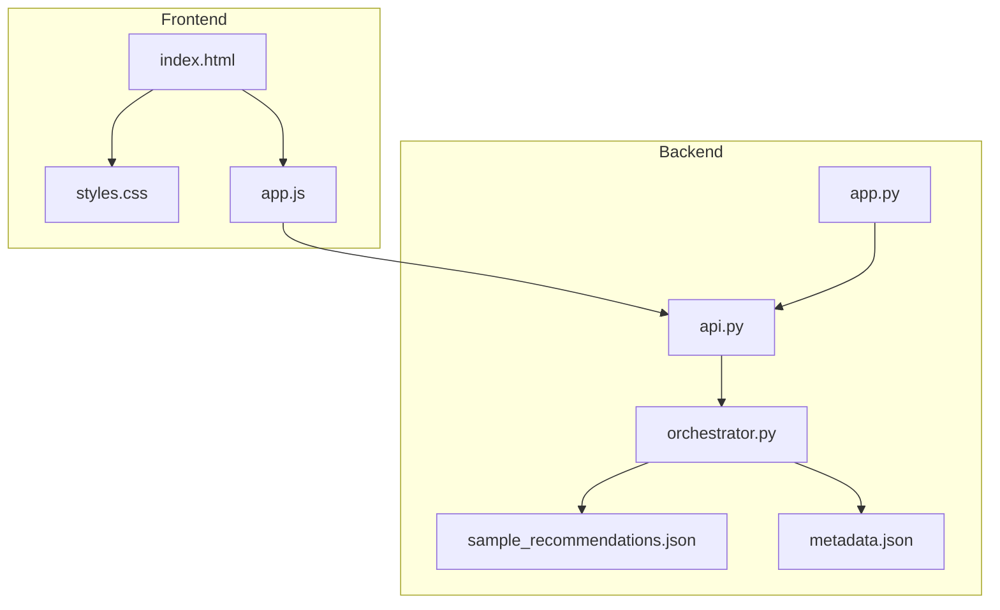
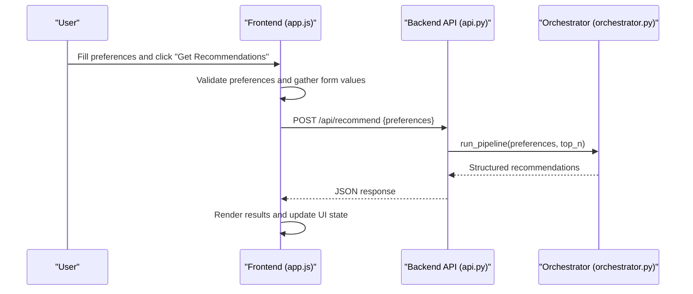
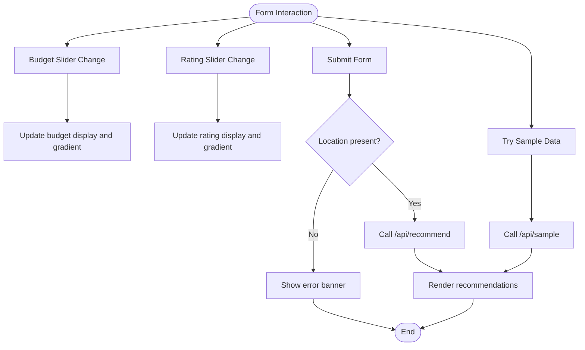
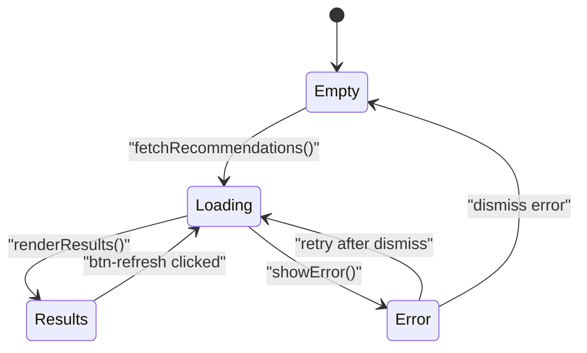
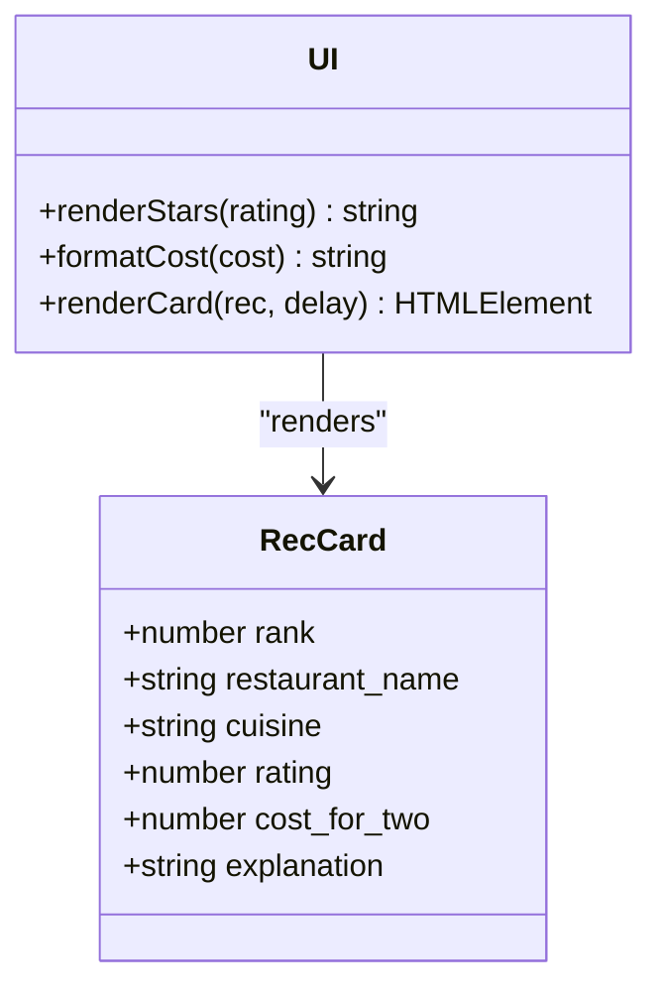
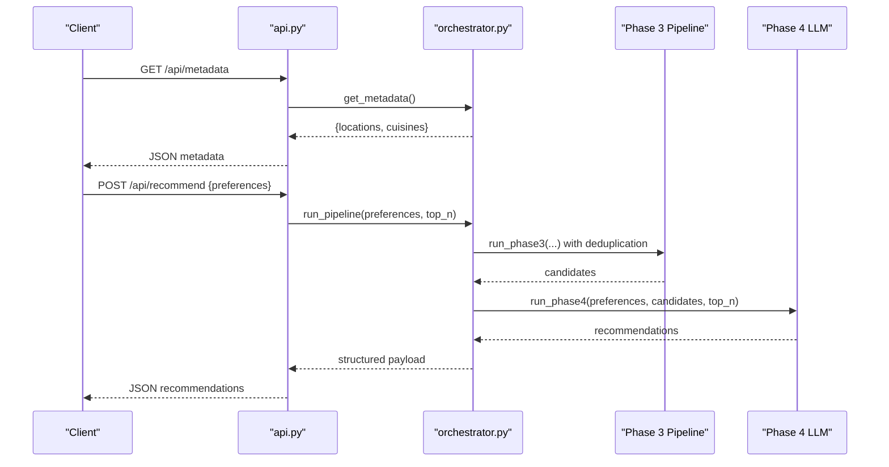
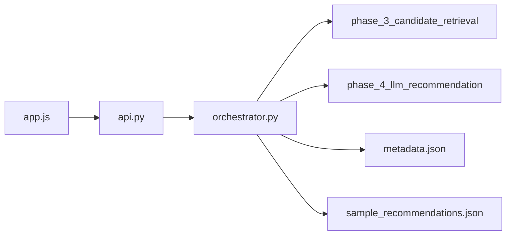

# Phase 5 Web UI

<cite>
**Referenced Files in This Document**
- [index.html](file://Zomato/architecture/phase_5_response_delivery/frontend/index.html)
- [app.js](file://Zomato/architecture/phase_5_response_delivery/frontend/js/app.js)
- [styles.css](file://Zomato/architecture/phase_5_response_delivery/frontend/css/styles.css)
- [api.py](file://Zomato/architecture/phase_5_response_delivery/backend/api.py)
- [app.py](file://Zomato/architecture/phase_5_response_delivery/backend/app.py)
- [orchestrator.py](file://Zomato/architecture/phase_5_response_delivery/backend/orchestrator.py)
- [__main__.py](file://Zomato/architecture/phase_5_response_delivery/__main__.py)
- [sample_recommendations.json](file://Zomato/architecture/phase_5_response_delivery/sample_recommendations.json)
- [metadata.json](file://Zomato/architecture/phase_5_response_delivery/metadata.json)
- [generate_metadata.py](file://Zomato/architecture/phase_5_response_delivery/generate_metadata.py)
- [requirements.txt](file://Zomato/architecture/phase_5_response_delivery/requirements.txt)
</cite>

## Table of Contents
1. [Introduction](#introduction)
2. [Project Structure](#project-structure)
3. [Core Components](#core-components)
4. [Architecture Overview](#architecture-overview)
5. [Detailed Component Analysis](#detailed-component-analysis)
6. [Dependency Analysis](#dependency-analysis)
7. [Performance Considerations](#performance-considerations)
8. [Troubleshooting Guide](#troubleshooting-guide)
9. [Conclusion](#conclusion)

## Introduction
This document describes the Phase 5 Response Delivery web UI component of the Zomato AI recommendation system. It covers the interactive recommendation interface, preference capture, results presentation, and the underlying backend orchestration. The frontend provides a modern dark-themed interface with real-time preference updates, animated recommendation cards, and robust error handling. The backend integrates Phase 3 candidate retrieval and Phase 4 LLM ranking to deliver personalized restaurant recommendations.

## Project Structure
The Phase 5 Response Delivery is organized into frontend and backend components:
- Frontend: HTML template, CSS styling, and JavaScript logic for UI interactions and API communication
- Backend: Flask application with REST endpoints, orchestration logic, and metadata generation

**Diagram sources**
- [index.html:1-198](file://Zomato/architecture/phase_5_response_delivery/frontend/index.html#L1-L198)
- [styles.css:1-602](file://Zomato/architecture/phase_5_response_delivery/frontend/css/styles.css#L1-L602)
- [app.js:1-278](file://Zomato/architecture/phase_5_response_delivery/frontend/js/app.js#L1-L278)
- [app.py:1-41](file://Zomato/architecture/phase_5_response_delivery/backend/app.py#L1-L41)
- [api.py:1-84](file://Zomato/architecture/phase_5_response_delivery/backend/api.py#L1-L84)
- [orchestrator.py:1-292](file://Zomato/architecture/phase_5_response_delivery/backend/orchestrator.py#L1-L292)
- [sample_recommendations.json:1-53](file://Zomato/architecture/phase_5_response_delivery/sample_recommendations.json#L1-L53)
- [metadata.json:1-196](file://Zomato/architecture/phase_5_response_delivery/metadata.json#L1-L196)

**Section sources**
- [index.html:1-198](file://Zomato/architecture/phase_5_response_delivery/frontend/index.html#L1-L198)
- [app.py:1-41](file://Zomato/architecture/phase_5_response_delivery/backend/app.py#L1-L41)

## Core Components
- Preference Panel: Collects user preferences including location, budget, cuisine, minimum rating, optional preferences, and number of results
- Results Panel: Displays empty state, skeleton loaders during loading, error banners, and recommendation cards
- Interactive JavaScript: Handles form validation, real-time updates, API communication, and dynamic rendering
- CSS Styling: Implements dark theme, glassmorphism, responsive design, animations, and accessibility features
- Backend Orchestration: Integrates Phase 3 and Phase 4 components, falls back to sample data when necessary

**Section sources**
- [index.html:41-138](file://Zomato/architecture/phase_5_response_delivery/frontend/index.html#L41-L138)
- [app.js:61-74](file://Zomato/architecture/phase_5_response_delivery/frontend/js/app.js#L61-L74)
- [styles.css:148-174](file://Zomato/architecture/phase_5_response_delivery/frontend/css/styles.css#L148-L174)
- [api.py:41-84](file://Zomato/architecture/phase_5_response_delivery/backend/api.py#L41-L84)
- [orchestrator.py:112-292](file://Zomato/architecture/phase_5_response_delivery/backend/orchestrator.py#L112-L292)

## Architecture Overview
The system follows a client-server architecture:
- The frontend renders the recommendation interface and communicates with the backend via REST endpoints
- The backend orchestrates recommendation pipeline stages and returns structured results
- The UI manages state transitions and user interactions

**Diagram sources**
- [app.js:224-236](file://Zomato/architecture/phase_5_response_delivery/frontend/js/app.js#L224-L236)
- [api.py:41-84](file://Zomato/architecture/phase_5_response_delivery/backend/api.py#L41-L84)
- [orchestrator.py:112-292](file://Zomato/architecture/phase_5_response_delivery/backend/orchestrator.py#L112-L292)

## Detailed Component Analysis

### Preference Panel
The preference panel captures user inputs and provides real-time feedback:
- Location dropdown populated from metadata
- Budget slider with live display and gradient indicator
- Cuisine dropdown with "Any Cuisine" option
- Minimum rating slider with live display and gradient indicator
- Optional preferences input field for comma-separated tags
- Top-N results selector
- Submit and sample buttons

**Diagram sources**
- [app.js:34-53](file://Zomato/architecture/phase_5_response_delivery/frontend/js/app.js#L34-L53)
- [app.js:224-236](file://Zomato/architecture/phase_5_response_delivery/frontend/js/app.js#L224-L236)
- [app.js:208-222](file://Zomato/architecture/phase_5_response_delivery/frontend/js/app.js#L208-L222)

**Section sources**
- [index.html:41-138](file://Zomato/architecture/phase_5_response_delivery/frontend/index.html#L41-L138)
- [app.js:34-53](file://Zomato/architecture/phase_5_response_delivery/frontend/js/app.js#L34-L53)
- [app.js:61-74](file://Zomato/architecture/phase_5_response_delivery/frontend/js/app.js#L61-L74)

### Results Panel
The results panel manages four distinct states:
- Empty state: Initial greeting and instructions
- Loading skeletons: Animated placeholders while fetching recommendations
- Error banner: User-facing error messages with dismiss action
- Results content: Summary, source badge, refresh button, and recommendation cards

**Diagram sources**
- [app.js:76-90](file://Zomato/architecture/phase_5_response_delivery/frontend/js/app.js#L76-L90)
- [app.js:161-179](file://Zomato/architecture/phase_5_response_delivery/frontend/js/app.js#L161-L179)
- [app.js:181-205](file://Zomato/architecture/phase_5_response_delivery/frontend/js/app.js#L181-L205)

**Section sources**
- [index.html:140-187](file://Zomato/architecture/phase_5_response_delivery/frontend/index.html#L140-L187)
- [app.js:76-90](file://Zomato/architecture/phase_5_response_delivery/frontend/js/app.js#L76-L90)
- [styles.css:331-394](file://Zomato/architecture/phase_5_response_delivery/frontend/css/styles.css#L331-L394)

### Recommendation Cards
Each recommendation card displays:
- Rank badge (special styling for rank 1)
- Restaurant name and cuisine
- Star ratings with half-star support
- Cost for two formatted for Indian locale
- Explanation from the recommendation pipeline

**Diagram sources**
- [app.js:92-150](file://Zomato/architecture/phase_5_response_delivery/frontend/js/app.js#L92-L150)
- [app.js:106-110](file://Zomato/architecture/phase_5_response_delivery/frontend/js/app.js#L106-L110)

**Section sources**
- [app.js:92-150](file://Zomato/architecture/phase_5_response_delivery/frontend/js/app.js#L92-L150)
- [styles.css:454-574](file://Zomato/architecture/phase_5_response_delivery/frontend/css/styles.css#L454-L574)

### Backend Orchestration
The backend orchestrates recommendation delivery:
- Health check endpoint for service verification
- Metadata endpoint for locations and cuisines
- Recommendation endpoint validating preferences and invoking pipeline
- Orchestrator integrating Phase 3 and Phase 4, with fallback to sample data

**Diagram sources**
- [api.py:32-84](file://Zomato/architecture/phase_5_response_delivery/backend/api.py#L32-L84)
- [orchestrator.py:85-292](file://Zomato/architecture/phase_5_response_delivery/backend/orchestrator.py#L85-L292)

**Section sources**
- [api.py:18-84](file://Zomato/architecture/phase_5_response_delivery/backend/api.py#L18-L84)
- [orchestrator.py:112-292](file://Zomato/architecture/phase_5_response_delivery/backend/orchestrator.py#L112-L292)
- [sample_recommendations.json:1-53](file://Zomato/architecture/phase_5_response_delivery/sample_recommendations.json#L1-L53)
- [metadata.json:1-196](file://Zomato/architecture/phase_5_response_delivery/metadata.json#L1-L196)

## Dependency Analysis
The frontend and backend communicate through REST endpoints. The backend depends on:
- Phase 3 candidate retrieval pipeline
- Phase 4 LLM ranking pipeline
- Metadata generation and caching
- Environment configuration for external services

**Diagram sources**
- [app.js:181-205](file://Zomato/architecture/phase_5_response_delivery/frontend/js/app.js#L181-L205)
- [api.py:11-11](file://Zomato/architecture/phase_5_response_delivery/backend/api.py#L11-L11)
- [orchestrator.py:136-292](file://Zomato/architecture/phase_5_response_delivery/backend/orchestrator.py#L136-L292)

**Section sources**
- [requirements.txt:1-6](file://Zomato/architecture/phase_5_response_delivery/requirements.txt#L1-L6)
- [app.py:14-41](file://Zomato/architecture/phase_5_response_delivery/backend/app.py#L14-L41)

## Performance Considerations
- Real-time sliders update immediately without server round-trips, reducing latency
- Skeleton loaders provide perceived performance during network requests
- Animation delays stagger card appearances for smoother UX
- Responsive grid layout adapts to mobile and tablet screens
- Gradient indicators on sliders provide immediate visual feedback for user selections

## Troubleshooting Guide
Common issues and resolutions:
- Missing GROQ API key: The backend falls back to Phase 3 ranked candidates and returns a "phase3_only" source badge
- No Phase 1 dataset available: The orchestrator loads sample recommendations and sets source to "sample"
- Network errors: The frontend shows an error banner with dismiss action and resets to empty state
- Invalid preferences: The backend validates required fields and returns descriptive error messages

**Section sources**
- [orchestrator.py:266-291](file://Zomato/architecture/phase_5_response_delivery/backend/orchestrator.py#L266-L291)
- [api.py:56-67](file://Zomato/architecture/phase_5_response_delivery/backend/api.py#L56-L67)
- [app.js:187-204](file://Zomato/architecture/phase_5_response_delivery/frontend/js/app.js#L187-L204)

## Conclusion
The Phase 5 Response Delivery component delivers a polished, responsive recommendation interface that integrates seamlessly with the backend orchestration. Its real-time preference updates, graceful error handling, and visually appealing card-based results provide an excellent user experience while maintaining robust fallbacks for reliability.