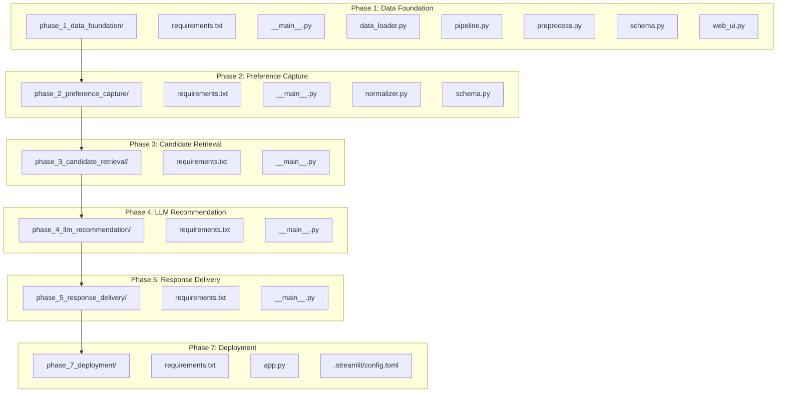
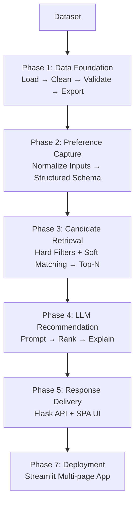
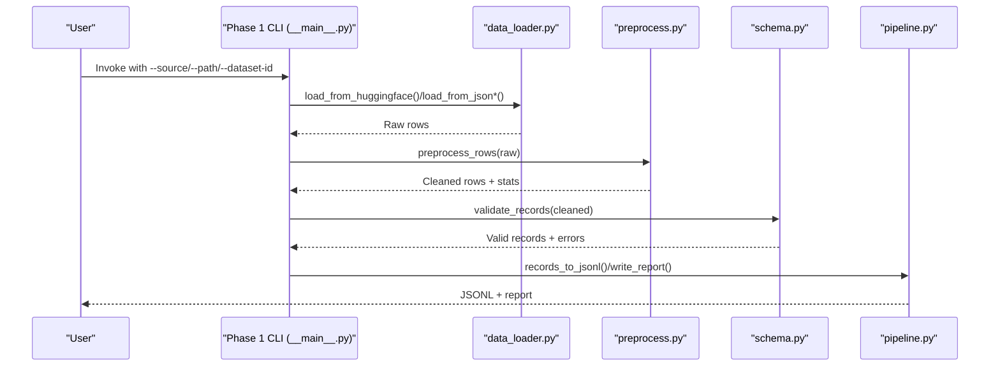
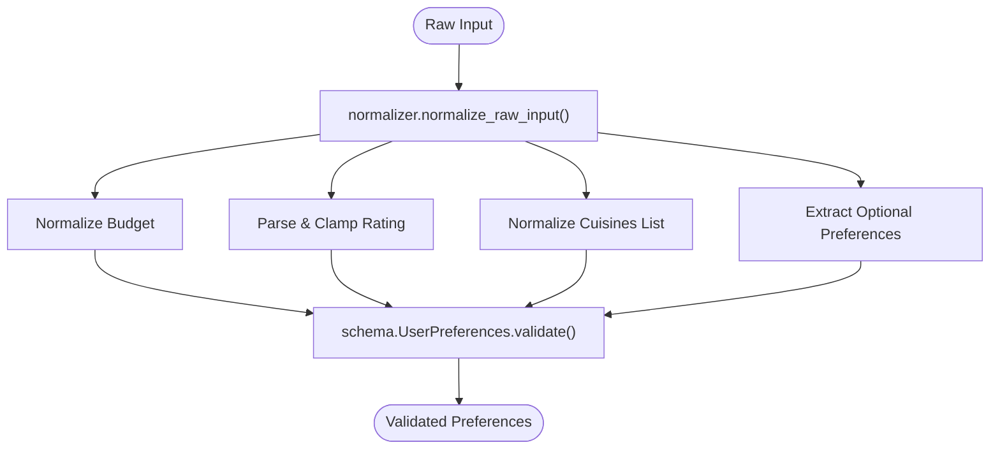
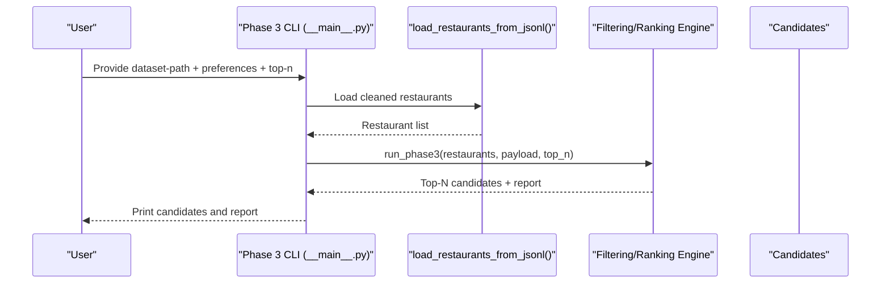
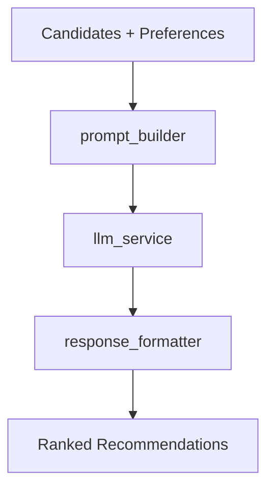
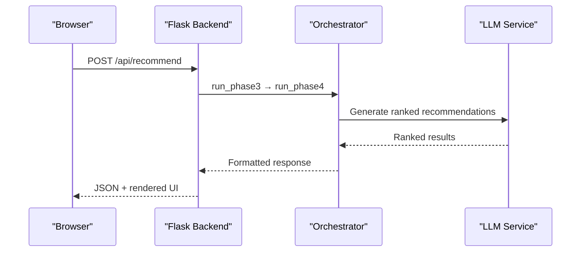
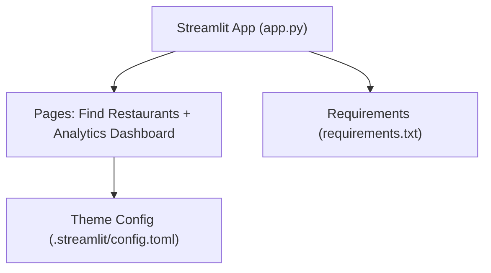
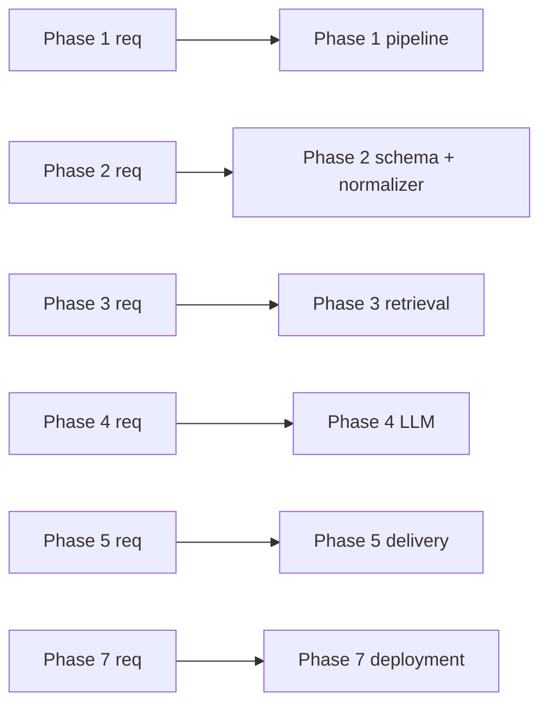

# Getting Started

<cite>
**Referenced Files in This Document**
- [phase-wise-architecture.md](file://architecture/phase-wise-architecture.md)
- [requirements.txt](file://architecture/phase_1_data_foundation/requirements.txt)
- [__main__.py](file://architecture/phase_1_data_foundation/__main__.py)
- [data_loader.py](file://architecture/phase_1_data_foundation/data_loader.py)
- [pipeline.py](file://architecture/phase_1_data_foundation/pipeline.py)
- [preprocess.py](file://architecture/phase_1_data_foundation/preprocess.py)
- [schema.py](file://architecture/phase_1_data_foundation/schema.py)
- [web_ui.py](file://architecture/phase_1_data_foundation/web_ui.py)
- [requirements.txt](file://architecture/phase_2_preference_capture/requirements.txt)
- [__main__.py](file://architecture/phase_2_preference_capture/__main__.py)
- [normalizer.py](file://architecture/phase_2_preference_capture/normalizer.py)
- [schema.py](file://architecture/phase_2_preference_capture/schema.py)
- [requirements.txt](file://architecture/phase_3_candidate_retrieval/requirements.txt)
- [__main__.py](file://architecture/phase_3_candidate_retrieval/__main__.py)
- [requirements.txt](file://architecture/phase_4_llm_recommendation/requirements.txt)
- [__main__.py](file://architecture/phase_4_llm_recommendation/__main__.py)
- [requirements.txt](file://architecture/phase_5_response_delivery/requirements.txt)
- [__main__.py](file://architecture/phase_5_response_delivery/__main__.py)
- [requirements.txt](file://architecture/phase_7_deployment/requirements.txt)
- [app.py](file://architecture/phase_7_deployment/app.py)
- [.streamlit/config.toml](file://architecture/phase_7_deployment/.streamlit/config.toml)
</cite>

## Table of Contents
1. [Introduction](#introduction)
2. [Project Structure](#project-structure)
3. [Core Components](#core-components)
4. [Architecture Overview](#architecture-overview)
5. [Detailed Component Analysis](#detailed-component-analysis)
6. [Dependency Analysis](#dependency-analysis)
7. [Performance Considerations](#performance-considerations)
8. [Troubleshooting Guide](#troubleshooting-guide)
9. [Conclusion](#conclusion)
10. [Appendices](#appendices)

## Introduction
This guide helps you install, configure, and run the Zomato AI Recommendation System from the ground up. It covers environment setup, dependency management per phase, initial project structure, and how to execute each phase using its __main__.py entry point. You will also learn how to run the end-to-end recommendation pipeline from data foundation through deployment, along with prerequisites, environment variables, and initial validation steps.

Prerequisites:
- Python programming fundamentals
- Web development basics (Flask, HTML/CSS/JS)
- Machine learning and NLP concepts (for understanding LLM prompting and ranking)

## Project Structure
The system is organized into seven phases, each with its own folder, dependencies, and entry point. Each phase builds upon the previous one and produces artifacts consumed by later phases.

**Diagram sources**
- [phase-wise-architecture.md:1-113](file://architecture/phase-wise-architecture.md#L1-L113)
- [__main__.py:1-54](file://architecture/phase_1_data_foundation/__main__.py#L1-L54)
- [__main__.py:1-46](file://architecture/phase_2_preference_capture/__main__.py#L1-L46)
- [__main__.py:1-51](file://architecture/phase_3_candidate_retrieval/__main__.py#L1-L51)
- [__main__.py](file://architecture/phase_4_llm_recommendation/__main__.py)
- [__main__.py](file://architecture/phase_5_response_delivery/__main__.py)
- [app.py](file://architecture/phase_7_deployment/app.py)
- [.streamlit/config.toml](file://architecture/phase_7_deployment/.streamlit/config.toml)

**Section sources**
- [phase-wise-architecture.md:1-113](file://architecture/phase-wise-architecture.md#L1-L113)

## Core Components
- Phase 1 Data Foundation: Loads raw data (Hugging Face or local), cleans and normalizes it, validates against a schema, and optionally exports JSONL and a run report.
- Phase 2 Preference Capture: Normalizes user inputs (location, budget, cuisines, rating, optional preferences) into a structured schema.
- Phase 3 Candidate Retrieval: Filters and shortlists candidates using user preferences and the cleaned dataset.
- Phase 4 LLM Recommendation: Uses an LLM to rank and explain recommendations based on candidate sets and preferences.
- Phase 5 Response Delivery: Presents recommendations via a Flask backend and a modern SPA frontend.
- Phase 7 Deployment: Deploys the unified UI and analytics dashboard using Streamlit.

Key entry points:
- Each phase exposes a __main__.py script to run either a CLI or a basic web UI.

**Section sources**
- [phase-wise-architecture.md:3-14](file://architecture/phase-wise-architecture.md#L3-L14)
- [phase-wise-architecture.md:17-28](file://architecture/phase-wise-architecture.md#L17-L28)
- [phase-wise-architecture.md:30-41](file://architecture/phase-wise-architecture.md#L30-L41)
- [phase-wise-architecture.md:43-54](file://architecture/phase-wise-architecture.md#L43-L54)
- [phase-wise-architecture.md:56-76](file://architecture/phase-wise-architecture.md#L56-L76)
- [phase-wise-architecture.md:94-112](file://architecture/phase-wise-architecture.md#L94-L112)

## Architecture Overview
The end-to-end pipeline flows from dataset ingestion to a production-ready Streamlit app. The recommended flow is documented in the repository.

**Diagram sources**
- [phase-wise-architecture.md:90-92](file://architecture/phase-wise-architecture.md#L90-L92)

**Section sources**
- [phase-wise-architecture.md:90-92](file://architecture/phase-wise-architecture.md#L90-L92)

## Detailed Component Analysis

### Phase 1: Data Foundation
Purpose:
- Build a reliable restaurant data layer by loading, cleaning, normalizing, validating, and exporting a standardized dataset.

Installation and setup:
- Install dependencies from the phase’s requirements file.
- Run the CLI or start the web UI.

CLI usage:
- From the phase directory, run the __main__.py entry point with options for source, dataset ID, split, and output controls.

Web UI usage:
- Start the Flask server from the web UI module and open the browser to the indicated address.

Core modules:
- data_loader: Loads from Hugging Face or local JSON/JSONL/CSV.
- preprocess: Normalizes names, locations, cuisines, costs, and ratings.
- schema: Defines the canonical RestaurantRecord with strict validation.
- pipeline: Orchestrates loading, preprocessing, validation, and reporting.

**Diagram sources**
- [__main__.py:10-54](file://architecture/phase_1_data_foundation/__main__.py#L10-L54)
- [data_loader.py:14-78](file://architecture/phase_1_data_foundation/data_loader.py#L14-L78)
- [preprocess.py:169-185](file://architecture/phase_1_data_foundation/preprocess.py#L169-L185)
- [schema.py:41-54](file://architecture/phase_1_data_foundation/schema.py#L41-L54)
- [pipeline.py:21-81](file://architecture/phase_1_data_foundation/pipeline.py#L21-L81)

**Section sources**
- [phase-wise-architecture.md:3-15](file://architecture/phase-wise-architecture.md#L3-L15)
- [requirements.txt:1-4](file://architecture/phase_1_data_foundation/requirements.txt#L1-L4)
- [__main__.py:1-54](file://architecture/phase_1_data_foundation/__main__.py#L1-L54)
- [data_loader.py:1-78](file://architecture/phase_1_data_foundation/data_loader.py#L1-L78)
- [preprocess.py:1-185](file://architecture/phase_1_data_foundation/preprocess.py#L1-L185)
- [schema.py:1-54](file://architecture/phase_1_data_foundation/schema.py#L1-L54)
- [pipeline.py:1-81](file://architecture/phase_1_data_foundation/pipeline.py#L1-L81)
- [web_ui.py:1-117](file://architecture/phase_1_data_foundation/web_ui.py#L1-L117)

### Phase 2: Preference Capture
Purpose:
- Capture and normalize user intent into a structured schema for downstream phases.

Installation and setup:
- Install dependencies from the phase’s requirements file.
- Run the CLI or start the web UI.

CLI usage:
- Pass location, budget, cuisines, minimum rating, optional preferences, and free-text preferences to produce a validated UserPreferences object.

Core modules:
- normalizer: Parses and normalizes budget, rating, cuisines, and optional preferences.
- schema: Defines the canonical UserPreferences with validators.

**Diagram sources**
- [normalizer.py:76-91](file://architecture/phase_2_preference_capture/normalizer.py#L76-L91)
- [schema.py:8-72](file://architecture/phase_2_preference_capture/schema.py#L8-L72)

**Section sources**
- [phase-wise-architecture.md:17-28](file://architecture/phase-wise-architecture.md#L17-L28)
- [requirements.txt:1-3](file://architecture/phase_2_preference_capture/requirements.txt#L1-L3)
- [__main__.py:1-46](file://architecture/phase_2_preference_capture/__main__.py#L1-L46)
- [normalizer.py:1-91](file://architecture/phase_2_preference_capture/normalizer.py#L1-L91)
- [schema.py:1-72](file://architecture/phase_2_preference_capture/schema.py#L1-L72)

### Phase 3: Candidate Retrieval
Purpose:
- Narrow the dataset to a shortlist of relevant candidates using hard filters and optional soft matching.

Installation and setup:
- Install dependencies from the phase’s requirements file.
- Run the CLI with a cleaned restaurant dataset and user preferences.

CLI usage:
- Provide dataset path, location, budget, cuisines, minimum rating, optional preferences, and top-N count.

Core modules:
- The phase consumes a cleaned restaurant JSONL and applies filtering logic to select top-N candidates.

**Diagram sources**
- [__main__.py:11-51](file://architecture/phase_3_candidate_retrieval/__main__.py#L11-L51)

**Section sources**
- [phase-wise-architecture.md:30-41](file://architecture/phase-wise-architecture.md#L30-L41)
- [requirements.txt:1-3](file://architecture/phase_3_candidate_retrieval/requirements.txt#L1-L3)
- [__main__.py:1-51](file://architecture/phase_3_candidate_retrieval/__main__.py#L1-L51)

### Phase 4: LLM Recommendation
Purpose:
- Generate personalized, explainable recommendations using an LLM with structured context.

Installation and setup:
- Install dependencies from the phase’s requirements file.
- Configure the LLM provider key as described in the architecture guide.

Usage:
- Run the CLI with candidate and preference inputs, specifying model and top-N.

**Diagram sources**
- [phase-wise-architecture.md:43-54](file://architecture/phase-wise-architecture.md#L43-L54)

**Section sources**
- [phase-wise-architecture.md:43-54](file://architecture/phase-wise-architecture.md#L43-L54)
- [requirements.txt](file://architecture/phase_4_llm_recommendation/requirements.txt)
- [__main__.py](file://architecture/phase_4_llm_recommendation/__main__.py)

### Phase 5: Response Delivery
Purpose:
- Present recommendations via a Flask backend and a modern SPA frontend.

Installation and setup:
- Install dependencies from the phase’s requirements file.
- Start the Flask app and open the browser to the indicated address.
- Optionally use the “Try with sample data” button to demo without an LLM key.

**Diagram sources**
- [phase-wise-architecture.md:56-76](file://architecture/phase-wise-architecture.md#L56-L76)

**Section sources**
- [phase-wise-architecture.md:56-76](file://architecture/phase-wise-architecture.md#L56-L76)
- [requirements.txt](file://architecture/phase_5_response_delivery/requirements.txt)
- [__main__.py](file://architecture/phase_5_response_delivery/__main__.py)

### Phase 7: Deployment
Purpose:
- Deploy the unified recommendation UI and analytics dashboard using Streamlit.

Installation and setup:
- Install dependencies from the phase’s requirements file.
- Configure the Streamlit theme via the provided TOML file.
- Run the Streamlit app and navigate between pages using the sidebar.

**Diagram sources**
- [phase-wise-architecture.md:94-112](file://architecture/phase-wise-architecture.md#L94-L112)
- [app.py](file://architecture/phase_7_deployment/app.py)
- [.streamlit/config.toml](file://architecture/phase_7_deployment/.streamlit/config.toml)

**Section sources**
- [phase-wise-architecture.md:94-112](file://architecture/phase-wise-architecture.md#L94-L112)
- [requirements.txt](file://architecture/phase_7_deployment/requirements.txt)
- [app.py](file://architecture/phase_7_deployment/app.py)
- [.streamlit/config.toml](file://architecture/phase_7_deployment/.streamlit/config.toml)

## Dependency Analysis
Each phase manages its own dependencies via a dedicated requirements file. The phases are layered so that earlier phases produce artifacts consumed by later ones.

**Diagram sources**
- [requirements.txt:1-4](file://architecture/phase_1_data_foundation/requirements.txt#L1-L4)
- [requirements.txt:1-3](file://architecture/phase_2_preference_capture/requirements.txt#L1-L3)
- [requirements.txt:1-3](file://architecture/phase_3_candidate_retrieval/requirements.txt#L1-L3)
- [requirements.txt](file://architecture/phase_4_llm_recommendation/requirements.txt)
- [requirements.txt](file://architecture/phase_5_response_delivery/requirements.txt)
- [requirements.txt](file://architecture/phase_7_deployment/requirements.txt)

**Section sources**
- [requirements.txt:1-4](file://architecture/phase_1_data_foundation/requirements.txt#L1-L4)
- [requirements.txt:1-3](file://architecture/phase_2_preference_capture/requirements.txt#L1-L3)
- [requirements.txt:1-3](file://architecture/phase_3_candidate_retrieval/requirements.txt#L1-L3)
- [requirements.txt](file://architecture/phase_4_llm_recommendation/requirements.txt)
- [requirements.txt](file://architecture/phase_5_response_delivery/requirements.txt)
- [requirements.txt](file://architecture/phase_7_deployment/requirements.txt)

## Performance Considerations
- Streaming large datasets: Use streaming iterators for memory efficiency when loading data.
- Early filtering: Reduce dataset size early (e.g., limit rows) to speed up downstream phases.
- Top-N tuning: Adjust top-N in candidate retrieval to balance quality and latency.
- Caching: Persist intermediate artifacts (JSONL, reports) to avoid recomputation.
- LLM calls: Batch and cache responses where possible; use smaller models for prototyping.

## Troubleshooting Guide
Common setup issues and resolutions:
- Missing dependencies:
  - Install each phase’s requirements using the respective requirements.txt file.
- Port conflicts:
  - The web UI servers bind to specific ports. Change host/port in the web UI module if needed.
- LLM provider key:
  - Set the required environment variable for the LLM provider before running Phase 4 or the response delivery UI.
- Invalid CLI arguments:
  - Ensure required arguments are provided (for example, dataset path for Phase 3).
- Dataset loading errors:
  - Verify the dataset ID/split and local file paths; confirm supported formats (JSON/JSONL/CSV).

Initial validation steps:
- Run Phase 1 with a small dataset to validate data loading and preprocessing.
- Use the web UI to inspect generated outputs and reports.
- Test Phase 2 with sample preferences to ensure normalization and validation work.
- Execute Phase 3 with a small candidate set to verify filtering logic.
- For Phase 4, use sample inputs and confirm LLM response formatting.
- Start the Flask backend and test the API endpoints.
- Finally, run the Streamlit app and verify both UI pages.

**Section sources**
- [phase-wise-architecture.md:43-54](file://architecture/phase-wise-architecture.md#L43-L54)
- [phase-wise-architecture.md:56-76](file://architecture/phase-wise-architecture.md#L56-L76)
- [phase-wise-architecture.md:94-112](file://architecture/phase-wise-architecture.md#L94-L112)

## Conclusion
You now have the essentials to install, configure, and run the Zomato AI Recommendation System end to end. Start with Phase 1 to build the data foundation, progress through preference capture, candidate retrieval, and LLM recommendation, then deploy the unified UI and analytics dashboard using Streamlit. Use the troubleshooting guide to resolve common issues and validate each stage along the way.

## Appendices

### Step-by-Step Setup and Execution
- Prepare environment:
  - Create and activate a virtual environment.
  - Navigate to each phase directory and install dependencies from its requirements.txt.
- Phase 1: Data Foundation
  - CLI: python -m architecture.phase_1_data_foundation
  - Web UI: python -m architecture.phase_1_data_foundation.web_ui
- Phase 2: Preference Capture
  - CLI: python -m architecture.phase_2_preference_capture
- Phase 3: Candidate Retrieval
  - CLI: python -m architecture.phase_3_candidate_retrieval
- Phase 4: LLM Recommendation
  - Set environment variable for the LLM provider key.
  - CLI: python -m architecture.phase_4_llm_recommendation
- Phase 5: Response Delivery
  - CLI: python -m architecture.phase_5_response_delivery
  - Open the browser to the indicated address; use “Try with sample data” to demo.
- Phase 7: Deployment
  - Run the Streamlit app and navigate between pages using the sidebar.

**Section sources**
- [phase-wise-architecture.md:15-112](file://architecture/phase-wise-architecture.md#L15-L112)
- [__main__.py:1-54](file://architecture/phase_1_data_foundation/__main__.py#L1-L54)
- [__main__.py:1-46](file://architecture/phase_2_preference_capture/__main__.py#L1-L46)
- [__main__.py:1-51](file://architecture/phase_3_candidate_retrieval/__main__.py#L1-L51)
- [__main__.py](file://architecture/phase_4_llm_recommendation/__main__.py)
- [__main__.py](file://architecture/phase_5_response_delivery/__main__.py)
- [app.py](file://architecture/phase_7_deployment/app.py)