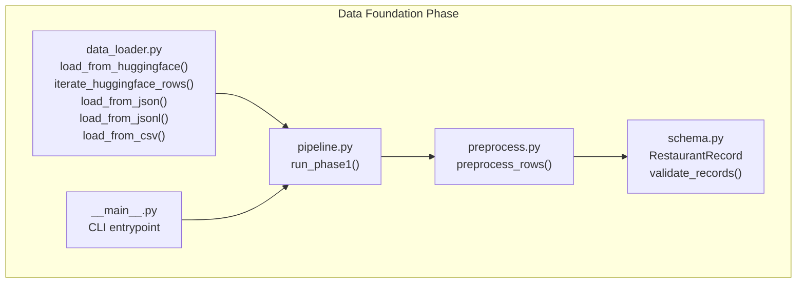
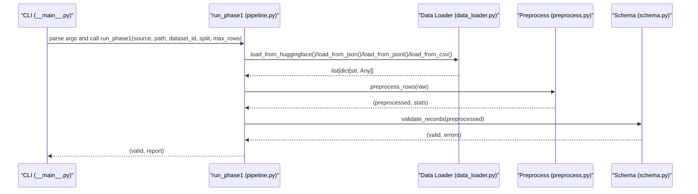
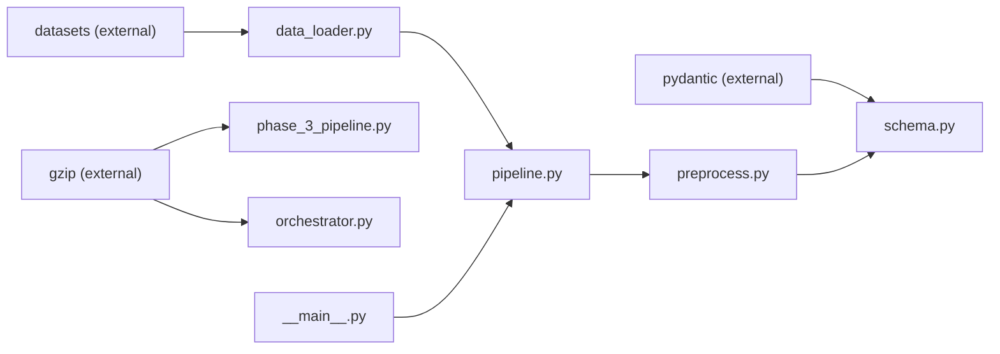

# Data Loading

<cite>
**Referenced Files in This Document**
- [data_loader.py](file://Zomato/architecture/phase_1_data_foundation/data_loader.py)
- [pipeline.py](file://Zomato/architecture/phase_1_data_foundation/pipeline.py)
- [__main__.py](file://Zomato/architecture/phase_1_data_foundation/__main__.py)
- [preprocess.py](file://Zomato/architecture/phase_1_data_foundation/preprocess.py)
- [schema.py](file://Zomato/architecture/phase_1_data_foundation/schema.py)
- [sample_input.json](file://Zomato/architecture/phase_1_data_foundation/sample_input.json)
- [sample_restaurants.jsonl](file://Zomato/architecture/phase_3_candidate_retrieval/sample_restaurants.jsonl)
- [requirements.txt](file://Zomato/architecture/phase_1_data_foundation/requirements.txt)
- [phase_3_pipeline.py](file://Zomato/architecture/phase_3_candidate_retrieval/pipeline.py)
- [orchestrator.py](file://Zomato/architecture/phase_6_monitoring/backend/orchestrator.py)
</cite>

## Update Summary
**Changes Made**
- Updated load_from_jsonl() documentation to reflect support for compressed JSONL files
- Added information about compressed file format detection and handling
- Updated practical examples to include compressed file usage patterns
- Enhanced troubleshooting guide with compressed file format considerations

## Table of Contents
1. [Introduction](#introduction)
2. [Project Structure](#project-structure)
3. [Core Components](#core-components)
4. [Architecture Overview](#architecture-overview)
5. [Detailed Component Analysis](#detailed-component-analysis)
6. [Dependency Analysis](#dependency-analysis)
7. [Performance Considerations](#performance-considerations)
8. [Troubleshooting Guide](#troubleshooting-guide)
9. [Conclusion](#conclusion)
10. [Appendices](#appendices)

## Introduction
This document explains the Data Loading component responsible for ingesting raw Zomato-style restaurant data from multiple sources. It covers the implementation of the data_loader module, including:
- load_from_huggingface(): Hugging Face dataset integration with optional streaming and row limits
- iterate_huggingface_rows(): Memory-efficient streaming iterator for large datasets
- load_from_json(): Local JSON file processing (single object or array)
- load_from_jsonl(): JSON Lines format ingestion with support for compressed and uncompressed files
- load_from_csv(): CSV file parsing into normalized dictionaries

It also documents dataset configuration constants, parameter usage, error handling, and performance considerations for batch versus streaming loads.

**Updated** Enhanced to support compressed file formats (.gz) alongside uncompressed files for improved deployment flexibility.

## Project Structure
The Data Loading component resides in the Data Foundation phase of the architecture and integrates with preprocessing and validation steps.

**Diagram sources**
- [data_loader.py:14-77](file://Zomato/architecture/phase_1_data_foundation/data_loader.py#L14-L77)
- [pipeline.py:21-67](file://Zomato/architecture/phase_1_data_foundation/pipeline.py#L21-L67)
- [preprocess.py:169-184](file://Zomato/architecture/phase_1_data_foundation/preprocess.py#L169-L184)
- [schema.py:41-53](file://Zomato/architecture/phase_1_data_foundation/schema.py#L41-L53)
- [__main__.py:10-54](file://Zomato/architecture/phase_1_data_foundation/__main__.py#L10-L54)

**Section sources**
- [data_loader.py:1-78](file://Zomato/architecture/phase_1_data_foundation/data_loader.py#L1-L78)
- [pipeline.py:1-81](file://Zomato/architecture/phase_1_data_foundation/pipeline.py#L1-L81)
- [__main__.py:1-54](file://Zomato/architecture/phase_1_data_foundation/__main__.py#L1-L54)

## Core Components
- load_from_huggingface(dataset_id, split, *, streaming=False, max_rows=None): Loads a Hugging Face dataset into memory as a list of row dictionaries. For streaming, use iterate_huggingface_rows().
- iterate_huggingface_rows(dataset_id, split, *, streaming=True): Yields rows one at a time for memory-efficient processing.
- load_from_json(path): Reads a JSON file; expects either a list of objects or a single object.
- load_from_jsonl(path): Reads a JSON Lines file, one record per line. Supports both compressed (.gz) and uncompressed files.
- load_from_csv(path): Reads a CSV file using DictReader and converts each row to a dictionary.

Dataset configuration constants:
- DEFAULT_HF_DATASET: Default Hugging Face dataset identifier
- DEFAULT_HF_SPLIT: Default dataset split to load

These constants are imported and used by the pipeline to configure data sources.

**Updated** Enhanced load_from_jsonl() to support compressed file formats for improved deployment flexibility.

**Section sources**
- [data_loader.py:14-77](file://Zomato/architecture/phase_1_data_foundation/data_loader.py#L14-L77)
- [pipeline.py:9-16](file://Zomato/architecture/phase_1_data_foundation/pipeline.py#L9-L16)

## Architecture Overview
The Data Loading component is part of a staged pipeline that loads raw data, normalizes it, validates it, and produces a report. The CLI provides a command-line interface to run the pipeline with configurable sources and parameters.

**Diagram sources**
- [__main__.py:36-49](file://Zomato/architecture/phase_1_data_foundation/__main__.py#L36-L49)
- [pipeline.py:21-67](file://Zomato/architecture/phase_1_data_foundation/pipeline.py#L21-L67)
- [data_loader.py:14-77](file://Zomato/architecture/phase_1_data_foundation/data_loader.py#L14-L77)
- [preprocess.py:169-184](file://Zomato/architecture/phase_1_data_foundation/preprocess.py#L169-L184)
- [schema.py:41-53](file://Zomato/architecture/phase_1_data_foundation/schema.py#L41-L53)

## Detailed Component Analysis

### load_from_huggingface()
Purpose:
- Load a Hugging Face dataset into memory as a list of dictionaries.
- Enforces that streaming is disabled for this batch-loading function.

Key behaviors:
- Uses datasets.load_dataset with dataset_id and split.
- Raises an error if streaming=True is passed (use iterate_huggingface_rows for streaming).
- Applies max_rows to limit the number of rows loaded.

Parameters:
- dataset_id: Hugging Face dataset identifier (defaults to DEFAULT_HF_DATASET)
- split: Dataset split to load (defaults to DEFAULT_HF_SPLIT)
- streaming: Must be False for this function
- max_rows: Optional upper bound on rows to load

Error handling:
- Raises ValueError if streaming=True is requested.

Performance considerations:
- Loads all selected rows into memory; not suitable for very large datasets.
- Use iterate_huggingface_rows for streaming when dealing with large datasets.

Practical usage:
- Batch loading with optional row limit via max_rows.
- Typical for smaller datasets or development/testing.

**Section sources**
- [data_loader.py:14-35](file://Zomato/architecture/phase_1_data_foundation/data_loader.py#L14-L35)
- [pipeline.py:35-36](file://Zomato/architecture/phase_1_data_foundation/pipeline.py#L35-L36)

### iterate_huggingface_rows()
Purpose:
- Yield rows one at a time for memory-efficient processing of large datasets.

Key behaviors:
- Uses datasets.load_dataset with streaming=True.
- Iterates over the dataset and yields each row as a dictionary.

Parameters:
- dataset_id: Hugging Face dataset identifier (defaults to DEFAULT_HF_DATASET)
- split: Dataset split to load (defaults to DEFAULT_HF_SPLIT)
- streaming: Must be True for this function

Error handling:
- No explicit error handling in this function; relies on underlying library behavior.

Performance considerations:
- Memory-efficient; avoids loading entire dataset into memory.
- Suitable for very large datasets or when processing in chunks.

Practical usage:
- Streaming consumption patterns for large datasets.
- Complements load_from_huggingface for batch loading.

**Section sources**
- [data_loader.py:38-49](file://Zomato/architecture/phase_1_data_foundation/data_loader.py#L38-L49)

### load_from_json()
Purpose:
- Parse a JSON file into a list of dictionaries.

Key behaviors:
- Reads file content with UTF-8 encoding.
- Supports both list of objects and single object at root.
- Converts each element/object into a dictionary.

Parameters:
- path: File path to the JSON file

Error handling:
- Raises ValueError if the JSON root is neither a list nor an object.

Practical usage:
- Local JSON files containing either an array of records or a single record object.

**Section sources**
- [data_loader.py:52-60](file://Zomato/architecture/phase_1_data_foundation/data_loader.py#L52-L60)

### load_from_jsonl()
Purpose:
- Parse a JSON Lines file into a list of dictionaries.

Key behaviors:
- Opens file with UTF-8 encoding.
- Automatically detects compressed (.gz) and uncompressed files.
- Supports both compressed (.gz) and uncompressed JSON Lines files.
- Skips empty lines.
- Parses each non-empty line as a JSON object.

Parameters:
- path: File path to the JSON Lines file

Error handling:
- No explicit error handling for malformed lines; depends on json.loads behavior.

Performance considerations:
- Streams line-by-line; memory-efficient for large JSON Lines files.
- Automatically handles compressed files without additional configuration.

Practical usage:
- Large datasets stored in JSON Lines format.
- Supports both compressed (.gz) and uncompressed files for deployment flexibility.

**Updated** Enhanced to automatically detect and handle compressed (.gz) JSON Lines files alongside uncompressed files.

**Section sources**
- [data_loader.py:63-71](file://Zomato/architecture/phase_1_data_foundation/data_loader.py#L63-L71)

### load_from_csv()
Purpose:
- Parse a CSV file into a list of dictionaries using DictReader.

Key behaviors:
- Opens file with UTF-8 encoding and newline handling.
- Uses DictReader to map each row to a dictionary keyed by header names.

Parameters:
- path: File path to the CSV file

Error handling:
- No explicit error handling in this function; depends on csv.DictReader behavior.

Practical usage:
- Structured tabular data exported as CSV.

**Section sources**
- [data_loader.py:74-77](file://Zomato/architecture/phase_1_data_foundation/data_loader.py#L74-L77)

### Dataset Configuration Constants
- DEFAULT_HF_DATASET: Default Hugging Face dataset identifier used when not overridden.
- DEFAULT_HF_SPLIT: Default dataset split used when not overridden.

These constants are imported by the pipeline and CLI to configure the data source.

**Section sources**
- [data_loader.py:10-11](file://Zomato/architecture/phase_1_data_foundation/data_loader.py#L10-L11)
- [pipeline.py:9-16](file://Zomato/architecture/phase_1_data_foundation/pipeline.py#L9-L16)
- [__main__.py:23-24](file://Zomato/architecture/phase_1_data_foundation/__main__.py#L23-L24)

### Practical Examples and Usage Patterns
- Loading from Hugging Face (batch):
  - Configure dataset_id and split; optionally set max_rows.
  - Use load_from_huggingface(streaming=False) for batch loading.

- Loading from Hugging Face (streaming):
  - Use iterate_huggingface_rows(streaming=True) to process rows one by one.

- Loading from JSON:
  - Provide path to a JSON file; supports list or single object root.

- Loading from JSON Lines:
  - Provide path to a JSON Lines file; supports both compressed (.gz) and uncompressed files.
  - Each line is a separate record.

- Loading from CSV:
  - Provide path to a CSV file; headers become dictionary keys.

- Partial data loading:
  - Use max_rows parameter in run_phase1 to limit the number of rows processed.

- Streaming consumption patterns:
  - Use iterate_huggingface_rows for memory-efficient processing of large datasets.

- Compressed file usage:
  - JSON Lines files with .gz extension are automatically detected and decompressed.
  - Supports deployment scenarios where compressed files are preferred for storage efficiency.

**Updated** Added examples for compressed file usage patterns and automatic format detection.

**Section sources**
- [pipeline.py:21-67](file://Zomato/architecture/phase_1_data_foundation/pipeline.py#L21-L67)
- [__main__.py:18-27](file://Zomato/architecture/phase_1_data_foundation/__main__.py#L18-L27)

## Dependency Analysis
External dependencies:
- datasets: Used for Hugging Face dataset loading in load_from_huggingface and iterate_huggingface_rows.
- pydantic: Used for schema validation in schema.py.
- gzip: Used for automatic decompression of compressed JSON Lines files in other pipeline components.
- flask: Optional web UI dependency (not used in data loading).

Internal dependencies:
- data_loader.py is consumed by pipeline.py.
- pipeline.py is consumed by __main__.py (CLI).
- preprocess.py and schema.py depend on the normalized dictionaries produced by data_loader.py.

**Updated** Added gzip dependency for compressed file support in other pipeline components.

**Diagram sources**
- [requirements.txt:1-4](file://Zomato/architecture/phase_1_data_foundation/requirements.txt#L1-L4)
- [data_loader.py:25](file://Zomato/architecture/phase_1_data_foundation/data_loader.py#L25)
- [schema.py:7](file://Zomato/architecture/phase_1_data_foundation/schema.py#L7)
- [phase_3_pipeline.py:5](file://Zomato/architecture/phase_3_candidate_retrieval/pipeline.py#L5)
- [orchestrator.py:5](file://Zomato/architecture/phase_6_monitoring/backend/orchestrator.py#L5)
- [pipeline.py:9-18](file://Zomato/architecture/phase_1_data_foundation/pipeline.py#L9-L18)
- [__main__.py:7](file://Zomato/architecture/phase_1_data_foundation/__main__.py#L7)

**Section sources**
- [requirements.txt:1-4](file://Zomato/architecture/phase_1_data_foundation/requirements.txt#L1-L4)
- [data_loader.py:25](file://Zomato/architecture/phase_1_data_foundation/data_loader.py#L25)
- [schema.py:7](file://Zomato/architecture/phase_1_data_foundation/schema.py#L7)
- [phase_3_pipeline.py:5](file://Zomato/architecture/phase_3_candidate_retrieval/pipeline.py#L5)
- [orchestrator.py:5](file://Zomato/architecture/phase_6_monitoring/backend/orchestrator.py#L5)
- [pipeline.py:9-18](file://Zomato/architecture/phase_1_data_foundation/pipeline.py#L9-L18)
- [__main__.py:7](file://Zomato/architecture/phase_1_data_foundation/__main__.py#L7)

## Performance Considerations
- load_from_huggingface():
  - Loads all selected rows into memory; not suitable for very large datasets.
  - Use max_rows to limit memory usage when loading in batch mode.

- iterate_huggingface_rows():
  - Memory-efficient; processes one row at a time.
  - Recommended for large datasets or when memory is constrained.

- load_from_json():
  - Reads entire file into memory; suitable for moderate-sized JSON arrays.
  - Validates root type to ensure expected structure.

- load_from_jsonl():
  - Streams line-by-line; memory-efficient for large JSON Lines files.
  - Automatically handles compressed (.gz) files without additional configuration.
  - Skips empty lines automatically.

- load_from_csv():
  - DictReader reads and parses each row; memory usage scales with number of rows.
  - Encoding and newline handling ensure cross-platform compatibility.

**Updated** Enhanced load_from_jsonl() performance considerations to include compressed file handling capabilities.

## Troubleshooting Guide
Common issues and resolutions:
- Invalid file format:
  - JSON root must be a list or object; otherwise raises ValueError.
  - Ensure JSON Lines files contain one JSON object per line.
  - CSV files require consistent headers across rows.

- Streaming misuse:
  - load_from_huggingface(streaming=True) raises an error; use iterate_huggingface_rows for streaming.

- Missing path argument:
  - JSON/JSON Lines/CSV loaders require a path; pipeline enforces this and raises ValueError when missing.

- Large datasets:
  - Prefer iterate_huggingface_rows for streaming to avoid memory pressure.
  - Use max_rows to limit the number of rows processed.

- Validation errors:
  - After preprocessing and validation, errors are collected and reported.
  - Review report for validation error counts and samples.

- Compressed file format issues:
  - JSON Lines files with .gz extension are automatically detected and decompressed.
  - Ensure proper file permissions for compressed files.
  - Verify file integrity if decompression fails.

**Updated** Added troubleshooting guidance for compressed file format handling.

**Section sources**
- [data_loader.py:28-29](file://Zomato/architecture/phase_1_data_foundation/data_loader.py#L28-L29)
- [data_loader.py:60](file://Zomato/architecture/phase_1_data_foundation/data_loader.py#L60)
- [pipeline.py:38-56](file://Zomato/architecture/phase_1_data_foundation/pipeline.py#L38-L56)
- [schema.py:41-53](file://Zomato/architecture/phase_1_data_foundation/schema.py#L41-L53)

## Conclusion
The Data Loading component provides flexible ingestion of Zomato-style restaurant data from multiple sources. It offers both batch and streaming modes, robust error handling for invalid formats, and practical controls like max_rows for partial data loading. The component now supports both compressed (.gz) and uncompressed file formats for enhanced deployment flexibility. By combining these loaders with preprocessing and validation, the system ensures clean, standardized data ready for downstream phases.

**Updated** Enhanced conclusion to reflect compressed file format support capabilities.

## Appendices

### Parameter Reference
- dataset_id: Hugging Face dataset identifier (default: DEFAULT_HF_DATASET)
- split: Dataset split (default: DEFAULT_HF_SPLIT)
- streaming: Enable streaming (default: False for load_from_huggingface; True for iterate_huggingface_rows)
- max_rows: Limit number of rows to load/process
- path: File path for JSON/JSON Lines/CSV sources

**Section sources**
- [data_loader.py:14-49](file://Zomato/architecture/phase_1_data_foundation/data_loader.py#L14-L49)
- [pipeline.py:21-27](file://Zomato/architecture/phase_1_data_foundation/pipeline.py#L21-L27)
- [__main__.py:18-27](file://Zomato/architecture/phase_1_data_foundation/__main__.py#L18-L27)

### Example Data Files
- sample_input.json: Sample JSON array with restaurant entries
- sample_restaurants.jsonl: Sample JSON Lines file with restaurant entries
- phase1_live.jsonl.gz: Compressed JSON Lines file for production deployment

**Updated** Added compressed file example to demonstrate deployment scenarios.

**Section sources**
- [sample_input.json:1-14](file://Zomato/architecture/phase_1_data_foundation/sample_input.json#L1-L14)
- [sample_restaurants.jsonl:1-5](file://Zomato/architecture/phase_3_candidate_retrieval/sample_restaurants.jsonl#L1-L5)

### Compressed File Format Support
The system supports automatic detection and handling of compressed JSON Lines files:

- File extensions: .gz for compressed, no extension for uncompressed
- Automatic detection: File suffix determines opener selection
- Deployment scenarios: Compressed files (.gz) preferred for cloud storage efficiency
- Backward compatibility: Uncompressed files continue to work without modification

**New Section** Added to document compressed file format capabilities.

**Section sources**
- [phase_3_pipeline.py:14-24](file://Zomato/architecture/phase_3_candidate_retrieval/pipeline.py#L14-L24)
- [orchestrator.py:23-45](file://Zomato/architecture/phase_6_monitoring/backend/orchestrator.py#L23-L45)
- [phase_1_data_foundation/output/phase1_live.jsonl.gz](file://Zomato/architecture/phase_1_data_foundation/output/phase1_live.jsonl.gz)