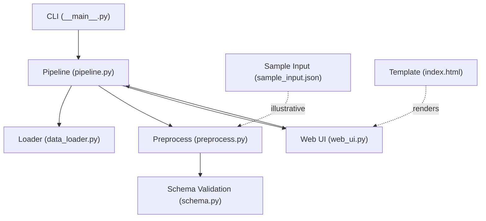
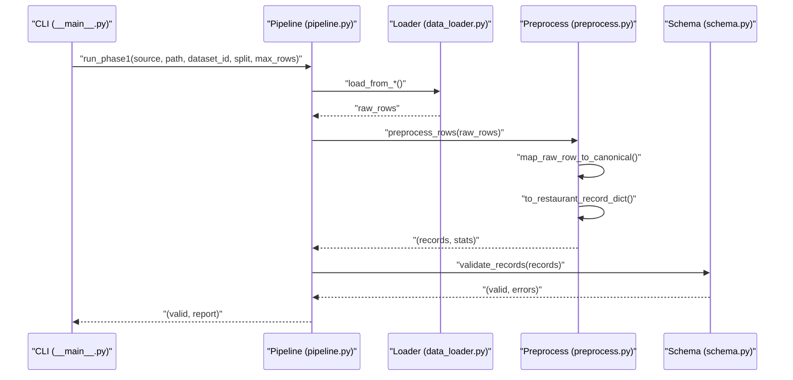
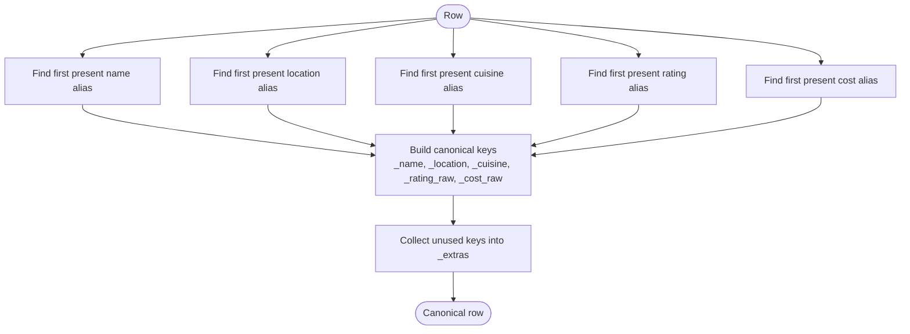
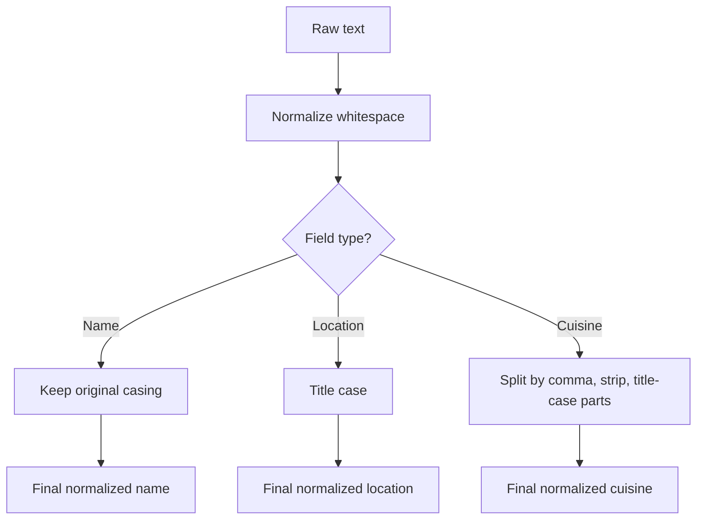
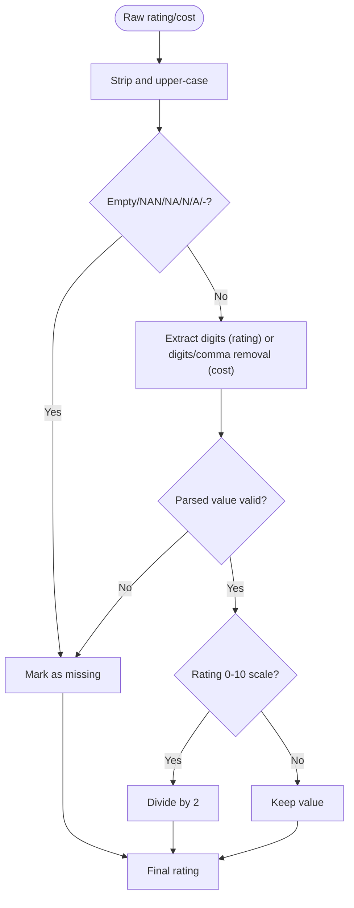
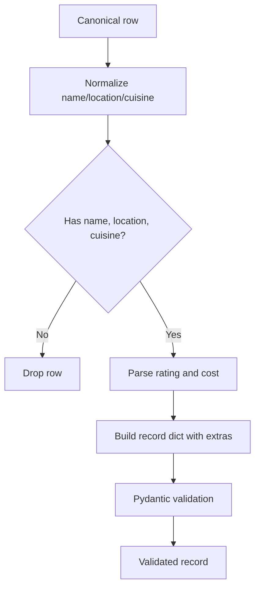
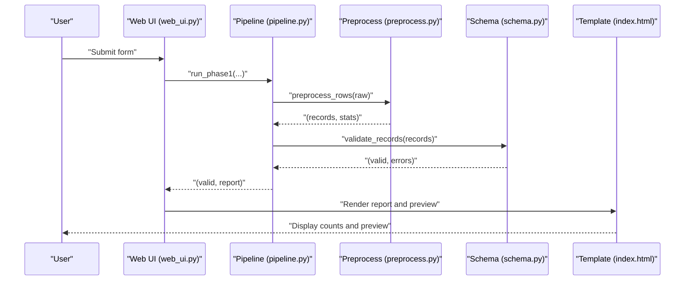
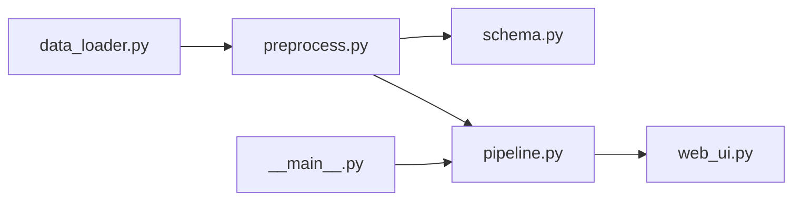

# Data Preprocessing

<cite>
**Referenced Files in This Document**
- [preprocess.py](file://Zomato/architecture/phase_1_data_foundation/preprocess.py)
- [data_loader.py](file://Zomato/architecture/phase_1_data_foundation/data_loader.py)
- [schema.py](file://Zomato/architecture/phase_1_data_foundation/schema.py)
- [pipeline.py](file://Zomato/architecture/phase_1_data_foundation/pipeline.py)
- [__main__.py](file://Zomato/architecture/phase_1_data_foundation/__main__.py)
- [web_ui.py](file://Zomato/architecture/phase_1_data_foundation/web_ui.py)
- [sample_input.json](file://Zomato/architecture/phase_1_data_foundation/sample_input.json)
- [index.html](file://Zomato/architecture/phase_1_data_foundation/templates/index.html)
</cite>

## Table of Contents
1. [Introduction](#introduction)
2. [Project Structure](#project-structure)
3. [Core Components](#core-components)
4. [Architecture Overview](#architecture-overview)
5. [Detailed Component Analysis](#detailed-component-analysis)
6. [Dependency Analysis](#dependency-analysis)
7. [Performance Considerations](#performance-considerations)
8. [Troubleshooting Guide](#troubleshooting-guide)
9. [Conclusion](#conclusion)

## Introduction
This document explains the Data Preprocessing component responsible for cleaning, transforming, and standardizing raw restaurant data into a canonical schema. It focuses on the preprocess.py module’s field extraction and normalization logic, including restaurant name, location, cuisine types, cost for two, and rating. It also documents the preprocessing pipeline, validation rules, quality reporting, and how missing or malformed data is handled.

## Project Structure
The preprocessing logic resides in the Data Foundation phase of the architecture. The relevant files are:
- preprocess.py: Implements field extraction, normalization, parsing, and the end-to-end preprocessing pipeline.
- data_loader.py: Loads raw data from Hugging Face, JSON, JSONL, or CSV sources.
- schema.py: Defines the canonical RestaurantRecord schema and validation rules.
- pipeline.py: Orchestrates loading, preprocessing, validation, and optional export/reporting.
- __main__.py: CLI entry point for running the pipeline.
- web_ui.py: Web UI wrapper around the pipeline for interactive runs.
- sample_input.json: Example raw input demonstrating heterogeneous field names and partial rows.
- index.html: Template rendering the web UI report and preview.

**Diagram sources**
- [__main__.py:10-54](file://Zomato/architecture/phase_1_data_foundation/__main__.py#L10-L54)
- [pipeline.py:21-67](file://Zomato/architecture/phase_1_data_foundation/pipeline.py#L21-L67)
- [data_loader.py:14-78](file://Zomato/architecture/phase_1_data_foundation/data_loader.py#L14-L78)
- [preprocess.py:118-185](file://Zomato/architecture/phase_1_data_foundation/preprocess.py#L118-L185)
- [schema.py:10-54](file://Zomato/architecture/phase_1_data_foundation/schema.py#L10-L54)
- [web_ui.py:33-95](file://Zomato/architecture/phase_1_data_foundation/web_ui.py#L33-L95)
- [sample_input.json:1-14](file://Zomato/architecture/phase_1_data_foundation/sample_input.json#L1-L14)
- [index.html:47-98](file://Zomato/architecture/phase_1_data_foundation/templates/index.html#L47-L98)

**Section sources**
- [__main__.py:10-54](file://Zomato/architecture/phase_1_data_foundation/__main__.py#L10-L54)
- [pipeline.py:21-67](file://Zomato/architecture/phase_1_data_foundation/pipeline.py#L21-L67)
- [data_loader.py:14-78](file://Zomato/architecture/phase_1_data_foundation/data_loader.py#L14-L78)
- [preprocess.py:118-185](file://Zomato/architecture/phase_1_data_foundation/preprocess.py#L118-L185)
- [schema.py:10-54](file://Zomato/architecture/phase_1_data_foundation/schema.py#L10-L54)
- [web_ui.py:33-95](file://Zomato/architecture/phase_1_data_foundation/web_ui.py#L33-L95)
- [sample_input.json:1-14](file://Zomato/architecture/phase_1_data_foundation/sample_input.json#L1-L14)
- [index.html:47-98](file://Zomato/architecture/phase_1_data_foundation/templates/index.html#L47-L98)

## Core Components
- Field extraction and mapping:
  - Extracts restaurant name, location, cuisines, rating, and cost for two from heterogeneous raw keys.
  - Uses alias sets for robustness across datasets.
- Normalization:
  - Whitespace normalization, title-case/capitalization for locations and names, and structured cuisine lists.
- Parsing:
  - Parses ratings from formats like “X.Y/5” and handles 0–5 or rare 0–10 scales.
  - Parses cost values, removing currency symbols and commas.
- Quality assurance:
  - Drops rows missing essential fields after normalization.
  - Validates final records against the canonical schema.
  - Reports counts and sample validation errors.

Key implementation references:
- Field extraction and mapping: [map_raw_row_to_canonical:118-142](file://Zomato/architecture/phase_1_data_foundation/preprocess.py#L118-L142)
- Normalization helpers: [_normalize_name:112-115](file://Zomato/architecture/phase_1_data_foundation/preprocess.py#L112-L115), [_normalize_location:106-109](file://Zomato/architecture/phase_1_data_foundation/preprocess.py#L106-L109), [_normalize_cuisine:94-103](file://Zomato/architecture/phase_1_data_foundation/preprocess.py#L94-L103)
- Rating parsing: [_parse_rating:60-75](file://Zomato/architecture/phase_1_data_foundation/preprocess.py#L60-L75)
- Cost parsing: [_parse_cost:78-87](file://Zomato/architecture/phase_1_data_foundation/preprocess.py#L78-L87)
- Record assembly and validation: [to_restaurant_record_dict:145-166](file://Zomato/architecture/phase_1_data_foundation/preprocess.py#L145-L166), [validate_records:41-53](file://Zomato/architecture/phase_1_data_foundation/schema.py#L41-L53)

**Section sources**
- [preprocess.py:118-185](file://Zomato/architecture/phase_1_data_foundation/preprocess.py#L118-L185)
- [schema.py:10-54](file://Zomato/architecture/phase_1_data_foundation/schema.py#L10-L54)

## Architecture Overview
The preprocessing pipeline follows a clear flow: load raw data, map and normalize fields, parse numeric fields, assemble canonical records, validate against schema, and produce a report.

**Diagram sources**
- [__main__.py:36-49](file://Zomato/architecture/phase_1_data_foundation/__main__.py#L36-L49)
- [pipeline.py:21-67](file://Zomato/architecture/phase_1_data_foundation/pipeline.py#L21-L67)
- [data_loader.py:14-78](file://Zomato/architecture/phase_1_data_foundation/data_loader.py#L14-L78)
- [preprocess.py:118-185](file://Zomato/architecture/phase_1_data_foundation/preprocess.py#L118-L185)
- [schema.py:41-53](file://Zomato/architecture/phase_1_data_foundation/schema.py#L41-L53)

## Detailed Component Analysis

### Field Extraction and Mapping
- Purpose: Normalize heterogeneous raw keys into canonical internal keys before building the final record.
- Mechanism:
  - Maintains alias tuples for each target field (name, location, cuisine, rating, cost).
  - Selects the first present, non-empty value among aliases for each field.
  - Collects unused keys into an extras dictionary for downstream use.
- Example evidence:
  - Aliases for restaurant name: [preprocess.py:9-16](file://Zomato/architecture/phase_1_data_foundation/preprocess.py#L9-L16)
  - Aliases for location: [preprocess.py:17-26](file://Zomato/architecture/phase_1_data_foundation/preprocess.py#L17-L26)
  - Aliases for cuisines: [preprocess.py:27-32](file://Zomato/architecture/phase_1_data_foundation/preprocess.py#L27-L32)
  - Aliases for rating: [preprocess.py:33-40](file://Zomato/architecture/phase_1_data_foundation/preprocess.py#L33-L40)
  - Aliases for cost: [preprocess.py:41-50](file://Zomato/architecture/phase_1_data_foundation/preprocess.py#L41-L50)
  - Mapping function: [map_raw_row_to_canonical:118-142](file://Zomato/architecture/phase_1_data_foundation/preprocess.py#L118-L142)

**Diagram sources**
- [preprocess.py:118-142](file://Zomato/architecture/phase_1_data_foundation/preprocess.py#L118-L142)

**Section sources**
- [preprocess.py:9-50](file://Zomato/architecture/phase_1_data_foundation/preprocess.py#L9-L50)
- [preprocess.py:118-142](file://Zomato/architecture/phase_1_data_foundation/preprocess.py#L118-L142)

### Normalization Rules
- Name normalization:
  - Removes extra whitespace and preserves original casing.
  - Reference: [_normalize_name:112-115](file://Zomato/architecture/phase_1_data_foundation/preprocess.py#L112-L115)
- Location normalization:
  - Removes extra whitespace and applies title capitalization.
  - Reference: [_normalize_location:106-109](file://Zomato/architecture/phase_1_data_foundation/preprocess.py#L106-L109)
- Cuisine normalization:
  - Removes extra whitespace, splits by comma, strips parts, and title-cases parts while preserving acronyms roughly.
  - Reference: [_normalize_cuisine:94-103](file://Zomato/architecture/phase_1_data_foundation/preprocess.py#L94-L103)
- Whitespace normalization helper:
  - Reference: [_normalize_whitespace:90-91](file://Zomato/architecture/phase_1_data_foundation/preprocess.py#L90-L91)

**Diagram sources**
- [preprocess.py:90-115](file://Zomato/architecture/phase_1_data_foundation/preprocess.py#L90-L115)

**Section sources**
- [preprocess.py:90-115](file://Zomato/architecture/phase_1_data_foundation/preprocess.py#L90-L115)

### Parsing Rules
- Rating parsing:
  - Handles empty/missing/nonsense values and formats like “X.Y/5”.
  - Converts rare 0–10 scale to 0–5 by halving.
  - Enforces bounds 0–5.
  - Reference: [_parse_rating:60-75](file://Zomato/architecture/phase_1_data_foundation/preprocess.py#L60-L75)
- Cost parsing:
  - Removes currency symbols and commas, extracts numeric part.
  - Treats empty/missing/nonsense as missing.
  - Reference: [_parse_cost:78-87](file://Zomato/architecture/phase_1_data_foundation/preprocess.py#L78-L87)

**Diagram sources**
- [preprocess.py:60-87](file://Zomato/architecture/phase_1_data_foundation/preprocess.py#L60-L87)

**Section sources**
- [preprocess.py:60-87](file://Zomato/architecture/phase_1_data_foundation/preprocess.py#L60-L87)

### Canonical Record Assembly and Validation
- Assembles normalized fields into a record dictionary with extras preserved.
- Drops rows missing essential fields (name, location, cuisine) after normalization.
- References:
  - [to_restaurant_record_dict:145-166](file://Zomato/architecture/phase_1_data_foundation/preprocess.py#L145-L166)
  - [RestaurantRecord schema:10-38](file://Zomato/architecture/phase_1_data_foundation/schema.py#L10-L38)
  - [validate_records:41-53](file://Zomato/architecture/phase_1_data_foundation/schema.py#L41-L53)

**Diagram sources**
- [preprocess.py:145-166](file://Zomato/architecture/phase_1_data_foundation/preprocess.py#L145-L166)
- [schema.py:10-38](file://Zomato/architecture/phase_1_data_foundation/schema.py#L10-L38)

**Section sources**
- [preprocess.py:145-166](file://Zomato/architecture/phase_1_data_foundation/preprocess.py#L145-L166)
- [schema.py:10-38](file://Zomato/architecture/phase_1_data_foundation/schema.py#L10-L38)

### Preprocessing Pipeline and Quality Reporting
- Pipeline orchestration:
  - Loads data from chosen source.
  - Runs preprocessing and validation.
  - Builds a report with input count, kept count, dropped-incomplete count, validation error counts, and sample errors.
  - References: [run_phase1:21-67](file://Zomato/architecture/phase_1_data_foundation/pipeline.py#L21-L67)
- CLI and web UI:
  - CLI prints counts and optionally writes JSONL and report.
  - Web UI runs the pipeline, renders a report, and optionally saves outputs.
  - References: [__main__.py:36-49](file://Zomato/architecture/phase_1_data_foundation/__main__.py#L36-L49), [web_ui.py:57-95](file://Zomato/architecture/phase_1_data_foundation/web_ui.py#L57-L95)
- Report rendering:
  - Template displays counts and a preview table.
  - References: [index.html:53-95](file://Zomato/architecture/phase_1_data_foundation/templates/index.html#L53-L95)

**Diagram sources**
- [web_ui.py:57-95](file://Zomato/architecture/phase_1_data_foundation/web_ui.py#L57-L95)
- [pipeline.py:21-67](file://Zomato/architecture/phase_1_data_foundation/pipeline.py#L21-L67)
- [preprocess.py:169-185](file://Zomato/architecture/phase_1_data_foundation/preprocess.py#L169-L185)
- [schema.py:41-53](file://Zomato/architecture/phase_1_data_foundation/schema.py#L41-L53)
- [index.html:53-95](file://Zomato/architecture/phase_1_data_foundation/templates/index.html#L53-L95)

**Section sources**
- [pipeline.py:21-67](file://Zomato/architecture/phase_1_data_foundation/pipeline.py#L21-L67)
- [__main__.py:36-49](file://Zomato/architecture/phase_1_data_foundation/__main__.py#L36-L49)
- [web_ui.py:57-95](file://Zomato/architecture/phase_1_data_foundation/web_ui.py#L57-L95)
- [index.html:53-95](file://Zomato/architecture/phase_1_data_foundation/templates/index.html#L53-L95)

### Handling Missing or Malformed Data
- Missing essential fields:
  - Rows missing name, location, or cuisine after normalization are dropped.
  - Reference: [to_restaurant_record_dict:153-154](file://Zomato/architecture/phase_1_data_foundation/preprocess.py#L153-L154)
- Malformed values:
  - Ratings: empty, “NAN”, “NA”, “N/A”, “-”, “NEW”, “NOT RATED”, or out-of-range values are treated as missing.
  - Costs: empty, “NAN”, “NA”, “N/A”, “-”, or unparseable numeric parts are treated as missing.
  - Reference: [_parse_rating:60-75](file://Zomato/architecture/phase_1_data_foundation/preprocess.py#L60-L75), [_parse_cost:78-87](file://Zomato/architecture/phase_1_data_foundation/preprocess.py#L78-L87)
- Currency and formatting:
  - Currency symbols and commas are removed during cost parsing.
  - Reference: [_parse_cost:84-87](file://Zomato/architecture/phase_1_data_foundation/preprocess.py#L84-L87)

**Section sources**
- [preprocess.py:60-87](file://Zomato/architecture/phase_1_data_foundation/preprocess.py#L60-L87)
- [preprocess.py:153-154](file://Zomato/architecture/phase_1_data_foundation/preprocess.py#L153-L154)

### Configuration Options and Parameters
- CLI arguments:
  - --source: "huggingface" | "json" | "jsonl" | "csv"
  - --path: file path for json/jsonl/csv
  - --dataset-id: Hugging Face dataset identifier
  - --split: dataset split
  - --max-rows: limit input rows
  - --out-jsonl: output JSONL path
  - --report-json: report JSON path
  - Reference: [__main__.py:11-28](file://Zomato/architecture/phase_1_data_foundation/__main__.py#L11-L28)
- Web UI parameters:
  - dataset_id, split, max_rows, save_outputs toggle.
  - Reference: [web_ui.py:35-63](file://Zomato/architecture/phase_1_data_foundation/web_ui.py#L35-L63)
- Data loading sources:
  - Hugging Face, JSON, JSONL, CSV.
  - Reference: [data_loader.py:14-78](file://Zomato/architecture/phase_1_data_foundation/data_loader.py#L14-L78)

**Section sources**
- [__main__.py:11-28](file://Zomato/architecture/phase_1_data_foundation/__main__.py#L11-L28)
- [web_ui.py:35-63](file://Zomato/architecture/phase_1_data_foundation/web_ui.py#L35-L63)
- [data_loader.py:14-78](file://Zomato/architecture/phase_1_data_foundation/data_loader.py#L14-L78)

### Example Evidence from Sample Input
- Demonstrates heterogeneous keys and partial rows:
  - Restaurant Name, City, Cuisines, Aggregate rating, Average Cost for two.
  - Partial row with only name and city.
  - Reference: [sample_input.json:1-14](file://Zomato/architecture/phase_1_data_foundation/sample_input.json#L1-L14)

**Section sources**
- [sample_input.json:1-14](file://Zomato/architecture/phase_1_data_foundation/sample_input.json#L1-L14)

## Dependency Analysis
- preprocess.py depends on:
  - Regular expressions for parsing.
  - No external dependencies beyond Python stdlib.
- pipeline.py depends on:
  - data_loader.py for input sources.
  - preprocess.py for transformations.
  - schema.py for validation.
- web_ui.py depends on:
  - pipeline.py for execution.
  - Flask for serving.
- CLI depends on:
  - pipeline.py for orchestration.

**Diagram sources**
- [data_loader.py:14-78](file://Zomato/architecture/phase_1_data_foundation/data_loader.py#L14-L78)
- [preprocess.py:118-185](file://Zomato/architecture/phase_1_data_foundation/preprocess.py#L118-L185)
- [schema.py:10-54](file://Zomato/architecture/phase_1_data_foundation/schema.py#L10-L54)
- [pipeline.py:9-18](file://Zomato/architecture/phase_1_data_foundation/pipeline.py#L9-L18)
- [web_ui.py:11-12](file://Zomato/architecture/phase_1_data_foundation/web_ui.py#L11-L12)
- [__main__.py:7](file://Zomato/architecture/phase_1_data_foundation/__main__.py#L7)

**Section sources**
- [data_loader.py:14-78](file://Zomato/architecture/phase_1_data_foundation/data_loader.py#L14-L78)
- [preprocess.py:118-185](file://Zomato/architecture/phase_1_data_foundation/preprocess.py#L118-L185)
- [schema.py:10-54](file://Zomato/architecture/phase_1_data_foundation/schema.py#L10-L54)
- [pipeline.py:9-18](file://Zomato/architecture/phase_1_data_foundation/pipeline.py#L9-L18)
- [web_ui.py:11-12](file://Zomato/architecture/phase_1_data_foundation/web_ui.py#L11-L12)
- [__main__.py:7](file://Zomato/architecture/phase_1_data_foundation/__main__.py#L7)

## Performance Considerations
- Memory efficiency:
  - Streaming support is available for Hugging Face datasets via iteration functions, enabling memory-friendly processing for large datasets.
  - Reference: [data_loader.py:38-49](file://Zomato/architecture/phase_1_data_foundation/data_loader.py#L38-L49)
- Early filtering:
  - Rows are dropped early if essential fields are missing after normalization, reducing downstream processing overhead.
  - Reference: [to_restaurant_record_dict:153-154](file://Zomato/architecture/phase_1_data_foundation/preprocess.py#L153-L154)
- Regex parsing:
  - Parsing relies on simple regex patterns; complexity remains linear in input length per row.
  - Reference: [_parse_rating:60-75](file://Zomato/architecture/phase_1_data_foundation/preprocess.py#L60-L75), [_parse_cost:78-87](file://Zomato/architecture/phase_1_data_foundation/preprocess.py#L78-L87)

[No sources needed since this section provides general guidance]

## Troubleshooting Guide
- Common issues and resolutions:
  - Inconsistent data formats:
    - Use the alias sets to handle variations in field names.
    - Reference: [preprocess.py:9-50](file://Zomato/architecture/phase_1_data_foundation/preprocess.py#L9-L50)
  - Special characters and currency:
    - Cost parsing removes currency symbols and commas automatically.
    - Reference: [_parse_cost:84-87](file://Zomato/architecture/phase_1_data_foundation/preprocess.py#L84-L87)
  - Ratings in 0–10 scale:
    - Ratings are normalized to 0–5 by halving when detected.
    - Reference: [_parse_rating:71-72](file://Zomato/architecture/phase_1_data_foundation/preprocess.py#L71-L72)
  - Missing essential fields:
    - Rows with missing name, location, or cuisine are dropped; ensure raw data includes these fields.
    - Reference: [to_restaurant_record_dict:153-154](file://Zomato/architecture/phase_1_data_foundation/preprocess.py#L153-L154)
  - Validation errors:
    - Inspect the validation error report for specific row indices and messages.
    - Reference: [pipeline.py:61-66](file://Zomato/architecture/phase_1_data_foundation/pipeline.py#L61-L66)
  - Web UI errors:
    - Full stack traces are shown in the UI for debugging.
    - Reference: [web_ui.py:64-73](file://Zomato/architecture/phase_1_data_foundation/web_ui.py#L64-L73)

**Section sources**
- [preprocess.py:9-50](file://Zomato/architecture/phase_1_data_foundation/preprocess.py#L9-L50)
- [preprocess.py:60-87](file://Zomato/architecture/phase_1_data_foundation/preprocess.py#L60-L87)
- [preprocess.py:153-154](file://Zomato/architecture/phase_1_data_foundation/preprocess.py#L153-L154)
- [pipeline.py:61-66](file://Zomato/architecture/phase_1_data_foundation/pipeline.py#L61-L66)
- [web_ui.py:64-73](file://Zomato/architecture/phase_1_data_foundation/web_ui.py#L64-L73)

## Conclusion
The Data Preprocessing component provides a robust, schema-driven pipeline that:
- Extracts and normalizes restaurant fields from heterogeneous sources.
- Applies strict parsing rules for ratings and costs.
- Ensures data quality by dropping incomplete rows and validating against a canonical schema.
- Offers clear reporting and export capabilities for downstream phases.

[No sources needed since this section summarizes without analyzing specific files]