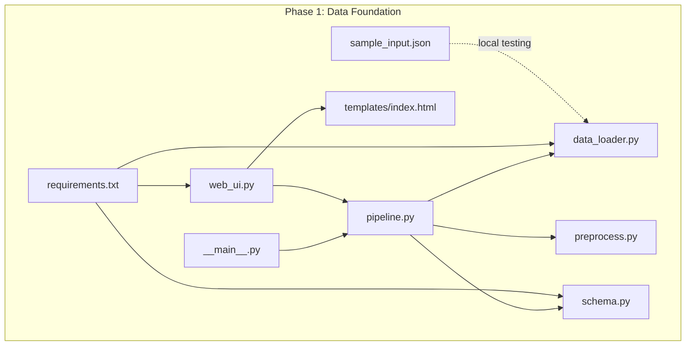
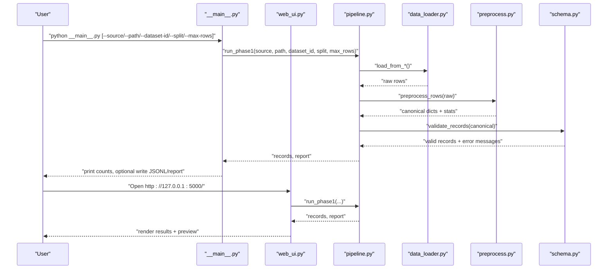
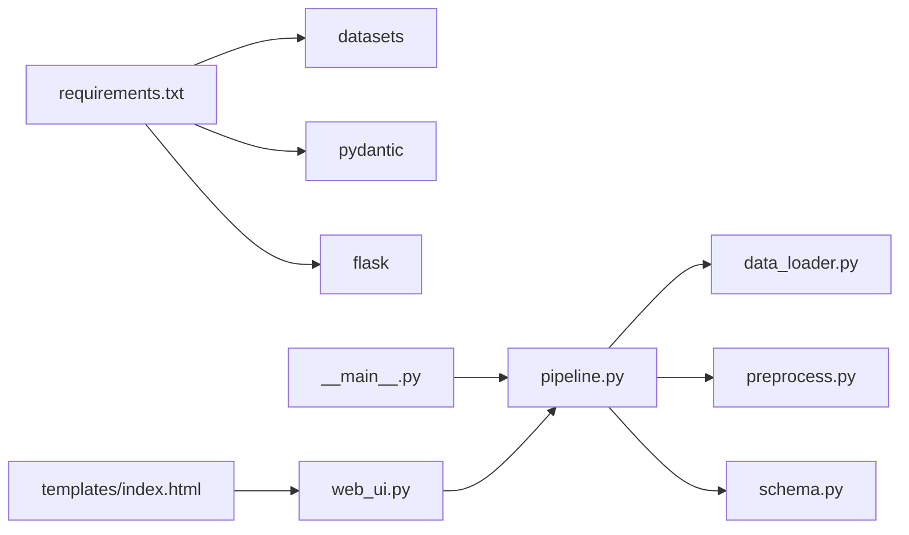
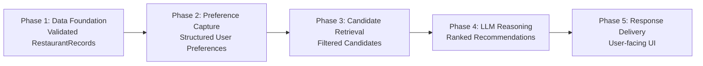

# Phase 1: Data Foundation

<cite>
**Referenced Files in This Document**
- [data_loader.py](file://Zomato/architecture/phase_1_data_foundation/data_loader.py)
- [preprocess.py](file://Zomato/architecture/phase_1_data_foundation/preprocess.py)
- [schema.py](file://Zomato/architecture/phase_1_data_foundation/schema.py)
- [pipeline.py](file://Zomato/architecture/phase_1_data_foundation/pipeline.py)
- [__main__.py](file://Zomato/architecture/phase_1_data_foundation/__main__.py)
- [web_ui.py](file://Zomato/architecture/phase_1_data_foundation/web_ui.py)
- [requirements.txt](file://Zomato/architecture/phase_1_data_foundation/requirements.txt)
- [sample_input.json](file://Zomato/architecture/phase_1_data_foundation/sample_input.json)
- [templates/index.html](file://Zomato/architecture/phase_1_data_foundation/templates/index.html)
- [phase-wise-architecture.md](file://Zomato/architecture/phase-wise-architecture.md)
- [detailed-edge-cases.md](file://Zomato/edge-cases/detailed-edge-cases.md)
</cite>

## Table of Contents
1. [Introduction](#introduction)
2. [Project Structure](#project-structure)
3. [Core Components](#core-components)
4. [Architecture Overview](#architecture-overview)
5. [Detailed Component Analysis](#detailed-component-analysis)
6. [Dependency Analysis](#dependency-analysis)
7. [Performance Considerations](#performance-considerations)
8. [Troubleshooting Guide](#troubleshooting-guide)
9. [Conclusion](#conclusion)
10. [Appendices](#appendices)

## Introduction
Phase 1: Data Foundation builds a reliable restaurant data layer by ingesting raw Zomato-style datasets, cleaning and normalizing fields, validating data integrity, and producing a standardized schema consumable by downstream phases. It supports multiple data sources (Hugging Face, JSON, JSONL, CSV), robust preprocessing for missing values and inconsistent formatting, and a Pydantic-based validation layer to ensure data quality.

This document explains the ingestion, validation, and preprocessing implementation details, documents the data_loader.py functionality, preprocess.py operations, and schema.py validation rules, and shows how processed data feeds into the preference capture phase. It also covers configuration options, quality reporting, and common data issues with their solutions.

## Project Structure
The Phase 1 module is organized around a small set of focused Python modules and a simple web UI:

- data_loader.py: Loads raw data from Hugging Face or local files (JSON/JSONL/CSV)
- preprocess.py: Normalizes and transforms raw rows into canonical fields and validates completeness
- schema.py: Defines the normalized schema and validation rules
- pipeline.py: Orchestrates the end-to-end pipeline and produces quality reports
- __main__.py: CLI entrypoint for batch runs and optional web UI toggle
- web_ui.py: Basic Flask web UI to trigger downloads and runs
- templates/index.html: Web UI template for user interaction
- requirements.txt: Dependencies for datasets, pydantic, and Flask
- sample_input.json: Example input for local testing

**Diagram sources**
- [data_loader.py:1-78](file://Zomato/architecture/phase_1_data_foundation/data_loader.py#L1-L78)
- [preprocess.py:1-185](file://Zomato/architecture/phase_1_data_foundation/preprocess.py#L1-L185)
- [schema.py:1-54](file://Zomato/architecture/phase_1_data_foundation/schema.py#L1-L54)
- [pipeline.py:1-81](file://Zomato/architecture/phase_1_data_foundation/pipeline.py#L1-L81)
- [__main__.py:1-54](file://Zomato/architecture/phase_1_data_foundation/__main__.py#L1-L54)
- [web_ui.py:1-117](file://Zomato/architecture/phase_1_data_foundation/web_ui.py#L1-L117)
- [templates/index.html:1-99](file://Zomato/architecture/phase_1_data_foundation/templates/index.html#L1-L99)
- [requirements.txt:1-4](file://Zomato/architecture/phase_1_data_foundation/requirements.txt#L1-L4)
- [sample_input.json:1-14](file://Zomato/architecture/phase_1_data_foundation/sample_input.json#L1-L14)

**Section sources**
- [phase-wise-architecture.md:3-16](file://Zomato/architecture/phase-wise-architecture.md#L3-L16)
- [requirements.txt:1-4](file://Zomato/architecture/phase_1_data_foundation/requirements.txt#L1-L4)

## Core Components
- Data Loader: Supports Hugging Face datasets and local JSON/JSONL/CSV sources. Provides both in-memory loading and streaming iteration for memory efficiency.
- Preprocessing: Maps heterogeneous raw fields to canonical keys, normalizes whitespace and casing, parses ratings and costs, and drops incomplete rows.
- Schema Validation: Defines a normalized RestaurantRecord schema with Pydantic validators and collects validation errors for reporting.
- Pipeline: Orchestrates ingestion, preprocessing, validation, and optional export with a comprehensive quality report.
- CLI and Web UI: Provide both command-line and browser-based entrypoints to run the pipeline and inspect results.

**Section sources**
- [data_loader.py:1-78](file://Zomato/architecture/phase_1_data_foundation/data_loader.py#L1-L78)
- [preprocess.py:1-185](file://Zomato/architecture/phase_1_data_foundation/preprocess.py#L1-L185)
- [schema.py:1-54](file://Zomato/architecture/phase_1_data_foundation/schema.py#L1-L54)
- [pipeline.py:1-81](file://Zomato/architecture/phase_1_data_foundation/pipeline.py#L1-L81)
- [__main__.py:1-54](file://Zomato/architecture/phase_1_data_foundation/__main__.py#L1-L54)
- [web_ui.py:1-117](file://Zomato/architecture/phase_1_data_foundation/web_ui.py#L1-L117)

## Architecture Overview
The Phase 1 pipeline follows a linear flow: load raw data → preprocess and normalize → validate schema → produce report and optional exports. The web UI and CLI both delegate to the same pipeline.

**Diagram sources**
- [__main__.py:10-54](file://Zomato/architecture/phase_1_data_foundation/__main__.py#L10-L54)
- [web_ui.py:33-95](file://Zomato/architecture/phase_1_data_foundation/web_ui.py#L33-L95)
- [pipeline.py:21-67](file://Zomato/architecture/phase_1_data_foundation/pipeline.py#L21-L67)
- [data_loader.py:14-77](file://Zomato/architecture/phase_1_data_foundation/data_loader.py#L14-L77)
- [preprocess.py:169-185](file://Zomato/architecture/phase_1_data_foundation/preprocess.py#L169-L185)
- [schema.py:41-54](file://Zomato/architecture/phase_1_data_foundation/schema.py#L41-L54)

## Detailed Component Analysis

### Data Loader: Loading Zomato Dataset
The data loader supports:
- Hugging Face datasets with configurable dataset_id and split
- Local JSON (single object or list), JSONL (line-delimited), and CSV files
- Streaming iteration for memory-efficient processing of large datasets
- Optional row limiting via max_rows

Key behaviors:
- Hugging Face loading returns a list of row dicts; streaming is supported via a dedicated iterator
- JSON/JSONL/CSV loaders handle both single objects and lists, with robust error handling for unsupported root types
- CSV is parsed using DictReader to ensure consistent column mapping

Common usage patterns:
- CLI: --source huggingface with optional --dataset-id and --split
- CLI: --source json/jsonl/csv with required --path and optional --max-rows
- Web UI: form submission triggers Hugging Face download and run

**Section sources**
- [data_loader.py:14-77](file://Zomato/architecture/phase_1_data_foundation/data_loader.py#L14-L77)
- [__main__.py:17-28](file://Zomato/architecture/phase_1_data_foundation/__main__.py#L17-L28)
- [web_ui.py:33-63](file://Zomato/architecture/phase_1_data_foundation/web_ui.py#L33-L63)

### Preprocessing: Cleaning and Transformation
The preprocessing module performs:
- Field alias resolution: maps heterogeneous raw keys to canonical internal keys for name, location, cuisine, rating, and cost
- Whitespace normalization and case normalization for consistent formatting
- Rating parsing: extracts numeric values from formats like "4.2/5" and handles scale normalization (e.g., 10-scale to 5-scale)
- Cost parsing: strips currency symbols and commas, converts to numeric values
- Completeness checks: drops rows missing essential fields after normalization
- Statistics tracking: counts input rows, kept rows, and dropped-incomplete rows

Field extraction highlights:
- Restaurant name: extracted from multiple aliases and normalized to a single case/title format
- Location: normalized to title-case with whitespace consolidation
- Cuisine: normalized to title-case with comma-spacing and acronym-friendly capitalization
- Cost: parsed from strings with currency symbols and commas
- Rating: parsed from mixed formats and constrained to 0–5 scale

Quality reporting:
- Preprocessing statistics included in the run report
- Validation errors collected and surfaced in the report

**Section sources**
- [preprocess.py:8-185](file://Zomato/architecture/phase_1_data_foundation/preprocess.py#L8-L185)
- [sample_input.json:1-14](file://Zomato/architecture/phase_1_data_foundation/sample_input.json#L1-L14)

### Schema Validation: Data Integrity Rules
The normalized schema enforces:
- Required fields: restaurant_name, location, cuisine (non-empty after stripping)
- Optional fields: cost_for_two (float) and rating (float between 0 and 5)
- Extras preservation: arbitrary additional fields carried forward for downstream phases
- String trimming: all string fields are stripped of leading/trailing whitespace before validation
- Extra-forbidden policy: unknown fields are rejected to prevent silent data loss

Validation behavior:
- Validates a list of dictionaries against the normalized schema
- Returns a list of validated records and a list of error messages with row indices
- Enables early detection of malformed rows

**Section sources**
- [schema.py:10-54](file://Zomato/architecture/phase_1_data_foundation/schema.py#L10-L54)

### Pipeline Orchestration and Quality Reporting
The pipeline ties ingestion, preprocessing, and validation together:
- Accepts source selection and path parameters
- Executes preprocessing and validation, returning:
  - A list of validated RestaurantRecord objects
  - A report dictionary containing preprocessing stats, validation error counts, a sample of validation errors, and output count

Export utilities:
- Writes validated records as JSONL for downstream consumption
- Writes a JSON report summarizing the run

**Section sources**
- [pipeline.py:21-81](file://Zomato/architecture/phase_1_data_foundation/pipeline.py#L21-L81)

### CLI and Web UI Integration
CLI:
- Provides arguments for source selection, path, dataset ID, split, row limit, and output destinations
- Prints counts and report to stdout and optionally writes JSONL and report files

Web UI:
- Renders a form to configure dataset ID, split, and row limit
- On submission, runs the pipeline and displays:
  - Summary counts (validated records, input rows, kept, dropped, validation errors)
  - Preview of first 20 records
  - Links to downloaded outputs when saved

**Section sources**
- [__main__.py:10-54](file://Zomato/architecture/phase_1_data_foundation/__main__.py#L10-L54)
- [web_ui.py:21-95](file://Zomato/architecture/phase_1_data_foundation/web_ui.py#L21-L95)
- [templates/index.html:28-96](file://Zomato/architecture/phase_1_data_foundation/templates/index.html#L28-L96)

## Dependency Analysis
External dependencies:
- datasets: Hugging Face dataset loading
- pydantic: Schema definition and validation
- flask: Web UI server

Internal dependencies:
- pipeline.py depends on data_loader.py, preprocess.py, and schema.py
- CLI and Web UI both depend on pipeline.py
- Web UI template depends on Flask routes and renders the report and preview

**Diagram sources**
- [requirements.txt:1-4](file://Zomato/architecture/phase_1_data_foundation/requirements.txt#L1-L4)
- [pipeline.py:9-18](file://Zomato/architecture/phase_1_data_foundation/pipeline.py#L9-L18)
- [__main__.py:7-7](file://Zomato/architecture/phase_1_data_foundation/__main__.py#L7-L7)
- [web_ui.py:9-12](file://Zomato/architecture/phase_1_data_foundation/web_ui.py#L9-L12)
- [templates/index.html:1-99](file://Zomato/architecture/phase_1_data_foundation/templates/index.html#L1-L99)

**Section sources**
- [requirements.txt:1-4](file://Zomato/architecture/phase_1_data_foundation/requirements.txt#L1-L4)
- [pipeline.py:9-18](file://Zomato/architecture/phase_1_data_foundation/pipeline.py#L9-L18)

## Performance Considerations
- Memory efficiency: Prefer streaming iteration for large datasets when available; otherwise limit rows via max_rows
- Parsing overhead: Regex-based parsing for ratings and costs is efficient but can be tuned for stricter formats if needed
- Export size: Writing JSONL and reports is I/O bound; ensure adequate disk throughput for large outputs
- Web UI responsiveness: Limit max_rows for interactive runs; enable saving outputs to avoid repeated heavy computations

[No sources needed since this section provides general guidance]

## Troubleshooting Guide
Common data issues and their solutions:
- Missing critical fields: Rows missing restaurant_name, location, or cuisine are dropped during preprocessing; ensure raw data includes at least these fields or adjust field aliases
- Invalid data types: Ratings and costs often arrive as strings; preprocessing includes robust parsing and normalization; verify that the raw data uses common formats (e.g., "4.2/5", "Rs. 800")
- Inconsistent formatting: Whitespace and case are normalized; ensure that categorical fields like cuisine and location are consistently capitalized
- Outliers and extreme values: Ratings are constrained to 0–5; costs are parsed numerically; rows with invalid ranges are dropped
- Unknown fields: The schema forbids extra fields; if downstream phases require additional fields, add them to extras and update downstream consumers accordingly

Operational tips:
- Use the web UI to preview results and inspect validation errors
- Limit max_rows for quick iterations
- Save outputs to reuse validated datasets across runs

**Section sources**
- [preprocess.py:60-87](file://Zomato/architecture/phase_1_data_foundation/preprocess.py#L60-L87)
- [schema.py:10-39](file://Zomato/architecture/phase_1_data_foundation/schema.py#L10-L39)
- [detailed-edge-cases.md:7-36](file://Zomato/edge-cases/detailed-edge-cases.md#L7-L36)

## Conclusion
Phase 1 establishes a robust data foundation by ingesting diverse sources, normalizing heterogeneous fields, validating schema integrity, and producing a standardized dataset. Its modular design enables easy extension to new data sources and schema updates, while the CLI and web UI provide flexible operational modes. The quality reporting and error collection support continuous improvement and monitoring.

[No sources needed since this section summarizes without analyzing specific files]

## Appendices

### Configuration Options
- CLI arguments:
  - --source: "huggingface" | "json" | "jsonl" | "csv"
  - --path: required for json/jsonl/csv
  - --dataset-id: Hugging Face dataset identifier (default provided)
  - --split: dataset split (default "train")
  - --max-rows: limit number of rows processed
  - --out-jsonl: write validated records as JSONL
  - --report-json: write run report as JSON
  - --web: start the web UI instead of CLI

- Web UI form fields:
  - Dataset ID, Split, Max rows (optional), Save outputs checkbox

- Preprocessing parameters:
  - Field alias sets for name, location, cuisine, rating, and cost
  - Normalization rules for whitespace, case, and categorical values
  - Parsing rules for rating and cost formats

- Schema parameters:
  - Required fields: restaurant_name, location, cuisine
  - Optional fields: cost_for_two, rating
  - Validation constraints: rating in [0, 5], extra fields forbidden

**Section sources**
- [__main__.py:17-28](file://Zomato/architecture/phase_1_data_foundation/__main__.py#L17-L28)
- [web_ui.py:33-54](file://Zomato/architecture/phase_1_data_foundation/web_ui.py#L33-L54)
- [preprocess.py:8-50](file://Zomato/architecture/phase_1_data_foundation/preprocess.py#L8-L50)
- [schema.py:13-29](file://Zomato/architecture/phase_1_data_foundation/schema.py#L13-L29)

### Data Flow into Preference Capture Phase
Processed data from Phase 1 (validated RestaurantRecord objects) becomes the input dataset for Phase 2: Preference Capture. The preference capture phase consumes structured user preferences and combines them with the cleaned restaurant dataset to drive candidate retrieval and LLM reasoning.

**Diagram sources**
- [phase-wise-architecture.md:3-16](file://Zomato/architecture/phase-wise-architecture.md#L3-L16)
- [phase-wise-architecture.md:17-28](file://Zomato/architecture/phase-wise-architecture.md#L17-L28)
- [phase-wise-architecture.md:30-42](file://Zomato/architecture/phase-wise-architecture.md#L30-L42)
- [phase-wise-architecture.md:43-55](file://Zomato/architecture/phase-wise-architecture.md#L43-L55)
- [phase-wise-architecture.md:56-76](file://Zomato/architecture/phase-wise-architecture.md#L56-L76)