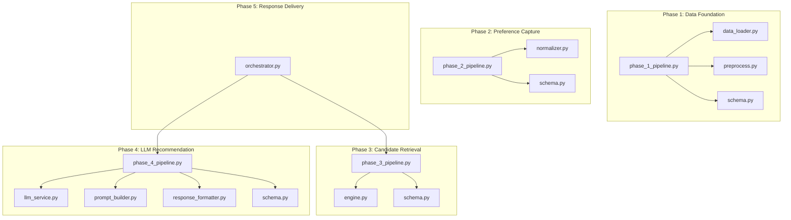
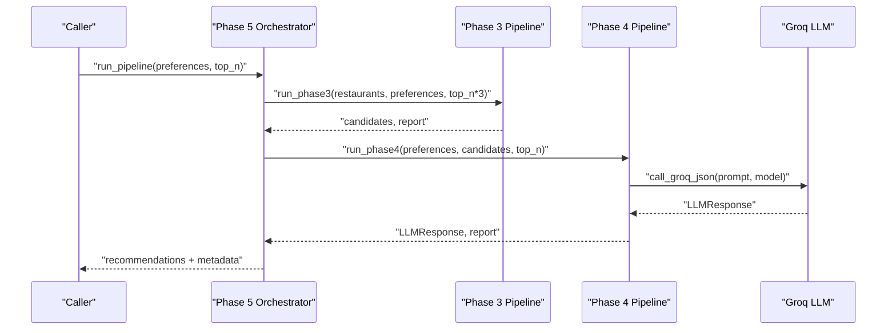
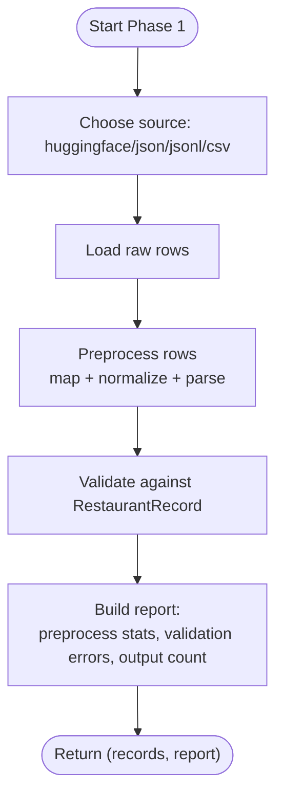
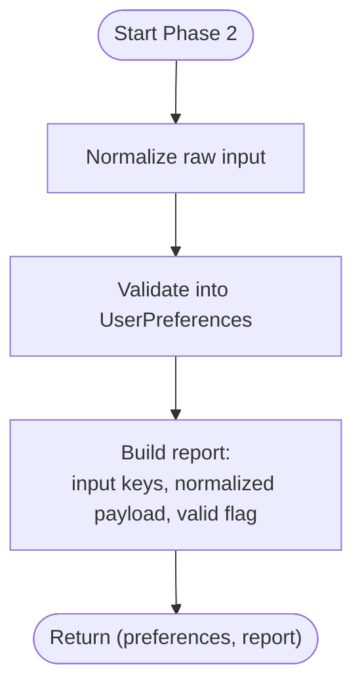
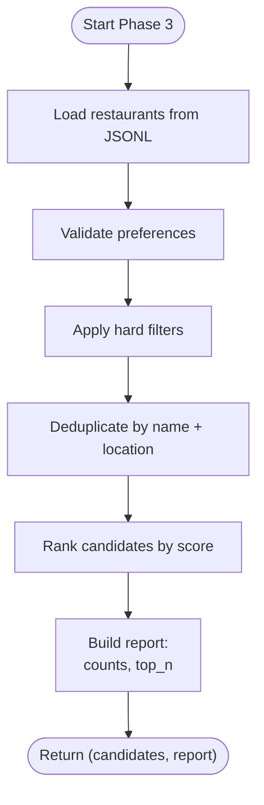
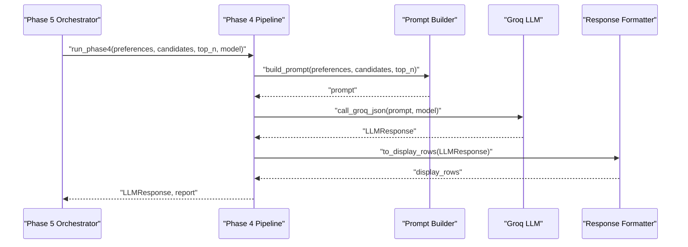
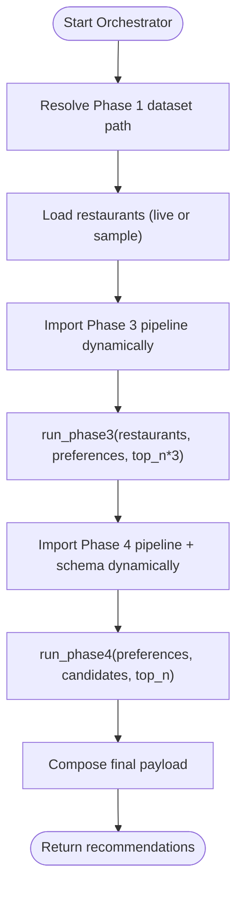
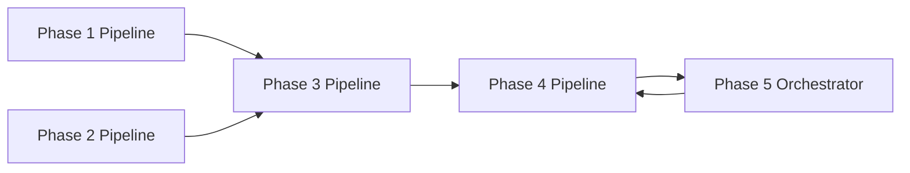

# Pipeline Orchestration

<cite>
**Referenced Files in This Document**
- [pipeline.py](file://Zomato/architecture/phase_1_data_foundation/pipeline.py)
- [data_loader.py](file://Zomato/architecture/phase_1_data_foundation/data_loader.py)
- [preprocess.py](file://Zomato/architecture/phase_1_data_foundation/preprocess.py)
- [schema.py](file://Zomato/architecture/phase_1_data_foundation/schema.py)
- [pipeline.py](file://Zomato/architecture/phase_2_preference_capture/pipeline.py)
- [normalizer.py](file://Zomato/architecture/phase_2_preference_capture/normalizer.py)
- [schema.py](file://Zomato/architecture/phase_2_preference_capture/schema.py)
- [pipeline.py](file://Zomato/architecture/phase_3_candidate_retrieval/pipeline.py)
- [engine.py](file://Zomato/architecture/phase_3_candidate_retrieval/engine.py)
- [schema.py](file://Zomato/architecture/phase_3_candidate_retrieval/schema.py)
- [pipeline.py](file://Zomato/architecture/phase_4_llm_recommendation/pipeline.py)
- [llm_service.py](file://Zomato/architecture/phase_4_llm_recommendation/llm_service.py)
- [prompt_builder.py](file://Zomato/architecture/phase_4_llm_recommendation/prompt_builder.py)
- [response_formatter.py](file://Zomato/architecture/phase_4_llm_recommendation/response_formatter.py)
- [schema.py](file://Zomato/architecture/phase_4_llm_recommendation/schema.py)
- [orchestrator.py](file://Zomato/architecture/phase_5_response_delivery/backend/orchestrator.py)
</cite>

## Table of Contents
1. [Introduction](#introduction)
2. [Project Structure](#project-structure)
3. [Core Components](#core-components)
4. [Architecture Overview](#architecture-overview)
5. [Detailed Component Analysis](#detailed-component-analysis)
6. [Dependency Analysis](#dependency-analysis)
7. [Performance Considerations](#performance-considerations)
8. [Troubleshooting Guide](#troubleshooting-guide)
9. [Conclusion](#conclusion)
10. [Appendices](#appendices)

## Introduction
This document explains the Pipeline Orchestration component across the Zomato recommendation system. It focuses on how pipeline.py files coordinate data loading, preprocessing, validation, filtering, ranking, and LLM-driven recommendation generation. It documents sequential processing steps, data flow, error propagation, configuration options, timeouts, resource management, monitoring/logging, and debugging capabilities. It also describes how the orchestrator coordinates multiple phases and maintains data consistency.

## Project Structure
The orchestration spans five distinct phases:
- Phase 1: Data Foundation (load → preprocess → validate)
- Phase 2: Preference Capture (normalize → validate)
- Phase 3: Candidate Retrieval (filter + rank)
- Phase 4: LLM Recommendation (prompt → Groq call → validate/format)
- Phase 5: Response Delivery (orchestrator chains Phases 3+4 and provides fallbacks)

**Diagram sources**
- [pipeline.py:1-81](file://Zomato/architecture/phase_1_data_foundation/pipeline.py#L1-L81)
- [data_loader.py:1-78](file://Zomato/architecture/phase_1_data_foundation/data_loader.py#L1-L78)
- [preprocess.py:1-185](file://Zomato/architecture/phase_1_data_foundation/preprocess.py#L1-L185)
- [schema.py:1-54](file://Zomato/architecture/phase_1_data_foundation/schema.py#L1-L54)
- [pipeline.py:1-21](file://Zomato/architecture/phase_2_preference_capture/pipeline.py#L1-L21)
- [normalizer.py:1-91](file://Zomato/architecture/phase_2_preference_capture/normalizer.py#L1-L91)
- [schema.py:1-72](file://Zomato/architecture/phase_2_preference_capture/schema.py#L1-L72)
- [pipeline.py:1-51](file://Zomato/architecture/phase_3_candidate_retrieval/pipeline.py#L1-L51)
- [engine.py:1-118](file://Zomato/architecture/phase_3_candidate_retrieval/engine.py#L1-L118)
- [schema.py:1-35](file://Zomato/architecture/phase_3_candidate_retrieval/schema.py#L1-L35)
- [pipeline.py:1-47](file://Zomato/architecture/phase_4_llm_recommendation/pipeline.py#L1-L47)
- [llm_service.py:1-43](file://Zomato/architecture/phase_4_llm_recommendation/llm_service.py#L1-L43)
- [prompt_builder.py:1-45](file://Zomato/architecture/phase_4_llm_recommendation/prompt_builder.py#L1-L45)
- [response_formatter.py:1-22](file://Zomato/architecture/phase_4_llm_recommendation/response_formatter.py#L1-L22)
- [schema.py:1-54](file://Zomato/architecture/phase_4_llm_recommendation/schema.py#L1-L54)
- [orchestrator.py:1-292](file://Zomato/architecture/phase_5_response_delivery/backend/orchestrator.py#L1-L292)

**Section sources**
- [pipeline.py:1-81](file://Zomato/architecture/phase_1_data_foundation/pipeline.py#L1-L81)
- [pipeline.py:1-21](file://Zomato/architecture/phase_2_preference_capture/pipeline.py#L1-L21)
- [pipeline.py:1-51](file://Zomato/architecture/phase_3_candidate_retrieval/pipeline.py#L1-L51)
- [pipeline.py:1-47](file://Zomato/architecture/phase_4_llm_recommendation/pipeline.py#L1-L47)
- [orchestrator.py:1-292](file://Zomato/architecture/phase_5_response_delivery/backend/orchestrator.py#L1-L292)

## Core Components
- Phase 1 Pipeline: Loads raw data from multiple sources, preprocesses and validates records, and produces a validated dataset plus a processing report.
- Phase 2 Pipeline: Normalizes user preferences and validates them into a structured schema.
- Phase 3 Pipeline: Applies hard filters and scores candidates, deduplicates entries, and ranks top-N results.
- Phase 4 Pipeline: Builds prompts, calls the LLM service, validates responses, and formats display rows.
- Phase 5 Orchestrator: Dynamically imports and executes Phases 3 and 4, manages fallbacks, and returns a unified recommendation payload.

Key orchestration responsibilities:
- Data sourcing and consistency across phases
- Error propagation and graceful degradation
- Fresh module imports to avoid caching issues
- Environment-driven configuration (e.g., API keys)
- Reporting and diagnostics

**Section sources**
- [pipeline.py:21-67](file://Zomato/architecture/phase_1_data_foundation/pipeline.py#L21-L67)
- [pipeline.py:11-20](file://Zomato/architecture/phase_2_preference_capture/pipeline.py#L11-L20)
- [pipeline.py:24-50](file://Zomato/architecture/phase_3_candidate_retrieval/pipeline.py#L24-L50)
- [pipeline.py:29-46](file://Zomato/architecture/phase_4_llm_recommendation/pipeline.py#L29-L46)
- [orchestrator.py:112-291](file://Zomato/architecture/phase_5_response_delivery/backend/orchestrator.py#L112-L291)

## Architecture Overview
The orchestration follows a staged pipeline with explicit boundaries and deterministic data contracts:
- Phase 1 produces validated RestaurantRecord objects.
- Phase 2 produces validated UserPreferences.
- Phase 3 consumes RestaurantRecord and UserPreferences to produce Candidate rankings.
- Phase 4 consumes CandidateInput and PreferencesInput to produce LLMResponse.
- Phase 5 orchestrator composes the outputs and ensures resilience.

**Diagram sources**
- [orchestrator.py:112-291](file://Zomato/architecture/phase_5_response_delivery/backend/orchestrator.py#L112-L291)
- [pipeline.py:24-50](file://Zomato/architecture/phase_3_candidate_retrieval/pipeline.py#L24-L50)
- [pipeline.py:29-46](file://Zomato/architecture/phase_4_llm_recommendation/pipeline.py#L29-L46)
- [llm_service.py:19-42](file://Zomato/architecture/phase_4_llm_recommendation/llm_service.py#L19-L42)

## Detailed Component Analysis

### Phase 1: Data Foundation Pipeline
Responsibilities:
- Load raw data from Hugging Face or local JSON/JSONL/CSV sources.
- Preprocess and normalize fields to a canonical schema.
- Validate normalized rows into typed records.
- Produce a report summarizing preprocessing and validation outcomes.

Processing flow:
- Source selection and loading
- Preprocessing pass (mapping, normalization, parsing)
- Validation against schema
- Report composition

**Diagram sources**
- [pipeline.py:21-67](file://Zomato/architecture/phase_1_data_foundation/pipeline.py#L21-L67)
- [data_loader.py:14-77](file://Zomato/architecture/phase_1_data_foundation/data_loader.py#L14-L77)
- [preprocess.py:118-184](file://Zomato/architecture/phase_1_data_foundation/preprocess.py#L118-L184)
- [schema.py:10-53](file://Zomato/architecture/phase_1_data_foundation/schema.py#L10-L53)

Configuration and parameters:
- source: "huggingface" | "json" | "jsonl" | "csv"
- path: required for json/jsonl/csv
- dataset_id, split: defaults for Hugging Face
- max_rows: optional row limit

Error handling:
- Raises ValueError for unknown source or missing path for file-based sources.
- Validation errors collected and reported; partial failures recorded.

Export utilities:
- JSONL writer for records
- Report writer for diagnostics

**Section sources**
- [pipeline.py:21-81](file://Zomato/architecture/phase_1_data_foundation/pipeline.py#L21-L81)
- [data_loader.py:14-77](file://Zomato/architecture/phase_1_data_foundation/data_loader.py#L14-L77)
- [preprocess.py:118-184](file://Zomato/architecture/phase_1_data_foundation/preprocess.py#L118-L184)
- [schema.py:10-53](file://Zomato/architecture/phase_1_data_foundation/schema.py#L10-L53)

### Phase 2: Preference Capture Pipeline
Responsibilities:
- Normalize noisy user input into canonical fields.
- Validate normalized preferences into a structured schema.

Processing flow:
- Normalize raw input (budget, cuisines, ratings, optional preferences)
- Validate into UserPreferences

**Diagram sources**
- [pipeline.py:11-20](file://Zomato/architecture/phase_2_preference_capture/pipeline.py#L11-L20)
- [normalizer.py:76-90](file://Zomato/architecture/phase_2_preference_capture/normalizer.py#L76-L90)
- [schema.py:8-71](file://Zomato/architecture/phase_2_preference_capture/schema.py#L8-L71)

**Section sources**
- [pipeline.py:11-20](file://Zomato/architecture/phase_2_preference_capture/pipeline.py#L11-L20)
- [normalizer.py:76-90](file://Zomato/architecture/phase_2_preference_capture/normalizer.py#L76-L90)
- [schema.py:8-71](file://Zomato/architecture/phase_2_preference_capture/schema.py#L8-L71)

### Phase 3: Candidate Retrieval Pipeline
Responsibilities:
- Load cleaned restaurant records.
- Apply hard filters based on preferences.
- Deduplicate candidates by name and location.
- Score and rank candidates.

Processing flow:
- Load restaurants from JSONL
- Validate preferences
- Apply hard filters
- Deduplicate
- Rank top-N

**Diagram sources**
- [pipeline.py:13-50](file://Zomato/architecture/phase_3_candidate_retrieval/pipeline.py#L13-L50)
- [engine.py:23-117](file://Zomato/architecture/phase_3_candidate_retrieval/engine.py#L23-L117)
- [schema.py:10-34](file://Zomato/architecture/phase_3_candidate_retrieval/schema.py#L10-L34)

**Section sources**
- [pipeline.py:13-50](file://Zomato/architecture/phase_3_candidate_retrieval/pipeline.py#L13-L50)
- [engine.py:23-117](file://Zomato/architecture/phase_3_candidate_retrieval/engine.py#L23-L117)
- [schema.py:10-34](file://Zomato/architecture/phase_3_candidate_retrieval/schema.py#L10-L34)

### Phase 4: LLM Recommendation Pipeline
Responsibilities:
- Build a structured prompt from preferences and candidates.
- Call the LLM service.
- Validate and format the response.

Processing flow:
- Load candidates/preferences JSON
- Build prompt
- Call Groq
- Convert to display rows

**Diagram sources**
- [pipeline.py:29-46](file://Zomato/architecture/phase_4_llm_recommendation/pipeline.py#L29-L46)
- [prompt_builder.py:10-44](file://Zomato/architecture/phase_4_llm_recommendation/prompt_builder.py#L10-L44)
- [llm_service.py:19-42](file://Zomato/architecture/phase_4_llm_recommendation/llm_service.py#L19-L42)
- [response_formatter.py:8-21](file://Zomato/architecture/phase_4_llm_recommendation/response_formatter.py#L8-L21)
- [schema.py:1-54](file://Zomato/architecture/phase_4_llm_recommendation/schema.py#L1-L54)

**Section sources**
- [pipeline.py:15-46](file://Zomato/architecture/phase_4_llm_recommendation/pipeline.py#L15-L46)
- [prompt_builder.py:10-44](file://Zomato/architecture/phase_4_llm_recommendation/prompt_builder.py#L10-L44)
- [llm_service.py:19-42](file://Zomato/architecture/phase_4_llm_recommendation/llm_service.py#L19-L42)
- [response_formatter.py:8-21](file://Zomato/architecture/phase_4_llm_recommendation/response_formatter.py#L8-L21)
- [schema.py:1-54](file://Zomato/architecture/phase_4_llm_recommendation/schema.py#L1-L54)

### Phase 5: Response Delivery Orchestrator
Responsibilities:
- Resolve and load the latest Phase 1 dataset or fall back to samples.
- Dynamically import Phase 3 and Phase 4 pipelines to ensure fresh state.
- Execute Phase 3 filtering/ranking and Phase 4 LLM ranking.
- Provide fallback behavior when LLM is unavailable or dataset is missing.
- Return a unified recommendation payload with metadata.

Processing flow:
- Resolve dataset path and load restaurants
- Import Phase 3 pipeline dynamically
- Run Phase 3 and capture report
- Import Phase 4 pipeline and LLM schema dynamically
- Run Phase 4 and capture report
- Compose final response

**Diagram sources**
- [orchestrator.py:112-291](file://Zomato/architecture/phase_5_response_delivery/backend/orchestrator.py#L112-L291)

**Section sources**
- [orchestrator.py:112-291](file://Zomato/architecture/phase_5_response_delivery/backend/orchestrator.py#L112-L291)

## Dependency Analysis
- Cohesion: Each phase encapsulates a single responsibility with clear input/output contracts.
- Coupling:
  - Phase 1 feeds Phase 3 (RestaurantRecord).
  - Phase 2 feeds Phase 3 (UserPreferences).
  - Phase 3 feeds Phase 4 (CandidateInput, PreferencesInput).
  - Phase 5 orchestrates imports and runtime dependencies.
- External dependencies:
  - Hugging Face datasets for Phase 1.
  - Groq API for Phase 4.
  - Environment variables for configuration.

**Diagram sources**
- [pipeline.py:1-81](file://Zomato/architecture/phase_1_data_foundation/pipeline.py#L1-L81)
- [pipeline.py:1-21](file://Zomato/architecture/phase_2_preference_capture/pipeline.py#L1-L21)
- [pipeline.py:1-51](file://Zomato/architecture/phase_3_candidate_retrieval/pipeline.py#L1-L51)
- [pipeline.py:1-47](file://Zomato/architecture/phase_4_llm_recommendation/pipeline.py#L1-L47)
- [orchestrator.py:1-292](file://Zomato/architecture/phase_5_response_delivery/backend/orchestrator.py#L1-L292)

**Section sources**
- [pipeline.py:1-81](file://Zomato/architecture/phase_1_data_foundation/pipeline.py#L1-L81)
- [pipeline.py:1-21](file://Zomato/architecture/phase_2_preference_capture/pipeline.py#L1-L21)
- [pipeline.py:1-51](file://Zomato/architecture/phase_3_candidate_retrieval/pipeline.py#L1-L51)
- [pipeline.py:1-47](file://Zomato/architecture/phase_4_llm_recommendation/pipeline.py#L1-L47)
- [orchestrator.py:1-292](file://Zomato/architecture/phase_5_response_delivery/backend/orchestrator.py#L1-L292)

## Performance Considerations
- Streaming vs. in-memory loading:
  - Phase 1 supports streaming iteration for large datasets to reduce memory footprint.
- Deduplication:
  - Phase 3 deduplicates candidates by name and location to avoid redundant results.
- Scoring and ranking:
  - Candidate scoring is O(N) per restaurant; top-N slicing limits output size.
- LLM calls:
  - Phase 4 uses a small top-N for prompt size control; consider batching or pagination if scaling.
- Fresh imports:
  - Phase 5 clears module caches and reloads modules to prevent stale behavior during development.

[No sources needed since this section provides general guidance]

## Troubleshooting Guide
Common issues and remedies:
- Missing dataset:
  - Symptom: Orchestrator falls back to sample recommendations.
  - Action: Ensure Phase 1 JSONL exists in the expected output directory or provide a compatible dataset.
- LLM API key missing:
  - Symptom: Runtime error indicating missing GROQ_API_KEY.
  - Action: Set GROQ_API_KEY in the environment or use fallback logic.
- Validation errors:
  - Symptom: Non-empty validation error lists in reports.
  - Action: Inspect the first few validation errors and adjust preprocessing or input normalization.
- Dynamic import failures:
  - Symptom: Exceptions during dynamic imports in Phase 5.
  - Action: Verify module paths and ensure required dependencies are installed.

Monitoring and logging:
- Debug prints indicate dataset loading counts and stage transitions.
- Reports include counts and previews to aid quick diagnostics.

**Section sources**
- [orchestrator.py:158-190](file://Zomato/architecture/phase_5_response_delivery/backend/orchestrator.py#L158-L190)
- [orchestrator.py:212-213](file://Zomato/architecture/phase_5_response_delivery/backend/orchestrator.py#L212-L213)
- [pipeline.py:58-67](file://Zomato/architecture/phase_1_data_foundation/pipeline.py#L58-L67)
- [preprocess.py:169-184](file://Zomato/architecture/phase_1_data_foundation/preprocess.py#L169-L184)

## Conclusion
The Pipeline Orchestration component provides a robust, modular, and resilient recommendation pipeline. It enforces strong data contracts across phases, manages external integrations carefully, and offers clear fallbacks. The orchestrator’s dynamic imports and reporting mechanisms support safe evolution and debugging. Together, these practices maintain data consistency and enable scalable operation.

[No sources needed since this section summarizes without analyzing specific files]

## Appendices

### Configuration Options
- Phase 1:
  - source: "huggingface" | "json" | "jsonl" | "csv"
  - path: required for file-based sources
  - dataset_id, split: defaults for Hugging Face
  - max_rows: optional row limit
- Phase 2:
  - Free-text and categorical preferences are normalized and validated.
- Phase 3:
  - top_n: number of candidates to return after ranking
- Phase 4:
  - top_n: number of recommendations to request from the LLM
  - model: LLM model identifier
- Phase 5:
  - top_n: final number of recommendations returned
  - Environment variables: GROQ_API_KEY

Timeout handling and resource management:
- LLM calls rely on the underlying SDK’s default timeouts; configure environment or SDK settings as needed.
- Prefer smaller top_n values to reduce prompt size and latency.
- Use streaming loaders for large datasets to manage memory usage.

Integration with external data sources:
- Hugging Face datasets for Phase 1.
- Local JSON/JSONL/CSV for ingestion.
- Groq API for Phase 4.

Completion callbacks:
- Reports are generated at each stage and can be used to trigger downstream actions or persist artifacts.

**Section sources**
- [pipeline.py:21-28](file://Zomato/architecture/phase_1_data_foundation/pipeline.py#L21-L28)
- [pipeline.py:24-28](file://Zomato/architecture/phase_3_candidate_retrieval/pipeline.py#L24-L28)
- [pipeline.py:29-34](file://Zomato/architecture/phase_4_llm_recommendation/pipeline.py#L29-L34)
- [llm_service.py:19-42](file://Zomato/architecture/phase_4_llm_recommendation/llm_service.py#L19-L42)
- [orchestrator.py:112-124](file://Zomato/architecture/phase_5_response_delivery/backend/orchestrator.py#L112-L124)