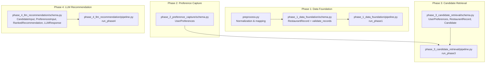
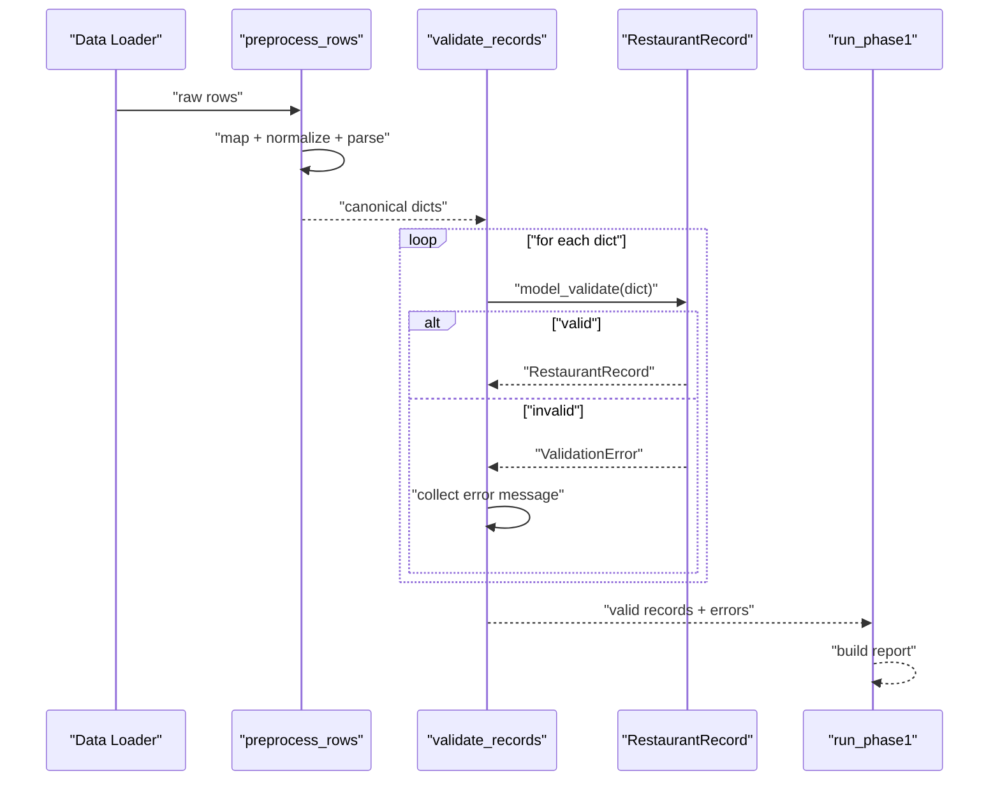
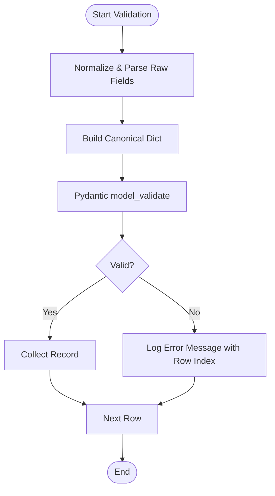
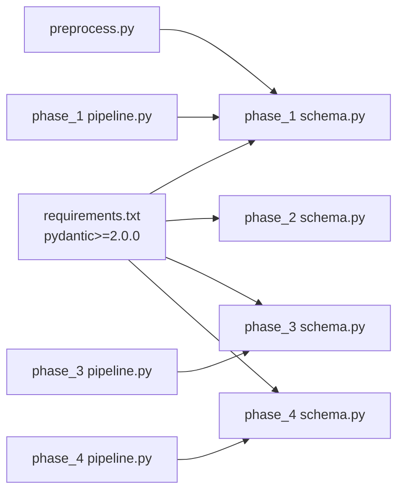

# Schema Validation

<cite>
**Referenced Files in This Document**
- [schema.py](file://Zomato/architecture/phase_1_data_foundation/schema.py)
- [preprocess.py](file://Zomato/architecture/phase_1_data_foundation/preprocess.py)
- [pipeline.py](file://Zomato/architecture/phase_1_data_foundation/pipeline.py)
- [schema.py](file://Zomato/architecture/phase_2_preference_capture/schema.py)
- [schema.py](file://Zomato/architecture/phase_3_candidate_retrieval/schema.py)
- [pipeline.py](file://Zomato/architecture/phase_3_candidate_retrieval/pipeline.py)
- [schema.py](file://Zomato/architecture/phase_4_llm_recommendation/schema.py)
- [pipeline.py](file://Zomato/architecture/phase_4_llm_recommendation/pipeline.py)
- [sample_input.json](file://Zomato/architecture/phase_1_data_foundation/sample_input.json)
- [sample_restaurants.jsonl](file://Zomato/architecture/phase_3_candidate_retrieval/sample_restaurants.jsonl)
- [requirements.txt](file://Zomato/architecture/phase_1_data_foundation/requirements.txt)
</cite>

## Table of Contents
1. [Introduction](#introduction)
2. [Project Structure](#project-structure)
3. [Core Components](#core-components)
4. [Architecture Overview](#architecture-overview)
5. [Detailed Component Analysis](#detailed-component-analysis)
6. [Dependency Analysis](#dependency-analysis)
7. [Performance Considerations](#performance-considerations)
8. [Troubleshooting Guide](#troubleshooting-guide)
9. [Conclusion](#conclusion)

## Introduction
This document explains the Schema Validation component across the Zomato project’s phases. It focuses on the Pydantic-based validation rules that ensure data integrity for restaurant records and user preferences. The documentation covers model definitions, field-level constraints, custom validators, error handling, and how validation integrates into the end-to-end pipeline to prevent downstream processing errors.

## Project Structure
The Schema Validation component spans multiple phases:
- Phase 1 (Data Foundation): Defines the canonical RestaurantRecord model and validation logic for raw data ingestion.
- Phase 2 (Preference Capture): Defines validated user preference models with custom normalization and constraints.
- Phase 3 (Candidate Retrieval): Extends models for candidate ranking and filtering with stricter constraints.
- Phase 4 (LLM Recommendation): Defines input and output models for LLM processing with bounded ranges.

**Diagram sources**
- [schema.py:10-54](file://Zomato/architecture/phase_1_data_foundation/schema.py#L10-L54)
- [preprocess.py:118-185](file://Zomato/architecture/phase_1_data_foundation/preprocess.py#L118-L185)
- [pipeline.py:21-67](file://Zomato/architecture/phase_1_data_foundation/pipeline.py#L21-L67)
- [schema.py:8-72](file://Zomato/architecture/phase_2_preference_capture/schema.py#L8-L72)
- [schema.py:10-35](file://Zomato/architecture/phase_3_candidate_retrieval/schema.py#L10-L35)
- [pipeline.py:24-51](file://Zomato/architecture/phase_3_candidate_retrieval/pipeline.py#L24-L51)
- [schema.py:8-38](file://Zomato/architecture/phase_4_llm_recommendation/schema.py#L8-L38)
- [pipeline.py:29-47](file://Zomato/architecture/phase_4_llm_recommendation/pipeline.py#L29-L47)

**Section sources**
- [schema.py:1-54](file://Zomato/architecture/phase_1_data_foundation/schema.py#L1-L54)
- [preprocess.py:1-185](file://Zomato/architecture/phase_1_data_foundation/preprocess.py#L1-L185)
- [pipeline.py:1-81](file://Zomato/architecture/phase_1_data_foundation/pipeline.py#L1-L81)
- [schema.py:1-72](file://Zomato/architecture/phase_2_preference_capture/schema.py#L1-L72)
- [schema.py:1-35](file://Zomato/architecture/phase_3_candidate_retrieval/schema.py#L1-L35)
- [pipeline.py:1-51](file://Zomato/architecture/phase_3_candidate_retrieval/pipeline.py#L1-L51)
- [schema.py:1-38](file://Zomato/architecture/phase_4_llm_recommendation/schema.py#L1-L38)
- [pipeline.py:1-47](file://Zomato/architecture/phase_4_llm_recommendation/pipeline.py#L1-L47)

## Core Components
- RestaurantRecord (Phase 1): Canonical model for validated restaurant entries with string normalization and numeric bounds.
- UserPreferences (Phases 2–4): Structured preferences with normalized enums and lists.
- Candidate (Phase 3): Shortlisted candidates with scoring and reasons.
- CandidateInput, PreferencesInput, RankedRecommendation, LLMResponse (Phase 4): LLM input/output models with strict ranges.

Key validation characteristics:
- String fields enforce minimum length and whitespace normalization.
- Numeric fields enforce lower and upper bounds.
- Extra fields are disallowed by default in Phase 1.
- Custom validators transform inputs (e.g., title-case, budget enum, parsing ratings/costs).

**Section sources**
- [schema.py:10-39](file://Zomato/architecture/phase_1_data_foundation/schema.py#L10-L39)
- [schema.py:8-72](file://Zomato/architecture/phase_2_preference_capture/schema.py#L8-L72)
- [schema.py:10-35](file://Zomato/architecture/phase_3_candidate_retrieval/schema.py#L10-L35)
- [schema.py:8-38](file://Zomato/architecture/phase_4_llm_recommendation/schema.py#L8-L38)

## Architecture Overview
The validation pipeline follows a consistent pattern:
1. Preprocessing transforms heterogeneous inputs into canonical fields.
2. Pydantic models validate canonical dictionaries into typed objects.
3. Errors are collected and surfaced in reports.
4. Validated objects flow into subsequent phases.

**Diagram sources**
- [preprocess.py:169-185](file://Zomato/architecture/phase_1_data_foundation/preprocess.py#L169-L185)
- [schema.py:41-54](file://Zomato/architecture/phase_1_data_foundation/schema.py#L41-L54)
- [pipeline.py:21-67](file://Zomato/architecture/phase_1_data_foundation/pipeline.py#L21-L67)

## Detailed Component Analysis

### Phase 1: RestaurantRecord (Canonical Schema)
The RestaurantRecord model defines the canonical structure for restaurant data:
- Fields: restaurant_name, location, cuisine, cost_for_two, rating, extras.
- Constraints:
  - String fields require non-empty values after normalization.
  - cost_for_two allows None and must be non-negative if present.
  - rating allows None and must be within [0.0, 5.0] if present.
  - extras defaults to an empty dict.
- Custom validator:
  - Strips and normalizes strings for restaurant_name, location, cuisine before validation.
- Extra fields:
  - Disallowed globally via model_config.

Validation logic examples:
- Name formatting: Trims whitespace and converts to string; enforces min_length=1.
- Location coordinates: Not modeled here; location is normalized string.
- Cuisine type enumeration: No fixed enum; normalized to title-case with comma-separated items.
- Cost for two calculations: Enforced non-negativity; parsed from raw strings with numeric extraction.
- Rating ranges: Enforced 0.0–5.0; handles 0–10 scales by dividing when appropriate.

Error handling:
- validate_records iterates rows, collects exceptions per row, and returns valid records plus error messages.

Integration:
- run_phase1 orchestrates loading, preprocessing, validation, and reporting.

**Section sources**
- [schema.py:10-39](file://Zomato/architecture/phase_1_data_foundation/schema.py#L10-L39)
- [schema.py:41-54](file://Zomato/architecture/phase_1_data_foundation/schema.py#L41-L54)
- [preprocess.py:60-88](file://Zomato/architecture/phase_1_data_foundation/preprocess.py#L60-L88)
- [preprocess.py:94-116](file://Zomato/architecture/phase_1_data_foundation/preprocess.py#L94-L116)
- [pipeline.py:21-67](file://Zomato/architecture/phase_1_data_foundation/pipeline.py#L21-L67)

### Phase 2: UserPreferences (Structured Preferences)
UserPreferences enforces:
- location: Normalized to title-case.
- budget: Enumerated to one of low, medium, high; otherwise raises validation error.
- cuisines: Normalized list with deduplication and title-case.
- optional_preferences: Normalized list with deduplication and lowercase.
- min_rating: Bounded to [0.0, 5.0].
- free_text: Normalized to stripped string.

Custom validation rules:
- Budget normalization and validation.
- List normalization with deduplication and casing.

**Section sources**
- [schema.py:8-72](file://Zomato/architecture/phase_2_preference_capture/schema.py#L8-L72)

### Phase 3: Candidate Retrieval Models
Extends models for filtering and ranking:
- UserPreferences: Adds regex pattern for budget and enforces non-negative cost_for_two.
- RestaurantRecord: Adds extras dict and maintains rating bounds.
- Candidate: Represents shortlisted entries with score and match reasons.

Hard filters and deduplication:
- run_phase3 validates preferences, applies hard filters, deduplicates by name+location, and ranks candidates.

**Section sources**
- [schema.py:10-35](file://Zomato/architecture/phase_3_candidate_retrieval/schema.py#L10-L35)
- [pipeline.py:24-51](file://Zomato/architecture/phase_3_candidate_retrieval/pipeline.py#L24-L51)

### Phase 4: LLM Recommendation Models
Defines:
- CandidateInput: Restaurant fields with bounded rating and cost.
- PreferencesInput: User preferences with bounded rating.
- RankedRecommendation: Output candidate with ranking and explanation.
- LLMResponse: Aggregates summary and recommendations.

LLM pipeline:
- Loads candidates and preferences, validates them, builds prompts, calls LLM, and formats results.

**Section sources**
- [schema.py:8-38](file://Zomato/architecture/phase_4_llm_recommendation/schema.py#L8-L38)
- [pipeline.py:29-47](file://Zomato/architecture/phase_4_llm_recommendation/pipeline.py#L29-L47)

### Validation Error Handling and Data Integrity
- Collection strategy: validate_records aggregates all validation failures with row indices.
- Reporting: run_phase1 includes counts and sample errors in the report.
- Strictness: Phase 1 forbids extra fields; others define explicit schemas.
- Normalization: preprocess.py cleans and parses raw fields before Pydantic validation.

**Diagram sources**
- [preprocess.py:145-166](file://Zomato/architecture/phase_1_data_foundation/preprocess.py#L145-L166)
- [schema.py:41-54](file://Zomato/architecture/phase_1_data_foundation/schema.py#L41-L54)
- [pipeline.py:48-67](file://Zomato/architecture/phase_1_data_foundation/pipeline.py#L48-L67)

## Dependency Analysis
- Pydantic version requirement ensures compatibility with BaseModel, Field, and field_validator.
- The schema module depends on typing and pydantic constructs.
- Pipelines import schema models and orchestrate validation and reporting.

**Diagram sources**
- [requirements.txt:1-4](file://Zomato/architecture/phase_1_data_foundation/requirements.txt#L1-L4)
- [schema.py:1-54](file://Zomato/architecture/phase_1_data_foundation/schema.py#L1-L54)
- [schema.py:1-72](file://Zomato/architecture/phase_2_preference_capture/schema.py#L1-L72)
- [schema.py:1-35](file://Zomato/architecture/phase_3_candidate_retrieval/schema.py#L1-L35)
- [schema.py:1-38](file://Zomato/architecture/phase_4_llm_recommendation/schema.py#L1-L38)
- [preprocess.py:1-185](file://Zomato/architecture/phase_1_data_foundation/preprocess.py#L1-L185)
- [pipeline.py:1-81](file://Zomato/architecture/phase_1_data_foundation/pipeline.py#L1-L81)
- [pipeline.py:1-51](file://Zomato/architecture/phase_3_candidate_retrieval/pipeline.py#L1-L51)
- [pipeline.py:1-47](file://Zomato/architecture/phase_4_llm_recommendation/pipeline.py#L1-L47)

**Section sources**
- [requirements.txt:1-4](file://Zomato/architecture/phase_1_data_foundation/requirements.txt#L1-L4)
- [schema.py:1-54](file://Zomato/architecture/phase_1_data_foundation/schema.py#L1-L54)
- [schema.py:1-72](file://Zomato/architecture/phase_2_preference_capture/schema.py#L1-L72)
- [schema.py:1-35](file://Zomato/architecture/phase_3_candidate_retrieval/schema.py#L1-L35)
- [schema.py:1-38](file://Zomato/architecture/phase_4_llm_recommendation/schema.py#L1-L38)
- [preprocess.py:1-185](file://Zomato/architecture/phase_1_data_foundation/preprocess.py#L1-L185)
- [pipeline.py:1-81](file://Zomato/architecture/phase_1_data_foundation/pipeline.py#L1-L81)
- [pipeline.py:1-51](file://Zomato/architecture/phase_3_candidate_retrieval/pipeline.py#L1-L51)
- [pipeline.py:1-47](file://Zomato/architecture/phase_4_llm_recommendation/pipeline.py#L1-L47)

## Performance Considerations
- Preprocessing reduces variability early, minimizing downstream validation failures.
- Using model_validate with strict schemas avoids expensive runtime checks later.
- Deduplication in Phase 3 reduces redundant scoring work.
- Bounded numeric fields prevent extreme outliers that could cause downstream anomalies.

## Troubleshooting Guide
Common validation issues and resolutions:
- Missing required fields: Ensure restaurant_name, location, cuisine are present after normalization.
- Invalid budget values: Use one of low, medium, high for budget.
- Out-of-range ratings: Ensure rating is within [0.0, 5.0].
- Negative costs: Ensure cost_for_two is non-negative if provided.
- Extra fields: Remove unknown keys to satisfy forbid extra fields.

Diagnostic steps:
- Inspect validation_errors_count and sample errors in the Phase 1 report.
- Review preprocess statistics for dropped incomplete rows.
- Validate preferences and candidates individually before pipeline runs.

**Section sources**
- [pipeline.py:61-67](file://Zomato/architecture/phase_1_data_foundation/pipeline.py#L61-L67)
- [preprocess.py:169-185](file://Zomato/architecture/phase_1_data_foundation/preprocess.py#L169-L185)
- [schema.py:23-29](file://Zomato/architecture/phase_2_preference_capture/schema.py#L23-L29)
- [schema.py:12-14](file://Zomato/architecture/phase_3_candidate_retrieval/schema.py#L12-L14)
- [schema.py:12-13](file://Zomato/architecture/phase_4_llm_recommendation/schema.py#L12-L13)

## Conclusion
The Schema Validation component establishes robust data quality gates across all phases. By combining preprocessing normalization, Pydantic models, and strict constraints, the system ensures downstream components receive consistent, valid data. Custom validators handle real-world input quirks, while error collection and reporting enable rapid debugging and continuous improvement.