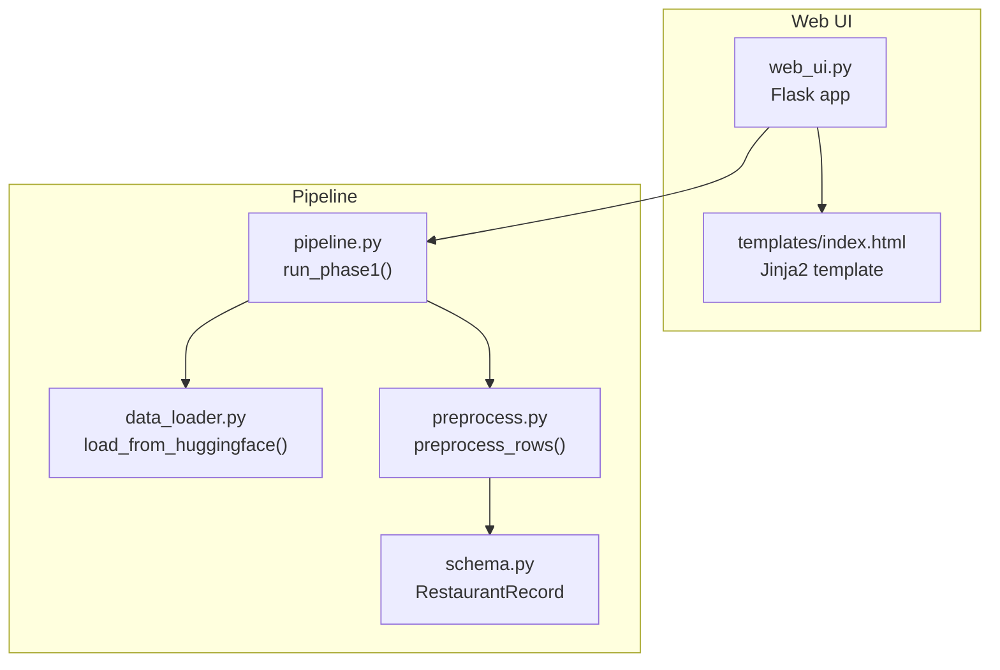
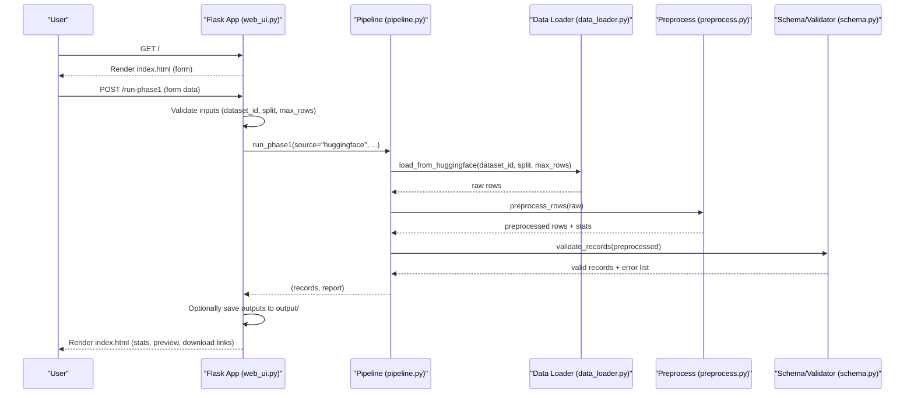
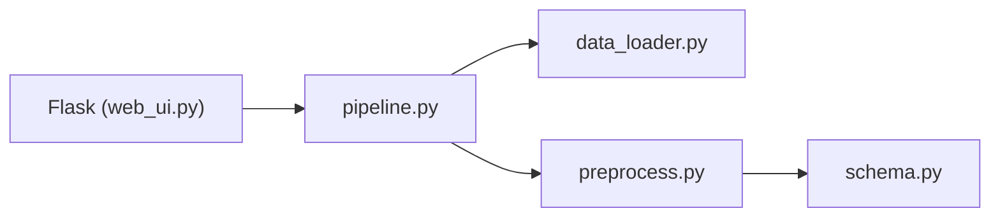

# Web UI Integration

<cite>
**Referenced Files in This Document**
- [web_ui.py](file://Zomato/architecture/phase_1_data_foundation/web_ui.py)
- [index.html](file://Zomato/architecture/phase_1_data_foundation/templates/index.html)
- [data_loader.py](file://Zomato/architecture/phase_1_data_foundation/data_loader.py)
- [preprocess.py](file://Zomato/architecture/phase_1_data_foundation/preprocess.py)
- [pipeline.py](file://Zomato/architecture/phase_1_data_foundation/pipeline.py)
- [schema.py](file://Zomato/architecture/phase_1_data_foundation/schema.py)
- [requirements.txt](file://Zomato/architecture/phase_1_data_foundation/requirements.txt)
</cite>

## Table of Contents
1. [Introduction](#introduction)
2. [Project Structure](#project-structure)
3. [Core Components](#core-components)
4. [Architecture Overview](#architecture-overview)
5. [Detailed Component Analysis](#detailed-component-analysis)
6. [Dependency Analysis](#dependency-analysis)
7. [Performance Considerations](#performance-considerations)
8. [Troubleshooting Guide](#troubleshooting-guide)
9. [Conclusion](#conclusion)

## Introduction
This document describes the Web UI Integration component for Phase 1 of the Zomato recommendation system. It focuses on the Flask-based web application that enables users to configure and execute the data foundation pipeline. The UI allows users to specify a Hugging Face dataset identifier, select a dataset split, limit the number of rows processed, and optionally persist outputs. The interface displays dataset statistics, validation outcomes, and a live preview of cleaned records. The implementation demonstrates robust form handling, error propagation, and static asset serving.

## Project Structure
The web UI is organized around a small Flask application with a single route for the main page and a dedicated endpoint for triggering the pipeline. Templates are rendered server-side and include inline CSS for minimal styling. Supporting modules handle data loading, preprocessing, validation, and reporting.

**Diagram sources**
- [web_ui.py:17-117](file://Zomato/architecture/phase_1_data_foundation/web_ui.py#L17-L117)
- [index.html:1-99](file://Zomato/architecture/phase_1_data_foundation/templates/index.html#L1-L99)
- [pipeline.py:21-67](file://Zomato/architecture/phase_1_data_foundation/pipeline.py#L21-L67)
- [data_loader.py:14-35](file://Zomato/architecture/phase_1_data_foundation/data_loader.py#L14-L35)
- [preprocess.py:169-184](file://Zomato/architecture/phase_1_data_foundation/preprocess.py#L169-L184)
- [schema.py:41-53](file://Zomato/architecture/phase_1_data_foundation/schema.py#L41-L53)

**Section sources**
- [web_ui.py:17-117](file://Zomato/architecture/phase_1_data_foundation/web_ui.py#L17-L117)
- [index.html:1-99](file://Zomato/architecture/phase_1_data_foundation/templates/index.html#L1-L99)
- [requirements.txt:1-4](file://Zomato/architecture/phase_1_data_foundation/requirements.txt#L1-L4)

## Core Components
- Flask Application: Defines routes for the home page, pipeline execution, file downloads, and favicon redirection.
- Template Rendering: Jinja2 renders the form, error messages, statistics, and preview table.
- Pipeline Orchestration: Executes data loading, preprocessing, validation, and reporting.
- Data Model and Validation: Pydantic model enforces field constraints and validation rules.
- Static Asset Serving: Serves generated artifacts from the output directory.

Key responsibilities:
- Form handling and validation in the UI layer
- Safe file serving restricted to the output directory
- Real-time feedback via rendered template blocks
- Error surfacing with stack traces for development

**Section sources**
- [web_ui.py:21-107](file://Zomato/architecture/phase_1_data_foundation/web_ui.py#L21-L107)
- [index.html:28-96](file://Zomato/architecture/phase_1_data_foundation/templates/index.html#L28-L96)
- [pipeline.py:21-67](file://Zomato/architecture/phase_1_data_foundation/pipeline.py#L21-L67)
- [schema.py:10-38](file://Zomato/architecture/phase_1_data_foundation/schema.py#L10-L38)

## Architecture Overview
The web UI integrates with the backend pipeline through a single POST endpoint. On submission, the application validates inputs, executes the pipeline, and renders results back to the user. Optional outputs are persisted to disk and made available for download.

**Diagram sources**
- [web_ui.py:33-95](file://Zomato/architecture/phase_1_data_foundation/web_ui.py#L33-L95)
- [pipeline.py:21-67](file://Zomato/architecture/phase_1_data_foundation/pipeline.py#L21-L67)
- [data_loader.py:14-35](file://Zomato/architecture/phase_1_data_foundation/data_loader.py#L14-L35)
- [preprocess.py:169-184](file://Zomato/architecture/phase_1_data_foundation/preprocess.py#L169-L184)
- [schema.py:41-53](file://Zomato/architecture/phase_1_data_foundation/schema.py#L41-L53)

## Detailed Component Analysis

### Flask Routes and Behavior
- Root route: Renders the form with default dataset ID and clears previous results.
- POST route: Validates inputs, invokes the pipeline, and renders results. Handles numeric conversion errors and unexpected exceptions.
- Download route: Serves files from the output directory with basename enforcement.
- Favicon route: Redirects to the index page.

User interaction patterns:
- Submitting the form triggers a full round-trip to the server.
- On success, statistics and a preview table appear.
- On error, the error block is shown with a stack trace.
- When enabled, download links are provided for saved outputs.

Real-time feedback:
- Immediate rendering of results after processing completes.
- No client-side polling; feedback occurs on page reload.

**Section sources**
- [web_ui.py:21-107](file://Zomato/architecture/phase_1_data_foundation/web_ui.py#L21-L107)
- [index.html:49-96](file://Zomato/architecture/phase_1_data_foundation/templates/index.html#L49-L96)

### Form Handling and Input Validation
Form fields:
- Dataset ID: Text input with default value.
- Split: Text input with default value.
- Max rows: Numeric input with minimum value constraint.
- Save outputs: Checkbox to persist results.

Server-side validation:
- Converts max_rows to integer; rejects non-positive values.
- Catches conversion errors and returns a 400 response with an error message.
- Wraps pipeline execution in a try/catch to capture exceptions and render a 500 response.

Template-level validation:
- Uses required attributes on inputs and a numeric input with min.
- Provides hints to guide users.

**Section sources**
- [web_ui.py:33-52](file://Zomato/architecture/phase_1_data_foundation/web_ui.py#L33-L52)
- [index.html:28-47](file://Zomato/architecture/phase_1_data_foundation/templates/index.html#L28-L47)

### Data Loading and Preprocessing
Data loading:
- Loads from Hugging Face datasets with optional row limits.
- Supports streaming iteration for memory efficiency (not used in this route).

Preprocessing:
- Normalizes names, locations, cuisines, ratings, and costs.
- Drops rows missing essential fields after normalization.
- Tracks counts for input, kept, and dropped rows.

Validation:
- Enforces minimum lengths for core fields.
- Constrains rating to a 0–5 scale.
- Disallows extra fields beyond the schema.

Report generation:
- Aggregates preprocessing stats and validation error counts.
- Limits validation error samples for readability.

**Section sources**
- [data_loader.py:14-35](file://Zomato/architecture/phase_1_data_foundation/data_loader.py#L14-L35)
- [preprocess.py:118-184](file://Zomato/architecture/phase_1_data_foundation/preprocess.py#L118-L184)
- [schema.py:10-38](file://Zomato/architecture/phase_1_data_foundation/schema.py#L10-L38)
- [pipeline.py:58-67](file://Zomato/architecture/phase_1_data_foundation/pipeline.py#L58-L67)

### Template Rendering and Output Presentation
Template structure:
- Inline CSS provides basic responsive layout and accessibility-friendly styles.
- Conditional blocks render error messages, success statistics, and preview tables.
- Preview table shows a subset of normalized records with placeholders for nulls.

Output persistence:
- When enabled, JSONL and report files are written to the output directory.
- Download links are generated dynamically for saved artifacts.

Accessibility and responsiveness:
- Uses semantic labels and hints.
- Responsive viewport meta tag and flexible widths.
- Minimal color contrast for readable text.

**Section sources**
- [index.html:1-99](file://Zomato/architecture/phase_1_data_foundation/templates/index.html#L1-L99)
- [web_ui.py:75-95](file://Zomato/architecture/phase_1_data_foundation/web_ui.py#L75-L95)

### Static Asset Serving and Security
- Output files are served only from the configured output directory.
- Filename sanitization ensures only basenames are used for downloads.
- Favicon route redirects to the index page.

Security considerations:
- Restricts downloads to a controlled directory.
- Prevents path traversal via basename enforcement.

**Section sources**
- [web_ui.py:98-107](file://Zomato/architecture/phase_1_data_foundation/web_ui.py#L98-L107)

## Dependency Analysis
External dependencies:
- Flask: Web framework for routing and templating.
- datasets: Hugging Face dataset loader.
- pydantic: Data validation and serialization.

Internal dependencies:
- web_ui.py depends on pipeline.py and data_loader.py.
- pipeline.py depends on data_loader.py, preprocess.py, and schema.py.
- preprocess.py depends on schema.py indirectly via validation.

**Diagram sources**
- [web_ui.py:11-12](file://Zomato/architecture/phase_1_data_foundation/web_ui.py#L11-L12)
- [pipeline.py:9-18](file://Zomato/architecture/phase_1_data_foundation/pipeline.py#L9-L18)
- [data_loader.py:14-35](file://Zomato/architecture/phase_1_data_foundation/data_loader.py#L14-L35)
- [preprocess.py:169-184](file://Zomato/architecture/phase_1_data_foundation/preprocess.py#L169-L184)
- [schema.py:41-53](file://Zomato/architecture/phase_1_data_foundation/schema.py#L41-L53)

**Section sources**
- [requirements.txt:1-4](file://Zomato/architecture/phase_1_data_foundation/requirements.txt#L1-L4)
- [web_ui.py:11-12](file://Zomato/architecture/phase_1_data_foundation/web_ui.py#L11-L12)
- [pipeline.py:9-18](file://Zomato/architecture/phase_1_data_foundation/pipeline.py#L9-L18)

## Performance Considerations
- Memory usage: The current route loads the dataset into memory. For large datasets, consider streaming or pagination.
- Validation overhead: Pydantic validation occurs after preprocessing; ensure batch sizes remain reasonable.
- Network latency: First-time Hugging Face downloads may be slow; inform users accordingly.
- Rendering cost: Large previews increase DOM size; limit preview rows to a manageable count.

## Troubleshooting Guide
Common issues and resolutions:
- Invalid max rows: Ensure the value is a positive integer; otherwise, the server returns a 400 error with an explanatory message.
- Unexpected errors during processing: The server captures exceptions and returns a 500 response with a stack trace in the template.
- Download failures: Verify the output directory exists and the filename is present; downloads are restricted to the configured output directory.

Operational tips:
- Use the default dataset ID if unsure.
- Leave max rows empty to process the entire split (be cautious with large splits).
- Enable save outputs to persist results for later review.

**Section sources**
- [web_ui.py:44-52](file://Zomato/architecture/phase_1_data_foundation/web_ui.py#L44-L52)
- [web_ui.py:64-73](file://Zomato/architecture/phase_1_data_foundation/web_ui.py#L64-L73)
- [web_ui.py:98-107](file://Zomato/architecture/phase_1_data_foundation/web_ui.py#L98-L107)

## Conclusion
The Web UI Integration component provides a focused, server-rendered interface for configuring and executing the Phase 1 data foundation pipeline. It emphasizes clarity in presenting dataset statistics, validation outcomes, and a preview of cleaned records. The implementation balances simplicity with robustness, offering immediate feedback and secure artifact management. For production deployments, consider adding client-side enhancements (e.g., progress indicators) and streaming capabilities for large datasets.