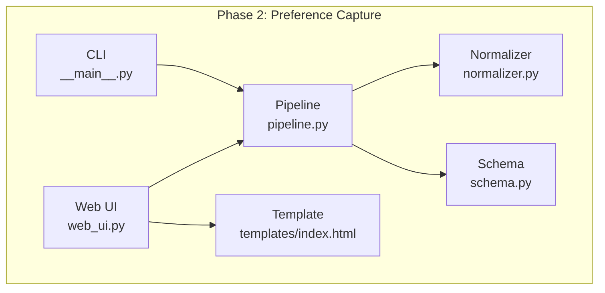
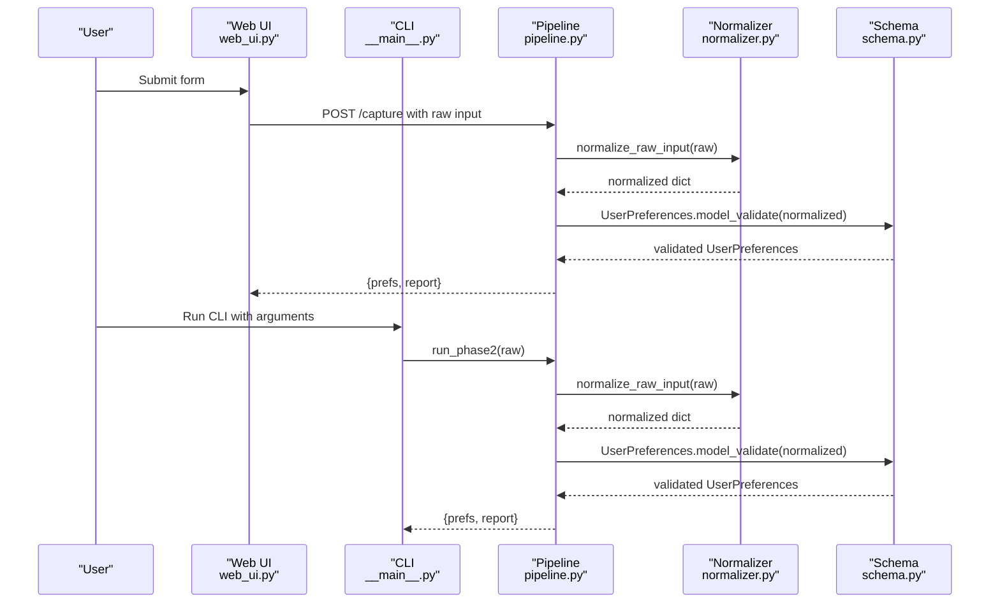
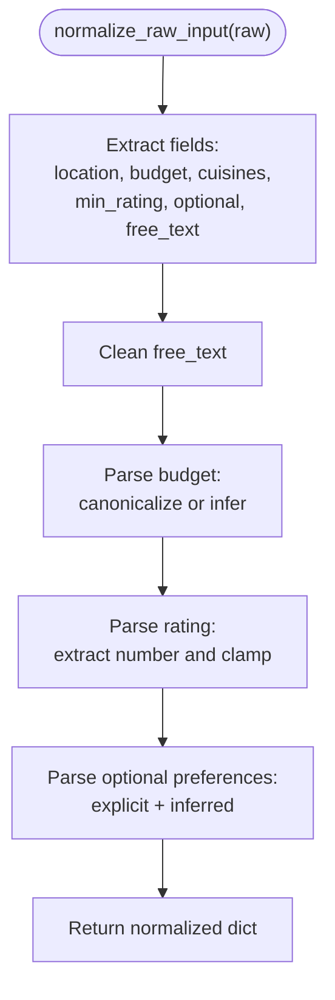
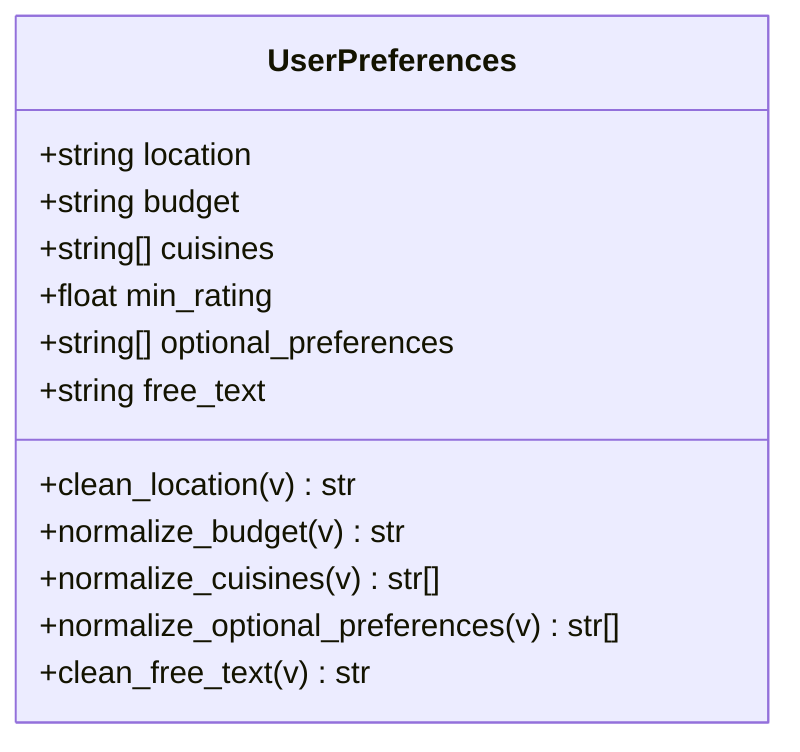
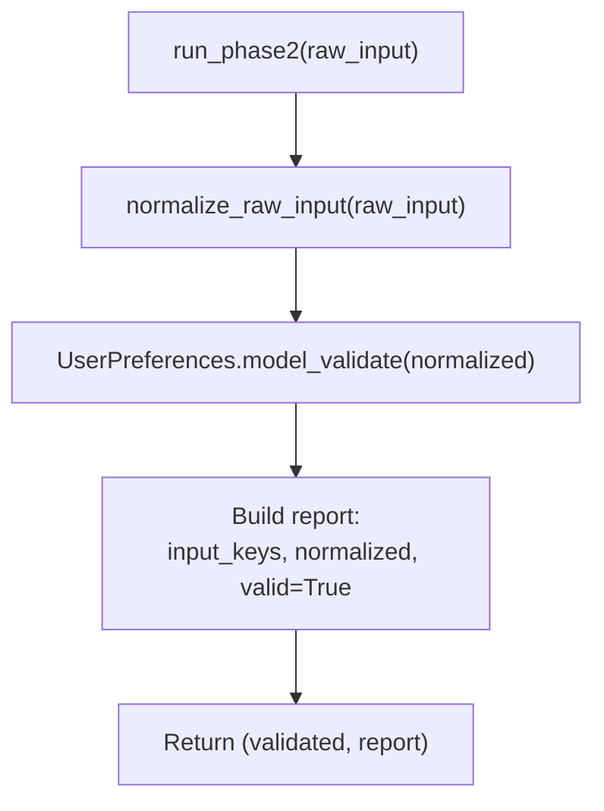
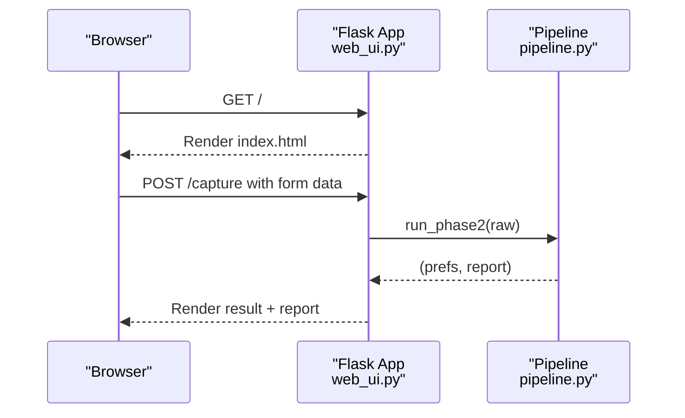
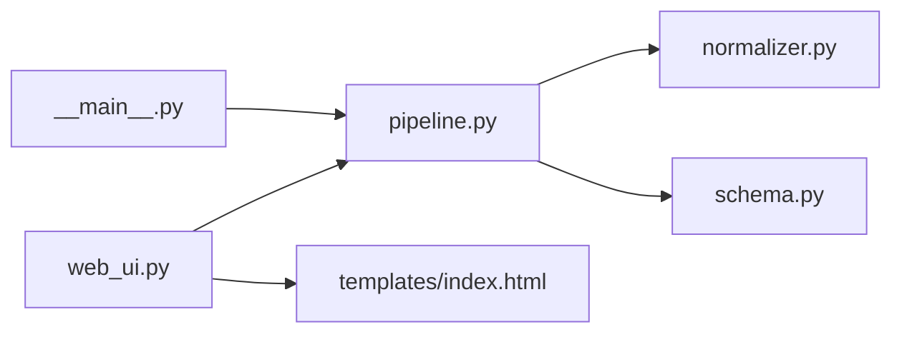

# Phase 2: Preference Capture

<cite>
**Referenced Files in This Document**
- [__init__.py](file://Zomato/architecture/phase_2_preference_capture/__init__.py)
- [normalizer.py](file://Zomato/architecture/phase_2_preference_capture/normalizer.py)
- [schema.py](file://Zomato/architecture/phase_2_preference_capture/schema.py)
- [pipeline.py](file://Zomato/architecture/phase_2_preference_capture/pipeline.py)
- [web_ui.py](file://Zomato/architecture/phase_2_preference_capture/web_ui.py)
- [__main__.py](file://Zomato/architecture/phase_2_preference_capture/__main__.py)
- [index.html](file://Zomato/architecture/phase_2_preference_capture/templates/index.html)
- [requirements.txt](file://Zomato/architecture/phase_2_preference_capture/requirements.txt)
- [phase-wise-architecture.md](file://Zomato/architecture/phase-wise-architecture.md)
- [sample_preferences.json](file://Zomato/architecture/phase_4_llm_recommendation/sample_preferences.json)
</cite>

## Table of Contents
1. [Introduction](#introduction)
2. [Project Structure](#project-structure)
3. [Core Components](#core-components)
4. [Architecture Overview](#architecture-overview)
5. [Detailed Component Analysis](#detailed-component-analysis)
6. [Dependency Analysis](#dependency-analysis)
7. [Performance Considerations](#performance-considerations)
8. [Troubleshooting Guide](#troubleshooting-guide)
9. [Conclusion](#conclusion)
10. [Appendices](#appendices)

## Introduction
Phase 2 captures user intent from a web form or CLI, normalizes and validates it into a structured preference object, and prepares it for downstream candidate retrieval. It focuses on:
- Collecting user inputs: location, budget, cuisines, minimum rating, optional preferences, and free-text comments
- Normalizing inputs to canonical forms
- Validating data integrity against strict rules
- Producing a validated UserPreferences object consumed by later phases

This document explains how the normalizer converts noisy inputs into standardized formats, how the schema enforces data integrity, and how the pipeline coordinates the end-to-end process. It also documents configuration options, common input issues, and how normalized preferences feed into candidate retrieval.

## Project Structure
The Phase 2 module is organized around a small set of focused files:
- Web UI and CLI entry points
- Normalization logic for user inputs
- Validation schema for structured preferences
- Pipeline orchestration
- Templates and requirements

**Diagram sources**
- [web_ui.py:14-43](file://Zomato/architecture/phase_2_preference_capture/web_ui.py#L14-L43)
- [__main__.py:11-42](file://Zomato/architecture/phase_2_preference_capture/__main__.py#L11-L42)
- [pipeline.py:11-21](file://Zomato/architecture/phase_2_preference_capture/pipeline.py#L11-L21)
- [normalizer.py:76-91](file://Zomato/architecture/phase_2_preference_capture/normalizer.py#L76-L91)
- [schema.py:8-72](file://Zomato/architecture/phase_2_preference_capture/schema.py#L8-L72)
- [index.html:22-46](file://Zomato/architecture/phase_2_preference_capture/templates/index.html#L22-L46)

**Section sources**
- [phase-wise-architecture.md:17-28](file://Zomato/architecture/phase-wise-architecture.md#L17-L28)
- [requirements.txt:1-3](file://Zomato/architecture/phase_2_preference_capture/requirements.txt#L1-L3)

## Core Components
- Normalizer: Converts raw inputs into canonical fields, including budget mapping, rating extraction, and optional preference inference from free text.
- Schema: Defines the validated UserPreferences model with field validators for location, budget, cuisines, optional preferences, and free text.
- Pipeline: Orchestrates normalization followed by validation and returns a report of the transformation steps.
- Web UI and CLI: Provide user entry points to submit preferences and receive structured output.

Key responsibilities:
- Normalize noisy inputs (typos, synonyms, mixed-case) into canonical forms
- Validate ranges and types to ensure downstream reliability
- Produce a stable, typed preference object for candidate retrieval

**Section sources**
- [normalizer.py:76-91](file://Zomato/architecture/phase_2_preference_capture/normalizer.py#L76-L91)
- [schema.py:8-72](file://Zomato/architecture/phase_2_preference_capture/schema.py#L8-L72)
- [pipeline.py:11-21](file://Zomato/architecture/phase_2_preference_capture/pipeline.py#L11-L21)
- [web_ui.py:19-43](file://Zomato/architecture/phase_2_preference_capture/web_ui.py#L19-L43)
- [__main__.py:28-42](file://Zomato/architecture/phase_2_preference_capture/__main__.py#L28-L42)

## Architecture Overview
The Phase 2 pipeline follows a simple, deterministic flow:
1. Collect raw input from web form or CLI
2. Normalize inputs into canonical fields
3. Validate against the UserPreferences schema
4. Return validated preferences and a normalization report

**Diagram sources**
- [web_ui.py:19-43](file://Zomato/architecture/phase_2_preference_capture/web_ui.py#L19-L43)
- [__main__.py:28-42](file://Zomato/architecture/phase_2_preference_capture/__main__.py#L28-L42)
- [pipeline.py:11-21](file://Zomato/architecture/phase_2_preference_capture/pipeline.py#L11-L21)
- [normalizer.py:76-91](file://Zomato/architecture/phase_2_preference_capture/normalizer.py#L76-L91)
- [schema.py:8-72](file://Zomato/architecture/phase_2_preference_capture/schema.py#L8-L72)

## Detailed Component Analysis

### Normalizer: Converting Noisy Inputs to Canonical Forms
The normalizer transforms raw user input into a stable, validated dictionary with the following responsibilities:
- Budget normalization: Maps synonyms to canonical values (low, medium, high) and falls back to a default when ambiguous
- Rating parsing: Extracts numeric values from strings and clamps them to a 0–5 range
- Optional preferences: Parses explicit comma-separated items and infers additional preferences from free text using regex patterns
- Location and free text cleaning: Strips whitespace and applies title casing for location

**Diagram sources**
- [normalizer.py:76-91](file://Zomato/architecture/phase_2_preference_capture/normalizer.py#L76-L91)
- [normalizer.py:29-41](file://Zomato/architecture/phase_2_preference_capture/normalizer.py#L29-L41)
- [normalizer.py:44-56](file://Zomato/architecture/phase_2_preference_capture/normalizer.py#L44-L56)
- [normalizer.py:59-73](file://Zomato/architecture/phase_2_preference_capture/normalizer.py#L59-L73)

Key normalization rules:
- Budget mapping: Synonyms are mapped to canonical values; if neither explicit nor inferred, defaults to medium
- Rating extraction: Numeric values are extracted and clamped to 0–5; empty or unparseable inputs become 0
- Optional preferences: Explicit items are deduplicated and lowercased; inferred items are detected via regex patterns and appended uniquely
- Location and free text: Title-cased location and stripped free text

Common input issues and handling:
- Typos in budget: Mapped via synonym dictionary
- Mixed-case cuisines: Title-cased and deduplicated
- Ambiguous optional preferences: Detected via regex patterns in combined explicit and free-text inputs
- Invalid rating formats: Converted to 0 when unparseable

**Section sources**
- [normalizer.py:8-19](file://Zomato/architecture/phase_2_preference_capture/normalizer.py#L8-L19)
- [normalizer.py:21-26](file://Zomato/architecture/phase_2_preference_capture/normalizer.py#L21-L26)
- [normalizer.py:29-41](file://Zomato/architecture/phase_2_preference_capture/normalizer.py#L29-L41)
- [normalizer.py:44-56](file://Zomato/architecture/phase_2_preference_capture/normalizer.py#L44-L56)
- [normalizer.py:59-73](file://Zomato/architecture/phase_2_preference_capture/normalizer.py#L59-L73)
- [normalizer.py:76-91](file://Zomato/architecture/phase_2_preference_capture/normalizer.py#L76-L91)

### Schema: Validated Preference Model
The schema defines the canonical UserPreferences model with strict validation rules:
- location: Non-empty string; cleaned to title case
- budget: Must be one of low, medium, high; otherwise raises a validation error
- cuisines: List of strings; deduplicated and title-cased
- min_rating: Float in range 0.0 to 5.0; defaults to 0.0
- optional_preferences: List of strings; deduplicated and lowercased
- free_text: String; stripped

**Diagram sources**
- [schema.py:8-72](file://Zomato/architecture/phase_2_preference_capture/schema.py#L8-L72)

Validation parameters:
- location: min_length=1 enforced by Pydantic
- budget: constrained to canonical values via validator
- cuisines: deduplication and title-casing via validator
- min_rating: ge=0.0, le=5.0 enforced by Pydantic
- optional_preferences: deduplication and lowercasing via validator
- free_text: stripped via validator

**Section sources**
- [schema.py:11-16](file://Zomato/architecture/phase_2_preference_capture/schema.py#L11-L16)
- [schema.py:18-21](file://Zomato/architecture/phase_2_preference_capture/schema.py#L18-L21)
- [schema.py:23-29](file://Zomato/architecture/phase_2_preference_capture/schema.py#L23-L29)
- [schema.py:31-48](file://Zomato/architecture/phase_2_preference_capture/schema.py#L31-L48)
- [schema.py:50-66](file://Zomato/architecture/phase_2_preference_capture/schema.py#L50-L66)
- [schema.py:68-71](file://Zomato/architecture/phase_2_preference_capture/schema.py#L68-L71)

### Pipeline: Coordination of Preference Processing
The pipeline ties normalization and validation together:
- Accepts a raw input dictionary
- Normalizes inputs via the normalizer
- Validates the normalized dictionary using the schema
- Returns a tuple of validated preferences and a report containing input keys, normalized values, and validity flag

**Diagram sources**
- [pipeline.py:11-21](file://Zomato/architecture/phase_2_preference_capture/pipeline.py#L11-L21)
- [normalizer.py:76-91](file://Zomato/architecture/phase_2_preference_capture/normalizer.py#L76-L91)
- [schema.py:8-72](file://Zomato/architecture/phase_2_preference_capture/schema.py#L8-L72)

**Section sources**
- [pipeline.py:11-21](file://Zomato/architecture/phase_2_preference_capture/pipeline.py#L11-L21)

### Web UI and CLI: Input Collection and Output Presentation
- Web UI: Provides a form with fields for location, budget, cuisines, minimum rating, optional preferences, and free text. On submission, it posts to the pipeline and displays the validated preferences and normalization report.
- CLI: Supports both a basic web UI mode and a command-line mode that prints the validated preferences and report.

**Diagram sources**
- [web_ui.py:14-43](file://Zomato/architecture/phase_2_preference_capture/web_ui.py#L14-L43)
- [index.html:22-46](file://Zomato/architecture/phase_2_preference_capture/templates/index.html#L22-L46)
- [__main__.py:22-42](file://Zomato/architecture/phase_2_preference_capture/__main__.py#L22-L42)

**Section sources**
- [web_ui.py:19-43](file://Zomato/architecture/phase_2_preference_capture/web_ui.py#L19-L43)
- [index.html:22-46](file://Zomato/architecture/phase_2_preference_capture/templates/index.html#L22-L46)
- [__main__.py:11-42](file://Zomato/architecture/phase_2_preference_capture/__main__.py#L11-L42)

### Relationship to Candidate Retrieval
Normalized preferences flow into Phase 3 (candidate retrieval) as the primary filtering criteria:
- Hard filters: location, budget, min_rating
- Soft matching: cuisines and optional_preferences
- The structured nature of UserPreferences ensures downstream systems can rely on consistent field names and types

Example of a validated preference object:
- location: "Bangalore"
- budget: "medium"
- cuisines: ["Italian", "Chinese"]
- min_rating: 4.0
- optional_preferences: ["quick-service"]

These fields align with the candidate retrieval phase’s filtering and matching logic.

**Section sources**
- [phase-wise-architecture.md:30-41](file://Zomato/architecture/phase-wise-architecture.md#L30-L41)
- [sample_preferences.json:1-8](file://Zomato/architecture/phase_4_llm_recommendation/sample_preferences.json#L1-L8)

## Dependency Analysis
The Phase 2 module has minimal external dependencies and clear internal coupling:
- Web UI depends on the pipeline
- CLI optionally starts the web UI or calls the pipeline directly
- Pipeline depends on the normalizer and schema
- Template renders results and reports

**Diagram sources**
- [web_ui.py:9](file://Zomato/architecture/phase_2_preference_capture/web_ui.py#L9)
- [__main__.py:8](file://Zomato/architecture/phase_2_preference_capture/__main__.py#L8)
- [pipeline.py:7-8](file://Zomato/architecture/phase_2_preference_capture/pipeline.py#L7-L8)
- [normalizer.py:3](file://Zomato/architecture/phase_2_preference_capture/normalizer.py#L3)
- [schema.py:5](file://Zomato/architecture/phase_2_preference_capture/schema.py#L5)
- [index.html:1](file://Zomato/architecture/phase_2_preference_capture/templates/index.html#L1)

**Section sources**
- [requirements.txt:1-3](file://Zomato/architecture/phase_2_preference_capture/requirements.txt#L1-L3)

## Performance Considerations
- Normalization cost: Linear in input length; regex patterns and dictionary lookups are efficient for typical user inputs
- Validation cost: O(n) over the number of fields; Pydantic validators are fast and memory-efficient
- Pipeline overhead: Minimal; primarily function calls and dictionary construction
- Recommendations:
  - Keep regex patterns concise and anchored to reduce false positives
  - Avoid excessive free-text processing by limiting optional preference inference scope
  - Cache repeated normalization results if the same inputs occur frequently

## Troubleshooting Guide
Common issues and resolutions:
- Invalid budget values:
  - Symptom: Validation error indicating budget must be one of low, medium, high
  - Resolution: Ensure budget is either a canonical value or a recognized synonym; fallback behavior defaults to medium during normalization
- Unparseable rating:
  - Symptom: Rating becomes 0 when input is empty or contains no numeric value
  - Resolution: Provide a numeric rating or leave blank to default to 0
- Empty or malformed cuisines:
  - Symptom: Cuisines list appears empty or duplicates remain
  - Resolution: Separate entries with commas; duplicates are automatically removed and items are title-cased
- Optional preferences not detected:
  - Symptom: Free-text hints are ignored
  - Resolution: Include explicit comma-separated items or use recognized keywords (e.g., family-friendly, quick-service, outdoor-seating, vegetarian-options) in free text
- Web UI errors:
  - Symptom: Error page with stack trace
  - Resolution: Check server logs; ensure required fields are present and formatted correctly

Operational tips:
- Use the CLI to quickly test normalization and validation without the web server
- Inspect the normalization report to understand how inputs were transformed
- Validate inputs early to prevent downstream failures in candidate retrieval

**Section sources**
- [schema.py:23-29](file://Zomato/architecture/phase_2_preference_capture/schema.py#L23-L29)
- [normalizer.py:29-41](file://Zomato/architecture/phase_2_preference_capture/normalizer.py#L29-L41)
- [normalizer.py:44-56](file://Zomato/architecture/phase_2_preference_capture/normalizer.py#L44-L56)
- [normalizer.py:59-73](file://Zomato/architecture/phase_2_preference_capture/normalizer.py#L59-L73)
- [web_ui.py:37-43](file://Zomato/architecture/phase_2_preference_capture/web_ui.py#L37-L43)

## Conclusion
Phase 2 establishes a robust foundation for user preference capture by:
- Normalizing noisy inputs into canonical forms
- Enforcing strict validation rules
- Producing a stable, typed preference object

Its design ensures downstream systems receive consistent, reliable data, enabling effective candidate retrieval and recommendation generation. The module is easy to extend for new preference types by adding new normalization rules and schema validators.

## Appendices

### Configuration Options and Extensibility
- Supported preference types:
  - location: string; title-cased and validated for non-emptyness
  - budget: string; canonical values: low, medium, high
  - cuisines: list of strings; deduplicated and title-cased
  - min_rating: float; range 0.0 to 5.0
  - optional_preferences: list of strings; deduplicated and lowercased
  - free_text: string; stripped
- Extending optional preferences:
  - Add new regex patterns to the optional preferences mapping to detect additional hints in free text
- Extending cuisines:
  - Add new normalization rules to handle regional or brand variations
- Extending budget:
  - Add new synonyms to the budget mapping dictionary

**Section sources**
- [schema.py:11-16](file://Zomato/architecture/phase_2_preference_capture/schema.py#L11-L16)
- [schema.py:31-48](file://Zomato/architecture/phase_2_preference_capture/schema.py#L31-L48)
- [schema.py:50-66](file://Zomato/architecture/phase_2_preference_capture/schema.py#L50-L66)
- [normalizer.py:8-19](file://Zomato/architecture/phase_2_preference_capture/normalizer.py#L8-L19)
- [normalizer.py:21-26](file://Zomato/architecture/phase_2_preference_capture/normalizer.py#L21-L26)
- [normalizer.py:59-73](file://Zomato/architecture/phase_2_preference_capture/normalizer.py#L59-L73)