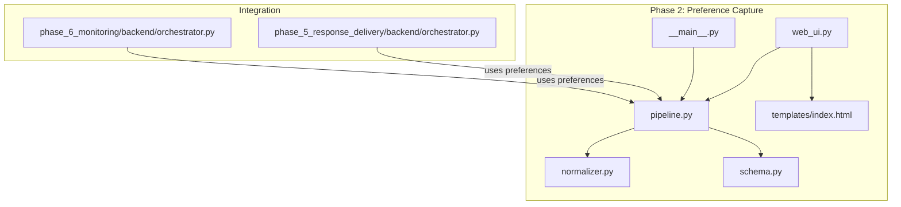
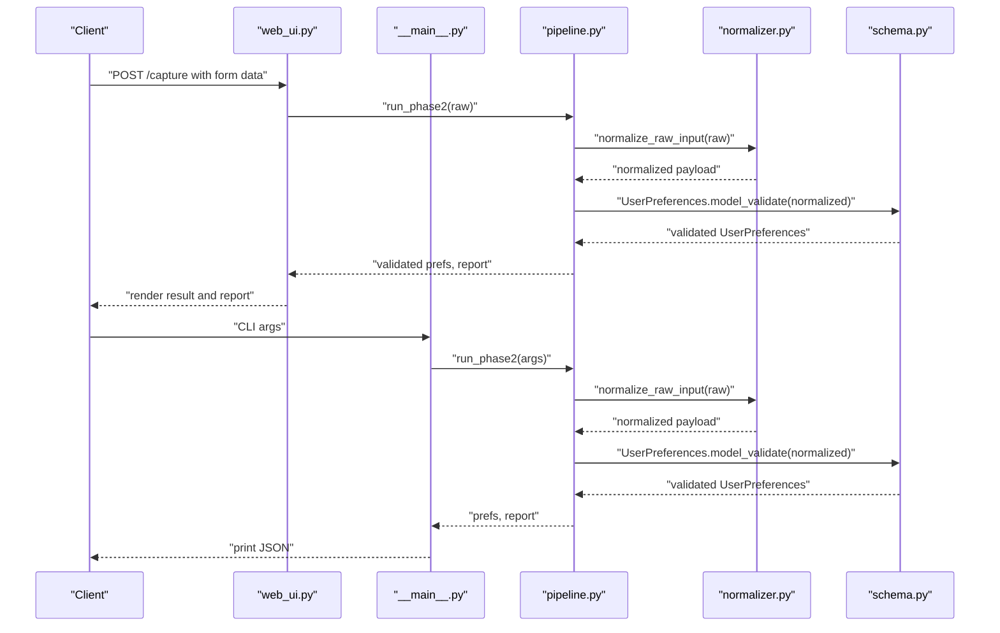
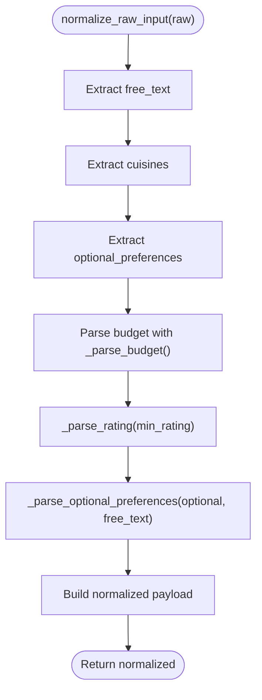
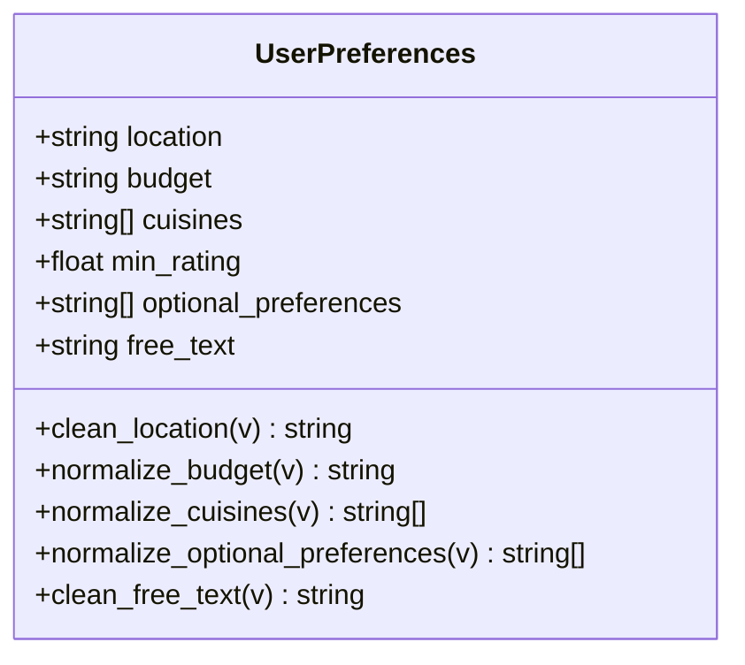
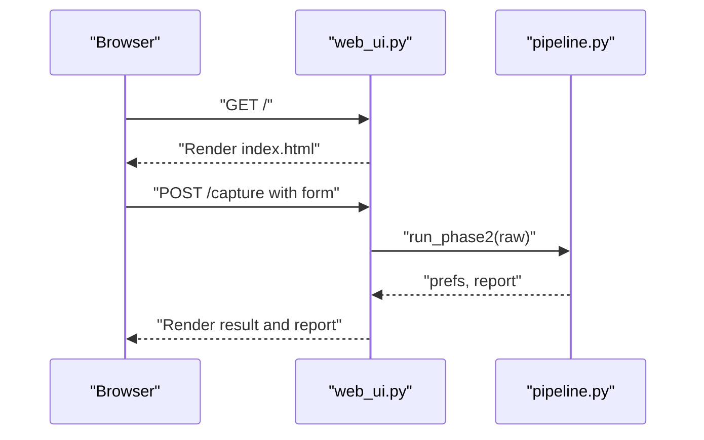
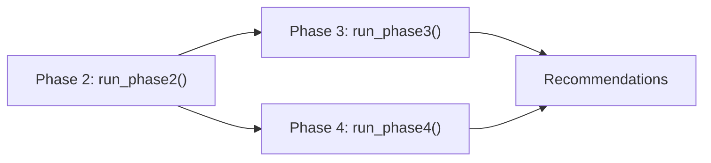
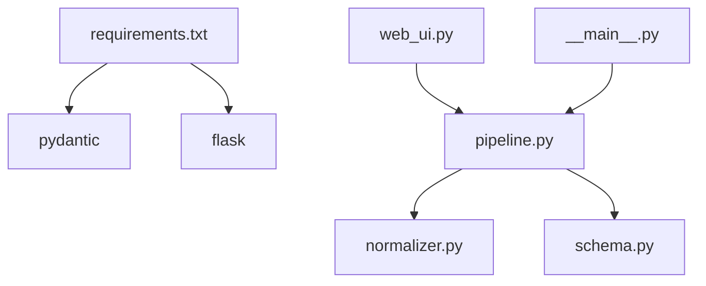

# Pipeline Coordination

<cite>
**Referenced Files in This Document**
- [pipeline.py](file://Zomato/architecture/phase_2_preference_capture/pipeline.py)
- [normalizer.py](file://Zomato/architecture/phase_2_preference_capture/normalizer.py)
- [schema.py](file://Zomato/architecture/phase_2_preference_capture/schema.py)
- [web_ui.py](file://Zomato/architecture/phase_2_preference_capture/web_ui.py)
- [__main__.py](file://Zomato/architecture/phase_2_preference_capture/__main__.py)
- [index.html](file://Zomato/architecture/phase_2_preference_capture/templates/index.html)
- [requirements.txt](file://Zomato/architecture/phase_2_preference_capture/requirements.txt)
- [phase_5_orchestrator.py](file://Zomato/architecture/phase_5_response_delivery/backend/orchestrator.py)
- [phase_6_orchestrator.py](file://Zomato/architecture/phase_6_monitoring/backend/orchestrator.py)
</cite>

## Table of Contents
1. [Introduction](#introduction)
2. [Project Structure](#project-structure)
3. [Core Components](#core-components)
4. [Architecture Overview](#architecture-overview)
5. [Detailed Component Analysis](#detailed-component-analysis)
6. [Dependency Analysis](#dependency-analysis)
7. [Performance Considerations](#performance-considerations)
8. [Troubleshooting Guide](#troubleshooting-guide)
9. [Conclusion](#conclusion)
10. [Appendices](#appendices)

## Introduction
This document explains the preference capture pipeline coordination for Phase 2 of the Zomato recommendation system. It focuses on how raw user inputs are collected, normalized, validated, and transformed into a structured preference object. The documentation covers the orchestration implemented in pipeline.py, the normalization logic in normalizer.py, the schema enforcement in schema.py, and the integration points with the broader system via the response delivery and monitoring orchestrators. It also details error handling, fallback mechanisms, monitoring/logging patterns, and guidance for extending the pipeline.

## Project Structure
Phase 2 preference capture is organized as a standalone package with a small set of focused modules:
- pipeline.py: Orchestrates normalization and validation into a structured preference object and produces a normalization report.
- normalizer.py: Implements normalization functions to convert noisy inputs into canonical fields.
- schema.py: Defines the validated UserPreferences model with Pydantic validators.
- web_ui.py: Provides a minimal Flask web UI to capture inputs and render results.
- __main__.py: CLI entry point for batch-style execution.
- templates/index.html: Basic HTML form and rendering for the web UI.
- requirements.txt: Declares runtime dependencies.

**Diagram sources**
- [pipeline.py:1-21](file://Zomato/architecture/phase_2_preference_capture/pipeline.py#L1-L21)
- [normalizer.py:1-91](file://Zomato/architecture/phase_2_preference_capture/normalizer.py#L1-L91)
- [schema.py:1-72](file://Zomato/architecture/phase_2_preference_capture/schema.py#L1-L72)
- [web_ui.py:1-52](file://Zomato/architecture/phase_2_preference_capture/web_ui.py#L1-L52)
- [__main__.py:1-46](file://Zomato/architecture/phase_2_preference_capture/__main__.py#L1-L46)
- [index.html:1-64](file://Zomato/architecture/phase_2_preference_capture/templates/index.html#L1-L64)
- [phase_5_orchestrator.py:112-292](file://Zomato/architecture/phase_5_response_delivery/backend/orchestrator.py#L112-L292)
- [phase_6_orchestrator.py:112-303](file://Zomato/architecture/phase_6_monitoring/backend/orchestrator.py#L112-L303)

**Section sources**
- [pipeline.py:1-21](file://Zomato/architecture/phase_2_preference_capture/pipeline.py#L1-L21)
- [normalizer.py:1-91](file://Zomato/architecture/phase_2_preference_capture/normalizer.py#L1-L91)
- [schema.py:1-72](file://Zomato/architecture/phase_2_preference_capture/schema.py#L1-L72)
- [web_ui.py:1-52](file://Zomato/architecture/phase_2_preference_capture/web_ui.py#L1-L52)
- [__main__.py:1-46](file://Zomato/architecture/phase_2_preference_capture/__main__.py#L1-L46)
- [index.html:1-64](file://Zomato/architecture/phase_2_preference_capture/templates/index.html#L1-L64)
- [requirements.txt:1-3](file://Zomato/architecture/phase_2_preference_capture/requirements.txt#L1-L3)

## Core Components
- Pipeline orchestrator (run_phase2): Executes normalization followed by schema validation and returns a validated preference object along with a normalization report.
- Normalizer: Converts raw inputs into canonical fields, including budget normalization, rating parsing, and inference of optional preferences from free text.
- Schema (UserPreferences): Enforces data types, constraints, and normalization rules for each field using Pydantic validators.
- Web UI and CLI: Provide entry points to feed raw inputs into the pipeline and render results or reports.
- Integration orchestrators: Consume validated preferences from Phase 2 to continue downstream processing in Phases 3–4.

Key responsibilities:
- Input collection: From web forms or CLI arguments.
- Normalization: Canonicalization of budget, cuisines, ratings, and optional preferences.
- Validation: Structured validation against the UserPreferences schema.
- Reporting: A compact report summarizing normalization outcomes.
- Integration: Passing validated preferences downstream.

**Section sources**
- [pipeline.py:11-20](file://Zomato/architecture/phase_2_preference_capture/pipeline.py#L11-L20)
- [normalizer.py:76-91](file://Zomato/architecture/phase_2_preference_capture/normalizer.py#L76-L91)
- [schema.py:8-72](file://Zomato/architecture/phase_2_preference_capture/schema.py#L8-L72)
- [web_ui.py:19-43](file://Zomato/architecture/phase_2_preference_capture/web_ui.py#L19-L43)
- [__main__.py:28-41](file://Zomato/architecture/phase_2_preference_capture/__main__.py#L28-L41)

## Architecture Overview
The Phase 2 pipeline is a thin orchestration layer that:
1. Accepts raw input from either the web UI or CLI.
2. Normalizes the input into canonical fields.
3. Validates the normalized payload against the UserPreferences schema.
4. Returns the validated object and a normalization report.
5. Integrates with downstream orchestrators that consume the validated preferences.

**Diagram sources**
- [web_ui.py:19-43](file://Zomato/architecture/phase_2_preference_capture/web_ui.py#L19-L43)
- [__main__.py:28-41](file://Zomato/architecture/phase_2_preference_capture/__main__.py#L28-L41)
- [pipeline.py:11-20](file://Zomato/architecture/phase_2_preference_capture/pipeline.py#L11-L20)
- [normalizer.py:76-91](file://Zomato/architecture/phase_2_preference_capture/normalizer.py#L76-L91)
- [schema.py:8-16](file://Zomato/architecture/phase_2_preference_capture/schema.py#L8-L16)

## Detailed Component Analysis

### Pipeline Orchestration (run_phase2)
Responsibilities:
- Normalize raw input.
- Validate normalized payload against UserPreferences.
- Produce a normalization report containing input keys, normalized payload, and validity flag.

Processing logic:
- Calls normalize_raw_input to produce a canonical payload.
- Uses UserPreferences.model_validate to enforce schema and validators.
- Builds a report dictionary capturing normalization insights.

Error handling:
- Delegates validation errors to Pydantic during model_validate.
- The web UI catches exceptions and renders a formatted error page.

Graceful degradation:
- The pipeline itself does not degrade; it raises validation errors. Downstream orchestrators implement fallbacks when external systems fail.

Performance characteristics:
- Minimal overhead; dominated by normalization and validation costs.

**Section sources**
- [pipeline.py:11-20](file://Zomato/architecture/phase_2_preference_capture/pipeline.py#L11-L20)
- [web_ui.py:37-43](file://Zomato/architecture/phase_2_preference_capture/web_ui.py#L37-L43)

### Normalization Functions
Normalization responsibilities:
- Budget normalization: Maps synonyms to canonical values and falls back to “medium” when ambiguous.
- Rating parsing: Extracts numeric values from strings and clamps to [0.0, 5.0].
- Optional preferences: Parses comma-separated explicit values and infers additional preferences from free text using keyword patterns.
- Free text and cuisines: Cleaned and prepared for downstream validation.

Normalization report:
- The pipeline’s report includes the original input keys and the normalized payload.

**Diagram sources**
- [normalizer.py:76-91](file://Zomato/architecture/phase_2_preference_capture/normalizer.py#L76-L91)
- [normalizer.py:29-41](file://Zomato/architecture/phase_2_preference_capture/normalizer.py#L29-L41)
- [normalizer.py:44-56](file://Zomato/architecture/phase_2_preference_capture/normalizer.py#L44-L56)
- [normalizer.py:59-73](file://Zomato/architecture/phase_2_preference_capture/normalizer.py#L59-L73)

**Section sources**
- [normalizer.py:76-91](file://Zomato/architecture/phase_2_preference_capture/normalizer.py#L76-L91)
- [pipeline.py:15-19](file://Zomato/architecture/phase_2_preference_capture/pipeline.py#L15-L19)

### Schema Validation (UserPreferences)
Validation responsibilities:
- Enforce non-empty location after title-case cleaning.
- Enforce budget to be one of three canonical values.
- Normalize cuisines and optional preferences lists (dedupe and casing).
- Clamp min_rating to [0.0, 5.0].
- Clean free_text.

Validators:
- Location: Title-case normalization.
- Budget: Rejects invalid values.
- Cuisines: Deduplicates and title-cases entries.
- Optional preferences: Lowercases and deduplicates entries.
- Free text: Strips whitespace.

**Diagram sources**
- [schema.py:8-72](file://Zomato/architecture/phase_2_preference_capture/schema.py#L8-L72)

**Section sources**
- [schema.py:8-72](file://Zomato/architecture/phase_2_preference_capture/schema.py#L8-L72)

### Web UI and CLI Integration
Web UI:
- Renders a form with fields for location, budget, cuisines, minimum rating, optional preferences, and free text.
- On submit, posts to /capture, invokes run_phase2, and displays results and report or error.

CLI:
- Supports --web to launch the web UI or direct execution with arguments.
- Prints validated preferences and normalization report as JSON.

**Diagram sources**
- [web_ui.py:14-43](file://Zomato/architecture/phase_2_preference_capture/web_ui.py#L14-L43)
- [index.html:22-46](file://Zomato/architecture/phase_2_preference_capture/templates/index.html#L22-L46)
- [__main__.py:22-41](file://Zomato/architecture/phase_2_preference_capture/__main__.py#L22-L41)

**Section sources**
- [web_ui.py:14-43](file://Zomato/architecture/phase_2_preference_capture/web_ui.py#L14-L43)
- [__main__.py:11-41](file://Zomato/architecture/phase_2_preference_capture/__main__.py#L11-L41)
- [index.html:1-64](file://Zomato/architecture/phase_2_preference_capture/templates/index.html#L1-L64)

### Integration with Downstream Orchestrators
Both Phase 5 and Phase 6 orchestrators consume validated preferences from Phase 2:
- They import and execute Phase 3 and Phase 4 pipelines respectively.
- They handle failures gracefully by returning sample recommendations or reduced-functionality outputs when upstream systems are unavailable.

**Diagram sources**
- [phase_5_orchestrator.py:112-292](file://Zomato/architecture/phase_5_response_delivery/backend/orchestrator.py#L112-L292)
- [phase_6_orchestrator.py:112-303](file://Zomato/architecture/phase_6_monitoring/backend/orchestrator.py#L112-L303)

**Section sources**
- [phase_5_orchestrator.py:112-292](file://Zomato/architecture/phase_5_response_delivery/backend/orchestrator.py#L112-L292)
- [phase_6_orchestrator.py:112-303](file://Zomato/architecture/phase_6_monitoring/backend/orchestrator.py#L112-L303)

## Dependency Analysis
External dependencies:
- Pydantic: Used for schema definition and validation.
- Flask: Used by the web UI for routing and templating.

Internal dependencies:
- pipeline.py depends on normalizer.py and schema.py.
- web_ui.py depends on pipeline.py.
- __main__.py depends on pipeline.py.

**Diagram sources**
- [requirements.txt:1-3](file://Zomato/architecture/phase_2_preference_capture/requirements.txt#L1-L3)
- [pipeline.py:7-8](file://Zomato/architecture/phase_2_preference_capture/pipeline.py#L7-L8)
- [web_ui.py](file://Zomato/architecture/phase_2_preference_capture/web_ui.py#L9)
- [__main__.py](file://Zomato/architecture/phase_2_preference_capture/__main__.py#L8)

**Section sources**
- [requirements.txt:1-3](file://Zomato/architecture/phase_2_preference_capture/requirements.txt#L1-L3)
- [pipeline.py:7-8](file://Zomato/architecture/phase_2_preference_capture/pipeline.py#L7-L8)
- [web_ui.py](file://Zomato/architecture/phase_2_preference_capture/web_ui.py#L9)
- [__main__.py](file://Zomato/architecture/phase_2_preference_capture/__main__.py#L8)

## Performance Considerations
- Normalization cost: Budget parsing, rating extraction, and optional preference inference are linear in input size. Regex scanning and keyword matching are efficient for typical inputs.
- Validation cost: Pydantic validation is fast and leverages compiled constraints; list deduplication uses sets for O(n) average performance.
- Memory footprint: Normalized payloads are small; lists are de-duplicated in-place.
- Batch processing: The current pipeline processes single-user inputs. To support batch processing:
  - Introduce a batch wrapper around run_phase2 that iterates over input lists.
  - Parallelize normalization/validation per record using thread/process pools.
  - Aggregate reports and handle partial failures by collecting exceptions and continuing.
- Caching: For repeated normalization of similar inputs, consider memoizing normalization functions keyed by normalized strings.

[No sources needed since this section provides general guidance]

## Troubleshooting Guide
Common issues and remedies:
- Budget validation errors: Ensure budget is one of the canonical values. The validator rejects invalid inputs; adjust input mapping or provide canonical values.
- Empty location: The validator requires a non-empty location; ensure the form or CLI supplies a value.
- Invalid rating: Ratings outside [0.0, 5.0] are clamped; ensure numeric input or readable numeric strings.
- Optional preferences inference: If inferred preferences are missing, include explicit keywords in free text or provide comma-separated values.
- Web UI errors: The web UI captures exceptions and renders a formatted error page; inspect the error output for stack traces.
- Downstream failures: Phase 5 and Phase 6 orchestrators fall back to sample recommendations when external systems fail; monitor logs for failure messages.

Monitoring and logging patterns:
- The web UI prints stack traces on exceptions for debugging.
- The CLI prints the validated preferences and normalization report as JSON for inspection.
- The downstream orchestrators log debug messages and failure conditions; review console output for diagnostics.

**Section sources**
- [schema.py:23-29](file://Zomato/architecture/phase_2_preference_capture/schema.py#L23-L29)
- [normalizer.py:44-56](file://Zomato/architecture/phase_2_preference_capture/normalizer.py#L44-L56)
- [web_ui.py:37-43](file://Zomato/architecture/phase_2_preference_capture/web_ui.py#L37-L43)
- [__main__.py:38-41](file://Zomato/architecture/phase_2_preference_capture/__main__.py#L38-L41)
- [phase_5_orchestrator.py:166-190](file://Zomato/architecture/phase_5_response_delivery/backend/orchestrator.py#L166-L190)
- [phase_6_orchestrator.py:176-201](file://Zomato/architecture/phase_6_monitoring/backend/orchestrator.py#L176-L201)

## Conclusion
The Phase 2 preference capture pipeline provides a robust, extensible foundation for transforming raw user inputs into validated preferences. Its design emphasizes clear separation of concerns: normalization handles noisy inputs, schema validation enforces correctness, and the orchestrator ties it all together with reporting. Integration with downstream orchestrators ensures graceful degradation and fallback behavior. Extensibility is straightforward: add new fields to the schema, update normalization functions, and extend the web UI or CLI accordingly.

[No sources needed since this section summarizes without analyzing specific files]

## Appendices

### Example Execution Flows
- Web UI flow:
  - Submit form with location, budget, cuisines, rating, optional preferences, and free text.
  - Backend runs normalization and validation; returns validated preferences and a normalization report.
- CLI flow:
  - Invoke with arguments; pipeline returns validated preferences and report printed as JSON.

**Section sources**
- [web_ui.py:19-43](file://Zomato/architecture/phase_2_preference_capture/web_ui.py#L19-L43)
- [__main__.py:28-41](file://Zomato/architecture/phase_2_preference_capture/__main__.py#L28-L41)

### Extending the Pipeline
- Add a new preference field:
  - Extend UserPreferences with a new field and appropriate validators.
  - Update normalize_raw_input to extract and normalize the new field.
  - Update the web UI form and CLI arguments to accept the new input.
  - Update the normalization report to include the new field.
- Introduce custom normalization logic:
  - Add helper functions in normalizer.py and call them from normalize_raw_input.
- Add batch processing:
  - Wrap run_phase2 in a batch executor that validates and aggregates results.
  - Consider parallelization and partial failure handling.

**Section sources**
- [schema.py:8-72](file://Zomato/architecture/phase_2_preference_capture/schema.py#L8-L72)
- [normalizer.py:76-91](file://Zomato/architecture/phase_2_preference_capture/normalizer.py#L76-L91)
- [web_ui.py:21-28](file://Zomato/architecture/phase_2_preference_capture/web_ui.py#L21-L28)
- [__main__.py:12-20](file://Zomato/architecture/phase_2_preference_capture/__main__.py#L12-L20)