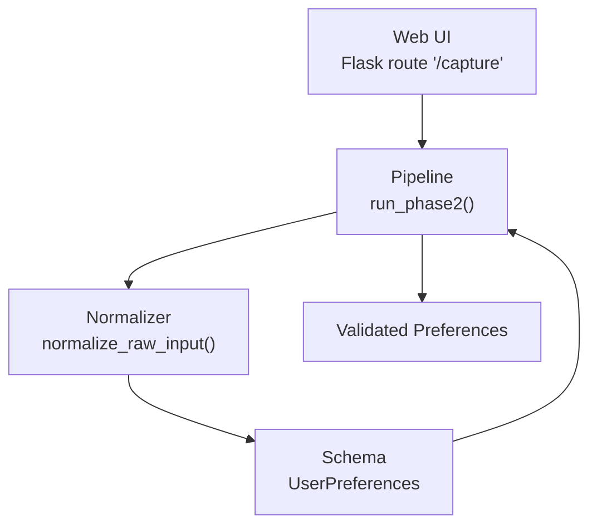
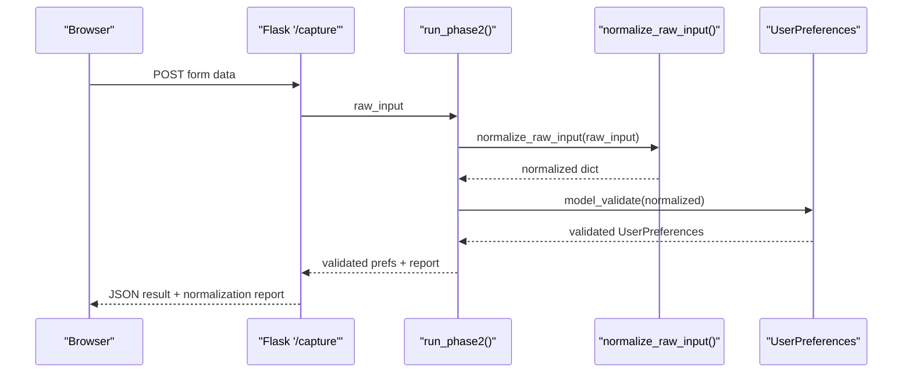
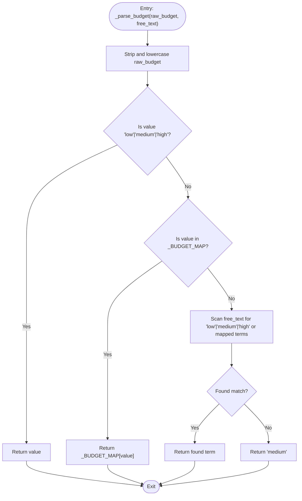
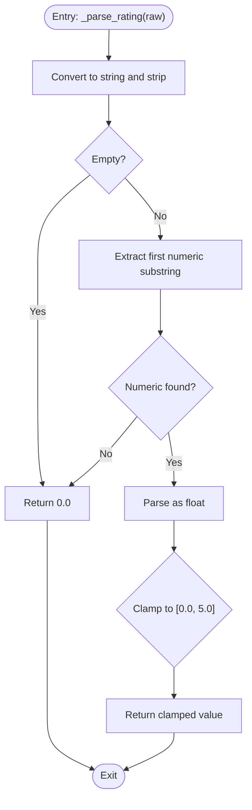
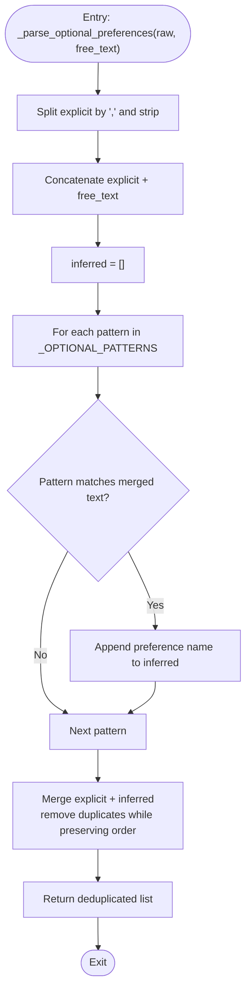
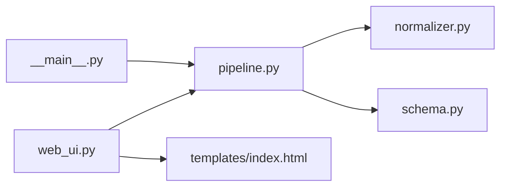

# Preference Normalization

<cite>
**Referenced Files in This Document**
- [normalizer.py](file://Zomato/architecture/phase_2_preference_capture/normalizer.py)
- [schema.py](file://Zomato/architecture/phase_2_preference_capture/schema.py)
- [pipeline.py](file://Zomato/architecture/phase_2_preference_capture/pipeline.py)
- [web_ui.py](file://Zomato/architecture/phase_2_preference_capture/web_ui.py)
- [index.html](file://Zomato/architecture/phase_2_preference_capture/templates/index.html)
- [__main__.py](file://Zomato/architecture/phase_2_preference_capture/__main__.py)
- [requirements.txt](file://Zomato/architecture/phase_2_preference_capture/requirements.txt)
- [detailed-edge-cases.md](file://Zomato/edge-cases/detailed-edge-cases.md)
</cite>

## Table of Contents
1. [Introduction](#introduction)
2. [Project Structure](#project-structure)
3. [Core Components](#core-components)
4. [Architecture Overview](#architecture-overview)
5. [Detailed Component Analysis](#detailed-component-analysis)
6. [Dependency Analysis](#dependency-analysis)
7. [Performance Considerations](#performance-considerations)
8. [Troubleshooting Guide](#troubleshooting-guide)
9. [Conclusion](#conclusion)
10. [Appendices](#appendices)

## Introduction
This document describes the preference normalization system used in Phase 2 of the Zomato-style recommendation pipeline. It focuses on transforming noisy user inputs into a canonical, validated preference object. The system handles:
- Budget normalization with synonym mapping and fallback logic
- Rating normalization with range validation and regex extraction
- Optional preference inference from free-text using regex patterns
- Merging explicit preferences with inferred preferences while preserving order and removing duplicates
- Edge-case handling for empty inputs, invalid ratings, and ambiguous budget terms

## Project Structure
The preference capture layer consists of:
- Normalizer module: core normalization functions and mappings
- Schema module: Pydantic model with validators for canonical fields
- Pipeline module: orchestration of normalization and validation
- Web UI: simple Flask interface for capturing user preferences
- CLI: command-line entry point for testing and automation
- Templates: HTML form for user input capture

**Diagram sources**
- [web_ui.py:19-43](file://Zomato/architecture/phase_2_preference_capture/web_ui.py#L19-L43)
- [pipeline.py:11-20](file://Zomato/architecture/phase_2_preference_capture/pipeline.py#L11-L20)
- [normalizer.py:76-90](file://Zomato/architecture/phase_2_preference_capture/normalizer.py#L76-L90)
- [schema.py:8-16](file://Zomato/architecture/phase_2_preference_capture/schema.py#L8-L16)

**Section sources**
- [web_ui.py:14-43](file://Zomato/architecture/phase_2_preference_capture/web_ui.py#L14-L43)
- [pipeline.py:11-20](file://Zomato/architecture/phase_2_preference_capture/pipeline.py#L11-L20)
- [__main__.py:11-42](file://Zomato/architecture/phase_2_preference_capture/__main__.py#L11-L42)

## Core Components
- normalize_raw_input: central function that converts raw inputs into canonical fields
- Budget parsing: _parse_budget with _BUDGET_MAP for synonyms and fallback resolution
- Rating parsing: _parse_rating with regex extraction and range clamping
- Optional preferences: _parse_optional_preferences with _OPTIONAL_PATTERNS and merge logic
- Validation: UserPreferences model with field validators and canonical defaults

Key behaviors:
- Budget normalization resolves synonyms to "low", "medium", or "high", falling back to "medium" if ambiguous
- Rating normalization extracts numeric values and clamps to [0.0, 5.0]
- Optional preferences combine explicit comma-separated values with inferred free-text matches
- Merge preserves explicit order, then appends inferred items, removing duplicates

**Section sources**
- [normalizer.py:76-90](file://Zomato/architecture/phase_2_preference_capture/normalizer.py#L76-L90)
- [normalizer.py:29-41](file://Zomato/architecture/phase_2_preference_capture/normalizer.py#L29-L41)
- [normalizer.py:44-56](file://Zomato/architecture/phase_2_preference_capture/normalizer.py#L44-L56)
- [normalizer.py:59-73](file://Zomato/architecture/phase_2_preference_capture/normalizer.py#L59-L73)
- [schema.py:8-16](file://Zomato/architecture/phase_2_preference_capture/schema.py#L8-L16)

## Architecture Overview
The normalization pipeline transforms raw user input into a validated preference object. The flow:
1. Web UI collects form data
2. Pipeline runs normalization and validation
3. Normalizer applies mappings and regex-based parsing
4. Schema validates and canonicalizes fields

**Diagram sources**
- [web_ui.py:19-43](file://Zomato/architecture/phase_2_preference_capture/web_ui.py#L19-L43)
- [pipeline.py:11-20](file://Zomato/architecture/phase_2_preference_capture/pipeline.py#L11-L20)
- [normalizer.py:76-90](file://Zomato/architecture/phase_2_preference_capture/normalizer.py#L76-L90)
- [schema.py:8-16](file://Zomato/architecture/phase_2_preference_capture/schema.py#L8-L16)

## Detailed Component Analysis

### normalize_raw_input
Purpose: Convert raw dictionary of user inputs into a canonical UserPreferences payload.

Processing steps:
- Extract and strip free_text, cuisines, optional_preferences, and budget
- Normalize location to title case
- Compute budget via _parse_budget
- Parse min_rating via _parse_rating
- Build optional_preferences via _parse_optional_preferences
- Return normalized dictionary

Behavior highlights:
- Explicit optional preferences are split by commas and stripped
- Free text is concatenated with explicit preferences for inference
- Canonical budget is enforced by schema validator

**Section sources**
- [normalizer.py:76-90](file://Zomato/architecture/phase_2_preference_capture/normalizer.py#L76-L90)

### Budget Normalization (_parse_budget)
Algorithm:
1. Strip and lowercase raw budget
2. If already "low", "medium", or "high", return it
3. Else if raw budget is in _BUDGET_MAP, return mapped value
4. Else scan free_text for any "low"/"medium"/"high" or mapped terms
5. If none found, default to "medium"

**Diagram sources**
- [normalizer.py:29-41](file://Zomato/architecture/phase_2_preference_capture/normalizer.py#L29-L41)

Examples of input variations and canonical outputs:
- "cheap", "affordable", "budget" → "low"
- "expensive", "premium", "luxury" → "high"
- "mid", "moderate", "normal" → "medium"
- "not expensive" → "high" (inferred from free_text)
- "economy" → "low"
- "normal" → "medium"
- Empty or ambiguous → "medium"

Edge cases:
- Multiple budget mentions: first match wins
- Mixed explicit and inferred: explicit takes precedence in ordering

**Section sources**
- [normalizer.py:8-19](file://Zomato/architecture/phase_2_preference_capture/normalizer.py#L8-L19)
- [normalizer.py:29-41](file://Zomato/architecture/phase_2_preference_capture/normalizer.py#L29-L41)

### Rating Normalization (_parse_rating)
Algorithm:
1. Convert input to string and strip whitespace
2. If empty, return 0.0
3. Extract first numeric substring via regex
4. If no numeric substring, return 0.0
5. Clamp to [0.0, 5.0]

**Diagram sources**
- [normalizer.py:44-56](file://Zomato/architecture/phase_2_preference_capture/normalizer.py#L44-L56)

Examples:
- "4.2" → 4.2
- "4.2/5" → 4.2
- "NEW" → 0.0
- "" → 0.0
- "-1" → 0.0
- "6" → 5.0

**Section sources**
- [normalizer.py:44-56](file://Zomato/architecture/phase_2_preference_capture/normalizer.py#L44-L56)

### Optional Preferences Inference (_parse_optional_preferences)
Algorithm:
1. Split explicit preferences by comma and strip
2. Concatenate explicit preferences with free_text
3. For each pattern in _OPTIONAL_PATTERNS:
   - If pattern matches merged text, append preference name
4. Preserve order: explicit first, then inferred
5. Remove duplicates while maintaining insertion order

Patterns:
- family-friendly: matches "family" (case-insensitive)
- quick-service: matches "quick" or "fast" (case-insensitive)
- outdoor-seating: matches "outdoor" (case-insensitive)
- vegetarian-options: matches "veg" or "vegetarian" (case-insensitive)

**Diagram sources**
- [normalizer.py:59-73](file://Zomato/architecture/phase_2_preference_capture/normalizer.py#L59-L73)

Examples:
- Explicit: "family-friendly,quick-service" → ["family-friendly","quick-service"]
- Free text: "outdoor seating available" → ["outdoor-seating"]
- Combined: "family-friendly,quick-service" + "outdoor veg" → ["family-friendly","quick-service","outdoor-seating","vegetarian-options"]

**Section sources**
- [normalizer.py:21-26](file://Zomato/architecture/phase_2_preference_capture/normalizer.py#L21-L26)
- [normalizer.py:59-73](file://Zomato/architecture/phase_2_preference_capture/normalizer.py#L59-L73)

### Canonical Schema Validation (UserPreferences)
The schema enforces canonical forms and defaults:
- location: title-cased string, min length 1
- budget: one of "low", "medium", "high"
- cuisines: list of normalized, deduplicated, title-cased strings
- min_rating: float in [0.0, 5.0], default 0.0
- optional_preferences: list of normalized, deduplicated strings
- free_text: stripped string

Validators:
- Budget validator rejects invalid values
- Cuisines and optional_preferences deduplicate and normalize casing
- Location and free_text cleaned via validators

**Section sources**
- [schema.py:8-16](file://Zomato/architecture/phase_2_preference_capture/schema.py#L8-L16)
- [schema.py:23-29](file://Zomato/architecture/phase_2_preference_capture/schema.py#L23-L29)
- [schema.py:31-48](file://Zomato/architecture/phase_2_preference_capture/schema.py#L31-L48)
- [schema.py:50-66](file://Zomato/architecture/phase_2_preference_capture/schema.py#L50-L66)
- [schema.py:68-71](file://Zomato/architecture/phase_2_preference_capture/schema.py#L68-L71)

## Dependency Analysis
Module-level dependencies:
- pipeline depends on normalizer and schema
- web_ui depends on pipeline
- CLI depends on pipeline
- HTML template defines form fields consumed by web_ui

**Diagram sources**
- [web_ui.py:9](file://Zomato/architecture/phase_2_preference_capture/web_ui.py#L9)
- [pipeline.py:7-8](file://Zomato/architecture/phase_2_preference_capture/pipeline.py#L7-L8)
- [__main__.py:8](file://Zomato/architecture/phase_2_preference_capture/__main__.py#L8)

**Section sources**
- [requirements.txt:1-3](file://Zomato/architecture/phase_2_preference_capture/requirements.txt#L1-L3)

## Performance Considerations
- Regex operations are linear in input size; budget scanning and optional inference are O(n + m) where n is free_text length and m is number of patterns
- Pattern compilation occurs once at module import; runtime is constant-time per compiled pattern
- Deduplication uses a set for O(1) membership checks
- Memory overhead is proportional to number of extracted tokens and inferred preferences

[No sources needed since this section provides general guidance]

## Troubleshooting Guide
Common issues and resolutions:
- Invalid budget values
  - Symptom: ValueError during validation
  - Cause: Non-standard budget string not in _BUDGET_MAP
  - Resolution: Use "low", "medium", or "high" explicitly; rely on inference for synonyms
  - Reference: [schema.py:23-29](file://Zomato/architecture/phase_2_preference_capture/schema.py#L23-L29)

- Rating parsing returning 0.0
  - Symptom: min_rating unexpectedly 0.0
  - Causes: Empty input, non-numeric text, or regex not extracting a number
  - Resolution: Provide numeric rating or ensure text contains a number
  - Reference: [normalizer.py:44-56](file://Zomato/architecture/phase_2_preference_capture/normalizer.py#L44-L56)

- Ambiguous budget inference
  - Symptom: Unexpected "medium" budget
  - Cause: No explicit budget and no clear indicator in free_text
  - Resolution: Provide explicit budget or clearer free-text hints
  - Reference: [normalizer.py:29-41](file://Zomato/architecture/phase_2_preference_capture/normalizer.py#L29-L41)

- Missing optional preferences
  - Symptom: Expected preferences not included
  - Cause: Patterns not matched or explicit preferences not comma-separated
  - Resolution: Use recognized keywords or comma-separate explicit preferences
  - References: [_OPTIONAL_PATTERNS:21-26](file://Zomato/architecture/phase_2_preference_capture/normalizer.py#L21-L26), [normalizer.py:59-73](file://Zomato/architecture/phase_2_preference_capture/normalizer.py#L59-L73)

- Order and duplicates in optional preferences
  - Symptom: Inferred items appear before explicit ones or duplicates occur
  - Cause: Incorrect merge logic
  - Resolution: Ensure explicit preferences are processed first, then deduplicate
  - Reference: [normalizer.py:66-73](file://Zomato/architecture/phase_2_preference_capture/normalizer.py#L66-L73)

- Web UI errors
  - Symptom: Error displayed on submit
  - Cause: Exception thrown during normalization/validation
  - Resolution: Check server logs; verify form fields are present
  - Reference: [web_ui.py:37-43](file://Zomato/architecture/phase_2_preference_capture/web_ui.py#L37-L43)

**Section sources**
- [schema.py:23-29](file://Zomato/architecture/phase_2_preference_capture/schema.py#L23-L29)
- [normalizer.py:44-56](file://Zomato/architecture/phase_2_preference_capture/normalizer.py#L44-L56)
- [normalizer.py:29-41](file://Zomato/architecture/phase_2_preference_capture/normalizer.py#L29-L41)
- [normalizer.py:59-73](file://Zomato/architecture/phase_2_preference_capture/normalizer.py#L59-L73)
- [web_ui.py:37-43](file://Zomato/architecture/phase_2_preference_capture/web_ui.py#L37-L43)

## Conclusion
The preference normalization system provides robust handling of noisy user inputs by:
- Mapping budget synonyms to canonical values with fallback defaults
- Extracting and validating ratings within a strict range
- Inferring optional preferences from free text using regex patterns
- Merging explicit and inferred preferences while preserving order and deduplicating entries
- Enforcing canonical forms through schema validation

This design ensures reliable downstream processing while accommodating varied user expressions.

[No sources needed since this section summarizes without analyzing specific files]

## Appendices

### Configuration Options for Extending Supported Preference Types
To add new optional preferences:
1. Extend _OPTIONAL_PATTERNS with a new key-value pair
   - Key: canonical preference name
   - Value: compiled regex pattern
2. Ensure the pattern matches desired free-text variants
3. The merge logic automatically includes new matches

To add new budget synonyms:
1. Extend _BUDGET_MAP with new keys mapping to "low", "medium", or "high"
2. The budget parser will resolve these during normalization

Validation constraints:
- Budget must be one of "low", "medium", "high"
- Rating must be in [0.0, 5.0]
- Location must be non-empty after cleaning
- Optional preferences are normalized to lowercase and deduplicated

References:
- [_BUDGET_MAP:8-19](file://Zomato/architecture/phase_2_preference_capture/normalizer.py#L8-L19)
- [_OPTIONAL_PATTERNS:21-26](file://Zomato/architecture/phase_2_preference_capture/normalizer.py#L21-L26)
- [schema.py:11-16](file://Zomato/architecture/phase_2_preference_capture/schema.py#L11-L16)

**Section sources**
- [normalizer.py:8-19](file://Zomato/architecture/phase_2_preference_capture/normalizer.py#L8-L19)
- [normalizer.py:21-26](file://Zomato/architecture/phase_2_preference_capture/normalizer.py#L21-L26)
- [schema.py:11-16](file://Zomato/architecture/phase_2_preference_capture/schema.py#L11-L16)