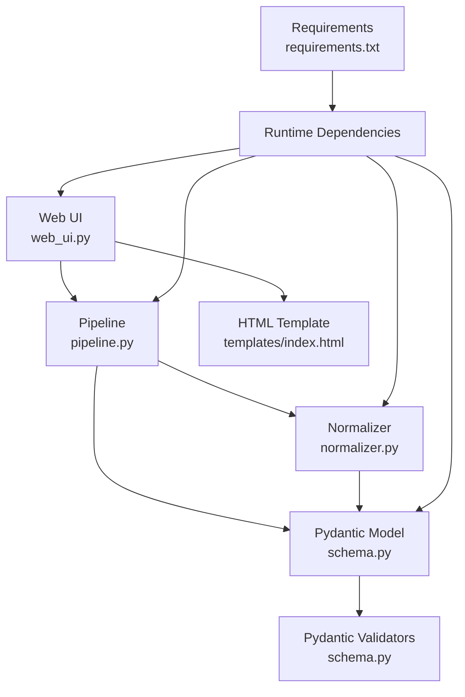
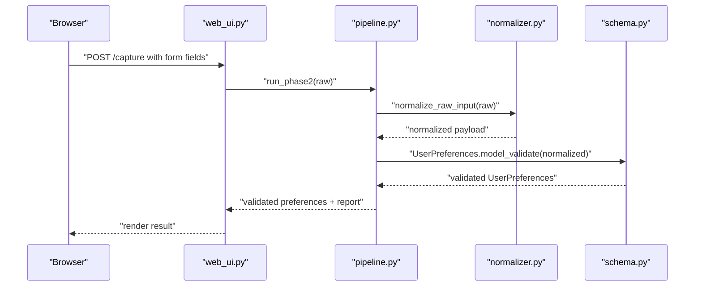
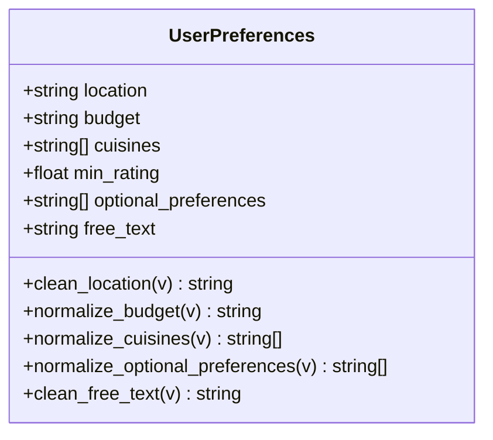
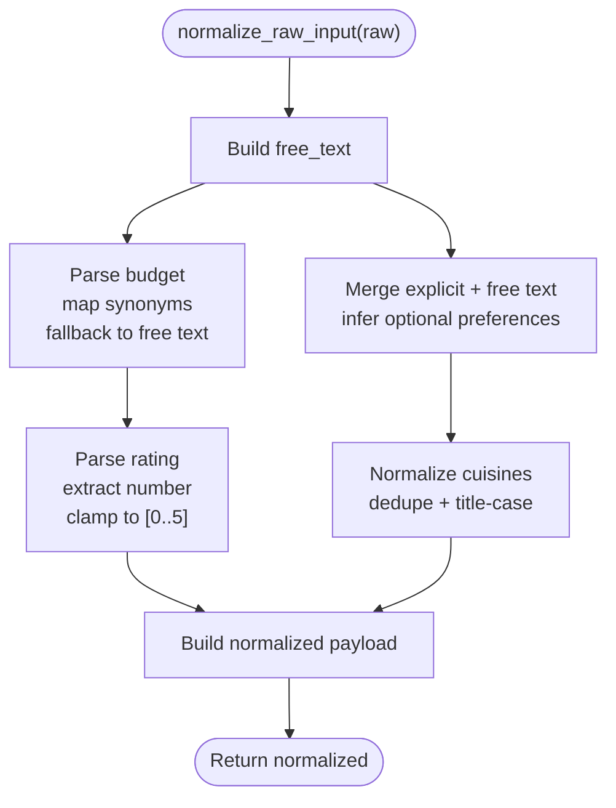
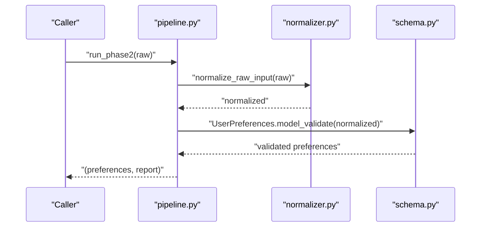
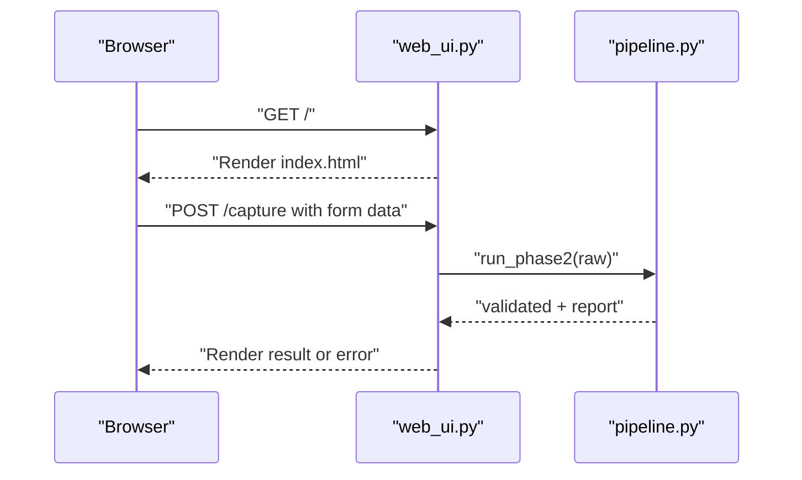
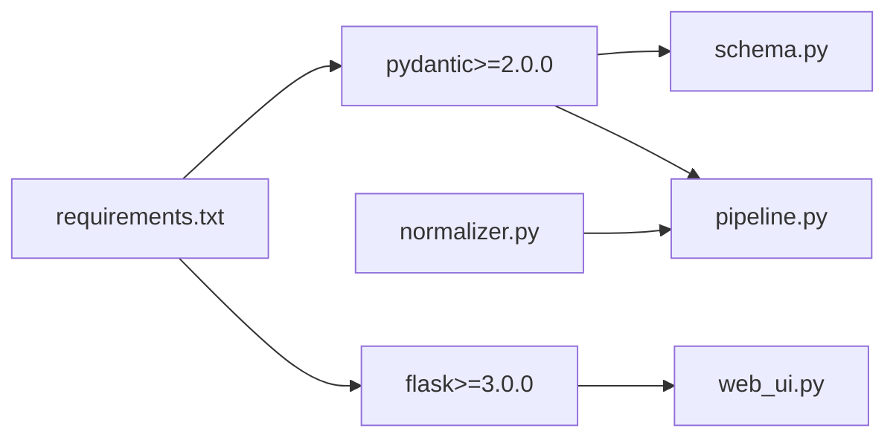

# Schema Validation

<cite>
**Referenced Files in This Document**
- [schema.py](file://Zomato/architecture/phase_2_preference_capture/schema.py)
- [normalizer.py](file://Zomato/architecture/phase_2_preference_capture/normalizer.py)
- [pipeline.py](file://Zomato/architecture/phase_2_preference_capture/pipeline.py)
- [web_ui.py](file://Zomato/architecture/phase_2_preference_capture/web_ui.py)
- [requirements.txt](file://Zomato/architecture/phase_2_preference_capture/requirements.txt)
- [index.html](file://Zomato/architecture/phase_2_preference_capture/templates/index.html)
- [sample_input.json](file://Zomato/architecture/phase_1_data_foundation/sample_input.json)
</cite>

## Table of Contents
1. [Introduction](#introduction)
2. [Project Structure](#project-structure)
3. [Core Components](#core-components)
4. [Architecture Overview](#architecture-overview)
5. [Detailed Component Analysis](#detailed-component-analysis)
6. [Dependency Analysis](#dependency-analysis)
7. [Performance Considerations](#performance-considerations)
8. [Troubleshooting Guide](#troubleshooting-guide)
9. [Conclusion](#conclusion)
10. [Appendices](#appendices)

## Introduction
This document describes the preference schema validation system used in Phase 2 of the Zomato architecture. It focuses on the Pydantic model that defines valid user preference structures, the normalization and validation pipeline, and the associated constraints and rules. It also covers schema evolution, backward compatibility, performance characteristics, and guidance for extending the schema safely.

## Project Structure
The preference capture system is organized into a small set of focused modules:
- A Pydantic model that defines the canonical preference schema and enforces constraints.
- A normalizer that converts noisy, unstructured input into canonical fields.
- A pipeline that orchestrates normalization followed by validation.
- A minimal web UI that demonstrates the end-to-end flow.
- A requirements file declaring the runtime dependencies.

**Diagram sources**
- [web_ui.py:1-52](file://Zomato/architecture/phase_2_preference_capture/web_ui.py#L1-L52)
- [pipeline.py:1-21](file://Zomato/architecture/phase_2_preference_capture/pipeline.py#L1-L21)
- [normalizer.py:1-91](file://Zomato/architecture/phase_2_preference_capture/normalizer.py#L1-L91)
- [schema.py:1-72](file://Zomato/architecture/phase_2_preference_capture/schema.py#L1-L72)
- [requirements.txt:1-3](file://Zomato/architecture/phase_2_preference_capture/requirements.txt#L1-L3)
- [index.html:1-64](file://Zomato/architecture/phase_2_preference_capture/templates/index.html#L1-L64)

**Section sources**
- [web_ui.py:1-52](file://Zomato/architecture/phase_2_preference_capture/web_ui.py#L1-L52)
- [pipeline.py:1-21](file://Zomato/architecture/phase_2_preference_capture/pipeline.py#L1-L21)
- [normalizer.py:1-91](file://Zomato/architecture/phase_2_preference_capture/normalizer.py#L1-L91)
- [schema.py:1-72](file://Zomato/architecture/phase_2_preference_capture/schema.py#L1-L72)
- [requirements.txt:1-3](file://Zomato/architecture/phase_2_preference_capture/requirements.txt#L1-L3)
- [index.html:1-64](file://Zomato/architecture/phase_2_preference_capture/templates/index.html#L1-L64)

## Core Components
- UserPreferences model: Defines the canonical preference object with typed fields, defaults, and validators.
- Normalizer: Transforms raw input into canonical fields, including budget inference, rating parsing, and optional preference detection.
- Pipeline: Executes normalization followed by validation and produces a report.
- Web UI: Provides a simple form and endpoint to capture preferences and surface results or errors.

Key schema fields and constraints:
- location: string, minimum length 1; cleaned and title-cased.
- budget: string constrained to "low", "medium", or "high"; normalized from various inputs.
- cuisines: list of strings; deduplicated and title-cased.
- min_rating: float in range [0.0, 5.0]; parsed from text with bounds clamping.
- optional_preferences: list of strings; deduplicated and lowercased; inferred from free text.
- free_text: string; stripped.

Validation rules enforced:
- Type checking via Pydantic fields and validators.
- Business constraints via field validators and custom normalization.
- Deduplication and canonicalization for lists.

**Section sources**
- [schema.py:8-72](file://Zomato/architecture/phase_2_preference_capture/schema.py#L8-L72)
- [normalizer.py:29-90](file://Zomato/architecture/phase_2_preference_capture/normalizer.py#L29-L90)
- [pipeline.py:11-21](file://Zomato/architecture/phase_2_preference_capture/pipeline.py#L11-L21)

## Architecture Overview
The preference capture flow consists of three stages:
1. Collect raw input from the web UI.
2. Normalize raw input into canonical fields.
3. Validate the normalized payload using the Pydantic model.

**Diagram sources**
- [web_ui.py:19-43](file://Zomato/architecture/phase_2_preference_capture/web_ui.py#L19-L43)
- [pipeline.py:11-21](file://Zomato/architecture/phase_2_preference_capture/pipeline.py#L11-L21)
- [normalizer.py:76-90](file://Zomato/architecture/phase_2_preference_capture/normalizer.py#L76-L90)
- [schema.py:8-16](file://Zomato/architecture/phase_2_preference_capture/schema.py#L8-L16)

## Detailed Component Analysis

### Pydantic Model: UserPreferences
The model defines the canonical preference structure and enforces constraints through:
- Field definitions with defaults and bounds.
- Pre-processing validators that transform inputs before type checks.
- Canonicalization rules for strings and lists.

**Diagram sources**
- [schema.py:8-72](file://Zomato/architecture/phase_2_preference_capture/schema.py#L8-L72)

Field-level validation summary:
- location
  - Type: string
  - Constraint: min_length=1
  - Transformation: stripped and title-cased
- budget
  - Type: string
  - Allowed values: "low", "medium", "high"
  - Transformation: stripped, lowercased; raises error if invalid
- cuisines
  - Type: list[str]
  - Transformation: accepts comma-separated or array input; strips, title-cases, deduplicates
- min_rating
  - Type: float
  - Bounds: ge=0.0, le=5.0
  - Default: 0.0
- optional_preferences
  - Type: list[str]
  - Transformation: accepts comma-separated or array input; strips, lowercases, deduplicates
- free_text
  - Type: string
  - Transformation: stripped

**Section sources**
- [schema.py:8-72](file://Zomato/architecture/phase_2_preference_capture/schema.py#L8-L72)

### Normalizer: normalize_raw_input
The normalizer performs:
- Budget inference: maps synonyms to canonical values and falls back to free text analysis.
- Rating parsing: extracts numeric values and clamps to [0.0, 5.0].
- Optional preferences: merges explicit entries with inferred preferences derived from free text.

**Diagram sources**
- [normalizer.py:76-90](file://Zomato/architecture/phase_2_preference_capture/normalizer.py#L76-L90)
- [normalizer.py:29-73](file://Zomato/architecture/phase_2_preference_capture/normalizer.py#L29-L73)

**Section sources**
- [normalizer.py:29-90](file://Zomato/architecture/phase_2_preference_capture/normalizer.py#L29-L90)

### Pipeline: run_phase2
The pipeline orchestrates normalization and validation, returning the validated object and a report containing input keys, normalized payload, and validity flag.

**Diagram sources**
- [pipeline.py:11-21](file://Zomato/architecture/phase_2_preference_capture/pipeline.py#L11-L21)
- [normalizer.py:76-90](file://Zomato/architecture/phase_2_preference_capture/normalizer.py#L76-L90)
- [schema.py:8-16](file://Zomato/architecture/phase_2_preference_capture/schema.py#L8-L16)

**Section sources**
- [pipeline.py:11-21](file://Zomato/architecture/phase_2_preference_capture/pipeline.py#L11-L21)

### Web UI: Form and Endpoint
The web UI exposes a form with fields for location, budget, cuisines, minimum rating, optional preferences, and free text. On submission, it posts to a route that runs the pipeline and renders either the validated preferences or an error.

**Diagram sources**
- [web_ui.py:14-43](file://Zomato/architecture/phase_2_preference_capture/web_ui.py#L14-L43)
- [index.html:22-46](file://Zomato/architecture/phase_2_preference_capture/templates/index.html#L22-L46)
- [pipeline.py:11-21](file://Zomato/architecture/phase_2_preference_capture/pipeline.py#L11-L21)

**Section sources**
- [web_ui.py:14-43](file://Zomato/architecture/phase_2_preference_capture/web_ui.py#L14-L43)
- [index.html:22-46](file://Zomato/architecture/phase_2_preference_capture/templates/index.html#L22-L46)

## Dependency Analysis
Runtime dependencies:
- pydantic>=2.0.0 is required for the Pydantic model and validators.
- flask>=3.0.0 is required for the web UI.

**Diagram sources**
- [requirements.txt:1-3](file://Zomato/architecture/phase_2_preference_capture/requirements.txt#L1-L3)
- [web_ui.py:1-52](file://Zomato/architecture/phase_2_preference_capture/web_ui.py#L1-L52)
- [schema.py:1-72](file://Zomato/architecture/phase_2_preference_capture/schema.py#L1-L72)
- [pipeline.py:1-21](file://Zomato/architecture/phase_2_preference_capture/pipeline.py#L1-L21)
- [normalizer.py:1-91](file://Zomato/architecture/phase_2_preference_capture/normalizer.py#L1-L91)

**Section sources**
- [requirements.txt:1-3](file://Zomato/architecture/phase_2_preference_capture/requirements.txt#L1-L3)

## Performance Considerations
- Normalization cost: The normalizer performs string parsing, regex matching, and list deduplication. These operations are linear in input size and suitable for typical form payloads.
- Validation cost: Pydantic validation is efficient for small objects like UserPreferences. The validators are lightweight and short-circuit on failure.
- Memory: Deduplication uses sets for O(1) average-time membership checks, keeping memory proportional to unique items.
- I/O: The web UI is synchronous and intended for interactive use; throughput is limited by request volume and server resources.

Optimization strategies:
- Keep normalization logic simple and avoid expensive regexes for large inputs.
- Reuse compiled regex patterns (already done) and minimize repeated passes over data.
- Consider batching normalization/validation only if handling many concurrent requests.
- Use streaming or async frameworks if scaling beyond interactive usage.

[No sources needed since this section provides general guidance]

## Troubleshooting Guide
Common validation errors and causes:
- Budget must be one of: low, medium, high
  - Cause: Non-canonical budget value not recognized by normalization.
  - Fix: Use "low", "medium", or "high" or provide synonyms covered by the mapping; ensure free text does not contradict.
- Location must be non-empty
  - Cause: Empty or missing location after stripping.
  - Fix: Provide a non-empty location string.
- Minimum rating out of range
  - Cause: Parsed rating outside [0.0, 5.0].
  - Fix: Provide a numeric rating or text that parses to a number within bounds.
- Cuisines or optional preferences not list-like
  - Cause: Unexpected type passed for list fields.
  - Fix: Provide a comma-separated string or an array; ensure items are non-empty.

Debugging techniques:
- Inspect the normalization report returned by the pipeline to see the normalized payload and input keys.
- Temporarily log or print intermediate values during normalization to isolate failures.
- Test normalization and validation separately to pinpoint whether the issue is in normalization or validation.

**Section sources**
- [schema.py:23-29](file://Zomato/architecture/phase_2_preference_capture/schema.py#L23-L29)
- [schema.py:11-16](file://Zomato/architecture/phase_2_preference_capture/schema.py#L11-L16)
- [normalizer.py:29-56](file://Zomato/architecture/phase_2_preference_capture/normalizer.py#L29-L56)
- [pipeline.py:15-20](file://Zomato/architecture/phase_2_preference_capture/pipeline.py#L15-L20)

## Conclusion
The preference schema validation system combines a concise Pydantic model with robust normalization to produce a canonical, validated preference object. It enforces strong constraints on types and values, supports flexible input formats, and provides clear feedback via reports and errors. The design balances simplicity, extensibility, and performance for interactive use.

[No sources needed since this section summarizes without analyzing specific files]

## Appendices

### A. Example Inputs and Expected Behavior
Note: The following examples describe valid and invalid scenarios conceptually. They do not reproduce code or exact payloads.

- Valid examples
  - location: non-empty string after trimming and title-casing.
  - budget: "low", "medium", or "high".
  - cuisines: comma-separated or array of non-empty strings; duplicates are removed and normalized.
  - min_rating: numeric or textual representation parseable to a number in [0.0, 5.0].
  - optional_preferences: comma-separated or array of strings; duplicates removed and lowercased; can be inferred from free text.
  - free_text: any string; trimmed.

- Invalid examples
  - location: empty string after cleaning.
  - budget: unrecognized term; normalization fails and raises an error.
  - min_rating: non-numeric text; parsed as 0.0 by default.
  - cuisines/optional_preferences: malformed input types; handled by normalization to safe defaults.

[No sources needed since this section provides general guidance]

### B. Schema Evolution and Backward Compatibility
Patterns for safe evolution:
- Add new optional fields with defaults to preserve existing payloads.
- Introduce new allowed values for enums only when backward-compatible (e.g., expand budget terms).
- Keep validators strict to prevent silent acceptance of invalid data.
- Maintain normalization mappings for deprecated values to ensure backward compatibility.

Guidance:
- Avoid removing or renaming required fields.
- When changing allowed values, update normalization to map old values to new ones.
- Document breaking changes and provide migration paths.

[No sources needed since this section provides general guidance]

### C. Extending the Schema for Custom Preference Types
Steps to add a new preference field:
1. Define the field in the model with appropriate type, default, and constraints.
2. Add a validator for pre-processing if needed (e.g., canonicalization).
3. Update the normalizer to handle the new field if it requires parsing or inference.
4. Update the pipeline to include the new field in the normalized payload.
5. Update the web UI form and endpoint to capture the new field.
6. Add tests covering valid and invalid inputs for the new field.

Best practices:
- Keep transformations deterministic and idempotent where possible.
- Preserve deduplication and canonicalization for list-like fields.
- Ensure bounds and defaults align with business rules.

[No sources needed since this section provides general guidance]