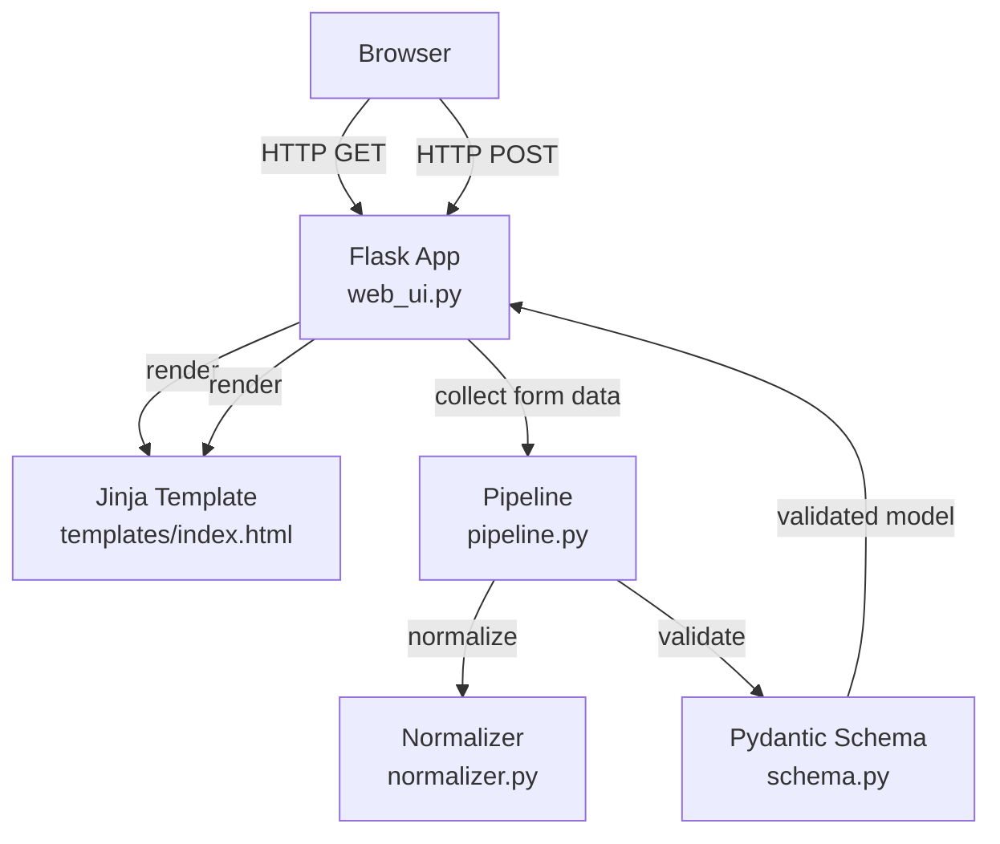
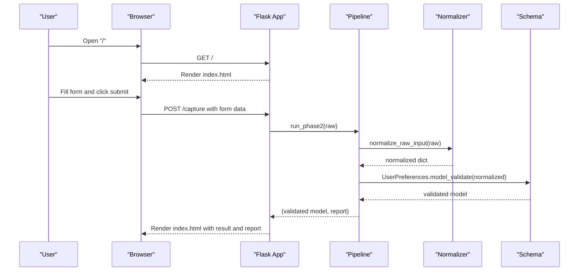
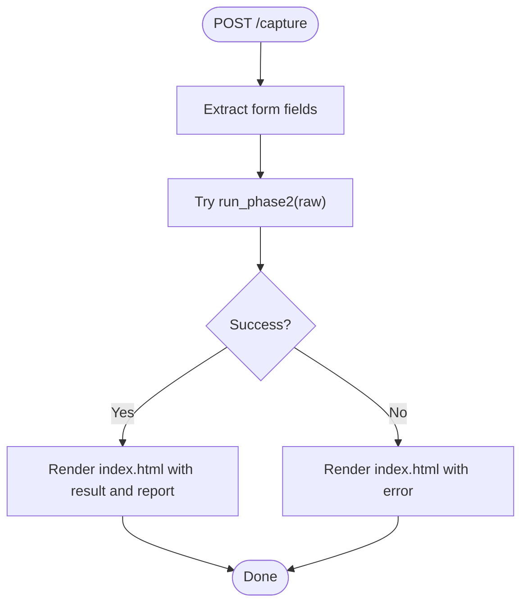
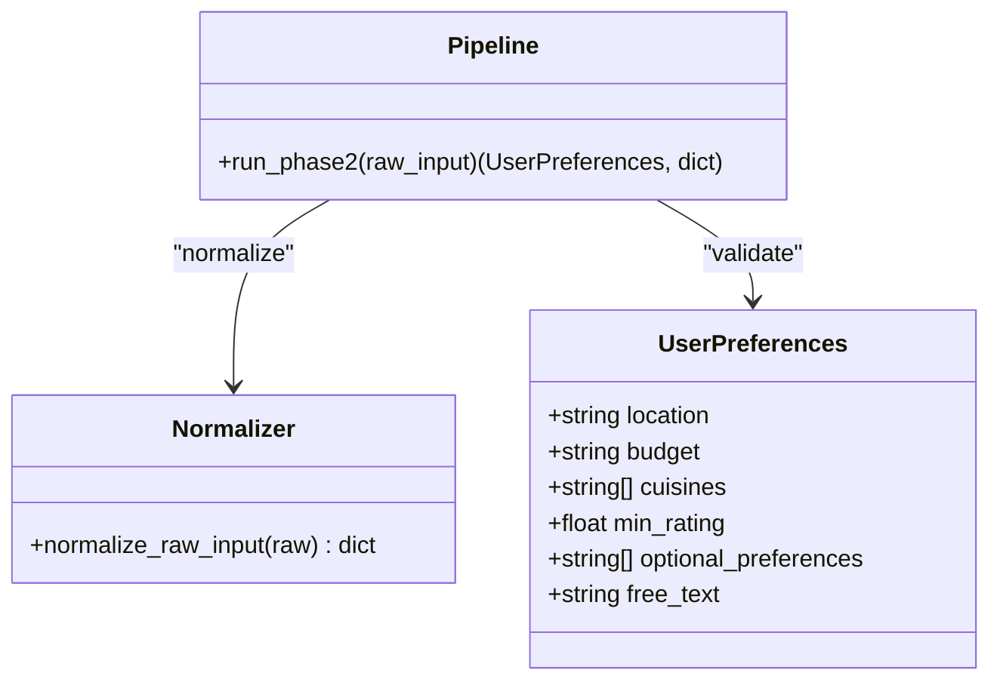
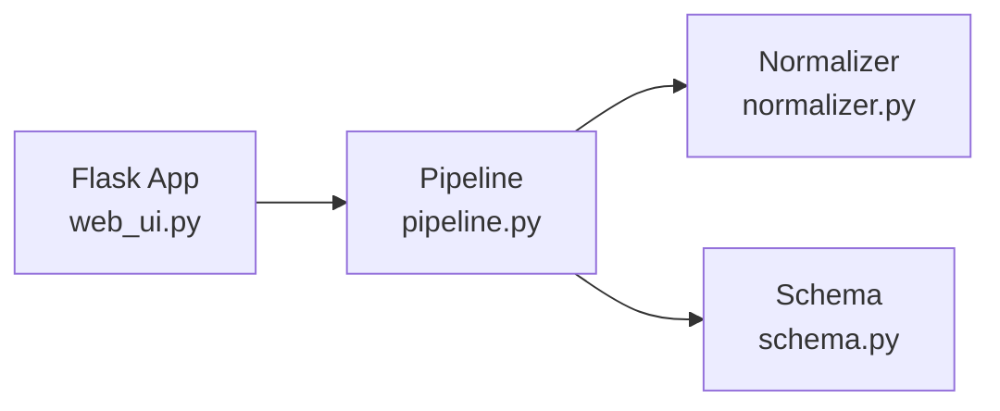

# Web UI Integration

<cite>
**Referenced Files in This Document**
- [web_ui.py](file://Zomato/architecture/phase_2_preference_capture/web_ui.py)
- [index.html](file://Zomato/architecture/phase_2_preference_capture/templates/index.html)
- [schema.py](file://Zomato/architecture/phase_2_preference_capture/schema.py)
- [normalizer.py](file://Zomato/architecture/phase_2_preference_capture/normalizer.py)
- [pipeline.py](file://Zomato/architecture/phase_2_preference_capture/pipeline.py)
- [__main__.py](file://Zomato/architecture/phase_2_preference_capture/__main__.py)
- [requirements.txt](file://Zomato/architecture/phase_2_preference_capture/requirements.txt)
</cite>

## Table of Contents
1. [Introduction](#introduction)
2. [Project Structure](#project-structure)
3. [Core Components](#core-components)
4. [Architecture Overview](#architecture-overview)
5. [Detailed Component Analysis](#detailed-component-analysis)
6. [Dependency Analysis](#dependency-analysis)
7. [Performance Considerations](#performance-considerations)
8. [Troubleshooting Guide](#troubleshooting-guide)
9. [Conclusion](#conclusion)
10. [Appendices](#appendices)

## Introduction
This document describes the web UI integration for the preference capture layer. It explains how the Flask-based backend handles user interactions, form submissions, and real-time-like preference updates, and how the frontend communicates with the backend to exchange preference data. It covers validation feedback, user experience enhancements, error presentation, and provides guidance on building and customizing UI components while preserving validation integrity. It also includes accessibility, responsive design, cross-browser compatibility considerations, troubleshooting tips, and performance optimization strategies.

## Project Structure
The preference capture web UI is organized around a small Flask application that renders a single HTML page with a form and displays results and reports after processing. The backend pipeline normalizes and validates user input using Pydantic models and returns structured results and a normalization report.

**Diagram sources**
- [web_ui.py:14-43](file://Zomato/architecture/phase_2_preference_capture/web_ui.py#L14-L43)
- [index.html:22-46](file://Zomato/architecture/phase_2_preference_capture/templates/index.html#L22-L46)
- [pipeline.py:11-20](file://Zomato/architecture/phase_2_preference_capture/pipeline.py#L11-L20)
- [normalizer.py:76-90](file://Zomato/architecture/phase_2_preference_capture/normalizer.py#L76-L90)
- [schema.py:8-72](file://Zomato/architecture/phase_2_preference_capture/schema.py#L8-L72)

**Section sources**
- [web_ui.py:11-16](file://Zomato/architecture/phase_2_preference_capture/web_ui.py#L11-L16)
- [index.html:18-63](file://Zomato/architecture/phase_2_preference_capture/templates/index.html#L18-L63)

## Core Components
- Flask routes for rendering the form and handling submissions.
- Jinja template with form controls for location, budget, cuisines, rating, optional preferences, and free text.
- Pipeline that normalizes raw input and validates it against a Pydantic schema.
- Validation report returned alongside the validated preferences for transparency.

Key responsibilities:
- web_ui.py: Exposes GET and POST endpoints, collects form data, runs the pipeline, and renders results and errors.
- index.html: Provides the form UI and displays normalized report and validated preferences.
- pipeline.py: Orchestrates normalization and validation.
- normalizer.py: Converts noisy input into canonical fields.
- schema.py: Defines the validated preference model with field validators.

**Section sources**
- [web_ui.py:14-43](file://Zomato/architecture/phase_2_preference_capture/web_ui.py#L14-L43)
- [index.html:22-46](file://Zomato/architecture/phase_2_preference_capture/templates/index.html#L22-L46)
- [pipeline.py:11-20](file://Zomato/architecture/phase_2_preference_capture/pipeline.py#L11-L20)
- [normalizer.py:76-90](file://Zomato/architecture/phase_2_preference_capture/normalizer.py#L76-L90)
- [schema.py:8-72](file://Zomato/architecture/phase_2_preference_capture/schema.py#L8-L72)

## Architecture Overview
The system follows a straightforward request-response flow:
- The browser requests the index page.
- The user fills the form and submits it.
- The backend extracts form fields, normalizes and validates them, and renders the result and report.

**Diagram sources**
- [web_ui.py:14-43](file://Zomato/architecture/phase_2_preference_capture/web_ui.py#L14-L43)
- [pipeline.py:11-20](file://Zomato/architecture/phase_2_preference_capture/pipeline.py#L11-L20)
- [normalizer.py:76-90](file://Zomato/architecture/phase_2_preference_capture/normalizer.py#L76-L90)
- [schema.py:8-72](file://Zomato/architecture/phase_2_preference_capture/schema.py#L8-L72)

## Detailed Component Analysis

### Backend Flask Application (web_ui.py)
Responsibilities:
- Serve the index page on GET.
- On POST to /capture, extract form fields and pass them to the pipeline.
- Render the page with either the validated preferences, a normalization report, or an error block.

Processing logic highlights:
- Form extraction uses request.form.get for each field.
- On success, the validated preferences are rendered as JSON and the normalization report is shown.
- On failure, the stack trace is captured and rendered as an error block.

**Diagram sources**
- [web_ui.py:19-43](file://Zomato/architecture/phase_2_preference_capture/web_ui.py#L19-L43)

**Section sources**
- [web_ui.py:14-43](file://Zomato/architecture/phase_2_preference_capture/web_ui.py#L14-L43)

### Frontend Template (index.html)
UI components and behavior:
- Location input: text field with required attribute.
- Budget dropdown: select with predefined options.
- Cuisines input: text field for comma-separated values.
- Minimum rating input: numeric input constrained to 0–5 with step support.
- Optional preferences input: text field for comma-separated values.
- Free text area: multiline input for additional constraints.
- Submit button: triggers form submission.
- Conditional blocks: error, structured preference object, and normalization report.

Accessibility and UX considerations:
- Semantic labels associated with inputs.
- Required attribute on location ensures client-side validation.
- Numeric input with min/max/step improves input quality.
- Preformatted blocks for error and result aid readability.

**Section sources**
- [index.html:22-46](file://Zomato/architecture/phase_2_preference_capture/templates/index.html#L22-L46)
- [index.html:48-61](file://Zomato/architecture/phase_2_preference_capture/templates/index.html#L48-L61)

### Pipeline and Validation (pipeline.py, normalizer.py, schema.py)
Processing pipeline:
- normalize_raw_input converts raw input into canonical fields, including budget inference from free text, rating parsing, and optional preference detection via patterns.
- UserPreferences.model_validate enforces field constraints and cleans/normalizes values.

Validation behavior:
- Location is stripped and title-cased.
- Budget must be one of low, medium, high; otherwise raises an error.
- Cuisines and optional preferences are deduplicated and normalized.
- Rating clamped to 0–5; defaults to 0 when empty or unparseable.
- Free text is stripped.

**Diagram sources**
- [schema.py:8-72](file://Zomato/architecture/phase_2_preference_capture/schema.py#L8-L72)
- [normalizer.py:76-90](file://Zomato/architecture/phase_2_preference_capture/normalizer.py#L76-L90)
- [pipeline.py:11-20](file://Zomato/architecture/phase_2_preference_capture/pipeline.py#L11-L20)

**Section sources**
- [pipeline.py:11-20](file://Zomato/architecture/phase_2_preference_capture/pipeline.py#L11-L20)
- [normalizer.py:29-90](file://Zomato/architecture/phase_2_preference_capture/normalizer.py#L29-L90)
- [schema.py:8-72](file://Zomato/architecture/phase_2_preference_capture/schema.py#L8-L72)

### CLI Entrypoint (__main__.py)
Provides a command-line interface to run the pipeline directly or start the web UI server. When invoked with --web, it starts the Flask app.

**Section sources**
- [__main__.py:22-26](file://Zomato/architecture/phase_2_preference_capture/__main__.py#L22-L26)
- [__main__.py:28-41](file://Zomato/architecture/phase_2_preference_capture/__main__.py#L28-L41)

## Dependency Analysis
External dependencies:
- Flask for routing and templating.
- Pydantic for data validation and serialization.

Internal dependencies:
- web_ui.py depends on pipeline.py.
- pipeline.py depends on normalizer.py and schema.py.

**Diagram sources**
- [web_ui.py:9](file://Zomato/architecture/phase_2_preference_capture/web_ui.py#L9)
- [pipeline.py:7-8](file://Zomato/architecture/phase_2_preference_capture/pipeline.py#L7-L8)

**Section sources**
- [requirements.txt:1-3](file://Zomato/architecture/phase_2_preference_capture/requirements.txt#L1-L3)
- [web_ui.py:7](file://Zomato/architecture/phase_2_preference_capture/web_ui.py#L7)
- [pipeline.py:7-8](file://Zomato/architecture/phase_2_preference_capture/pipeline.py#L7-L8)

## Performance Considerations
- Keep form payloads minimal; avoid unnecessary fields to reduce processing overhead.
- Normalize early and efficiently: the current normalization uses simple string operations and regex; ensure patterns remain lightweight.
- Use client-side constraints (HTML attributes) to reduce invalid submissions.
- Avoid heavy computations in the request path; the current pipeline is fast and suitable for interactive use.
- Consider caching repeated normalization results if the same inputs occur frequently.
- Keep the template rendering simple; the current template is static and efficient.

## Troubleshooting Guide
Common issues and resolutions:
- Empty or invalid budget: Ensure the budget is one of low, medium, high; otherwise normalization will infer from free text or default to medium.
- Unparseable rating: Non-numeric or out-of-range values are coerced to 0–5; verify numeric input.
- Duplicate cuisines or optional preferences: Deduplication is automatic; ensure commas are used for lists.
- Missing location: The location field is required; ensure it is filled.
- Error display: Errors are rendered in a styled block; check the browser console and server logs for details.

Operational checks:
- Verify Flask is running and listening on the expected host/port.
- Confirm the template folder is correctly configured.
- Ensure Pydantic and Flask versions satisfy requirements.

**Section sources**
- [web_ui.py:37-43](file://Zomato/architecture/phase_2_preference_capture/web_ui.py#L37-L43)
- [index.html:48-51](file://Zomato/architecture/phase_2_preference_capture/templates/index.html#L48-L51)
- [requirements.txt:1-3](file://Zomato/architecture/phase_2_preference_capture/requirements.txt#L1-L3)

## Conclusion
The preference capture web UI integrates a minimal Flask backend with a simple HTML form and a robust normalization/validation pipeline. It provides immediate feedback via rendered results and reports, with clear error handling. The design emphasizes simplicity, validation integrity, and straightforward customization for new UI components while preserving validation behavior.

## Appendices

### UI Components Reference
- Location input: text with required attribute.
- Budget dropdown: select with options low, medium, high.
- Cuisines input: text for comma-separated items.
- Minimum rating input: numeric with min 0, max 5, step 0.1.
- Optional preferences input: text for comma-separated items.
- Free text area: multiline input for additional constraints.
- Submit button: triggers POST to /capture.

**Section sources**
- [index.html:23-43](file://Zomato/architecture/phase_2_preference_capture/templates/index.html#L23-L43)

### AJAX Request Handling and Dynamic Updates
Current implementation uses synchronous form submission. To enable AJAX-style updates:
- Add JavaScript to intercept form submission.
- Send a POST request to /capture with serialized form data.
- On success, update the DOM with the returned result and report.
- On error, display a styled error message.

Note: The existing backend route and template already support returning structured data; the change would be in the frontend script.

[No sources needed since this section provides general guidance]

### Accessibility and Responsive Design
- Use semantic labels and inputs for screen readers.
- Ensure sufficient color contrast for error highlighting.
- Test with keyboard navigation and assistive technologies.
- Responsive viewport meta tag is present; keep form widths and spacing mobile-friendly.

**Section sources**
- [index.html:4-16](file://Zomato/architecture/phase_2_preference_capture/templates/index.html#L4-L16)
- [index.html:10-15](file://Zomato/architecture/phase_2_preference_capture/templates/index.html#L10-L15)

### Cross-Browser Compatibility
- HTML5 input types and attributes are widely supported.
- Numeric input with min/max/step is broadly compatible; test older browsers if needed.
- Ensure UTF-8 encoding is respected.

**Section sources**
- [index.html:4-6](file://Zomato/architecture/phase_2_preference_capture/templates/index.html#L4-L6)
- [index.html:37](file://Zomato/architecture/phase_2_preference_capture/templates/index.html#L37)

### Customizing UI Components While Preserving Validation
- Maintain field names and types to match the backend expectations.
- Preserve required attributes for mandatory fields.
- Keep numeric constraints aligned with validation rules.
- Keep list fields as comma-separated strings to leverage normalization.

**Section sources**
- [web_ui.py:21-28](file://Zomato/architecture/phase_2_preference_capture/web_ui.py#L21-L28)
- [schema.py:11-16](file://Zomato/architecture/phase_2_preference_capture/schema.py#L11-L16)