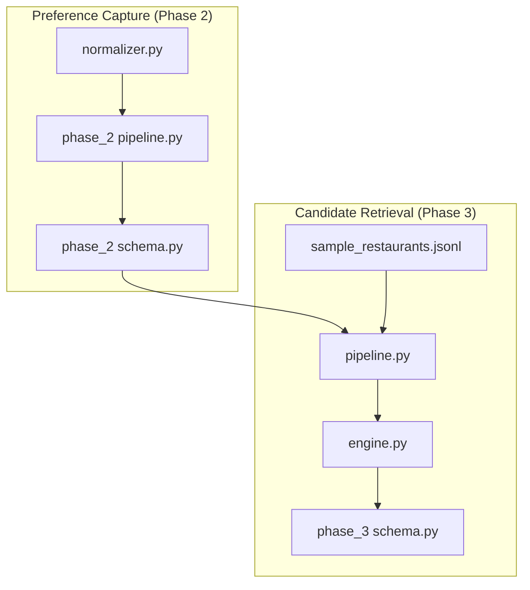
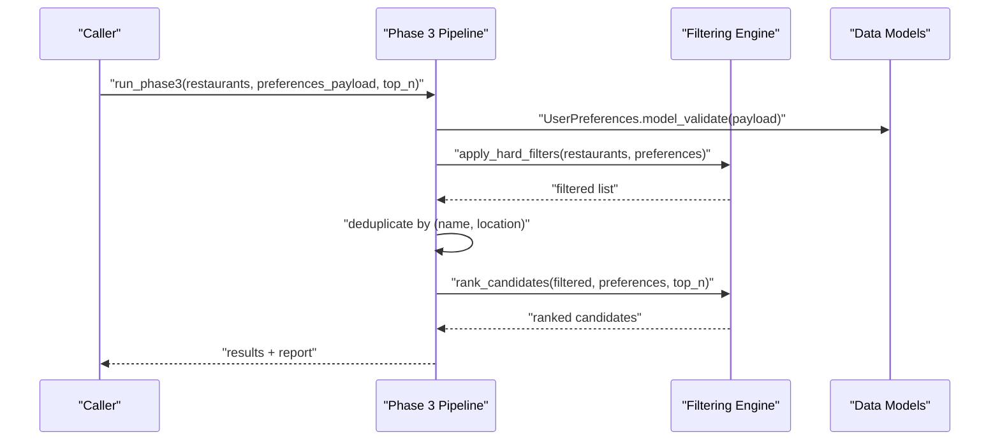
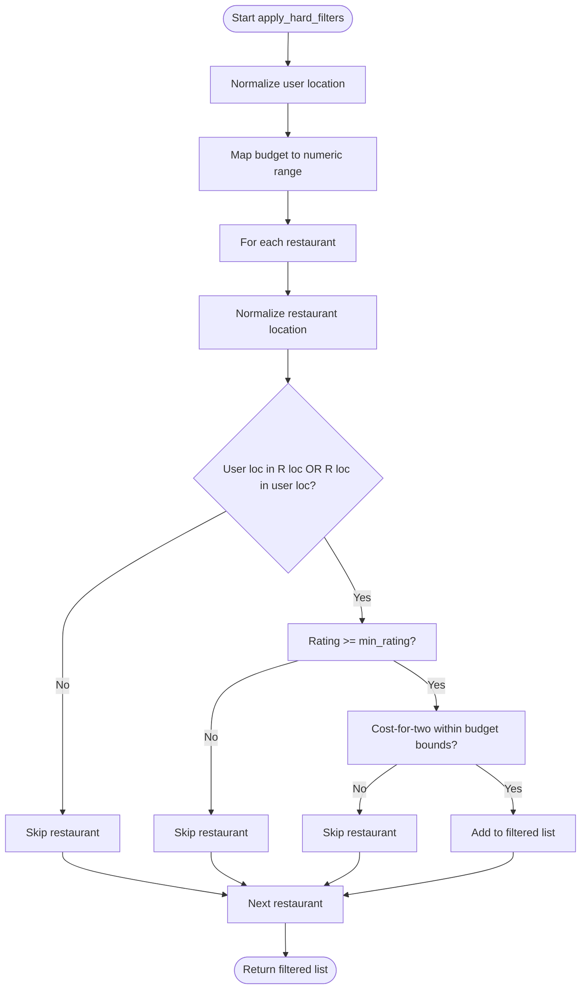
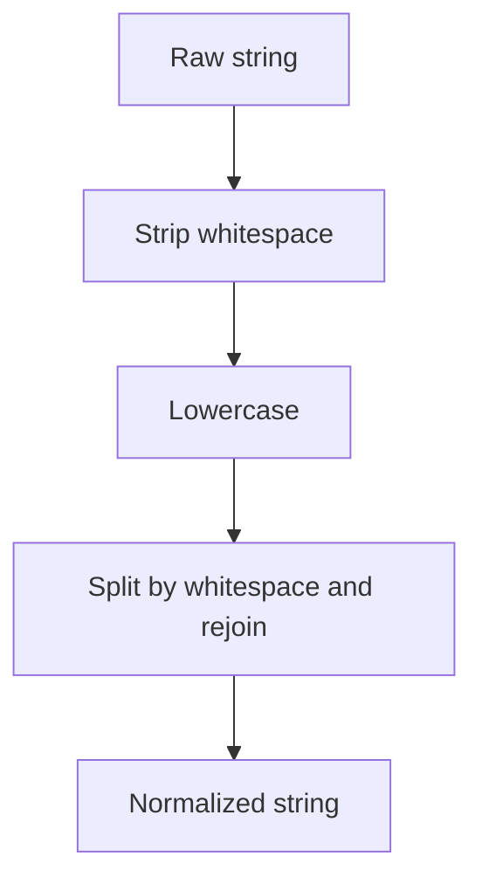
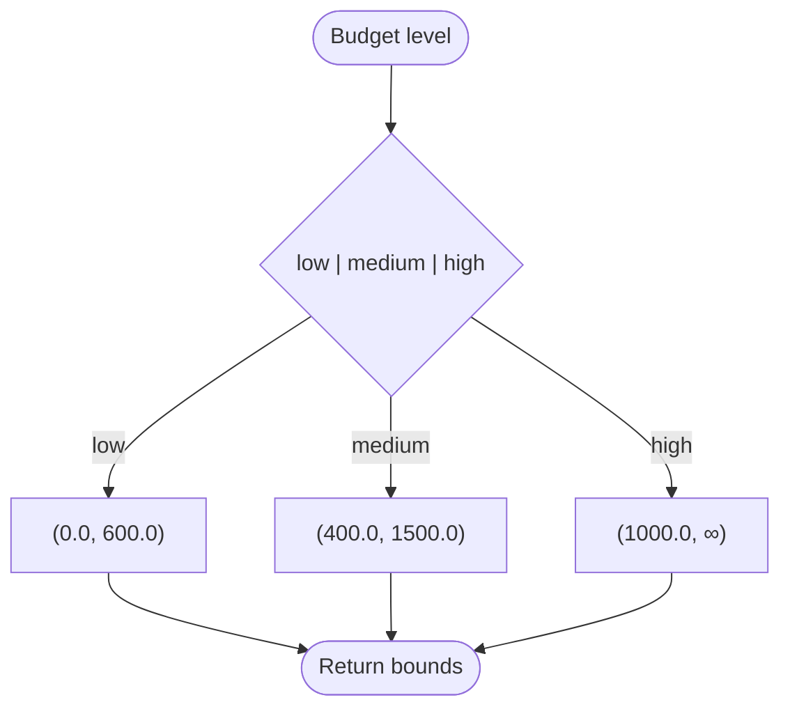
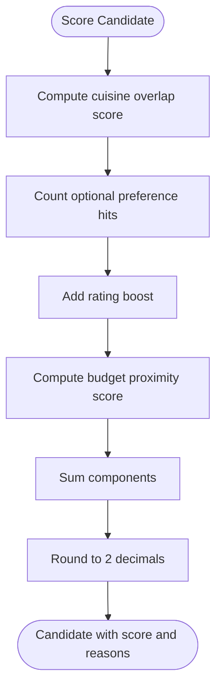
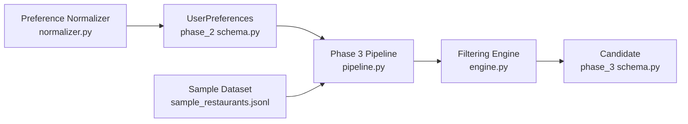
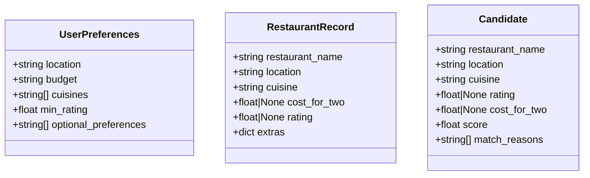

# Filtering Engine

<cite>
**Referenced Files in This Document**
- [engine.py](file://Zomato/architecture/phase_3_candidate_retrieval/engine.py)
- [schema.py](file://Zomato/architecture/phase_3_candidate_retrieval/schema.py)
- [pipeline.py](file://Zomato/architecture/phase_3_candidate_retrieval/pipeline.py)
- [normalizer.py](file://Zomato/architecture/phase_2_preference_capture/normalizer.py)
- [schema.py](file://Zomato/architecture/phase_2_preference_capture/schema.py)
- [pipeline.py](file://Zomato/architecture/phase_2_preference_capture/pipeline.py)
- [sample_restaurants.jsonl](file://Zomato/architecture/phase_3_candidate_retrieval/sample_restaurants.jsonl)
- [detailed-edge-cases.md](file://Zomato/edge-cases/detailed-edge-cases.md)
- [problemstatement.md](file://Zomato/problemstatement.md)
</cite>

## Table of Contents
1. [Introduction](#introduction)
2. [Project Structure](#project-structure)
3. [Core Components](#core-components)
4. [Architecture Overview](#architecture-overview)
5. [Detailed Component Analysis](#detailed-component-analysis)
6. [Dependency Analysis](#dependency-analysis)
7. [Performance Considerations](#performance-considerations)
8. [Troubleshooting Guide](#troubleshooting-guide)
9. [Conclusion](#conclusion)
10. [Appendices](#appendices)

## Introduction
This document explains the filtering engine used in Phase 3 of the Zomato-style recommendation system. It focuses on the hard-filtering stage that narrows down restaurants based on user preferences, including location matching, budget ranges, rating thresholds, and cost-for-two constraints. It also documents the string normalization techniques used for flexible location matching, the budget range calculation system, and the filtering criteria. Finally, it provides concrete examples of filtering behavior, performance considerations for large datasets, and optimization strategies.

## Project Structure
The filtering engine resides in the candidate retrieval phase and integrates with the preference normalization and validation from the preference capture phase. The relevant modules are:
- Filtering engine: applies hard filters and ranks candidates
- Schema: defines typed data models for preferences, restaurants, and candidates
- Pipeline: loads data, runs filters, deduplicates, and ranks
- Preference normalization: cleans and normalizes user input before validation
- Sample data: small JSONL dataset for testing and examples

**Diagram sources**
- [engine.py:1-118](file://Zomato/architecture/phase_3_candidate_retrieval/engine.py#L1-L118)
- [schema.py:1-35](file://Zomato/architecture/phase_3_candidate_retrieval/schema.py#L1-L35)
- [pipeline.py:1-51](file://Zomato/architecture/phase_3_candidate_retrieval/pipeline.py#L1-L51)
- [normalizer.py:1-91](file://Zomato/architecture/phase_2_preference_capture/normalizer.py#L1-L91)
- [schema.py:1-72](file://Zomato/architecture/phase_2_preference_capture/schema.py#L1-L72)
- [pipeline.py:1-21](file://Zomato/architecture/phase_2_preference_capture/pipeline.py#L1-L21)
- [sample_restaurants.jsonl:1-5](file://Zomato/architecture/phase_3_candidate_retrieval/sample_restaurants.jsonl#L1-L5)

**Section sources**
- [engine.py:1-118](file://Zomato/architecture/phase_3_candidate_retrieval/engine.py#L1-L118)
- [schema.py:1-35](file://Zomato/architecture/phase_3_candidate_retrieval/schema.py#L1-L35)
- [pipeline.py:1-51](file://Zomato/architecture/phase_3_candidate_retrieval/pipeline.py#L1-L51)
- [normalizer.py:1-91](file://Zomato/architecture/phase_2_preference_capture/normalizer.py#L1-L91)
- [schema.py:1-72](file://Zomato/architecture/phase_2_preference_capture/schema.py#L1-L72)
- [pipeline.py:1-21](file://Zomato/architecture/phase_2_preference_capture/pipeline.py#L1-L21)
- [sample_restaurants.jsonl:1-5](file://Zomato/architecture/phase_3_candidate_retrieval/sample_restaurants.jsonl#L1-L5)

## Core Components
- apply_hard_filters: Applies strict constraints to prune the restaurant set efficiently
- score_restaurant: Computes a composite score for remaining candidates
- rank_candidates: Sorts candidates by score and returns top-N
- String normalization helpers: Normalize strings for location matching and cuisine parsing
- Budget range mapping: Converts budget level to numeric bounds
- Data models: Strongly typed UserPreferences, RestaurantRecord, Candidate

Key responsibilities:
- Location matching uses bidirectional containment checks with normalized strings
- Budget filtering uses inclusive bounds derived from budget level
- Rating filtering enforces a minimum rating threshold
- Cost-for-two constraints ensure the restaurant’s price aligns with user budget
- Optional preference matching augments scoring without strict exclusion

**Section sources**
- [engine.py:10-46](file://Zomato/architecture/phase_3_candidate_retrieval/engine.py#L10-L46)
- [engine.py:53-107](file://Zomato/architecture/phase_3_candidate_retrieval/engine.py#L53-L107)
- [engine.py:110-118](file://Zomato/architecture/phase_3_candidate_retrieval/engine.py#L110-L118)
- [schema.py:10-35](file://Zomato/architecture/phase_3_candidate_retrieval/schema.py#L10-L35)

## Architecture Overview
The filtering engine sits between preference normalization/validation and candidate ranking. The pipeline loads restaurant records, validates user preferences, applies hard filters, deduplicates, and then ranks candidates.

**Diagram sources**
- [pipeline.py:24-50](file://Zomato/architecture/phase_3_candidate_retrieval/pipeline.py#L24-L50)
- [engine.py:23-46](file://Zomato/architecture/phase_3_candidate_retrieval/engine.py#L23-L46)
- [engine.py:110-118](file://Zomato/architecture/phase_3_candidate_retrieval/engine.py#L110-L118)
- [schema.py:10-16](file://Zomato/architecture/phase_3_candidate_retrieval/schema.py#L10-L16)

## Detailed Component Analysis

### apply_hard_filters
Purpose:
- Remove restaurants that fail strict constraints before scoring

Processing logic:
- Normalize user location and restaurant location
- Check bidirectional containment: either the user location is contained in the restaurant location or vice versa
- Enforce minimum rating threshold
- Enforce cost-for-two against budget-derived bounds

**Diagram sources**
- [engine.py:23-46](file://Zomato/architecture/phase_3_candidate_retrieval/engine.py#L23-L46)

**Section sources**
- [engine.py:23-46](file://Zomato/architecture/phase_3_candidate_retrieval/engine.py#L23-L46)

### String Normalization Techniques
Normalization ensures flexible location matching and consistent parsing:
- Whitespace collapsing and lowercasing
- Cuisine splitting and normalization for overlap scoring
- Location normalization used in bidirectional containment checks

**Diagram sources**
- [engine.py:10-11](file://Zomato/architecture/phase_3_candidate_retrieval/engine.py#L10-L11)
- [engine.py:49-50](file://Zomato/architecture/phase_3_candidate_retrieval/engine.py#L49-L50)

**Section sources**
- [engine.py:10-11](file://Zomato/architecture/phase_3_candidate_retrieval/engine.py#L10-L11)
- [engine.py:49-50](file://Zomato/architecture/phase_3_candidate_retrieval/engine.py#L49-L50)

### Budget Range Calculation System
Budget mapping converts user budget level to inclusive numeric bounds:
- low: 0.0 to 600.0
- medium: 400.0 to 1500.0
- high: 1000.0 to None

These bounds are used to filter cost-for-two values.

**Diagram sources**
- [engine.py:14-20](file://Zomato/architecture/phase_3_candidate_retrieval/engine.py#L14-L20)

**Section sources**
- [engine.py:14-20](file://Zomato/architecture/phase_3_candidate_retrieval/engine.py#L14-L20)

### Filtering Criteria
- Location containment: Bidirectional substring containment after normalization
- Minimum rating: Enforced via threshold comparison
- Cost-for-two: Enforced via inclusive bounds derived from budget level
- Cuisine overlap: Used in scoring (not a hard filter), computed via normalized sets

**Section sources**
- [engine.py:23-46](file://Zomato/architecture/phase_3_candidate_retrieval/engine.py#L23-L46)
- [engine.py:57-66](file://Zomato/architecture/phase_3_candidate_retrieval/engine.py#L57-L66)

### Candidate Ranking and Scoring
After hard filtering, candidates are scored and ranked:
- Cuisine overlap score: proportional to normalized intersection
- Optional preference matches: additive bonus up to a cap
- Rating boost: linear multiplier
- Budget proximity: proximity to ideal budget midpoint within the budget interval

**Diagram sources**
- [engine.py:53-107](file://Zomato/architecture/phase_3_candidate_retrieval/engine.py#L53-L107)

**Section sources**
- [engine.py:53-107](file://Zomato/architecture/phase_3_candidate_retrieval/engine.py#L53-L107)

### Concrete Examples
Example 1: User prefers Bangalore, medium budget, minimum rating 4.0, cuisines Italian or Chinese
- Restaurants:
  - Pasta Point: Bangalore, Italian/Continental, cost 1200, rating 4.4 → passes hard filters
  - Dragon Wok: Bangalore, Chinese/Thai, cost 800, rating 4.2 → passes hard filters
  - Budget Bites: Bangalore, North Indian, cost 350, rating 3.9 → fails rating threshold
  - Delhi Spice: Delhi, North Indian/Mughlai, cost 1100, rating 4.5 → fails location

Filtered results: Pasta Point, Dragon Wok  
After deduplication and ranking: top candidates determined by scoring

Example 2: User prefers high budget, minimum rating 4.3, location contains “bang”
- Restaurants:
  - Pasta Point: Bangalore, cost 1200, rating 4.4 → passes
  - Dragon Wok: Bangalore, cost 800, rating 4.2 → fails rating
  - Budget Bites: Bangalore, cost 350, rating 3.9 → fails rating and budget
  - Delhi Spice: Delhi, cost 1100, rating 4.5 → fails location

Filtered results: Pasta Point

Note: These examples illustrate the filtering behavior described by the code. They are intended to clarify the logic and are not direct outputs from the code.

**Section sources**
- [sample_restaurants.jsonl:1-5](file://Zomato/architecture/phase_3_candidate_retrieval/sample_restaurants.jsonl#L1-L5)
- [engine.py:23-46](file://Zomato/architecture/phase_3_candidate_retrieval/engine.py#L23-L46)
- [engine.py:53-107](file://Zomato/architecture/phase_3_candidate_retrieval/engine.py#L53-L107)

## Dependency Analysis
The filtering engine depends on:
- Typed data models for input and output
- Normalized user preferences from the preference capture phase
- A small sample dataset for demonstration

**Diagram sources**
- [normalizer.py:76-91](file://Zomato/architecture/phase_2_preference_capture/normalizer.py#L76-L91)
- [schema.py:8-17](file://Zomato/architecture/phase_2_preference_capture/schema.py#L8-L17)
- [pipeline.py:24-50](file://Zomato/architecture/phase_3_candidate_retrieval/pipeline.py#L24-L50)
- [engine.py:23-46](file://Zomato/architecture/phase_3_candidate_retrieval/engine.py#L23-L46)
- [schema.py:27-35](file://Zomato/architecture/phase_3_candidate_retrieval/schema.py#L27-L35)
- [sample_restaurants.jsonl:1-5](file://Zomato/architecture/phase_3_candidate_retrieval/sample_restaurants.jsonl#L1-L5)

**Section sources**
- [pipeline.py:9-10](file://Zomato/architecture/phase_3_candidate_retrieval/pipeline.py#L9-L10)
- [schema.py:7-8](file://Zomato/architecture/phase_3_candidate_retrieval/schema.py#L7-L8)

## Performance Considerations
- Complexity:
  - apply_hard_filters: O(N) over restaurants
  - rank_candidates: O(N log N) due to sorting
- Memory:
  - Temporary lists for filtered and ranked results
- Scalability:
  - For large datasets, consider:
    - Pre-indexing by location substrings or geohashes
    - Early pruning by coarse filters (e.g., rating and budget ranges)
    - Streaming processing for very large files
    - Parallelization of scoring per chunk
- I/O:
  - Loading JSONL is linear in number of lines
  - Consider batching reads and validations
- Deduplication:
  - Current approach uses a set keyed by normalized (name, location); ensure normalization is consistent

[No sources needed since this section provides general guidance]

## Troubleshooting Guide
Common issues and mitigations:
- Zero candidates after hard filters:
  - Expand location scope, lower rating threshold, or widen budget
  - See staged fallback guidance in edge cases
- Near-matches excluded due to strict containment:
  - Normalize inputs consistently; consider fuzzy matching for location aliases
- Budget misinterpretation:
  - Ensure budget normalization maps qualitative terms to configured ranges
- Optional preference misses:
  - Verify normalization and inclusion of free-text hints
- Duplicate recommendations:
  - Confirm deduplication by normalized (name, location) occurs before ranking

**Section sources**
- [detailed-edge-cases.md:71-74](file://Zomato/edge-cases/detailed-edge-cases.md#L71-L74)
- [detailed-edge-cases.md:91-94](file://Zomato/edge-cases/detailed-edge-cases.md#L91-L94)
- [detailed-edge-cases.md:49-52](file://Zomato/edge-cases/detailed-edge-cases.md#L49-L52)
- [pipeline.py:32-39](file://Zomato/architecture/phase_3_candidate_retrieval/pipeline.py#L32-L39)

## Conclusion
The filtering engine implements a fast, deterministic hard-filter pass followed by a scoring and ranking stage. Its design emphasizes:
- Clear budget bounds derived from user budget level
- Flexible location matching via normalization and bidirectional containment
- Strict enforcement of rating and cost constraints
- Lightweight scoring that prioritizes explicit user preferences

Together with the preference normalization and pipeline orchestration, it forms a robust foundation for downstream recommendation generation.

[No sources needed since this section summarizes without analyzing specific files]

## Appendices

### Data Models Overview

**Diagram sources**
- [schema.py:10-35](file://Zomato/architecture/phase_3_candidate_retrieval/schema.py#L10-L35)

### Preference Normalization Reference
- Budget normalization maps qualitative terms to low/medium/high
- Optional preferences inferred from free text using keyword patterns
- Location and cuisines normalized to canonical forms

**Section sources**
- [normalizer.py:29-41](file://Zomato/architecture/phase_2_preference_capture/normalizer.py#L29-L41)
- [normalizer.py:59-73](file://Zomato/architecture/phase_2_preference_capture/normalizer.py#L59-L73)
- [schema.py:18-29](file://Zomato/architecture/phase_2_preference_capture/schema.py#L18-L29)
- [schema.py:50-66](file://Zomato/architecture/phase_2_preference_capture/schema.py#L50-L66)