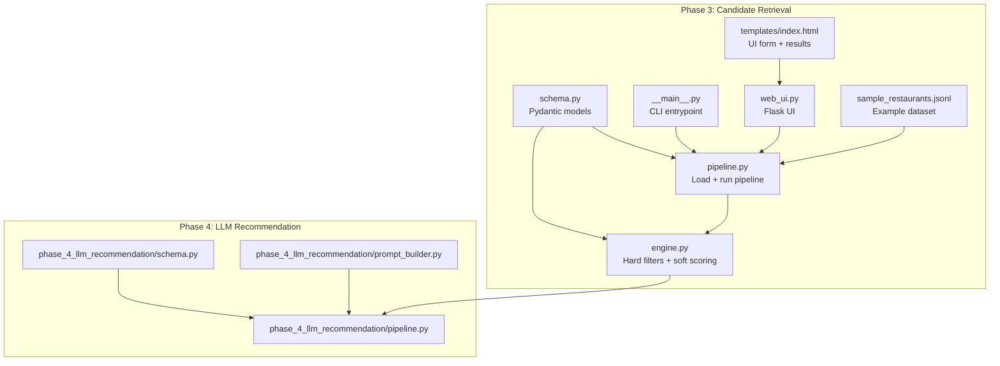
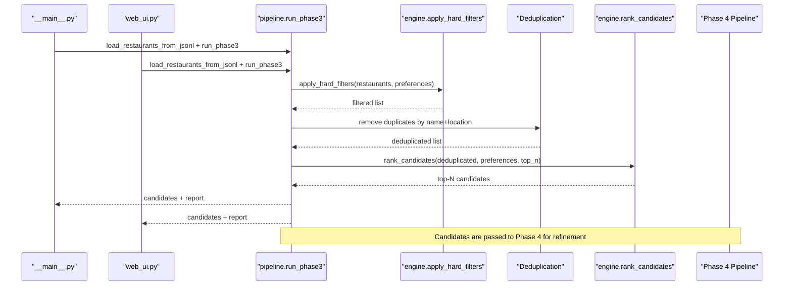
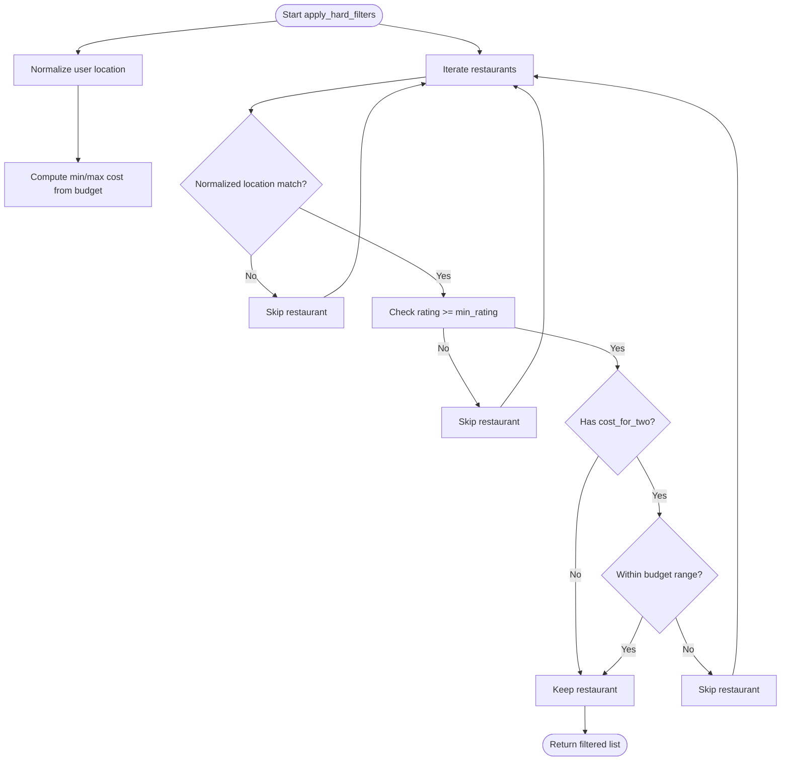
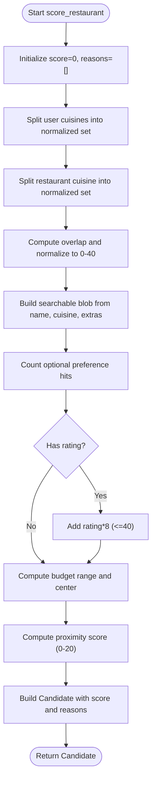
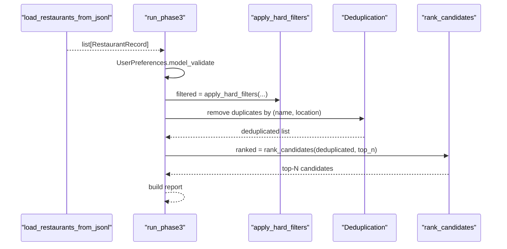
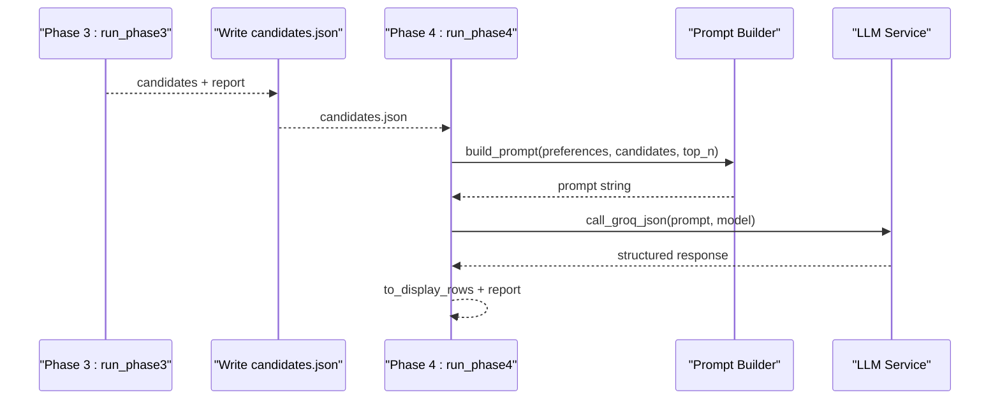
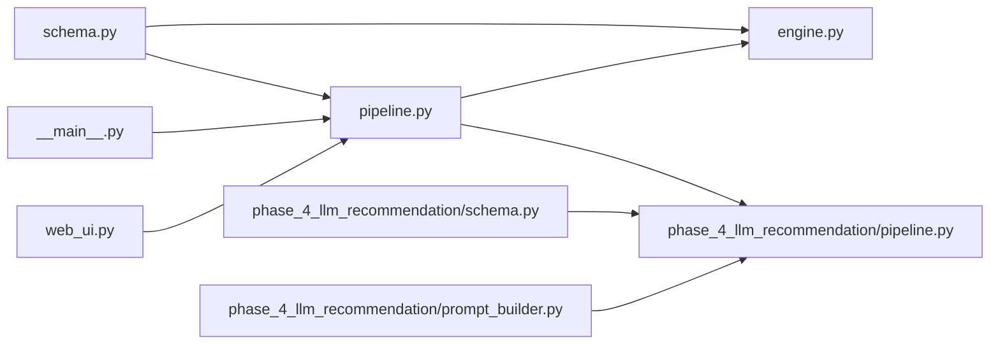

# Phase 3: Candidate Retrieval

<cite>
**Referenced Files in This Document**
- [engine.py](file://Zomato/architecture/phase_3_candidate_retrieval/engine.py)
- [schema.py](file://Zomato/architecture/phase_3_candidate_retrieval/schema.py)
- [pipeline.py](file://Zomato/architecture/phase_3_candidate_retrieval/pipeline.py)
- [__main__.py](file://Zomato/architecture/phase_3_candidate_retrieval/__main__.py)
- [web_ui.py](file://Zomato/architecture/phase_3_candidate_retrieval/web_ui.py)
- [index.html](file://Zomato/architecture/phase_3_candidate_retrieval/templates/index.html)
- [sample_restaurants.jsonl](file://Zomato/architecture/phase_3_candidate_retrieval/sample_restaurants.jsonl)
- [phase_4_llm_recommendation/pipeline.py](file://Zomato/architecture/phase_4_llm_recommendation/pipeline.py)
- [phase_4_llm_recommendation/schema.py](file://Zomato/architecture/phase_4_llm_recommendation/schema.py)
- [phase_4_llm_recommendation/prompt_builder.py](file://Zomato/architecture/phase_4_llm_recommendation/prompt_builder.py)
</cite>

## Table of Contents
1. [Introduction](#introduction)
2. [Project Structure](#project-structure)
3. [Core Components](#core-components)
4. [Architecture Overview](#architecture-overview)
5. [Detailed Component Analysis](#detailed-component-analysis)
6. [Dependency Analysis](#dependency-analysis)
7. [Performance Considerations](#performance-considerations)
8. [Troubleshooting Guide](#troubleshooting-guide)
9. [Conclusion](#conclusion)
10. [Appendices](#appendices)

## Introduction
Phase 3 focuses on transforming cleaned restaurant records into a shortlist of candidates by applying hard filters and soft scoring, then ranking the results. It validates user preferences, filters restaurants by location, budget, and rating, and computes a composite score that combines cuisine similarity, optional preference matches, rating, and budget proximity. The resulting candidates are passed forward to Phase 4, where an LLM refines the ranking and adds explanations.

## Project Structure
The Phase 3 module consists of:
- Schema definitions for user preferences, restaurant records, and candidate outputs
- A filtering and scoring engine
- A pipeline that loads data, applies filters, deduplicates, scores, and ranks
- A CLI and a minimal web UI for interactive runs
- Example dataset for testing

**Diagram sources**
- [schema.py:1-35](file://Zomato/architecture/phase_3_candidate_retrieval/schema.py#L1-L35)
- [engine.py:1-118](file://Zomato/architecture/phase_3_candidate_retrieval/engine.py#L1-L118)
- [pipeline.py:1-51](file://Zomato/architecture/phase_3_candidate_retrieval/pipeline.py#L1-L51)
- [__main__.py:1-51](file://Zomato/architecture/phase_3_candidate_retrieval/__main__.py#L1-L51)
- [web_ui.py:1-58](file://Zomato/architecture/phase_3_candidate_retrieval/web_ui.py#L1-L58)
- [index.html:1-94](file://Zomato/architecture/phase_3_candidate_retrieval/templates/index.html#L1-L94)
- [sample_restaurants.jsonl:1-5](file://Zomato/architecture/phase_3_candidate_retrieval/sample_restaurants.jsonl#L1-L5)
- [phase_4_llm_recommendation/pipeline.py:1-47](file://Zomato/architecture/phase_4_llm_recommendation/pipeline.py#L1-L47)
- [phase_4_llm_recommendation/schema.py:1-38](file://Zomato/architecture/phase_4_llm_recommendation/schema.py#L1-L38)
- [phase_4_llm_recommendation/prompt_builder.py:1-45](file://Zomato/architecture/phase_4_llm_recommendation/prompt_builder.py#L1-L45)

**Section sources**
- [schema.py:1-35](file://Zomato/architecture/phase_3_candidate_retrieval/schema.py#L1-L35)
- [engine.py:1-118](file://Zomato/architecture/phase_3_candidate_retrieval/engine.py#L1-L118)
- [pipeline.py:1-51](file://Zomato/architecture/phase_3_candidate_retrieval/pipeline.py#L1-L51)
- [__main__.py:1-51](file://Zomato/architecture/phase_3_candidate_retrieval/__main__.py#L1-L51)
- [web_ui.py:1-58](file://Zomato/architecture/phase_3_candidate_retrieval/web_ui.py#L1-L58)
- [index.html:1-94](file://Zomato/architecture/phase_3_candidate_retrieval/templates/index.html#L1-L94)
- [sample_restaurants.jsonl:1-5](file://Zomato/architecture/phase_3_candidate_retrieval/sample_restaurants.jsonl#L1-L5)

## Core Components
- UserPreferences: Defines required and validated fields for filtering and scoring (location, budget, cuisines, min_rating, optional_preferences).
- RestaurantRecord: Represents a normalized restaurant entry with name, location, cuisine, cost_for_two, rating, and extras.
- Candidate: Output of scoring, including computed score and match reasons.
- apply_hard_filters: Enforces location containment, rating threshold, and budget range checks.
- score_restaurant: Computes a weighted score combining cuisine overlap, optional preference matches, rating, and budget proximity.
- rank_candidates: Sorts candidates by score and returns top-N.
- pipeline.run_phase3: Loads JSONL dataset, validates preferences, applies hard filters, deduplicates, ranks, and reports counts.

**Section sources**
- [schema.py:10-35](file://Zomato/architecture/phase_3_candidate_retrieval/schema.py#L10-L35)
- [engine.py:23-117](file://Zomato/architecture/phase_3_candidate_retrieval/engine.py#L23-L117)
- [pipeline.py:24-51](file://Zomato/architecture/phase_3_candidate_retrieval/pipeline.py#L24-L51)

## Architecture Overview
End-to-end flow from dataset to ranked candidates and onward to LLM recommendation:

**Diagram sources**
- [__main__.py:11-47](file://Zomato/architecture/phase_3_candidate_retrieval/__main__.py#L11-L47)
- [web_ui.py:19-49](file://Zomato/architecture/phase_3_candidate_retrieval/web_ui.py#L19-L49)
- [pipeline.py:24-51](file://Zomato/architecture/phase_3_candidate_retrieval/pipeline.py#L24-L51)
- [engine.py:23-117](file://Zomato/architecture/phase_3_candidate_retrieval/engine.py#L23-L117)
- [phase_4_llm_recommendation/pipeline.py:29-47](file://Zomato/architecture/phase_4_llm_recommendation/pipeline.py#L29-L47)

## Detailed Component Analysis

### Filtering Logic (Hard Matching)
Hard filters ensure only viable candidates pass to scoring:
- Location matching: Normalized user location must be contained in restaurant location or vice versa. This handles partial matches and case-insensitivity.
- Minimum rating threshold: Restaurants below the user’s min_rating are excluded.
- Budget constraints: Based on budget tier, cost_for_two must fall within the derived low/medium/high range. If a high budget is selected, only lower bounds apply; if medium, a proximity score is used later.

**Diagram sources**
- [engine.py:23-46](file://Zomato/architecture/phase_3_candidate_retrieval/engine.py#L23-L46)

**Section sources**
- [engine.py:23-46](file://Zomato/architecture/phase_3_candidate_retrieval/engine.py#L23-L46)

### Soft Scoring and Ranking
Soft scoring aggregates multiple signals into a single score:
- Cuisine similarity: Overlap between user-requested cuisines and restaurant’s cuisines, normalized to a 0–40 point contribution.
- Optional preferences: Presence of optional keywords in restaurant name, cuisine, or extras contributes up to 20 points (at most 8 points per keyword).
- Rating boost: Rating scaled linearly to up to 40 points.
- Budget proximity: If a budget range is defined, proximity to the ideal midpoint yields up to 20 points; otherwise a baseline proximity is applied.

Ranking sorts by score descending and returns top-N.

**Diagram sources**
- [engine.py:53-107](file://Zomato/architecture/phase_3_candidate_retrieval/engine.py#L53-L107)

**Section sources**
- [engine.py:53-107](file://Zomato/architecture/phase_3_candidate_retrieval/engine.py#L53-L107)

### Schema Validation for Candidate Data
Pydantic models enforce data correctness:
- UserPreferences: location required, budget constrained to low/medium/high, cuisines and optional_preferences lists, min_rating in [0,5].
- RestaurantRecord: name, location, cuisine required; cost_for_two and rating optional with non-negative constraints; extras dictionary.
- Candidate: includes all restaurant fields plus score and match reasons.

These validations occur during:
- Pipeline input parsing (preferences)
- Dataset loading (restaurants)
- Final candidate construction (engine)

**Section sources**
- [schema.py:10-35](file://Zomato/architecture/phase_3_candidate_retrieval/schema.py#L10-L35)
- [pipeline.py:29](file://Zomato/architecture/phase_3_candidate_retrieval/pipeline.py#L29)
- [engine.py:99-107](file://Zomato/architecture/phase_3_candidate_retrieval/engine.py#L99-L107)

### Pipeline Coordination of Retrieval Processes
The pipeline orchestrates:
- Loading restaurants from a JSONL file
- Validating user preferences
- Applying hard filters
- Deduplicating by restaurant name and location
- Ranking candidates by score
- Producing a report with counts before/after each stage

**Diagram sources**
- [pipeline.py:13-51](file://Zomato/architecture/phase_3_candidate_retrieval/pipeline.py#L13-L51)
- [engine.py:23-117](file://Zomato/architecture/phase_3_candidate_retrieval/engine.py#L23-L117)

**Section sources**
- [pipeline.py:13-51](file://Zomato/architecture/phase_3_candidate_retrieval/pipeline.py#L13-L51)

### Integration with LLM Recommendation Phase
Phase 3 candidates are consumed by Phase 4:
- Phase 4 loads candidates and preferences, builds a prompt containing both, and calls the LLM to produce ranked recommendations with explanations.
- The prompt builder ensures the LLM receives structured JSON with user preferences and candidate attributes.
- Phase 4 returns a formatted response and a report summarizing counts and model usage.

**Diagram sources**
- [pipeline.py:24-51](file://Zomato/architecture/phase_3_candidate_retrieval/pipeline.py#L24-L51)
- [phase_4_llm_recommendation/pipeline.py:29-47](file://Zomato/architecture/phase_4_llm_recommendation/pipeline.py#L29-L47)
- [phase_4_llm_recommendation/prompt_builder.py:10-44](file://Zomato/architecture/phase_4_llm_recommendation/prompt_builder.py#L10-L44)

**Section sources**
- [phase_4_llm_recommendation/pipeline.py:15-47](file://Zomato/architecture/phase_4_llm_recommendation/pipeline.py#L15-L47)
- [phase_4_llm_recommendation/schema.py:8-38](file://Zomato/architecture/phase_4_llm_recommendation/schema.py#L8-L38)
- [phase_4_llm_recommendation/prompt_builder.py:10-44](file://Zomato/architecture/phase_4_llm_recommendation/prompt_builder.py#L10-L44)

### Concrete Examples from the Codebase
- Hard filtering example: A user requests “Bangalore” as location and “medium” budget. The engine checks whether the normalized location is contained in the restaurant’s location or vice versa, enforces min_rating, and filters by cost_for_two against the derived medium range.
- Soft scoring example: A restaurant with Italian and Continental cuisines and optional preference “quick-service” in extras receives:
  - Cuisine similarity score based on overlap with user’s requested cuisines
  - Optional preference bonus for “quick-service”
  - Rating boost scaled to up to 40 points
  - Budget proximity score depending on how close cost_for_two is to the midpoint of the medium budget range
- Ranking example: Top-N candidates are sorted by score and truncated to the requested count.

**Section sources**
- [engine.py:23-117](file://Zomato/architecture/phase_3_candidate_retrieval/engine.py#L23-L117)
- [sample_restaurants.jsonl:1-5](file://Zomato/architecture/phase_3_candidate_retrieval/sample_restaurants.jsonl#L1-L5)

### Configuration Options
- CLI/Web inputs:
  - dataset_path: Path to the cleaned restaurant JSONL file
  - location: Target city or area
  - budget: low | medium | high
  - cuisines: Comma-separated list of preferred cuisines
  - min_rating: Numeric threshold for minimum acceptable rating
  - optional_preferences: Comma-separated keywords to match in restaurant name, cuisine, or extras
  - top_n: Number of candidates to return
- Schema constraints:
  - UserPreferences: location required, budget restricted, min_rating in [0,5], lists default to empty
  - RestaurantRecord: cost_for_two and rating optional, extras dictionary
  - Candidate: includes score and match reasons

**Section sources**
- [__main__.py:11-47](file://Zomato/architecture/phase_3_candidate_retrieval/__main__.py#L11-L47)
- [web_ui.py:19-49](file://Zomato/architecture/phase_3_candidate_retrieval/web_ui.py#L19-L49)
- [schema.py:10-35](file://Zomato/architecture/phase_3_candidate_retrieval/schema.py#L10-L35)

## Dependency Analysis
- Internal dependencies:
  - engine depends on schema models for types and validation
  - pipeline depends on engine and schema for filtering, scoring, and validation
  - CLI and web UI depend on pipeline for orchestration
- External dependencies:
  - Pydantic for data validation
  - Flask for the web UI
- Inter-phase dependency:
  - Phase 3 outputs candidates compatible with Phase 4 CandidateInput schema

**Diagram sources**
- [schema.py:1-35](file://Zomato/architecture/phase_3_candidate_retrieval/schema.py#L1-L35)
- [engine.py:1-118](file://Zomato/architecture/phase_3_candidate_retrieval/engine.py#L1-L118)
- [pipeline.py:1-51](file://Zomato/architecture/phase_3_candidate_retrieval/pipeline.py#L1-L51)
- [__main__.py:1-51](file://Zomato/architecture/phase_3_candidate_retrieval/__main__.py#L1-L51)
- [web_ui.py:1-58](file://Zomato/architecture/phase_3_candidate_retrieval/web_ui.py#L1-L58)
- [phase_4_llm_recommendation/pipeline.py:1-47](file://Zomato/architecture/phase_4_llm_recommendation/pipeline.py#L1-L47)
- [phase_4_llm_recommendation/schema.py:1-38](file://Zomato/architecture/phase_4_llm_recommendation/schema.py#L1-L38)
- [phase_4_llm_recommendation/prompt_builder.py:1-45](file://Zomato/architecture/phase_4_llm_recommendation/prompt_builder.py#L1-L45)

**Section sources**
- [schema.py:1-35](file://Zomato/architecture/phase_3_candidate_retrieval/schema.py#L1-L35)
- [engine.py:1-118](file://Zomato/architecture/phase_3_candidate_retrieval/engine.py#L1-L118)
- [pipeline.py:1-51](file://Zomato/architecture/phase_3_candidate_retrieval/pipeline.py#L1-L51)
- [phase_4_llm_recommendation/pipeline.py:1-47](file://Zomato/architecture/phase_4_llm_recommendation/pipeline.py#L1-L47)

## Performance Considerations
- Complexity:
  - Hard filtering: O(N) over restaurants
  - Deduplication: O(N) with hashing by name+location
  - Scoring: O(N) for computing scores
  - Ranking: O(N log N) due to sorting
- Optimization strategies:
  - Pre-normalize and cache normalized location strings to reduce repeated work
  - Early exit from optional preference matching when remaining score cannot exceed current top-N
  - Use a heap-based selection if top-N << N to avoid full sort
  - Stream JSONL parsing for very large files to reduce memory footprint
  - Index restaurants by location or cuisine categories if datasets grow substantially
- Practical tips:
  - Keep optional_preferences concise to limit substring searches
  - Tune top_n to balance quality and latency
  - Validate inputs early to fail fast

[No sources needed since this section provides general guidance]

## Troubleshooting Guide
- Validation errors:
  - UserPreferences: Ensure location is provided, budget is low/medium/high, min_rating is in [0,5], and lists are comma-separated
  - RestaurantRecord: Verify cost_for_two and rating are non-negative when present
- Runtime exceptions:
  - JSONL parsing errors: Confirm dataset_path points to a valid JSONL file with one JSON object per line
  - Web UI errors: Check dataset_path and form inputs; the UI displays full stack traces on failure
- Unexpected results:
  - Location mismatches: Normalize inputs and note that partial containment is used
  - Budget exclusions: Confirm budget tier aligns with cost_for_two ranges
  - Low scores: Review optional preferences and cuisine overlap contributions

**Section sources**
- [schema.py:10-35](file://Zomato/architecture/phase_3_candidate_retrieval/schema.py#L10-L35)
- [pipeline.py:13-21](file://Zomato/architecture/phase_3_candidate_retrieval/pipeline.py#L13-L21)
- [web_ui.py:34-49](file://Zomato/architecture/phase_3_candidate_retrieval/web_ui.py#L34-L49)

## Conclusion
Phase 3 provides a robust, validated, and extensible foundation for candidate retrieval. Hard filters ensure relevance, soft scoring captures nuanced preferences, and ranking delivers a concise shortlist. The pipeline integrates cleanly with the web UI and CLI, and the output seamlessly feeds into Phase 4 for LLM-driven refinement. With clear configuration options and straightforward extension points, teams can customize filtering logic, adjust scoring weights, and optimize for scale.

[No sources needed since this section summarizes without analyzing specific files]

## Appendices

### Appendix A: Example Dataset Format
- Each line is a JSON object representing a restaurant with fields: restaurant_name, location, cuisine, cost_for_two, rating, extras.

**Section sources**
- [sample_restaurants.jsonl:1-5](file://Zomato/architecture/phase_3_candidate_retrieval/sample_restaurants.jsonl#L1-L5)

### Appendix B: UI Inputs and Outputs
- Inputs: dataset_path, location, budget, cuisines, min_rating, optional_preferences, top_n
- Outputs: Shortlisted candidates table with Name, Location, Cuisine, Rating, Cost for two, Score, Reasons; Pipeline report with counts

**Section sources**
- [index.html:24-91](file://Zomato/architecture/phase_3_candidate_retrieval/templates/index.html#L24-L91)