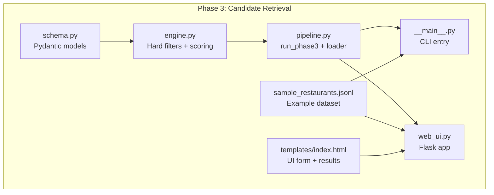
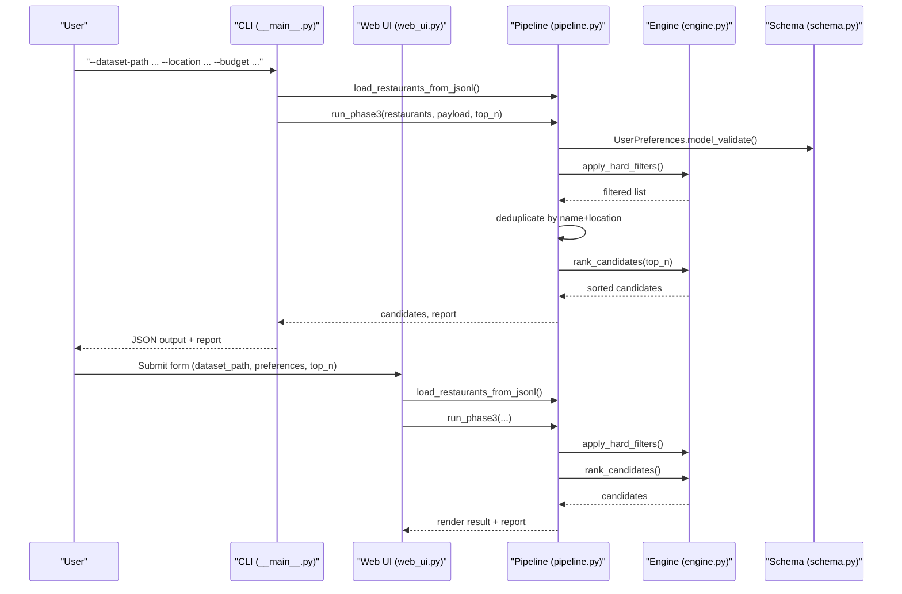
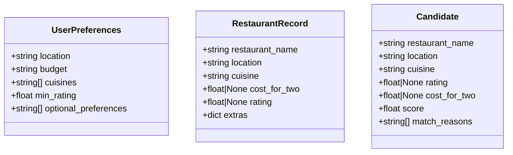
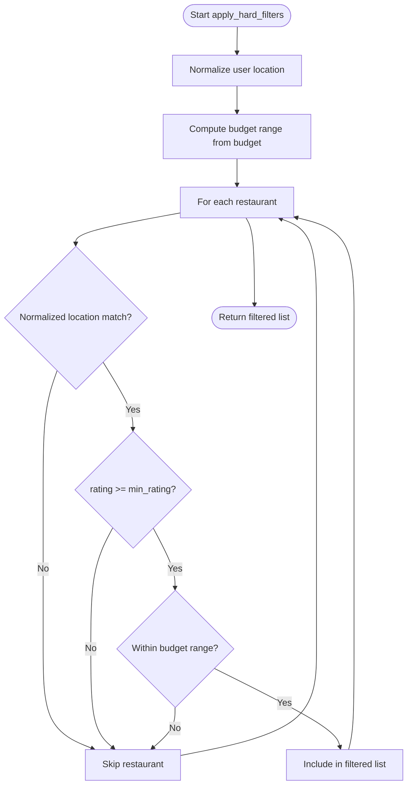
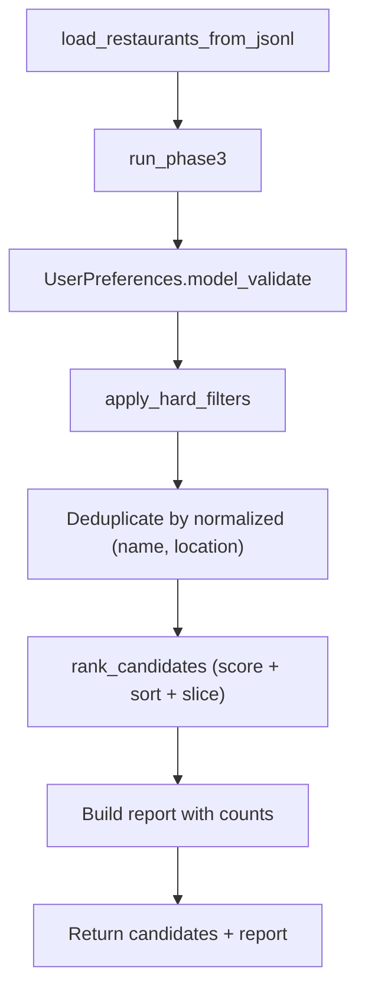
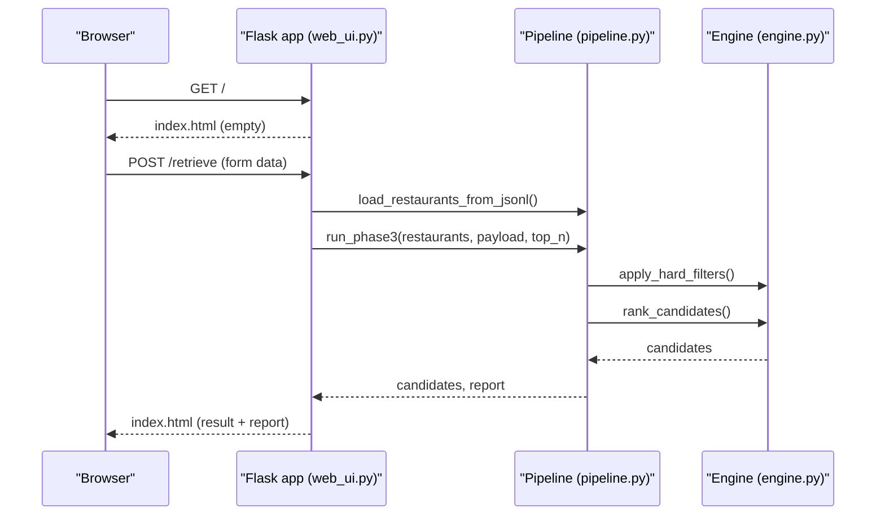
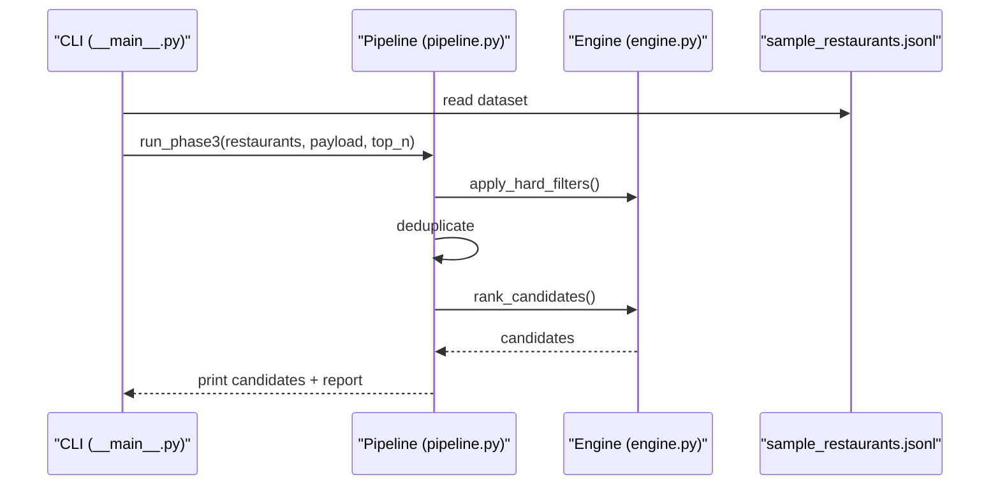
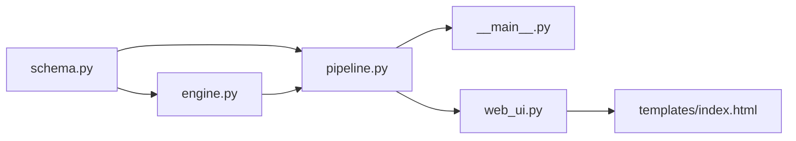

# Pipeline Coordination

<cite>
**Referenced Files in This Document**
- [pipeline.py](file://Zomato/architecture/phase_3_candidate_retrieval/pipeline.py)
- [engine.py](file://Zomato/architecture/phase_3_candidate_retrieval/engine.py)
- [schema.py](file://Zomato/architecture/phase_3_candidate_retrieval/schema.py)
- [__main__.py](file://Zomato/architecture/phase_3_candidate_retrieval/__main__.py)
- [web_ui.py](file://Zomato/architecture/phase_3_candidate_retrieval/web_ui.py)
- [index.html](file://Zomato/architecture/phase_3_candidate_retrieval/templates/index.html)
- [sample_restaurants.jsonl](file://Zomato/architecture/phase_3_candidate_retrieval/sample_restaurants.jsonl)
- [phase-wise-architecture.md](file://Zomato/architecture/phase-wise-architecture.md)
- [detailed-edge-cases.md](file://Zomato/edge-cases/detailed-edge-cases.md)
- [requirements.txt](file://Zomato/architecture/phase_3_candidate_retrieval/requirements.txt)
</cite>

## Table of Contents
1. [Introduction](#introduction)
2. [Project Structure](#project-structure)
3. [Core Components](#core-components)
4. [Architecture Overview](#architecture-overview)
5. [Detailed Component Analysis](#detailed-component-analysis)
6. [Dependency Analysis](#dependency-analysis)
7. [Performance Considerations](#performance-considerations)
8. [Troubleshooting Guide](#troubleshooting-guide)
9. [Conclusion](#conclusion)
10. [Appendices](#appendices)

## Introduction
This document explains the Phase 3 pipeline coordination component responsible for transforming cleaned restaurant data and user preferences into a shortlisted set of candidates ready for downstream LLM ranking. It covers the sequential orchestration of filtering, scoring, and ranking, along with configuration options, data flow, error handling, integration points with upstream and downstream phases, and operational observability.

## Project Structure
Phase 3 is organized around a small, focused set of modules:
- Schema definitions for typed data contracts
- A filtering and scoring engine
- A pipeline runner that sequences operations
- A CLI entry point and a minimal web UI
- Templates for the web interface

**Diagram sources**
- [schema.py:1-35](file://Zomato/architecture/phase_3_candidate_retrieval/schema.py#L1-L35)
- [engine.py:1-118](file://Zomato/architecture/phase_3_candidate_retrieval/engine.py#L1-L118)
- [pipeline.py:1-51](file://Zomato/architecture/phase_3_candidate_retrieval/pipeline.py#L1-L51)
- [__main__.py:1-51](file://Zomato/architecture/phase_3_candidate_retrieval/__main__.py#L1-L51)
- [web_ui.py:1-58](file://Zomato/architecture/phase_3_candidate_retrieval/web_ui.py#L1-L58)
- [index.html:1-94](file://Zomato/architecture/phase_3_candidate_retrieval/templates/index.html#L1-L94)
- [sample_restaurants.jsonl:1-5](file://Zomato/architecture/phase_3_candidate_retrieval/sample_restaurants.jsonl#L1-L5)

**Section sources**
- [phase-wise-architecture.md:30-41](file://Zomato/architecture/phase-wise-architecture.md#L30-L41)
- [requirements.txt:1-3](file://Zomato/architecture/phase_3_candidate_retrieval/requirements.txt#L1-L3)

## Core Components
- Schema layer defines typed models for user preferences, restaurant records, and scored candidates.
- Engine implements hard filtering and soft scoring with budget proximity, cuisine similarity, optional preference matching, and rating boosts.
- Pipeline orchestrates loading, filtering, deduplication, scoring, and ranking into a final report and ranked candidate list.
- CLI and web UI expose the pipeline to users and demonstrate end-to-end execution.

Key responsibilities:
- Data ingestion: load a newline-delimited JSON dataset of restaurants.
- Filtering: strict constraints on location, budget, and rating.
- Scoring: weighted soft matching and proximity scoring.
- Ranking: top-N selection by score.
- Reporting: pipeline statistics for observability.

**Section sources**
- [schema.py:10-35](file://Zomato/architecture/phase_3_candidate_retrieval/schema.py#L10-L35)
- [engine.py:23-118](file://Zomato/architecture/phase_3_candidate_retrieval/engine.py#L23-L118)
- [pipeline.py:13-51](file://Zomato/architecture/phase_3_candidate_retrieval/pipeline.py#L13-L51)

## Architecture Overview
The Phase 3 pipeline follows a linear, stage-gated flow:
1. Load cleaned restaurant dataset from JSONL
2. Validate and parse user preferences
3. Apply hard filters (location, budget, rating)
4. Deduplicate candidates by normalized restaurant identity
5. Score remaining candidates using soft matching heuristics
6. Sort by score and select top-N
7. Produce a report summarizing counts across stages

**Diagram sources**
- [__main__.py:11-51](file://Zomato/architecture/phase_3_candidate_retrieval/__main__.py#L11-L51)
- [web_ui.py:19-58](file://Zomato/architecture/phase_3_candidate_retrieval/web_ui.py#L19-L58)
- [pipeline.py:24-51](file://Zomato/architecture/phase_3_candidate_retrieval/pipeline.py#L24-L51)
- [engine.py:23-118](file://Zomato/architecture/phase_3_candidate_retrieval/engine.py#L23-L118)
- [schema.py:10-35](file://Zomato/architecture/phase_3_candidate_retrieval/schema.py#L10-L35)

## Detailed Component Analysis

### Data Models and Validation
- UserPreferences: enforces presence of location and budget, validates budget enum, constrains min_rating to [0, 5], and collects optional preferences.
- RestaurantRecord: enforces non-empty restaurant_name, location, and cuisine; cost_for_two and rating are optional with bounds.
- Candidate: carries scored attributes and match reasons for explainability.

**Diagram sources**
- [schema.py:10-35](file://Zomato/architecture/phase_3_candidate_retrieval/schema.py#L10-L35)

**Section sources**
- [schema.py:10-35](file://Zomato/architecture/phase_3_candidate_retrieval/schema.py#L10-L35)

### Filtering Engine
Hard filters:
- Location: normalized substring match between user location and restaurant location.
- Budget: converts budget tier to min/max cost range and filters by cost_for_two.
- Rating: excludes restaurants below min_rating.

Soft scoring:
- Cuisine similarity: Jaccard-like score based on normalized cuisine sets.
- Optional preferences: count of user-provided keywords found in normalized restaurant name, cuisine, or extras.
- Rating boost: linearly scaled contribution.
- Budget proximity: proximity to preferred budget center/wideness, scaled to a score.

Ranking:
- Scores each candidate, sorts descending, and slices to top-N.

**Diagram sources**
- [engine.py:23-46](file://Zomato/architecture/phase_3_candidate_retrieval/engine.py#L23-L46)

**Section sources**
- [engine.py:23-118](file://Zomato/architecture/phase_3_candidate_retrieval/engine.py#L23-L118)

### Pipeline Orchestration
- load_restaurants_from_jsonl: reads a JSONL file and validates each record against RestaurantRecord schema.
- run_phase3: validates preferences, applies hard filters, deduplicates by normalized restaurant identity, scores and ranks, and produces a report with counts across stages.

Deduplication strategy:
- Builds a composite key from normalized restaurant_name and location to avoid duplicates.

Reporting:
- Tracks input size, after hard filters, after deduplication, and final output size.

**Diagram sources**
- [pipeline.py:13-51](file://Zomato/architecture/phase_3_candidate_retrieval/pipeline.py#L13-L51)
- [engine.py:23-118](file://Zomato/architecture/phase_3_candidate_retrieval/engine.py#L23-L118)

**Section sources**
- [pipeline.py:13-51](file://Zomato/architecture/phase_3_candidate_retrieval/pipeline.py#L13-L51)

### CLI and Web UI Integration
- CLI: parses arguments, loads dataset, constructs preferences payload, invokes run_phase3, prints JSON candidates and report.
- Web UI: renders a form, posts to /retrieve, calls run_phase3, renders results and report, and surfaces exceptions.

**Diagram sources**
- [web_ui.py:19-58](file://Zomato/architecture/phase_3_candidate_retrieval/web_ui.py#L19-L58)
- [index.html:24-51](file://Zomato/architecture/phase_3_candidate_retrieval/templates/index.html#L24-L51)

**Section sources**
- [__main__.py:11-51](file://Zomato/architecture/phase_3_candidate_retrieval/__main__.py#L11-L51)
- [web_ui.py:19-58](file://Zomato/architecture/phase_3_candidate_retrieval/web_ui.py#L19-L58)
- [index.html:24-94](file://Zomato/architecture/phase_3_candidate_retrieval/templates/index.html#L24-L94)

### Example Execution Walkthrough
- Input: a cleaned dataset path and user preferences (location, budget, cuisines, min_rating, optional_preferences, top_n).
- Processing: hard filters reduce candidates, deduplication ensures uniqueness, scoring weights preferences, ranking selects top-N.
- Output: ranked candidates with scores and reasons, plus a pipeline report.

**Diagram sources**
- [__main__.py:32-46](file://Zomato/architecture/phase_3_candidate_retrieval/__main__.py#L32-L46)
- [sample_restaurants.jsonl:1-5](file://Zomato/architecture/phase_3_candidate_retrieval/sample_restaurants.jsonl#L1-L5)

**Section sources**
- [__main__.py:32-46](file://Zomato/architecture/phase_3_candidate_retrieval/__main__.py#L32-L46)
- [sample_restaurants.jsonl:1-5](file://Zomato/architecture/phase_3_candidate_retrieval/sample_restaurants.jsonl#L1-L5)

## Dependency Analysis
- schema.py is consumed by engine.py and pipeline.py for validation and modeling.
- engine.py is invoked by pipeline.py for filtering and ranking.
- pipeline.py is invoked by CLI and web UI entry points.
- web UI depends on Flask and templates for rendering.

**Diagram sources**
- [schema.py:10-35](file://Zomato/architecture/phase_3_candidate_retrieval/schema.py#L10-L35)
- [engine.py:1-118](file://Zomato/architecture/phase_3_candidate_retrieval/engine.py#L1-L118)
- [pipeline.py:1-51](file://Zomato/architecture/phase_3_candidate_retrieval/pipeline.py#L1-L51)
- [__main__.py:1-51](file://Zomato/architecture/phase_3_candidate_retrieval/__main__.py#L1-L51)
- [web_ui.py:1-58](file://Zomato/architecture/phase_3_candidate_retrieval/web_ui.py#L1-L58)
- [index.html:1-94](file://Zomato/architecture/phase_3_candidate_retrieval/templates/index.html#L1-L94)

**Section sources**
- [requirements.txt:1-3](file://Zomato/architecture/phase_3_candidate_retrieval/requirements.txt#L1-L3)

## Performance Considerations
- Filtering complexity: O(N) over the restaurant dataset for hard filters.
- Deduplication: O(N) with hashing on normalized keys.
- Scoring and sorting: O(N) scoring plus O(N log N) sorting; top-N slicing reduces effective work.
- I/O: JSONL parsing is linear in dataset size.
- Recommendations:
  - Prefer smaller top_n to reduce downstream LLM token usage.
  - Normalize and tokenize early to minimize repeated work.
  - Consider indexing strategies if datasets grow large.

[No sources needed since this section provides general guidance]

## Troubleshooting Guide
Common issues and mitigations:
- Empty results after hard filters: adjust min_rating, expand location, or broaden budget.
- Duplicates in output: rely on built-in deduplication; ensure normalized keys are consistent.
- Invalid preferences: schema validation will fail; ensure budget enum and rating bounds are respected.
- Web UI errors: exceptions are caught and rendered; check server logs for stack traces.
- CLI argument errors: missing dataset path raises an explicit error.

Operational tips:
- Use the pipeline report to diagnose throughput across stages.
- Validate dataset format and field presence before running.
- For large datasets, monitor memory usage during scoring and sorting.

**Section sources**
- [detailed-edge-cases.md:71-95](file://Zomato/edge-cases/detailed-edge-cases.md#L71-L95)
- [web_ui.py:43-49](file://Zomato/architecture/phase_3_candidate_retrieval/web_ui.py#L43-L49)
- [__main__.py:29-31](file://Zomato/architecture/phase_3_candidate_retrieval/__main__.py#L29-L31)

## Conclusion
Phase 3’s pipeline provides a clear, typed, and observable pathway from cleaned data and user preferences to a curated shortlist. Its modular design enables straightforward testing, debugging, and extension. The reporting and validation layers support continuous improvement and operational reliability.

[No sources needed since this section summarizes without analyzing specific files]

## Appendices

### Pipeline Configuration Options
- CLI flags:
  - --web: start the web UI
  - --dataset-path: path to cleaned JSONL dataset
  - --location: required; normalized for matching
  - --budget: low|medium|high
  - --cuisines: comma-separated preferred cuisines
  - --min-rating: numeric 0–5
  - --optional-preferences: comma-separated keywords
  - --top-n: integer number of candidates to return

- Web UI form fields mirror CLI flags.

**Section sources**
- [__main__.py:12-21](file://Zomato/architecture/phase_3_candidate_retrieval/__main__.py#L12-L21)
- [index.html:24-51](file://Zomato/architecture/phase_3_candidate_retrieval/templates/index.html#L24-L51)

### Integration Points with Other Phases
- Upstream (Phase 1): cleaned dataset JSONL produced by preprocessing.
- Downstream (Phase 4): ranked candidates prepared for LLM reasoning.
- End-to-end flow: dataset → preprocessing → preferences → candidate filtering → LLM ranking → response delivery.

**Section sources**
- [phase-wise-architecture.md:30-54](file://Zomato/architecture/phase-wise-architecture.md#L30-L54)

### Data Flow Between Stages
- Stage 1 (Preprocessing): cleans and normalizes raw data into RestaurantRecord instances.
- Stage 2 (Preferences): validates and normalizes user input into UserPreferences.
- Stage 3 (Filtering/Scoring/Ranking): applies hard filters, deduplicates, scores, and ranks to produce Candidate list and report.

**Section sources**
- [phase-wise-architecture.md:30-41](file://Zomato/architecture/phase-wise-architecture.md#L30-L41)

### Error Handling Mechanisms
- Schema validation failures: raised during model construction.
- Web UI exception handling: catches errors and renders stack traces.
- CLI argument validation: explicit checks for required arguments.
- Edge-case mitigations: documented in detailed-edge-cases.

**Section sources**
- [schema.py:10-35](file://Zomato/architecture/phase_3_candidate_retrieval/schema.py#L10-L35)
- [web_ui.py:43-49](file://Zomato/architecture/phase_3_candidate_retrieval/web_ui.py#L43-L49)
- [__main__.py:29-31](file://Zomato/architecture/phase_3_candidate_retrieval/__main__.py#L29-L31)
- [detailed-edge-cases.md:71-95](file://Zomato/edge-cases/detailed-edge-cases.md#L71-L95)

### Performance Monitoring, Logging, and Debugging
- Pipeline report: provides counts across stages for quick diagnostics.
- Web UI: displays results and error stack traces for interactive debugging.
- CLI: prints structured JSON for automated monitoring and testing.
- Recommendations: instrument scoring and ranking steps if extending the pipeline.

**Section sources**
- [pipeline.py:43-50](file://Zomato/architecture/phase_3_candidate_retrieval/pipeline.py#L43-L50)
- [web_ui.py:34-49](file://Zomato/architecture/phase_3_candidate_retrieval/web_ui.py#L34-L49)
- [__main__.py:43-46](file://Zomato/architecture/phase_3_candidate_retrieval/__main__.py#L43-L46)