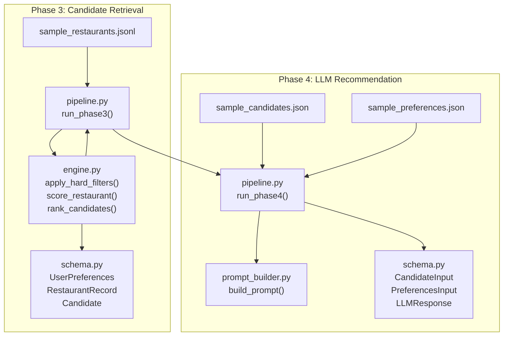
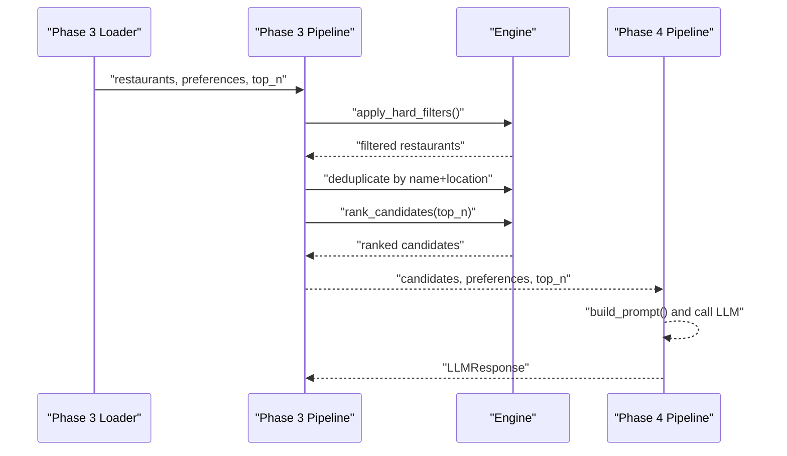
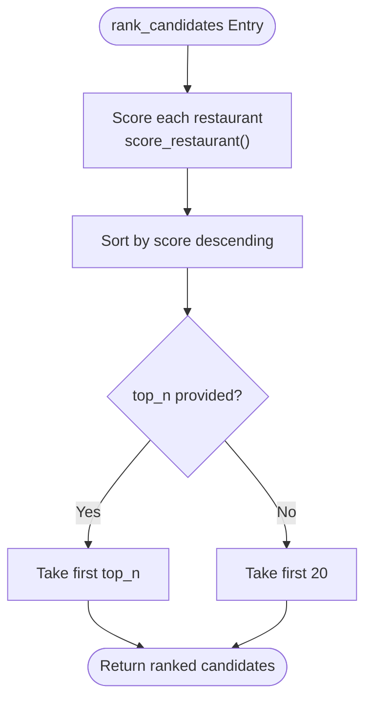
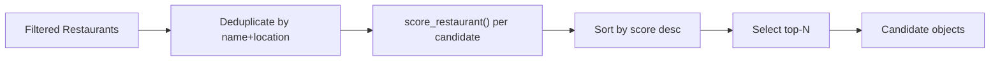
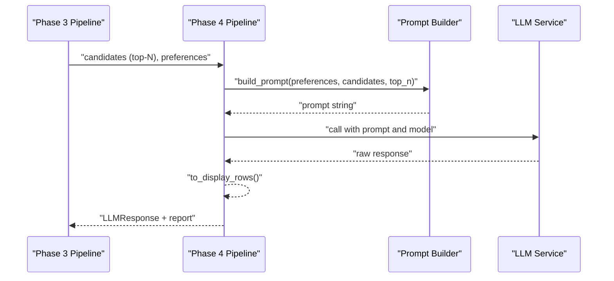
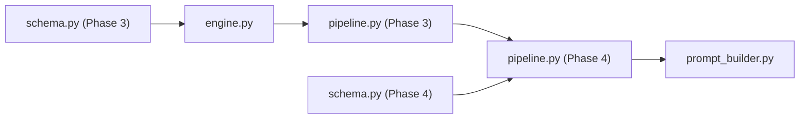

# Ranking System

<cite>
**Referenced Files in This Document**
- [engine.py](file://architecture/phase_3_candidate_retrieval/engine.py)
- [pipeline.py](file://architecture/phase_3_candidate_retrieval/pipeline.py)
- [schema.py](file://architecture/phase_3_candidate_retrieval/schema.py)
- [__main__.py](file://architecture/phase_3_candidate_retrieval/__main__.py)
- [web_ui.py](file://architecture/phase_3_candidate_retrieval/web_ui.py)
- [prompt_builder.py](file://architecture/phase_4_llm_recommendation/prompt_builder.py)
- [pipeline.py](file://architecture/phase_4_llm_recommendation/pipeline.py)
- [schema.py](file://architecture/phase_4_llm_recommendation/schema.py)
- [__main__.py](file://architecture/phase_4_llm_recommendation/__main__.py)
- [sample_candidates.json](file://architecture/phase_4_llm_recommendation/sample_candidates.json)
- [sample_preferences.json](file://architecture/phase_4_llm_recommendation/sample_preferences.json)
- [sample_restaurants.jsonl](file://architecture/phase_3_candidate_retrieval/sample_restaurants.jsonl)
</cite>

## Table of Contents
1. [Introduction](#introduction)
2. [Project Structure](#project-structure)
3. [Core Components](#core-components)
4. [Architecture Overview](#architecture-overview)
5. [Detailed Component Analysis](#detailed-component-analysis)
6. [Dependency Analysis](#dependency-analysis)
7. [Performance Considerations](#performance-considerations)
8. [Troubleshooting Guide](#troubleshooting-guide)
9. [Conclusion](#conclusion)
10. [Appendices](#appendices)

## Introduction
This document explains the candidate ranking system used in Phase 3 of the Zomato pipeline. It focuses on the rank_candidates function, detailing how restaurants are scored, sorted, and truncated to top-N candidates. It also documents ranking parameters, default selection limits, tie handling, and the integration with the LLM recommendation phase. Practical examples illustrate transformations from filtered restaurants to ranked candidates and demonstrate different ranking scenarios. Finally, it covers performance implications and optimization strategies for large candidate sets and explains how ranked candidates influence downstream processing.

## Project Structure
The ranking system spans two phases:
- Phase 3: Candidate Retrieval and Filtering, where restaurants are filtered and scored to produce a ranked shortlist.
- Phase 4: LLM Recommendation, where the ranked candidates are presented to an LLM to generate recommendations.

Key files:
- Phase 3 engine and pipeline define filtering, scoring, and ranking.
- Phase 4 pipeline and prompt builder integrate ranked candidates into LLM prompts.
- Schemas define the data structures used across phases.

**Diagram sources**
- [pipeline.py:24-50](file://architecture/phase_3_candidate_retrieval/pipeline.py#L24-L50)
- [engine.py:23-117](file://architecture/phase_3_candidate_retrieval/engine.py#L23-L117)
- [schema.py:10-35](file://architecture/phase_3_candidate_retrieval/schema.py#L10-L35)
- [sample_restaurants.jsonl:1-5](file://architecture/phase_3_candidate_retrieval/sample_restaurants.jsonl#L1-L5)
- [pipeline.py:29-46](file://architecture/phase_4_llm_recommendation/pipeline.py#L29-L46)
- [prompt_builder.py:10-44](file://architecture/phase_4_llm_recommendation/prompt_builder.py#L10-L44)
- [schema.py:8-38](file://architecture/phase_4_llm_recommendation/schema.py#L8-L38)
- [sample_candidates.json:1-21](file://architecture/phase_4_llm_recommendation/sample_candidates.json#L1-L21)
- [sample_preferences.json:1-8](file://architecture/phase_4_llm_recommendation/sample_preferences.json#L1-L8)

**Section sources**
- [pipeline.py:1-51](file://architecture/phase_3_candidate_retrieval/pipeline.py#L1-L51)
- [engine.py:1-118](file://architecture/phase_3_candidate_retrieval/engine.py#L1-L118)
- [schema.py:1-35](file://architecture/phase_3_candidate_retrieval/schema.py#L1-L35)
- [pipeline.py:1-47](file://architecture/phase_4_llm_recommendation/pipeline.py#L1-L47)
- [prompt_builder.py:1-45](file://architecture/phase_4_llm_recommendation/prompt_builder.py#L1-L45)
- [schema.py:1-38](file://architecture/phase_4_llm_recommendation/schema.py#L1-L38)

## Core Components
- Filtering and scoring engine:
  - apply_hard_filters removes restaurants that do not meet location/rating/budget criteria.
  - score_restaurant computes a composite score based on cuisine overlap, optional matches, rating, and budget proximity.
  - rank_candidates produces a descending-sorted list of candidates and selects top-N.
- Phase 3 pipeline:
  - Orchestrates loading, filtering, deduplication, ranking, and reporting.
- Phase 4 pipeline:
  - Builds a structured prompt embedding top-N candidates and user preferences for the LLM.
  - Returns validated recommendations and a formatted display preview.

Key data structures:
- UserPreferences: location, budget, cuisines, min_rating, optional_preferences.
- RestaurantRecord: restaurant metadata and extras.
- Candidate: scored candidate with match reasons.
- CandidateInput and PreferencesInput: LLM input schema.
- LLMResponse: validated recommendation payload.

**Section sources**
- [engine.py:23-117](file://architecture/phase_3_candidate_retrieval/engine.py#L23-L117)
- [pipeline.py:24-50](file://architecture/phase_3_candidate_retrieval/pipeline.py#L24-L50)
- [schema.py:10-35](file://architecture/phase_3_candidate_retrieval/schema.py#L10-L35)
- [pipeline.py:29-46](file://architecture/phase_4_llm_recommendation/pipeline.py#L29-L46)
- [schema.py:8-38](file://architecture/phase_4_llm_recommendation/schema.py#L8-L38)

## Architecture Overview
The ranking system follows a deterministic, batch-oriented flow:
- Load cleaned restaurant records.
- Apply hard filters based on location, rating, and budget range.
- Remove duplicates by restaurant name and location.
- Score each candidate and sort by score descending.
- Truncate to top-N candidates.
- Pass candidates to LLM recommendation with explicit top-N limit.

**Diagram sources**
- [pipeline.py:24-50](file://architecture/phase_3_candidate_retrieval/pipeline.py#L24-L50)
- [engine.py:23-117](file://architecture/phase_3_candidate_retrieval/engine.py#L23-L117)
- [pipeline.py:29-46](file://architecture/phase_4_llm_recommendation/pipeline.py#L29-L46)
- [prompt_builder.py:10-44](file://architecture/phase_4_llm_recommendation/prompt_builder.py#L10-L44)

## Detailed Component Analysis

### rank_candidates Implementation
The rank_candidates function performs three steps:
1. Score each restaurant via score_restaurant.
2. Sort candidates by score in descending order.
3. Return the first top_n candidates.

Scoring factors and weights:
- Cuisine similarity: proportional overlap against desired cuisines, up to 40 points.
- Optional preferences: partial matches in name/cuisine/extras, up to 20 points.
- Rating boost: scaled rating contribution, up to 40 points.
- Budget proximity: proximity to preferred cost center, up to 20 points.

Sorting and truncation:
- Sorting uses a single numeric score key in descending order.
- Top-N selection slices the sorted list to the requested size.

Tie handling:
- Ties are broken by insertion order in the current implementation because Python’s sort is stable. If strict determinism is required, augment the sort key with a secondary unique identifier.

Default selection limit:
- The default top_n is 20 within the Phase 3 pipeline.

Integration with downstream processing:
- The Phase 4 pipeline receives the pre-ranked candidates and uses the same top_n value to constrain the LLM’s attention to the most relevant subset.

**Diagram sources**
- [engine.py:110-117](file://architecture/phase_3_candidate_retrieval/engine.py#L110-L117)
- [engine.py:53-107](file://architecture/phase_3_candidate_retrieval/engine.py#L53-L107)

**Section sources**
- [engine.py:110-117](file://architecture/phase_3_candidate_retrieval/engine.py#L110-L117)
- [engine.py:53-107](file://architecture/phase_3_candidate_retrieval/engine.py#L53-L107)
- [pipeline.py:27-41](file://architecture/phase_3_candidate_retrieval/pipeline.py#L27-L41)

### Ranking Parameters and Defaults
- UserPreferences fields:
  - location: required, non-empty.
  - budget: constrained to low | medium | high.
  - cuisines: list of strings.
  - min_rating: bounded 0.0–5.0.
  - optional_preferences: list of strings.
- Default top_n in Phase 3: 20.
- Default top_n in Phase 4: 5.

These parameters directly influence filtering and scoring:
- Location and budget shape the initial candidate pool.
- min_rating ensures quality cutoffs.
- optional_preferences enhance scores for relevant keywords.
- top_n controls both Phase 3 truncation and Phase 4 prompt scope.

**Section sources**
- [schema.py:10-16](file://architecture/phase_3_candidate_retrieval/schema.py#L10-L16)
- [pipeline.py:27-28](file://architecture/phase_3_candidate_retrieval/pipeline.py#L27-L28)
- [pipeline.py:32-33](file://architecture/phase_4_llm_recommendation/pipeline.py#L32-L33)

### Transformation Example: Filtered to Ranked Candidates
- Input: A set of RestaurantRecord entries loaded from a JSONL file.
- After hard filters: restaurants meeting location/rating/budget criteria.
- After deduplication: unique restaurants by name and location.
- After ranking: Candidate objects with computed scores and reasons, sorted by score descending, truncated to top-N.

Example scenario:
- Preferences specify Bangalore, medium budget, Italian/Chinese, min_rating 4.0, optional “quick-service”.
- Two candidates are produced with scores and match reasons indicating cuisine and budget fit.

**Diagram sources**
- [pipeline.py:32-41](file://architecture/phase_3_candidate_retrieval/pipeline.py#L32-L41)
- [engine.py:53-107](file://architecture/phase_3_candidate_retrieval/engine.py#L53-L107)
- [engine.py:110-117](file://architecture/phase_3_candidate_retrieval/engine.py#L110-L117)

**Section sources**
- [sample_restaurants.jsonl:1-5](file://architecture/phase_3_candidate_retrieval/sample_restaurants.jsonl#L1-L5)
- [sample_candidates.json:1-21](file://architecture/phase_4_llm_recommendation/sample_candidates.json#L1-L21)
- [sample_preferences.json:1-8](file://architecture/phase_4_llm_recommendation/sample_preferences.json#L1-L8)

### Integration with LLM Recommendation
- The Phase 4 pipeline builds a prompt embedding:
  - User preferences.
  - Candidate list limited to top-N candidates.
- The LLM returns a structured response containing a summary and a list of recommendations with rank, explanation, and attributes.
- The response is validated against a schema and converted to display rows for preview.

**Diagram sources**
- [pipeline.py:29-46](file://architecture/phase_4_llm_recommendation/pipeline.py#L29-L46)
- [prompt_builder.py:10-44](file://architecture/phase_4_llm_recommendation/prompt_builder.py#L10-L44)
- [schema.py:26-38](file://architecture/phase_4_llm_recommendation/schema.py#L26-L38)

**Section sources**
- [pipeline.py:29-46](file://architecture/phase_4_llm_recommendation/pipeline.py#L29-L46)
- [prompt_builder.py:10-44](file://architecture/phase_4_llm_recommendation/prompt_builder.py#L10-L44)
- [schema.py:26-38](file://architecture/phase_4_llm_recommendation/schema.py#L26-L38)

## Dependency Analysis
- Phase 3 depends on:
  - engine.py for filtering, scoring, and ranking.
  - schema.py for typed data models.
  - CLI and web UI entry points for invocation.
- Phase 4 depends on:
  - CandidateInput and PreferencesInput schemas.
  - prompt_builder.py to construct the LLM prompt.
  - pipeline.py to orchestrate the call and formatting.

**Diagram sources**
- [schema.py:10-35](file://architecture/phase_3_candidate_retrieval/schema.py#L10-L35)
- [engine.py:23-117](file://architecture/phase_3_candidate_retrieval/engine.py#L23-L117)
- [pipeline.py:24-50](file://architecture/phase_3_candidate_retrieval/pipeline.py#L24-L50)
- [schema.py:8-38](file://architecture/phase_4_llm_recommendation/schema.py#L8-L38)
- [pipeline.py:29-46](file://architecture/phase_4_llm_recommendation/pipeline.py#L29-L46)
- [prompt_builder.py:10-44](file://architecture/phase_4_llm_recommendation/prompt_builder.py#L10-L44)

**Section sources**
- [engine.py:1-118](file://architecture/phase_3_candidate_retrieval/engine.py#L1-L118)
- [pipeline.py:1-51](file://architecture/phase_3_candidate_retrieval/pipeline.py#L1-L51)
- [schema.py:1-35](file://architecture/phase_3_candidate_retrieval/schema.py#L1-L35)
- [pipeline.py:1-47](file://architecture/phase_4_llm_recommendation/pipeline.py#L1-L47)
- [schema.py:1-38](file://architecture/phase_4_llm_recommendation/schema.py#L1-L38)

## Performance Considerations
Current implementation characteristics:
- Scoring complexity: O(M) per restaurant, where M is the number of restaurants.
- Sorting complexity: O(M log M) using Python’s Timsort.
- Truncation: O(N) slice to top-N.
- Overall: O(M log M) for ranking.

Performance implications for large candidate sets:
- Sorting dominates runtime for large M.
- Memory overhead is proportional to the number of candidates before slicing.

Optimization strategies:
- Early pruning: Introduce a pre-filter pass to reduce M before scoring.
- Heap-based top-N: Replace full sort with a heap of size N to achieve O(M log N) time and reduced memory footprint.
- Parallelization: Vectorize scoring computations (e.g., using libraries designed for numerical workloads) to speed up arithmetic-heavy steps.
- Streaming top-N: If data is too large to fit in memory, process in chunks and merge top-N results incrementally.

[No sources needed since this section provides general guidance]

## Troubleshooting Guide
Common issues and remedies:
- Empty or insufficient candidates:
  - Verify preferences (location, budget, min_rating) are not overly restrictive.
  - Confirm dataset contains records matching the specified location and cuisines.
- Unexpected ordering or ties:
  - Review score components and confirm normalization and rounding behavior.
  - Understand that ties preserve insertion order due to stable sort; consider adding a secondary key if deterministic ordering is required.
- Incorrect top-N:
  - Ensure top_n is passed consistently across Phase 3 and Phase 4.
  - Validate that the LLM prompt reflects the intended top-N limit.
- Data validation errors:
  - Confirm JSON inputs conform to expected schemas (e.g., CandidateInput, PreferencesInput).
  - Use provided loaders to validate and parse inputs.

**Section sources**
- [schema.py:10-35](file://architecture/phase_3_candidate_retrieval/schema.py#L10-L35)
- [schema.py:8-38](file://architecture/phase_4_llm_recommendation/schema.py#L8-L38)
- [pipeline.py:24-50](file://architecture/phase_3_candidate_retrieval/pipeline.py#L24-L50)
- [pipeline.py:29-46](file://architecture/phase_4_llm_recommendation/pipeline.py#L29-L46)

## Conclusion
The ranking system in Phase 3 applies a clear, interpretable scoring mechanism and deterministic top-N selection. It integrates seamlessly with Phase 4, where the LLM consumes the ranked candidates to produce human-readable recommendations. While the current implementation is efficient and maintainable, further optimizations such as heap-based top-N and vectorized scoring can improve performance for very large datasets. Consistent parameterization across phases ensures predictable behavior and reliable downstream outputs.

[No sources needed since this section summarizes without analyzing specific files]

## Appendices

### Example Workflows and Outputs
- Phase 3 CLI/web UI:
  - Loads a dataset, applies preferences, and prints top candidates with scores and reasons.
- Phase 4 CLI/web UI:
  - Loads candidates and preferences, builds a prompt, calls the LLM, and prints recommendations with a summary and preview.

**Section sources**
- [__main__.py:11-50](file://architecture/phase_3_candidate_retrieval/__main__.py#L11-L50)
- [web_ui.py:14-49](file://architecture/phase_3_candidate_retrieval/web_ui.py#L14-L49)
- [__main__.py:11-40](file://architecture/phase_4_llm_recommendation/__main__.py#L11-L40)