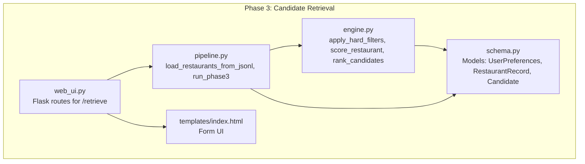
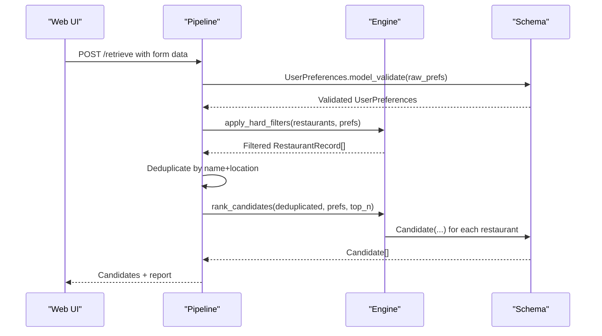
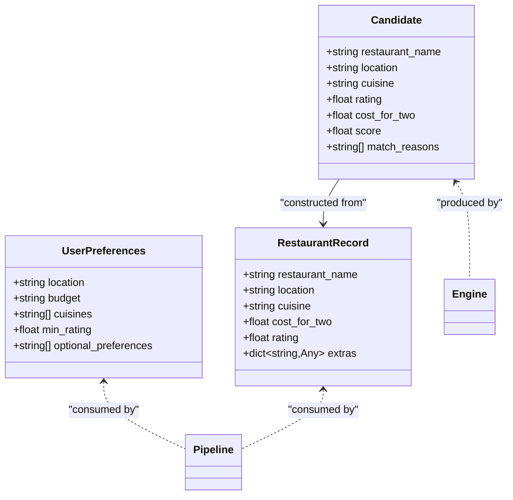
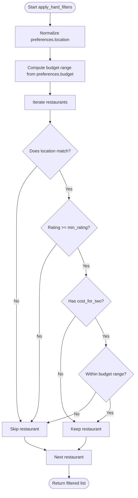
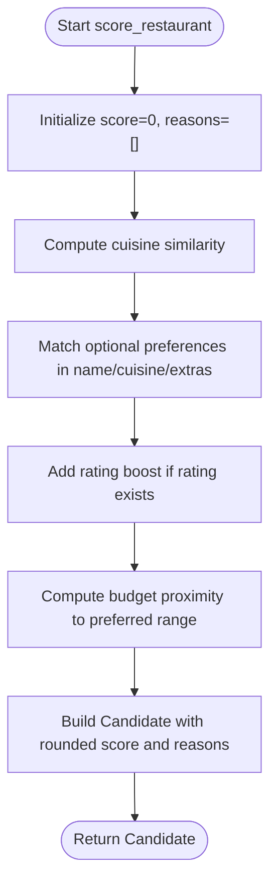
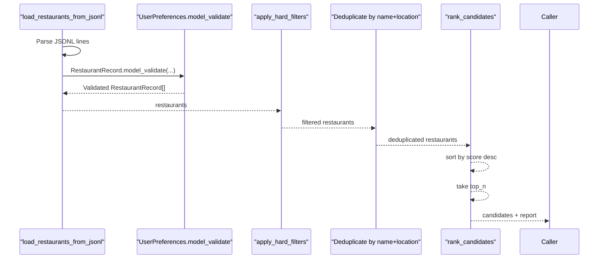
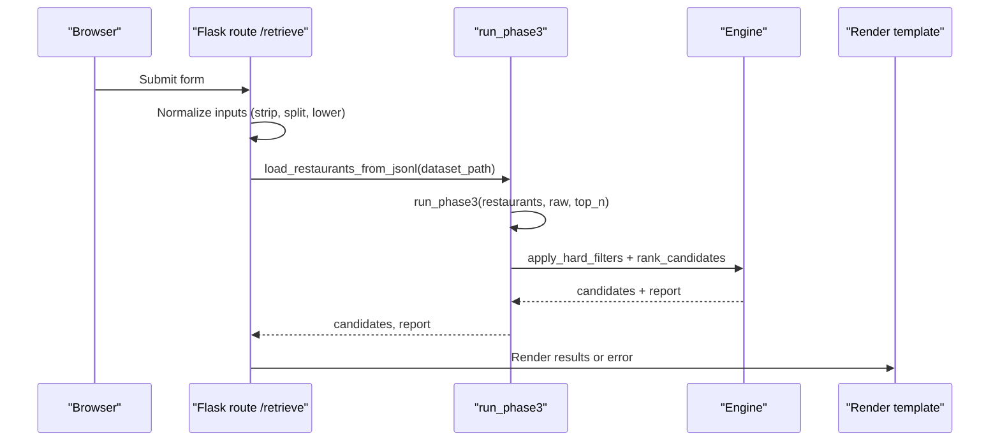
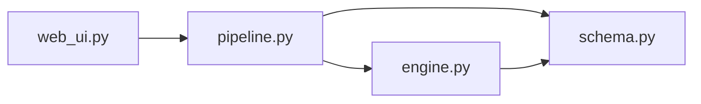

# Schema Validation

<cite>
**Referenced Files in This Document**
- [schema.py](file://Zomato/architecture/phase_3_candidate_retrieval/schema.py)
- [engine.py](file://Zomato/architecture/phase_3_candidate_retrieval/engine.py)
- [pipeline.py](file://Zomato/architecture/phase_3_candidate_retrieval/pipeline.py)
- [web_ui.py](file://Zomato/architecture/phase_3_candidate_retrieval/web_ui.py)
- [sample_restaurants.jsonl](file://Zomato/architecture/phase_3_candidate_retrieval/sample_restaurants.jsonl)
- [candidates.json](file://Zomato/architecture/phase_3_candidate_retrieval/candidates.json)
- [index.html](file://Zomato/architecture/phase_3_candidate_retrieval/templates/index.html)
- [phase-wise-architecture.md](file://Zomato/architecture/phase-wise-architecture.md)
</cite>

## Table of Contents
1. [Introduction](#introduction)
2. [Project Structure](#project-structure)
3. [Core Components](#core-components)
4. [Architecture Overview](#architecture-overview)
5. [Detailed Component Analysis](#detailed-component-analysis)
6. [Dependency Analysis](#dependency-analysis)
7. [Performance Considerations](#performance-considerations)
8. [Troubleshooting Guide](#troubleshooting-guide)
9. [Conclusion](#conclusion)

## Introduction
This document explains the schema validation for the candidate retrieval phase. It details the Candidate, RestaurantRecord, and UserPreferences models, including field definitions, data types, validation rules, and constraints. It also describes how validation ensures data integrity during filtering and scoring, the relationships between schemas, and how the validation integrates with the filtering and scoring algorithms. Practical examples of valid and invalid data structures, error messages, and best practices are included to guide developers and users.

## Project Structure
The candidate retrieval phase is implemented in a focused set of modules:
- Schema definitions for typed models
- A filtering and scoring engine
- A pipeline that orchestrates loading, validation, filtering, deduplication, and ranking
- A minimal web UI for interactive testing

**Diagram sources**
- [schema.py:1-35](file://Zomato/architecture/phase_3_candidate_retrieval/schema.py#L1-L35)
- [engine.py:1-118](file://Zomato/architecture/phase_3_candidate_retrieval/engine.py#L1-L118)
- [pipeline.py:1-51](file://Zomato/architecture/phase_3_candidate_retrieval/pipeline.py#L1-L51)
- [web_ui.py:1-58](file://Zomato/architecture/phase_3_candidate_retrieval/web_ui.py#L1-L58)
- [index.html:1-94](file://Zomato/architecture/phase_3_candidate_retrieval/templates/index.html#L1-L94)

**Section sources**
- [phase-wise-architecture.md:30-41](file://Zomato/architecture/phase-wise-architecture.md#L30-L41)

## Core Components
This section documents the three models used in the candidate retrieval phase and their validation rules.

### UserPreferences
- Purpose: Captures user intent for filtering and scoring.
- Fields and validation:
  - location: Required string; minimum length 1.
  - budget: Required string; must match one of the allowed values.
  - cuisines: List of strings; defaults to empty list.
  - min_rating: Float; constrained to a closed interval.
  - optional_preferences: List of strings; defaults to empty list.

Validation behavior:
- Pydantic enforces required fields and type checks.
- Pattern and numeric bounds are enforced at model construction/validation time.

Constraints:
- Budget must be one of the allowed values; otherwise, validation fails.
- Rating must fall within the allowed range; otherwise, validation fails.
- Location must be non-empty; otherwise, validation fails.

Best practices:
- Always pass validated UserPreferences to the pipeline.
- Ensure cuisines and optional_preferences are comma-separated strings when collected from forms.

**Section sources**
- [schema.py:10-16](file://Zomato/architecture/phase_3_candidate_retrieval/schema.py#L10-L16)

### RestaurantRecord
- Purpose: Represents a normalized restaurant entry loaded from the cleaned dataset.
- Fields and validation:
  - restaurant_name: Required string; minimum length 1.
  - location: Required string; minimum length 1.
  - cuisine: Required string; minimum length 1.
  - cost_for_two: Optional float; if present, must be non-negative.
  - rating: Optional float; if present, must be within the allowed range.
  - extras: Arbitrary dictionary; defaults to empty dict.

Validation behavior:
- Pydantic enforces required fields and type checks.
- Numeric bounds are enforced for optional numeric fields.

Constraints:
- Names and locations must be non-empty; otherwise, validation fails.
- Ratings must be within the allowed range; otherwise, validation fails.
- Costs must be non-negative; otherwise, validation fails.

Best practices:
- Ensure the dataset contains normalized values for location and cuisine.
- Treat None values as missing data; the engine handles them gracefully.

**Section sources**
- [schema.py:18-25](file://Zomato/architecture/phase_3_candidate_retrieval/schema.py#L18-L25)

### Candidate
- Purpose: Represents a scored candidate restaurant ready for presentation and ranking.
- Fields and validation:
  - restaurant_name: String (inherited from RestaurantRecord).
  - location: String (inherited from RestaurantRecord).
  - cuisine: String (inherited from RestaurantRecord).
  - rating: Optional float (inherited from RestaurantRecord).
  - cost_for_two: Optional float (inherited from RestaurantRecord).
  - score: Required float; rounded to two decimal places by the engine.
  - match_reasons: List of strings; defaults to empty list.

Validation behavior:
- Pydantic enforces required fields and type checks.
- The engine sets score and match_reasons; the model definition allows these fields.

Constraints:
- Score is computed by the engine and rounded; downstream consumers should treat it as a floating-point number.

Best practices:
- Use Candidate for final output; it encapsulates the scoring results and reasons.

**Section sources**
- [schema.py:27-35](file://Zomato/architecture/phase_3_candidate_retrieval/schema.py#L27-L35)

## Architecture Overview
The candidate retrieval pipeline validates inputs, applies hard filters, deduplicates candidates, scores them, and returns top-N results. The schema models ensure data integrity at each stage.

**Diagram sources**
- [web_ui.py:19-49](file://Zomato/architecture/phase_3_candidate_retrieval/web_ui.py#L19-L49)
- [pipeline.py:24-50](file://Zomato/architecture/phase_3_candidate_retrieval/pipeline.py#L24-L50)
- [engine.py:23-117](file://Zomato/architecture/phase_3_candidate_retrieval/engine.py#L23-L117)
- [schema.py:10-35](file://Zomato/architecture/phase_3_candidate_retrieval/schema.py#L10-L35)

## Detailed Component Analysis

### Schema Definitions and Validation Flow
- Model construction triggers Pydantic validation immediately.
- Validation errors occur during model creation or during explicit validation calls.
- The pipeline uses model_validate to convert dictionaries into typed models, surfacing validation errors early.

**Diagram sources**
- [schema.py:10-35](file://Zomato/architecture/phase_3_candidate_retrieval/schema.py#L10-L35)

**Section sources**
- [schema.py:10-35](file://Zomato/architecture/phase_3_candidate_retrieval/schema.py#L10-L35)
- [pipeline.py:24-50](file://Zomato/architecture/phase_3_candidate_retrieval/pipeline.py#L24-L50)

### Hard Filtering Logic and Validation
Hard filtering applies strict constraints derived from UserPreferences to RestaurantRecord entries. The engine normalizes strings and compares budgets against predefined ranges.

**Diagram sources**
- [engine.py:23-46](file://Zomato/architecture/phase_3_candidate_retrieval/engine.py#L23-L46)

Key validation points:
- Location normalization ensures partial matches and case-insensitive comparisons.
- Budget range computation depends on the allowed budget values.
- Rating comparison uses the preference’s minimum rating; missing ratings are treated as zero.

**Section sources**
- [engine.py:10-46](file://Zomato/architecture/phase_3_candidate_retrieval/engine.py#L10-L46)

### Scoring and Ranking Logic
Scoring combines multiple factors into a single score and records reasons for matches. The engine computes:
- Cuisine similarity (normalized intersection over union)
- Optional preference keyword matches
- Rating boost
- Budget proximity to preferred range

**Diagram sources**
- [engine.py:53-107](file://Zomato/architecture/phase_3_candidate_retrieval/engine.py#L53-L107)

Validation implications:
- Missing numeric fields (rating, cost_for_two) are handled gracefully; the engine treats them as absent data.
- The Candidate model defines required fields; the engine populates them deterministically.

**Section sources**
- [engine.py:53-107](file://Zomato/architecture/phase_3_candidate_retrieval/engine.py#L53-L107)

### Pipeline Orchestration and Deduplication
The pipeline loads JSONL lines into RestaurantRecord instances, validates UserPreferences, applies hard filters, deduplicates candidates, and ranks the results.

**Diagram sources**
- [pipeline.py:13-50](file://Zomato/architecture/phase_3_candidate_retrieval/pipeline.py#L13-L50)
- [engine.py:23-117](file://Zomato/architecture/phase_3_candidate_retrieval/engine.py#L23-L117)

**Section sources**
- [pipeline.py:13-50](file://Zomato/architecture/phase_3_candidate_retrieval/pipeline.py#L13-L50)

### Web UI Integration and Input Normalization
The web UI collects user input, normalizes it, and forwards it to the pipeline. It also displays errors and results.

**Diagram sources**
- [web_ui.py:19-49](file://Zomato/architecture/phase_3_candidate_retrieval/web_ui.py#L19-L49)
- [index.html:24-51](file://Zomato/architecture/phase_3_candidate_retrieval/templates/index.html#L24-L51)

**Section sources**
- [web_ui.py:19-49](file://Zomato/architecture/phase_3_candidate_retrieval/web_ui.py#L19-L49)
- [index.html:24-51](file://Zomato/architecture/phase_3_candidate_retrieval/templates/index.html#L24-L51)

## Dependency Analysis
The following diagram shows how modules depend on each other and how schemas are used across the pipeline.

**Diagram sources**
- [web_ui.py:9-9](file://Zomato/architecture/phase_3_candidate_retrieval/web_ui.py#L9-L9)
- [pipeline.py:9-10](file://Zomato/architecture/phase_3_candidate_retrieval/pipeline.py#L9-L10)
- [engine.py:7-7](file://Zomato/architecture/phase_3_candidate_retrieval/engine.py#L7-L7)
- [schema.py:7-7](file://Zomato/architecture/phase_3_candidate_retrieval/schema.py#L7-L7)

**Section sources**
- [web_ui.py:9-9](file://Zomato/architecture/phase_3_candidate_retrieval/web_ui.py#L9-L9)
- [pipeline.py:9-10](file://Zomato/architecture/phase_3_candidate_retrieval/pipeline.py#L9-L10)
- [engine.py:7-7](file://Zomato/architecture/phase_3_candidate_retrieval/engine.py#L7-L7)

## Performance Considerations
- Filtering and scoring operate on lists of restaurants; performance scales linearly with dataset size.
- Deduplication uses a set keyed by normalized restaurant name and location to avoid redundant candidates.
- Scoring computes cuisine similarity and optional preference matches; keep the number of optional preferences reasonable to limit overhead.
- Budget proximity scoring uses arithmetic operations; the cost of computing proximity is negligible compared to iteration over restaurants.

[No sources needed since this section provides general guidance]

## Troubleshooting Guide
Common validation failures and their likely causes:

- UserPreferences validation errors:
  - Missing required fields: Ensure location and budget are provided.
  - Invalid budget value: Must be one of the allowed values; otherwise, validation fails.
  - Rating out of range: Ensure min_rating falls within the allowed bounds.
  - Empty location: Validation requires a non-empty string.

- RestaurantRecord validation errors:
  - Missing required fields: restaurant_name, location, cuisine must be present.
  - Empty strings: Names and locations must be non-empty.
  - Invalid numeric ranges: cost_for_two must be non-negative; rating must be within bounds.
  - Type mismatches: Ensure numeric fields are numbers and extras is a dictionary.

- Pipeline errors:
  - Dataset path issues: Verify the JSONL path is correct and readable.
  - Deduplication artifacts: If results seem missing, check that deduplication by name+location is intended.

- Web UI errors:
  - Form parsing: Ensure comma-separated inputs are correctly formatted.
  - Budget selection: Choose one of the allowed options.
  - Top-N limits: Ensure top_n is a positive integer.

Example datasets:
- Sample input for restaurants: [sample_restaurants.jsonl:1-5](file://Zomato/architecture/phase_3_candidate_retrieval/sample_restaurants.jsonl#L1-L5)
- Sample output candidates: [candidates.json:1-72](file://Zomato/architecture/phase_3_candidate_retrieval/candidates.json#L1-L72)

**Section sources**
- [schema.py:10-35](file://Zomato/architecture/phase_3_candidate_retrieval/schema.py#L10-L35)
- [pipeline.py:13-50](file://Zomato/architecture/phase_3_candidate_retrieval/pipeline.py#L13-L50)
- [engine.py:23-117](file://Zomato/architecture/phase_3_candidate_retrieval/engine.py#L23-L117)
- [web_ui.py:19-49](file://Zomato/architecture/phase_3_candidate_retrieval/web_ui.py#L19-L49)
- [sample_restaurants.jsonl:1-5](file://Zomato/architecture/phase_3_candidate_retrieval/sample_restaurants.jsonl#L1-L5)
- [candidates.json:1-72](file://Zomato/architecture/phase_3_candidate_retrieval/candidates.json#L1-L72)

## Conclusion
The candidate retrieval phase enforces strict schema validation through Pydantic models, ensuring data integrity across filtering and scoring. UserPreferences drives hard filtering and scoring weights, RestaurantRecord represents normalized input data, and Candidate encapsulates scored results. The pipeline orchestrates validation, filtering, deduplication, and ranking, while the web UI provides a straightforward interface for testing. Following the validation rules and best practices outlined here will help maintain robust and predictable behavior throughout the system.