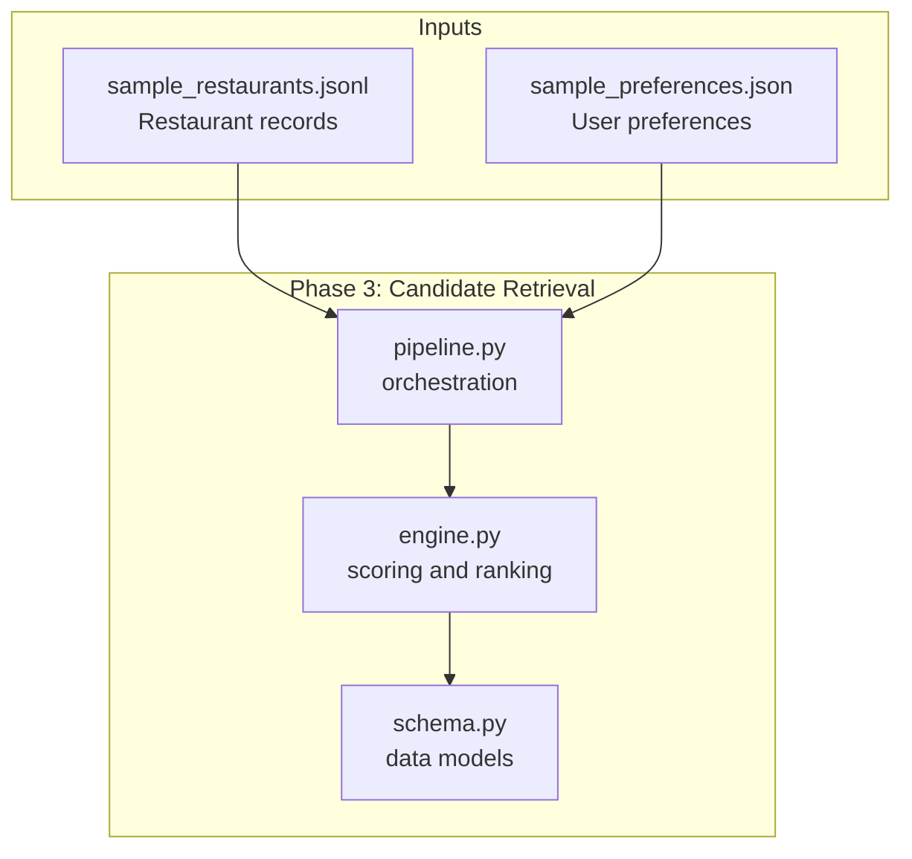
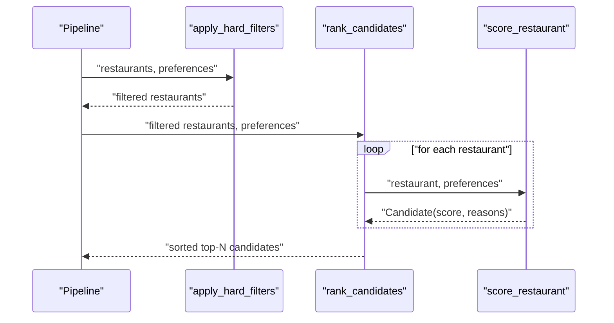
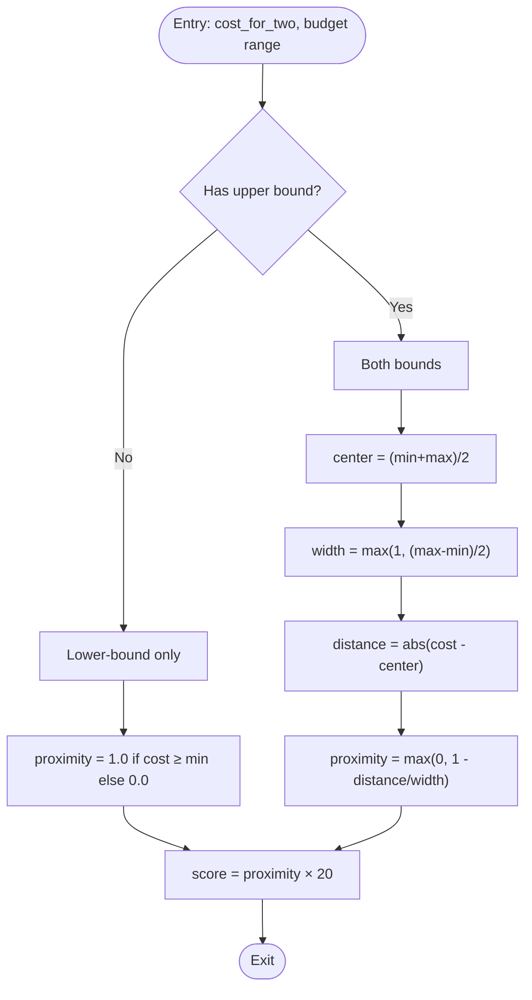
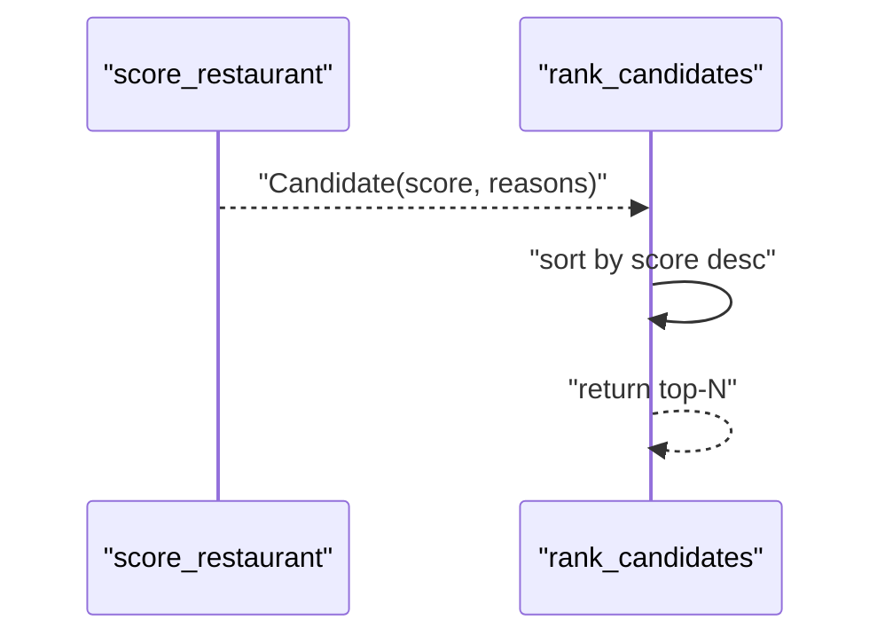
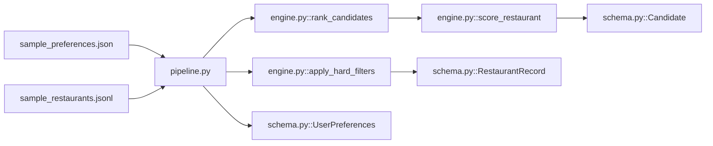

# Scoring Algorithms

<cite>
**Referenced Files in This Document**
- [engine.py](file://architecture/phase_3_candidate_retrieval/engine.py)
- [schema.py](file://architecture/phase_3_candidate_retrieval/schema.py)
- [pipeline.py](file://architecture/phase_3_candidate_retrieval/pipeline.py)
- [sample_preferences.json](file://architecture/phase_4_llm_recommendation/sample_preferences.json)
- [sample_restaurants.jsonl](file://architecture/phase_3_candidate_retrieval/sample_restaurants.jsonl)
</cite>

## Table of Contents
1. [Introduction](#introduction)
2. [Project Structure](#project-structure)
3. [Core Components](#core-components)
4. [Architecture Overview](#architecture-overview)
5. [Detailed Component Analysis](#detailed-component-analysis)
6. [Dependency Analysis](#dependency-analysis)
7. [Performance Considerations](#performance-considerations)
8. [Troubleshooting Guide](#troubleshooting-guide)
9. [Conclusion](#conclusion)
10. [Appendices](#appendices)

## Introduction
This document explains the restaurant scoring algorithms used in Phase 3 of the Zomato system. It focuses on the score_restaurant function, detailing how cuisine similarity, optional preference keyword matching, rating multipliers, and budget proximity scoring are computed. It also documents the mathematical formulations, weight assignments, normalization techniques, and aggregation logic that produce final rankings.

## Project Structure
The scoring logic resides in the candidate retrieval phase:
- Filtering and scoring engine: [engine.py](file://architecture/phase_3_candidate_retrieval/engine.py)
- Data models for preferences, restaurants, and scored candidates: [schema.py](file://architecture/phase_3_candidate_retrieval/schema.py)
- Pipeline orchestration that loads data, applies hard filters, deduplicates, ranks candidates: [pipeline.py](file://architecture/phase_3_candidate_retrieval/pipeline.py)
- Example preferences payload: [sample_preferences.json](file://architecture/phase_4_llm_recommendation/sample_preferences.json)
- Example restaurant dataset: [sample_restaurants.jsonl](file://architecture/phase_3_candidate_retrieval/sample_restaurants.jsonl)

**Diagram sources**
- [engine.py:1-118](file://architecture/phase_3_candidate_retrieval/engine.py#L1-L118)
- [schema.py:1-35](file://architecture/phase_3_candidate_retrieval/schema.py#L1-L35)
- [pipeline.py:1-51](file://architecture/phase_3_candidate_retrieval/pipeline.py#L1-L51)
- [sample_restaurants.jsonl:1-5](file://architecture/phase_3_candidate_retrieval/sample_restaurants.jsonl#L1-L5)
- [sample_preferences.json:1-8](file://architecture/phase_4_llm_recommendation/sample_preferences.json#L1-L8)

**Section sources**
- [engine.py:1-118](file://architecture/phase_3_candidate_retrieval/engine.py#L1-L118)
- [schema.py:1-35](file://architecture/phase_3_candidate_retrieval/schema.py#L1-L35)
- [pipeline.py:1-51](file://architecture/phase_3_candidate_retrieval/pipeline.py#L1-L51)
- [sample_restaurants.jsonl:1-5](file://architecture/phase_3_candidate_retrieval/sample_restaurants.jsonl#L1-L5)
- [sample_preferences.json:1-8](file://architecture/phase_4_llm_recommendation/sample_preferences.json#L1-L8)

## Core Components
- UserPreferences: validated user inputs including location, budget tier, cuisines, minimum rating, and optional preferences.
- RestaurantRecord: restaurant metadata including name, location, cuisine string, cost for two, rating, and extras.
- Candidate: scored result with attributes for display and reasoning.

Key scoring components in score_restaurant:
- Cuisine similarity via set intersection of normalized cuisines, scaled to up to 40 points.
- Optional preference keyword matching against normalized restaurant name, cuisine, and extras, capped at up to 20 points.
- Rating multiplier contributing up to 40 points.
- Budget proximity scoring based on a triangular proximity function around the preferred budget range center, scaled to up to 20 points.

Aggregation:
- Scores are summed and rounded to two decimals.
- Final ranking is produced by sorting candidates in descending order of score.

**Section sources**
- [schema.py:10-35](file://architecture/phase_3_candidate_retrieval/schema.py#L10-L35)
- [engine.py:53-107](file://architecture/phase_3_candidate_retrieval/engine.py#L53-L107)

## Architecture Overview
The scoring pipeline transforms raw restaurant records and validated user preferences into scored candidates, then ranks them.

**Diagram sources**
- [pipeline.py:24-50](file://architecture/phase_3_candidate_retrieval/pipeline.py#L24-L50)
- [engine.py:23-46](file://architecture/phase_3_candidate_retrieval/engine.py#L23-L46)
- [engine.py:110-117](file://architecture/phase_3_candidate_retrieval/engine.py#L110-L117)
- [engine.py:53-107](file://architecture/phase_3_candidate_retrieval/engine.py#L53-L107)

## Detailed Component Analysis

### Data Normalization and Budget Range
- Text normalization: strips, lowercases, and collapses whitespace uniformly across inputs.
- Budget range mapping:
  - Low: [0.0, 600.0]
  - Medium: [400.0, 1500.0]
  - High: [1000.0, +∞)

These ranges define the target interval for budget proximity scoring.

**Section sources**
- [engine.py:10-11](file://architecture/phase_3_candidate_retrieval/engine.py#L10-L11)
- [engine.py:14-20](file://architecture/phase_3_candidate_retrieval/engine.py#L14-L20)

### Cuisine Similarity Scoring
- Input cuisines are normalized and split into sets for both user preferences and restaurant record.
- Overlap is computed as the intersection of the two sets.
- Score contribution:
  - If user wants cuisines: similarity = (|wanted ∩ has| / max(|wanted|, 1)) × 40.0
  - Otherwise: no cuisine score is added.
- Match reasons include the list of overlapping cuisines when present.

Mathematical formulation:
- Score_cuisine = 40 × min(1, |Wanted ∩ Has| / |Wanted|)

Weight and normalization:
- Maximum contribution: 40 points
- Normalized by the number of desired cuisines to prevent bias toward larger wish lists.

**Section sources**
- [engine.py:57-65](file://architecture/phase_3_candidate_retrieval/engine.py#L57-L65)
- [engine.py:49-50](file://architecture/phase_3_candidate_retrieval/engine.py#L49-L50)

### Optional Preference Keyword Matching
- A concatenated text blob is formed from normalized restaurant name, cuisine, and extras.
- Optional preferences are matched as substrings against this blob.
- Score contribution:
  - Up to 8 points per matching optional preference, capped at 20 total.
- Match reasons include the list of matched keywords.

Mathematical formulation:
- Score_optional = min(20.0, 8.0 × count_of_matches)

Weight and normalization:
- Each hit contributes up to 8 points; the cap ensures diminishing returns beyond a small number of matches.

**Section sources**
- [engine.py:67-78](file://architecture/phase_3_candidate_retrieval/engine.py#L67-L78)

### Rating Multiplier
- If a rating exists, it contributes rating × 8.0 points.
- Upper bound: 5.0 × 8.0 = 40.0 points.

Mathematical formulation:
- Score_rating = rating × 8.0

Weight and normalization:
- Scales linearly with rating; maximum possible contribution is 40 points.

**Section sources**
- [engine.py:80-83](file://architecture/phase_3_candidate_retrieval/engine.py#L80-L83)

### Budget Proximity Scoring
- Compute target range [min_cost, max_cost] from the user’s budget tier.
- If cost_for_two is available:
  - Case 1: Only lower bound (high budget): proximity = 1.0 if cost_for_two ≥ min_cost else 0.0
  - Case 2: Both bounds: compute center = (min + max)/2 and width = max(1.0, (max - min)/2); proximity = max(0.0, 1.0 − distance/width)
  - Case 3: No bounds (undefined): proximity = 0.5
- Score contribution: proximity × 20.0
- Match reasons include “budget fit”.

Mathematical formulation:
- Center = (min_cost + max_cost) / 2
- Width = max(1.0, |max_cost − min_cost| / 2)
- Distance = |cost_for_two − center|
- Proximity = max(0.0, 1.0 − distance / width)
- Score_budget = 20 × proximity

Weight and normalization:
- Maximum contribution: 20 points
- Triangular proximity centered on the ideal budget midpoint; symmetric falloff outside the range.

**Diagram sources**
- [engine.py:85-97](file://architecture/phase_3_candidate_retrieval/engine.py#L85-L97)
- [engine.py:14-20](file://architecture/phase_3_candidate_retrieval/engine.py#L14-L20)

**Section sources**
- [engine.py:85-97](file://architecture/phase_3_candidate_retrieval/engine.py#L85-L97)

### Aggregation and Ranking
- Total score = sum of all components (cuisine, optional, rating, budget).
- Rounded to two decimal places.
- Candidates are sorted by score descending; top-N is returned.

**Diagram sources**
- [engine.py:99-107](file://architecture/phase_3_candidate_retrieval/engine.py#L99-L107)
- [engine.py:110-117](file://architecture/phase_3_candidate_retrieval/engine.py#L110-L117)

**Section sources**
- [engine.py:99-107](file://architecture/phase_3_candidate_retrieval/engine.py#L99-L107)
- [engine.py:110-117](file://architecture/phase_3_candidate_retrieval/engine.py#L110-L117)

### Step-by-Step Example
We demonstrate scoring for a restaurant using the sample preferences and a sample restaurant record.

Inputs:
- User preferences:
  - Location: Bangalore
  - Budget: medium
  - Cuisines: Italian, Chinese
  - Min rating: 4.0
  - Optional preferences: quick-service
- Restaurant record:
  - Name: Dragon Wok
  - Location: Bangalore
  - Cuisines: Chinese, Thai
  - Cost for two: 800
  - Rating: 4.2
  - Extras: tags include quick-service

Steps:
1. Hard filters:
   - Location match: “bangalore” appears in “bangalore” → pass
   - Min rating filter: 4.2 ≥ 4.0 → pass
   - Budget filter: 800 ∈ [400, 1500] → pass
   - Restaurant passes filters.

2. Score computation:
   - Normalize cuisines:
     - User: {“italian”, “chinese”}
     - Restaurant: {“chinese”, “thai”}
     - Overlap: {“chinese”}, |wanted| = 2
     - Cuisine score: min(40, (1/2) × 40) = 20.0
   - Optional preferences:
     - Blob: normalized concatenation of name, cuisine, extras
     - Matches: “quick-service” found → 1 hit
     - Optional score: min(20, 8 × 1) = 8.0
   - Rating:
     - Rating score: 4.2 × 8 = 33.6
   - Budget proximity:
     - Budget range: [400, 1500]
     - Center: (400 + 1500)/2 = 950
     - Width: max(1, (1500 − 400)/2) = 550
     - Distance: |800 − 950| = 150
     - Proximity: max(0, 1 − 150/550) ≈ 0.727
     - Budget score: 0.727 × 20 ≈ 14.54
   - Total score: 20.0 + 8.0 + 33.6 + 14.54 = 76.14

3. Ranking:
   - Candidate is included with score 76.14 and reasons indicating matches for cuisine, optional preference, rating, and budget fit.

**Section sources**
- [sample_preferences.json:1-8](file://architecture/phase_4_llm_recommendation/sample_preferences.json#L1-L8)
- [sample_restaurants.jsonl:2-2](file://architecture/phase_3_candidate_retrieval/sample_restaurants.jsonl#L2-L2)
- [engine.py:53-107](file://architecture/phase_3_candidate_retrieval/engine.py#L53-L107)

## Dependency Analysis
The scoring engine depends on validated data models and the pipeline orchestrates loading, filtering, deduplication, and ranking.

**Diagram sources**
- [pipeline.py:24-50](file://architecture/phase_3_candidate_retrieval/pipeline.py#L24-L50)
- [engine.py:23-46](file://architecture/phase_3_candidate_retrieval/engine.py#L23-L46)
- [engine.py:110-117](file://architecture/phase_3_candidate_retrieval/engine.py#L110-L117)
- [engine.py:53-107](file://architecture/phase_3_candidate_retrieval/engine.py#L53-L107)
- [schema.py:10-35](file://architecture/phase_3_candidate_retrieval/schema.py#L10-L35)

**Section sources**
- [pipeline.py:1-51](file://architecture/phase_3_candidate_retrieval/pipeline.py#L1-L51)
- [engine.py:1-118](file://architecture/phase_3_candidate_retrieval/engine.py#L1-L118)
- [schema.py:1-35](file://architecture/phase_3_candidate_retrieval/schema.py#L1-L35)

## Performance Considerations
- Normalization overhead: Each string is normalized once per component; keep normalization efficient by avoiding repeated splits.
- Set operations: Intersection and membership checks are O(n + m) for cuisines; acceptable given typical lists are short.
- Budget proximity: Constant-time arithmetic; negligible overhead.
- Sorting: O(n log n) for ranking; consider top-N heaps if n is very large.
- Memory: Candidate objects are lightweight; storage scales linearly with input size.

## Troubleshooting Guide
Common issues and resolutions:
- Cuisine score missing:
  - Cause: User did not specify any cuisines; no similarity score is applied.
  - Resolution: Ensure preferences.cuisines is populated when cuisine matching is desired.
- Unexpected zero optional preference score:
  - Cause: Keywords not found in normalized blob (name, cuisine, extras).
  - Resolution: Verify optional preferences spelling and ensure extras contain searchable terms.
- Rating contribution unexpectedly low:
  - Cause: Rating below 5.0 scales proportionally; maximum is 40.
  - Resolution: Adjust expectations; higher ratings yield proportionally greater boosts.
- Budget proximity not affecting score:
  - Cause: cost_for_two is None; budget component skipped.
  - Resolution: Provide cost_for_two for budget-aware scoring.
- Hard filters excluding candidates:
  - Cause: Location mismatch, rating below threshold, or cost outside budget range.
  - Resolution: Relax filters or adjust preferences accordingly.

**Section sources**
- [engine.py:57-65](file://architecture/phase_3_candidate_retrieval/engine.py#L57-L65)
- [engine.py:67-78](file://architecture/phase_3_candidate_retrieval/engine.py#L67-L78)
- [engine.py:80-83](file://architecture/phase_3_candidate_retrieval/engine.py#L80-L83)
- [engine.py:85-97](file://architecture/phase_3_candidate_retrieval/engine.py#L85-L97)
- [engine.py:23-46](file://architecture/phase_3_candidate_retrieval/engine.py#L23-L46)

## Conclusion
The scoring algorithm combines multiple complementary signals—cuisine overlap, keyword matches, rating quality, and budget proximity—into a single normalized score. Each component is weighted to ensure balanced influence, with explicit caps to prevent dominance by any single factor. The resulting ranked list provides interpretable recommendations with clear match reasons.

## Appendices

### Mathematical Summary of Components
- Cuisine similarity: 40 × min(1, |Wanted ∩ Has| / |Wanted|)
- Optional preferences: min(20, 8 × count)
- Rating: rating × 8
- Budget proximity: 20 × max(0, 1 − |cost − center| / width) where center = (min + max)/2 and width = max(1, |max − min|/2)

Final score is the sum of the above components, rounded to two decimals.

**Section sources**
- [engine.py:57-65](file://architecture/phase_3_candidate_retrieval/engine.py#L57-L65)
- [engine.py:67-78](file://architecture/phase_3_candidate_retrieval/engine.py#L67-L78)
- [engine.py:80-83](file://architecture/phase_3_candidate_retrieval/engine.py#L80-L83)
- [engine.py:85-97](file://architecture/phase_3_candidate_retrieval/engine.py#L85-L97)