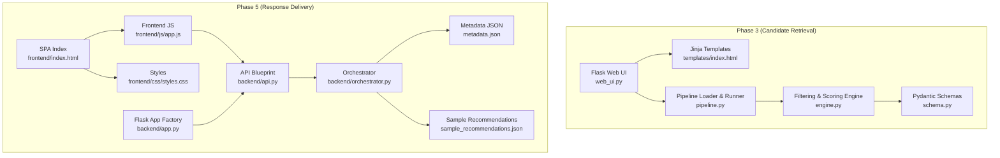
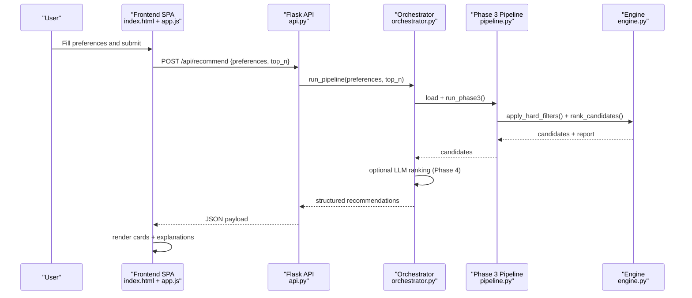
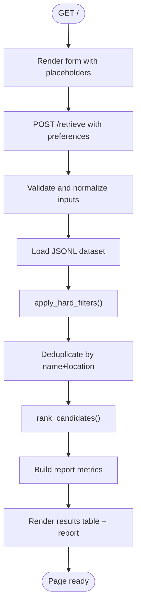
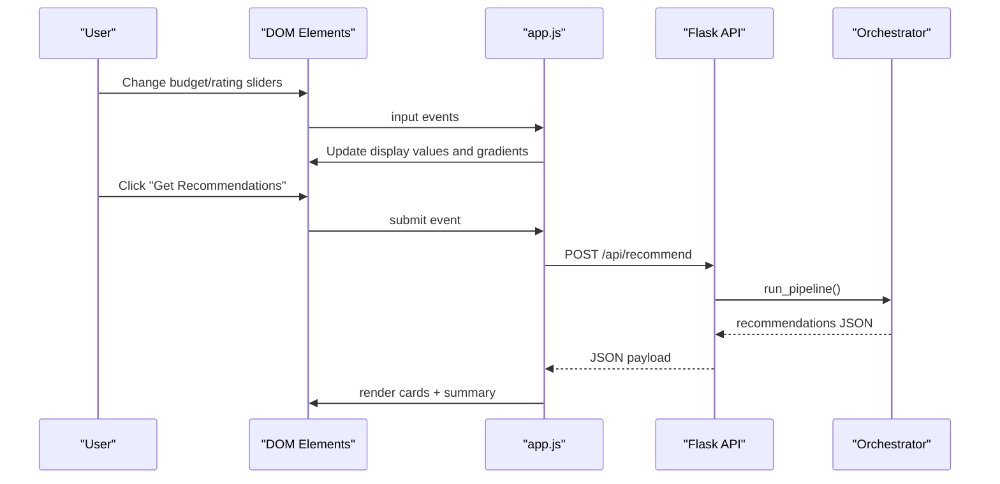
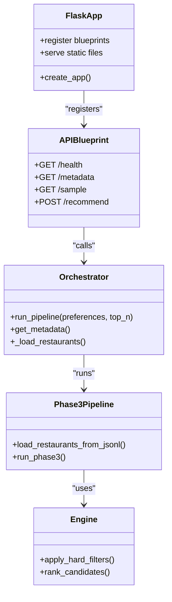
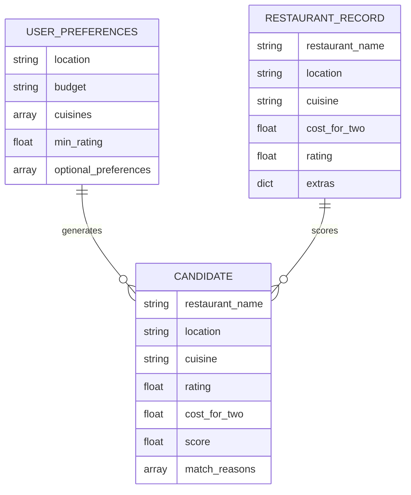
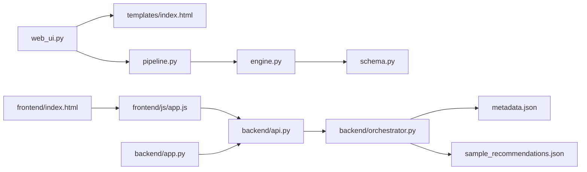

# Web UI Integration

<cite>
**Referenced Files in This Document**
- [web_ui.py](file://Zomato/architecture/phase_3_candidate_retrieval/web_ui.py)
- [index.html](file://Zomato/architecture/phase_3_candidate_retrieval/templates/index.html)
- [engine.py](file://Zomato/architecture/phase_3_candidate_retrieval/engine.py)
- [pipeline.py](file://Zomato/architecture/phase_3_candidate_retrieval/pipeline.py)
- [schema.py](file://Zomato/architecture/phase_3_candidate_retrieval/schema.py)
- [index.html](file://Zomato/architecture/phase_5_response_delivery/frontend/index.html)
- [app.js](file://Zomato/architecture/phase_5_response_delivery/frontend/js/app.js)
- [styles.css](file://Zomato/architecture/phase_5_response_delivery/frontend/css/styles.css)
- [app.py](file://Zomato/architecture/phase_5_response_delivery/backend/app.py)
- [api.py](file://Zomato/architecture/phase_5_response_delivery/backend/api.py)
- [orchestrator.py](file://Zomato/architecture/phase_5_response_delivery/backend/orchestrator.py)
- [metadata.json](file://Zomato/architecture/phase_5_response_delivery/metadata.json)
- [sample_recommendations.json](file://Zomato/architecture/phase_5_response_delivery/sample_recommendations.json)
- [problemstatement.md](file://Zomato/problemstatement.md)
</cite>

## Table of Contents
1. [Introduction](#introduction)
2. [Project Structure](#project-structure)
3. [Core Components](#core-components)
4. [Architecture Overview](#architecture-overview)
5. [Detailed Component Analysis](#detailed-component-analysis)
6. [Dependency Analysis](#dependency-analysis)
7. [Performance Considerations](#performance-considerations)
8. [Troubleshooting Guide](#troubleshooting-guide)
9. [Conclusion](#conclusion)
10. [Appendices](#appendices)

## Introduction
This document explains the web user interface integration for candidate retrieval and recommendation delivery in the Zomato AI-powered restaurant recommendation system. It focuses on the frontend components, user interaction patterns, and data visualization for filtered and ranked restaurant results. It details the form inputs for user preferences, real-time filtering feedback, and result display mechanisms. It also documents how the UI communicates with the backend filtering engine and LLM pipeline, template rendering, dynamic content updates, user experience considerations, accessibility features, and responsive design implementation.

## Project Structure
The web UI integration spans two distinct phases:
- Phase 3 (candidate retrieval): A lightweight Flask web UI that renders a form, applies hard filters and scoring, and displays top-N candidates.
- Phase 5 (response delivery): A modern SPA built with HTML, CSS, and JavaScript that integrates with a Flask backend via REST APIs, supports live metadata loading, and renders rich recommendation cards with explanations.

**Diagram sources**
- [web_ui.py:1-58](file://Zomato/architecture/phase_3_candidate_retrieval/web_ui.py#L1-L58)
- [index.html:1-94](file://Zomato/architecture/phase_3_candidate_retrieval/templates/index.html#L1-L94)
- [engine.py:1-118](file://Zomato/architecture/phase_3_candidate_retrieval/engine.py#L1-L118)
- [pipeline.py:1-51](file://Zomato/architecture/phase_3_candidate_retrieval/pipeline.py#L1-L51)
- [schema.py:1-35](file://Zomato/architecture/phase_3_candidate_retrieval/schema.py#L1-L35)
- [index.html:1-198](file://Zomato/architecture/phase_5_response_delivery/frontend/index.html#L1-L198)
- [app.js:1-278](file://Zomato/architecture/phase_5_response_delivery/frontend/js/app.js#L1-L278)
- [styles.css:1-602](file://Zomato/architecture/phase_5_response_delivery/frontend/css/styles.css#L1-L602)
- [app.py:1-41](file://Zomato/architecture/phase_5_response_delivery/backend/app.py#L1-L41)
- [api.py:1-84](file://Zomato/architecture/phase_5_response_delivery/backend/api.py#L1-L84)
- [orchestrator.py:1-292](file://Zomato/architecture/phase_5_response_delivery/backend/orchestrator.py#L1-L292)
- [metadata.json:1-196](file://Zomato/architecture/phase_5_response_delivery/metadata.json#L1-L196)
- [sample_recommendations.json:1-53](file://Zomato/architecture/phase_5_response_delivery/sample_recommendations.json#L1-L53)

**Section sources**
- [web_ui.py:1-58](file://Zomato/architecture/phase_3_candidate_retrieval/web_ui.py#L1-L58)
- [index.html:1-94](file://Zomato/architecture/phase_3_candidate_retrieval/templates/index.html#L1-L94)
- [index.html:1-198](file://Zomato/architecture/phase_5_response_delivery/frontend/index.html#L1-L198)
- [app.js:1-278](file://Zomato/architecture/phase_5_response_delivery/frontend/js/app.js#L1-L278)
- [styles.css:1-602](file://Zomato/architecture/phase_5_response_delivery/frontend/css/styles.css#L1-L602)
- [app.py:1-41](file://Zomato/architecture/phase_5_response_delivery/backend/app.py#L1-L41)
- [api.py:1-84](file://Zomato/architecture/phase_5_response_delivery/backend/api.py#L1-L84)
- [orchestrator.py:1-292](file://Zomato/architecture/phase_5_response_delivery/backend/orchestrator.py#L1-L292)
- [metadata.json:1-196](file://Zomato/architecture/phase_5_response_delivery/metadata.json#L1-L196)
- [sample_recommendations.json:1-53](file://Zomato/architecture/phase_5_response_delivery/sample_recommendations.json#L1-L53)

## Core Components
- Phase 3 Web UI: A minimal Flask app that renders a form, posts preferences, runs filtering/scoring, and renders tabular results.
- Phase 5 SPA: A modern single-page application that loads metadata, collects preferences, calls the backend API, and renders recommendation cards with explanations.
- Backend Orchestration: A Flask blueprint that exposes endpoints for health, metadata, sample data, and recommendations; orchestrates Phase 3 filtering and Phase 4 LLM ranking.

Key responsibilities:
- User preference capture and validation
- Real-time feedback (sliders, loading states, errors)
- Dynamic content rendering (tables vs. cards)
- Integration with external datasets and LLM services
- Accessibility and responsive design

**Section sources**
- [web_ui.py:14-49](file://Zomato/architecture/phase_3_candidate_retrieval/web_ui.py#L14-L49)
- [index.html:24-51](file://Zomato/architecture/phase_3_candidate_retrieval/templates/index.html#L24-L51)
- [app.js:61-74](file://Zomato/architecture/phase_5_response_delivery/frontend/js/app.js#L61-L74)
- [api.py:41-84](file://Zomato/architecture/phase_5_response_delivery/backend/api.py#L41-L84)
- [orchestrator.py:112-292](file://Zomato/architecture/phase_5_response_delivery/backend/orchestrator.py#L112-L292)

## Architecture Overview
The UI-backend integration follows a client-server model:
- Phase 3: Server-side rendering with Jinja templates.
- Phase 5: Client-side rendering with a SPA served by Flask static routes.

**Diagram sources**
- [index.html:45-137](file://Zomato/architecture/phase_5_response_delivery/frontend/index.html#L45-L137)
- [app.js:182-205](file://Zomato/architecture/phase_5_response_delivery/frontend/js/app.js#L182-L205)
- [api.py:41-84](file://Zomato/architecture/phase_5_response_delivery/backend/api.py#L41-L84)
- [orchestrator.py:112-292](file://Zomato/architecture/phase_5_response_delivery/backend/orchestrator.py#L112-L292)
- [pipeline.py:24-51](file://Zomato/architecture/phase_3_candidate_retrieval/pipeline.py#L24-L51)
- [engine.py:23-118](file://Zomato/architecture/phase_3_candidate_retrieval/engine.py#L23-L118)

## Detailed Component Analysis

### Phase 3 Web UI Integration
- Template-driven form with server-side submission and rendering.
- Inputs: dataset path, location, budget tier, cuisines, minimum rating, optional preferences, top-N.
- Post-processing: normalization, budget range mapping, deduplication by name+location, scoring, and ranking.
- Rendering: pipeline report and a results table.

**Diagram sources**
- [web_ui.py:19-49](file://Zomato/architecture/phase_3_candidate_retrieval/web_ui.py#L19-L49)
- [pipeline.py:24-51](file://Zomato/architecture/phase_3_candidate_retrieval/pipeline.py#L24-L51)
- [engine.py:23-118](file://Zomato/architecture/phase_3_candidate_retrieval/engine.py#L23-L118)
- [index.html:24-91](file://Zomato/architecture/phase_3_candidate_retrieval/templates/index.html#L24-L91)

**Section sources**
- [web_ui.py:14-49](file://Zomato/architecture/phase_3_candidate_retrieval/web_ui.py#L14-L49)
- [index.html:24-51](file://Zomato/architecture/phase_3_candidate_retrieval/templates/index.html#L24-L51)
- [pipeline.py:13-51](file://Zomato/architecture/phase_3_candidate_retrieval/pipeline.py#L13-L51)
- [engine.py:10-118](file://Zomato/architecture/phase_3_candidate_retrieval/engine.py#L10-L118)
- [schema.py:10-35](file://Zomato/architecture/phase_3_candidate_retrieval/schema.py#L10-L35)

### Phase 5 SPA Integration
- Single-page application with a preference panel and results panel.
- Real-time sliders update labels and visual gradients.
- Dynamic metadata loading for locations and cuisines.
- API-driven recommendation fetching with loading skeletons and error banners.
- Rich card rendering with star ratings, cost formatting, and explanations.

**Diagram sources**
- [index.html:45-137](file://Zomato/architecture/phase_5_response_delivery/frontend/index.html#L45-L137)
- [app.js:34-53](file://Zomato/architecture/phase_5_response_delivery/frontend/js/app.js#L34-L53)
- [app.js:225-236](file://Zomato/architecture/phase_5_response_delivery/frontend/js/app.js#L225-L236)
- [app.js:182-205](file://Zomato/architecture/phase_5_response_delivery/frontend/js/app.js#L182-L205)
- [api.py:41-84](file://Zomato/architecture/phase_5_response_delivery/backend/api.py#L41-L84)
- [orchestrator.py:112-292](file://Zomato/architecture/phase_5_response_delivery/backend/orchestrator.py#L112-L292)

**Section sources**
- [index.html:41-137](file://Zomato/architecture/phase_5_response_delivery/frontend/index.html#L41-L137)
- [app.js:34-53](file://Zomato/architecture/phase_5_response_delivery/frontend/js/app.js#L34-L53)
- [app.js:182-205](file://Zomato/architecture/phase_5_response_delivery/frontend/js/app.js#L182-L205)
- [app.js:208-222](file://Zomato/architecture/phase_5_response_delivery/frontend/js/app.js#L208-L222)
- [app.js:249-277](file://Zomato/architecture/phase_5_response_delivery/frontend/js/app.js#L249-L277)
- [styles.css:136-146](file://Zomato/architecture/phase_5_response_delivery/frontend/css/styles.css#L136-L146)
- [styles.css:448-452](file://Zomato/architecture/phase_5_response_delivery/frontend/css/styles.css#L448-L452)

### Backend Orchestration and API
- Health, metadata, sample endpoints for SPA support.
- Recommendation endpoint validates preferences, runs pipeline, and returns structured results.
- Orchestrator resolves datasets, runs Phase 3 filtering, optionally calls Phase 4 LLM, and falls back to sample data.

**Diagram sources**
- [app.py:14-41](file://Zomato/architecture/phase_5_response_delivery/backend/app.py#L14-L41)
- [api.py:18-84](file://Zomato/architecture/phase_5_response_delivery/backend/api.py#L18-L84)
- [orchestrator.py:112-292](file://Zomato/architecture/phase_5_response_delivery/backend/orchestrator.py#L112-L292)
- [pipeline.py:13-51](file://Zomato/architecture/phase_3_candidate_retrieval/pipeline.py#L13-L51)
- [engine.py:23-118](file://Zomato/architecture/phase_3_candidate_retrieval/engine.py#L23-L118)

**Section sources**
- [app.py:14-41](file://Zomato/architecture/phase_5_response_delivery/backend/app.py#L14-L41)
- [api.py:18-84](file://Zomato/architecture/phase_5_response_delivery/backend/api.py#L18-L84)
- [orchestrator.py:85-110](file://Zomato/architecture/phase_5_response_delivery/backend/orchestrator.py#L85-L110)
- [orchestrator.py:112-292](file://Zomato/architecture/phase_5_response_delivery/backend/orchestrator.py#L112-L292)

### Data Models and Validation
- Pydantic models define user preferences, restaurant records, and candidate outputs for Phase 3.
- Frontend expects recommendation payloads with rank, name, explanation, rating, cost, and cuisine.

**Diagram sources**
- [schema.py:10-35](file://Zomato/architecture/phase_3_candidate_retrieval/schema.py#L10-L35)
- [sample_recommendations.json:1-53](file://Zomato/architecture/phase_5_response_delivery/sample_recommendations.json#L1-L53)

**Section sources**
- [schema.py:10-35](file://Zomato/architecture/phase_3_candidate_retrieval/schema.py#L10-L35)
- [sample_recommendations.json:1-53](file://Zomato/architecture/phase_5_response_delivery/sample_recommendations.json#L1-L53)

## Dependency Analysis
- Phase 3 depends on:
  - Flask routing and Jinja templates
  - Phase 3 pipeline and engine
  - Pydantic schemas for validation
- Phase 5 depends on:
  - Flask app factory serving static assets
  - API blueprint for health, metadata, sample, and recommendations
  - Orchestrator for end-to-end pipeline execution
  - Metadata JSON and sample recommendations for fallbacks

**Diagram sources**
- [web_ui.py:1-11](file://Zomato/architecture/phase_3_candidate_retrieval/web_ui.py#L1-L11)
- [index.html:1-20](file://Zomato/architecture/phase_3_candidate_retrieval/templates/index.html#L1-L20)
- [pipeline.py:1-11](file://Zomato/architecture/phase_3_candidate_retrieval/pipeline.py#L1-L11)
- [engine.py:1-11](file://Zomato/architecture/phase_3_candidate_retrieval/engine.py#L1-L11)
- [schema.py:1-11](file://Zomato/architecture/phase_3_candidate_retrieval/schema.py#L1-L11)
- [index.html:1-12](file://Zomato/architecture/phase_5_response_delivery/frontend/index.html#L1-L12)
- [app.js:1-10](file://Zomato/architecture/phase_5_response_delivery/frontend/js/app.js#L1-L10)
- [api.py:1-13](file://Zomato/architecture/phase_5_response_delivery/backend/api.py#L1-L13)
- [app.py:1-20](file://Zomato/architecture/phase_5_response_delivery/backend/app.py#L1-L20)
- [orchestrator.py:1-17](file://Zomato/architecture/phase_5_response_delivery/backend/orchestrator.py#L1-L17)
- [metadata.json:1-10](file://Zomato/architecture/phase_5_response_delivery/metadata.json#L1-L10)
- [sample_recommendations.json:1-10](file://Zomato/architecture/phase_5_response_delivery/sample_recommendations.json#L1-L10)

**Section sources**
- [web_ui.py:1-11](file://Zomato/architecture/phase_3_candidate_retrieval/web_ui.py#L1-L11)
- [pipeline.py:1-11](file://Zomato/architecture/phase_3_candidate_retrieval/pipeline.py#L1-L11)
- [engine.py:1-11](file://Zomato/architecture/phase_3_candidate_retrieval/engine.py#L1-L11)
- [schema.py:1-11](file://Zomato/architecture/phase_3_candidate_retrieval/schema.py#L1-L11)
- [app.py:1-20](file://Zomato/architecture/phase_5_response_delivery/backend/app.py#L1-L20)
- [api.py:1-13](file://Zomato/architecture/phase_5_response_delivery/backend/api.py#L1-L13)
- [orchestrator.py:1-17](file://Zomato/architecture/phase_5_response_delivery/backend/orchestrator.py#L1-L17)
- [metadata.json:1-10](file://Zomato/architecture/phase_5_response_delivery/metadata.json#L1-L10)
- [sample_recommendations.json:1-10](file://Zomato/architecture/phase_5_response_delivery/sample_recommendations.json#L1-L10)

## Performance Considerations
- Phase 3:
  - Deduplication reduces repeated entries and improves perceived relevance.
  - Scoring and sorting are O(n) per candidate; keep top-N reasonable (default 20).
- Phase 5:
  - Metadata caching via JSON avoids repeated computation.
  - Skeleton loaders improve perceived performance during network latency.
  - Debounce or disable repeated submissions while loading to prevent redundant requests.
- Backend:
  - Fresh module imports ensure deterministic behavior; consider caching datasets if repeated calls are frequent.
  - Graceful fallback to sample data prevents downtime when external services are unavailable.

[No sources needed since this section provides general guidance]

## Troubleshooting Guide
Common issues and remedies:
- Missing dataset path or invalid JSONL:
  - Verify dataset path and file integrity; ensure each line is a valid JSON object.
- Budget range mismatch:
  - Confirm budget string matches accepted values; slider maps numeric values to low/medium/high.
- LLM unavailability:
  - The orchestrator falls back to Phase 3 rankings; confirm environment variable presence and network connectivity.
- Frontend metadata load failures:
  - Check CORS configuration and endpoint availability; ensure metadata JSON exists and is valid.

**Section sources**
- [web_ui.py:34-49](file://Zomato/architecture/phase_3_candidate_retrieval/web_ui.py#L34-L49)
- [api.py:56-77](file://Zomato/architecture/phase_5_response_delivery/backend/api.py#L56-L77)
- [orchestrator.py:212-213](file://Zomato/architecture/phase_5_response_delivery/backend/orchestrator.py#L212-L213)
- [app.py:20-25](file://Zomato/architecture/phase_5_response_delivery/backend/app.py#L20-L25)

## Conclusion
The Zomato recommendation system integrates a simple, robust Phase 3 web UI with a modern Phase 5 SPA. The SPA enhances user experience with real-time feedback, rich visualizations, and resilient fallbacks. The backend orchestrates filtering and optional LLM ranking, ensuring reliable results across environments. Together, these components deliver a clear, accessible, and responsive interface for discovering personalized restaurant recommendations.

[No sources needed since this section summarizes without analyzing specific files]

## Appendices

### User Workflows
- Phase 3:
  - Load the homepage, fill the form, submit, review pipeline report and results table.
- Phase 5:
  - Load the SPA, select location and cuisine, adjust budget and rating sliders, click “Get Recommendations,” view cards with explanations, and refresh if needed.

**Section sources**
- [index.html:24-51](file://Zomato/architecture/phase_3_candidate_retrieval/templates/index.html#L24-L51)
- [index.html:45-137](file://Zomato/architecture/phase_5_response_delivery/frontend/index.html#L45-L137)
- [app.js:225-236](file://Zomato/architecture/phase_5_response_delivery/frontend/js/app.js#L225-L236)
- [app.js:242-246](file://Zomato/architecture/phase_5_response_delivery/frontend/js/app.js#L242-L246)

### Accessibility and Responsive Design Notes
- Semantic HTML and ARIA roles:
  - Error banner uses alert role for screen reader compatibility.
  - Cards include aria-labels for context.
- Responsive layout:
  - Grid-based results adapt to narrow screens; sidebar becomes full-width on small devices.
- Visual design:
  - Dark theme with red/gold accents; focus states and hover effects improve interactivity.

**Section sources**
- [index.html:161-168](file://Zomato/architecture/phase_5_response_delivery/frontend/index.html#L161-L168)
- [index.html:113-118](file://Zomato/architecture/phase_5_response_delivery/frontend/index.html#L113-L118)
- [styles.css:586-601](file://Zomato/architecture/phase_5_response_delivery/frontend/css/styles.css#L586-L601)

### Backend API Reference
- GET /api/health: Returns service health and phase info.
- GET /api/metadata: Returns locations and cuisines for dropdowns.
- GET /api/sample: Returns sample recommendations for demos.
- POST /api/recommend: Runs the full pipeline and returns recommendations.

**Section sources**
- [api.py:18-84](file://Zomato/architecture/phase_5_response_delivery/backend/api.py#L18-L84)