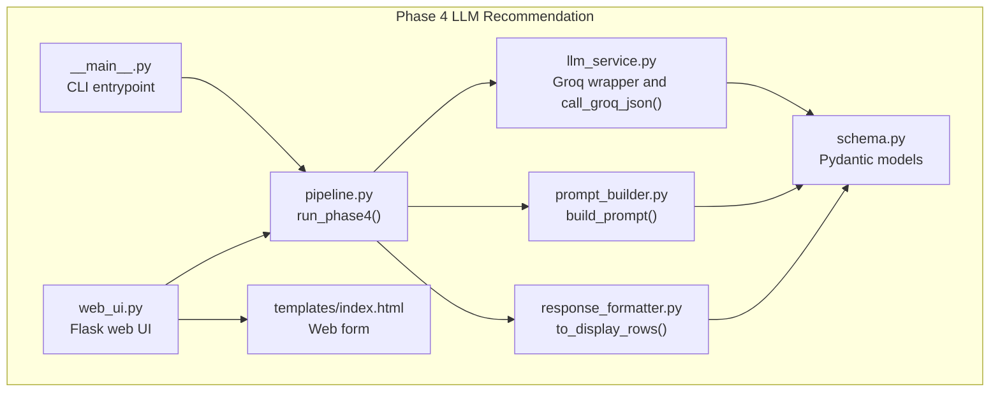
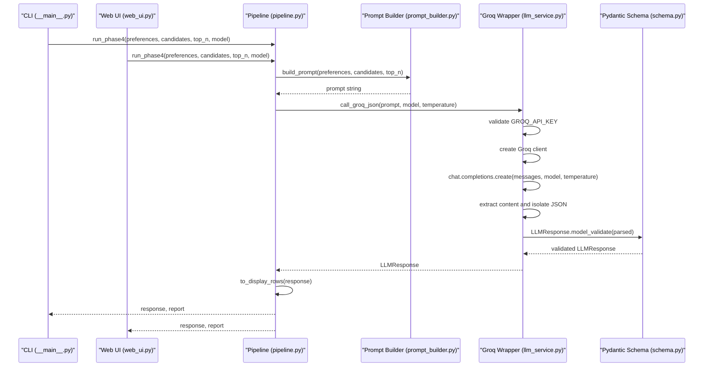
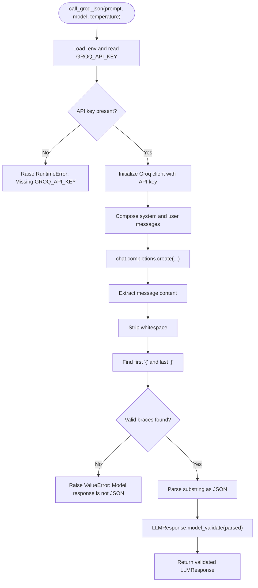
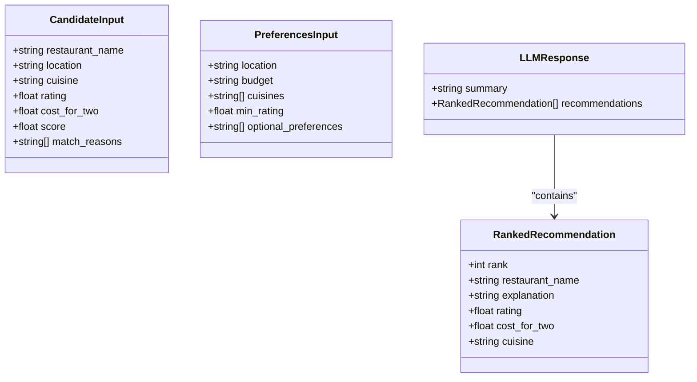
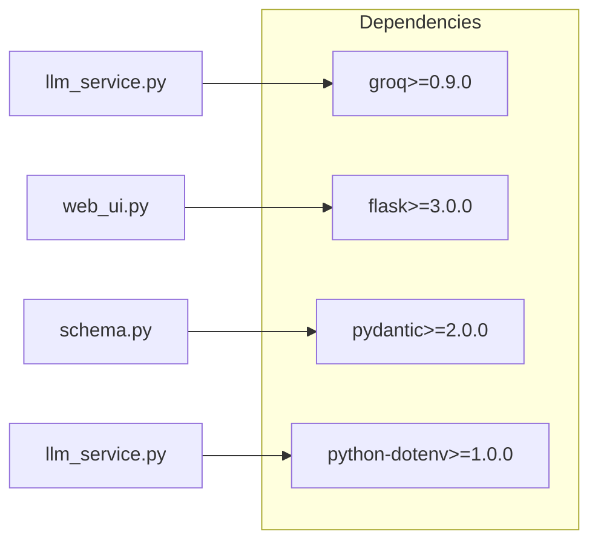

# LLM Service Integration

<cite>
**Referenced Files in This Document**
- [llm_service.py](file://Zomato/architecture/phase_4_llm_recommendation/llm_service.py)
- [schema.py](file://Zomato/architecture/phase_4_llm_recommendation/schema.py)
- [prompt_builder.py](file://Zomato/architecture/phase_4_llm_recommendation/prompt_builder.py)
- [response_formatter.py](file://Zomato/architecture/phase_4_llm_recommendation/response_formatter.py)
- [pipeline.py](file://Zomato/architecture/phase_4_llm_recommendation/pipeline.py)
- [__main__.py](file://Zomato/architecture/phase_4_llm_recommendation/__main__.py)
- [web_ui.py](file://Zomato/architecture/phase_4_llm_recommendation/web_ui.py)
- [index.html](file://Zomato/architecture/phase_4_llm_recommendation/templates/index.html)
- [sample_candidates.json](file://Zomato/architecture/phase_4_llm_recommendation/sample_candidates.json)
- [sample_preferences.json](file://Zomato/architecture/phase_4_llm_recommendation/sample_preferences.json)
- [requirements.txt](file://Zomato/architecture/phase_4_llm_recommendation/requirements.txt)
</cite>

## Table of Contents
1. [Introduction](#introduction)
2. [Project Structure](#project-structure)
3. [Core Components](#core-components)
4. [Architecture Overview](#architecture-overview)
5. [Detailed Component Analysis](#detailed-component-analysis)
6. [Dependency Analysis](#dependency-analysis)
7. [Performance Considerations](#performance-considerations)
8. [Troubleshooting Guide](#troubleshooting-guide)
9. [Conclusion](#conclusion)
10. [Appendices](#appendices)

## Introduction
This document describes the LLM Service Integration component responsible for integrating with the Groq LLM platform to produce structured restaurant recommendations. It covers the Groq service wrapper, API key configuration, model selection, chat completion protocol, parameter validation, response parsing, schema validation, and security considerations. It also documents integration patterns for both CLI and web UI modes, along with troubleshooting guidance for common issues.

## Project Structure
The LLM integration lives in the fourth phase of the architecture, focusing on transforming preference and candidate data into a structured recommendation response via Groq. The module exposes a single public function for LLM interactions and integrates with prompt building, response formatting, and pipeline orchestration.

**Diagram sources**
- [llm_service.py:1-43](file://Zomato/architecture/phase_4_llm_recommendation/llm_service.py#L1-L43)
- [prompt_builder.py:1-45](file://Zomato/architecture/phase_4_llm_recommendation/prompt_builder.py#L1-L45)
- [response_formatter.py:1-22](file://Zomato/architecture/phase_4_llm_recommendation/response_formatter.py#L1-L22)
- [schema.py:1-38](file://Zomato/architecture/phase_4_llm_recommendation/schema.py#L1-L38)
- [pipeline.py:1-47](file://Zomato/architecture/phase_4_llm_recommendation/pipeline.py#L1-L47)
- [__main__.py:1-41](file://Zomato/architecture/phase_4_llm_recommendation/__main__.py#L1-L41)
- [web_ui.py:1-108](file://Zomato/architecture/phase_4_llm_recommendation/web_ui.py#L1-L108)
- [index.html:1-54](file://Zomato/architecture/phase_4_llm_recommendation/templates/index.html#L1-L54)

**Section sources**
- [llm_service.py:1-43](file://Zomato/architecture/phase_4_llm_recommendation/llm_service.py#L1-L43)
- [pipeline.py:1-47](file://Zomato/architecture/phase_4_llm_recommendation/pipeline.py#L1-L47)
- [__main__.py:1-41](file://Zomato/architecture/phase_4_llm_recommendation/__main__.py#L1-L41)
- [web_ui.py:1-108](file://Zomato/architecture/phase_4_llm_recommendation/web_ui.py#L1-L108)

## Core Components
- Groq LLM service wrapper: Provides a single function to call Groq’s chat completions API with strict JSON-only output expectations and robust response parsing.
- Prompt builder: Constructs a structured prompt with user preferences and candidate data, enforcing JSON-only output and schema requirements.
- Response formatter: Converts validated LLM responses into a display-friendly row format.
- Pydantic schema: Defines typed models for preferences, candidates, ranked recommendations, and the top-level LLM response.
- Pipeline: Orchestrates loading data, building prompts, invoking the LLM, validating responses, and preparing reports.
- CLI and Web UI: Provide entrypoints for batch processing and interactive experimentation.

Key responsibilities:
- Environment configuration and API key handling
- Model selection and temperature tuning for deterministic outputs
- Chat completion protocol with system and user roles
- Best-effort JSON extraction and schema validation
- Error propagation and reporting

**Section sources**
- [llm_service.py:15-42](file://Zomato/architecture/phase_4_llm_recommendation/llm_service.py#L15-L42)
- [prompt_builder.py:10-44](file://Zomato/architecture/phase_4_llm_recommendation/prompt_builder.py#L10-L44)
- [response_formatter.py:8-21](file://Zomato/architecture/phase_4_llm_recommendation/response_formatter.py#L8-L21)
- [schema.py:8-37](file://Zomato/architecture/phase_4_llm_recommendation/schema.py#L8-L37)
- [pipeline.py:29-46](file://Zomato/architecture/phase_4_llm_recommendation/pipeline.py#L29-L46)
- [__main__.py:11-36](file://Zomato/architecture/phase_4_llm_recommendation/__main__.py#L11-L36)
- [web_ui.py:73-99](file://Zomato/architecture/phase_4_llm_recommendation/web_ui.py#L73-L99)

## Architecture Overview
The LLM integration follows a layered design:
- Data ingestion: Load candidates and preferences from JSON files or web forms.
- Prompt construction: Build a system+user message pair with explicit JSON schema requirements.
- LLM invocation: Call Groq chat completions with a deterministic temperature setting.
- Response parsing: Extract JSON from the model’s response and validate against the schema.
- Output formatting: Convert validated results into a display-friendly structure.

**Diagram sources**
- [__main__.py:26-36](file://Zomato/architecture/phase_4_llm_recommendation/__main__.py#L26-L36)
- [web_ui.py:73-99](file://Zomato/architecture/phase_4_llm_recommendation/web_ui.py#L73-L99)
- [pipeline.py:29-46](file://Zomato/architecture/phase_4_llm_recommendation/pipeline.py#L29-L46)
- [prompt_builder.py:10-44](file://Zomato/architecture/phase_4_llm_recommendation/prompt_builder.py#L10-L44)
- [llm_service.py:19-42](file://Zomato/architecture/phase_4_llm_recommendation/llm_service.py#L19-L42)
- [schema.py:35-37](file://Zomato/architecture/phase_4_llm_recommendation/schema.py#L35-L37)

## Detailed Component Analysis

### Groq LLM Service Wrapper
The wrapper encapsulates the Groq client initialization, API key validation, and chat completion call. It enforces a JSON-only output requirement and performs best-effort JSON extraction from the model’s response.

Key behaviors:
- Environment variable: Reads GROQ_API_KEY from a .env file located alongside the module.
- Default model: Uses a deterministic model identifier for consistent results.
- Temperature: Sets a low temperature to reduce randomness and improve determinism.
- Chat completion protocol: Sends a system role instructing JSON-only output and a user role containing the prompt.
- Response parsing: Strips whitespace, locates the first and last braces, parses the substring, and validates against the LLMResponse schema.

**Diagram sources**
- [llm_service.py:19-42](file://Zomato/architecture/phase_4_llm_recommendation/llm_service.py#L19-L42)

**Section sources**
- [llm_service.py:15-42](file://Zomato/architecture/phase_4_llm_recommendation/llm_service.py#L15-L42)

### Prompt Builder
The prompt builder constructs a structured prompt that includes:
- Task instructions to rank a fixed number of restaurants and provide concise explanations.
- Explicit schema requirements for the output.
- Serialized preferences and candidate lists.

It ensures the model receives clear instructions to return only valid JSON and avoids hallucinations by constraining the output format.

**Section sources**
- [prompt_builder.py:10-44](file://Zomato/architecture/phase_4_llm_recommendation/prompt_builder.py#L10-L44)

### Response Formatter
The formatter transforms the validated LLM response into a list of dictionaries suitable for rendering in the web UI or exporting to tabular formats. It preserves essential fields while dropping internal metadata.

**Section sources**
- [response_formatter.py:8-21](file://Zomato/architecture/phase_4_llm_recommendation/response_formatter.py#L8-L21)

### Pydantic Schemas
The schema module defines typed models for:
- CandidateInput: Restaurant attributes and match reasons.
- PreferencesInput: User preferences including location, budget, cuisines, minimum rating, and optional preferences.
- RankedRecommendation: Individual recommendation with rank, restaurant name, explanation, and optional rating/cost fields.
- LLMResponse: Top-level container with a summary and a list of ranked recommendations.

These models enable robust validation and serialization of inputs and outputs.

**Diagram sources**
- [schema.py:8-37](file://Zomato/architecture/phase_4_llm_recommendation/schema.py#L8-L37)

**Section sources**
- [schema.py:8-37](file://Zomato/architecture/phase_4_llm_recommendation/schema.py#L8-L37)

### Pipeline Orchestration
The pipeline coordinates:
- Loading and validating candidate and preference data from JSON.
- Building the prompt.
- Invoking the LLM wrapper.
- Formatting the response for display.
- Producing a run report with counts, model, and preview.

It also exposes defaults for model selection and top-N ranking.

**Section sources**
- [pipeline.py:15-46](file://Zomato/architecture/phase_4_llm_recommendation/pipeline.py#L15-L46)

### CLI Entry Point
The CLI entry point supports:
- Running in web UI mode.
- Specifying input files for candidates and preferences.
- Overriding top-N and model parameters.
- Printing structured outputs and a run report.

It enforces that required arguments are provided in CLI mode.

**Section sources**
- [__main__.py:11-36](file://Zomato/architecture/phase_4_llm_recommendation/__main__.py#L11-L36)

### Web UI
The web UI provides:
- A form to input model, top-N, preferences JSON, and candidates JSON.
- Real-time validation and error reporting.
- Rendering of the LLM output and a run report.

It integrates with the pipeline to produce recommendations and displays errors with stack traces.

**Section sources**
- [web_ui.py:73-99](file://Zomato/architecture/phase_4_llm_recommendation/web_ui.py#L73-L99)
- [index.html:22-36](file://Zomato/architecture/phase_4_llm_recommendation/templates/index.html#L22-L36)

## Dependency Analysis
External dependencies include the Groq SDK, Flask for the web UI, Pydantic for schema validation, and python-dotenv for environment configuration.

**Diagram sources**
- [requirements.txt:1-5](file://Zomato/architecture/phase_4_llm_recommendation/requirements.txt#L1-L5)
- [llm_service.py:9-10](file://Zomato/architecture/phase_4_llm_recommendation/llm_service.py#L9-L10)
- [web_ui.py](file://Zomato/architecture/phase_4_llm_recommendation/web_ui.py#L8)
- [schema.py](file://Zomato/architecture/phase_4_llm_recommendation/schema.py#L5)
- [llm_service.py](file://Zomato/architecture/phase_4_llm_recommendation/llm_service.py#L10)

**Section sources**
- [requirements.txt:1-5](file://Zomato/architecture/phase_4_llm_recommendation/requirements.txt#L1-L5)

## Performance Considerations
- Deterministic responses: Temperature is set to a low value to reduce randomness and improve consistency across runs.
- Model selection: The default model is chosen for balanced speed and quality; users can override via CLI or web UI.
- Minimal parsing overhead: The wrapper extracts JSON by locating braces and validates once using Pydantic.
- Batch processing: CLI mode allows processing multiple datasets efficiently.

[No sources needed since this section provides general guidance]

## Troubleshooting Guide
Common issues and resolutions:
- Missing API key
  - Symptom: Runtime error indicating the API key is missing.
  - Resolution: Set GROQ_API_KEY in the .env file located beside the module.
  - Section sources
    - [llm_service.py:20-22](file://Zomato/architecture/phase_4_llm_recommendation/llm_service.py#L20-L22)

- Model response not JSON
  - Symptom: Value error indicating the model response is not JSON.
  - Causes: Model ignored JSON-only instruction or returned non-JSON content.
  - Resolution: Adjust prompt to emphasize JSON-only output; verify system role instructions; retry with a different model.
  - Section sources
    - [llm_service.py:36-41](file://Zomato/architecture/phase_4_llm_recommendation/llm_service.py#L36-L41)

- Validation errors on response
  - Symptom: Schema validation failure when parsing the response.
  - Causes: Response does not match the LLMResponse schema.
  - Resolution: Inspect the response structure; ensure the model adheres to the schema; refine prompt to enforce exact field names and types.
  - Section sources
    - [schema.py:35-37](file://Zomato/architecture/phase_4_llm_recommendation/schema.py#L35-L37)

- CLI argument errors
  - Symptom: Error requiring candidates and preferences paths.
  - Resolution: Provide both --candidates-path and --preferences-path when running in CLI mode.
  - Section sources
    - [__main__.py:26-27](file://Zomato/architecture/phase_4_llm_recommendation/__main__.py#L26-L27)

- Web UI errors
  - Symptom: Error displayed in the browser with a stack trace.
  - Resolution: Verify JSON inputs for preferences and candidates; check model and top-N values; review server logs.
  - Section sources
    - [web_ui.py:91-99](file://Zomato/architecture/phase_4_llm_recommendation/web_ui.py#L91-L99)

- Environment configuration
  - Symptom: API key not recognized.
  - Resolution: Confirm the .env file is placed in the same directory as the module and contains GROQ_API_KEY.
  - Section sources
    - [llm_service.py](file://Zomato/architecture/phase_4_llm_recommendation/llm_service.py#L16)

## Conclusion
The LLM Service Integration component provides a robust, deterministic pathway from structured inputs to validated, schema-compliant recommendations via Groq. It emphasizes clear prompt engineering, strict JSON-only output requirements, and strong validation to ensure reliable downstream processing. The CLI and web UI offer flexible integration patterns, while environment-based configuration and schema validation support secure and maintainable deployments.

[No sources needed since this section summarizes without analyzing specific files]

## Appendices

### API Integration Patterns
- CLI usage
  - Run the pipeline with JSON inputs and optional overrides for model and top-N.
  - Example invocation pattern: pass candidates and preferences JSON paths and specify model and top-N.
  - Section sources
    - [__main__.py:11-36](file://Zomato/architecture/phase_4_llm_recommendation/__main__.py#L11-L36)

- Web UI usage
  - Submit preferences and candidates JSON via the form; select model and top-N; view results and run report.
  - Section sources
    - [web_ui.py:73-99](file://Zomato/architecture/phase_4_llm_recommendation/web_ui.py#L73-L99)
    - [index.html:22-36](file://Zomato/architecture/phase_4_llm_recommendation/templates/index.html#L22-L36)

### Sample Inputs
- Candidates JSON: A list of restaurant entries with name, location, cuisine, rating, cost, score, and match reasons.
- Preferences JSON: A dictionary containing location, budget, cuisines, minimum rating, and optional preferences.
- Section sources
  - [sample_candidates.json:1-21](file://Zomato/architecture/phase_4_llm_recommendation/sample_candidates.json#L1-L21)
  - [sample_preferences.json:1-8](file://Zomato/architecture/phase_4_llm_recommendation/sample_preferences.json#L1-L8)

### Security Considerations
- API key management
  - Store GROQ_API_KEY in a .env file adjacent to the module.
  - Do not commit secrets to version control; ensure .env is excluded by .gitignore.
  - Limit permissions on the .env file to trusted users.
  - Section sources
    - [llm_service.py](file://Zomato/architecture/phase_4_llm_recommendation/llm_service.py#L16)

- Output constraints
  - Enforce JSON-only output via system role instructions and best-effort parsing to prevent injection-like scenarios.
  - Section sources
    - [llm_service.py:29-31](file://Zomato/architecture/phase_4_llm_recommendation/llm_service.py#L29-L31)
    - [prompt_builder.py:27-30](file://Zomato/architecture/phase_4_llm_recommendation/prompt_builder.py#L27-L30)

### Configuration Reference
- Environment variable
  - GROQ_API_KEY: Required for Groq API access.
  - Section sources
    - [llm_service.py](file://Zomato/architecture/phase_4_llm_recommendation/llm_service.py#L20)

- Defaults
  - Default model: Deterministic model identifier configured in the module.
  - Temperature: Low value to reduce randomness.
  - Section sources
    - [llm_service.py](file://Zomato/architecture/phase_4_llm_recommendation/llm_service.py#L15)
    - [llm_service.py:25-27](file://Zomato/architecture/phase_4_llm_recommendation/llm_service.py#L25-L27)