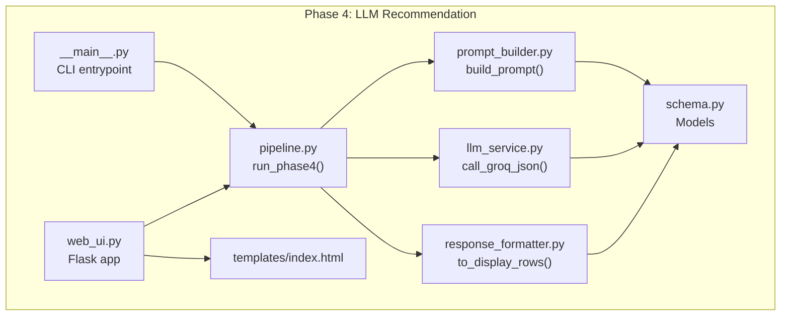
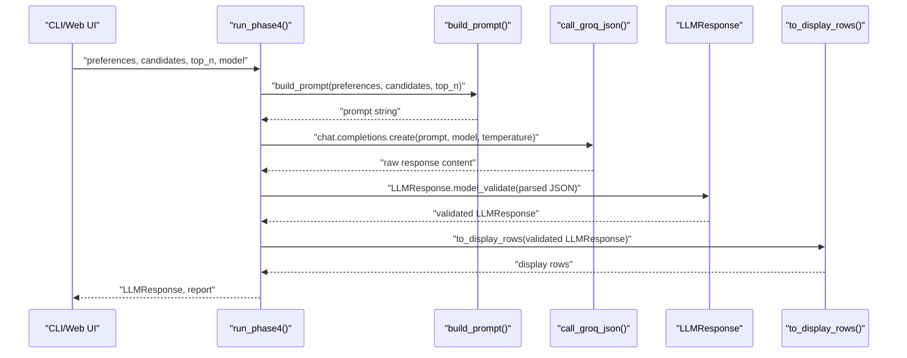
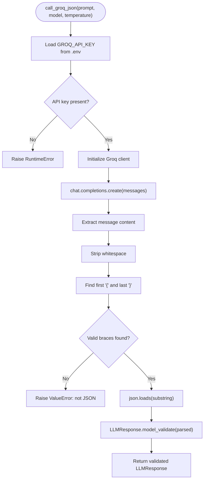
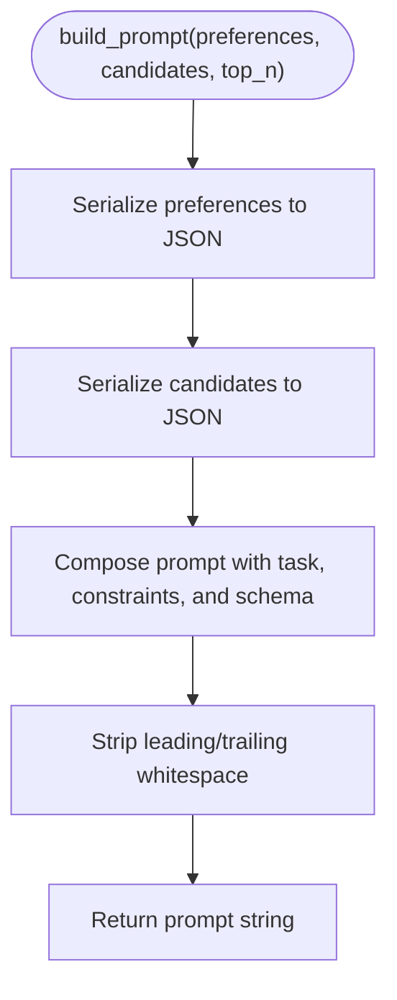
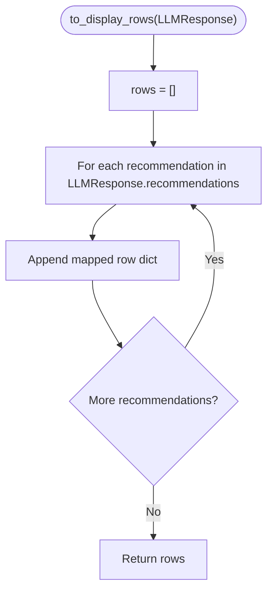
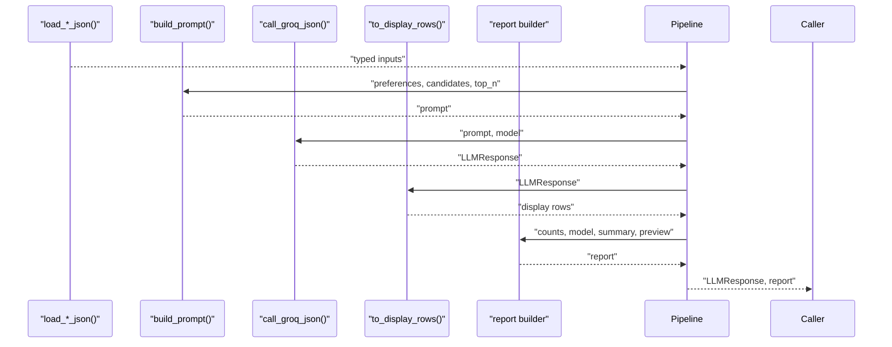
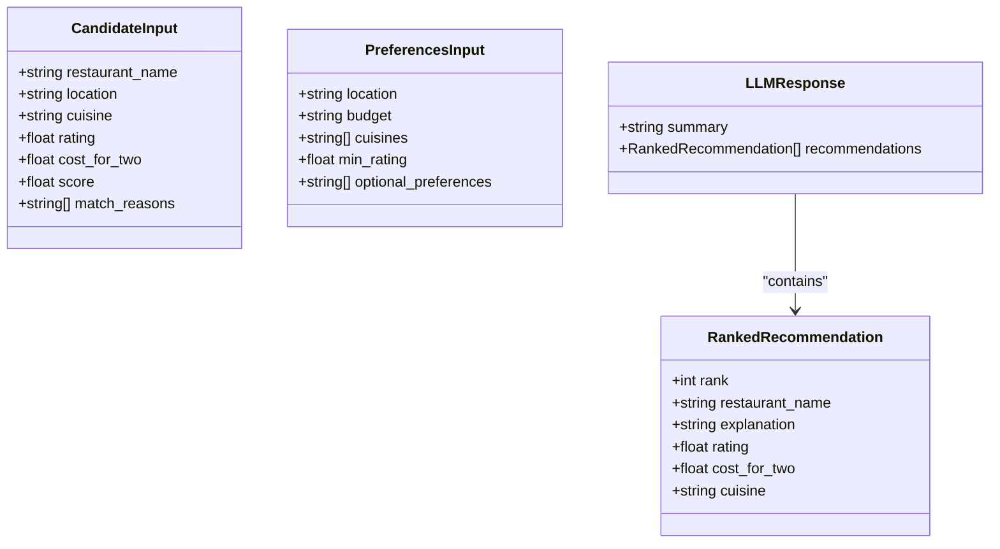
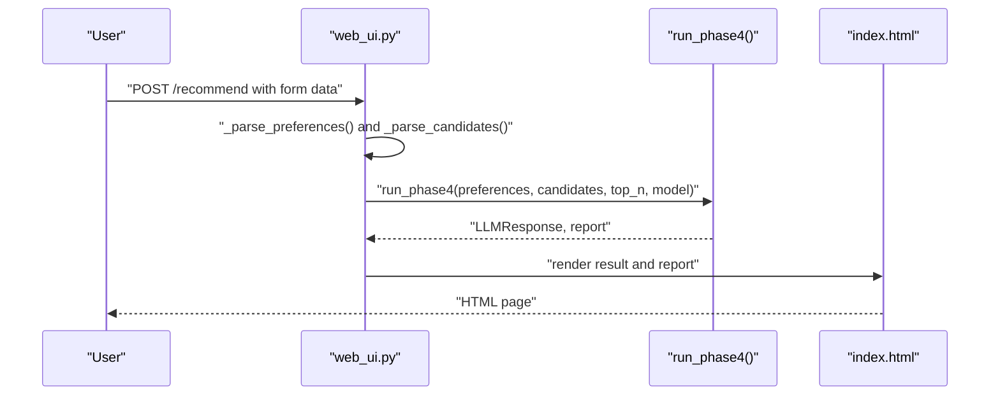
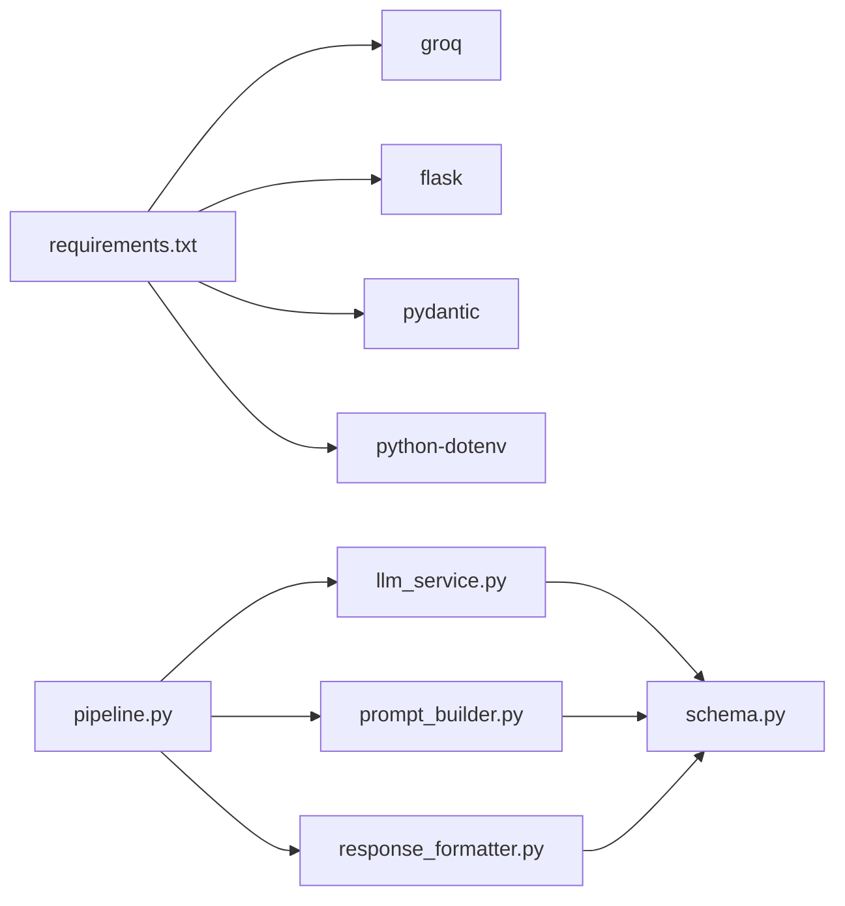

# Phase 4: LLM Recommendation

<cite>
**Referenced Files in This Document**
- [llm_service.py](file://Zomato/architecture/phase_4_llm_recommendation/llm_service.py)
- [prompt_builder.py](file://Zomato/architecture/phase_4_llm_recommendation/prompt_builder.py)
- [response_formatter.py](file://Zomato/architecture/phase_4_llm_recommendation/response_formatter.py)
- [pipeline.py](file://Zomato/architecture/phase_4_llm_recommendation/pipeline.py)
- [schema.py](file://Zomato/architecture/phase_4_llm_recommendation/schema.py)
- [__main__.py](file://Zomato/architecture/phase_4_llm_recommendation/__main__.py)
- [web_ui.py](file://Zomato/architecture/phase_4_llm_recommendation/web_ui.py)
- [requirements.txt](file://Zomato/architecture/phase_4_llm_recommendation/requirements.txt)
- [index.html](file://Zomato/architecture/phase_4_llm_recommendation/templates/index.html)
- [sample_preferences.json](file://Zomato/architecture/phase_4_llm_recommendation/sample_preferences.json)
- [sample_candidates.json](file://Zomato/architecture/phase_4_llm_recommendation/sample_candidates.json)
</cite>

## Table of Contents
1. [Introduction](#introduction)
2. [Project Structure](#project-structure)
3. [Core Components](#core-components)
4. [Architecture Overview](#architecture-overview)
5. [Detailed Component Analysis](#detailed-component-analysis)
6. [Dependency Analysis](#dependency-analysis)
7. [Performance Considerations](#performance-considerations)
8. [Troubleshooting Guide](#troubleshooting-guide)
9. [Conclusion](#conclusion)
10. [Appendices](#appendices)

## Introduction
Phase 4 implements an AI-powered recommendation system that transforms user preferences and a ranked list of restaurants into structured, human-readable recommendations with explanations. It integrates with the Groq LLM platform to generate ranked suggestions, enforces strict JSON output formatting, and validates results against a Pydantic schema. The component is designed to be accessible via CLI or a minimal web UI, and feeds results into downstream response delivery systems.

## Project Structure
The Phase 4 module organizes functionality into focused modules:
- Pipeline orchestrates loading data, building prompts, invoking the LLM, and formatting outputs.
- Prompt builder constructs a structured prompt with user preferences and candidate data.
- LLM service wraps Groq chat completions with robust JSON extraction and validation.
- Response formatter converts validated LLM outputs into display-friendly rows.
- Schema defines typed models for inputs, outputs, and validation.
- CLI and web UI provide entry points for local execution and interactive testing.

**Diagram sources**
- [pipeline.py:29-46](file://Zomato/architecture/phase_4_llm_recommendation/pipeline.py#L29-L46)
- [prompt_builder.py:10-44](file://Zomato/architecture/phase_4_llm_recommendation/prompt_builder.py#L10-L44)
- [llm_service.py:19-42](file://Zomato/architecture/phase_4_llm_recommendation/llm_service.py#L19-L42)
- [response_formatter.py:8-21](file://Zomato/architecture/phase_4_llm_recommendation/response_formatter.py#L8-L21)
- [schema.py:8-38](file://Zomato/architecture/phase_4_llm_recommendation/schema.py#L8-L38)
- [__main__.py:11-37](file://Zomato/architecture/phase_4_llm_recommendation/__main__.py#L11-L37)
- [web_ui.py:73-99](file://Zomato/architecture/phase_4_llm_recommendation/web_ui.py#L73-L99)
- [index.html:22-51](file://Zomato/architecture/phase_4_llm_recommendation/templates/index.html#L22-L51)

**Section sources**
- [requirements.txt:1-5](file://Zomato/architecture/phase_4_llm_recommendation/requirements.txt#L1-L5)
- [__main__.py:11-37](file://Zomato/architecture/phase_4_llm_recommendation/__main__.py#L11-L37)
- [web_ui.py:102-108](file://Zomato/architecture/phase_4_llm_recommendation/web_ui.py#L102-L108)

## Core Components
- Pipeline: Loads candidate and preference data, builds prompts, invokes Groq, validates and formats outputs, and produces a run report.
- Prompt Builder: Constructs a precise, schema-constrained prompt that instructs the model to rank top-N restaurants and return strictly JSON.
- LLM Service: Calls Groq chat completions with a system role enforcing JSON-only output, extracts and validates JSON from potentially noisy model responses.
- Response Formatter: Transforms validated LLM responses into a simplified row format suitable for display.
- Schema: Defines typed models for candidates, preferences, ranked recommendations, and the final LLM response.

Key responsibilities and interactions:
- Data ingestion: Pipeline loads JSON files or parses form payloads into typed models.
- Prompt engineering: Prompt builder embeds preferences and candidate sets with explicit schema requirements.
- LLM integration: LLM service handles API credentials, temperature, and robust JSON parsing.
- Output formatting: Response formatter ensures consistent display rows for UI consumption.

**Section sources**
- [pipeline.py:15-46](file://Zomato/architecture/phase_4_llm_recommendation/pipeline.py#L15-L46)
- [prompt_builder.py:10-44](file://Zomato/architecture/phase_4_llm_recommendation/prompt_builder.py#L10-L44)
- [llm_service.py:19-42](file://Zomato/architecture/phase_4_llm_recommendation/llm_service.py#L19-L42)
- [response_formatter.py:8-21](file://Zomato/architecture/phase_4_llm_recommendation/response_formatter.py#L8-L21)
- [schema.py:8-38](file://Zomato/architecture/phase_4_llm_recommendation/schema.py#L8-L38)

## Architecture Overview
The Phase 4 pipeline follows a linear, typed-data flow:
1. Load preferences and candidates from JSON or form payloads.
2. Build a structured prompt embedding preferences and candidate data.
3. Call Groq with a system role enforcing JSON-only output.
4. Extract and validate JSON from the model’s response.
5. Convert validated LLM output into display rows.
6. Produce a run report summarizing counts, model, and preview.

**Diagram sources**
- [pipeline.py:29-46](file://Zomato/architecture/phase_4_llm_recommendation/pipeline.py#L29-L46)
- [prompt_builder.py:10-44](file://Zomato/architecture/phase_4_llm_recommendation/prompt_builder.py#L10-L44)
- [llm_service.py:19-42](file://Zomato/architecture/phase_4_llm_recommendation/llm_service.py#L19-L42)
- [response_formatter.py:8-21](file://Zomato/architecture/phase_4_llm_recommendation/response_formatter.py#L8-L21)

## Detailed Component Analysis

### LLM Service: Groq Integration and JSON Extraction
- Purpose: Invoke Groq chat completions with a system role that requires JSON-only output, then extract and validate JSON from the model’s response.
- Key behaviors:
  - Environment-driven API key loading.
  - Default model selection and configurable temperature.
  - Robust JSON isolation from potential wrapping text.
  - Strict validation via Pydantic LLMResponse model.
- Error handling:
  - Raises runtime error if API key is missing.
  - Raises value error if extracted content is not valid JSON.

**Diagram sources**
- [llm_service.py:19-42](file://Zomato/architecture/phase_4_llm_recommendation/llm_service.py#L19-L42)

**Section sources**
- [llm_service.py:19-42](file://Zomato/architecture/phase_4_llm_recommendation/llm_service.py#L19-L42)

### Prompt Builder: Structured Prompt Construction
- Purpose: Construct a precise prompt that instructs the model to:
  - Rank top-N restaurants.
  - Provide concise explanations.
  - Use only provided candidate data.
  - Return strictly JSON matching a defined schema.
- Implementation highlights:
  - Serializes preferences and candidates to JSON for embedding.
  - Emphasizes output constraints and schema specification.
  - Uses indentation for readability in the prompt.

**Diagram sources**
- [prompt_builder.py:10-44](file://Zomato/architecture/phase_4_llm_recommendation/prompt_builder.py#L10-L44)

**Section sources**
- [prompt_builder.py:10-44](file://Zomato/architecture/phase_4_llm_recommendation/prompt_builder.py#L10-L44)

### Response Formatter: Display Row Transformation
- Purpose: Convert validated LLM responses into a simplified list of dictionaries suitable for UI rendering.
- Implementation highlights:
  - Iterates over recommendations and maps fields to a display-friendly structure.
  - Preserves ranking, restaurant name, cuisine, rating, cost for two, and explanation.

**Diagram sources**
- [response_formatter.py:8-21](file://Zomato/architecture/phase_4_llm_recommendation/response_formatter.py#L8-L21)

**Section sources**
- [response_formatter.py:8-21](file://Zomato/architecture/phase_4_llm_recommendation/response_formatter.py#L8-L21)

### Pipeline: Orchestration and Reporting
- Purpose: Orchestrate the end-to-end process, including data loading, prompt building, LLM invocation, validation, and formatting.
- Key responsibilities:
  - Load candidates and preferences from JSON files or form payloads.
  - Build prompt and call Groq.
  - Format display rows and produce a run report with counts, model, and summary.
- Error handling:
  - Validates JSON shapes during load.
  - Propagates exceptions from downstream components.

**Diagram sources**
- [pipeline.py:15-46](file://Zomato/architecture/phase_4_llm_recommendation/pipeline.py#L15-L46)

**Section sources**
- [pipeline.py:15-46](file://Zomato/architecture/phase_4_llm_recommendation/pipeline.py#L15-L46)

### Schemas: Typed Data Contracts
- CandidateInput: Restaurant attributes including name, location, cuisines, ratings, costs, scores, and match reasons.
- PreferencesInput: User preferences including location, budget, cuisines, minimum rating, and optional preferences.
- RankedRecommendation: Fields for rank, restaurant name, explanation, rating, cost for two, and cuisine.
- LLMResponse: Top-level container with a summary and a list of ranked recommendations.

**Diagram sources**
- [schema.py:8-38](file://Zomato/architecture/phase_4_llm_recommendation/schema.py#L8-L38)

**Section sources**
- [schema.py:8-38](file://Zomato/architecture/phase_4_llm_recommendation/schema.py#L8-L38)

### CLI and Web UI: Entry Points and Interaction
- CLI:
  - Supports running via command-line with arguments for model, top-N, and file paths.
  - Starts web UI when requested.
- Web UI:
  - Provides a form to submit preferences and candidates JSON.
  - Renders errors, run reports, and raw LLM output.
  - Allows selecting model and top-N.

**Diagram sources**
- [web_ui.py:73-99](file://Zomato/architecture/phase_4_llm_recommendation/web_ui.py#L73-L99)
- [index.html:22-51](file://Zomato/architecture/phase_4_llm_recommendation/templates/index.html#L22-L51)

**Section sources**
- [__main__.py:11-37](file://Zomato/architecture/phase_4_llm_recommendation/__main__.py#L11-L37)
- [web_ui.py:73-99](file://Zomato/architecture/phase_4_llm_recommendation/web_ui.py#L73-L99)
- [index.html:22-51](file://Zomato/architecture/phase_4_llm_recommendation/templates/index.html#L22-L51)

## Dependency Analysis
- External libraries:
  - groq: Chat completions client.
  - flask: Web framework for the UI.
  - pydantic: Data validation and serialization.
  - python-dotenv: Environment variable loading.
- Internal dependencies:
  - pipeline depends on prompt_builder, llm_service, and response_formatter.
  - llm_service depends on schema for validation.
  - prompt_builder and response_formatter depend on schema for typed inputs/outputs.

**Diagram sources**
- [requirements.txt:1-5](file://Zomato/architecture/phase_4_llm_recommendation/requirements.txt#L1-L5)
- [pipeline.py:9-12](file://Zomato/architecture/phase_4_llm_recommendation/pipeline.py#L9-L12)
- [llm_service.py:9-12](file://Zomato/architecture/phase_4_llm_recommendation/llm_service.py#L9-L12)
- [prompt_builder.py:7](file://Zomato/architecture/phase_4_llm_recommendation/prompt_builder.py#L7)
- [response_formatter.py:5](file://Zomato/architecture/phase_4_llm_recommendation/response_formatter.py#L5)

**Section sources**
- [requirements.txt:1-5](file://Zomato/architecture/phase_4_llm_recommendation/requirements.txt#L1-L5)
- [pipeline.py:9-12](file://Zomato/architecture/phase_4_llm_recommendation/pipeline.py#L9-L12)
- [llm_service.py:9-12](file://Zomato/architecture/phase_4_llm_recommendation/llm_service.py#L9-L12)
- [prompt_builder.py:7](file://Zomato/architecture/phase_4_llm_recommendation/prompt_builder.py#L7)
- [response_formatter.py:5](file://Zomato/architecture/phase_4_llm_recommendation/response_formatter.py#L5)

## Performance Considerations
- Model selection: Different Groq models offer trade-offs between speed and quality. The default model is configured in the LLM service; users can override via CLI or web UI.
- Prompt size: Embedding large candidate lists increases token usage and latency. Consider reducing top-N or filtering candidates before prompting.
- Temperature tuning: Lower temperatures (e.g., 0.2) yield more deterministic outputs, which can improve consistency for recommendation ranking.
- JSON parsing overhead: The LLM service performs best-effort JSON isolation and validation. Keeping prompts concise and schema-aligned reduces parsing retries.
- Caching: For repeated runs with identical inputs, consider caching LLM responses to reduce latency and API costs.

[No sources needed since this section provides general guidance]

## Troubleshooting Guide
Common issues and resolutions:
- Missing API key:
  - Symptom: Runtime error indicating missing GROQ_API_KEY.
  - Resolution: Set the environment variable before running.
- Non-JSON response:
  - Symptom: Value error indicating the model response is not JSON.
  - Resolution: Adjust system prompt to enforce stricter JSON-only output; verify model supports JSON output.
- Invalid JSON schema:
  - Symptom: Validation error when constructing LLMResponse.
  - Resolution: Ensure the model adheres to the exact schema specified in the prompt; consider adding examples to the prompt.
- Incorrect data shapes:
  - Symptom: Value errors during JSON loading for candidates or preferences.
  - Resolution: Verify input JSON is an array for candidates and an object for preferences.
- Web UI errors:
  - Symptom: Error rendered in the browser.
  - Resolution: Inspect server logs and ensure form payloads are valid JSON.

Operational tips:
- Use the CLI to quickly validate end-to-end flows with sample data.
- Start with small top-N values to reduce token usage and latency.
- Test with the provided sample files to confirm expected behavior.

**Section sources**
- [llm_service.py:20-22](file://Zomato/architecture/phase_4_llm_recommendation/llm_service.py#L20-L22)
- [llm_service.py:39-41](file://Zomato/architecture/phase_4_llm_recommendation/llm_service.py#L39-L41)
- [pipeline.py:15-26](file://Zomato/architecture/phase_4_llm_recommendation/pipeline.py#L15-L26)
- [web_ui.py:91-99](file://Zomato/architecture/phase_4_llm_recommendation/web_ui.py#L91-L99)

## Conclusion
Phase 4 delivers a robust, typed recommendation pipeline that integrates Groq LLMs with structured prompts and strict JSON validation. By separating concerns across prompt building, LLM invocation, response formatting, and orchestration, the system remains maintainable and extensible. The CLI and web UI provide practical entry points for experimentation and integration into broader response delivery workflows.

[No sources needed since this section summarizes without analyzing specific files]

## Appendices

### Configuration Options
- Environment:
  - GROQ_API_KEY: Required for Groq API access.
- CLI arguments:
  - --web: Start the web UI.
  - --candidates-path: Path to candidates JSON.
  - --preferences-path: Path to preferences JSON.
  - --top-n: Number of recommendations to return.
  - --model: Groq model identifier.
- Web UI form fields:
  - model: Groq model string.
  - top_n: Integer number of recommendations.
  - preferences_json: JSON object of user preferences.
  - candidates_json: JSON array of candidate restaurants.

**Section sources**
- [llm_service.py:16](file://Zomato/architecture/phase_4_llm_recommendation/llm_service.py#L16)
- [__main__.py:12-18](file://Zomato/architecture/phase_4_llm_recommendation/__main__.py#L12-L18)
- [web_ui.py:75-78](file://Zomato/architecture/phase_4_llm_recommendation/web_ui.py#L75-L78)
- [index.html:23-33](file://Zomato/architecture/phase_4_llm_recommendation/templates/index.html#L23-L33)

### Example Inputs and Outputs
- Sample preferences: See [sample_preferences.json:1-8](file://Zomato/architecture/phase_4_llm_recommendation/sample_preferences.json#L1-L8).
- Sample candidates: See [sample_candidates.json:1-21](file://Zomato/architecture/phase_4_llm_recommendation/sample_candidates.json#L1-L21).
- Expected prompt schema: Defined in the prompt builder’s schema requirement section.
- LLM output structure: Defined by LLMResponse and RankedRecommendation models.

**Section sources**
- [sample_preferences.json:1-8](file://Zomato/architecture/phase_4_llm_recommendation/sample_preferences.json#L1-L8)
- [sample_candidates.json:1-21](file://Zomato/architecture/phase_4_llm_recommendation/sample_candidates.json#L1-L21)
- [prompt_builder.py:30-43](file://Zomato/architecture/phase_4_llm_recommendation/prompt_builder.py#L30-L43)
- [schema.py:26-38](file://Zomato/architecture/phase_4_llm_recommendation/schema.py#L26-L38)