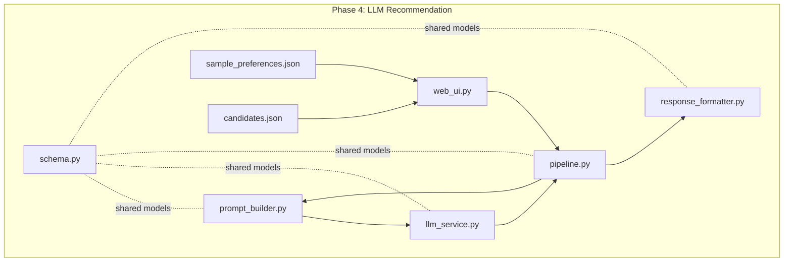
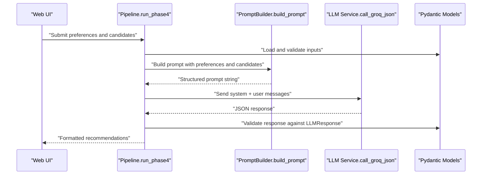
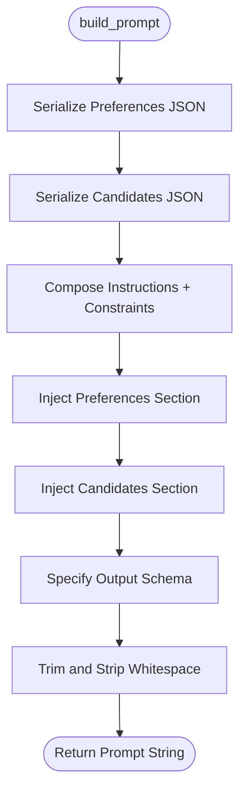
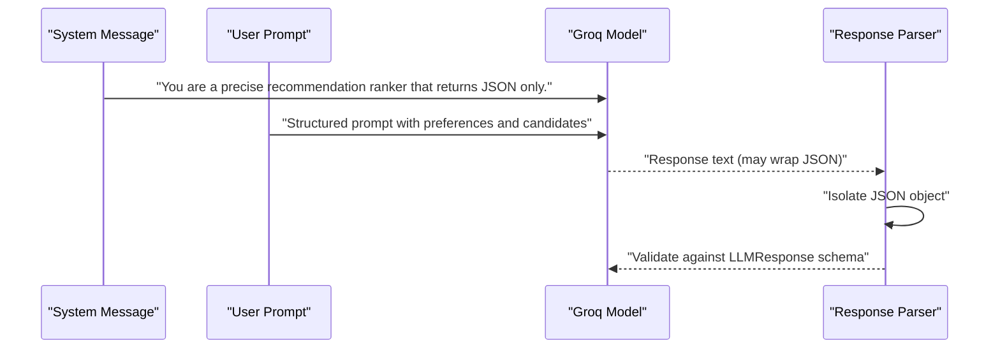
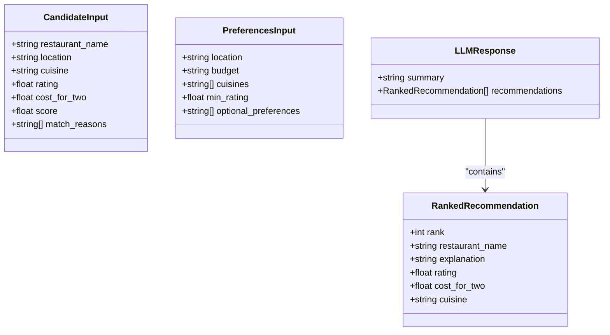
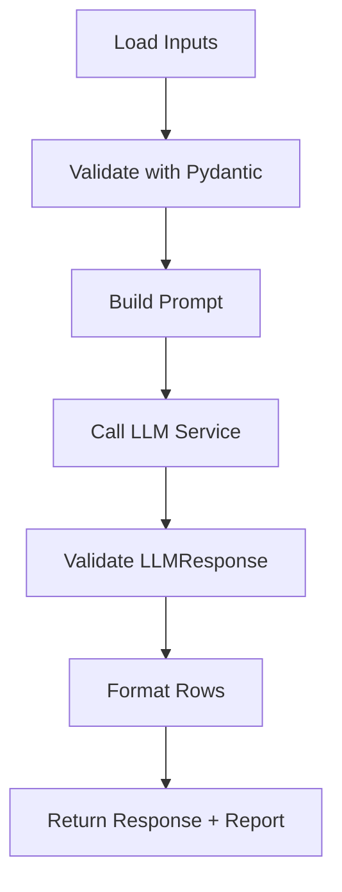
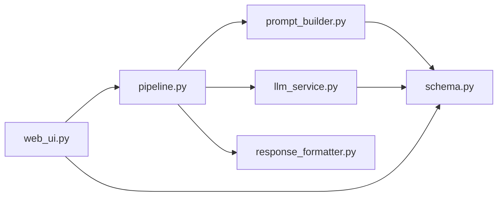

# Prompt Engineering

<cite>
**Referenced Files in This Document**
- [prompt_builder.py](file://Zomato/architecture/phase_4_llm_recommendation/prompt_builder.py)
- [schema.py](file://Zomato/architecture/phase_4_llm_recommendation/schema.py)
- [llm_service.py](file://Zomato/architecture/phase_4_llm_recommendation/llm_service.py)
- [pipeline.py](file://Zomato/architecture/phase_4_llm_recommendation/pipeline.py)
- [web_ui.py](file://Zomato/architecture/phase_4_llm_recommendation/web_ui.py)
- [response_formatter.py](file://Zomato/architecture/phase_4_llm_recommendation/response_formatter.py)
- [sample_preferences.json](file://Zomato/architecture/phase_4_llm_recommendation/sample_preferences.json)
- [candidates.json](file://Zomato/architecture/phase_4_llm_recommendation/candidates.json)
- [phase-wise-architecture.md](file://Zomato/architecture/phase-wise-architecture.md)
- [detailed-edge-cases.md](file://Zomato/edge-cases/detailed-edge-cases.md)
</cite>

## Table of Contents
1. [Introduction](#introduction)
2. [Project Structure](#project-structure)
3. [Core Components](#core-components)
4. [Architecture Overview](#architecture-overview)
5. [Detailed Component Analysis](#detailed-component-analysis)
6. [Dependency Analysis](#dependency-analysis)
7. [Performance Considerations](#performance-considerations)
8. [Troubleshooting Guide](#troubleshooting-guide)
9. [Conclusion](#conclusion)
10. [Appendices](#appendices)

## Introduction
This document explains the Prompt Engineering component responsible for constructing structured prompts that combine user preferences with candidate restaurant data. It focuses on the prompt_builder.py implementation, template design patterns, data injection mechanisms, and formatting strategies that guide the LLM toward high-quality, JSON-formatted recommendations. It also covers system prompts, user prompt structure, optimization techniques, token limits, response quality enhancements, and practical approaches for versioning, A/B testing, and iterative improvements.

## Project Structure
The Prompt Engineering component resides in Phase 4 of the architecture, which builds prompts from structured inputs and invokes an LLM to produce ranked recommendations with explanations. The relevant modules are:
- prompt_builder.py: constructs the full prompt text
- schema.py: defines typed Pydantic models for preferences, candidates, and LLM response
- llm_service.py: wraps the Groq API call and enforces JSON-only output
- pipeline.py: orchestrates loading inputs, building the prompt, invoking the LLM, and formatting the output
- response_formatter.py: transforms the validated LLM response into a display-friendly row format
- web_ui.py: exposes a basic web interface to feed inputs and visualize outputs
- sample data files: sample_preferences.json and candidates.json demonstrate input formats

**Diagram sources**
- [prompt_builder.py:1-45](file://Zomato/architecture/phase_4_llm_recommendation/prompt_builder.py#L1-L45)
- [schema.py:1-38](file://Zomato/architecture/phase_4_llm_recommendation/schema.py#L1-L38)
- [llm_service.py:1-43](file://Zomato/architecture/phase_4_llm_recommendation/llm_service.py#L1-L43)
- [pipeline.py:1-47](file://Zomato/architecture/phase_4_llm_recommendation/pipeline.py#L1-L47)
- [response_formatter.py:1-22](file://Zomato/architecture/phase_4_llm_recommendation/response_formatter.py#L1-L22)
- [web_ui.py:1-108](file://Zomato/architecture/phase_4_llm_recommendation/web_ui.py#L1-L108)
- [sample_preferences.json:1-8](file://Zomato/architecture/phase_4_llm_recommendation/sample_preferences.json#L1-L8)
- [candidates.json:1-30](file://Zomato/architecture/phase_4_llm_recommendation/candidates.json#L1-L30)

**Section sources**
- [phase-wise-architecture.md:43-54](file://Zomato/architecture/phase-wise-architecture.md#L43-L54)
- [web_ui.py:1-108](file://Zomato/architecture/phase_4_llm_recommendation/web_ui.py#L1-L108)

## Core Components
- Prompt Builder: Generates a single, structured prompt string combining user preferences and candidate data, with explicit output schema requirements.
- Schema: Defines strict input and output models to ensure consistent data injection and robust validation.
- LLM Service: Calls the Groq API with a system message and the constructed user prompt, then parses and validates the JSON response.
- Pipeline: Loads inputs, builds the prompt, calls the LLM, and formats the result for downstream use.
- Response Formatter: Converts the validated LLM response into a display-ready list of rows.

Key responsibilities:
- Prompt Builder: Ensures the LLM receives a clear task, constraints, and a precise output schema.
- Schema: Guarantees that injected data adheres to expected shapes and types.
- LLM Service: Enforces JSON-only output and isolates the JSON object from potential model wrapping text.
- Pipeline: Coordinates the end-to-end flow and collects diagnostic reporting.

**Section sources**
- [prompt_builder.py:10-44](file://Zomato/architecture/phase_4_llm_recommendation/prompt_builder.py#L10-L44)
- [schema.py:8-38](file://Zomato/architecture/phase_4_llm_recommendation/schema.py#L8-L38)
- [llm_service.py:19-42](file://Zomato/architecture/phase_4_llm_recommendation/llm_service.py#L19-L42)
- [pipeline.py:29-46](file://Zomato/architecture/phase_4_llm_recommendation/pipeline.py#L29-L46)
- [response_formatter.py:8-21](file://Zomato/architecture/phase_4_llm_recommendation/response_formatter.py#L8-L21)

## Architecture Overview
The Prompt Engineering pipeline integrates structured inputs with an LLM to produce explainable, ranked recommendations. The flow is:
- Web UI collects preferences and candidates
- Pipeline loads and validates inputs
- Prompt Builder composes the prompt with preferences and candidate data
- LLM Service sends the prompt to Groq and enforces JSON-only output
- Pipeline validates and formats the response for display

**Diagram sources**
- [web_ui.py:73-99](file://Zomato/architecture/phase_4_llm_recommendation/web_ui.py#L73-L99)
- [pipeline.py:29-46](file://Zomato/architecture/phase_4_llm_recommendation/pipeline.py#L29-L46)
- [prompt_builder.py:10-44](file://Zomato/architecture/phase_4_llm_recommendation/prompt_builder.py#L10-L44)
- [llm_service.py:19-42](file://Zomato/architecture/phase_4_llm_recommendation/llm_service.py#L19-L42)
- [schema.py:26-38](file://Zomato/architecture/phase_4_llm_recommendation/schema.py#L26-L38)

## Detailed Component Analysis

### Prompt Builder: Template Design Patterns and Data Injection
The prompt builder composes a single string prompt that:
- Establishes the role and task for the LLM
- Provides explicit constraints (do not invent data)
- Injects structured user preferences and candidate lists
- Specifies the exact JSON schema for the output

Template design patterns:
- Role and instruction framing: clearly define the assistant’s role and steps
- Constraint statements: prohibit fabricating data not present in the candidate list
- Structured data injection: serialize preferences and candidates as JSON for clarity
- Output schema specification: enumerate the required keys and types for deterministic parsing

Data injection mechanisms:
- Preferences are serialized as JSON and inserted under a “User Preferences” section
- Candidates are serialized as a JSON array and inserted under a “Candidate Restaurants” section
- The top_n parameter is embedded directly into the task instructions

Formatting strategies:
- Indented JSON for readability
- Explicit schema block to guide the LLM’s output structure
- Minimal extra text to reduce token overhead while preserving clarity

Concrete examples of prompt construction:
- Example preferences: [sample_preferences.json:1-8](file://Zomato/architecture/phase_4_llm_recommendation/sample_preferences.json#L1-L8)
- Example candidates: [candidates.json:1-30](file://Zomato/architecture/phase_4_llm_recommendation/candidates.json#L1-L30)
- Prompt composition: [prompt_builder.py:10-44](file://Zomato/architecture/phase_4_llm_recommendation/prompt_builder.py#L10-L44)

**Diagram sources**
- [prompt_builder.py:10-44](file://Zomato/architecture/phase_4_llm_recommendation/prompt_builder.py#L10-L44)
- [schema.py:8-24](file://Zomato/architecture/phase_4_llm_recommendation/schema.py#L8-L24)

**Section sources**
- [prompt_builder.py:10-44](file://Zomato/architecture/phase_4_llm_recommendation/prompt_builder.py#L10-L44)
- [sample_preferences.json:1-8](file://Zomato/architecture/phase_4_llm_recommendation/sample_preferences.json#L1-L8)
- [candidates.json:1-30](file://Zomato/architecture/phase_4_llm_recommendation/candidates.json#L1-L30)

### System Prompt and User Prompt Structure
The system prompt establishes the LLM’s behavior:
- Role: a precise recommendation ranker
- Constraint: return JSON only

The user prompt structure:
- Task: rank top_N restaurants, provide concise explanations, do not invent data
- Sections: User Preferences, Candidate Restaurants
- Output requirements: exact JSON schema with summary and recommendations

**Diagram sources**
- [llm_service.py:28-42](file://Zomato/architecture/phase_4_llm_recommendation/llm_service.py#L28-L42)
- [prompt_builder.py:10-44](file://Zomato/architecture/phase_4_llm_recommendation/prompt_builder.py#L10-L44)
- [schema.py:35-38](file://Zomato/architecture/phase_4_llm_recommendation/schema.py#L35-L38)

**Section sources**
- [llm_service.py:19-42](file://Zomato/architecture/phase_4_llm_recommendation/llm_service.py#L19-L42)
- [prompt_builder.py:13-44](file://Zomato/architecture/phase_4_llm_recommendation/prompt_builder.py#L13-L44)

### Data Models and Validation
The schema module defines:
- CandidateInput: fields for restaurant identity, location, cuisines, ratings, costs, scores, and match reasons
- PreferencesInput: location, budget, cuisines, minimum rating, and optional preferences
- RankedRecommendation: fields for rank, restaurant name, explanation, rating, cost_for_two, and cuisine
- LLMResponse: summary and recommendations list

These models ensure:
- Consistent serialization of inputs for the prompt
- Strict validation of LLM outputs
- Type safety across the pipeline

**Diagram sources**
- [schema.py:8-38](file://Zomato/architecture/phase_4_llm_recommendation/schema.py#L8-L38)

**Section sources**
- [schema.py:8-38](file://Zomato/architecture/phase_4_llm_recommendation/schema.py#L8-L38)

### End-to-End Pipeline and Output Formatting
The pipeline:
- Loads and validates preferences and candidates
- Builds the prompt
- Calls the LLM service
- Formats the response for display

Output formatting:
- Converts the validated LLM response into a list of rows suitable for UI rendering

**Diagram sources**
- [pipeline.py:29-46](file://Zomato/architecture/phase_4_llm_recommendation/pipeline.py#L29-L46)
- [response_formatter.py:8-21](file://Zomato/architecture/phase_4_llm_recommendation/response_formatter.py#L8-L21)

**Section sources**
- [pipeline.py:29-46](file://Zomato/architecture/phase_4_llm_recommendation/pipeline.py#L29-L46)
- [response_formatter.py:8-21](file://Zomato/architecture/phase_4_llm_recommendation/response_formatter.py#L8-L21)

## Dependency Analysis
The prompt engineering component exhibits strong cohesion around the prompt-building and LLM interaction responsibilities. Dependencies:
- prompt_builder.py depends on schema models for serialization
- llm_service.py depends on schema models for response validation
- pipeline.py orchestrates all modules and depends on all others
- web_ui.py depends on pipeline and schema for input parsing and rendering

Potential circular dependencies: none observed among these modules.

External dependencies:
- Groq API for inference
- Pydantic for data validation
- Flask for the web UI

**Diagram sources**
- [prompt_builder.py:7-12](file://Zomato/architecture/phase_4_llm_recommendation/prompt_builder.py#L7-L12)
- [llm_service.py:12-12](file://Zomato/architecture/phase_4_llm_recommendation/llm_service.py#L12-L12)
- [pipeline.py:9-12](file://Zomato/architecture/phase_4_llm_recommendation/pipeline.py#L9-L12)
- [response_formatter.py:5-5](file://Zomato/architecture/phase_4_llm_recommendation/response_formatter.py#L5-L5)
- [web_ui.py:10-11](file://Zomato/architecture/phase_4_llm_recommendation/web_ui.py#L10-L11)

**Section sources**
- [prompt_builder.py:7-12](file://Zomato/architecture/phase_4_llm_recommendation/prompt_builder.py#L7-L12)
- [llm_service.py:12-12](file://Zomato/architecture/phase_4_llm_recommendation/llm_service.py#L12-L12)
- [pipeline.py:9-12](file://Zomato/architecture/phase_4_llm_recommendation/pipeline.py#L9-L12)
- [response_formatter.py:5-5](file://Zomato/architecture/phase_4_llm_recommendation/response_formatter.py#L5-L5)
- [web_ui.py:10-11](file://Zomato/architecture/phase_4_llm_recommendation/web_ui.py#L10-L11)

## Performance Considerations
Token limit considerations:
- The prompt includes serialized JSON for preferences and candidates; large candidate sets increase token usage
- Strategies to manage tokens:
  - Reduce verbosity in the schema block and constraints
  - Limit top_n to balance quality and token usage
  - Prefer concise explanations in the LLM response schema
  - Consider truncating or summarizing match_reasons before injection

Response quality enhancement strategies:
- Use a lower temperature for more deterministic outputs
- Provide clearer constraints and examples in the prompt
- Ensure candidate data is clean and normalized to minimize ambiguity
- Validate and sanitize inputs to avoid noisy or conflicting signals

Prompt optimization techniques:
- Iterative refinement: adjust instructions and schema based on validation failures
- A/B testing: compare multiple prompt variants with controlled experiments
- Versioning: track prompt versions and associated metrics for regression detection
- Edge-case coverage: test with minimal candidates, strict filters, and noisy inputs

[No sources needed since this section provides general guidance]

## Troubleshooting Guide
Common issues and remedies:
- Missing API key: ensure the environment variable is set before invoking the LLM service
- Non-JSON responses: the LLM service attempts to isolate JSON; if it fails, review the prompt for clarity and constraints
- Input validation errors: confirm that preferences and candidates conform to the expected schema
- Large candidate sets causing token pressure: reduce top_n or prune candidate fields

Related edge cases:
- Strict filters leading to zero results
- Noisy input (misspellings, ambiguous budget text)
- Large city load with high candidate volume
- LLM failure path (timeouts, unexpected behavior)
- Safety path (prompt injection-like text)

**Section sources**
- [llm_service.py:20-22](file://Zomato/architecture/phase_4_llm_recommendation/llm_service.py#L20-L22)
- [llm_service.py:34-42](file://Zomato/architecture/phase_4_llm_recommendation/llm_service.py#L34-L42)
- [detailed-edge-cases.md:199-208](file://Zomato/edge-cases/detailed-edge-cases.md#L199-L208)

## Conclusion
The Prompt Engineering component in Phase 4 demonstrates a disciplined approach to constructing structured prompts that combine user preferences with candidate data. By enforcing strict schemas, using clear constraints, and specifying an exact output format, the system achieves consistent, JSON-valid recommendations. The modular design enables easy iteration, versioning, and A/B testing to improve recommendation accuracy over time.

[No sources needed since this section summarizes without analyzing specific files]

## Appendices

### Prompt Construction Examples
- Preferences example: [sample_preferences.json:1-8](file://Zomato/architecture/phase_4_llm_recommendation/sample_preferences.json#L1-L8)
- Candidates example: [candidates.json:1-30](file://Zomato/architecture/phase_4_llm_recommendation/candidates.json#L1-L30)
- Prompt assembly: [prompt_builder.py:10-44](file://Zomato/architecture/phase_4_llm_recommendation/prompt_builder.py#L10-L44)

### Web UI Integration
- The web UI posts preferences and candidates to the pipeline and renders results
- It also provides default examples for quick testing

**Section sources**
- [web_ui.py:30-99](file://Zomato/architecture/phase_4_llm_recommendation/web_ui.py#L30-L99)