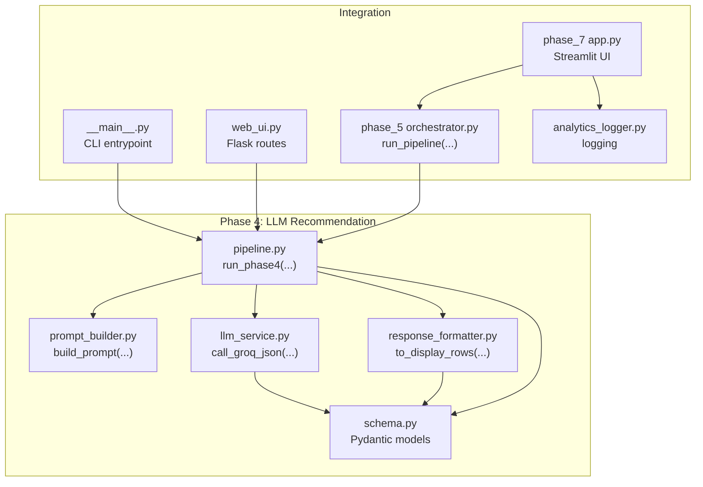
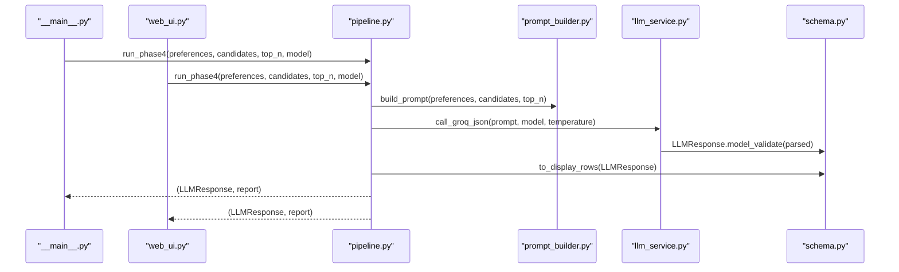
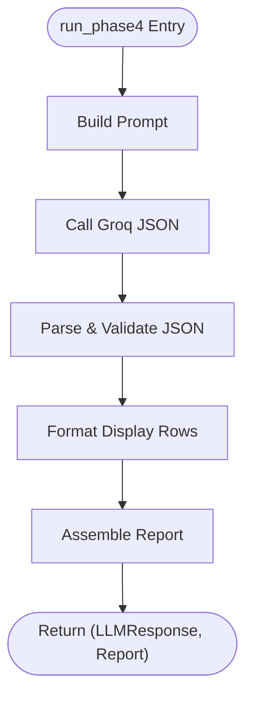
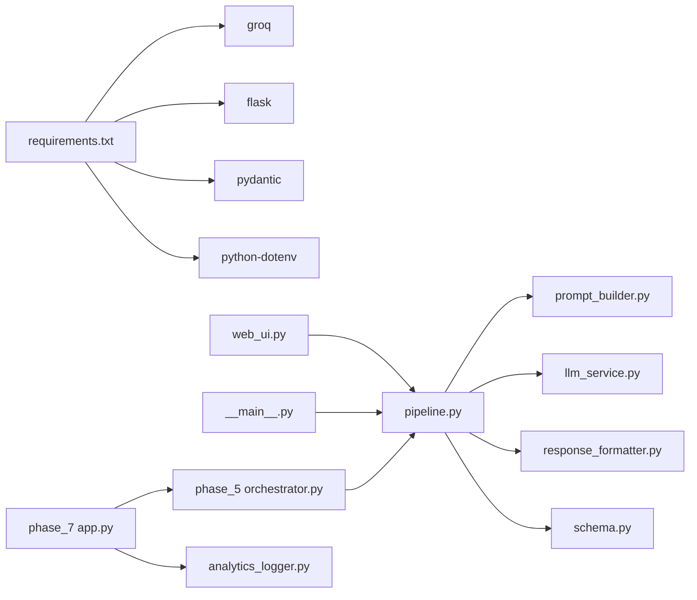

# Recommendation Pipeline

<cite>
**Referenced Files in This Document**
- [pipeline.py](file://Zomato/architecture/phase_4_llm_recommendation/pipeline.py)
- [llm_service.py](file://Zomato/architecture/phase_4_llm_recommendation/llm_service.py)
- [prompt_builder.py](file://Zomato/architecture/phase_4_llm_recommendation/prompt_builder.py)
- [response_formatter.py](file://Zomato/architecture/phase_4_llm_recommendation/response_formatter.py)
- [schema.py](file://Zomato/architecture/phase_4_llm_recommendation/schema.py)
- [__main__.py](file://Zomato/architecture/phase_4_llm_recommendation/__main__.py)
- [web_ui.py](file://Zomato/architecture/phase_4_llm_recommendation/web_ui.py)
- [index.html](file://Zomato/architecture/phase_4_llm_recommendation/templates/index.html)
- [requirements.txt](file://Zomato/architecture/phase_4_llm_recommendation/requirements.txt)
- [orchestrator.py](file://Zomato/architecture/phase_5_response_delivery/backend/orchestrator.py)
- [analytics_logger.py](file://Zomato/architecture/phase_6_monitoring/backend/analytics_logger.py)
- [app.py](file://Zomato/architecture/phase_7_deployment/app.py)
</cite>

## Table of Contents
1. [Introduction](#introduction)
2. [Project Structure](#project-structure)
3. [Core Components](#core-components)
4. [Architecture Overview](#architecture-overview)
5. [Detailed Component Analysis](#detailed-component-analysis)
6. [Dependency Analysis](#dependency-analysis)
7. [Performance Considerations](#performance-considerations)
8. [Troubleshooting Guide](#troubleshooting-guide)
9. [Conclusion](#conclusion)
10. [Appendices](#appendices)

## Introduction
This document describes the Recommendation Pipeline component responsible for transforming user preferences and a shortlist of candidate restaurants into a ranked, explainable recommendation list powered by a Groq LLM. It covers the orchestration flow, data transformations, error handling, configuration options, monitoring hooks, and operational resilience strategies. The pipeline integrates tightly with earlier phases (data foundation, preference capture, candidate retrieval) and earlier delivery/monitoring/deployment phases to form a complete end-to-end system.

## Project Structure
The Recommendation Pipeline lives in phase 4 of the architecture and is composed of:
- Orchestration and CLI entrypoints
- Prompt construction
- LLM service integration
- Response formatting
- Schema definitions
- Web UI and templates
- Integration with the broader orchestrator and monitoring stack

**Diagram sources**
- [pipeline.py:29-46](file://Zomato/architecture/phase_4_llm_recommendation/pipeline.py#L29-L46)
- [prompt_builder.py:10-44](file://Zomato/architecture/phase_4_llm_recommendation/prompt_builder.py#L10-L44)
- [llm_service.py:19-42](file://Zomato/architecture/phase_4_llm_recommendation/llm_service.py#L19-L42)
- [response_formatter.py:8-21](file://Zomato/architecture/phase_4_llm_recommendation/response_formatter.py#L8-L21)
- [schema.py:8-38](file://Zomato/architecture/phase_4_llm_recommendation/schema.py#L8-L38)
- [__main__.py:11-36](file://Zomato/architecture/phase_4_llm_recommendation/__main__.py#L11-L36)
- [web_ui.py:73-99](file://Zomato/architecture/phase_4_llm_recommendation/web_ui.py#L73-L99)
- [orchestrator.py:112-291](file://Zomato/architecture/phase_5_response_delivery/backend/orchestrator.py#L112-L291)
- [analytics_logger.py:46-70](file://Zomato/architecture/phase_6_monitoring/backend/analytics_logger.py#L46-L70)
- [app.py:96-127](file://Zomato/architecture/phase_7_deployment/app.py#L96-L127)

**Section sources**
- [pipeline.py:1-47](file://Zomato/architecture/phase_4_llm_recommendation/pipeline.py#L1-L47)
- [prompt_builder.py:1-45](file://Zomato/architecture/phase_4_llm_recommendation/prompt_builder.py#L1-L45)
- [llm_service.py:1-43](file://Zomato/architecture/phase_4_llm_recommendation/llm_service.py#L1-L43)
- [response_formatter.py:1-22](file://Zomato/architecture/phase_4_llm_recommendation/response_formatter.py#L1-L22)
- [schema.py:1-38](file://Zomato/architecture/phase_4_llm_recommendation/schema.py#L1-L38)
- [__main__.py:1-41](file://Zomato/architecture/phase_4_llm_recommendation/__main__.py#L1-L41)
- [web_ui.py:1-108](file://Zomato/architecture/phase_4_llm_recommendation/web_ui.py#L1-L108)
- [index.html:1-54](file://Zomato/architecture/phase_4_llm_recommendation/templates/index.html#L1-L54)
- [requirements.txt:1-5](file://Zomato/architecture/phase_4_llm_recommendation/requirements.txt#L1-L5)
- [orchestrator.py:1-292](file://Zomato/architecture/phase_5_response_delivery/backend/orchestrator.py#L1-L292)
- [analytics_logger.py:1-87](file://Zomato/architecture/phase_6_monitoring/backend/analytics_logger.py#L1-L87)
- [app.py:1-128](file://Zomato/architecture/phase_7_deployment/app.py#L1-L128)

## Core Components
- Orchestration (run_phase4): Loads preferences and candidates, builds a prompt, calls the LLM, formats the response, and produces a report.
- Prompt Builder: Constructs a strict JSON-schema prompt embedding user preferences and candidate attributes.
- LLM Service: Wraps Groq chat completions, validates and parses JSON responses, and enforces robust error handling.
- Response Formatter: Converts structured LLM output into display-friendly rows.
- Schemas: Pydantic models for typed inputs, outputs, and recommendations.
- CLI/Web Entrypoints: Provide programmatic and interactive ways to run the pipeline.
- Orchestrator Integration: Chains Phase 3 candidates with Phase 4 LLM ranking and provides fallbacks.
- Monitoring: Logs queries and feedback for analytics.

**Section sources**
- [pipeline.py:15-46](file://Zomato/architecture/phase_4_llm_recommendation/pipeline.py#L15-L46)
- [prompt_builder.py:10-44](file://Zomato/architecture/phase_4_llm_recommendation/prompt_builder.py#L10-L44)
- [llm_service.py:19-42](file://Zomato/architecture/phase_4_llm_recommendation/llm_service.py#L19-L42)
- [response_formatter.py:8-21](file://Zomato/architecture/phase_4_llm_recommendation/response_formatter.py#L8-L21)
- [schema.py:8-38](file://Zomato/architecture/phase_4_llm_recommendation/schema.py#L8-L38)
- [__main__.py:11-36](file://Zomato/architecture/phase_4_llm_recommendation/__main__.py#L11-L36)
- [web_ui.py:73-99](file://Zomato/architecture/phase_4_llm_recommendation/web_ui.py#L73-L99)
- [orchestrator.py:112-291](file://Zomato/architecture/phase_5_response_delivery/backend/orchestrator.py#L112-L291)
- [analytics_logger.py:46-70](file://Zomato/architecture/phase_6_monitoring/backend/analytics_logger.py#L46-L70)

## Architecture Overview
The Recommendation Pipeline executes a deterministic, typed workflow:
1. Input validation: Preferences and candidates are validated against Pydantic schemas.
2. Prompt construction: A structured prompt is built with explicit JSON schema requirements.
3. LLM invocation: Groq chat completion is called with a constrained system message and sanitized user content.
4. Response parsing: The returned text is isolated to JSON and validated via Pydantic.
5. Formatting: Structured recommendations are transformed into display rows.
6. Reporting: A concise report captures counts, model, and preview.

**Diagram sources**
- [__main__.py:29-36](file://Zomato/architecture/phase_4_llm_recommendation/__main__.py#L29-L36)
- [web_ui.py:82-89](file://Zomato/architecture/phase_4_llm_recommendation/web_ui.py#L82-L89)
- [pipeline.py:29-46](file://Zomato/architecture/phase_4_llm_recommendation/pipeline.py#L29-L46)
- [prompt_builder.py:10-44](file://Zomato/architecture/phase_4_llm_recommendation/prompt_builder.py#L10-L44)
- [llm_service.py:19-42](file://Zomato/architecture/phase_4_llm_recommendation/llm_service.py#L19-L42)
- [schema.py:35-38](file://Zomato/architecture/phase_4_llm_recommendation/schema.py#L35-L38)

## Detailed Component Analysis

### Orchestration: run_phase4
Responsibilities:
- Build a prompt from preferences and candidates.
- Call the Groq LLM with a controlled model and temperature.
- Convert the LLM’s JSON response into a strongly-typed model.
- Produce a compact report summarizing counts and preview.

Key behaviors:
- Validates inputs and raises explicit errors for malformed JSON.
- Enforces top-N selection and model selection.
- Aggregates a report with candidate counts, returned count, model, requested top-N, summary, and a preview slice.

**Diagram sources**
- [pipeline.py:29-46](file://Zomato/architecture/phase_4_llm_recommendation/pipeline.py#L29-L46)
- [prompt_builder.py:10-44](file://Zomato/architecture/phase_4_llm_recommendation/prompt_builder.py#L10-L44)
- [llm_service.py:19-42](file://Zomato/architecture/phase_4_llm_recommendation/llm_service.py#L19-L42)
- [response_formatter.py:8-21](file://Zomato/architecture/phase_4_llm_recommendation/response_formatter.py#L8-L21)

**Section sources**
- [pipeline.py:29-46](file://Zomato/architecture/phase_4_llm_recommendation/pipeline.py#L29-L46)

### Prompt Builder: build_prompt
Responsibilities:
- Serialize preferences and candidates into a structured prompt.
- Enforce strict JSON schema requirements and constraints.
- Provide clear instructions for ranking and explanation.

Design notes:
- Uses indentation for readability in logs and debugging.
- Embeds explicit schema requirements and constraints to guide the LLM.

**Section sources**
- [prompt_builder.py:10-44](file://Zomato/architecture/phase_4_llm_recommendation/prompt_builder.py#L10-L44)

### LLM Service: call_groq_json
Responsibilities:
- Initialize Groq client using environment-provided API key.
- Send a system message plus user prompt to the selected model.
- Extract and parse JSON from the model’s response, with robust error handling.

Error handling highlights:
- Validates presence of API key.
- Strips and isolates JSON from potential surrounding text.
- Raises descriptive errors when JSON cannot be extracted.

**Section sources**
- [llm_service.py:19-42](file://Zomato/architecture/phase_4_llm_recommendation/llm_service.py#L19-L42)

### Response Formatter: to_display_rows
Responsibilities:
- Transform the LLM response into a list of dictionaries suitable for rendering.

Behavior:
- Iterates over recommendations and extracts fields for display.

**Section sources**
- [response_formatter.py:8-21](file://Zomato/architecture/phase_4_llm_recommendation/response_formatter.py#L8-L21)

### Schemas: CandidateInput, PreferencesInput, RankedRecommendation, LLMResponse
Responsibilities:
- Define the shape and validation rules for inputs and outputs.
- Enforce constraints (e.g., rating and cost ranges) and optional fields.

Validation coverage:
- CandidateInput: restaurant metadata and match reasons.
- PreferencesInput: location, budget category, cuisines, minimum rating, optional preferences.
- RankedRecommendation: rank, restaurant identity, explanation, ratings, costs, cuisines.
- LLMResponse: summary and recommendations.

**Section sources**
- [schema.py:8-38](file://Zomato/architecture/phase_4_llm_recommendation/schema.py#L8-L38)

### CLI Entrypoint: __main__.py
Responsibilities:
- Parse CLI arguments for model, top-N, and input file paths.
- Load candidates and preferences.
- Execute run_phase4 and print results and report.

Operational notes:
- Requires both candidates and preferences when running in CLI mode.
- Supports launching a web UI via a flag.

**Section sources**
- [__main__.py:11-36](file://Zomato/architecture/phase_4_llm_recommendation/__main__.py#L11-L36)

### Web UI: web_ui.py and index.html
Responsibilities:
- Provide a browser interface to submit preferences and candidates.
- Parse incoming payloads, validate with schemas, and run the pipeline.
- Render results, reports, and errors.

UI behavior:
- Pre-populates default preferences and candidates.
- On submission, renders either success or error pages with full stack traces.

**Section sources**
- [web_ui.py:73-99](file://Zomato/architecture/phase_4_llm_recommendation/web_ui.py#L73-L99)
- [index.html:22-51](file://Zomato/architecture/phase_4_llm_recommendation/templates/index.html#L22-L51)

### Integration with Orchestrator and Deployment
- Orchestrator:
  - Loads candidates from Phase 3, validates them, and passes them to Phase 4.
  - Handles environment configuration and imports Phase 4 modules dynamically.
  - Provides fallback to sample recommendations when Groq key is missing or LLM fails.
- Deployment:
  - Streamlit app invokes the orchestrator, measures latency, logs queries, and displays feedback controls.

**Section sources**
- [orchestrator.py:112-291](file://Zomato/architecture/phase_5_response_delivery/backend/orchestrator.py#L112-L291)
- [app.py:96-127](file://Zomato/architecture/phase_7_deployment/app.py#L96-L127)

## Dependency Analysis
External dependencies:
- Groq SDK for model inference.
- Flask for the web UI.
- Pydantic for schema validation.
- python-dotenv for environment configuration.

Internal dependencies:
- pipeline.py depends on prompt_builder.py, llm_service.py, response_formatter.py, and schema.py.
- web_ui.py and __main__.py depend on pipeline.py and schema.py.
- Orchestrator dynamically imports Phase 4 pipeline and schema modules.

**Diagram sources**
- [requirements.txt:1-5](file://Zomato/architecture/phase_4_llm_recommendation/requirements.txt#L1-L5)
- [pipeline.py:9-12](file://Zomato/architecture/phase_4_llm_recommendation/pipeline.py#L9-L12)
- [web_ui.py:10-11](file://Zomato/architecture/phase_4_llm_recommendation/web_ui.py#L10-L11)
- [__main__.py](file://Zomato/architecture/phase_4_llm_recommendation/__main__.py#L8)
- [orchestrator.py:220-234](file://Zomato/architecture/phase_5_response_delivery/backend/orchestrator.py#L220-L234)
- [app.py:21-22](file://Zomato/architecture/phase_7_deployment/app.py#L21-L22)

**Section sources**
- [requirements.txt:1-5](file://Zomato/architecture/phase_4_llm_recommendation/requirements.txt#L1-L5)
- [pipeline.py:9-12](file://Zomato/architecture/phase_4_llm_recommendation/pipeline.py#L9-L12)
- [web_ui.py:10-11](file://Zomato/architecture/phase_4_llm_recommendation/web_ui.py#L10-L11)
- [__main__.py](file://Zomato/architecture/phase_4_llm_recommendation/__main__.py#L8)
- [orchestrator.py:220-234](file://Zomato/architecture/phase_5_response_delivery/backend/orchestrator.py#L220-L234)
- [app.py:21-22](file://Zomato/architecture/phase_7_deployment/app.py#L21-L22)

## Performance Considerations
- Model selection: The pipeline supports swapping models via the model parameter. Larger or more capable models may improve quality but increase latency and cost.
- Temperature tuning: Lower temperature reduces randomness and improves consistency; adjust based on desired stability vs. creativity.
- Batch and parallelization:
  - The Phase 4 pipeline itself processes a single request per call.
  - Parallelism can be introduced at the orchestrator level by invoking multiple run_phase4 calls concurrently for independent preference sets.
  - Consider batching candidates per request to reduce overhead; however, ensure the prompt remains within model limits.
- Latency measurement:
  - The deployment app measures end-to-end latency and logs it for analytics.
- Caching and retries:
  - Introduce retry logic around LLM calls with exponential backoff.
  - Cache prompt templates and frequently used constants to minimize repeated work.
- Resource limits:
  - Monitor Groq rate limits and implement throttling or queueing.
  - Validate input sizes to prevent oversized prompts.

[No sources needed since this section provides general guidance]

## Troubleshooting Guide
Common issues and resolutions:
- Missing API key:
  - Symptom: Runtime error indicating missing API key.
  - Resolution: Set GROQ_API_KEY in the environment.
- Malformed JSON responses:
  - Symptom: ValueError indicating non-JSON response.
  - Resolution: Ensure the prompt enforces JSON-only output and validate the LLM’s adherence to schema.
- Invalid input payloads:
  - Symptom: Validation errors when loading preferences or candidates.
  - Resolution: Verify JSON structure matches schema definitions.
- Web UI errors:
  - Symptom: Error page with stack trace.
  - Resolution: Inspect the rendered error and fix input JSON or environment configuration.
- Orchestrator fallback:
  - Symptom: Sample recommendations returned instead of LLM results.
  - Resolution: Confirm Groq API key availability and network connectivity; review logs for exceptions.

**Section sources**
- [llm_service.py:20-22](file://Zomato/architecture/phase_4_llm_recommendation/llm_service.py#L20-L22)
- [llm_service.py:39-42](file://Zomato/architecture/phase_4_llm_recommendation/llm_service.py#L39-L42)
- [web_ui.py:91-99](file://Zomato/architecture/phase_4_llm_recommendation/web_ui.py#L91-L99)
- [orchestrator.py:212-213](file://Zomato/architecture/phase_5_response_delivery/backend/orchestrator.py#L212-L213)
- [orchestrator.py:266-270](file://Zomato/architecture/phase_5_response_delivery/backend/orchestrator.py#L266-L270)

## Conclusion
The Recommendation Pipeline composes a robust, typed workflow that transforms user preferences and candidate lists into high-quality, explainable recommendations. Its design emphasizes strong validation, clear error propagation, and graceful fallbacks. Integrated with the broader orchestrator and monitoring stack, it supports reliable operation under varying loads and environments, while enabling future enhancements such as parallel execution and advanced caching strategies.

[No sources needed since this section summarizes without analyzing specific files]

## Appendices

### Configuration Options
- CLI:
  - --web: Launch the web UI.
  - --candidates-path: Path to candidates JSON.
  - --preferences-path: Path to preferences JSON.
  - --top-n: Number of recommendations to return.
  - --model: Groq model identifier.
- Environment:
  - GROQ_API_KEY: Required for LLM calls.
- Web UI:
  - Inputs: model, top_n, preferences_json, candidates_json.

**Section sources**
- [__main__.py:12-18](file://Zomato/architecture/phase_4_llm_recommendation/__main__.py#L12-L18)
- [web_ui.py:75-77](file://Zomato/architecture/phase_4_llm_recommendation/web_ui.py#L75-L77)
- [llm_service.py:20-22](file://Zomato/architecture/phase_4_llm_recommendation/llm_service.py#L20-L22)

### Example Execution Paths
- CLI end-to-end:
  - Load candidates and preferences → run_phase4 → print response and report.
- Web end-to-end:
  - Submit form → parse and validate → run_phase4 → render result or error.

**Section sources**
- [__main__.py:29-36](file://Zomato/architecture/phase_4_llm_recommendation/__main__.py#L29-L36)
- [web_ui.py:82-89](file://Zomato/architecture/phase_4_llm_recommendation/web_ui.py#L82-L89)

### Monitoring and Metrics
- Query logging:
  - Logs preferences, number of recommendations, and latency to a SQLite database.
- Feedback logging:
  - Records user likes/dislikes per recommendation.
- Deployment:
  - Measures latency and triggers analytics logging after successful pipeline runs.

**Section sources**
- [analytics_logger.py:46-70](file://Zomato/architecture/phase_6_monitoring/backend/analytics_logger.py#L46-L70)
- [app.py:99-103](file://Zomato/architecture/phase_7_deployment/app.py#L99-L103)