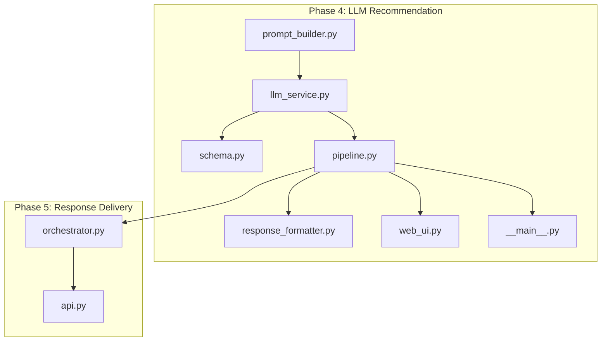
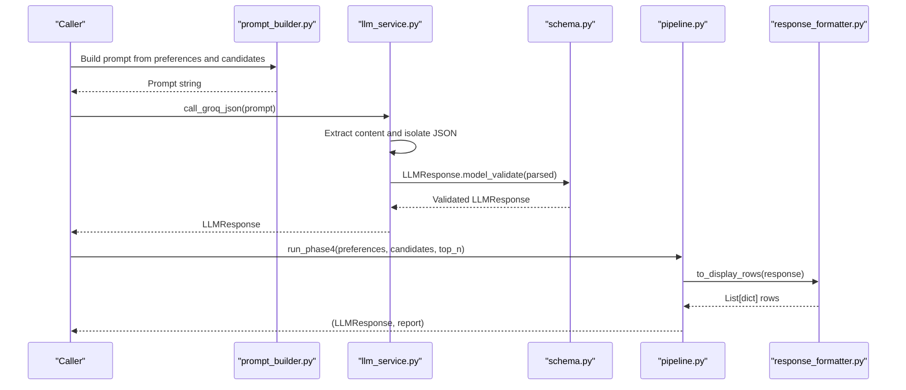
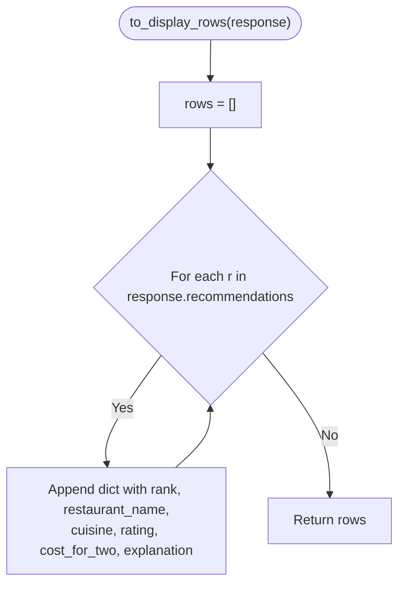
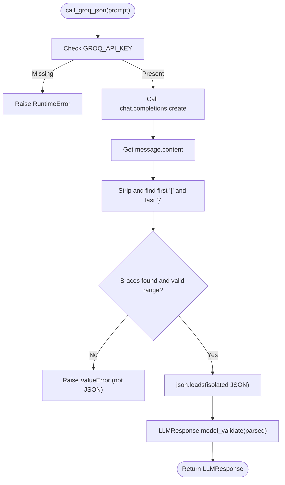
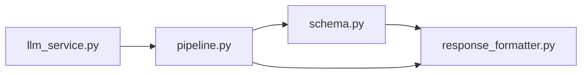

# Response Formatting

<cite>
**Referenced Files in This Document**
- [response_formatter.py](file://Zomato/architecture/phase_4_llm_recommendation/response_formatter.py)
- [schema.py](file://Zomato/architecture/phase_4_llm_recommendation/schema.py)
- [llm_service.py](file://Zomato/architecture/phase_4_llm_recommendation/llm_service.py)
- [prompt_builder.py](file://Zomato/architecture/phase_4_llm_recommendation/prompt_builder.py)
- [pipeline.py](file://Zomato/architecture/phase_4_llm_recommendation/pipeline.py)
- [web_ui.py](file://Zomato/architecture/phase_4_llm_recommendation/web_ui.py)
- [__main__.py](file://Zomato/architecture/phase_4_llm_recommendation/__main__.py)
- [orchestrator.py](file://Zomato/architecture/phase_5_response_delivery/backend/orchestrator.py)
- [api.py](file://Zomato/architecture/phase_5_response_delivery/backend/api.py)
- [sample_candidates.json](file://Zomato/architecture/phase_4_llm_recommendation/sample_candidates.json)
- [sample_preferences.json](file://Zomato/architecture/phase_4_llm_recommendation/sample_preferences.json)
</cite>

## Table of Contents
1. [Introduction](#introduction)
2. [Project Structure](#project-structure)
3. [Core Components](#core-components)
4. [Architecture Overview](#architecture-overview)
5. [Detailed Component Analysis](#detailed-component-analysis)
6. [Dependency Analysis](#dependency-analysis)
7. [Performance Considerations](#performance-considerations)
8. [Troubleshooting Guide](#troubleshooting-guide)
9. [Conclusion](#conclusion)

## Introduction
This document explains the Response Formatting component responsible for transforming raw LLM outputs into a standardized, structured recommendation format. It focuses on the transformation pipeline from the LLM’s JSON response to a list of display-ready rows and how the LLMResponse schema ensures downstream consistency. It also covers error handling for malformed responses, validation rules, fallback mechanisms, and performance considerations for batch processing.

## Project Structure
The Response Formatting component resides in Phase 4 of the recommendation pipeline. The relevant files are:
- Response formatter: converts validated LLMResponse into a list of dictionaries suitable for display.
- Schema: defines LLMResponse, RankedRecommendation, and related Pydantic models.
- LLM service: calls the LLM, extracts JSON, and validates it against LLMResponse.
- Prompt builder: constructs the prompt ensuring the LLM adheres to the required JSON schema.
- Pipeline: orchestrates loading inputs, building prompts, invoking the LLM, validating, and formatting outputs.
- Web UI and CLI: entrypoints that demonstrate usage and error propagation.
- Phase 5 orchestrator and API: consume formatted recommendations and provide fallback behavior when LLM calls fail.

**Diagram sources**
- [prompt_builder.py:1-45](file://Zomato/architecture/phase_4_llm_recommendation/prompt_builder.py#L1-L45)
- [llm_service.py:1-43](file://Zomato/architecture/phase_4_llm_recommendation/llm_service.py#L1-L43)
- [schema.py:1-38](file://Zomato/architecture/phase_4_llm_recommendation/schema.py#L1-L38)
- [response_formatter.py:1-22](file://Zomato/architecture/phase_4_llm_recommendation/response_formatter.py#L1-L22)
- [pipeline.py:1-47](file://Zomato/architecture/phase_4_llm_recommendation/pipeline.py#L1-L47)
- [web_ui.py:1-108](file://Zomato/architecture/phase_4_llm_recommendation/web_ui.py#L1-L108)
- [__main__.py:1-41](file://Zomato/architecture/phase_4_llm_recommendation/__main__.py#L1-L41)
- [orchestrator.py:1-292](file://Zomato/architecture/phase_5_response_delivery/backend/orchestrator.py#L1-L292)
- [api.py:1-84](file://Zomato/architecture/phase_5_response_delivery/backend/api.py#L1-L84)

**Section sources**
- [response_formatter.py:1-22](file://Zomato/architecture/phase_4_llm_recommendation/response_formatter.py#L1-L22)
- [schema.py:1-38](file://Zomato/architecture/phase_4_llm_recommendation/schema.py#L1-L38)
- [llm_service.py:1-43](file://Zomato/architecture/phase_4_llm_recommendation/llm_service.py#L1-L43)
- [prompt_builder.py:1-45](file://Zomato/architecture/phase_4_llm_recommendation/prompt_builder.py#L1-L45)
- [pipeline.py:1-47](file://Zomato/architecture/phase_4_llm_recommendation/pipeline.py#L1-L47)
- [web_ui.py:1-108](file://Zomato/architecture/phase_4_llm_recommendation/web_ui.py#L1-L108)
- [__main__.py:1-41](file://Zomato/architecture/phase_4_llm_recommendation/__main__.py#L1-L41)
- [orchestrator.py:1-292](file://Zomato/architecture/phase_5_response_delivery/backend/orchestrator.py#L1-L292)
- [api.py:1-84](file://Zomato/architecture/phase_5_response_delivery/backend/api.py#L1-L84)

## Core Components
- LLMResponse: Root model containing a summary and a list of RankedRecommendation entries. It is constructed from validated JSON returned by the LLM.
- RankedRecommendation: Defines the structure of each recommendation with required fields (rank, restaurant_name, explanation) and optional fields (rating, cost_for_two, cuisine).
- to_display_rows: Transforms a validated LLMResponse into a list of dictionaries for downstream rendering and reporting.

Key behaviors:
- Validation occurs during LLM response parsing via LLMResponse.model_validate.
- The formatter preserves the order of recommendations as provided by the LLM.
- Optional fields are carried forward when present; downstream consumers should handle None values appropriately.

**Section sources**
- [schema.py:26-38](file://Zomato/architecture/phase_4_llm_recommendation/schema.py#L26-L38)
- [response_formatter.py:8-22](file://Zomato/architecture/phase_4_llm_recommendation/response_formatter.py#L8-L22)

## Architecture Overview
The response formatting pipeline integrates the prompt, LLM call, schema validation, and formatting into a cohesive flow. The figure below maps the actual code components involved in transforming raw LLM JSON into structured recommendations.

**Diagram sources**
- [prompt_builder.py:10-45](file://Zomato/architecture/phase_4_llm_recommendation/prompt_builder.py#L10-L45)
- [llm_service.py:19-43](file://Zomato/architecture/phase_4_llm_recommendation/llm_service.py#L19-L43)
- [schema.py:35-38](file://Zomato/architecture/phase_4_llm_recommendation/schema.py#L35-L38)
- [pipeline.py:29-47](file://Zomato/architecture/phase_4_llm_recommendation/pipeline.py#L29-L47)
- [response_formatter.py:8-22](file://Zomato/architecture/phase_4_llm_recommendation/response_formatter.py#L8-L22)

## Detailed Component Analysis

### Response Formatter: to_display_rows
Purpose:
- Convert a validated LLMResponse into a list of dictionaries optimized for display and reporting.

Processing logic:
- Iterates over response.recommendations.
- For each recommendation, extracts rank, restaurant_name, cuisine, rating, cost_for_two, and explanation.
- Preserves ordering and includes optional fields when present.

Data flow:
- Input: LLMResponse (validated)
- Output: list[dict] with keys: rank, restaurant_name, cuisine, rating, cost_for_two, explanation

Validation and error handling:
- Since the input is a validated LLMResponse, field presence and types are guaranteed by Pydantic.
- No explicit runtime checks are performed in the formatter; errors would surface earlier in the pipeline.

Integration with downstream components:
- The pipeline uses the returned rows for preview and reporting.
- Phase 5 orchestrator reconstructs a similar dictionary structure for API responses.

**Diagram sources**
- [response_formatter.py:8-22](file://Zomato/architecture/phase_4_llm_recommendation/response_formatter.py#L8-L22)

**Section sources**
- [response_formatter.py:8-22](file://Zomato/architecture/phase_4_llm_recommendation/response_formatter.py#L8-L22)
- [pipeline.py:37-46](file://Zomato/architecture/phase_4_llm_recommendation/pipeline.py#L37-L46)
- [orchestrator.py:246-257](file://Zomato/architecture/phase_5_response_delivery/backend/orchestrator.py#L246-L257)

### LLM Service: call_groq_json
Purpose:
- Call the LLM, extract the model’s response, isolate the JSON portion, and validate it against LLMResponse.

Key steps:
- Ensures environment variable availability.
- Sends a system message instructing JSON-only responses and a user prompt.
- Strips content and attempts to locate the first and last braces to extract JSON.
- Validates the extracted JSON with LLMResponse.model_validate.

Error handling:
- Raises a runtime error if the API key is missing.
- Raises a value error if the model response does not contain valid JSON after cleaning.

**Diagram sources**
- [llm_service.py:19-43](file://Zomato/architecture/phase_4_llm_recommendation/llm_service.py#L19-L43)
- [schema.py:35-38](file://Zomato/architecture/phase_4_llm_recommendation/schema.py#L35-L38)

**Section sources**
- [llm_service.py:19-43](file://Zomato/architecture/phase_4_llm_recommendation/llm_service.py#L19-L43)
- [prompt_builder.py:13-44](file://Zomato/architecture/phase_4_llm_recommendation/prompt_builder.py#L13-L44)

### Pipeline: run_phase4
Purpose:
- Orchestrate the end-to-end process: load inputs, build prompt, call LLM, validate, format, and produce a report.

Highlights:
- Loads candidates and preferences from JSON files and validates them.
- Builds a prompt tailored to the user’s preferences and candidate set.
- Calls the LLM, validates the response, formats it for display, and prepares a compact report.

Downstream integration:
- The formatted rows are included in the report preview.
- The LLMResponse is returned for further processing or serialization.

**Section sources**
- [pipeline.py:15-47](file://Zomato/architecture/phase_4_llm_recommendation/pipeline.py#L15-L47)
- [__main__.py:11-37](file://Zomato/architecture/phase_4_llm_recommendation/__main__.py#L11-L37)
- [web_ui.py:73-99](file://Zomato/architecture/phase_4_llm_recommendation/web_ui.py#L73-L99)

### Schema Validation and Consistency
- LLMResponse.summary and recommendations are required.
- RankedRecommendation requires rank, restaurant_name, explanation; optional fields include rating, cost_for_two, cuisine.
- Pydantic enforces type constraints (e.g., rating and cost_for_two bounds) and presence of required fields.

Consistency with downstream components:
- Phase 5 orchestrator reconstructs a dictionary with the same keys as produced by to_display_rows.
- API returns a payload mirroring the recommended structure, ensuring compatibility across components.

**Section sources**
- [schema.py:26-38](file://Zomato/architecture/phase_4_llm_recommendation/schema.py#L26-L38)
- [orchestrator.py:246-264](file://Zomato/architecture/phase_5_response_delivery/backend/orchestrator.py#L246-L264)

### Fallback Mechanisms
When the LLM call fails:
- Phase 5 orchestrator falls back to returning Phase 3-ranked candidates with synthesized explanations.
- This maintains a consistent response shape for downstream consumers.

**Section sources**
- [orchestrator.py:266-291](file://Zomato/architecture/phase_5_response_delivery/backend/orchestrator.py#L266-L291)

## Dependency Analysis
The response formatting component depends on:
- schema.py for LLMResponse and RankedRecommendation definitions.
- llm_service.py for validated LLMResponse instances.
- pipeline.py for assembling the validated response and formatting it for display.

**Diagram sources**
- [schema.py:1-38](file://Zomato/architecture/phase_4_llm_recommendation/schema.py#L1-L38)
- [response_formatter.py:1-22](file://Zomato/architecture/phase_4_llm_recommendation/response_formatter.py#L1-L22)
- [llm_service.py:1-43](file://Zomato/architecture/phase_4_llm_recommendation/llm_service.py#L1-L43)
- [pipeline.py:1-47](file://Zomato/architecture/phase_4_llm_recommendation/pipeline.py#L1-L47)

**Section sources**
- [response_formatter.py:1-22](file://Zomato/architecture/phase_4_llm_recommendation/response_formatter.py#L1-L22)
- [schema.py:1-38](file://Zomato/architecture/phase_4_llm_recommendation/schema.py#L1-L38)
- [llm_service.py:1-43](file://Zomato/architecture/phase_4_llm_recommendation/llm_service.py#L1-L43)
- [pipeline.py:1-47](file://Zomato/architecture/phase_4_llm_recommendation/pipeline.py#L1-L47)

## Performance Considerations
- Memory management:
  - to_display_rows iterates over recommendations and builds a new list of dictionaries. For very large recommendation lists, consider streaming or chunked processing if downstream consumers can accept partial results.
  - Avoid unnecessary copies by passing validated LLMResponse objects directly to downstream components when possible.
- Batch processing:
  - The current formatter operates per-response. For batched LLM calls, apply the formatter per LLMResponse to keep memory bounded.
- Validation overhead:
  - LLMResponse.model_validate is efficient but still introduces CPU cost. If throughput is critical, consider caching validated inputs and reusing them across runs.
- I/O and network:
  - LLM calls dominate latency. Minimize redundant calls and ensure prompt construction is deterministic to enable caching where applicable.

[No sources needed since this section provides general guidance]

## Troubleshooting Guide
Common issues and resolutions:
- Missing API key:
  - Symptom: Runtime error indicating missing GROQ_API_KEY.
  - Resolution: Set the environment variable before running the pipeline.
  - Section sources
    - [llm_service.py:20-22](file://Zomato/architecture/phase_4_llm_recommendation/llm_service.py#L20-L22)
- Model response not JSON:
  - Symptom: Value error indicating the model response is not JSON after cleaning.
  - Resolution: Ensure the prompt explicitly instructs JSON-only output and no extra text. Verify the model supports JSON output reliably.
  - Section sources
    - [llm_service.py:34-42](file://Zomato/architecture/phase_4_llm_recommendation/llm_service.py#L34-L42)
    - [prompt_builder.py:27-30](file://Zomato/architecture/phase_4_llm_recommendation/prompt_builder.py#L27-L30)
- Malformed LLMResponse:
  - Symptom: Validation error when constructing LLMResponse.
  - Resolution: Confirm the LLM adheres to the exact schema defined in LLMResponse and RankedRecommendation. Validate the schema fields and types.
  - Section sources
    - [schema.py:26-38](file://Zomato/architecture/phase_4_llm_recommendation/schema.py#L26-L38)
- Unexpected fields or types:
  - Symptom: Validation failure due to incorrect types or extra fields.
  - Resolution: Align LLM output strictly with the schema. Use the provided schema examples in the prompt to guide the model.
  - Section sources
    - [prompt_builder.py:30-43](file://Zomato/architecture/phase_4_llm_recommendation/prompt_builder.py#L30-L43)
- Downstream formatting mismatches:
  - Symptom: Consumers expect different keys or shapes.
  - Resolution: Ensure downstream components use the same dictionary structure as produced by to_display_rows or adapt them to match.
  - Section sources
    - [response_formatter.py:8-22](file://Zomato/architecture/phase_4_llm_recommendation/response_formatter.py#L8-L22)
    - [orchestrator.py:246-257](file://Zomato/architecture/phase_5_response_delivery/backend/orchestrator.py#L246-L257)

## Conclusion
The Response Formatting component provides a clean, validated transformation from raw LLM JSON to a standardized list of recommendation rows. Together with strict schema validation and robust error handling, it ensures downstream components receive consistent, well-formed recommendations. The pipeline’s fallback behavior in Phase 5 further guarantees resilience when LLM calls fail. For production workloads, consider batching strategies, memory-efficient iteration, and prompt refinement to improve reliability and performance.