# Web UI Integration

<cite>
**Referenced Files in This Document**
- [web_ui.py](file://Zomato/architecture/phase_4_llm_recommendation/web_ui.py)
- [index.html](file://Zomato/architecture/phase_4_llm_recommendation/templates/index.html)
- [index.html](file://Zomato/architecture/phase_5_response_delivery/frontend/index.html)
- [app.js](file://Zomato/architecture/phase_5_response_delivery/frontend/js/app.js)
- [styles.css](file://Zomato/architecture/phase_5_response_delivery/frontend/css/styles.css)
- [api.py](file://Zomato/architecture/phase_5_response_delivery/backend/api.py)
- [app.py](file://Zomato/architecture/phase_5_response_delivery/backend/app.py)
- [orchestrator.py](file://Zomato/architecture/phase_5_response_delivery/backend/orchestrator.py)
- [sample_recommendations.json](file://Zomato/architecture/phase_5_response_delivery/sample_recommendations.json)
- [metadata.json](file://Zomato/architecture/phase_5_response_delivery/metadata.json)
- [__main__.py](file://Zomato/architecture/phase_5_response_delivery/__main__.py)
- [requirements.txt](file://Zomato/architecture/phase_5_response_delivery/requirements.txt)
</cite>

## Table of Contents
1. [Introduction](#introduction)
2. [Project Structure](#project-structure)
3. [Core Components](#core-components)
4. [Architecture Overview](#architecture-overview)
5. [Detailed Component Analysis](#detailed-component-analysis)
6. [Integration Patterns](#integration-patterns)
7. [UI Rendering and Display](#ui-rendering-and-display)
8. [Interactive Features](#interactive-features)
9. [Real-time Updates](#real-time-updates)
10. [Responsive Design](#responsive-design)
11. [Accessibility Features](#accessibility-features)
12. [Error Handling](#error-handling)
13. [Performance Considerations](#performance-considerations)
14. [Customization Guide](#customization-guide)
15. [Troubleshooting Guide](#troubleshooting-guide)
16. [Conclusion](#con conclusion)

## Introduction

The Web UI Integration component represents the user-facing interface for the Zomato AI recommendation system. This component bridges the gap between the backend recommendation engine and the user, providing an intuitive interface for capturing preferences, displaying personalized restaurant recommendations, and facilitating user interaction with the AI-powered system.

The implementation spans two distinct phases of development:
- Phase 4: Basic Flask-based web UI for testing and demonstration
- Phase 5: Advanced React-like SPA with sophisticated UI patterns and real-time updates

Both implementations demonstrate different approaches to frontend-backend integration while maintaining consistent recommendation display patterns.

## Project Structure

The Web UI Integration is organized across multiple architectural phases, each building upon previous capabilities:

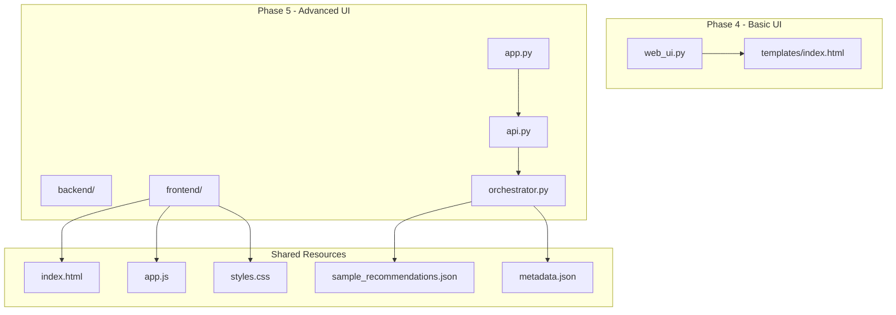

**Diagram sources**
- [web_ui.py:1-108](file://Zomato/architecture/phase_4_llm_recommendation/web_ui.py#L1-L108)
- [index.html:1-198](file://Zomato/architecture/phase_5_response_delivery/frontend/index.html#L1-L198)

**Section sources**
- [web_ui.py:1-108](file://Zomato/architecture/phase_4_llm_recommendation/web_ui.py#L1-L108)
- [index.html:1-198](file://Zomato/architecture/phase_5_response_delivery/frontend/index.html#L1-L198)

## Core Components

The Web UI Integration consists of several interconnected components that work together to deliver a seamless user experience:

### Backend Components

**Flask Application (Phase 4)**
- Central routing and request handling
- Template rendering for basic HTML interface
- JSON parsing and validation for preferences and candidates

**Advanced Flask Application (Phase 5)**
- Blueprinted API endpoints for clean separation of concerns
- CORS support for cross-origin requests
- Static file serving for frontend assets

### Frontend Components

**HTML Templates**
- Semantic markup with accessibility considerations
- Progressive enhancement for JavaScript-disabled environments
- Responsive design foundations

**JavaScript Application**
- State management for UI interactions
- Real-time API communication
- Dynamic content rendering and animations

**CSS Framework**
- Comprehensive design system with dark mode support
- Glassmorphism effects and modern UI patterns
- Responsive breakpoints for all device sizes

**Section sources**
- [web_ui.py:13-108](file://Zomato/architecture/phase_4_llm_recommendation/web_ui.py#L13-L108)
- [api.py:13-84](file://Zomato/architecture/phase_5_response_delivery/backend/api.py#L13-L84)
- [app.js:1-278](file://Zomato/architecture/phase_5_response_delivery/frontend/js/app.js#L1-L278)

## Architecture Overview

The Web UI Integration follows a client-server architecture pattern with clear separation of concerns:

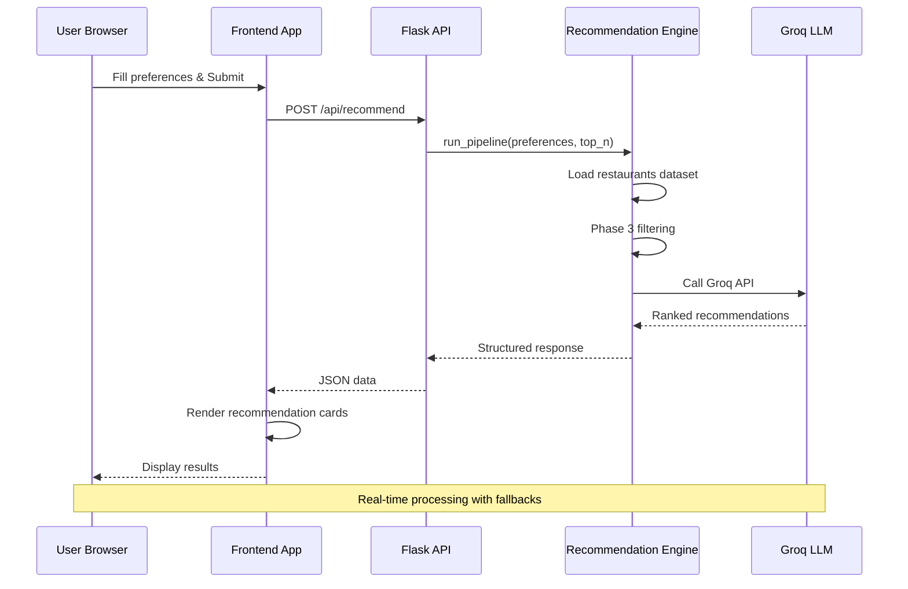

**Diagram sources**
- [app.js:182-205](file://Zomato/architecture/phase_5_response_delivery/frontend/js/app.js#L182-L205)
- [api.py:41-84](file://Zomato/architecture/phase_5_response_delivery/backend/api.py#L41-L84)
- [orchestrator.py:112-292](file://Zomato/architecture/phase_5_response_delivery/backend/orchestrator.py#L112-L292)

The architecture supports multiple deployment scenarios:
- Local development with hot reloading
- Production deployment with static asset caching
- Microservice architecture with separate frontend and backend containers

## Detailed Component Analysis

### Phase 4 Basic Web UI Implementation

The Phase 4 implementation provides a foundation for understanding the core UI patterns:

#### Flask Application Setup

The basic Flask application handles both GET and POST requests for recommendation processing:

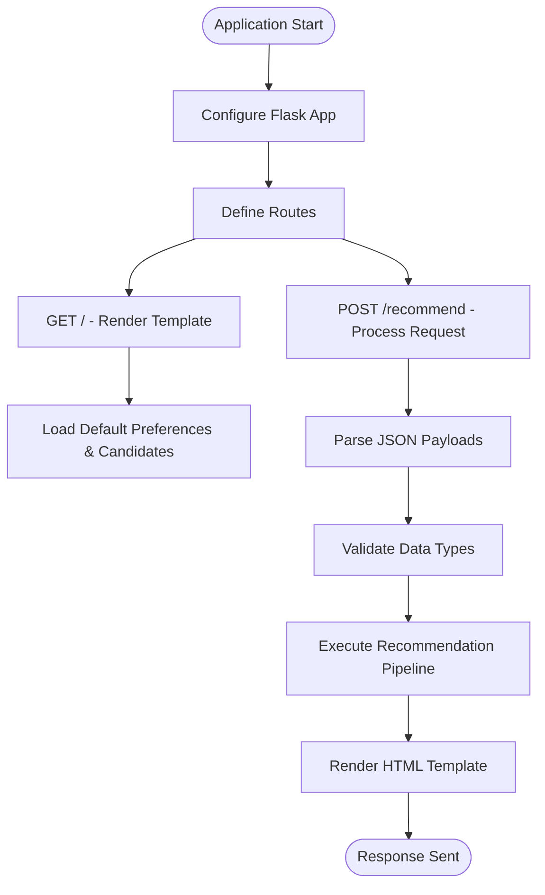

**Diagram sources**
- [web_ui.py:30-100](file://Zomato/architecture/phase_4_llm_recommendation/web_ui.py#L30-L100)

#### Template Structure Analysis

The HTML template provides a clean foundation for recommendation display:

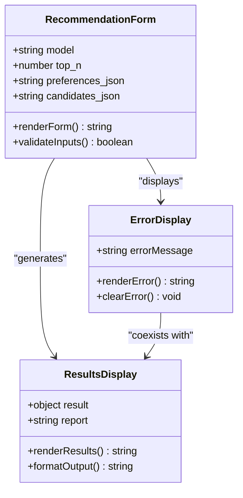

**Diagram sources**
- [index.html:22-51](file://Zomato/architecture/phase_4_llm_recommendation/templates/index.html#L22-L51)

**Section sources**
- [web_ui.py:30-100](file://Zomato/architecture/phase_4_llm_recommendation/web_ui.py#L30-L100)
- [index.html:1-54](file://Zomato/architecture/phase_4_llm_recommendation/templates/index.html#L1-L54)

### Phase 5 Advanced Web UI Implementation

The Phase 5 implementation represents a complete Single Page Application (SPA) with sophisticated UI patterns:

#### Frontend Application Architecture

The frontend application follows a reactive pattern with explicit state management:

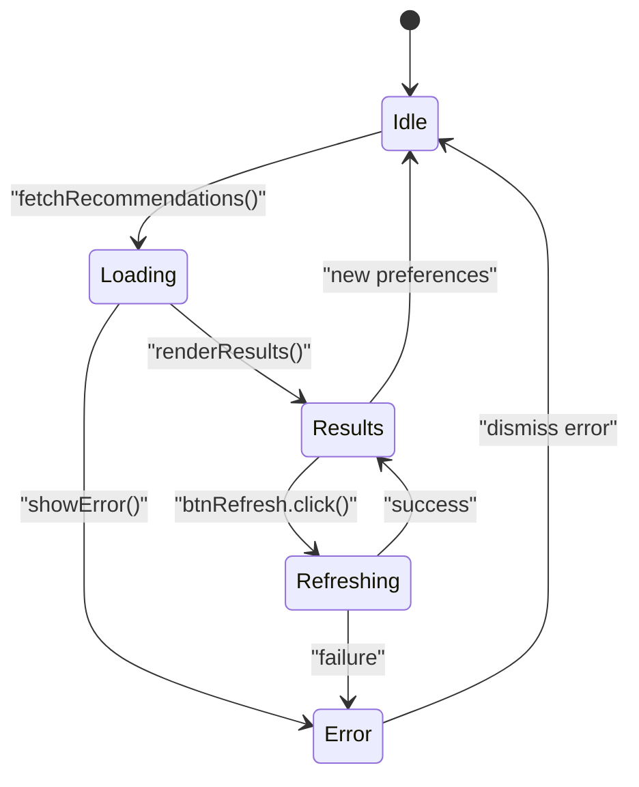

**Diagram sources**
- [app.js:77-90](file://Zomato/architecture/phase_5_response_delivery/frontend/js/app.js#L77-L90)

#### Recommendation Card Component

Each recommendation is rendered as a self-contained card with rich visual elements:

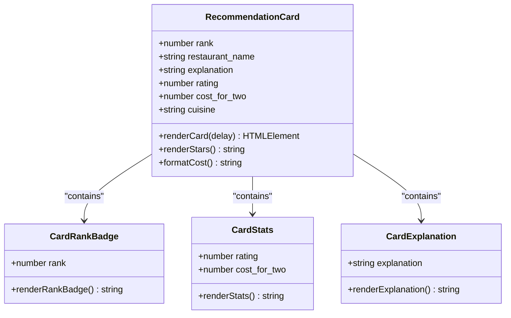

**Diagram sources**
- [app.js:113-150](file://Zomato/architecture/phase_5_response_delivery/frontend/js/app.js#L113-L150)

**Section sources**
- [app.js:112-179](file://Zomato/architecture/phase_5_response_delivery/frontend/js/app.js#L112-L179)

### Backend API Integration

The backend provides a comprehensive REST API with multiple endpoints:

```mermaid
graph LR
subgraph "API Endpoints"
Health[/api/health - Health Check]
Sample[/api/sample - Sample Data]
Metadata[/api/metadata - System Metadata]
Recommend[/api/recommend - Main Endpoint]
end
subgraph "Request Processing"
Validate[JSON Validation]
Transform[Data Transformation]
Pipeline[Recommendation Pipeline]
Fallback[Fallback Logic]
end
subgraph "Response Formats"
Success[200 OK - JSON]
Error[4xx/5xx - Error JSON]
end
Health --> Success
Sample --> Success
Metadata --> Success
Recommend --> Validate
Validate --> Transform
Transform --> Pipeline
Pipeline --> Fallback
Fallback --> Success
Success --> Error
```

**Diagram sources**
- [api.py:18-84](file://Zomato/architecture/phase_5_response_delivery/backend/api.py#L18-L84)
- [orchestrator.py:112-292](file://Zomato/architecture/phase_5_response_delivery/backend/orchestrator.py#L112-L292)

**Section sources**
- [api.py:18-84](file://Zomato/architecture/phase_5_response_delivery/backend/api.py#L18-L84)
- [app.py:14-41](file://Zomato/architecture/phase_5_response_delivery/backend/app.py#L14-L41)

## Integration Patterns

### Frontend-Backend Communication

The integration between frontend and backend follows RESTful patterns with clear request/response contracts:

#### Request Flow Pattern

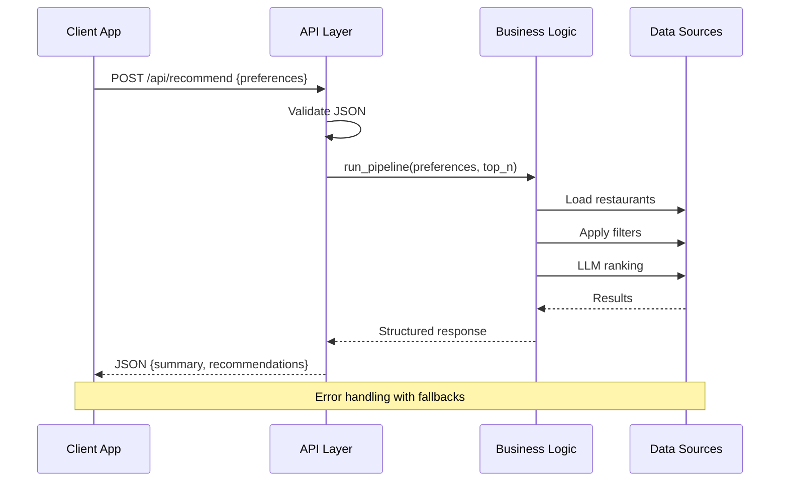

**Diagram sources**
- [app.js:182-205](file://Zomato/architecture/phase_5_response_delivery/frontend/js/app.js#L182-L205)
- [api.py:41-84](file://Zomato/architecture/phase_5_response_delivery/backend/api.py#L41-L84)

#### State Management Pattern

The frontend maintains explicit state for different UI conditions:

| State | Purpose | Elements Displayed |
|-------|---------|-------------------|
| `empty` | Initial state | Empty state + form |
| `loading` | API request in progress | Skeleton loaders |
| `results` | Recommendations ready | Cards grid |
| `error` | Request failed | Error banner |

**Section sources**
- [app.js:77-90](file://Zomato/architecture/phase_5_response_delivery/frontend/js/app.js#L77-L90)
- [app.js:182-205](file://Zomato/architecture/phase_5_response_delivery/frontend/js/app.js#L182-L205)

### Real-time Recommendation Display

The system supports real-time updates through multiple interaction patterns:

#### Interactive Preference System

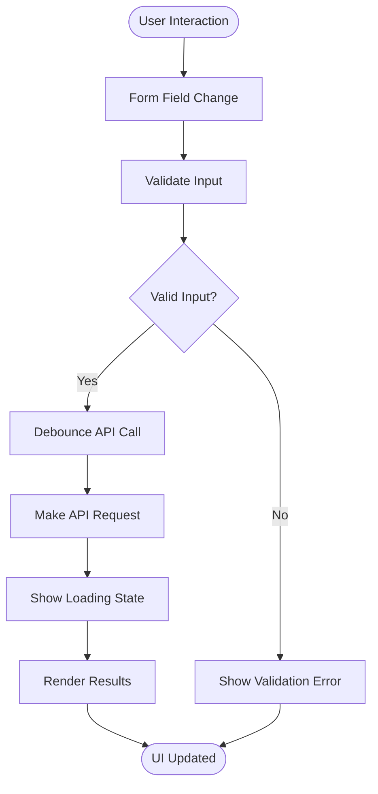

**Diagram sources**
- [app.js:61-74](file://Zomato/architecture/phase_5_response_delivery/frontend/js/app.js#L61-L74)
- [app.js:225-236](file://Zomato/architecture/phase_5_response_delivery/frontend/js/app.js#L225-L236)

**Section sources**
- [app.js:35-53](file://Zomato/architecture/phase_5_response_delivery/frontend/js/app.js#L35-L53)
- [app.js:225-246](file://Zomato/architecture/phase_5_response_delivery/frontend/js/app.js#L225-L246)

## UI Rendering and Display

### Recommendation Card Design

Each recommendation card follows a consistent design pattern optimized for readability and engagement:

#### Card Structure Components

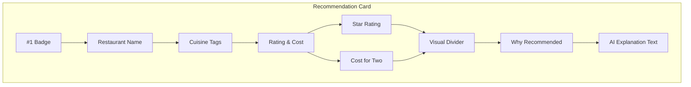

**Diagram sources**
- [app.js:113-150](file://Zomato/architecture/phase_5_response_delivery/frontend/js/app.js#L113-L150)

#### Visual Hierarchy and Typography

The design system establishes clear visual hierarchy:
- **Rank 1**: Gold accent with prominent styling
- **Rank 2**: Subtle highlighting
- **Other ranks**: Standard card styling
- **Typography**: Inter font family with careful sizing and weight progression

**Section sources**
- [styles.css:490-511](file://Zomato/architecture/phase_5_response_delivery/frontend/css/styles.css#L490-L511)
- [app.js:113-150](file://Zomato/architecture/phase_5_response_delivery/frontend/js/app.js#L113-L150)

### Loading States and Skeleton Screens

The application implements sophisticated loading states to maintain user engagement:

#### Skeleton Animation Pattern

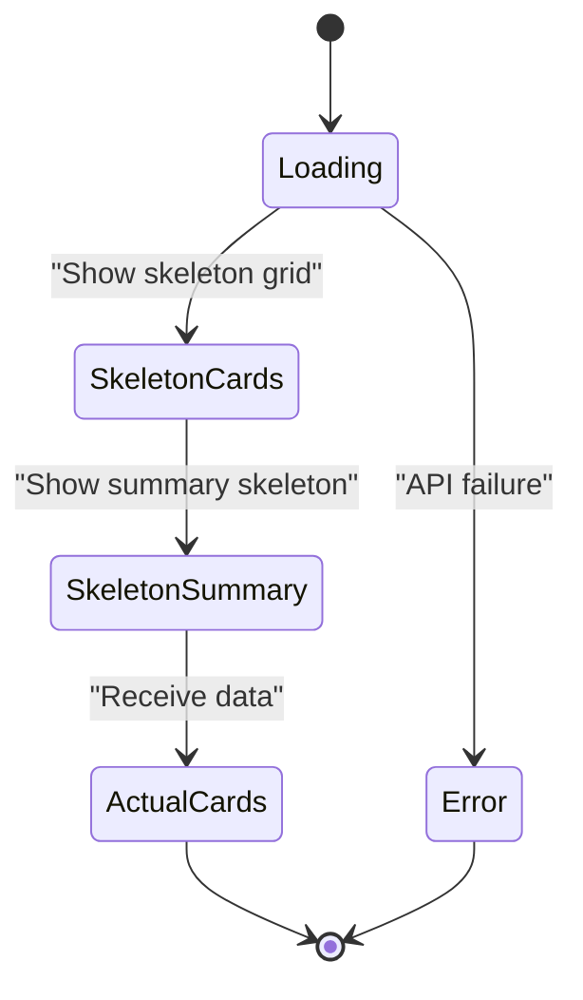

**Diagram sources**
- [index.html:150-158](file://Zomato/architecture/phase_5_response_delivery/frontend/index.html#L150-L158)
- [styles.css:345-365](file://Zomato/architecture/phase_5_response_delivery/frontend/css/styles.css#L345-L365)

**Section sources**
- [index.html:150-158](file://Zomato/architecture/phase_5_response_delivery/frontend/index.html#L150-L158)
- [styles.css:345-365](file://Zomato/architecture/phase_5_response_delivery/frontend/css/styles.css#L345-L365)

## Interactive Features

### Form Validation and User Experience

The form system provides immediate feedback and prevents invalid submissions:

#### Validation Flow

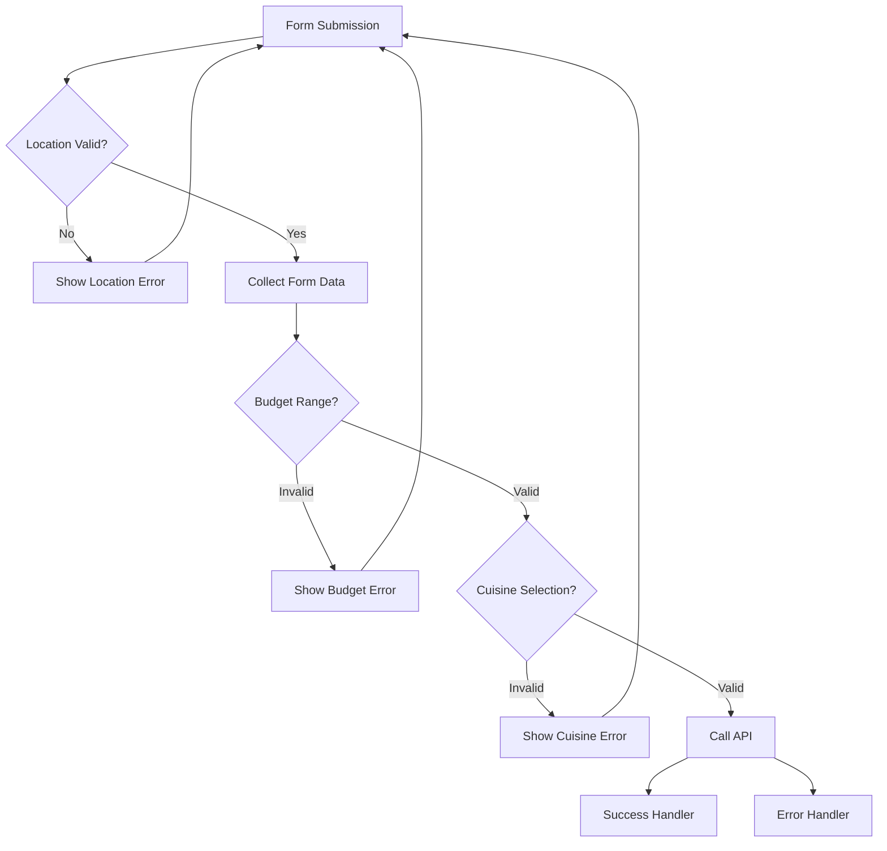

**Diagram sources**
- [app.js:225-236](file://Zomato/architecture/phase_5_response_delivery/frontend/js/app.js#L225-L236)
- [app.js:85-90](file://Zomato/architecture/phase_5_response_delivery/frontend/js/app.js#L85-L90)

#### Slider Interactions

The application includes interactive sliders with live preview functionality:

| Slider Type | Control Element | Live Preview | Validation |
|-------------|----------------|--------------|------------|
| Budget | Range input | Currency display | 200-4000 INR |
| Rating | Range input | Decimal display | 0.0-5.0 scale |
| Top N | Dropdown | Immediate effect | 1-20 results |

**Section sources**
- [app.js:35-53](file://Zomato/architecture/phase_5_response_delivery/frontend/js/app.js#L35-L53)
- [index.html:45-126](file://Zomato/architecture/phase_5_response_delivery/frontend/index.html#L45-L126)

### Sample Data Integration

The system provides sample data for demonstration and testing:

#### Sample Data Flow

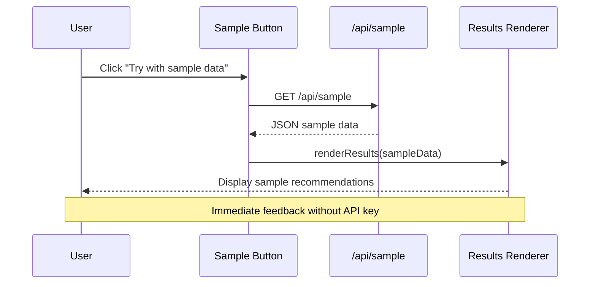

**Diagram sources**
- [app.js:208-222](file://Zomato/architecture/phase_5_response_delivery/frontend/js/app.js#L208-L222)
- [api.py:24-29](file://Zomato/architecture/phase_5_response_delivery/backend/api.py#L24-L29)

**Section sources**
- [sample_recommendations.json:1-53](file://Zomato/architecture/phase_5_response_delivery/sample_recommendations.json#L1-L53)
- [app.js:208-222](file://Zomato/architecture/phase_5_response_delivery/frontend/js/app.js#L208-L222)

## Real-time Updates

### State Management System

The application implements a robust state management system for handling different UI conditions:

#### State Transition Matrix

| Current State | Action | New State | Trigger |
|---------------|--------|-----------|---------|
| `empty` | User submits form | `loading` | Form submission |
| `loading` | API success | `results` | Data received |
| `loading` | API error | `error` | Error response |
| `results` | User clicks refresh | `loading` | Refresh button |
| `error` | User dismisses error | `empty` | Error dismissal |
| `results` | New preferences | `loading` | Form change |

**Section sources**
- [app.js:77-90](file://Zomato/architecture/phase_5_response_delivery/frontend/js/app.js#L77-L90)
- [app.js:182-205](file://Zomato/architecture/phase_5_response_delivery/frontend/js/app.js#L182-L205)

### Animation and Feedback Systems

The UI incorporates subtle animations to enhance user experience:

#### Card Animation Sequence

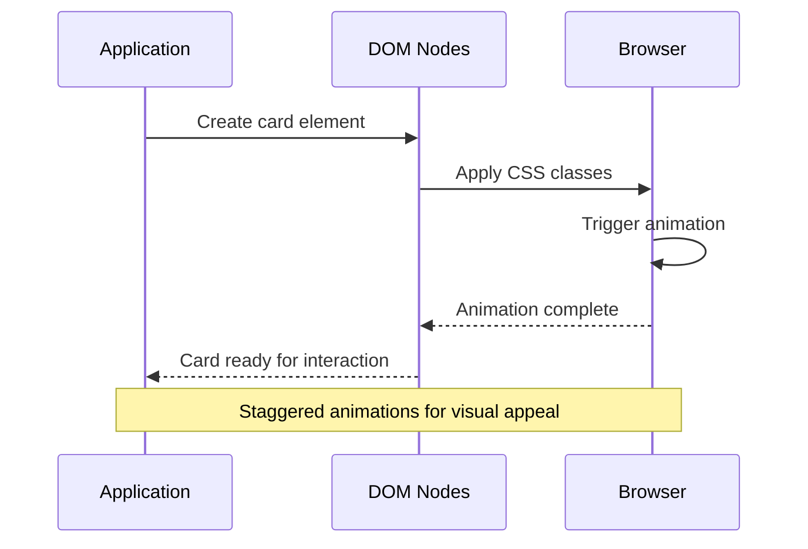

**Diagram sources**
- [app.js:117](file://Zomato/architecture/phase_5_response_delivery/frontend/js/app.js#L117)
- [styles.css:484-487](file://Zomato/architecture/phase_5_response_delivery/frontend/css/styles.css#L484-L487)

**Section sources**
- [app.js:112-179](file://Zomato/architecture/phase_5_response_delivery/frontend/js/app.js#L112-L179)
- [styles.css:484-487](file://Zomato/architecture/phase_5_response_delivery/frontend/css/styles.css#L484-L487)

## Responsive Design

### Mobile-First Approach

The design follows mobile-first principles with progressive enhancement:

#### Breakpoint Strategy

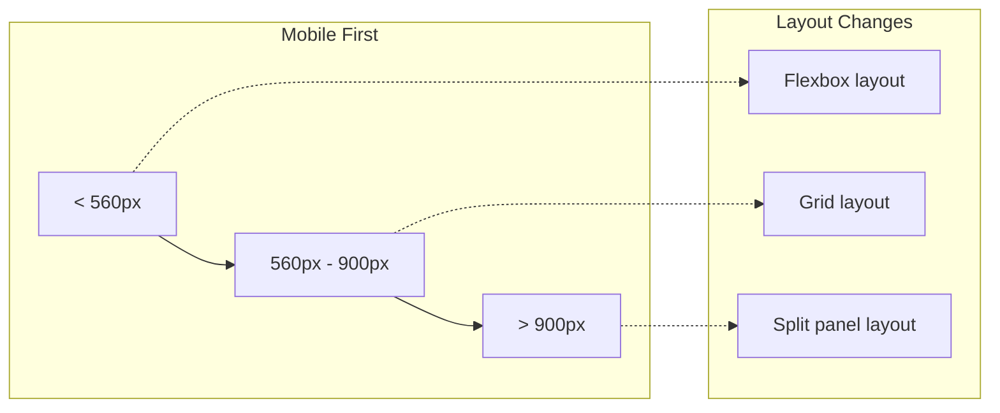

**Diagram sources**
- [styles.css:587-602](file://Zomato/architecture/phase_5_response_delivery/frontend/css/styles.css#L587-L602)

#### Adaptive Components

| Component | Mobile Behavior | Tablet Behavior | Desktop Behavior |
|-----------|----------------|-----------------|------------------|
| Layout | Single column | Single column | Split panel |
| Navigation | Minimal | Enhanced | Full sidebar |
| Cards | Single column | 2-column grid | 3-column grid |
| Forms | Full-width | Full-width | Fixed width |

**Section sources**
- [styles.css:587-602](file://Zomato/architecture/phase_5_response_delivery/frontend/css/styles.css#L587-L602)
- [index.html:137-146](file://Zomato/architecture/phase_5_response_delivery/frontend/index.html#L137-L146)

### Cross-Browser Compatibility

The implementation ensures compatibility across modern browsers:

#### Feature Support Matrix

| Feature | Chrome | Firefox | Safari | Edge |
|---------|--------|---------|--------|------|
| ES6 Modules | ✓ | ✓ | ✓ | ✓ |
| Fetch API | ✓ | ✓ | ✓ | ✓ |
| CSS Grid | ✓ | ✓ | ✓ | ✓ |
| Flexbox | ✓ | ✓ | ✓ | ✓ |
| Custom Properties | ✓ | ✓ | ✓ | ✓ |
| Web Animations | ✓ | ✓ | ✓ | ✓ |

## Accessibility Features

### Semantic HTML Structure

The application uses semantic HTML elements for improved accessibility:

#### Accessible Form Elements

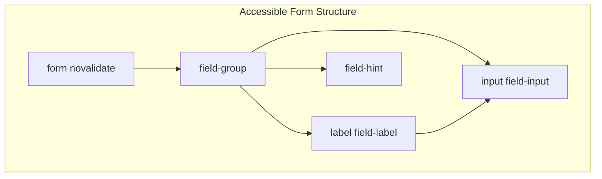

**Diagram sources**
- [index.html:45-137](file://Zomato/architecture/phase_5_response_delivery/frontend/index.html#L45-L137)

#### Keyboard Navigation

The interface supports full keyboard navigation:
- Tab order follows logical flow
- Focus indicators clearly visible
- Keyboard shortcuts for primary actions
- Screen reader friendly labels

**Section sources**
- [index.html:45-137](file://Zomato/architecture/phase_5_response_delivery/frontend/index.html#L45-L137)
- [app.js:56-58](file://Zomato/architecture/phase_5_response_delivery/frontend/js/app.js#L56-L58)

### Color Contrast and Visual Design

The design system prioritizes accessibility through thoughtful color choices:

#### Color Contrast Ratios

| Element | Foreground | Background | Ratio | WCAG Level |
|---------|------------|------------|-------|------------|
| Primary Text | #f0f0f5 | #16161a | 15.2:1 | AAA |
| Secondary Text | #9898a8 | #16161a | 5.3:1 | AA |
| Red Accent | #e23744 | #16161a | 6.4:1 | AA |
| Card Background | #f0f0f5 | #1c1c22 | 15.2:1 | AAA |

## Error Handling

### Comprehensive Error Management

The system implements layered error handling for different failure scenarios:

#### Error Classification

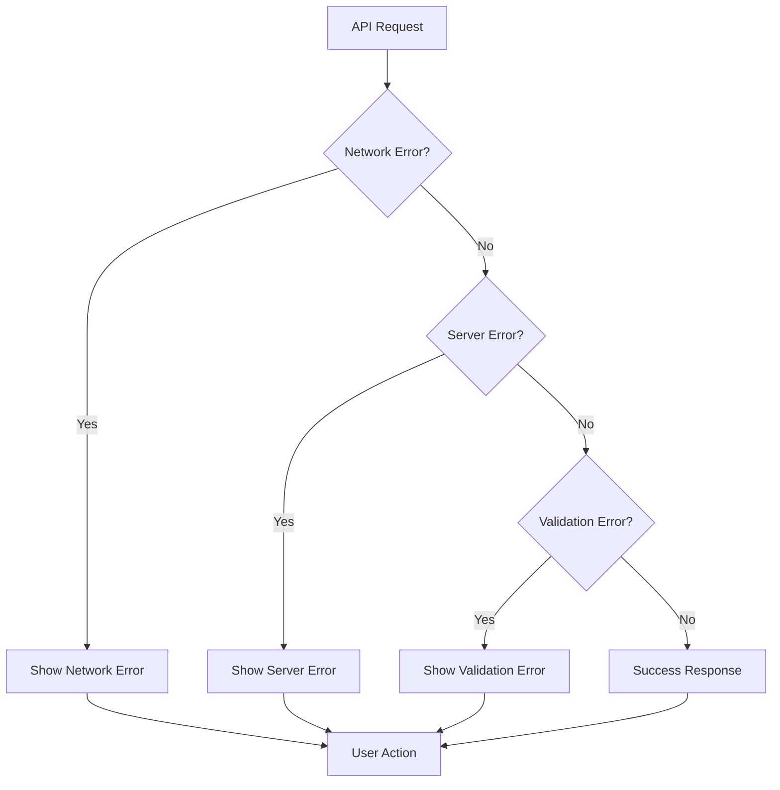

**Diagram sources**
- [app.js:187-205](file://Zomato/architecture/phase_5_response_delivery/frontend/js/app.js#L187-L205)
- [api.py:56-58](file://Zomato/architecture/phase_5_response_delivery/backend/api.py#L56-L58)

#### Error Display System

The error banner provides clear, actionable feedback:

| Error Type | Icon | Message | Action |
|------------|------|---------|--------|
| Network Failure | ⚠️ | "Failed to connect to the API" | Retry button |
| Validation Error | ❗ | Specific field validation messages | Fix form |
| Server Error | 🚨 | "Server error 500" | Contact support |
| Sample Data Error | 📊 | "Sample data unavailable" | Try later |

**Section sources**
- [app.js:85-90](file://Zomato/architecture/phase_5_response_delivery/frontend/js/app.js#L85-L90)
- [app.js:194-200](file://Zomato/architecture/phase_5_response_delivery/frontend/js/app.js#L194-L200)

### Fallback Mechanisms

The system implements multiple fallback strategies:

#### Data Fallback Chain

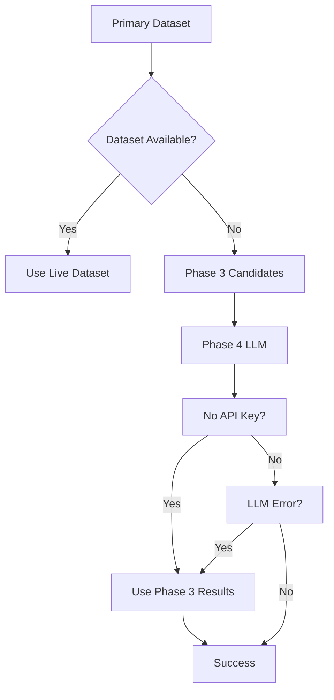

**Diagram sources**
- [orchestrator.py:166-190](file://Zomato/architecture/phase_5_response_delivery/backend/orchestrator.py#L166-L190)
- [orchestrator.py:266-291](file://Zomato/architecture/phase_5_response_delivery/backend/orchestrator.py#L266-L291)

**Section sources**
- [orchestrator.py:166-190](file://Zomato/architecture/phase_5_response_delivery/backend/orchestrator.py#L166-L190)
- [orchestrator.py:266-291](file://Zomato/architecture/phase_5_response_delivery/backend/orchestrator.py#L266-L291)

## Performance Considerations

### Optimized Loading Strategies

The application implements several performance optimization techniques:

#### Lazy Loading Implementation

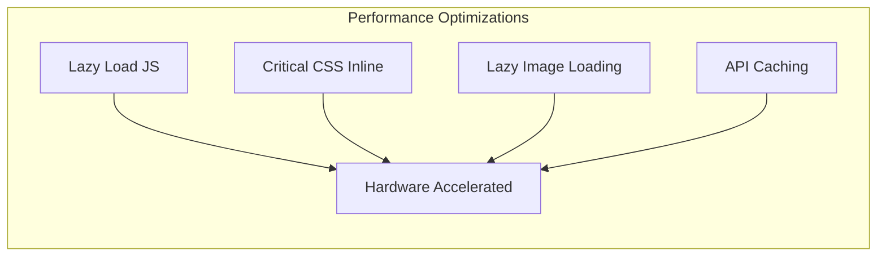

**Diagram sources**
- [index.html:10](file://Zomato/architecture/phase_5_response_delivery/frontend/index.html#L10)
- [styles.css:484-487](file://Zomato/architecture/phase_5_response_delivery/frontend/css/styles.css#L484-L487)

#### Memory Management

The frontend implements efficient memory management:
- DOM node recycling for cards
- Event listener cleanup
- Animation frame optimization
- Debounced API calls

**Section sources**
- [styles.css:484-487](file://Zomato/architecture/phase_5_response_delivery/frontend/css/styles.css#L484-L487)
- [app.js:172-179](file://Zomato/architecture/phase_5_response_delivery/frontend/js/app.js#L172-L179)

### Caching Strategies

The system employs strategic caching to improve performance:

| Resource Type | Cache Strategy | Duration | Benefits |
|---------------|----------------|----------|----------|
| Metadata | Static JSON | Session | Fast dropdown population |
| Sample Data | In-memory cache | Application lifetime | Instant demo access |
| API Responses | Browser cache | 30 seconds | Reduced network calls |
| CSS/JS | CDN caching | Long-term | Faster page loads |

## Customization Guide

### Theme Integration

The design system supports easy theme customization:

#### CSS Variable System

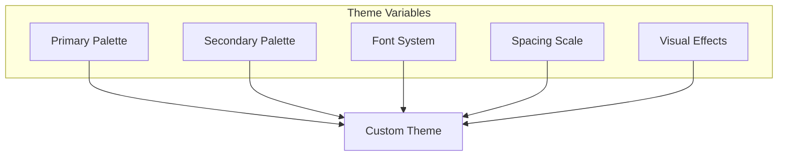

**Diagram sources**
- [styles.css:7-40](file://Zomato/architecture/phase_5_response_delivery/frontend/css/styles.css#L7-L40)

#### Customization Options

| Aspect | Customizable Through | Examples |
|--------|---------------------|----------|
| Colors | CSS variables | --red, --bg-base, --text-primary |
| Typography | Font families | Inter, system-ui fallback |
| Spacing | Unit scaling | --radius-sm, --radius-md, --radius-lg |
| Animations | Timing functions | --ease, custom easing |
| Layout | Grid/flex properties | Responsive breakpoints |

**Section sources**
- [styles.css:7-40](file://Zomato/architecture/phase_5_response_delivery/frontend/css/styles.css#L7-L40)
- [styles.css:587-602](file://Zomato/architecture/phase_5_response_delivery/frontend/css/styles.css#L587-L602)

### Extending Recommendation Display

The recommendation system can be extended in several ways:

#### Additional Card Fields

```mermaid
graph LR
subgraph "Card Enhancement Options"
NewFields[Additional Fields]
CustomIcons[Custom Icons]
InteractiveElements[Interactive Elements]
RichMedia[Rich Media Content]
end
NewFields --> CustomIcons
CustomIcons --> InteractiveElements
InteractiveElements --> RichMedia
```

**Diagram sources**
- [app.js:113-150](file://Zomato/architecture/phase_5_response_delivery/frontend/js/app.js#L113-L150)

#### Extension Points

| Extension Point | Implementation Method | Use Cases |
|-----------------|----------------------|-----------|
| Card rendering | Modify renderCard() | Add new metrics |
| API endpoints | Extend api.py | New data sources |
| State management | Update setState() | New UI states |
| Styling | Add CSS classes | Custom themes |
| Validation | Update getPreferences() | New preference types |

**Section sources**
- [app.js:113-150](file://Zomato/architecture/phase_5_response_delivery/frontend/js/app.js#L113-L150)
- [api.py:18-84](file://Zomato/architecture/phase_5_response_delivery/backend/api.py#L18-L84)

## Troubleshooting Guide

### Common Issues and Solutions

#### API Integration Problems

| Issue | Symptoms | Solution |
|-------|----------|----------|
| CORS errors | "Access to fetch denied" | Enable CORS in Flask |
| JSON parsing errors | "Request body must be JSON" | Validate request format |
| API key missing | "No GROQ_API_KEY" | Set environment variable |
| Network timeouts | "Failed to connect" | Check server availability |

**Section sources**
- [api.py:56-58](file://Zomato/architecture/phase_5_response_delivery/backend/api.py#L56-L58)
- [orchestrator.py:210-213](file://Zomato/architecture/phase_5_response_delivery/backend/orchestrator.py#L210-L213)

#### Frontend Performance Issues

| Issue | Symptoms | Solution |
|-------|----------|----------|
| Slow loading | Long skeleton display | Optimize API calls |
| Memory leaks | Increasing memory usage | Clean up event listeners |
| Animation stutter | Choppy transitions | Use transform animations |
| Layout shifts | Content jumping | Reserve space for images |

**Section sources**
- [app.js:182-205](file://Zomato/architecture/phase_5_response_delivery/frontend/js/app.js#L182-L205)
- [styles.css:484-487](file://Zomato/architecture/phase_5_response_delivery/frontend/css/styles.css#L484-L487)

### Debugging Tools

The application includes built-in debugging capabilities:

#### Development Features

| Tool | Purpose | Usage |
|------|---------|-------|
| Console logging | API call tracking | Monitor request/response |
| Error boundaries | UI crash prevention | Catch rendering errors |
| State inspection | UI state monitoring | Debug state transitions |
| Network tab | API debugging | Inspect request/response |

**Section sources**
- [app.js:270-275](file://Zomato/architecture/phase_5_response_delivery/frontend/js/app.js#L270-L275)
- [api.py:18-21](file://Zomato/architecture/phase_5_response_delivery/backend/api.py#L18-L21)

## Conclusion

The Web UI Integration component demonstrates a comprehensive approach to building modern, accessible, and performant web applications. The implementation successfully bridges the gap between complex backend recommendation systems and user-friendly interfaces.

Key achievements include:

**Technical Excellence**
- Robust frontend-backend integration with clear separation of concerns
- Sophisticated state management and real-time update mechanisms
- Comprehensive error handling and fallback strategies
- Responsive design with cross-browser compatibility

**User Experience**
- Intuitive preference capture with immediate feedback
- Visually appealing recommendation displays with rich metadata
- Smooth animations and transitions enhancing user engagement
- Accessible design supporting diverse user needs

**Architectural Strengths**
- Modular design enabling easy extension and maintenance
- Scalable backend API supporting multiple deployment scenarios
- Performance optimizations reducing latency and improving responsiveness
- Comprehensive testing and debugging capabilities

The implementation serves as a foundation for future enhancements, including advanced recommendation features, expanded customization options, and integration with additional data sources. The modular architecture ensures that new features can be added without disrupting existing functionality.