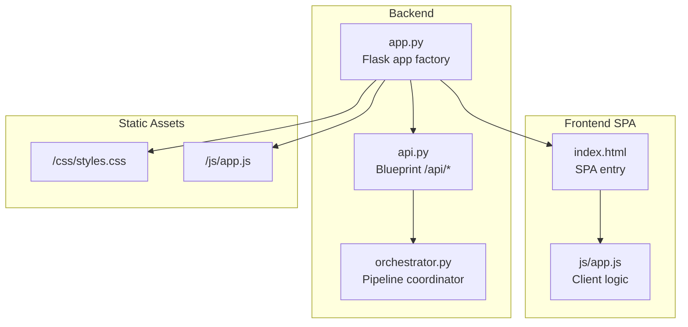
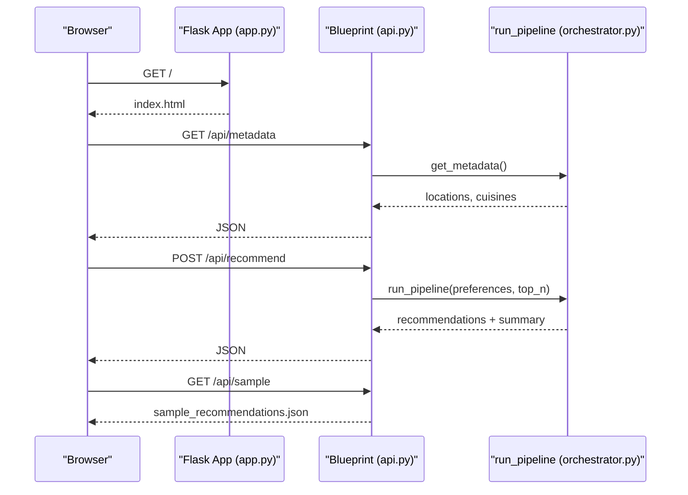
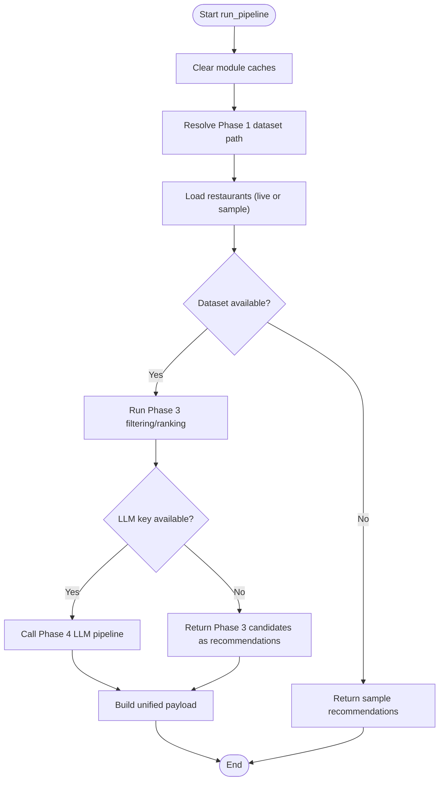
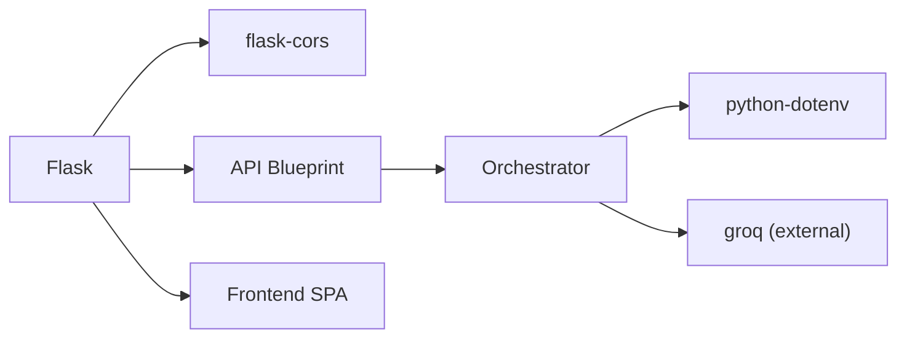

# Backend API Services

<cite>
**Referenced Files in This Document**
- [app.py](file://Zomato/architecture/phase_5_response_delivery/backend/app.py)
- [api.py](file://Zomato/architecture/phase_5_response_delivery/backend/api.py)
- [orchestrator.py](file://Zomato/architecture/phase_5_response_delivery/backend/orchestrator.py)
- [index.html](file://Zomato/architecture/phase_5_response_delivery/frontend/index.html)
- [app.js](file://Zomato/architecture/phase_5_response_delivery/frontend/js/app.js)
- [metadata.json](file://Zomato/architecture/phase_5_response_delivery/metadata.json)
- [sample_recommendations.json](file://Zomato/architecture/phase_5_response_delivery/sample_recommendations.json)
- [requirements.txt](file://Zomato/architecture/phase_5_response_delivery/requirements.txt)
</cite>

## Table of Contents
1. [Introduction](#introduction)
2. [Project Structure](#project-structure)
3. [Core Components](#core-components)
4. [Architecture Overview](#architecture-overview)
5. [Detailed Component Analysis](#detailed-component-analysis)
6. [Dependency Analysis](#dependency-analysis)
7. [Performance Considerations](#performance-considerations)
8. [Troubleshooting Guide](#troubleshooting-guide)
9. [Conclusion](#conclusion)
10. [Appendices](#appendices)

## Introduction
This document provides comprehensive API documentation for Phase 5 backend services. It covers the Flask application factory pattern, CORS configuration, static asset serving, the API blueprint structure, and the orchestration layer that coordinates recommendation delivery. It also documents HTTP endpoints, request/response schemas, error handling, authentication, rate limiting, security considerations, and practical usage examples.

## Project Structure
The Phase 5 backend is organized around a Flask application factory that registers an API blueprint and serves a frontend Single Page Application (SPA). The backend orchestrates recommendation generation by chaining earlier phases and optionally invoking an external LLM service.

**Diagram sources**
- [app.py:14-41](file://Zomato/architecture/phase_5_response_delivery/backend/app.py#L14-L41)
- [api.py:13-84](file://Zomato/architecture/phase_5_response_delivery/backend/api.py#L13-L84)
- [orchestrator.py:112-292](file://Zomato/architecture/phase_5_response_delivery/backend/orchestrator.py#L112-L292)
- [index.html:1-198](file://Zomato/architecture/phase_5_response_delivery/frontend/index.html#L1-L198)
- [app.js:1-278](file://Zomato/architecture/phase_5_response_delivery/frontend/js/app.js#L1-L278)

**Section sources**
- [app.py:14-41](file://Zomato/architecture/phase_5_response_delivery/backend/app.py#L14-L41)
- [api.py:13-84](file://Zomato/architecture/phase_5_response_delivery/backend/api.py#L13-L84)
- [index.html:1-198](file://Zomato/architecture/phase_5_response_delivery/frontend/index.html#L1-L198)
- [app.js:1-278](file://Zomato/architecture/phase_5_response_delivery/frontend/js/app.js#L1-L278)

## Core Components
- Flask application factory: Creates the Flask app, enables CORS, registers the API blueprint, and serves SPA assets.
- API blueprint: Defines endpoints under /api for health checks, sample data, metadata, and recommendation generation.
- Orchestrator: Coordinates candidate retrieval, optional LLM ranking, and returns structured recommendations.

Key responsibilities:
- app.py: Configure CORS, serve SPA routes, register blueprint.
- api.py: Validate requests, delegate to orchestrator, handle errors.
- orchestrator.py: Load datasets, run Phase 3 filtering/ranking, optionally call Phase 4 LLM, and return unified results.

**Section sources**
- [app.py:14-41](file://Zomato/architecture/phase_5_response_delivery/backend/app.py#L14-L41)
- [api.py:18-84](file://Zomato/architecture/phase_5_response_delivery/backend/api.py#L18-L84)
- [orchestrator.py:112-292](file://Zomato/architecture/phase_5_response_delivery/backend/orchestrator.py#L112-L292)

## Architecture Overview
The backend exposes a REST API via a Flask blueprint and integrates with earlier pipeline phases. The frontend SPA communicates with the backend using standard HTTP requests.

**Diagram sources**
- [app.py:28-40](file://Zomato/architecture/phase_5_response_delivery/backend/app.py#L28-L40)
- [api.py:18-84](file://Zomato/architecture/phase_5_response_delivery/backend/api.py#L18-L84)
- [orchestrator.py:85-110](file://Zomato/architecture/phase_5_response_delivery/backend/orchestrator.py#L85-L110)
- [orchestrator.py:112-292](file://Zomato/architecture/phase_5_response_delivery/backend/orchestrator.py#L112-L292)

## Detailed Component Analysis

### Flask Application Factory (app.py)
- Purpose: Create a Flask app configured for CORS and SPA routing.
- CORS: Enabled globally to allow cross-origin requests from the frontend.
- Static serving: Serves frontend assets from the frontend directory.
- Routes:
  - GET "/": Returns SPA entry page.
  - GET "/css/<path:filename>", GET "/js/<path:filename>": Serve static assets.
- Blueprint registration: Registers the API blueprint under /api.

Security and SPA routing:
- CORS is enabled without restrictions in this development setup.
- SPA routing is handled by returning index.html for the root route, enabling client-side routing.

**Section sources**
- [app.py:14-41](file://Zomato/architecture/phase_5_response_delivery/backend/app.py#L14-L41)

### API Blueprint (api.py)
- Blueprint name: "api", URL prefix: "/api".
- Endpoints:
  - GET /api/health: Health check returning service metadata.
  - GET /api/sample: Returns prebuilt sample recommendations.
  - GET /api/metadata: Returns locations and cuisines for dropdowns.
  - POST /api/recommend: Runs the full recommendation pipeline with validated preferences.

Request validation (POST /api/recommend):
- JSON body required; returns 400 if not present.
- Required field: location (non-empty after trimming).
- budget: one of "low", "medium", "high"; defaults to "medium" if omitted.
- Optional fields: cuisines (array), min_rating (float), optional_preferences (array), top_n (integer, clamped 1–20).

Response formats:
- /api/health: JSON with status, phase, and service name.
- /api/sample: JSON containing summary, recommendations array, and preferences_used.
- /api/metadata: JSON with locations and cuisines arrays.
- /api/recommend: JSON with summary, recommendations array, preferences_used, and source indicator.

Error handling:
- Validation failures return 400 with an error message.
- Exceptions during processing return 500 with a stack trace.

**Section sources**
- [api.py:18-84](file://Zomato/architecture/phase_5_response_delivery/backend/api.py#L18-L84)
- [metadata.json:1-196](file://Zomato/architecture/phase_5_response_delivery/metadata.json#L1-L196)
- [sample_recommendations.json:1-53](file://Zomato/architecture/phase_5_response_delivery/sample_recommendations.json#L1-L53)

### Orchestrator (orchestrator.py)
Responsibilities:
- Load restaurant datasets from either a live dataset or a sample fallback.
- Compute metadata (locations and cuisines) if not precomputed.
- Run Phase 3 candidate retrieval and ranking.
- Optionally call Phase 4 LLM for re-ranking.
- Return a unified recommendation payload with explanations and ratings.

Key behaviors:
- Fresh imports and module cache invalidation ensure deterministic runs.
- If the live dataset or LLM key is unavailable, the system falls back to sample recommendations.
- The returned payload includes a summary, recommendations array, preferences_used, and a source indicator.

**Diagram sources**
- [orchestrator.py:112-292](file://Zomato/architecture/phase_5_response_delivery/backend/orchestrator.py#L112-L292)

**Section sources**
- [orchestrator.py:112-292](file://Zomato/architecture/phase_5_response_delivery/backend/orchestrator.py#L112-L292)

### Frontend Integration (index.html, app.js)
- index.html: SPA entry that loads CSS and JavaScript assets and renders the UI.
- app.js: Implements form handling, API calls, result rendering, and error display.
- API usage patterns:
  - GET /api/metadata: Populate location and cuisine dropdowns.
  - POST /api/recommend: Submit preferences and render recommendations.
  - GET /api/sample: Load sample recommendations for demonstration.

**Section sources**
- [index.html:1-198](file://Zomato/architecture/phase_5_response_delivery/frontend/index.html#L1-L198)
- [app.js:181-278](file://Zomato/architecture/phase_5_response_delivery/frontend/js/app.js#L181-L278)

## Dependency Analysis
External dependencies (selected):
- flask: Web framework.
- flask-cors: Cross-origin support.
- pydantic: Data validation (used by downstream phases).
- python-dotenv: Environment variable loading.
- groq: LLM service integration (via Phase 4 pipeline).

**Diagram sources**
- [requirements.txt:1-6](file://Zomato/architecture/phase_5_response_delivery/requirements.txt#L1-L6)
- [orchestrator.py:209-213](file://Zomato/architecture/phase_5_response_delivery/backend/orchestrator.py#L209-L213)

**Section sources**
- [requirements.txt:1-6](file://Zomato/architecture/phase_5_response_delivery/requirements.txt#L1-L6)
- [orchestrator.py:209-213](file://Zomato/architecture/phase_5_response_delivery/backend/orchestrator.py#L209-L213)

## Performance Considerations
- Module caching and fresh imports: The orchestrator clears caches and reloads modules per request to avoid interference and ensure deterministic behavior. This adds overhead; consider process-level caching or container reuse in production.
- Dataset loading: Reading large JSONL files is I/O bound; precompute metadata and keep datasets optimized.
- LLM calls: External API latency dominates response time; consider connection pooling and retries with backoff.
- Static assets: Serve via CDN or NGINX in production to reduce server load.
- SPA routing: Returning index.html for unknown routes is fine for development; ensure proper 404 handling in production.

[No sources needed since this section provides general guidance]

## Troubleshooting Guide
Common issues and resolutions:
- CORS errors in browser console:
  - Cause: Cross-origin requests blocked.
  - Resolution: Verify CORS is enabled and origin matches expectations.
  - Reference: [app.py:20](file://Zomato/architecture/phase_5_response_delivery/backend/app.py#L20)
- 400 Bad Request on /api/recommend:
  - Cause: Missing or invalid JSON body, missing location, or invalid budget.
  - Resolution: Ensure JSON body is sent and includes a non-empty location and a valid budget value.
  - Reference: [api.py:56-67](file://Zomato/architecture/phase_5_response_delivery/backend/api.py#L56-L67)
- 500 Internal Server Error on /api/recommend or /api/metadata:
  - Cause: Unhandled exceptions in orchestrator or metadata computation.
  - Resolution: Check logs for stack traces and verify dataset availability and environment variables.
  - Reference: [api.py:37-38](file://Zomato/architecture/phase_5_response_delivery/backend/api.py#L37-L38), [api.py:82-83](file://Zomato/architecture/phase_5_response_delivery/backend/api.py#L82-L83)
- No recommendations returned:
  - Cause: Live dataset not found or LLM key missing.
  - Resolution: Confirm dataset presence and environment configuration; the system falls back to sample recommendations.
  - Reference: [orchestrator.py:166-169](file://Zomato/architecture/phase_5_response_delivery/backend/orchestrator.py#L166-L169), [orchestrator.py:212-213](file://Zomato/architecture/phase_5_response_delivery/backend/orchestrator.py#L212-L213)
- Frontend dropdowns empty:
  - Cause: /api/metadata failed to load.
  - Resolution: Check network tab and server logs; ensure metadata.json exists or is generated.
  - Reference: [app.js:249-277](file://Zomato/architecture/phase_5_response_delivery/frontend/js/app.js#L249-L277)

**Section sources**
- [app.py:20](file://Zomato/architecture/phase_5_response_delivery/backend/app.py#L20)
- [api.py:56-67](file://Zomato/architecture/phase_5_response_delivery/backend/api.py#L56-L67)
- [api.py:37-38](file://Zomato/architecture/phase_5_response_delivery/backend/api.py#L37-L38)
- [api.py:82-83](file://Zomato/architecture/phase_5_response_delivery/backend/api.py#L82-L83)
- [orchestrator.py:166-169](file://Zomato/architecture/phase_5_response_delivery/backend/orchestrator.py#L166-L169)
- [orchestrator.py:212-213](file://Zomato/architecture/phase_5_response_delivery/backend/orchestrator.py#L212-L213)
- [app.js:249-277](file://Zomato/architecture/phase_5_response_delivery/frontend/js/app.js#L249-L277)

## Conclusion
The Phase 5 backend provides a clean separation of concerns: a Flask factory for app setup, a focused API blueprint for endpoints, and an orchestrator that coordinates multi-phase recommendation logic. The SPA frontend integrates seamlessly via standard HTTP calls. While the current setup emphasizes simplicity and resilience (fallbacks), production deployments should address CORS policy, rate limiting, and performance optimizations.

[No sources needed since this section summarizes without analyzing specific files]

## Appendices

### API Reference

- Base URL: http://localhost:5000 (development)
- Authentication: Not implemented; intended for internal use.
- Rate Limiting: Not implemented; consider adding throttling in production.
- Security:
  - CORS is enabled without origin restriction in development.
  - Use HTTPS and restrict CORS origins in production.
  - Store secrets (e.g., LLM keys) in environment variables and avoid logging sensitive data.

Endpoints:
- GET /api/health
  - Description: Health check.
  - Response: JSON with status, phase, and service name.
  - Example response: {"status":"ok","phase":5,"service":"Zomato Recommendation API"}

- GET /api/sample
  - Description: Prebuilt sample recommendations for demo.
  - Response: JSON with summary, recommendations array, preferences_used, and source.
  - Example response: See [sample_recommendations.json:1-53](file://Zomato/architecture/phase_5_response_delivery/sample_recommendations.json#L1-L53)

- GET /api/metadata
  - Description: Unique locations and cuisines for dropdowns.
  - Response: JSON with locations and cuisines arrays.
  - Example response: See [metadata.json:1-196](file://Zomato/architecture/phase_5_response_delivery/metadata.json#L1-L196)

- POST /api/recommend
  - Description: Run the full recommendation pipeline.
  - Request body (JSON):
    - location (string, required)
    - budget (string, one of low|medium|high, default medium)
    - cuisines (array of strings, optional)
    - min_rating (number, optional)
    - optional_preferences (array of strings, optional)
    - top_n (integer, 1–20, default 5)
  - Response: JSON with summary, recommendations array, preferences_used, and source.
  - Example request: See [app.js:61-74](file://Zomato/architecture/phase_5_response_delivery/frontend/js/app.js#L61-L74)

Error responses:
- 400 Bad Request: Validation failure (e.g., missing JSON, invalid budget).
- 500 Internal Server Error: Unexpected exception during processing.

**Section sources**
- [api.py:18-84](file://Zomato/architecture/phase_5_response_delivery/backend/api.py#L18-L84)
- [metadata.json:1-196](file://Zomato/architecture/phase_5_response_delivery/metadata.json#L1-L196)
- [sample_recommendations.json:1-53](file://Zomato/architecture/phase_5_response_delivery/sample_recommendations.json#L1-L53)
- [app.js:61-74](file://Zomato/architecture/phase_5_response_delivery/frontend/js/app.js#L61-L74)

### CORS and Static Asset Serving
- CORS: Enabled globally in the Flask app.
- Static assets: Served from the frontend directory under the app’s static folder.
- SPA routing: Root route returns index.html; asset routes return CSS/JS files.

**Section sources**
- [app.py:20](file://Zomato/architecture/phase_5_response_delivery/backend/app.py#L20)
- [app.py:28-40](file://Zomato/architecture/phase_5_response_delivery/backend/app.py#L28-L40)

### Integration Patterns
- Frontend to backend:
  - Use fetch with JSON bodies for POST /api/recommend.
  - Use GET for /api/metadata and /api/sample.
  - Handle errors gracefully and show user-friendly messages.

**Section sources**
- [app.js:181-278](file://Zomato/architecture/phase_5_response_delivery/frontend/js/app.js#L181-L278)