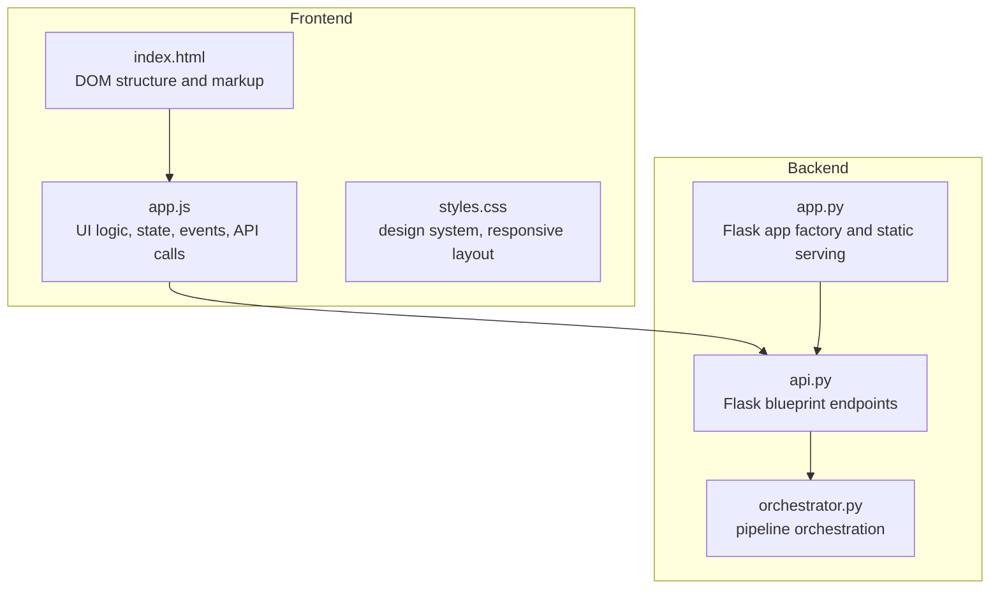
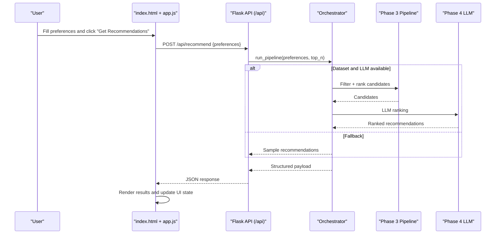
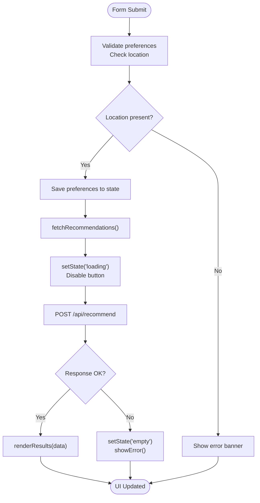
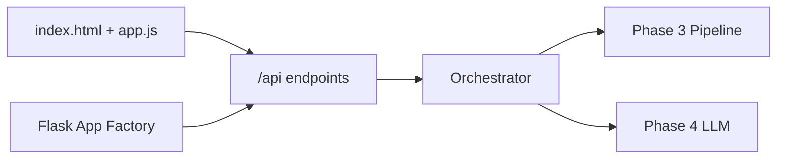

# Frontend User Interface

<cite>
**Referenced Files in This Document**
- [index.html](file://Zomato/architecture/phase_5_response_delivery/frontend/index.html)
- [app.js](file://Zomato/architecture/phase_5_response_delivery/frontend/js/app.js)
- [styles.css](file://Zomato/architecture/phase_5_response_delivery/frontend/css/styles.css)
- [api.py](file://Zomato/architecture/phase_5_response_delivery/backend/api.py)
- [app.py](file://Zomato/architecture/phase_5_response_delivery/backend/app.py)
- [orchestrator.py](file://Zomato/architecture/phase_5_response_delivery/backend/orchestrator.py)
- [sample_recommendations.json](file://Zomato/architecture/phase_5_response_delivery/sample_recommendations.json)
</cite>

## Table of Contents
1. [Introduction](#introduction)
2. [Project Structure](#project-structure)
3. [Core Components](#core-components)
4. [Architecture Overview](#architecture-overview)
5. [Detailed Component Analysis](#detailed-component-analysis)
6. [Dependency Analysis](#dependency-analysis)
7. [Performance Considerations](#performance-considerations)
8. [Troubleshooting Guide](#troubleshooting-guide)
9. [Conclusion](#conclusion)
10. [Appendices](#appendices)

## Introduction
This document provides comprehensive documentation for Phase 5 frontend user interface components. It covers the HTML structure, JavaScript functionality, and CSS styling that deliver an interactive, responsive, and accessible restaurant recommendation experience. The frontend integrates with a backend API that orchestrates recommendation pipelines across multiple phases, providing live AI-powered recommendations or fallback sample data.

## Project Structure
The Phase 5 frontend is organized into three primary layers:
- HTML: Defines the page layout, form controls, and result containers.
- JavaScript: Manages user interactions, API communication, state transitions, and dynamic rendering.
- CSS: Implements a cohesive dark theme with glassmorphism effects, responsive design, and component styling.

**Diagram sources**
- [index.html](file://Zomato/architecture/phase_5_response_delivery/frontend/index.html)
- [app.js](file://Zomato/architecture/phase_5_response_delivery/frontend/js/app.js)
- [styles.css](file://Zomato/architecture/phase_5_response_delivery/frontend/css/styles.css)
- [api.py](file://Zomato/architecture/phase_5_response_delivery/backend/api.py)
- [app.py](file://Zomato/architecture/phase_5_response_delivery/backend/app.py)
- [orchestrator.py](file://Zomato/architecture/phase_5_response_delivery/backend/orchestrator.py)

**Section sources**
- [index.html](file://Zomato/architecture/phase_5_response_delivery/frontend/index.html)
- [app.js](file://Zomato/architecture/phase_5_response_delivery/frontend/js/app.js)
- [styles.css](file://Zomato/architecture/phase_5_response_delivery/frontend/css/styles.css)
- [api.py](file://Zomato/architecture/phase_5_response_delivery/backend/api.py)
- [app.py](file://Zomato/architecture/phase_5_response_delivery/backend/app.py)
- [orchestrator.py](file://Zomato/architecture/phase_5_response_delivery/backend/orchestrator.py)

## Core Components
This section outlines the key UI components and their roles in the user experience.

- Site Header
  - Contains logo, tagline, and decorative glow effect.
  - Provides contextual branding for the AI recommendation system.

- Hero Section
  - Introduces the value proposition with a headline and descriptive paragraph.

- Preference Panel (Sidebar)
  - Houses the preference capture form with:
    - Location selection (dynamic options loaded from metadata).
    - Budget range slider with live numeric display and gradient indicator.
    - Cuisine selection (optional).
    - Minimum rating slider with live numeric display and gradient indicator.
    - Optional preferences input (comma-separated).
    - Top-N results selector.
    - Action buttons: Get Recommendations and Try with sample data.

- Results Panel
  - Empty state: Friendly message encouraging user action.
  - Loading skeletons: Animated placeholders during API requests.
  - Error banner: Accessible alert with dismiss action.
  - Results content: Dynamic summary, source badge, refresh button, and recommendation cards grid.

- Footer
  - Displays phase information and technology stack.

**Section sources**
- [index.html](file://Zomato/architecture/phase_5_response_delivery/frontend/index.html)
- [styles.css](file://Zomato/architecture/phase_5_response_delivery/frontend/css/styles.css)

## Architecture Overview
The frontend communicates with the backend through a Flask application that serves static assets and exposes REST endpoints. The backend orchestrates recommendation pipelines across earlier phases and returns structured data to the frontend.

**Diagram sources**
- [app.js](file://Zomato/architecture/phase_5_response_delivery/frontend/js/app.js)
- [api.py](file://Zomato/architecture/phase_5_response_delivery/backend/api.py)
- [orchestrator.py](file://Zomato/architecture/phase_5_response_delivery/backend/orchestrator.py)

## Detailed Component Analysis

### HTML Structure and DOM Elements
The HTML defines a two-column layout with a preference panel and results panel. It includes:
- Semantic sections for header, hero, main layout, and footer.
- A form with labeled inputs and sliders.
- Result containers for empty state, loading skeletons, error banner, and rendered cards.
- Accessibility attributes such as role and aria-labels.

Key elements:
- Preference form container with ID for event binding.
- Range sliders for budget and rating with live display spans.
- Select inputs for location and cuisine populated via metadata.
- Buttons for submission, sample data, and refresh.
- Results containers for summary, source badge, and cards grid.

**Section sources**
- [index.html](file://Zomato/architecture/phase_5_response_delivery/frontend/index.html)

### JavaScript Functionality
The JavaScript file manages:
- DOM references and state initialization.
- Slider interactions for live feedback and gradient indicators.
- Form validation and preference extraction.
- API communication for recommendations and sample data.
- State machine for UI transitions (empty/loading/results/error).
- Dynamic rendering of recommendation cards with animations.
- Error handling and user feedback.

Core functions and flows:
- getPreferences(): Extracts and normalizes form values into a preferences object.
- setState(state): Switches between UI states.
- showError(message): Displays and scrolls to error banner.
- renderStars(rating): Generates star rating UI with filled/half/empty states.
- formatCost(cost): Formats currency values for display.
- renderCard(rec, delay): Creates individual recommendation cards with rank badges and explanations.
- renderResults(data): Updates summary, source badge, and renders cards.
- fetchRecommendations(prefs): Sends POST request to /api/recommend and handles responses.
- fetchSample(): Loads sample recommendations from /api/sample.
- loadMetadata(): Populates location and cuisine dropdowns from /api/metadata.

Event handling:
- Form submit: Validates location, stores preferences, and triggers recommendation fetch.
- Sample button: Loads sample data.
- Refresh button: Re-runs recommendation with last preferences.
- Error dismiss: Hides error banner.
- Sliders: Update live displays and gradient backgrounds.

**Diagram sources**
- [app.js](file://Zomato/architecture/phase_5_response_delivery/frontend/js/app.js)

**Section sources**
- [app.js](file://Zomato/architecture/phase_5_response_delivery/frontend/js/app.js)

### CSS Styling and Design System
The CSS establishes a cohesive design system with:
- CSS custom properties for colors, typography, spacing, shadows, and transitions.
- Dark mode aesthetic with glassmorphism effects and subtle glows.
- Responsive breakpoints for tablet and mobile layouts.
- Component-specific styles for forms, buttons, cards, and loading states.

Key design patterns:
- Glassmorphism panels with backdrop blur and borders.
- Gradient accents for interactive elements and slider fills.
- Animated shimmer skeletons for loading states.
- Card hover states with subtle elevation and glow.
- Responsive grid for recommendation cards.

Accessibility and UX enhancements:
- Focus states and keyboard navigation support.
- High contrast and readable typography scales.
- Clear error messaging with dismiss actions.
- Animated transitions for state changes.

**Section sources**
- [styles.css](file://Zomato/architecture/phase_5_response_delivery/frontend/css/styles.css)

### Backend Integration and Data Flow
The backend provides:
- Health check endpoint for service verification.
- Sample recommendations endpoint for demonstration.
- Metadata endpoint for dynamic dropdown population.
- Recommendation endpoint that validates input, runs the pipeline, and returns structured results.

Pipeline behavior:
- Attempts to load live datasets and run Phase 3 filtering.
- Calls Phase 4 LLM for ranking when available.
- Falls back to Phase 3 rankings or sample data when LLM is unavailable.

**Section sources**
- [api.py](file://Zomato/architecture/phase_5_response_delivery/backend/api.py)
- [app.py](file://Zomato/architecture/phase_5_response_delivery/backend/app.py)
- [orchestrator.py](file://Zomato/architecture/phase_5_response_delivery/backend/orchestrator.py)
- [sample_recommendations.json](file://Zomato/architecture/phase_5_response_delivery/sample_recommendations.json)

## Dependency Analysis
The frontend depends on:
- Static asset serving from the backend Flask app.
- REST endpoints for metadata, recommendations, and sample data.
- Consistent JSON payload structure for recommendations.

**Diagram sources**
- [app.js](file://Zomato/architecture/phase_5_response_delivery/frontend/js/app.js)
- [api.py](file://Zomato/architecture/phase_5_response_delivery/backend/api.py)
- [app.py](file://Zomato/architecture/phase_5_response_delivery/backend/app.py)
- [orchestrator.py](file://Zomato/architecture/phase_5_response_delivery/backend/orchestrator.py)

**Section sources**
- [app.js](file://Zomato/architecture/phase_5_response_delivery/frontend/js/app.js)
- [api.py](file://Zomato/architecture/phase_5_response_delivery/backend/api.py)
- [app.py](file://Zomato/architecture/phase_5_response_delivery/backend/app.py)
- [orchestrator.py](file://Zomato/architecture/phase_5_response_delivery/backend/orchestrator.py)

## Performance Considerations
- Minimize DOM updates: Batch rendering and use efficient grid layouts.
- Debounce or throttle slider interactions if extended usage patterns emerge.
- Lazy-load images if recommendation cards include photos in future iterations.
- Optimize CSS custom property usage for smooth animations.
- Use request cancellation if multiple requests can overlap.
- Ensure skeleton animations are lightweight and hardware-accelerated.

## Troubleshooting Guide
Common issues and resolutions:
- Empty state persists after submission
  - Verify location is selected and form submits without errors.
  - Check network tab for API failures.
- Error banner appears
  - Review error message content and dismiss action.
  - Confirm backend health endpoint responds.
- Sliders not updating live
  - Ensure event listeners are attached and DOM elements exist.
- Dropdowns show loading placeholders
  - Confirm metadata endpoint returns data and populates select options.
- Recommendations not appearing
  - Validate POST payload structure and backend pipeline logs.
  - Test sample endpoint to confirm frontend rendering logic.

Accessibility checks:
- Keyboard navigation through form controls and buttons.
- Screen reader announcements for state changes and error messages.
- Sufficient color contrast and focus indicators.

**Section sources**
- [app.js](file://Zomato/architecture/phase_5_response_delivery/frontend/js/app.js)
- [styles.css](file://Zomato/architecture/phase_5_response_delivery/frontend/css/styles.css)

## Conclusion
The Phase 5 frontend delivers a polished, responsive, and accessible user interface for restaurant recommendations. It integrates seamlessly with backend endpoints to provide live AI-powered suggestions or reliable fallback data. The modular structure, clear state management, and thoughtful styling enable easy customization and extension while maintaining a consistent user experience.

## Appendices

### User Workflows
- Preference capture and recommendation retrieval
  - Fill preferences, select location, adjust sliders, and click Get Recommendations.
  - View loading skeletons, then results with explanations and ratings.
- Using sample data
  - Click Try with sample data to preview the recommendation UI.
- Refreshing results
  - Use the Refresh button to re-run recommendations with the same preferences.

### Form Validation and Error Messaging
- Location is required; submission prevents without a valid selection.
- Error banner displays server-side or client-side errors with a dismiss action.
- Loading states prevent duplicate submissions and improve perceived performance.

### Loading States
- Skeleton loaders animate during API requests.
- Button states reflect disabled/enabled states during network activity.

### Component Composition Patterns
- Modular rendering functions for cards and summaries.
- State machine for UI transitions.
- Event-driven interactions for sliders, buttons, and form submission.

### Cross-Browser Compatibility
- CSS custom properties and modern selectors are widely supported.
- Flexbox and Grid provide robust layout behavior across browsers.
- Ensure polyfills if targeting older browsers requiring slider or gradient fixes.

### Accessibility Considerations
- Proper labeling and ARIA attributes for interactive elements.
- Focus management and keyboard navigation support.
- Color contrast and readable typography scales.
- Screen reader-friendly error messages and state announcements.

### Performance Optimization Guidelines
- Keep payload sizes reasonable; avoid unnecessary data transfer.
- Use CSS transforms for animations to leverage GPU acceleration.
- Minimize reflows by batching DOM updates.
- Consider virtualization for large result sets if scaling up.

### Customization and Extension Guidelines
- Theming
  - Adjust CSS custom properties to change color scheme and brand identity.
- Layout
  - Modify grid template columns and breakpoints in the layout container.
- Interactions
  - Extend event handlers for additional form controls or actions.
- Styling
  - Add new component classes following existing naming conventions.
- Data model
  - Align frontend expectations with backend payload structure for recommendations.